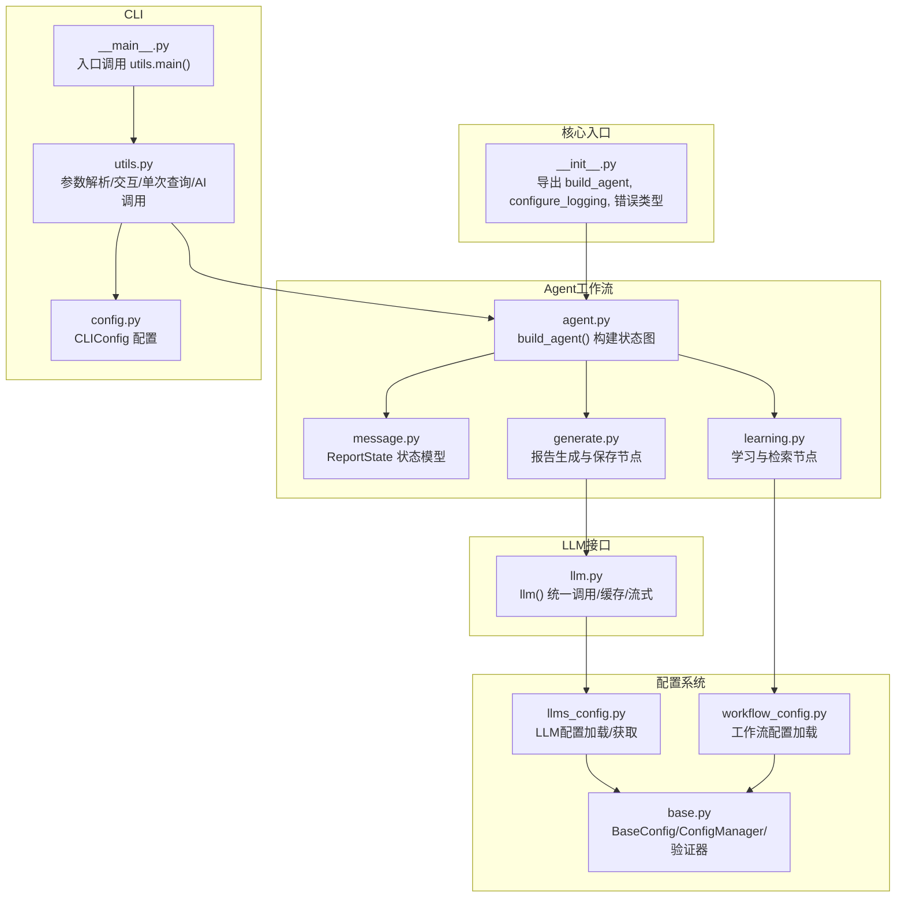
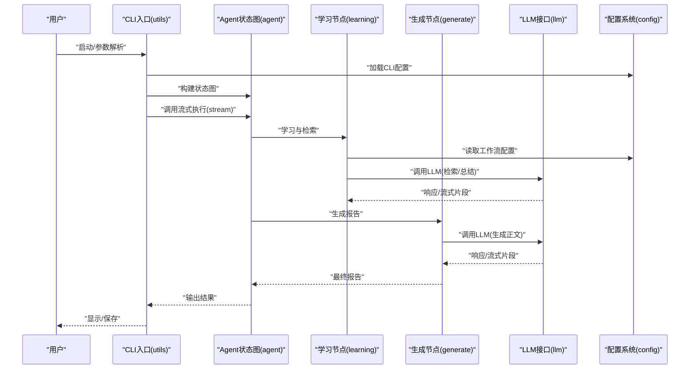
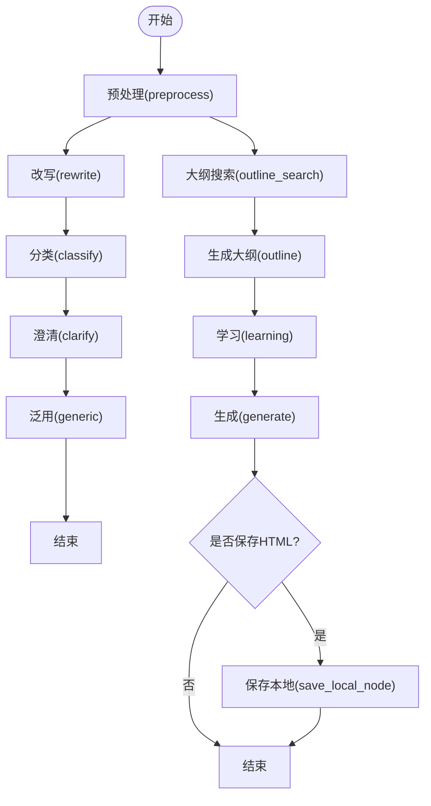
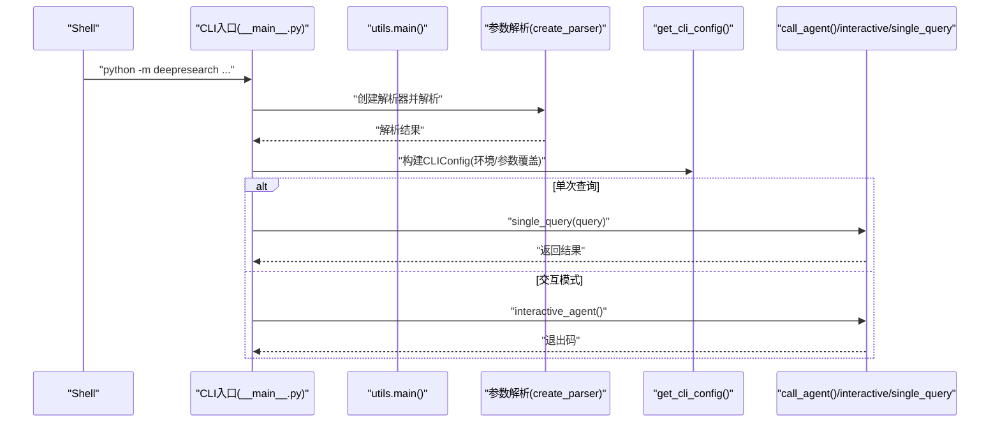
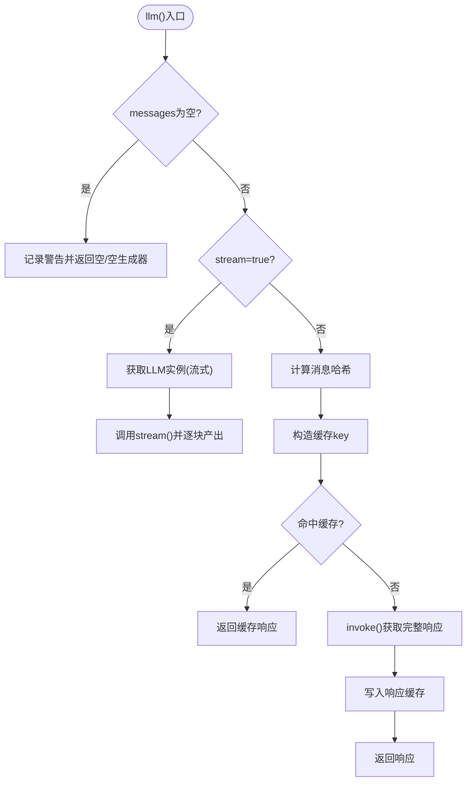
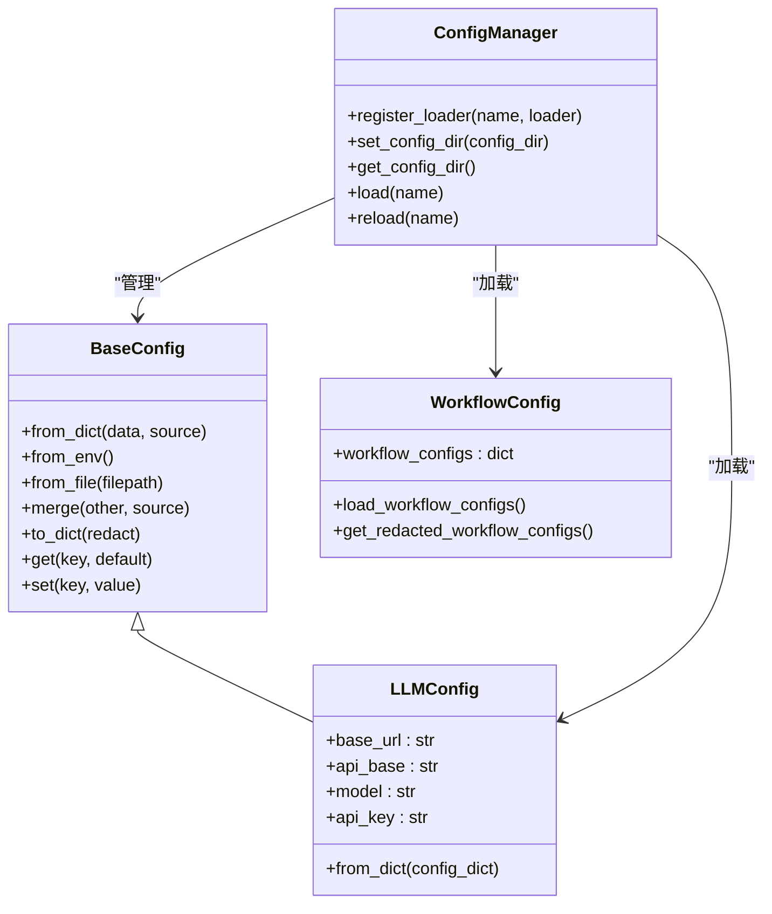
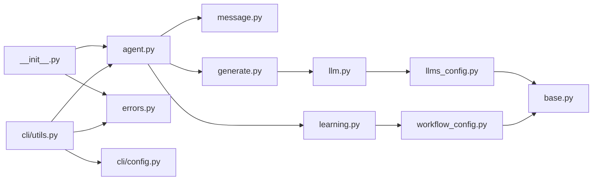

# API参考文档

<cite>
**本文档引用的文件**
- [src/deepresearch/__init__.py](file://src/deepresearch/__init__.py)
- [src/deepresearch/agent/agent.py](file://src/deepresearch/agent/agent.py)
- [src/deepresearch/agent/message.py](file://src/deepresearch/agent/message.py)
- [src/deepresearch/agent/generate.py](file://src/deepresearch/agent/generate.py)
- [src/deepresearch/agent/learning.py](file://src/deepresearch/agent/learning.py)
- [src/deepresearch/cli/__main__.py](file://src/deepresearch/cli/__main__.py)
- [src/deepresearch/cli/utils.py](file://src/deepresearch/cli/utils.py)
- [src/deepresearch/cli/config.py](file://src/deepresearch/cli/config.py)
- [src/deepresearch/llms/llm.py](file://src/deepresearch/llms/llm.py)
- [src/deepresearch/config/base.py](file://src/deepresearch/config/base.py)
- [src/deepresearch/config/llms_config.py](file://src/deepresearch/config/llms_config.py)
- [src/deepresearch/config/workflow_config.py](file://src/deepresearch/config/workflow_config.py)
- [src/deepresearch/errors.py](file://src/deepresearch/errors.py)
- [config/llms.toml](file://config/llms.toml)
- [config/workflow.toml](file://config/workflow.toml)
</cite>

## 目录
1. [简介](#简介)
2. [项目结构](#项目结构)
3. [核心组件](#核心组件)
4. [架构总览](#架构总览)
5. [详细组件分析](#详细组件分析)
6. [依赖分析](#依赖分析)
7. [性能考虑](#性能考虑)
8. [故障排除指南](#故障排除指南)
9. [结论](#结论)
10. [附录](#附录)

## 简介
本API参考文档面向DeepResearch项目的使用者与集成者，系统化梳理以下能力：
- Agent工作流API：基于LangGraph的状态图编排与节点执行接口
- CLI命令API：命令行入口、参数解析、交互与单次查询流程
- LLM接口API：统一的LLM调用封装、缓存与流式/非流式响应
- 配置API：配置读取、合并、验证与敏感信息脱敏
- 扩展点API：插件化配置加载器、钩子与事件机制（通过配置管理器暴露）
- 版本兼容性与迁移指南：基于当前实现的版本语义与迁移建议

## 项目结构
项目采用分层与功能域结合的组织方式：
- 核心入口与导出：在包级导出Agent构建器、日志配置与错误类型
- Agent工作流：以状态图为骨架，节点负责预处理、学习检索、大纲生成、报告生成与本地保存
- CLI：命令行入口、参数解析、交互UI、历史记录与Agent调用
- LLM接口：统一LLM工厂、实例缓存、响应缓存与流式处理
- 配置系统：通用配置基类、验证器、配置管理器与具体配置加载（LLM、工作流）

**图表来源**
- [src/deepresearch/__init__.py:1-30](file://src/deepresearch/__init__.py#L1-L30)
- [src/deepresearch/agent/agent.py:19-45](file://src/deepresearch/agent/agent.py#L19-L45)
- [src/deepresearch/agent/message.py:101-112](file://src/deepresearch/agent/message.py#L101-L112)
- [src/deepresearch/agent/learning.py:15-93](file://src/deepresearch/agent/learning.py#L15-L93)
- [src/deepresearch/agent/generate.py:26-123](file://src/deepresearch/agent/generate.py#L26-L123)
- [src/deepresearch/cli/__main__.py:1-7](file://src/deepresearch/cli/__main__.py#L1-L7)
- [src/deepresearch/cli/utils.py:485-575](file://src/deepresearch/cli/utils.py#L485-L575)
- [src/deepresearch/cli/config.py:15-101](file://src/deepresearch/cli/config.py#L15-L101)
- [src/deepresearch/llms/llm.py:146-266](file://src/deepresearch/llms/llm.py#L146-L266)
- [src/deepresearch/config/base.py:190-590](file://src/deepresearch/config/base.py#L190-L590)
- [src/deepresearch/config/llms_config.py:46-115](file://src/deepresearch/config/llms_config.py#L46-L115)
- [src/deepresearch/config/workflow_config.py:7-28](file://src/deepresearch/config/workflow_config.py#L7-L28)

**章节来源**
- [src/deepresearch/__init__.py:1-30](file://src/deepresearch/__init__.py#L1-L30)
- [src/deepresearch/agent/agent.py:19-45](file://src/deepresearch/agent/agent.py#L19-L45)
- [src/deepresearch/cli/__main__.py:1-7](file://src/deepresearch/cli/__main__.py#L1-L7)
- [src/deepresearch/llms/llm.py:146-266](file://src/deepresearch/llms/llm.py#L146-L266)
- [src/deepresearch/config/base.py:190-590](file://src/deepresearch/config/base.py#L190-L590)

## 核心组件
- Agent工作流API
  - 构建状态图：通过构建器函数返回编译后的状态图，定义节点与边
  - 状态模型：定义报告生成过程中的状态字段
- CLI命令API
  - 参数解析：支持查询模式、深度控制、输出格式、日志级别、主题、配置目录等
  - 交互模式：提供终端UI、历史记录、帮助与中断处理
  - 单次查询：直接返回Agent生成的文本结果
- LLM接口API
  - 统一调用：支持流式与非流式两种模式
  - 缓存策略：实例与响应两级缓存，线程安全
  - 错误处理：捕获并记录异常，保证健壮性
- 配置API
  - 通用配置：支持默认、文件、环境变量、代码四层覆盖
  - 验证器：范围、枚举、类型等内置校验
  - 脱敏与敏感键：自动识别敏感字段并支持动态增删
  - 配置管理器：集中注册加载器、设置/获取配置目录、缓存清理

**章节来源**
- [src/deepresearch/agent/agent.py:19-45](file://src/deepresearch/agent/agent.py#L19-L45)
- [src/deepresearch/agent/message.py:101-112](file://src/deepresearch/agent/message.py#L101-L112)
- [src/deepresearch/cli/utils.py:386-575](file://src/deepresearch/cli/utils.py#L386-L575)
- [src/deepresearch/llms/llm.py:146-266](file://src/deepresearch/llms/llm.py#L146-L266)
- [src/deepresearch/config/base.py:190-590](file://src/deepresearch/config/base.py#L190-L590)

## 架构总览
下图展示从CLI到Agent再到LLM的整体调用链路与关键扩展点。

**图表来源**
- [src/deepresearch/cli/utils.py:106-193](file://src/deepresearch/cli/utils.py#L106-L193)
- [src/deepresearch/agent/agent.py:19-45](file://src/deepresearch/agent/agent.py#L19-L45)
- [src/deepresearch/agent/learning.py:15-93](file://src/deepresearch/agent/learning.py#L15-L93)
- [src/deepresearch/agent/generate.py:26-123](file://src/deepresearch/agent/generate.py#L26-L123)
- [src/deepresearch/llms/llm.py:146-266](file://src/deepresearch/llms/llm.py#L146-L266)
- [src/deepresearch/config/workflow_config.py:7-28](file://src/deepresearch/config/workflow_config.py#L7-L28)

## 详细组件分析

### Agent工作流API
- 构建器
  - 名称：build_agent()
  - 返回：编译后的状态图对象
  - 功能：注册预处理、改写、分类、澄清、泛用、大纲搜索、大纲、学习、生成、本地保存等节点，并建立边与条件边
- 状态模型
  - 名称：ReportState
  - 关键字段：outline、messages、topic、domain、logic、details、output、knowledge、final_report、search_id
- 节点职责
  - 学习节点：并发执行深度检索，聚合知识并填充引用ID
  - 生成节点：逐章生成报告，支持流式输出与引用替换
  - 保存节点：根据配置保存Markdown与HTML报告

**图表来源**
- [src/deepresearch/agent/agent.py:19-45](file://src/deepresearch/agent/agent.py#L19-L45)
- [src/deepresearch/agent/message.py:101-112](file://src/deepresearch/agent/message.py#L101-L112)
- [src/deepresearch/agent/generate.py:114-160](file://src/deepresearch/agent/generate.py#L114-L160)

**章节来源**
- [src/deepresearch/agent/agent.py:19-45](file://src/deepresearch/agent/agent.py#L19-L45)
- [src/deepresearch/agent/message.py:101-112](file://src/deepresearch/agent/message.py#L101-L112)
- [src/deepresearch/agent/generate.py:26-123](file://src/deepresearch/agent/generate.py#L26-L123)
- [src/deepresearch/agent/learning.py:15-93](file://src/deepresearch/agent/learning.py#L15-L93)

### CLI命令API
- 入口与参数
  - 入口：命令行入口脚本调用utils.main()
  - 支持参数：查询(-q/--query)、深度(--depth)、禁用HTML(--no-html)、输出路径(-o/--output)、日志级别(--log-level)、日志文件(--log-file)、主题(--theme)、配置目录(--config-dir)、版本(-v/--version)
- 运行模式
  - 交互模式：提供帮助、清屏、历史查询、中断处理
  - 单次查询：直接返回Agent结果
- 异常与退出码
  - CLIError及其子类：配置错误、Agent执行错误、用户中断等
  - 信号处理：SIGINT/SIGTERM触发中断

**图表来源**
- [src/deepresearch/cli/__main__.py:1-7](file://src/deepresearch/cli/__main__.py#L1-L7)
- [src/deepresearch/cli/utils.py:386-575](file://src/deepresearch/cli/utils.py#L386-L575)
- [src/deepresearch/cli/config.py:66-101](file://src/deepresearch/cli/config.py#L66-L101)

**章节来源**
- [src/deepresearch/cli/__main__.py:1-7](file://src/deepresearch/cli/__main__.py#L1-L7)
- [src/deepresearch/cli/utils.py:386-575](file://src/deepresearch/cli/utils.py#L386-L575)
- [src/deepresearch/cli/config.py:15-101](file://src/deepresearch/cli/config.py#L15-L101)

### LLM接口API
- 统一调用
  - 函数：llm(llm_type, messages, stream=False)
  - 流式：返回生成器，逐块产出推理内容与正文
  - 非流式：返回完整字符串
- 缓存策略
  - 实例缓存：LRU缓存不同配置的LLM实例
  - 响应缓存：基于消息哈希的线程安全响应缓存
- 错误处理
  - 捕获invoke/stream异常并记录日志
  - 空消息与空响应进行告警与降级

**图表来源**
- [src/deepresearch/llms/llm.py:146-266](file://src/deepresearch/llms/llm.py#L146-L266)

**章节来源**
- [src/deepresearch/llms/llm.py:146-266](file://src/deepresearch/llms/llm.py#L146-L266)

### 配置API
- 通用配置基类
  - BaseConfig：支持from_dict/from_env/from_file/merge/to_dict/get/set
  - 验证器：RangeValidator、ChoiceValidator、TypeValidator
  - 敏感字段：支持默认敏感键集合与动态增删
- 配置管理器
  - ConfigManager：注册加载器、设置/获取配置目录、加载/重载配置、缓存清理
  - 全局函数：load_toml_config/redact_config/clear_config_cache
- 具体配置
  - LLM配置：llms.toml加载与LLMType枚举
  - 工作流配置：workflow.toml加载

**图表来源**
- [src/deepresearch/config/base.py:190-590](file://src/deepresearch/config/base.py#L190-L590)
- [src/deepresearch/config/llms_config.py:46-115](file://src/deepresearch/config/llms_config.py#L46-L115)
- [src/deepresearch/config/workflow_config.py:7-28](file://src/deepresearch/config/workflow_config.py#L7-L28)

**章节来源**
- [src/deepresearch/config/base.py:190-590](file://src/deepresearch/config/base.py#L190-L590)
- [src/deepresearch/config/llms_config.py:46-115](file://src/deepresearch/config/llms_config.py#L46-L115)
- [src/deepresearch/config/workflow_config.py:7-28](file://src/deepresearch/config/workflow_config.py#L7-L28)
- [config/llms.toml:1-29](file://config/llms.toml#L1-L29)
- [config/workflow.toml:1-3](file://config/workflow.toml#L1-L3)

### 扩展点API设计
- 插件接口
  - 配置加载器注册：通过ConfigManager.register_loader(name, loader)注册自定义加载器
  - 配置目录扩展：通过set_config_dir设置自定义目录，支持动态重载
- 钩子与事件
  - Agent节点作为扩展点：可在学习、生成、保存等节点插入自定义逻辑
  - CLI钩子：在交互模式中可扩展命令与UI行为
- 最佳实践
  - 使用ConfigManager集中管理配置加载与缓存
  - 在LLM调用前后增加日志与监控埋点
  - 通过LLMType枚举与配置文件解耦不同用途的模型

**章节来源**
- [src/deepresearch/config/base.py:373-456](file://src/deepresearch/config/base.py#L373-L456)
- [src/deepresearch/agent/learning.py:15-93](file://src/deepresearch/agent/learning.py#L15-L93)
- [src/deepresearch/agent/generate.py:114-160](file://src/deepresearch/agent/generate.py#L114-L160)

## 依赖分析
- 包级导出
  - 导出build_agent、日志配置、错误类型，供外部直接使用
- Agent依赖
  - 依赖消息状态模型、各节点实现与LLM接口
- CLI依赖
  - 依赖Agent构建器、CLI配置、异常体系与历史管理
- LLM依赖
  - 依赖配置系统提供的LLM配置与LangChain适配器
- 配置依赖
  - 依赖TOML解析与环境变量读取

**图表来源**
- [src/deepresearch/__init__.py:19-29](file://src/deepresearch/__init__.py#L19-L29)
- [src/deepresearch/agent/agent.py:6-16](file://src/deepresearch/agent/agent.py#L6-L16)
- [src/deepresearch/agent/generate.py:12-18](file://src/deepresearch/agent/generate.py#L12-L18)
- [src/deepresearch/agent/learning.py:8-12](file://src/deepresearch/agent/learning.py#L8-L12)
- [src/deepresearch/llms/llm.py:17-18](file://src/deepresearch/llms/llm.py#L17-L18)
- [src/deepresearch/config/llms_config.py:7-8](file://src/deepresearch/config/llms_config.py#L7-L8)
- [src/deepresearch/config/workflow_config.py:4](file://src/deepresearch/config/workflow_config.py#L4)
- [src/deepresearch/cli/utils.py:20-33](file://src/deepresearch/cli/utils.py#L20-L33)
- [src/deepresearch/cli/config.py:15-27](file://src/deepresearch/cli/config.py#L15-L27)

**章节来源**
- [src/deepresearch/__init__.py:19-29](file://src/deepresearch/__init__.py#L19-L29)
- [src/deepresearch/agent/agent.py:6-16](file://src/deepresearch/agent/agent.py#L6-L16)
- [src/deepresearch/cli/utils.py:20-33](file://src/deepresearch/cli/utils.py#L20-L33)

## 性能考虑
- LLM调用
  - 实例缓存：限制最大数量，避免重复创建开销
  - 响应缓存：基于消息哈希，命中率统计可用于优化
  - 流式输出：降低首帧延迟，提升交互体验
- 并发与限流
  - 学习节点使用线程池并发检索，最大工作者数受章节数量约束
  - 搜索深度与topN参数影响并发与LLM调用次数
- I/O与存储
  - 报告保存包含磁盘写入与HTML转换，建议合理设置保存路径与并发

**章节来源**
- [src/deepresearch/llms/llm.py:21-44](file://src/deepresearch/llms/llm.py#L21-L44)
- [src/deepresearch/llms/llm.py:68-121](file://src/deepresearch/llms/llm.py#L68-L121)
- [src/deepresearch/agent/learning.py:63-65](file://src/deepresearch/agent/learning.py#L63-L65)
- [src/deepresearch/agent/generate.py:125-160](file://src/deepresearch/agent/generate.py#L125-L160)

## 故障排除指南
- 配置相关
  - 配置文件解析失败/不可读：检查路径与权限；使用脱敏函数查看敏感信息
  - 环境变量格式错误：确认布尔/整数解析规则
- Agent执行
  - 构建失败：检查节点依赖与导入
  - 执行异常：查看日志与异常栈，必要时重试或调整参数
- LLM调用
  - 空响应/异常：检查网络、密钥与模型参数；启用非流式模式辅助定位
- CLI交互
  - 中断处理：Ctrl+C触发UserInterruptError，程序优雅退出
  - 历史记录：确认历史文件路径与容量限制

**章节来源**
- [src/deepresearch/config/base.py:459-471](file://src/deepresearch/config/base.py#L459-L471)
- [src/deepresearch/cli/utils.py:106-193](file://src/deepresearch/cli/utils.py#L106-L193)
- [src/deepresearch/llms/llm.py:215-240](file://src/deepresearch/llms/llm.py#L215-L240)
- [src/deepresearch/errors.py:4-26](file://src/deepresearch/errors.py#L4-L26)

## 结论
本API参考文档系统化梳理了DeepResearch的核心能力：Agent工作流、CLI命令、LLM接口与配置系统。通过统一的配置管理与扩展点设计，项目实现了良好的可维护性与可扩展性。建议在生产环境中结合缓存策略、并发控制与日志监控，确保稳定性与性能。

## 附录

### API清单与参数规格

- Agent工作流API
  - 构建器
    - 名称：build_agent()
    - 返回：编译后的状态图对象
    - 适用场景：构建研究工作流图谱
  - 状态模型
    - 名称：ReportState
    - 字段：outline、messages、topic、domain、logic、details、output、knowledge、final_report、search_id
- CLI命令API
  - 入口：utils.main(args)
  - 参数：
    - -q/--query：单次查询内容
    - -d/--depth：搜索深度(1-10)
    - --no-html：禁用HTML保存
    - -o/--output：报告输出路径
    - --log-level：日志级别
    - --log-file：日志文件路径
    - --theme：界面主题
    - --config-dir：配置目录
    - -v/--version：版本号
  - 返回：退出码
  - 异常：CLIError及其子类
- LLM接口API
  - 统一调用：llm(llm_type, messages, stream=False)
    - 参数：
      - llm_type：LLM类型(Literal)
      - messages：消息列表
      - stream：是否流式
    - 返回：
      - 非流式：字符串
      - 流式：生成器(推理内容, 正文)
    - 异常：内部捕获并记录
  - 辅助：get_cache_stats(), clear_cache()
- 配置API
  - 通用：BaseConfig.from_env/from_file/from_dict/merge/to_dict/get/set
  - 管理：ConfigManager.register_loader/load/reload/set_config_dir/get_config_dir
  - LLM：get_llm_configs()/get_redacted_llm_configs()
  - 工作流：load_workflow_configs()/get_redacted_workflow_configs()

**章节来源**
- [src/deepresearch/agent/agent.py:19-45](file://src/deepresearch/agent/agent.py#L19-L45)
- [src/deepresearch/agent/message.py:101-112](file://src/deepresearch/agent/message.py#L101-L112)
- [src/deepresearch/cli/utils.py:386-575](file://src/deepresearch/cli/utils.py#L386-L575)
- [src/deepresearch/llms/llm.py:146-266](file://src/deepresearch/llms/llm.py#L146-L266)
- [src/deepresearch/config/base.py:190-590](file://src/deepresearch/config/base.py#L190-L590)
- [src/deepresearch/config/llms_config.py:46-115](file://src/deepresearch/config/llms_config.py#L46-L115)
- [src/deepresearch/config/workflow_config.py:7-28](file://src/deepresearch/config/workflow_config.py#L7-L28)

### 使用示例与最佳实践
- 使用示例
  - CLI单次查询：使用参数-q直接获取结果
  - CLI交互模式：进入对话界面，支持help/history/search等命令
  - Agent工作流：通过build_agent()获取图谱，传入messages与configurable参数
  - LLM调用：选择合适llm_type，传入消息列表，按需开启流式
  - 配置读取：优先环境变量，其次文件，最后默认值
- 最佳实践
  - 合理设置搜索深度与topN，平衡质量与成本
  - 使用流式输出提升交互体验
  - 对敏感配置进行脱敏输出
  - 利用缓存减少重复请求，关注命中率

**章节来源**
- [src/deepresearch/cli/utils.py:357-384](file://src/deepresearch/cli/utils.py#L357-L384)
- [src/deepresearch/agent/agent.py:136-144](file://src/deepresearch/agent/agent.py#L136-L144)
- [src/deepresearch/llms/llm.py:146-184](file://src/deepresearch/llms/llm.py#L146-L184)
- [src/deepresearch/config/base.py:487-510](file://src/deepresearch/config/base.py#L487-L510)

### 版本兼容性与迁移指南
- 版本语义
  - 当前CLI版本号已在参数解析中声明，遵循语义化版本
- 迁移建议
  - 配置目录变更：通过--config-dir或环境变量DEEPRESEARCH_CONFIG_DIR指定
  - 配置加载顺序：代码参数 > 环境变量 > 配置文件 > 默认值
  - LLM配置：通过llms.toml维护，支持重新加载与脱敏输出
  - 工作流配置：通过workflow.toml维护，支持读取与脱敏

**章节来源**
- [src/deepresearch/cli/utils.py:476-482](file://src/deepresearch/cli/utils.py#L476-L482)
- [src/deepresearch/cli/utils.py:500-507](file://src/deepresearch/cli/utils.py#L500-L507)
- [src/deepresearch/config/llms_config.py:70-85](file://src/deepresearch/config/llms_config.py#L70-L85)
- [src/deepresearch/config/workflow_config.py:27](file://src/deepresearch/config/workflow_config.py#L27)