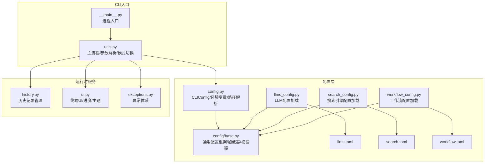
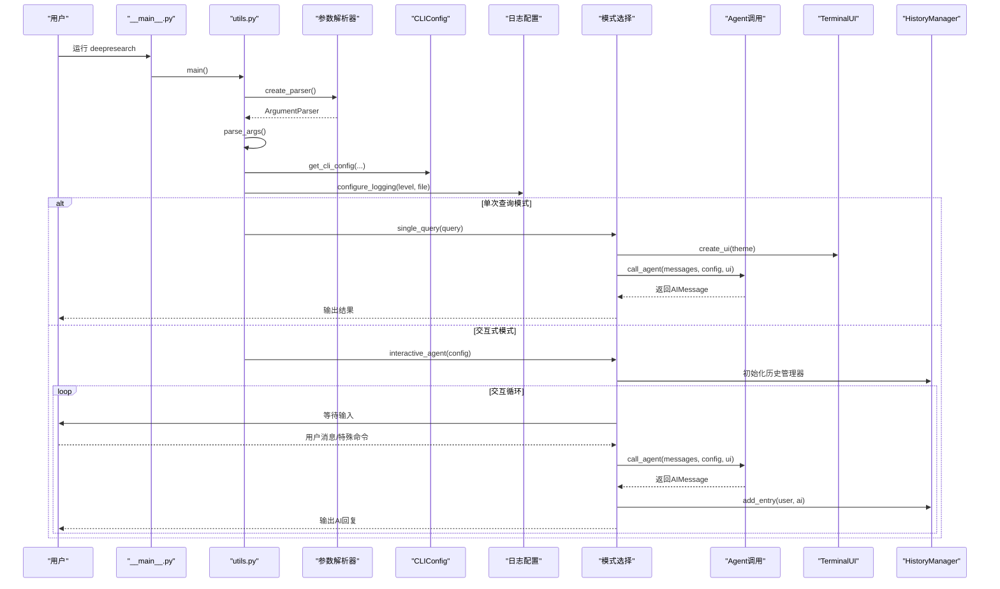
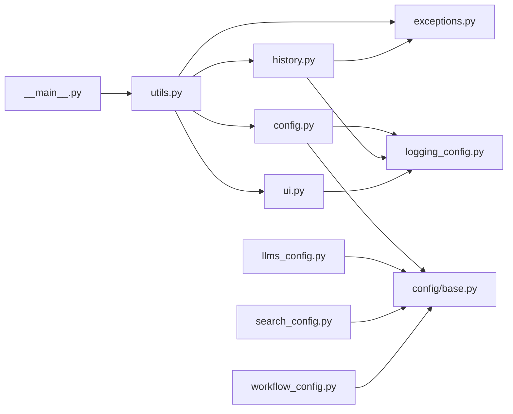

# CLI命令API

<cite>
**本文引用的文件**
- [src/deepresearch/cli/__main__.py](file://src/deepresearch/cli/__main__.py)
- [src/deepresearch/cli/utils.py](file://src/deepresearch/cli/utils.py)
- [src/deepresearch/cli/config.py](file://src/deepresearch/cli/config.py)
- [src/deepresearch/cli/history.py](file://src/deepresearch/cli/history.py)
- [src/deepresearch/cli/ui.py](file://src/deepresearch/cli/ui.py)
- [src/deepresearch/cli/exceptions.py](file://src/deepresearch/cli/exceptions.py)
- [src/deepresearch/config/base.py](file://src/deepresearch/config/base.py)
- [src/deepresearch/config/llms_config.py](file://src/deepresearch/config/llms_config.py)
- [src/deepresearch/config/search_config.py](file://src/deepresearch/config/search_config.py)
- [src/deepresearch/config/workflow_config.py](file://src/deepresearch/config/workflow_config.py)
- [config/llms.toml](file://config/llms.toml)
- [config/search.toml](file://config/search.toml)
- [config/workflow.toml](file://config/workflow.toml)
- [tests/unit/cli/test_main.py](file://tests/unit/cli/test_main.py)
- [tests/unit/cli/test_config.py](file://tests/unit/cli/test_config.py)
</cite>

## 目录
1. [简介](#简介)
2. [项目结构](#项目结构)
3. [核心组件](#核心组件)
4. [架构总览](#架构总览)
5. [详细组件分析](#详细组件分析)
6. [依赖分析](#依赖分析)
7. [性能考虑](#性能考虑)
8. [故障排查指南](#故障排查指南)
9. [结论](#结论)
10. [附录](#附录)

## 简介
本文件为 DeepResearch CLI 命令行接口的权威参考文档，涵盖主命令入口、配置管理、历史记录与UI组件API。文档面向开发者与运维人员，提供命令参数规格、选项组合、返回值说明、使用示例与最佳实践，并包含配置API、历史记录管理API以及UI组件接口规范，同时给出扩展接口与自定义命令开发指南。

## 项目结构
CLI相关代码位于 src/deepresearch/cli 目录，核心模块包括：
- 命令入口与主流程：__main__.py、utils.py
- 配置管理：config.py（CLI配置）、config/base.py（通用配置框架）
- 历史记录：history.py
- UI组件：ui.py
- 异常体系：exceptions.py
- 配置文件与加载：config/*.toml 与对应加载模块

图表来源
- [src/deepresearch/cli/__main__.py:1-7](file://src/deepresearch/cli/__main__.py#L1-L7)
- [src/deepresearch/cli/utils.py:1-575](file://src/deepresearch/cli/utils.py#L1-L575)
- [src/deepresearch/cli/config.py:1-101](file://src/deepresearch/cli/config.py#L1-L101)
- [src/deepresearch/config/base.py:1-590](file://src/deepresearch/config/base.py#L1-L590)
- [src/deepresearch/config/llms_config.py:1-115](file://src/deepresearch/config/llms_config.py#L1-L115)
- [src/deepresearch/config/search_config.py:1-82](file://src/deepresearch/config/search_config.py#L1-L82)
- [src/deepresearch/config/workflow_config.py:1-28](file://src/deepresearch/config/workflow_config.py#L1-L28)
- [src/deepresearch/cli/history.py:1-166](file://src/deepresearch/cli/history.py#L1-L166)
- [src/deepresearch/cli/ui.py:1-382](file://src/deepresearch/cli/ui.py#L1-L382)
- [src/deepresearch/cli/exceptions.py:1-58](file://src/deepresearch/cli/exceptions.py#L1-L58)

章节来源
- [src/deepresearch/cli/__main__.py:1-7](file://src/deepresearch/cli/__main__.py#L1-L7)
- [src/deepresearch/cli/utils.py:386-575](file://src/deepresearch/cli/utils.py#L386-L575)

## 核心组件
- 命令入口与主流程：负责参数解析、模式选择（单次查询/交互式）、日志配置、信号处理与异常捕获。
- CLI配置：封装CLI运行时参数，支持环境变量覆盖、路径解析、范围约束与调试日志。
- 历史记录：提供历史条目的增删查统计能力，支持会话隔离与持久化。
- UI组件：终端输出格式化、主题、进度条、旋转指示器等。
- 配置API：基于通用配置框架，支持文件/环境变量/代码合并加载，含敏感信息脱敏与缓存控制。
- 异常体系：统一CLI错误类型与退出码，便于上层脚本与自动化处理。

章节来源
- [src/deepresearch/cli/utils.py:106-303](file://src/deepresearch/cli/utils.py#L106-L303)
- [src/deepresearch/cli/config.py:15-101](file://src/deepresearch/cli/config.py#L15-L101)
- [src/deepresearch/cli/history.py:18-166](file://src/deepresearch/cli/history.py#L18-L166)
- [src/deepresearch/cli/ui.py:66-382](file://src/deepresearch/cli/ui.py#L66-L382)
- [src/deepresearch/config/base.py:190-590](file://src/deepresearch/config/base.py#L190-L590)

## 架构总览
CLI启动流程概览如下：

图表来源
- [src/deepresearch/cli/__main__.py:1-7](file://src/deepresearch/cli/__main__.py#L1-L7)
- [src/deepresearch/cli/utils.py:386-575](file://src/deepresearch/cli/utils.py#L386-L575)
- [src/deepresearch/cli/config.py:66-101](file://src/deepresearch/cli/config.py#L66-L101)
- [src/deepresearch/cli/history.py:38-166](file://src/deepresearch/cli/history.py#L38-L166)
- [src/deepresearch/cli/ui.py:364-382](file://src/deepresearch/cli/ui.py#L364-L382)

## 详细组件分析

### 命令行接口与主流程
- 主入口：通过 __main__.py 调用 utils.main()，实现进程退出码传递。
- 参数解析：create_parser() 定义全部命令行参数与帮助信息，支持示例与环境变量说明。
- 模式切换：根据 -q/--query 是否存在决定单次查询或交互式模式；支持 --version 打印版本。
- 配置目录：--config-dir/-c 支持自定义配置目录，内部通过配置管理器与LLM配置重载机制生效。
- 日志：支持 --log-level 与 --log-file，统一由 configure_logging 生效。
- 信号处理：注册 SIGINT/SIGTERM，优雅中断Agent执行。

参数规格与选项组合
- -q, --query：字符串，单次查询模式必填。
- -d, --depth：整数，范围1-10，默认3。
- --no-html：布尔标志，禁用HTML报告保存。
- -o, --output：字符串，报告输出路径。
- --log-level：字符串，可选DEBUG/INFO/WARNING/ERROR/CRITICAL。
- --log-file：字符串，日志文件路径。
- --theme：字符串，可选default/minimal/colorful。
- -c, --config-dir：字符串，自定义配置目录路径。
- -v, --version：版本号输出。
- 示例与环境变量说明在帮助中提供。

返回值
- 退出码：0表示成功；130表示用户中断；其他错误对应不同CLI错误类型。

最佳实践
- 在CI/CD中使用 -q 模式进行批量化查询，结合 --log-level=INFO 或 DEBUG 控制日志。
- 使用 --config-dir 指定隔离配置，避免污染用户主目录。
- 交互式模式下使用 Ctrl+C 中断当前Agent处理，使用 Ctrl+D 退出程序。

章节来源
- [src/deepresearch/cli/utils.py:386-575](file://src/deepresearch/cli/utils.py#L386-L575)
- [src/deepresearch/cli/__main__.py:1-7](file://src/deepresearch/cli/__main__.py#L1-L7)
- [tests/unit/cli/test_main.py:62-143](file://tests/unit/cli/test_main.py#L62-L143)
- [tests/unit/cli/test_main.py:230-270](file://tests/unit/cli/test_main.py#L230-L270)

### 配置管理API
CLI配置
- CLIConfig 数据类封装运行时参数，包含：
  - max_depth：深度限制，范围[1,10]，默认3。
  - save_as_html：是否保存HTML，默认true。
  - save_path：报告保存路径，支持 ~ 展开与绝对路径解析。
  - log_level/log_file：日志级别与文件。
  - history_file：历史文件路径，可为空。
  - max_history：最大历史条目数，范围[10,1000]。
  - stream_output：是否流式输出。
  - timeout：超时秒数，范围[30,3600]。
  - theme：主题default/minimal/colorful。
  - config_dir：配置目录，可为空，为空时默认 ~/.deepresearch。
- 环境变量覆盖：CLIConfig.from_env() 从 DEEPRESEARCH_* 环境变量加载，支持布尔/整数解析。
- 路径解析：get_save_path()/get_history_path()/get_config_dir() 统一处理 ~ 展开与绝对路径。
- get_cli_config()：支持参数覆盖环境变量，返回最终配置对象。

通用配置框架
- BaseConfig：提供 from_env/from_file/from_dict/merge/to_dict/get/set 等统一接口。
- ConfigManager：集中管理配置目录、加载器注册与缓存清理。
- 配置加载顺序（高到低）：代码参数 > 环境变量 > 配置文件 > 默认值。
- 敏感信息脱敏：redact_config() 隐藏包含敏感关键字的字段。
- 缓存控制：clear_config_cache() 用于动态更新配置文件场景。

LLM/搜索/工作流配置
- LLM配置：llms.toml -> BaseLLMConfig，提供 get_*_llm() 访问器。
- 搜索配置：search.toml -> SearchConfig，含引擎、API密钥与超时。
- 工作流配置：workflow.toml -> 字典配置。

章节来源
- [src/deepresearch/cli/config.py:15-101](file://src/deepresearch/cli/config.py#L15-L101)
- [src/deepresearch/config/base.py:190-590](file://src/deepresearch/config/base.py#L190-L590)
- [src/deepresearch/config/llms_config.py:46-115](file://src/deepresearch/config/llms_config.py#L46-L115)
- [src/deepresearch/config/search_config.py:56-82](file://src/deepresearch/config/search_config.py#L56-L82)
- [src/deepresearch/config/workflow_config.py:7-28](file://src/deepresearch/config/workflow_config.py#L7-L28)
- [config/llms.toml:1-29](file://config/llms.toml#L1-L29)
- [config/search.toml:1-6](file://config/search.toml#L1-L6)
- [config/workflow.toml:1-3](file://config/workflow.toml#L1-L3)

### 历史记录管理API
- 数据模型：HistoryEntry 包含时间戳、用户输入、AI响应与可选会话ID。
- 管理器：HistoryManager 支持：
  - add_entry(user_input, response)：新增条目并截断至max_entries，异步保存。
  - get_recent(count)：获取最近N条。
  - get_session_history(session_id)：按会话过滤。
  - search(keyword)：关键词模糊检索（大小写不敏感）。
  - clear()：清空历史文件（若存在）。
  - get_stats()：统计总数、会话数与首末条时间。
- 默认路径：Windows使用 APPDATA，类Unix使用 XDG_DATA_HOME 或 ~/.local/share，目录 deepresearch 下 history.json。

使用方式
- 交互式模式：每次AI回复后自动追加历史。
- 历史查看：history 命令显示最近条目；search <关键词> 进行检索。
- 清理：clear 命令清空当前对话；clear 命令不会影响历史文件。

章节来源
- [src/deepresearch/cli/history.py:18-166](file://src/deepresearch/cli/history.py#L18-L166)

### UI组件API
- TerminalUI：终端输出格式化与主题渲染
  - 主题：default/minimal/colorful，自动检测终端颜色支持与宽度。
  - 文本样式：style(text, color, bg_color, bold, dim, italic, underline)。
  - 输出：print/print_header/print_success/print_error/print_warning/print_info。
  - 进度：print_progress(message, step, total)，支持彩色主题。
  - 行操作：clear_line。
  - 动画：spinner 上下文管理器，显示旋转指示器。
- ProgressTracker：多步骤任务进度跟踪，与TerminalUI配合使用。
- 工厂：create_ui(theme) 创建UI实例。

最佳实践
- 在彩色主题下使用 print_success/print_error 等语义化输出。
- 使用 spinner 包裹耗时操作，提升用户体验。
- 结合 print_progress 实现分阶段进度展示。

章节来源
- [src/deepresearch/cli/ui.py:66-382](file://src/deepresearch/cli/ui.py#L66-L382)

### 异常与错误处理
- CLIError：CLI错误基类，携带 exit_code。
- ConfigurationError：配置错误，exit_code=2。
- UserInterruptError：用户中断，exit_code=130。
- AgentExecutionError：Agent执行失败，exit_code=3。
- ValidationError：输入验证错误，exit_code=4。
- FileOperationError：文件操作错误，exit_code=5。

处理策略
- main() 捕获 CLIError 并返回对应退出码。
- 交互式模式中，Agent执行异常会回滚最后一条人类消息并继续对话。
- 历史保存失败仅记录警告，不影响主流程。

章节来源
- [src/deepresearch/cli/exceptions.py:13-58](file://src/deepresearch/cli/exceptions.py#L13-L58)
- [src/deepresearch/cli/utils.py:106-193](file://src/deepresearch/cli/utils.py#L106-L193)
- [src/deepresearch/cli/history.py:72-90](file://src/deepresearch/cli/history.py#L72-L90)

## 依赖分析
- CLI入口依赖 utils 主流程；utils 依赖 CLIConfig、HistoryManager、TerminalUI、异常体系与配置管理器。
- CLIConfig 依赖日志配置；HistoryManager 依赖异常体系与日志配置。
- UI组件独立，依赖日志配置。
- 配置API依赖通用配置框架与各子配置加载模块。

图表来源
- [src/deepresearch/cli/__main__.py:1-7](file://src/deepresearch/cli/__main__.py#L1-L7)
- [src/deepresearch/cli/utils.py:20-34](file://src/deepresearch/cli/utils.py#L20-L34)
- [src/deepresearch/cli/config.py:10](file://src/deepresearch/cli/config.py#L10)
- [src/deepresearch/cli/history.py:12](file://src/deepresearch/cli/history.py#L12)
- [src/deepresearch/cli/ui.py:17](file://src/deepresearch/cli/ui.py#L17)
- [src/deepresearch/config/base.py:1-12](file://src/deepresearch/config/base.py#L1-L12)

章节来源
- [src/deepresearch/cli/utils.py:10-34](file://src/deepresearch/cli/utils.py#L10-L34)

## 性能考虑
- 流式输出：stream_output=true 时，Agent逐步输出中间结果，降低感知延迟。
- 超时控制：timeout 控制Agent整体超时，避免长时间阻塞。
- 历史截断：max_history 控制内存与IO压力，避免无限增长。
- 缓存：配置文件读取使用LRU缓存，动态更新需调用 clear_config_cache。
- 终端渲染：彩色主题与进度条在支持ANSI的终端上效果最佳，弱网或远程终端可切换 minimal 主题。

## 故障排查指南
常见问题与定位
- 配置目录无效：validate_config_dir 抛出 ConfigurationError，检查路径存在、可读且为目录。
- 环境变量解析失败：CLIConfig.from_env() 对布尔/整数解析失败时抛异常，检查 DEEPRESEARCH_* 变量。
- Agent执行失败：捕获 AgentExecutionError，查看日志定位具体步骤。
- 历史保存失败：FileOperationError，不影响主流程，检查磁盘权限与路径。
- 用户中断：UserInterruptError，exit_code=130，确认信号处理正常。

章节来源
- [src/deepresearch/cli/utils.py:41-67](file://src/deepresearch/cli/utils.py#L41-L67)
- [src/deepresearch/cli/exceptions.py:21-58](file://src/deepresearch/cli/exceptions.py#L21-L58)
- [src/deepresearch/cli/history.py:72-90](file://src/deepresearch/cli/history.py#L72-L90)

## 结论
DeepResearch CLI 提供了完整的一站式命令行体验：参数化配置、交互式对话、单次查询、历史记录与丰富的UI主题。通过通用配置框架与严格的异常体系，CLI具备良好的可维护性与可扩展性。建议在生产环境中结合配置目录、日志与超时参数，确保稳定性与可观测性。

## 附录

### 命令与参数速查
- deepresearch [-q QUERY] [-d N] [--no-html] [-o PATH] [--log-level LEVEL] [--log-file PATH] [--theme STYLE] [-c PATH] [-v]
- 示例：deepresearch -q "人工智能的发展趋势" --depth 5 --no-html
- 环境变量：DEEPRESEARCH_* 前缀覆盖CLI参数

章节来源
- [src/deepresearch/cli/utils.py:386-482](file://src/deepresearch/cli/utils.py#L386-L482)

### 配置文件与加载
- llms.toml：LLM基础配置（base_url、api_base、model、api_key）
- search.toml：搜索引擎配置（engine、jina_api_key、tavily_api_key、timeout）
- workflow.toml：工作流参数（如 topN）

章节来源
- [config/llms.toml:1-29](file://config/llms.toml#L1-L29)
- [config/search.toml:1-6](file://config/search.toml#L1-L6)
- [config/workflow.toml:1-3](file://config/workflow.toml#L1-L3)

### 扩展接口与自定义命令开发指南
- 扩展点
  - 自定义配置目录：--config-dir 指向新目录，内部通过 config_manager.set_config_dir 与 reload_llm_configs 生效。
  - 自定义主题：继承 TerminalUI 或使用 create_ui(theme) 切换主题。
  - 历史记录：HistoryManager 可直接复用，或扩展 add_entry 的存储策略。
- 开发建议
  - 保持参数与环境变量命名一致，便于用户迁移。
  - 使用统一异常体系，保证上层脚本可正确处理退出码。
  - 对外部资源访问增加超时与重试策略，结合日志定位问题。

章节来源
- [src/deepresearch/cli/utils.py:497-509](file://src/deepresearch/cli/utils.py#L497-L509)
- [src/deepresearch/config/base.py:383-409](file://src/deepresearch/config/base.py#L383-L409)
- [src/deepresearch/config/llms_config.py:70-85](file://src/deepresearch/config/llms_config.py#L70-L85)