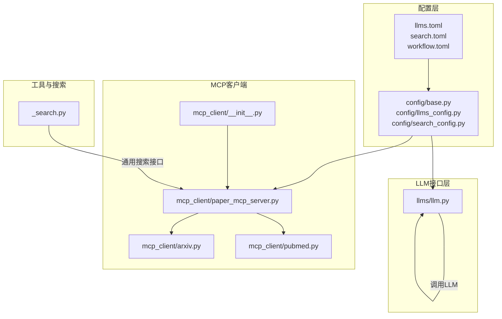
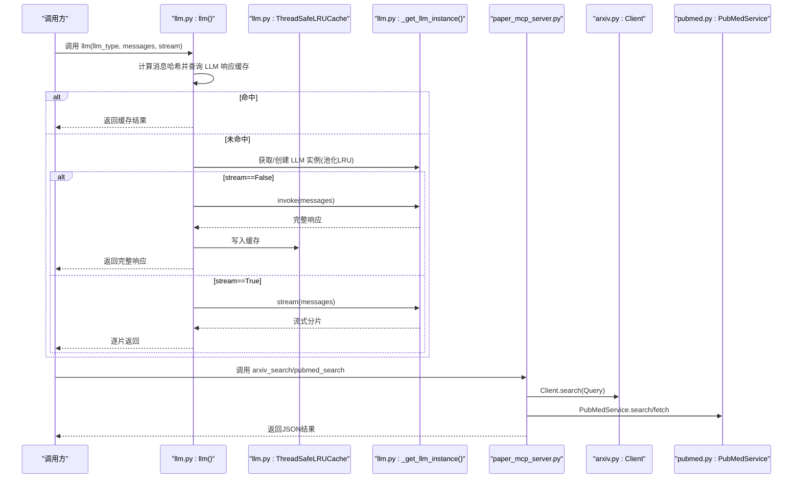
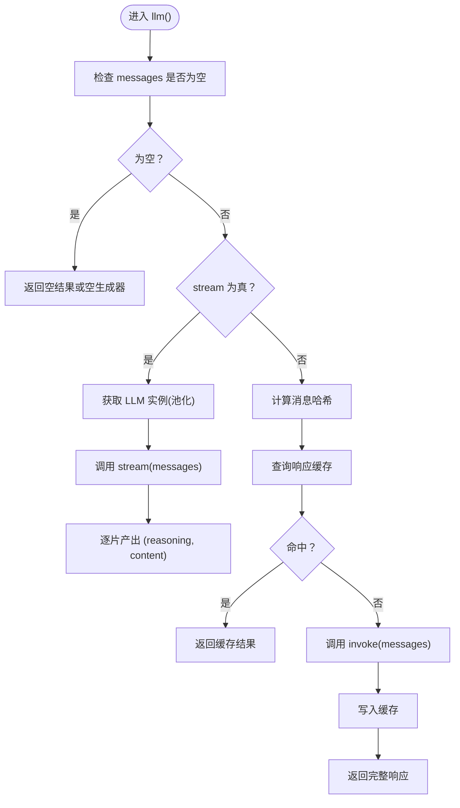
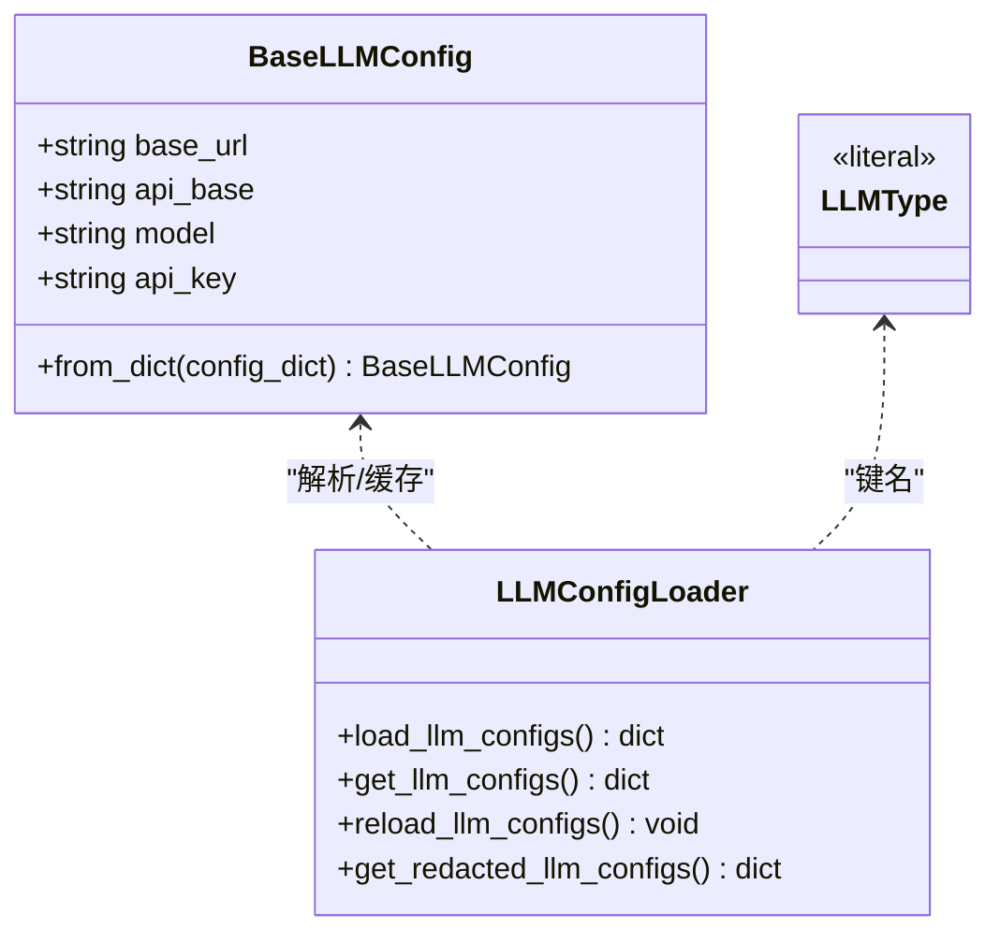
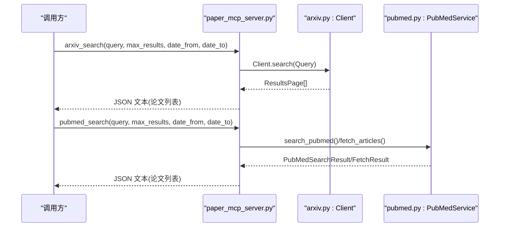
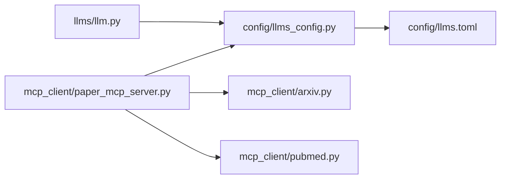

# LLM接口API

<cite>
**本文引用的文件**
- [src/deepresearch/llms/llm.py](file://src/deepresearch/llms/llm.py)
- [src/deepresearch/config/llms_config.py](file://src/deepresearch/config/llms_config.py)
- [config/llms.toml](file://config/llms.toml)
- [src/deepresearch/mcp_client/arxiv.py](file://src/deepresearch/mcp_client/arxiv.py)
- [src/deepresearch/mcp_client/pubmed.py](file://src/deepresearch/mcp_client/pubmed.py)
- [src/deepresearch/mcp_client/paper_mcp_server.py](file://src/deepresearch/mcp_client/paper_mcp_server.py)
- [src/deepresearch/mcp_client/__init__.py](file://src/deepresearch/mcp_client/__init__.py)
- [src/deepresearch/config/search_config.py](file://src/deepresearch/config/search_config.py)
- [src/deepresearch/tools/_search.py](file://src/deepresearch/tools/_search.py)
- [src/deepresearch/errors.py](file://src/deepresearch/errors.py)
- [src/deepresearch/logging_config.py](file://src/deepresearch/logging_config.py)
- [src/deepresearch/config/base.py](file://src/deepresearch/config/base.py)
- [config/workflow.toml](file://config/workflow.toml)
- [tests/unit/llms/test_llm.py](file://tests/unit/llms/test_llm.py)
- [tests/unit/mcp_client/test_mcp.py](file://tests/unit/mcp_client/test_mcp.py)
</cite>

## 目录
1. [简介](#简介)
2. [项目结构](#项目结构)
3. [核心组件](#核心组件)
4. [架构总览](#架构总览)
5. [详细组件分析](#详细组件分析)
6. [依赖分析](#依赖分析)
7. [性能考虑](#性能考虑)
8. [故障排查指南](#故障排查指南)
9. [结论](#结论)
10. [附录](#附录)

## 简介
本文件为 DeepResearch 的 LLM 接口 API 参考文档，聚焦以下目标：
- 统一 LLM 调用接口的 API 规范：LLM 类的方法定义、参数与返回值类型
- 缓存机制 API：缓存配置、策略与失效处理
- 错误处理与重试机制的 API 接口
- 多模型支持的 API 设计：不同 LLM 提供商的适配接口
- MCP 客户端 API 使用指南：arxiv 与 pubmed 搜索客户端的接口规范
- LLM 调用的性能优化与监控接口
- 提供具体代码示例路径，展示如何正确使用 LLM API

## 项目结构
本项目围绕“配置驱动 + 统一接口 + 多源搜索 + MCP 工具”的架构组织，LLM 接口位于 llms 子模块，配置由 toml 文件与配置管理模块加载，MCP 客户端提供 arxiv/pubmed 的检索与阅读能力。

**图表来源**
- [config/llms.toml:1-29](file://config/llms.toml#L1-L29)
- [src/deepresearch/config/llms_config.py:46-86](file://src/deepresearch/config/llms_config.py#L46-L86)
- [src/deepresearch/llms/llm.py:24-66](file://src/deepresearch/llms/llm.py#L24-L66)
- [src/deepresearch/mcp_client/paper_mcp_server.py:32-33](file://src/deepresearch/mcp_client/paper_mcp_server.py#L32-L33)
- [src/deepresearch/mcp_client/arxiv.py:208-228](file://src/deepresearch/mcp_client/arxiv.py#L208-L228)
- [src/deepresearch/mcp_client/pubmed.py:65-74](file://src/deepresearch/mcp_client/pubmed.py#L65-L74)
- [src/deepresearch/tools/_search.py:20-35](file://src/deepresearch/tools/_search.py#L20-L35)

**章节来源**
- [config/llms.toml:1-29](file://config/llms.toml#L1-L29)
- [src/deepresearch/config/llms_config.py:46-86](file://src/deepresearch/config/llms_config.py#L46-L86)
- [src/deepresearch/llms/llm.py:24-66](file://src/deepresearch/llms/llm.py#L24-L66)
- [src/deepresearch/mcp_client/paper_mcp_server.py:32-33](file://src/deepresearch/mcp_client/paper_mcp_server.py#L32-L33)
- [src/deepresearch/mcp_client/arxiv.py:208-228](file://src/deepresearch/mcp_client/arxiv.py#L208-L228)
- [src/deepresearch/mcp_client/pubmed.py:65-74](file://src/deepresearch/mcp_client/pubmed.py#L65-L74)
- [src/deepresearch/tools/_search.py:20-35](file://src/deepresearch/tools/_search.py#L20-L35)

## 核心组件
- LLM 统一接口：提供非流式与流式两种响应模式，内置消息哈希缓存与 LLM 实例池化缓存
- 配置系统：基于 toml 的 LLM 配置加载与脱敏，支持多模型类型标识
- MCP 客户端：封装 arxiv 与 pubmed 的搜索与阅读流程，提供同步与异步接口
- 搜索工具：统一的搜索结果数据结构与基础搜索客户端接口
- 错误与日志：统一异常类型与日志配置

**章节来源**
- [src/deepresearch/llms/llm.py:146-185](file://src/deepresearch/llms/llm.py#L146-L185)
- [src/deepresearch/config/llms_config.py:88-115](file://src/deepresearch/config/llms_config.py#L88-L115)
- [src/deepresearch/mcp_client/arxiv.py:330-392](file://src/deepresearch/mcp_client/arxiv.py#L330-L392)
- [src/deepresearch/mcp_client/pubmed.py:107-284](file://src/deepresearch/mcp_client/pubmed.py#L107-L284)
- [src/deepresearch/tools/_search.py:8-35](file://src/deepresearch/tools/_search.py#L8-L35)
- [src/deepresearch/errors.py:4-26](file://src/deepresearch/errors.py#L4-L26)
- [src/deepresearch/logging_config.py:15-67](file://src/deepresearch/logging_config.py#L15-L67)

## 架构总览
下图展示了 LLM 调用、缓存与 MCP 客户端之间的交互关系。

**图表来源**
- [src/deepresearch/llms/llm.py:146-185](file://src/deepresearch/llms/llm.py#L146-L185)
- [src/deepresearch/llms/llm.py:123-185](file://src/deepresearch/llms/llm.py#L123-L185)
- [src/deepresearch/mcp_client/paper_mcp_server.py:96-104](file://src/deepresearch/mcp_client/paper_mcp_server.py#L96-L104)
- [src/deepresearch/mcp_client/paper_mcp_server.py:178-249](file://src/deepresearch/mcp_client/paper_mcp_server.py#L178-L249)
- [src/deepresearch/mcp_client/arxiv.py:330-392](file://src/deepresearch/mcp_client/arxiv.py#L330-L392)
- [src/deepresearch/mcp_client/pubmed.py:107-284](file://src/deepresearch/mcp_client/pubmed.py#L107-L284)

## 详细组件分析

### LLM 统一接口 API
- 方法定义
  - llm(llm_type: LLMType, messages: list[HumanMessage | AIMessage | SystemMessage], stream: bool = False) -> Generator[str] | str
    - 功能：根据消息列表生成 LLM 响应；stream=False 返回完整字符串；stream=True 返回分片迭代器
    - 参数：
      - llm_type：LLM 类型标识，取值来自 LLMType
      - messages：消息列表，包含 System/Human/AI 消息
      - stream：是否启用流式输出
    - 返回：
      - 非流式：完整响应字符串
      - 流式：每次产出 (reasoning_content, content) 元组
- 缓存机制
  - 响应缓存：基于消息内容哈希的 LRU 缓存，线程安全，容量上限可配置
  - 实例缓存：LLM 实例池化缓存，最大容量固定，避免重复创建
- 错误处理
  - invoke/stream 异常会被捕获并记录日志，非流式返回空串，流式返回空生成器
- 性能与监控
  - 提供 get_cache_stats() 获取命中率与统计信息
  - 提供 clear_cache() 清理响应缓存与实例缓存

**图表来源**
- [src/deepresearch/llms/llm.py:146-185](file://src/deepresearch/llms/llm.py#L146-L185)
- [src/deepresearch/llms/llm.py:123-185](file://src/deepresearch/llms/llm.py#L123-L185)
- [src/deepresearch/llms/llm.py:219-256](file://src/deepresearch/llms/llm.py#L219-L256)

**章节来源**
- [src/deepresearch/llms/llm.py:146-185](file://src/deepresearch/llms/llm.py#L146-L185)
- [src/deepresearch/llms/llm.py:219-256](file://src/deepresearch/llms/llm.py#L219-L256)
- [src/deepresearch/llms/llm.py:258-266](file://src/deepresearch/llms/llm.py#L258-L266)

### 配置系统与多模型支持
- 配置文件
  - llms.toml：定义多个 LLM 配置块（basic/clarify/planner/query_generation/evaluate/report）
  - search.toml：定义搜索引擎配置（引擎类型、密钥、超时）
  - workflow.toml：工作流参数（如搜索 topN）
- 配置加载
  - llms_config.py：将 toml 解析为 BaseLLMConfig 字典，提供按类型获取配置的便捷函数
  - base.py：提供通用配置加载、脱敏、缓存与环境变量覆盖机制
- 多模型适配
  - LLMType 为字面量联合类型，限定可用的模型类型标识
  - _get_llm_instance 通过 LRU 缓存复用不同参数组合的 LLM 实例

**图表来源**
- [src/deepresearch/config/llms_config.py:12-44](file://src/deepresearch/config/llms_config.py#L12-L44)
- [src/deepresearch/config/llms_config.py:46-86](file://src/deepresearch/config/llms_config.py#L46-L86)
- [config/llms.toml:1-29](file://config/llms.toml#L1-L29)

**章节来源**
- [config/llms.toml:1-29](file://config/llms.toml#L1-L29)
- [src/deepresearch/config/llms_config.py:46-86](file://src/deepresearch/config/llms_config.py#L46-L86)
- [src/deepresearch/config/llms_config.py:88-115](file://src/deepresearch/config/llms_config.py#L88-L115)
- [src/deepresearch/config/base.py:479-485](file://src/deepresearch/config/base.py#L479-L485)

### MCP 客户端 API（ArXiv 与 PubMed）
- ArXiv 客户端
  - Client.search(Query)：执行分页搜索，返回 ResultsPage 列表
  - Client.download_paper(paper_id, parent_path)：下载 PDF 并保存
  - default_client：默认客户端实例
  - search()/download_paper()：默认客户端的便捷函数
- PubMed 客户端
  - PubMedService.search_pubmed()/fetch_articles()：同步搜索与抓取
  - PubMedService.download_pubmed_paper()/download_pubmed_paper_async()：同步/异步下载
  - 支持生成搜索 URL 与解析 XML 结果
- MCP 服务端
  - paper_mcp_server.py：提供 arxiv_search/arxiv_read/pubmed_search/pubmed_read 四个工具
  - 通过 MCP Server 协议暴露工具，支持同步包装与异步实现
  - 结果以 JSON 文本形式返回，包含论文元信息与 Markdown 内容

**图表来源**
- [src/deepresearch/mcp_client/paper_mcp_server.py:96-104](file://src/deepresearch/mcp_client/paper_mcp_server.py#L96-L104)
- [src/deepresearch/mcp_client/paper_mcp_server.py:178-249](file://src/deepresearch/mcp_client/paper_mcp_server.py#L178-L249)
- [src/deepresearch/mcp_client/arxiv.py:330-392](file://src/deepresearch/mcp_client/arxiv.py#L330-L392)
- [src/deepresearch/mcp_client/pubmed.py:107-284](file://src/deepresearch/mcp_client/pubmed.py#L107-L284)

**章节来源**
- [src/deepresearch/mcp_client/arxiv.py:208-228](file://src/deepresearch/mcp_client/arxiv.py#L208-L228)
- [src/deepresearch/mcp_client/arxiv.py:330-392](file://src/deepresearch/mcp_client/arxiv.py#L330-L392)
- [src/deepresearch/mcp_client/pubmed.py:65-74](file://src/deepresearch/mcp_client/pubmed.py#L65-L74)
- [src/deepresearch/mcp_client/pubmed.py:107-284](file://src/deepresearch/mcp_client/pubmed.py#L107-L284)
- [src/deepresearch/mcp_client/paper_mcp_server.py:96-104](file://src/deepresearch/mcp_client/paper_mcp_server.py#L96-L104)
- [src/deepresearch/mcp_client/paper_mcp_server.py:178-249](file://src/deepresearch/mcp_client/paper_mcp_server.py#L178-L249)
- [src/deepresearch/mcp_client/__init__.py:5-7](file://src/deepresearch/mcp_client/__init__.py#L5-L7)

### 搜索工具与通用接口
- SearchResult：统一的搜索结果数据结构
- SearchClient：搜索客户端抽象基类，要求实现 search(query, top_n)

**章节来源**
- [src/deepresearch/tools/_search.py:8-35](file://src/deepresearch/tools/_search.py#L8-L35)

## 依赖分析
- LLM 层依赖配置系统提供的 LLM 类型与实例工厂
- MCP 服务端依赖 arxiv 与 pubmed 客户端实现工具逻辑
- 配置系统提供 toml 加载、脱敏与缓存，确保配置一致性与安全性

**图表来源**
- [src/deepresearch/llms/llm.py:17-31](file://src/deepresearch/llms/llm.py#L17-L31)
- [src/deepresearch/config/llms_config.py:46-86](file://src/deepresearch/config/llms_config.py#L46-L86)
- [config/llms.toml:1-29](file://config/llms.toml#L1-L29)
- [src/deepresearch/mcp_client/paper_mcp_server.py:25-27](file://src/deepresearch/mcp_client/paper_mcp_server.py#L25-L27)

**章节来源**
- [src/deepresearch/llms/llm.py:17-31](file://src/deepresearch/llms/llm.py#L17-L31)
- [src/deepresearch/config/llms_config.py:46-86](file://src/deepresearch/config/llms_config.py#L46-L86)
- [src/deepresearch/mcp_client/paper_mcp_server.py:25-27](file://src/deepresearch/mcp_client/paper_mcp_server.py#L25-L27)

## 性能考虑
- LLM 实例池化缓存：通过 LRU 缓存减少重复初始化开销
- 响应缓存：基于消息哈希的 LRU 缓存，命中后直接返回，显著降低重复请求成本
- 流式输出：在需要实时反馈的场景下启用流式，避免等待完整响应
- 日志与监控：提供缓存统计接口，便于观测命中率与容量使用情况
- MCP 下载与转换：PDF 转 Markdown 的过程可能较耗时，建议结合本地存储与异步下载

**章节来源**
- [src/deepresearch/llms/llm.py:44-66](file://src/deepresearch/llms/llm.py#L44-L66)
- [src/deepresearch/llms/llm.py:123-185](file://src/deepresearch/llms/llm.py#L123-L185)
- [src/deepresearch/llms/llm.py:258-266](file://src/deepresearch/llms/llm.py#L258-L266)
- [src/deepresearch/mcp_client/paper_mcp_server.py:354-358](file://src/deepresearch/mcp_client/paper_mcp_server.py#L354-L358)

## 故障排查指南
- LLM 调用失败
  - 现象：非流式返回空串，流式返回空生成器
  - 排查：检查配置文件是否存在对应 llm_type，确认 API 密钥与网络连通性
- 缓存问题
  - 现象：命中率异常或缓存未生效
  - 排查：调用 get_cache_stats() 查看命中统计；必要时调用 clear_cache() 清理
- MCP 工具异常
  - 现象：arxiv_search/pubmed_search 返回错误文本
  - 排查：检查网络访问、API 限速与节流策略；确认存储目录权限
- 异常类型
  - LLMError：LLM 调用相关错误
  - SearchError：搜索相关错误
  - ConfigError：配置相关错误
  - ReportError：报告生成相关错误

**章节来源**
- [src/deepresearch/llms/llm.py:215-217](file://src/deepresearch/llms/llm.py#L215-L217)
- [src/deepresearch/llms/llm.py:236-244](file://src/deepresearch/llms/llm.py#L236-L244)
- [src/deepresearch/errors.py:4-26](file://src/deepresearch/errors.py#L4-L26)
- [src/deepresearch/logging_config.py:15-67](file://src/deepresearch/logging_config.py#L15-L67)

## 结论
本参考文档梳理了 DeepResearch 的 LLM 统一接口、缓存机制、多模型适配、MCP 客户端与搜索工具的 API 设计与使用要点。通过配置驱动与池化缓存，系统在保证灵活性的同时兼顾性能与可观测性；MCP 工具进一步扩展了研究流程中的知识获取能力。建议在生产环境中结合日志与缓存统计进行持续优化。

## 附录

### API 使用示例（代码路径）
- LLM 非流式调用
  - 示例路径：[src/deepresearch/llms/llm.py:284-292](file://src/deepresearch/llms/llm.py#L284-L292)
- LLM 流式调用
  - 示例路径：[src/deepresearch/llms/llm.py:295-301](file://src/deepresearch/llms/llm.py#L295-L301)
- 获取缓存统计
  - 示例路径：[src/deepresearch/llms/llm.py:304-304](file://src/deepresearch/llms/llm.py#L304-L304)
- MCP arxiv 搜索
  - 示例路径：[tests/unit/mcp_client/test_mcp.py:41-51](file://tests/unit/mcp_client/test_mcp.py#L41-L51)
- MCP pubmed 搜索
  - 示例路径：[tests/unit/mcp_client/test_mcp.py:68-77](file://tests/unit/mcp_client/test_mcp.py#L68-L77)

**章节来源**
- [src/deepresearch/llms/llm.py:284-304](file://src/deepresearch/llms/llm.py#L284-L304)
- [tests/unit/mcp_client/test_mcp.py:41-77](file://tests/unit/mcp_client/test_mcp.py#L41-L77)