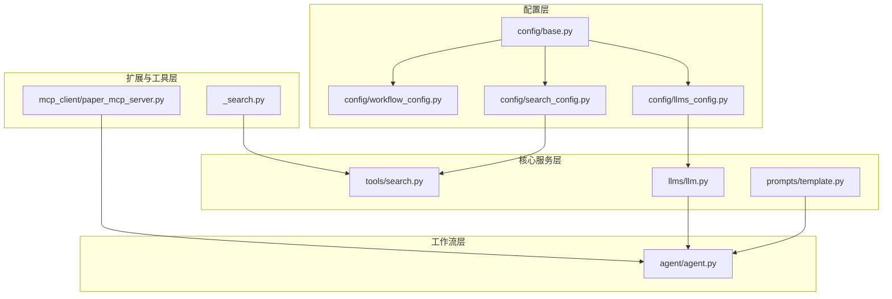
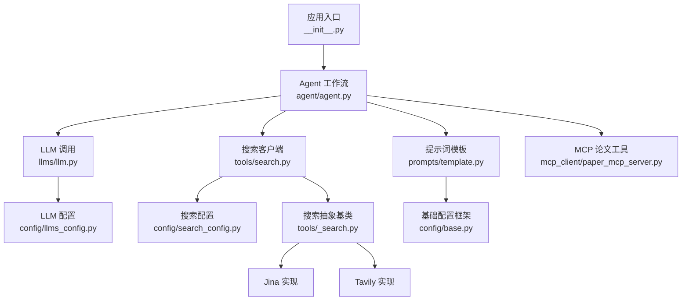
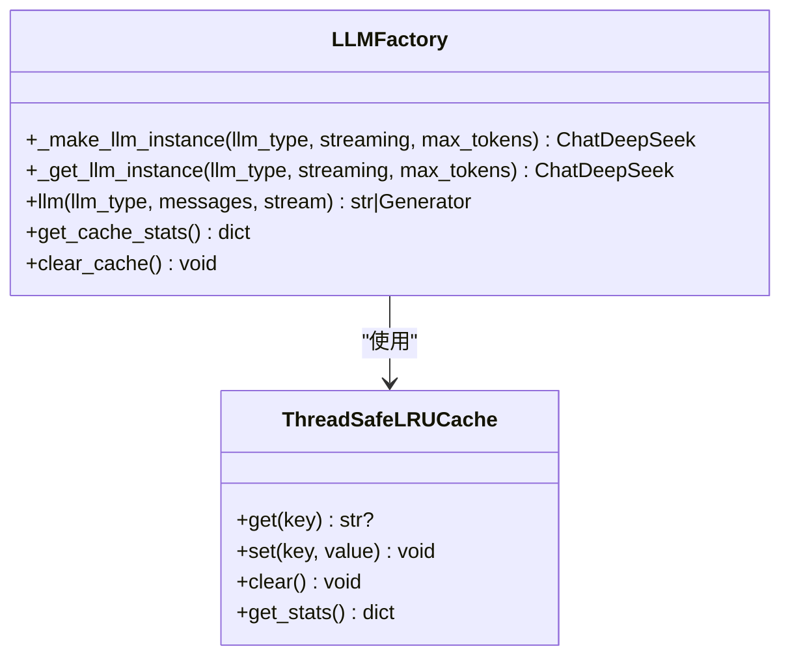
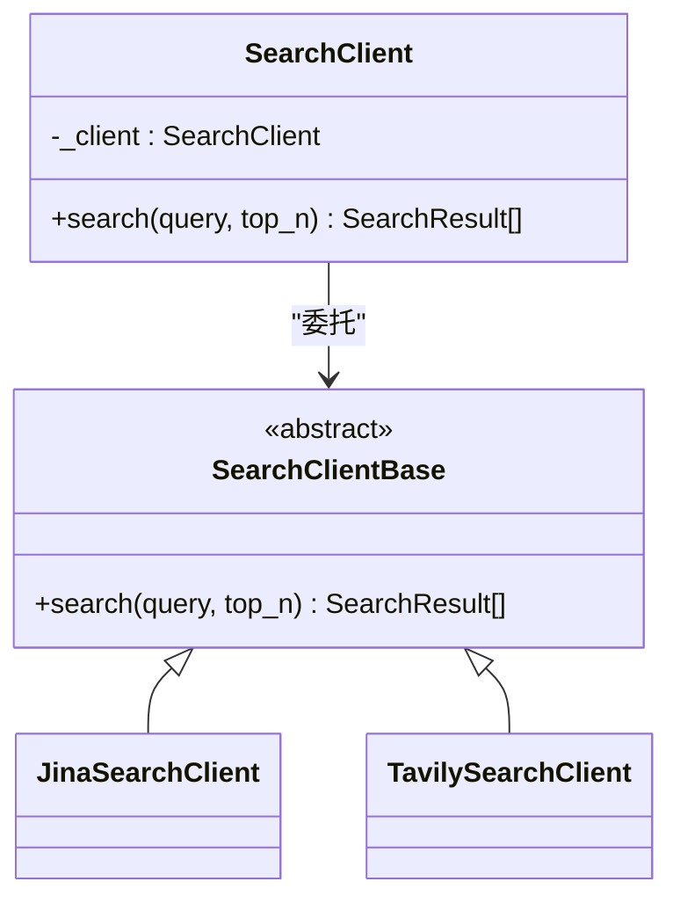
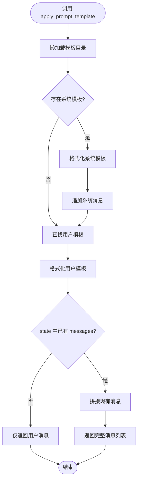
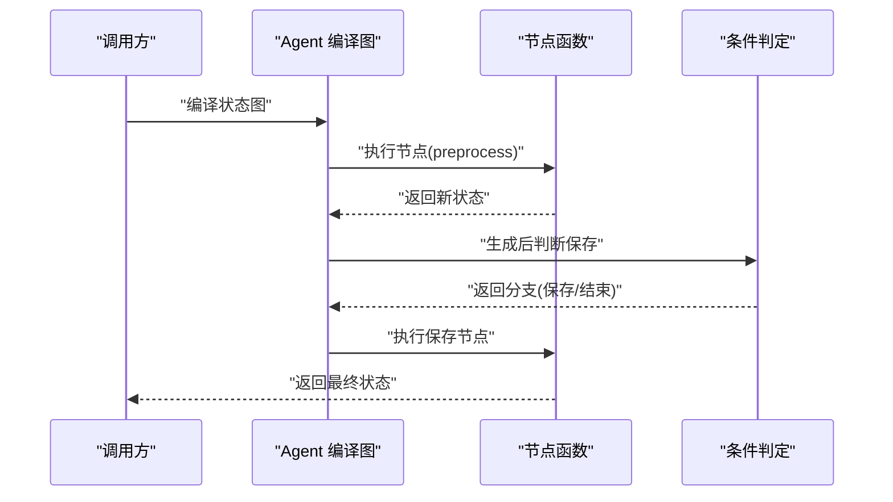
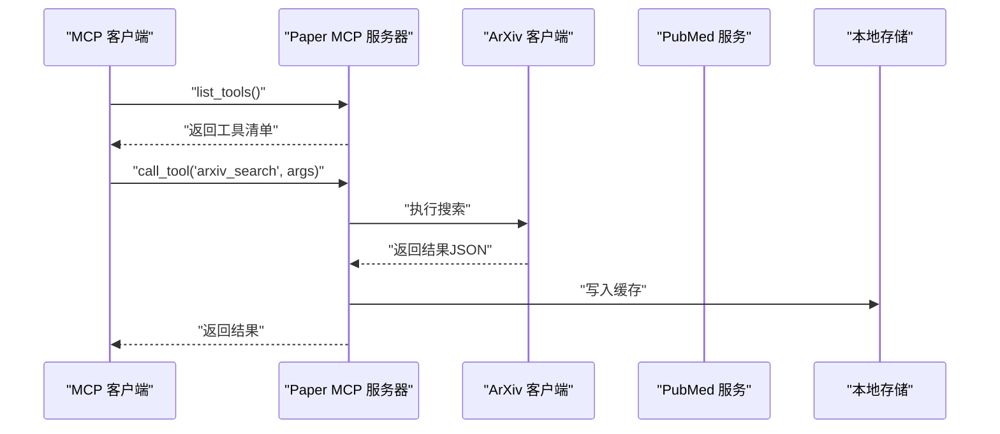
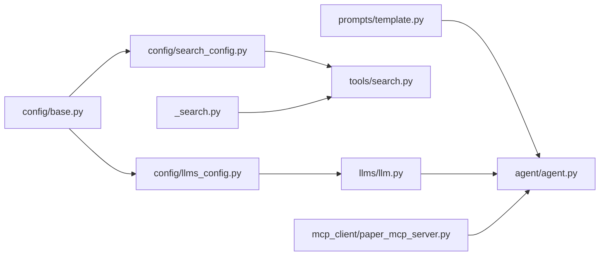

# 扩展点API

<cite>
**本文引用的文件**
- [src/deepresearch/__init__.py](file://src/deepresearch/__init__.py)
- [src/deepresearch/agent/agent.py](file://src/deepresearch/agent/agent.py)
- [src/deepresearch/llms/llm.py](file://src/deepresearch/llms/llm.py)
- [src/deepresearch/tools/search.py](file://src/deepresearch/tools/search.py)
- [src/deepresearch/prompts/template.py](file://src/deepresearch/prompts/template.py)
- [src/deepresearch/config/base.py](file://src/deepresearch/config/base.py)
- [src/deepresearch/config/llms_config.py](file://src/deepresearch/config/llms_config.py)
- [src/deepresearch/config/search_config.py](file://src/deepresearch/config/search_config.py)
- [src/deepresearch/config/workflow_config.py](file://src/deepresearch/config/workflow_config.py)
- [src/deepresearch/tools/_search.py](file://src/deepresearch/tools/_search.py)
- [src/deepresearch/mcp_client/paper_mcp_server.py](file://src/deepresearch/mcp_client/paper_mcp_server.py)
</cite>

## 目录
1. [简介](#简介)
2. [项目结构](#项目结构)
3. [核心组件](#核心组件)
4. [架构总览](#架构总览)
5. [详细组件分析](#详细组件分析)
6. [依赖分析](#依赖分析)
7. [性能考虑](#性能考虑)
8. [故障排查指南](#故障排查指南)
9. [结论](#结论)
10. [附录](#附录)

## 简介
本文件为 DeepResearch 扩展点API的权威参考，聚焦以下扩展能力与接口设计：
- LLM 提供商插件接口：通过配置驱动与工厂缓存机制，支持多提供商接入与实例复用。
- 搜索引擎插件接口：以“客户端工厂+抽象基类”模式，支持新增搜索引擎并统一对外接口。
- 提示词模板插件接口：基于目录扫描与动态导入的模板系统，支持自定义模板与变量注入。
- Agent 工作流节点扩展：通过状态图节点注册与条件边控制，实现自定义工作节点的无缝接入。
- MCP 客户端工具扩展：提供论文检索与阅读的 MCP 服务端扩展点，便于接入外部知识源。
- 配置体系扩展：统一的配置加载、验证与覆盖策略，支撑多来源配置的可插拔式管理。

## 项目结构
DeepResearch 采用按功能域分层的模块化组织方式：
- 配置层：集中管理 LLM、搜索、工作流等配置，提供加载、校验与覆盖机制。
- 核心服务层：LLM 调用封装、搜索客户端、提示词模板应用。
- 工作流层：基于状态图的 Agent 节点编排与连接。
- 扩展与工具层：MCP 服务端、搜索客户端抽象与具体实现。

图表来源
- [src/deepresearch/config/base.py:1-590](file://src/deepresearch/config/base.py#L1-L590)
- [src/deepresearch/config/llms_config.py:1-115](file://src/deepresearch/config/llms_config.py#L1-L115)
- [src/deepresearch/config/search_config.py:1-82](file://src/deepresearch/config/search_config.py#L1-L82)
- [src/deepresearch/config/workflow_config.py:1-28](file://src/deepresearch/config/workflow_config.py#L1-L28)
- [src/deepresearch/llms/llm.py:1-308](file://src/deepresearch/llms/llm.py#L1-L308)
- [src/deepresearch/tools/search.py:1-46](file://src/deepresearch/tools/search.py#L1-L46)
- [src/deepresearch/prompts/template.py:1-166](file://src/deepresearch/prompts/template.py#L1-L166)
- [src/deepresearch/agent/agent.py:1-45](file://src/deepresearch/agent/agent.py#L1-L45)
- [src/deepresearch/mcp_client/paper_mcp_server.py:1-463](file://src/deepresearch/mcp_client/paper_mcp_server.py#L1-L463)
- [src/deepresearch/tools/_search.py:1-35](file://src/deepresearch/tools/_search.py#L1-L35)

章节来源
- [src/deepresearch/__init__.py:1-30](file://src/deepresearch/__init__.py#L1-L30)
- [src/deepresearch/agent/agent.py:1-45](file://src/deepresearch/agent/agent.py#L1-L45)

## 核心组件
- LLM 接口与缓存：提供线程安全的响应缓存与 LRU 实例缓存，支持流式与非流式调用，统一消息格式。
- 搜索客户端工厂：根据配置选择具体搜索引擎实现，屏蔽外部差异。
- 提示词模板系统：动态扫描模板目录，按命名空间加载模板，支持系统提示与用户提示的组合注入。
- Agent 工作流：基于状态图构建节点与边，支持条件边与保存逻辑分支。
- MCP 服务端：提供 arXiv/PubMed 检索与阅读工具，支持异步执行与本地缓存。

章节来源
- [src/deepresearch/llms/llm.py:1-308](file://src/deepresearch/llms/llm.py#L1-L308)
- [src/deepresearch/tools/search.py:1-46](file://src/deepresearch/tools/search.py#L1-L46)
- [src/deepresearch/prompts/template.py:1-166](file://src/deepresearch/prompts/template.py#L1-L166)
- [src/deepresearch/agent/agent.py:1-45](file://src/deepresearch/agent/agent.py#L1-L45)
- [src/deepresearch/mcp_client/paper_mcp_server.py:1-463](file://src/deepresearch/mcp_client/paper_mcp_server.py#L1-L463)

## 架构总览
下图展示扩展点在整体架构中的位置与交互关系：

图表来源
- [src/deepresearch/__init__.py:1-30](file://src/deepresearch/__init__.py#L1-L30)
- [src/deepresearch/agent/agent.py:1-45](file://src/deepresearch/agent/agent.py#L1-L45)
- [src/deepresearch/llms/llm.py:1-308](file://src/deepresearch/llms/llm.py#L1-L308)
- [src/deepresearch/tools/search.py:1-46](file://src/deepresearch/tools/search.py#L1-L46)
- [src/deepresearch/prompts/template.py:1-166](file://src/deepresearch/prompts/template.py#L1-L166)
- [src/deepresearch/config/llms_config.py:1-115](file://src/deepresearch/config/llms_config.py#L1-L115)
- [src/deepresearch/config/search_config.py:1-82](file://src/deepresearch/config/search_config.py#L1-L82)
- [src/deepresearch/config/base.py:1-590](file://src/deepresearch/config/base.py#L1-L590)
- [src/deepresearch/tools/_search.py:1-35](file://src/deepresearch/tools/_search.py#L1-L35)
- [src/deepresearch/mcp_client/paper_mcp_server.py:1-463](file://src/deepresearch/mcp_client/paper_mcp_server.py#L1-L463)

## 详细组件分析

### LLM 提供商插件接口
- 设计要点
  - 基于配置的工厂函数创建 LLM 实例，支持流式/非流式调用。
  - 内置 LRU 缓存与响应缓存，提升性能与稳定性。
  - 统一消息格式（系统/人类/助手消息），增强模板与提示词兼容性。
- 关键接口
  - 创建与缓存：工厂函数与 LRU 包装，避免重复初始化。
  - LLM 调用：非流式返回完整文本；流式逐块产出推理内容与最终内容。
  - 缓存统计与清空：提供监控与调试能力。
- 扩展指南
  - 在配置中新增 LLM 类型条目，确保字段齐全。
  - 通过工厂函数按需创建实例，避免直接构造底层 SDK 实例。
  - 如需替换底层 SDK，需保持消息格式与返回约定一致。

图表来源
- [src/deepresearch/llms/llm.py:1-308](file://src/deepresearch/llms/llm.py#L1-L308)

章节来源
- [src/deepresearch/llms/llm.py:1-308](file://src/deepresearch/llms/llm.py#L1-L308)
- [src/deepresearch/config/llms_config.py:1-115](file://src/deepresearch/config/llms_config.py#L1-L115)

### 搜索引擎插件接口
- 设计要点
  - 客户端工厂根据配置选择具体搜索引擎实现。
  - 抽象基类定义统一接口，便于新增实现。
  - 结果对象标准化，便于后续处理与模板渲染。
- 关键接口
  - 工厂类：根据配置创建具体客户端。
  - 抽象类：定义搜索方法，子类实现具体逻辑。
  - 结果模型：统一字段，便于跨引擎一致性处理。
- 扩展指南
  - 新增搜索引擎时，继承抽象基类并实现搜索方法。
  - 在配置中设置引擎名称与必要凭据。
  - 通过工厂类透明切换不同实现。

图表来源
- [src/deepresearch/tools/search.py:1-46](file://src/deepresearch/tools/search.py#L1-L46)
- [src/deepresearch/tools/_search.py:1-35](file://src/deepresearch/tools/_search.py#L1-L35)

章节来源
- [src/deepresearch/tools/search.py:1-46](file://src/deepresearch/tools/search.py#L1-L46)
- [src/deepresearch/tools/_search.py:1-35](file://src/deepresearch/tools/_search.py#L1-L35)
- [src/deepresearch/config/search_config.py:1-82](file://src/deepresearch/config/search_config.py#L1-L82)

### 提示词模板插件接口
- 设计要点
  - 动态扫描模板目录，按命名空间加载模板。
  - 支持系统提示与用户提示分别注入，自动合并上下文消息。
  - 通过变量映射完成占位符替换，缺失变量会抛出明确异常。
- 关键接口
  - 模板加载：扫描目录、导入模块、提取模板。
  - 应用模板：按名称查找模板，注入变量，生成消息列表。
  - 懒加载：首次使用时才加载，避免启动开销。
- 扩展指南
  - 在模板目录下新增模板模块，导出 PROMPT 与可选 SYSTEM_PROMPT。
  - 使用命名空间区分模板类别（如 generate、learning 等）。
  - 在状态中提供模板所需变量，确保键名与模板一致。

图表来源
- [src/deepresearch/prompts/template.py:1-166](file://src/deepresearch/prompts/template.py#L1-L166)

章节来源
- [src/deepresearch/prompts/template.py:1-166](file://src/deepresearch/prompts/template.py#L1-L166)

### Agent 工作流中的钩子点与自定义节点
- 设计要点
  - Agent 基于状态图构建，节点与边在工厂函数中集中定义。
  - 条件边用于分支决策（如生成报告后的保存逻辑）。
  - 新节点可通过添加节点与边的方式无缝接入。
- 关键接口
  - 工作流构建：注册节点、定义边与条件边。
  - 节点函数：每个节点是一个可调用对象，接收状态并返回状态。
- 扩展指南
  - 定义节点函数，遵循输入输出状态约定。
  - 在构建函数中注册节点与边，确保起止与条件正确。
  - 对于条件分支，提供判定函数以决定流向。

图表来源
- [src/deepresearch/agent/agent.py:1-45](file://src/deepresearch/agent/agent.py#L1-L45)

章节来源
- [src/deepresearch/agent/agent.py:1-45](file://src/deepresearch/agent/agent.py#L1-L45)

### 事件系统与钩子机制
- 设计要点
  - 当前代码库未发现显式的“事件注册/触发/处理”API。
  - Agent 工作流通过状态图节点与条件边实现流程控制，可视为一种“节点级钩子”。
  - 如需扩展事件系统，可在关键节点处引入回调或中间件模式。
- 建议扩展点
  - 在节点执行前后提供钩子回调参数。
  - 引入事件总线或中间件，统一处理日志、指标与可观测性。

[本节为概念性说明，不直接分析具体文件，故无章节来源]

### MCP 客户端工具扩展
- 设计要点
  - 提供 MCP 服务器，暴露 arXiv/PubMed 检索与阅读工具。
  - 支持异步执行与本地缓存，减少重复下载与解析成本。
  - 工具清单与调用路由清晰，便于扩展更多工具。
- 关键接口
  - 工具清单：列出可用工具及其输入模式。
  - 工具调用：根据名称路由到具体实现。
  - 异步下载与解析：PDF 到 Markdown 的转换。
- 扩展指南
  - 新增工具时，在清单中声明并在路由中添加实现。
  - 注意输入参数校验与错误处理，返回标准文本内容。
  - 本地缓存策略可复用现有存储路径与文件命名规则。

图表来源
- [src/deepresearch/mcp_client/paper_mcp_server.py:1-463](file://src/deepresearch/mcp_client/paper_mcp_server.py#L1-L463)

章节来源
- [src/deepresearch/mcp_client/paper_mcp_server.py:1-463](file://src/deepresearch/mcp_client/paper_mcp_server.py#L1-L463)

## 依赖分析
- 配置依赖
  - LLM 配置依赖基础配置框架，提供加载、校验与覆盖。
  - 搜索配置同样依赖基础配置框架，支持脱敏与重载。
- 运行时依赖
  - LLM 调用依赖 LangChain 消息类型与 DeepSeek 客户端。
  - 搜索客户端依赖抽象基类与具体实现。
  - Agent 工作流依赖状态图与节点函数。
- 外部依赖
  - MCP 服务器依赖 mcp、httpx、lxml 等第三方库。

图表来源
- [src/deepresearch/config/base.py:1-590](file://src/deepresearch/config/base.py#L1-L590)
- [src/deepresearch/config/llms_config.py:1-115](file://src/deepresearch/config/llms_config.py#L1-L115)
- [src/deepresearch/config/search_config.py:1-82](file://src/deepresearch/config/search_config.py#L1-L82)
- [src/deepresearch/llms/llm.py:1-308](file://src/deepresearch/llms/llm.py#L1-L308)
- [src/deepresearch/tools/search.py:1-46](file://src/deepresearch/tools/search.py#L1-L46)
- [src/deepresearch/tools/_search.py:1-35](file://src/deepresearch/tools/_search.py#L1-L35)
- [src/deepresearch/prompts/template.py:1-166](file://src/deepresearch/prompts/template.py#L1-L166)
- [src/deepresearch/agent/agent.py:1-45](file://src/deepresearch/agent/agent.py#L1-L45)
- [src/deepresearch/mcp_client/paper_mcp_server.py:1-463](file://src/deepresearch/mcp_client/paper_mcp_server.py#L1-L463)

章节来源
- [src/deepresearch/config/base.py:1-590](file://src/deepresearch/config/base.py#L1-L590)
- [src/deepresearch/agent/agent.py:1-45](file://src/deepresearch/agent/agent.py#L1-L45)

## 性能考虑
- LLM 调用
  - 使用 LRU 缓存实例与响应缓存，降低重复调用成本。
  - 流式输出可提升交互体验，但需注意下游处理的吞吐。
- 搜索
  - 结果缓存与本地存储可显著减少重复抓取与解析。
  - 控制 top_n 与超时参数，平衡质量与延迟。
- 模板系统
  - 懒加载避免启动时扫描大量模板，按需加载更高效。
  - 变量注入采用格式化映射，避免复杂正则替换带来的性能损耗。
- 工作流
  - 条件边应尽量简化判定逻辑，避免在热路径上进行重型计算。

[本节提供通用指导，不直接分析具体文件，故无章节来源]

## 故障排查指南
- LLM 相关
  - 空消息或空响应：检查上游是否正确构造消息列表。
  - 缓存命中率低：确认消息哈希与缓存键是否一致。
  - 流式异常：捕获底层异常并记录错误日志。
- 搜索相关
  - 引擎未知：检查配置中的引擎名称是否匹配。
  - 结果为空：确认查询关键词与凭据是否正确。
- 模板相关
  - 变量缺失：根据异常信息补齐状态中的变量键。
  - 模板未加载：确认模板文件位于扫描目录且命名正确。
- 配置相关
  - TOML 解析失败：检查配置文件格式与编码。
  - 环境变量覆盖：确认环境变量前缀与键名一致。

章节来源
- [src/deepresearch/llms/llm.py:146-266](file://src/deepresearch/llms/llm.py#L146-L266)
- [src/deepresearch/tools/search.py:12-36](file://src/deepresearch/tools/search.py#L12-L36)
- [src/deepresearch/prompts/template.py:90-130](file://src/deepresearch/prompts/template.py#L90-L130)
- [src/deepresearch/config/base.py:459-484](file://src/deepresearch/config/base.py#L459-L484)

## 结论
DeepResearch 的扩展点API围绕“配置驱动 + 抽象接口 + 懒加载 + 缓存”的设计原则构建，既保证了灵活性，又兼顾了性能与可维护性。通过本文档的接口规范与最佳实践，开发者可以快速扩展 LLM 提供商、搜索引擎、提示词模板与 Agent 节点，并在 MCP 生态中进一步拓展知识源能力。

## 附录
- 配置文件位置与加载顺序
  - 配置目录优先级：自定义目录 > 环境变量 > 项目默认路径。
  - 加载顺序：代码默认 → 文件 → 环境变量 → 默认值。
- 常用环境变量
  - 配置目录：用于指定配置根目录。
  - LLM/搜索凭据：通过环境变量注入，避免硬编码。
- 版本与入口
  - 包入口导出构建函数与日志配置，便于外部集成。

章节来源
- [src/deepresearch/config/base.py:373-590](file://src/deepresearch/config/base.py#L373-L590)
- [src/deepresearch/__init__.py:1-30](file://src/deepresearch/__init__.py#L1-L30)