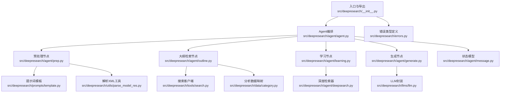
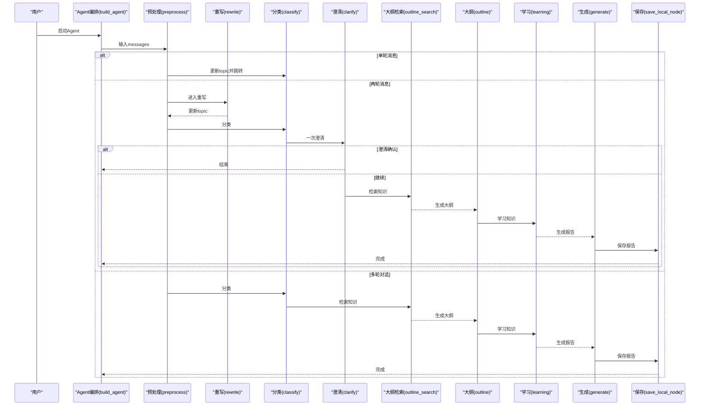
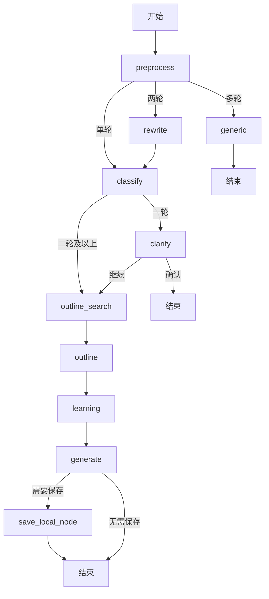
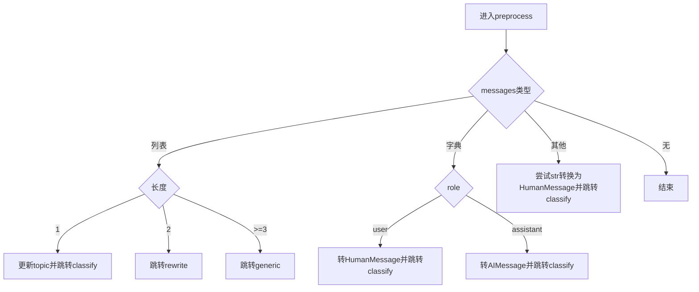
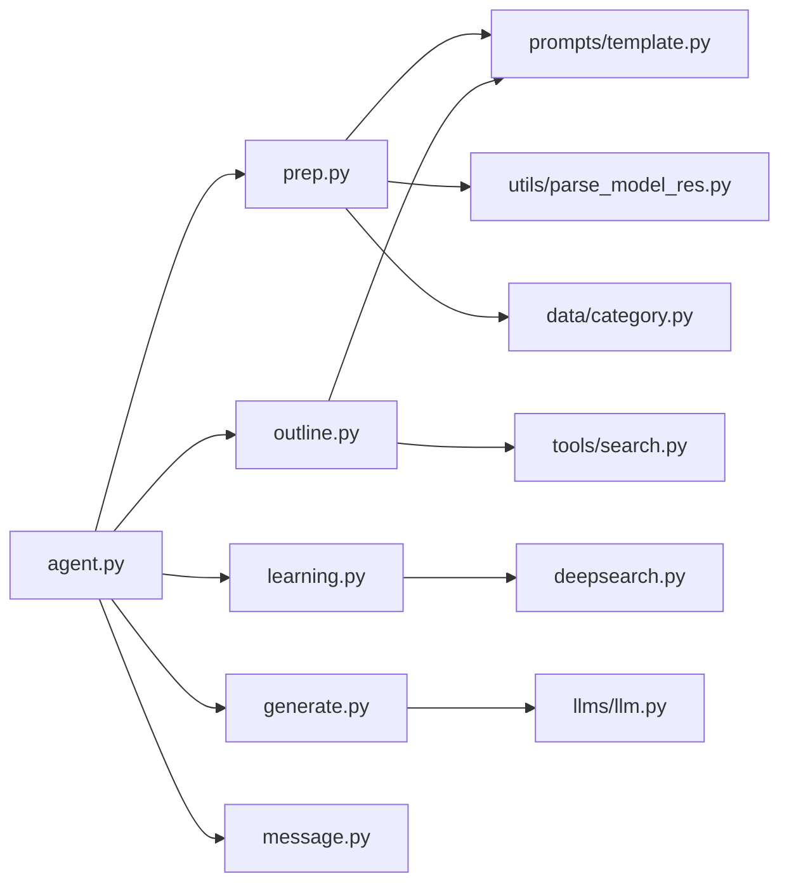

# 核心API接口

<cite>
**本文档引用的文件**
- [src/deepresearch/__init__.py](file://src/deepresearch/__init__.py)
- [src/deepresearch/agent/agent.py](file://src/deepresearch/agent/agent.py)
- [src/deepresearch/agent/message.py](file://src/deepresearch/agent/message.py)
- [src/deepresearch/agent/prep.py](file://src/deepresearch/agent/prep.py)
- [src/deepresearch/agent/outline.py](file://src/deepresearch/agent/outline.py)
- [src/deepresearch/agent/learning.py](file://src/deepresearch/agent/learning.py)
- [src/deepresearch/agent/generate.py](file://src/deepresearch/agent/generate.py)
- [src/deepresearch/prompts/template.py](file://src/deepresearch/prompts/template.py)
- [src/deepresearch/utils/parse_model_res.py](file://src/deepresearch/utils/parse_model_res.py)
- [src/deepresearch/data/category.py](file://src/deepresearch/data/category.py)
- [src/deepresearch/tools/search.py](file://src/deepresearch/tools/search.py)
- [src/deepresearch/llms/llm.py](file://src/deepresearch/llms/llm.py)
- [src/deepresearch/agent/deepsearch.py](file://src/deepresearch/agent/deepsearch.py)
- [src/deepresearch/errors.py](file://src/deepresearch/errors.py)
</cite>

## 目录
1. [简介](#简介)
2. [项目结构](#项目结构)
3. [核心组件](#核心组件)
4. [架构总览](#架构总览)
5. [详细组件分析](#详细组件分析)
6. [依赖分析](#依赖分析)
7. [性能考虑](#性能考虑)
8. [故障排查指南](#故障排查指南)
9. [结论](#结论)
10. [附录](#附录)

## 简介
本文件面向DeepResearch核心API接口的使用者与维护者，系统性梳理Agent工作流的构建与执行流程，重点覆盖以下方面：
- Agent工作流核心API：build_agent函数及其内部节点函数（preprocess、rewrite、classify、clarify、outline_search、outline、learning、generate等）的接口规范、参数类型、返回值结构与异常处理机制
- 状态管理API：ReportState的创建与操作要点
- 消息传递API：Message类（HumanMessage、AIMessage、SystemMessage）的使用方法
- 数据流转与调用关系：从输入消息到最终报告输出的完整链路
- 实际调用示例路径：通过“代码片段路径”指引定位具体实现位置，便于进一步阅读源码

## 项目结构
DeepResearch采用模块化分层组织，核心Agent工作流位于src/deepresearch/agent目录，配套有提示词模板、工具、LLM封装、数据分类与错误定义等支撑模块。

图表来源
- [src/deepresearch/__init__.py:1-30](file://src/deepresearch/__init__.py#L1-L30)
- [src/deepresearch/agent/agent.py:19-45](file://src/deepresearch/agent/agent.py#L19-L45)
- [src/deepresearch/agent/prep.py:21-202](file://src/deepresearch/agent/prep.py#L21-L202)
- [src/deepresearch/agent/outline.py:22-227](file://src/deepresearch/agent/outline.py#L22-L227)
- [src/deepresearch/agent/learning.py:15-129](file://src/deepresearch/agent/learning.py#L15-L129)
- [src/deepresearch/agent/generate.py:26-343](file://src/deepresearch/agent/generate.py#L26-L343)
- [src/deepresearch/agent/message.py:101-112](file://src/deepresearch/agent/message.py#L101-L112)
- [src/deepresearch/prompts/template.py:90-166](file://src/deepresearch/prompts/template.py#L90-L166)
- [src/deepresearch/utils/parse_model_res.py:13-32](file://src/deepresearch/utils/parse_model_res.py#L13-L32)
- [src/deepresearch/data/category.py:74-123](file://src/deepresearch/data/category.py#L74-L123)
- [src/deepresearch/tools/search.py:12-46](file://src/deepresearch/tools/search.py#L12-L46)
- [src/deepresearch/llms/llm.py:146-308](file://src/deepresearch/llms/llm.py#L146-L308)
- [src/deepresearch/errors.py:4-26](file://src/deepresearch/errors.py#L4-L26)

章节来源
- [src/deepresearch/__init__.py:1-30](file://src/deepresearch/__init__.py#L1-L30)
- [src/deepresearch/agent/agent.py:19-45](file://src/deepresearch/agent/agent.py#L19-L45)

## 核心组件
本节聚焦Agent工作流的核心API与状态模型，明确接口职责、参数与返回值、异常处理策略，并给出调用示例路径。

- build_agent函数
  - 功能：构建基于LangGraph的状态图，注册所有节点与边，返回可编译的Agent执行器
  - 参数：无
  - 返回值：已编译的Agent执行器（可直接运行）
  - 异常处理：未见显式异常抛出；若节点内部出现异常，通常由各节点内捕获并返回Command或错误输出
  - 示例路径：[src/deepresearch/agent/agent.py:19-45](file://src/deepresearch/agent/agent.py#L19-L45)

- ReportState（状态模型）
  - 字段：outline（Chapter）、messages（消息列表）、topic（主题）、domain（领域）、logic（逻辑步骤）、details（详细内容）、output（输出结果）、knowledge（知识库）、final_report（最终报告）、search_id（搜索ID计数）
  - 用途：作为LangGraph的共享状态，贯穿整个Agent工作流
  - 示例路径：[src/deepresearch/agent/message.py:101-112](file://src/deepresearch/agent/message.py#L101-L112)

- 预处理节点
  - preprocess_node(state: ReportState)
    - 功能：将输入messages统一转换为LangChain消息类型，根据轮次决定后续跳转
    - 参数：state（ReportState）
    - 返回值：Command（可能包含更新字段与goto目标）
    - 异常处理：空消息时返回结束命令；转换失败则丢弃并继续
    - 示例路径：[src/deepresearch/agent/prep.py:21-80](file://src/deepresearch/agent/prep.py#L21-L80)

  - rewrite_node(state: ReportState)
    - 功能：基于交互历史重写用户需求，提取报告主题
    - 参数：state（ReportState）
    - 返回值：Command（更新topic）
    - 异常处理：解析失败时回退为拼接历史消息
    - 示例路径：[src/deepresearch/agent/prep.py:82-103](file://src/deepresearch/agent/prep.py#L82-L103)

  - classify_node(state: ReportState)
    - 功能：对问题进行分类，确定领域与分析逻辑
    - 参数：state（ReportState）
    - 返回值：Command（更新domain、logic、details，并按轮次跳转到clarify或outline_search）
    - 异常处理：分类失败或找不到对应领域时跳转到generic
    - 示例路径：[src/deepresearch/agent/prep.py:105-151](file://src/deepresearch/agent/prep.py#L105-L151)

  - clarify_node(state: ReportState)
    - 功能：一次性澄清用户问题，确认后直接结束或继续
    - 参数：state（ReportState）
    - 返回值：Command（根据确认结果决定结束或generic）
    - 异常处理：解析失败时跳转generic
    - 示例路径：[src/deepresearch/agent/prep.py:153-182](file://src/deepresearch/agent/prep.py#L153-L182)

  - generic_node(state: ReportState)
    - 功能：通用对话处理，流式调用LLM生成回复
    - 参数：state（ReportState）
    - 返回值：字典（包含output.message）
    - 异常处理：捕获LLM调用异常并返回错误信息
    - 示例路径：[src/deepresearch/agent/prep.py:184-202](file://src/deepresearch/agent/prep.py#L184-L202)

- 大纲节点
  - outline_search_node(state: ReportState)
    - 功能：生成检索查询并并行搜索，收集知识
    - 参数：state（ReportState）
    - 返回值：字典（更新search_id与knowledge）
    - 异常处理：空查询或并发异常时降级顺序处理
    - 示例路径：[src/deepresearch/agent/outline.py:22-86](file://src/deepresearch/agent/outline.py#L22-L86)

  - outline_node(state: ReportState)
    - 功能：基于知识生成报告大纲（Markdown结构）
    - 参数：state（ReportState）
    - 返回值：Command（更新outline并跳转learning；无效大纲时结束）
    - 异常处理：解析失败记录日志并结束
    - 示例路径：[src/deepresearch/agent/outline.py:88-119](file://src/deepresearch/agent/outline.py#L88-L119)

  - 辅助函数：parse_outline、outline_knowledge_2_str
    - 功能：解析大纲文本为Chapter树、将知识列表转为JSON字符串
    - 示例路径：[src/deepresearch/agent/outline.py:158-227](file://src/deepresearch/agent/outline.py#L158-L227)

- 学习节点
  - learning_node(state: ReportState, config: RunnableConfig)
    - 功能：对大纲中的每个子章节并行深度检索与学习，填充章节学习知识与全局知识库
    - 参数：state（ReportState）、config（RunnableConfig，支持depth、topN等可配置项）
    - 返回值：字典（更新outline、search_id、knowledge）
    - 异常处理：线程安全地维护search_id与knowledge，引用ID映射在完成后填充
    - 示例路径：[src/deepresearch/agent/learning.py:15-94](file://src/deepresearch/agent/learning.py#L15-L94)

  - DeepSearch类
    - 功能：递归生成查询、检索网页、抽取知识、生成答案、评估与迭代
    - 关键方法：deep_search、_deep_search、_search_all、_extract_all_knowledge、_gen_answer、_evaluate、_gen_research_query
    - 示例路径：[src/deepresearch/agent/deepsearch.py:55-489](file://src/deepresearch/agent/deepsearch.py#L55-L489)

- 生成节点
  - generate_node(state: ReportState)
    - 功能：逐章生成报告正文，替换引用占位符，流式输出
    - 参数：state（ReportState）
    - 返回值：字典（更新final_report与output.message）
    - 异常处理：解析引用、替换工具标记、生成图表等均内置容错
    - 示例路径：[src/deepresearch/agent/generate.py:26-112](file://src/deepresearch/agent/generate.py#L26-L112)

  - 保存节点
    - save_report_local(state: ReportState, config: RunnableConfig)
      - 功能：根据配置判断是否保存本地（HTML/MD）
      - 示例路径：[src/deepresearch/agent/generate.py:114-123](file://src/deepresearch/agent/generate.py#L114-L123)

    - save_local_node(state: ReportState, config: RunnableConfig)
      - 功能：保存报告与参考文献，必要时生成HTML
      - 示例路径：[src/deepresearch/agent/generate.py:125-160](file://src/deepresearch/agent/generate.py#L125-L160)

- 提示词模板与消息传递
  - apply_prompt_template(prompt_name: str, state: dict) -> list
    - 功能：动态加载模板并注入变量，返回消息列表（支持系统消息与用户消息拼接）
    - 示例路径：[src/deepresearch/prompts/template.py:90-166](file://src/deepresearch/prompts/template.py#L90-L166)

  - Message类使用
    - LangChain消息类型：HumanMessage、AIMessage、SystemMessage
    - 在各节点中通过apply_prompt_template生成消息列表传入LLM
    - 示例路径：[src/deepresearch/prompts/template.py:90-166](file://src/deepresearch/prompts/template.py#L90-L166)

- LLM封装
  - llm(llm_type: LLMType, messages: list, stream: bool) -> Generator[str] | str
    - 功能：统一LLM调用入口，支持缓存、流式与非流式响应
    - 示例路径：[src/deepresearch/llms/llm.py:146-308](file://src/deepresearch/llms/llm.py#L146-L308)

- 错误处理
  - DeepResearchError及其子类：ConfigError、SearchError、LLMError、ReportError
  - 示例路径：[src/deepresearch/errors.py:4-26](file://src/deepresearch/errors.py#L4-L26)

章节来源
- [src/deepresearch/agent/agent.py:19-45](file://src/deepresearch/agent/agent.py#L19-L45)
- [src/deepresearch/agent/message.py:101-112](file://src/deepresearch/agent/message.py#L101-L112)
- [src/deepresearch/agent/prep.py:21-202](file://src/deepresearch/agent/prep.py#L21-L202)
- [src/deepresearch/agent/outline.py:22-227](file://src/deepresearch/agent/outline.py#L22-L227)
- [src/deepresearch/agent/learning.py:15-129](file://src/deepresearch/agent/learning.py#L15-L129)
- [src/deepresearch/agent/generate.py:26-160](file://src/deepresearch/agent/generate.py#L26-L160)
- [src/deepresearch/prompts/template.py:90-166](file://src/deepresearch/prompts/template.py#L90-L166)
- [src/deepresearch/llms/llm.py:146-308](file://src/deepresearch/llms/llm.py#L146-L308)
- [src/deepresearch/errors.py:4-26](file://src/deepresearch/errors.py#L4-L26)

## 架构总览
下图展示了Agent工作流的端到端调用关系与数据流转：

图表来源
- [src/deepresearch/agent/agent.py:19-45](file://src/deepresearch/agent/agent.py#L19-L45)
- [src/deepresearch/agent/prep.py:21-182](file://src/deepresearch/agent/prep.py#L21-L182)
- [src/deepresearch/agent/outline.py:22-119](file://src/deepresearch/agent/outline.py#L22-L119)
- [src/deepresearch/agent/learning.py:15-94](file://src/deepresearch/agent/learning.py#L15-L94)
- [src/deepresearch/agent/generate.py:26-160](file://src/deepresearch/agent/generate.py#L26-L160)

## 详细组件分析

### Agent编排与节点关系
- 节点注册与边定义
  - START -> preprocess
  - preprocess -> classify（单轮）、rewrite（两轮）、generic（多轮）
  - rewrite -> classify
  - classify -> clarify（一轮）、outline_search（二轮及以上）
  - clarify -> 通用结束或继续
  - outline_search -> outline
  - outline -> learning
  - learning -> generate
  - generate -> 条件边：保存本地或结束
  - generic -> 结束

图表来源
- [src/deepresearch/agent/agent.py:19-45](file://src/deepresearch/agent/agent.py#L19-L45)

章节来源
- [src/deepresearch/agent/agent.py:19-45](file://src/deepresearch/agent/agent.py#L19-L45)

### 预处理与消息转换
- preprocess_node
  - 将messages统一转换为HumanMessage/AIMessage/SystemMessage
  - 根据消息数量与类型决定跳转：单轮->classify；两轮->rewrite；多轮->generic
  - 空消息时直接结束

图表来源
- [src/deepresearch/agent/prep.py:21-80](file://src/deepresearch/agent/prep.py#L21-L80)

章节来源
- [src/deepresearch/agent/prep.py:21-80](file://src/deepresearch/agent/prep.py#L21-L80)

### 分类与澄清
- classify_node
  - 使用提示词模板与LLM分类，读取领域分析数据映射
  - 若分类失败或领域不可用，跳转generic
  - 第一轮进入clarify，后续轮次直接进入outline_search

- clarify_node
  - 仅一次澄清，确认后结束，否则跳转generic

章节来源
- [src/deepresearch/agent/prep.py:105-182](file://src/deepresearch/agent/prep.py#L105-L182)
- [src/deepresearch/data/category.py:74-123](file://src/deepresearch/data/category.py#L74-L123)

### 大纲检索与生成
- outline_search_node
  - 生成多个检索查询，使用线程池并行搜索，合并结果并分配自增search_id
  - 支持最大并发限制与顺序降级

- outline_node
  - 基于知识生成大纲Markdown，解析为Chapter树
  - 解析失败时记录错误并结束

章节来源
- [src/deepresearch/agent/outline.py:22-119](file://src/deepresearch/agent/outline.py#L22-L119)
- [src/deepresearch/agent/outline.py:158-227](file://src/deepresearch/agent/outline.py#L158-L227)

### 学习与知识抽取
- learning_node
  - 并行处理每个子章节，使用DeepSearch生成查询、检索、抽取知识、评估与迭代
  - 线程安全地维护全局search_id与knowledge，完成后填充章节引用ID

- DeepSearch
  - 递归深度搜索：生成查询 -> 检索 -> 抽取知识 -> 生成答案 -> 评估 -> 生成新查询（若未通过）
  - 支持多线程并发与异常容错

章节来源
- [src/deepresearch/agent/learning.py:15-94](file://src/deepresearch/agent/learning.py#L15-L94)
- [src/deepresearch/agent/deepsearch.py:55-489](file://src/deepresearch/agent/deepsearch.py#L55-L489)

### 生成与保存
- generate_node
  - 流式生成报告正文，替换引用占位符，支持表格与图表工具标记
  - 使用ContentProcessor解析工具标记并生成HTML片段

- save_report_local/save_local_node
  - 根据配置决定是否保存为HTML/MD，生成参考文献并保存

章节来源
- [src/deepresearch/agent/generate.py:26-160](file://src/deepresearch/agent/generate.py#L26-L160)

### 状态模型与消息传递
- ReportState
  - 包含outline、messages、topic、domain、logic、details、output、knowledge、final_report、search_id
  - 作为LangGraph状态，跨节点共享

- Message类
  - HumanMessage、AIMessage、SystemMessage通过apply_prompt_template生成消息列表
  - 在各节点中作为LLM输入传递

章节来源
- [src/deepresearch/agent/message.py:101-112](file://src/deepresearch/agent/message.py#L101-L112)
- [src/deepresearch/prompts/template.py:90-166](file://src/deepresearch/prompts/template.py#L90-L166)

## 依赖分析
- 组件耦合
  - Agent编排依赖各节点函数与状态模型
  - 节点间通过ReportState传递数据，条件边控制流程
  - LLM封装与提示词模板被广泛复用
  - 搜索客户端与深度检索器为学习阶段提供知识来源

图表来源
- [src/deepresearch/agent/agent.py:19-45](file://src/deepresearch/agent/agent.py#L19-L45)
- [src/deepresearch/agent/prep.py:10-16](file://src/deepresearch/agent/prep.py#L10-L16)
- [src/deepresearch/agent/outline.py:10-17](file://src/deepresearch/agent/outline.py#L10-L17)
- [src/deepresearch/agent/learning.py:8-12](file://src/deepresearch/agent/learning.py#L8-L12)
- [src/deepresearch/agent/generate.py:12-18](file://src/deepresearch/agent/generate.py#L12-L18)
- [src/deepresearch/prompts/template.py:90-166](file://src/deepresearch/prompts/template.py#L90-L166)
- [src/deepresearch/agent/deepsearch.py:16-20](file://src/deepresearch/agent/deepsearch.py#L16-L20)
- [src/deepresearch/llms/llm.py:146-308](file://src/deepresearch/llms/llm.py#L146-L308)
- [src/deepresearch/tools/search.py:12-46](file://src/deepresearch/tools/search.py#L12-L46)
- [src/deepresearch/utils/parse_model_res.py:13-32](file://src/deepresearch/utils/parse_model_res.py#L13-L32)
- [src/deepresearch/data/category.py:74-123](file://src/deepresearch/data/category.py#L74-L123)

章节来源
- [src/deepresearch/agent/agent.py:19-45](file://src/deepresearch/agent/agent.py#L19-L45)

## 性能考虑
- 并发与限流
  - outline_search_node与learning_node使用ThreadPoolExecutor，限制最大并发（如5、3），避免LLM与搜索API过载
- 缓存策略
  - LLM响应缓存：基于消息哈希与llm_type的LRU缓存，命中后直接返回，减少重复调用
  - LLM实例缓存：LRU缓存LLM实例，避免频繁创建
- 流式输出
  - generate_node与generic_node采用流式LLM调用，边生成边输出，提升交互体验
- 内存与序列化
  - outline_knowledge_2_str对知识进行截断与序列化，避免超长文本导致内存压力

## 故障排查指南
- LLM调用异常
  - 现象：LLM调用失败或返回空
  - 排查：检查提示词模板变量是否齐全；查看LLM封装的日志与缓存统计
  - 参考路径：[src/deepresearch/llms/llm.py:146-308](file://src/deepresearch/llms/llm.py#L146-L308)

- 分类失败或领域不可用
  - 现象：classify_node跳转generic
  - 排查：确认domain是否在分析数据映射中；检查提示词模板输出格式
  - 参考路径：[src/deepresearch/agent/prep.py:105-151](file://src/deepresearch/agent/prep.py#L105-L151)，[src/deepresearch/data/category.py:74-123](file://src/deepresearch/data/category.py#L74-L123)

- 大纲解析失败
  - 现象：outline解析为无效结构，结束流程
  - 排查：检查提示词模板输出的Markdown大纲格式；确保<thinking>/
标签正确
  - 参考路径：[src/deepresearch/agent/outline.py:158-227](file://src/deepresearch/agent/outline.py#L158-L227)

- 搜索异常
  - 现象：搜索客户端初始化失败或查询无结果
  - 排查：确认搜索引擎配置；检查SearchClient工厂选择
  - 参考路径：[src/deepresearch/tools/search.py:12-46](file://src/deepresearch/tools/search.py#L12-L46)

- 错误类型
  - 使用DeepResearchError及其子类进行统一异常管理
  - 参考路径：[src/deepresearch/errors.py:4-26](file://src/deepresearch/errors.py#L4-L26)

章节来源
- [src/deepresearch/llms/llm.py:146-308](file://src/deepresearch/llms/llm.py#L146-L308)
- [src/deepresearch/agent/prep.py:105-151](file://src/deepresearch/agent/prep.py#L105-L151)
- [src/deepresearch/agent/outline.py:158-227](file://src/deepresearch/agent/outline.py#L158-L227)
- [src/deepresearch/tools/search.py:12-46](file://src/deepresearch/tools/search.py#L12-L46)
- [src/deepresearch/errors.py:4-26](file://src/deepresearch/errors.py#L4-L26)

## 结论
本文档系统梳理了DeepResearch核心API接口，明确了Agent工作流的构建方式、节点职责、状态模型与消息传递机制，并提供了调用关系与数据流转的可视化说明。建议在实际使用中：
- 明确输入messages格式，确保能被preprocess正确转换
- 配置好提示词模板变量与LLM参数，保证各节点输出稳定
- 合理设置并发与缓存策略，平衡性能与资源消耗
- 利用错误类型与日志进行快速定位与修复

## 附录
- 快速调用示例路径
  - 构建Agent：[src/deepresearch/agent/agent.py:19-45](file://src/deepresearch/agent/agent.py#L19-L45)
  - 预处理节点：[src/deepresearch/agent/prep.py:21-80](file://src/deepresearch/agent/prep.py#L21-L80)
  - 分类与澄清：[src/deepresearch/agent/prep.py:105-182](file://src/deepresearch/agent/prep.py#L105-L182)
  - 大纲检索与生成：[src/deepresearch/agent/outline.py:22-119](file://src/deepresearch/agent/outline.py#L22-L119)
  - 学习与深度检索：[src/deepresearch/agent/learning.py:15-94](file://src/deepresearch/agent/learning.py#L15-L94)，[src/deepresearch/agent/deepsearch.py:55-489](file://src/deepresearch/agent/deepsearch.py#L55-L489)
  - 生成与保存：[src/deepresearch/agent/generate.py:26-160](file://src/deepresearch/agent/generate.py#L26-L160)
  - 提示词模板与消息：[src/deepresearch/prompts/template.py:90-166](file://src/deepresearch/prompts/template.py#L90-L166)
  - LLM封装：[src/deepresearch/llms/llm.py:146-308](file://src/deepresearch/llms/llm.py#L146-L308)
  - 错误类型：[src/deepresearch/errors.py:4-26](file://src/deepresearch/errors.py#L4-L26)