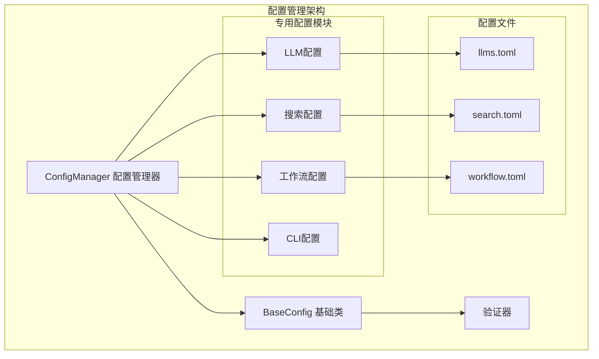
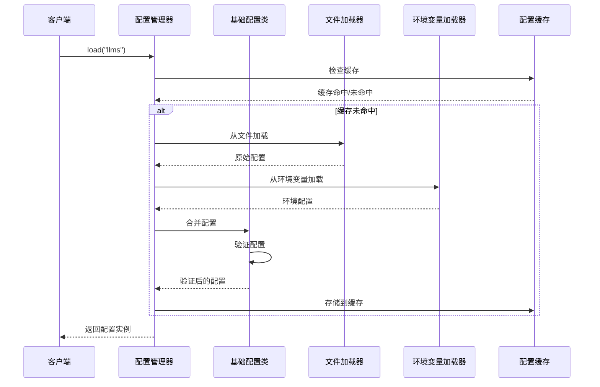
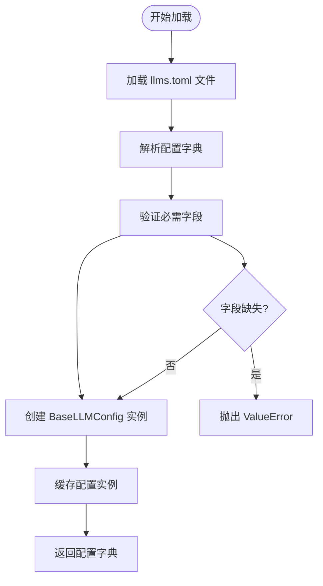
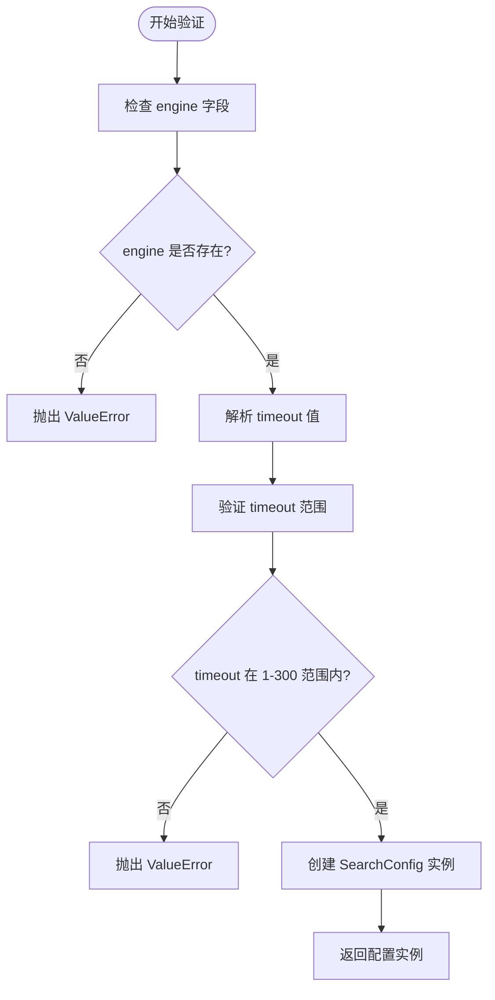
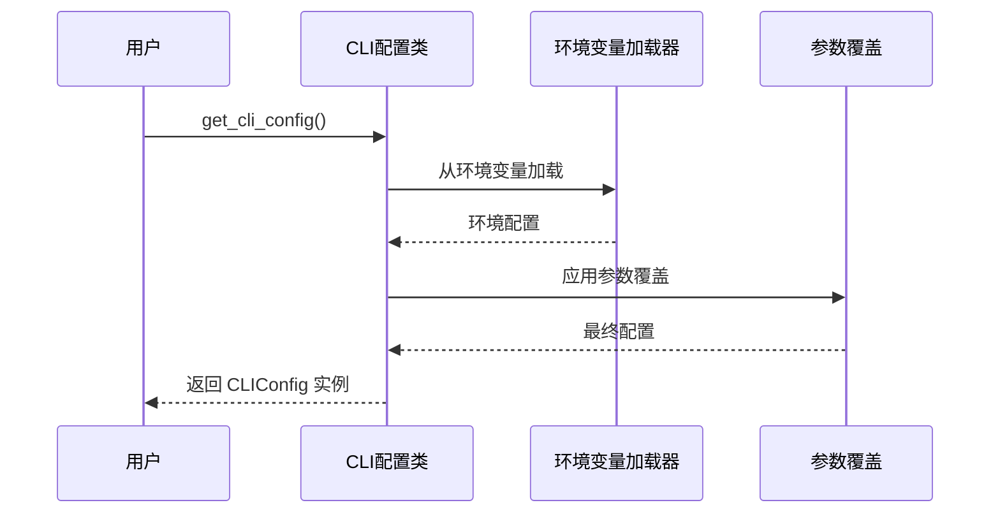
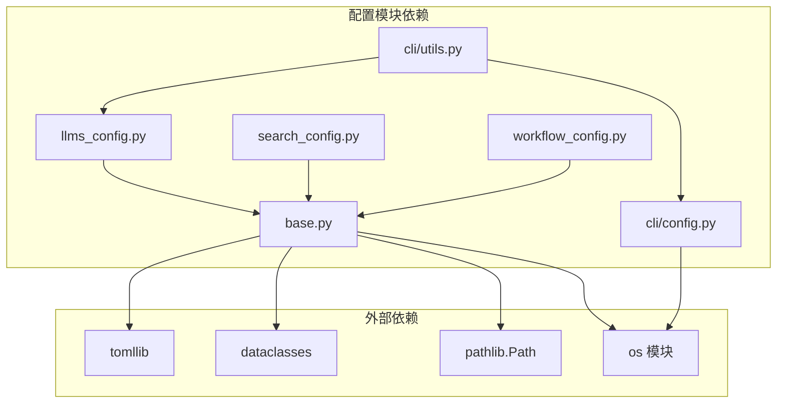

# 配置管理API

<cite>
**本文档引用的文件**
- [src/deepresearch/config/base.py](file://src/deepresearch/config/base.py)
- [src/deepresearch/config/llms_config.py](file://src/deepresearch/config/llms_config.py)
- [src/deepresearch/config/search_config.py](file://src/deepresearch/config/search_config.py)
- [src/deepresearch/config/workflow_config.py](file://src/deepresearch/config/workflow_config.py)
- [src/deepresearch/config/__init__.py](file://src/deepresearch/config/__init__.py)
- [src/deepresearch/cli/config.py](file://src/deepresearch/cli/config.py)
- [src/deepresearch/cli/utils.py](file://src/deepresearch/cli/utils.py)
- [config/llms.toml](file://config/llms.toml)
- [config/search.toml](file://config/search.toml)
- [config/workflow.toml](file://config/workflow.toml)
- [tests/unit/config/test_base.py](file://tests/unit/config/test_base.py)
- [tests/unit/cli/test_config.py](file://tests/unit/cli/test_config.py)
</cite>

## 目录
1. [简介](#简介)
2. [项目结构](#项目结构)
3. [核心组件](#核心组件)
4. [架构概览](#架构概览)
5. [详细组件分析](#详细组件分析)
6. [依赖分析](#依赖分析)
7. [性能考虑](#性能考虑)
8. [故障排除指南](#故障排除指南)
9. [结论](#结论)
10. [附录](#附录)

## 简介
本文件为 DeepResearch 配置管理API的全面参考文档。内容涵盖基础配置类、LLM配置管理、搜索配置管理、工作流配置管理、配置验证与错误处理、配置文件格式规范以及配置热更新机制。文档旨在帮助开发者和运维人员正确使用和扩展配置管理功能。

## 项目结构
DeepResearch 的配置管理采用分层设计：
- 基础配置框架：提供通用的配置加载、验证、合并和导出能力
- 专用配置模块：针对 LLM、搜索、工作流等具体场景的配置管理
- CLI 配置：命令行工具的配置管理
- 配置文件：TOML 格式的配置文件存储



**图表来源**
- [src/deepresearch/config/base.py:190-456](file://src/deepresearch/config/base.py#L190-L456)
- [src/deepresearch/config/llms_config.py:12-86](file://src/deepresearch/config/llms_config.py#L12-L86)
- [src/deepresearch/config/search_config.py:12-82](file://src/deepresearch/config/search_config.py#L12-L82)
- [src/deepresearch/config/workflow_config.py:7-28](file://src/deepresearch/config/workflow_config.py#L7-L28)

**章节来源**
- [src/deepresearch/config/base.py:1-590](file://src/deepresearch/config/base.py#L1-L590)
- [src/deepresearch/config/__init__.py:1-75](file://src/deepresearch/config/__init__.py#L1-L75)

## 核心组件
本节详细介绍配置管理的核心组件及其API接口。

### BaseConfig 基础配置类
BaseConfig 是所有配置类的基类，提供统一的配置管理功能：

#### 配置读取接口
- `from_dict(data, source)`: 从字典创建配置实例
- `from_env()`: 从环境变量加载配置
- `from_file(filepath)`: 从文件加载配置
- `get(key, default)`: 获取配置项值

#### 配置设置接口
- `merge(other, source)`: 合并另一个配置实例
- `set(key, value)`: 设置配置项值（适用于非frozen实例）

#### 配置验证接口
- 内置验证器：RangeValidator、ChoiceValidator、TypeValidator
- 支持自定义验证器实现
- 配置后验证机制

#### 配置导出接口
- `to_dict(redact=False)`: 转换为字典
- 支持敏感信息脱敏

**章节来源**
- [src/deepresearch/config/base.py:223-371](file://src/deepresearch/config/base.py#L223-L371)

### ConfigManager 配置管理器
ConfigManager 提供统一的配置加载和管理接口：

#### 配置目录管理
- `set_config_dir(config_dir)`: 设置自定义配置目录
- `get_config_dir()`: 获取配置目录路径
- 支持环境变量覆盖

#### 配置加载管理
- `register_loader(name, loader)`: 注册配置加载器
- `load(name)`: 加载指定配置
- `reload(name=None)`: 重新加载配置

**章节来源**
- [src/deepresearch/config/base.py:374-456](file://src/deepresearch/config/base.py#L374-L456)

### 配置验证器体系
DeepResearch 提供了完整的配置验证器体系：

#### 内置验证器
- **RangeValidator**: 数值范围验证
- **ChoiceValidator**: 选项集合验证
- **TypeValidator**: 类型验证

#### 自定义验证器
通过实现 ConfigValidator 抽象基类，支持业务特定的验证逻辑。

**章节来源**
- [src/deepresearch/config/base.py:65-150](file://src/deepresearch/config/base.py#L65-L150)

## 架构概览
配置管理的整体架构采用分层设计，确保了灵活性和可扩展性：



**图表来源**
- [src/deepresearch/config/base.py:536-590](file://src/deepresearch/config/base.py#L536-L590)
- [src/deepresearch/config/llms_config.py:46-86](file://src/deepresearch/config/llms_config.py#L46-L86)

## 详细组件分析

### LLM 配置管理API
LLM 配置管理专注于大语言模型的配置管理，提供了完整的配置生命周期管理。

#### 基础 LLM 配置类
BaseLLMConfig 定义了所有 LLM 的通用配置项：
- `base_url`: 服务基础URL
- `api_base`: API基础地址
- `model`: 模型名称
- `api_key`: API密钥

#### 配置加载流程


**图表来源**
- [src/deepresearch/config/llms_config.py:46-61](file://src/deepresearch/config/llms_config.py#L46-L61)

#### API 接口详解

##### 配置加载接口
- `load_llm_configs()`: 加载所有 LLM 配置
- `get_llm_configs()`: 获取 LLM 配置（支持缓存）
- `get_redacted_llm_configs()`: 获取脱敏后的 LLM 配置

##### 单个模型访问接口
- `get_basic_llm()`: 获取基础模型配置
- `get_clarify_llm()`: 获取澄清模型配置
- `get_planner_llm()`: 获取规划模型配置
- `get_query_generation_llm()`: 获取查询生成模型配置
- `get_evaluate_llm()`: 获取评估模型配置
- `get_report_llm()`: 获取报告模型配置

##### 配置热更新机制
- `reload_llm_configs()`: 重新加载 LLM 配置
- 支持动态更新配置文件后立即生效

**章节来源**
- [src/deepresearch/config/llms_config.py:12-115](file://src/deepresearch/config/llms_config.py#L12-L115)
- [config/llms.toml:1-29](file://config/llms.toml#L1-L29)

### 搜索配置管理API
搜索配置管理专注于搜索引擎的配置管理，支持多种搜索引擎提供商。

#### 搜索配置类
SearchConfig 定义了搜索服务的配置参数：
- `engine`: 搜索引擎类型（支持 "jina" 或 "tavily"）
- `jina_api_key`: Jina API 密钥
- `tavily_api_key`: Tavily API 密钥
- `timeout`: 请求超时时间（默认30秒，范围1-300秒）

#### 配置验证逻辑


**图表来源**
- [src/deepresearch/config/search_config.py:21-53](file://src/deepresearch/config/search_config.py#L21-L53)

#### API 接口详解

##### 配置加载接口
- `load_search_config()`: 加载搜索配置
- `get_redacted_search_config()`: 获取脱敏后的搜索配置

##### 配置访问
- `search_config`: 全局搜索配置实例

**章节来源**
- [src/deepresearch/config/search_config.py:12-82](file://src/deepresearch/config/search_config.py#L12-L82)
- [config/search.toml:1-6](file://config/search.toml#L1-L6)

### 工作流配置管理API
工作流配置管理提供了工作流参数的配置管理功能。

#### 配置加载接口
- `load_workflow_configs()`: 加载工作流配置
- `get_redacted_workflow_configs()`: 获取脱敏后的工作流配置
- `workflow_configs`: 全局工作流配置实例

#### 配置格式
工作流配置采用简单的键值对格式，支持嵌套配置结构。

**章节来源**
- [src/deepresearch/config/workflow_config.py:7-28](file://src/deepresearch/config/workflow_config.py#L7-L28)
- [config/workflow.toml:1-3](file://config/workflow.toml#L1-L3)

### CLI 配置管理API
CLI 配置管理专注于命令行工具的配置管理。

#### CLI 配置类
CLIConfig 提供了完整的命令行工具配置：
- `max_depth`: 最大搜索深度（1-10，默认3）
- `save_as_html`: 是否保存为HTML格式（默认True）
- `save_path`: 报告保存路径（默认"./example/report"）
- `log_level`: 日志级别（支持 DEBUG/INFO/WARNING/ERROR/CRITICAL）
- `log_file`: 日志文件路径
- `history_file`: 历史记录文件路径
- `max_history`: 最大历史记录数（10-1000，默认100）
- `stream_output`: 是否流式输出（默认True）
- `timeout`: 超时时间（30-3600，默认300）
- `theme`: 界面主题（default/minimal/colorful，默认"default"）
- `config_dir`: 配置目录路径

#### 配置加载流程


**图表来源**
- [src/deepresearch/cli/config.py:66-101](file://src/deepresearch/cli/config.py#L66-L101)

**章节来源**
- [src/deepresearch/cli/config.py:15-101](file://src/deepresearch/cli/config.py#L15-L101)

## 依赖分析



**图表来源**
- [src/deepresearch/config/base.py:4-12](file://src/deepresearch/config/base.py#L4-L12)
- [src/deepresearch/config/llms_config.py:4-7](file://src/deepresearch/config/llms_config.py#L4-L7)
- [src/deepresearch/config/search_config.py:4-7](file://src/deepresearch/config/search_config.py#L4-L7)
- [src/deepresearch/config/workflow_config.py](file://src/deepresearch/config/workflow_config.py#L4)
- [src/deepresearch/cli/config.py:5-8](file://src/deepresearch/cli/config.py#L5-L8)
- [src/deepresearch/cli/utils.py:10-33](file://src/deepresearch/cli/utils.py#L10-L33)

### 关键依赖关系
1. **基础依赖**: 所有配置模块都依赖于 base.py 提供的基础功能
2. **文件系统依赖**: 通过 pathlib.Path 和 os 模块进行文件操作
3. **序列化依赖**: 使用 tomllib 进行 TOML 文件解析
4. **运行时依赖**: CLI 模块依赖于运行时配置和环境变量

**章节来源**
- [src/deepresearch/config/base.py:4-12](file://src/deepresearch/config/base.py#L4-L12)
- [src/deepresearch/cli/utils.py:10-33](file://src/deepresearch/cli/utils.py#L10-L33)

## 性能考虑
配置管理在设计时充分考虑了性能优化：

### 缓存策略
- **LRU 缓存**: `_load_toml_table_from_path` 使用 LRU 缓存，避免重复读取文件
- **配置实例缓存**: `ConfigManager` 缓存已加载的配置实例
- **LLM 配置缓存**: `get_llm_configs()` 支持懒加载和缓存

### 内存优化
- **深拷贝保护**: `_clone_toml_value` 函数确保配置数据的安全复制
- **敏感信息脱敏**: `redact_config` 函数支持选择性脱敏，减少内存占用

### 并发安全
- **线程安全**: 配置读取操作是纯函数，天然线程安全
- **缓存一致性**: 通过 `clear_config_cache()` 确保缓存一致性

## 故障排除指南

### 常见配置错误
1. **配置文件格式错误**
   - 检查 TOML 文件语法
   - 验证必需字段完整性
   - 确认数据类型正确性

2. **环境变量配置错误**
   - 检查环境变量命名格式
   - 验证布尔值格式（true/false/1/0/yes/no）
   - 确认数值范围在允许范围内

3. **配置验证失败**
   - 检查验证器配置
   - 确认配置值符合业务规则
   - 查看详细的错误信息

### 调试技巧
1. **启用详细日志**
   ```python
   import logging
   logging.basicConfig(level=logging.DEBUG)
   ```

2. **使用配置导出功能**
   ```python
   config_dict = config_instance.to_dict(redact=True)
   print(json.dumps(config_dict, indent=2))
   ```

3. **检查配置来源**
   - 确认配置的优先级顺序
   - 验证环境变量是否正确加载
   - 检查配置文件路径是否正确

**章节来源**
- [tests/unit/config/test_base.py:208-284](file://tests/unit/config/test_base.py#L208-L284)
- [tests/unit/cli/test_config.py:101-157](file://tests/unit/cli/test_config.py#L101-L157)

## 结论
DeepResearch 的配置管理API提供了完整、灵活且高性能的配置解决方案。通过分层设计和丰富的验证机制，确保了配置的正确性和可靠性。同时，支持多种配置来源和热更新机制，满足了生产环境的各种需求。

## 附录

### 配置文件格式规范

#### LLM 配置文件格式 (llms.toml)
```toml
[basic]
api_base = "https://example.com/v1"
model = "model_name"
api_key = "your_api_key"

[clarify]
api_base = "https://example.com/v1"
model = "model_name"
api_key = "your_api_key"

[planner]
api_base = "https://example.com/v1"
model = "model_name"
api_key = "your_api_key"

[query_generation]
api_base = "https://example.com/v1"
model = "model_name"
api_key = "your_api_key"

[evaluate]
api_base = "https://example.com/v1"
model = "model_name"
api_key = "your_api_key"

[report]
api_base = "https://example.com/v1"
model = "model_name"
api_key = "your_api_key"
```

#### 搜索配置文件格式 (search.toml)
```toml
[search]
engine = "tavily"  # 支持 "jina" 或 "tavily"
timeout = 30
jina_api_key = "jina_your_key"
tavily_api_key = "tvly_your_key"
```

#### 工作流配置文件格式 (workflow.toml)
```toml
[search]
topN = 5
```

### 配置验证最佳实践
1. **定义明确的验证规则**
   - 使用 RangeValidator 验证数值范围
   - 使用 ChoiceValidator 限制选项集合
   - 使用 TypeValidator 确保数据类型

2. **合理设置默认值**
   - 为可选配置提供合理的默认值
   - 确保默认值符合业务逻辑

3. **实现配置热更新**
   - 使用 clear_config_cache() 清理缓存
   - 实现重新加载机制
   - 确保配置更新的原子性

4. **安全考虑**
   - 使用敏感信息脱敏功能
   - 避免在日志中输出敏感信息
   - 实施适当的访问控制