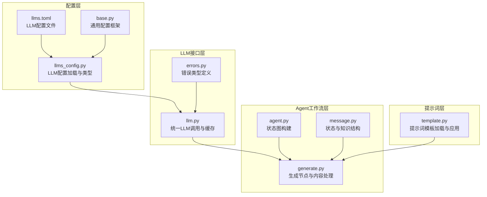
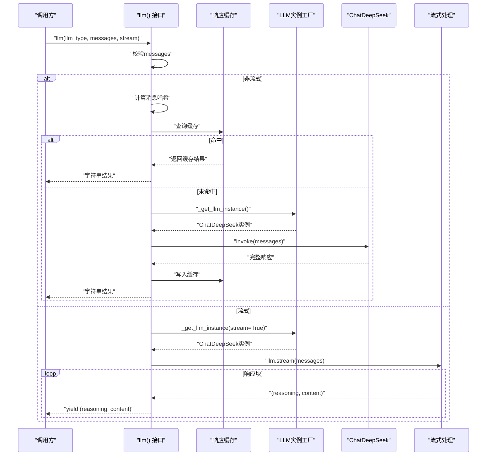
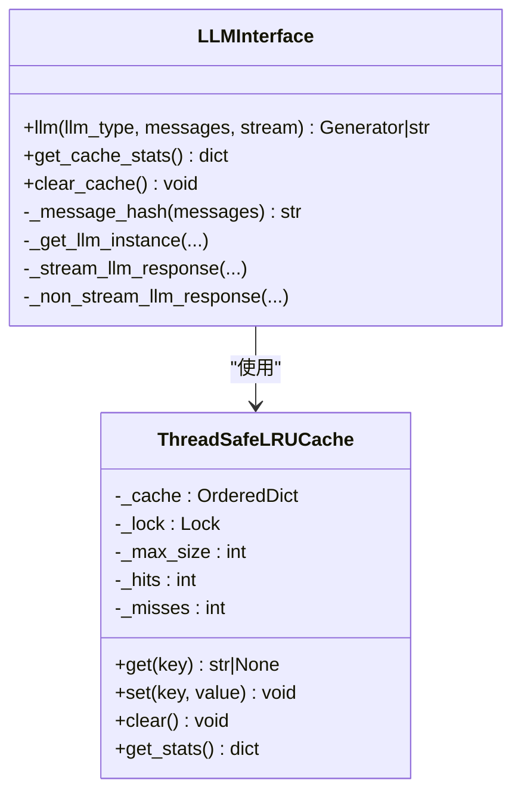
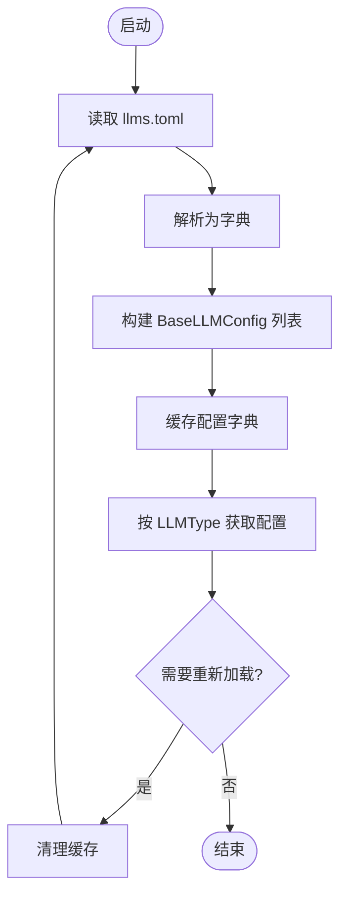
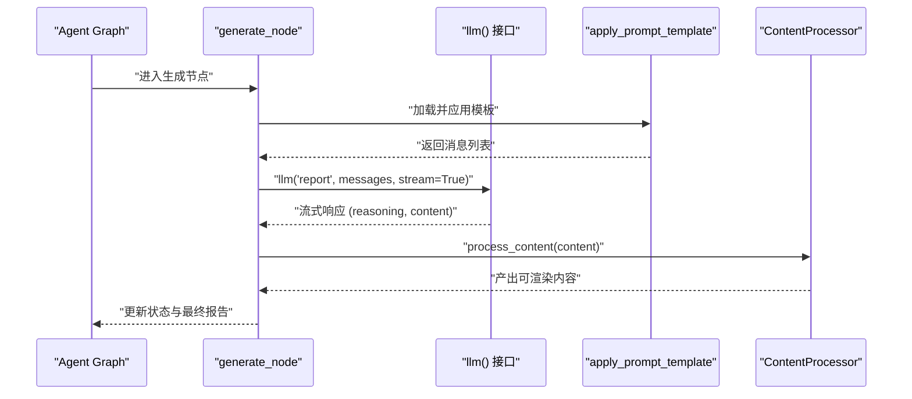
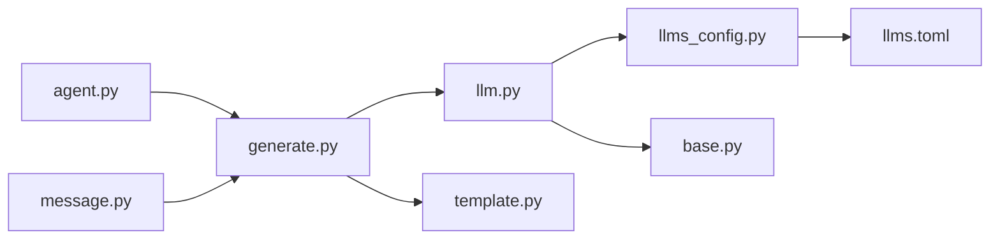

# LLM接口设计

<cite>
**本文档引用的文件**
- [llm.py](file://src/deepresearch/llms/llm.py)
- [llms_config.py](file://src/deepresearch/config/llms_config.py)
- [base.py](file://src/deepresearch/config/base.py)
- [llms.toml](file://config/llms.toml)
- [generate.py](file://src/deepresearch/agent/generate.py)
- [agent.py](file://src/deepresearch/agent/agent.py)
- [message.py](file://src/deepresearch/agent/message.py)
- [template.py](file://src/deepresearch/prompts/template.py)
- [errors.py](file://src/deepresearch/errors.py)
- [test_llm.py](file://tests/unit/llms/test_llm.py)
</cite>

## 目录
1. [简介](#简介)
2. [项目结构](#项目结构)
3. [核心组件](#核心组件)
4. [架构总览](#架构总览)
5. [详细组件分析](#详细组件分析)
6. [依赖关系分析](#依赖关系分析)
7. [性能考虑](#性能考虑)
8. [故障排查指南](#故障排查指南)
9. [结论](#结论)
10. [附录](#附录)

## 简介
本文件系统性阐述DeepResearch项目的统一LLM调用接口设计与实现架构，重点覆盖：
- 统一LLM调用接口的设计原理与实现
- 缓存机制（响应缓存、实例缓存）的策略、过期与命中率优化
- 错误处理与重试机制（当前实现与可扩展点）
- 多模型支持（模型切换、参数适配、性能监控）
- LLM配置管理、API密钥安全存储与成本控制策略
- 自定义LLM提供商的扩展指南

## 项目结构
本项目采用“模块化+分层”的组织方式：
- 配置层：集中管理LLM配置与通用配置框架
- LLM接口层：统一LLM调用入口与缓存逻辑
- Agent工作流层：基于LangGraph的状态图编排
- 提示词模板层：动态加载与应用提示词
- 工具与实用模块：搜索、图表生成、输出解析等

**图表来源**
- [llm.py:1-308](file://src/deepresearch/llms/llm.py#L1-L308)
- [llms_config.py:1-115](file://src/deepresearch/config/llms_config.py#L1-L115)
- [base.py:1-590](file://src/deepresearch/config/base.py#L1-L590)
- [llms.toml:1-29](file://config/llms.toml#L1-L29)
- [generate.py:1-343](file://src/deepresearch/agent/generate.py#L1-L343)
- [agent.py:1-45](file://src/deepresearch/agent/agent.py#L1-L45)
- [message.py:1-112](file://src/deepresearch/agent/message.py#L1-L112)
- [template.py:1-166](file://src/deepresearch/prompts/template.py#L1-L166)
- [errors.py:1-26](file://src/deepresearch/errors.py#L1-L26)

**章节来源**
- [llm.py:1-308](file://src/deepresearch/llms/llm.py#L1-L308)
- [llms_config.py:1-115](file://src/deepresearch/config/llms_config.py#L1-L115)
- [base.py:1-590](file://src/deepresearch/config/base.py#L1-L590)
- [llms.toml:1-29](file://config/llms.toml#L1-L29)
- [generate.py:1-343](file://src/deepresearch/agent/generate.py#L1-L343)
- [agent.py:1-45](file://src/deepresearch/agent/agent.py#L1-L45)
- [message.py:1-112](file://src/deepresearch/agent/message.py#L1-L112)
- [template.py:1-166](file://src/deepresearch/prompts/template.py#L1-L166)
- [errors.py:1-26](file://src/deepresearch/errors.py#L1-L26)

## 核心组件
- 统一LLM调用接口：提供非流式与流式两种模式，支持消息哈希缓存与实例缓存
- LLM配置管理：基于TOML的多模型配置，支持懒加载与敏感信息脱敏
- Agent工作流：通过状态图编排预处理、学习、生成、保存等节点
- 提示词模板：动态加载与变量注入，支持系统提示与用户提示
- 错误类型：统一的错误分类，便于上层捕获与处理

**章节来源**
- [llm.py:146-266](file://src/deepresearch/llms/llm.py#L146-L266)
- [llms_config.py:46-115](file://src/deepresearch/config/llms_config.py#L46-L115)
- [generate.py:26-112](file://src/deepresearch/agent/generate.py#L26-L112)
- [template.py:90-129](file://src/deepresearch/prompts/template.py#L90-L129)
- [errors.py:4-26](file://src/deepresearch/errors.py#L4-L26)

## 架构总览
统一LLM调用接口以“工厂+缓存”为核心，结合LangChain的ChatDeepSeek客户端，实现：
- 按模型类型选择配置
- 响应级缓存（消息哈希+LLM类型）
- LLM实例级缓存（LRU，避免重复构造）
- 流式/非流式两种响应模式
- 错误日志与空响应兜底

**图表来源**
- [llm.py:146-266](file://src/deepresearch/llms/llm.py#L146-L266)
- [llm.py:187-256](file://src/deepresearch/llms/llm.py#L187-L256)

**章节来源**
- [llm.py:146-266](file://src/deepresearch/llms/llm.py#L146-L266)

## 详细组件分析

### 统一LLM调用接口（llm.py）
- 设计原则
  - 单一职责：对外暴露简洁的llm()函数，内部封装缓存、实例管理与错误处理
  - 可扩展：通过LLMType与配置工厂解耦具体提供商
  - 性能优先：两级缓存（响应缓存+实例缓存），线程安全
- 关键实现
  - 响应缓存：基于消息哈希与LLM类型组合的键，使用有序字典实现LRU，线程锁保护
  - 实例缓存：对LLM工厂函数进行LRU缓存，限制最大实例数量
  - 流式/非流式：分别走不同的执行路径，非流式自动写入缓存
  - 错误处理：捕获异常并记录日志，空响应返回空字符串或空生成器
- 性能指标
  - 响应缓存统计：命中次数、未命中次数、命中率
  - 清理接口：支持清空响应缓存与实例缓存

**图表来源**
- [llm.py:71-121](file://src/deepresearch/llms/llm.py#L71-L121)
- [llm.py:146-266](file://src/deepresearch/llms/llm.py#L146-L266)

**章节来源**
- [llm.py:146-266](file://src/deepresearch/llms/llm.py#L146-L266)
- [llm.py:71-121](file://src/deepresearch/llms/llm.py#L71-L121)

### LLM配置管理（llms_config.py + base.py + llms.toml）
- 配置模型
  - BaseLLMConfig：统一的LLM配置字段（基础URL、API基础URL、模型名、API密钥）
  - LLMType：限定的模型类型枚举，确保调用侧类型安全
- 加载与缓存
  - 懒加载：首次访问时读取TOML并构建配置字典
  - 缓存：全局缓存配置字典，支持重新加载
  - 脱敏：提供脱敏视图，隐藏敏感字段
- 安全与可维护性
  - 通用配置框架：支持从文件、环境变量、代码合并加载，字段级验证与敏感键集合
  - 动态更新：提供重新加载接口，配合缓存清理

**图表来源**
- [llms_config.py:46-85](file://src/deepresearch/config/llms_config.py#L46-L85)
- [base.py:479-484](file://src/deepresearch/config/base.py#L479-L484)

**章节来源**
- [llms_config.py:12-115](file://src/deepresearch/config/llms_config.py#L12-L115)
- [base.py:190-371](file://src/deepresearch/config/base.py#L190-L371)
- [llms.toml:1-29](file://config/llms.toml#L1-L29)

### Agent工作流与提示词模板（agent.py + generate.py + template.py + message.py）
- 工作流
  - 通过StateGraph定义节点与边，形成研究流程（预处理、学习、生成、保存）
  - 生成节点使用LLM接口进行内容生成，支持流式增量输出与工具渲染
- 提示词模板
  - 动态扫描多个目录，导入Python模块提取PROMPT与SYSTEM_PROMPT
  - 支持系统提示与用户提示的组合，变量注入失败时抛出明确错误
- 状态与知识
  - ReportState承载主题、领域、大纲、知识库等上下文
  - Chapter结构化章节与参考文献，支持知识合并与序列化

**图表来源**
- [agent.py:19-44](file://src/deepresearch/agent/agent.py#L19-L44)
- [generate.py:26-112](file://src/deepresearch/agent/generate.py#L26-L112)
- [template.py:90-129](file://src/deepresearch/prompts/template.py#L90-L129)
- [llm.py:146-217](file://src/deepresearch/llms/llm.py#L146-L217)

**章节来源**
- [agent.py:19-44](file://src/deepresearch/agent/agent.py#L19-L44)
- [generate.py:26-112](file://src/deepresearch/agent/generate.py#L26-L112)
- [template.py:25-129](file://src/deepresearch/prompts/template.py#L25-L129)
- [message.py:12-112](file://src/deepresearch/agent/message.py#L12-L112)

## 依赖关系分析
- 组件耦合
  - llm.py依赖llms_config.py提供的配置与LLMType
  - generate.py依赖llm.py进行内容生成，依赖template.py进行提示词注入
  - agent.py依赖generate.py构建状态图
  - base.py提供通用配置框架，被llms_config.py复用
- 外部依赖
  - LangChain消息类型与ChatDeepSeek客户端
  - TOML配置文件与动态模块导入

**图表来源**
- [llm.py:17-17](file://src/deepresearch/llms/llm.py#L17-L17)
- [llms_config.py:7-7](file://src/deepresearch/config/llms_config.py#L7-L7)
- [generate.py:12-16](file://src/deepresearch/agent/generate.py#L12-L16)
- [agent.py:6-16](file://src/deepresearch/agent/agent.py#L6-L16)
- [template.py:9-9](file://src/deepresearch/prompts/template.py#L9-L9)

**章节来源**
- [llm.py:17-17](file://src/deepresearch/llms/llm.py#L17-L17)
- [llms_config.py:7-7](file://src/deepresearch/config/llms_config.py#L7-L7)
- [generate.py:12-16](file://src/deepresearch/agent/generate.py#L12-L16)
- [agent.py:6-16](file://src/deepresearch/agent/agent.py#L6-L16)
- [template.py:9-9](file://src/deepresearch/prompts/template.py#L9-L9)

## 性能考虑
- 缓存策略
  - 响应缓存：基于消息哈希+LLM类型组合键，命中率与缓存大小成正比；可通过增大最大容量提升命中率，但需权衡内存占用
  - 实例缓存：限制最大实例数量，避免频繁构造LLM客户端带来的开销
- 并发与线程安全
  - 响应缓存使用线程锁保护，适合多线程环境
  - 流式响应逐块产出，降低首字节延迟
- 监控与可观测性
  - 提供缓存统计接口，便于运行时观察命中率
  - 日志记录异常与空响应，辅助定位问题

**章节来源**
- [llm.py:71-121](file://src/deepresearch/llms/llm.py#L71-L121)
- [llm.py:258-266](file://src/deepresearch/llms/llm.py#L258-L266)

## 故障排查指南
- 常见问题
  - API密钥无效或配置缺失：检查llms.toml中的api_key与模型字段，确认已正确加载
  - 空响应：接口在空响应时返回空字符串或空生成器，检查输入messages与网络连通性
  - 缓存异常：若怀疑缓存污染，可调用clear_cache()清理响应缓存与实例缓存
- 错误类型
  - LLMError：用于标识LLM相关错误，便于上层捕获与差异化处理
  - ConfigError：配置加载与验证错误，检查配置文件格式与字段完整性
- 单元测试
  - 提供LLM缓存与实例获取的基础测试，可作为集成测试的参考

**章节来源**
- [errors.py:4-26](file://src/deepresearch/errors.py#L4-L26)
- [test_llm.py:19-57](file://tests/unit/llms/test_llm.py#L19-L57)

## 结论
本设计通过“统一接口+两级缓存+配置框架+工作流编排”的组合，实现了：
- 易用且高性能的LLM调用体验
- 可扩展的多模型支持与安全配置管理
- 可观测的缓存命中率与错误日志
- 为进一步引入重试、限流、成本控制与多提供商扩展打下坚实基础

## 附录

### 多模型支持与参数适配
- 模型切换：通过LLMType枚举与配置字典实现，不同模型共享同一调用接口
- 参数适配：实例工厂统一注入streaming、max_tokens、temperature等参数
- 性能监控：通过缓存统计接口获取命中率，指导缓存容量与实例数量调优

**章节来源**
- [llms_config.py:88-115](file://src/deepresearch/config/llms_config.py#L88-L115)
- [llm.py:24-44](file://src/deepresearch/llms/llm.py#L24-L44)
- [llm.py:258-266](file://src/deepresearch/llms/llm.py#L258-L266)

### 错误处理与重试机制（现状与扩展）
- 现状
  - 非流式：捕获异常并记录日志，返回空字符串
  - 流式：捕获异常并记录日志，停止生成
- 扩展建议
  - 引入指数退避重试与超时控制
  - 区分网络异常、API限制与超时，采取不同策略
  - 增加熔断与降级逻辑，保障系统稳定性

**章节来源**
- [llm.py:215-244](file://src/deepresearch/llms/llm.py#L215-L244)

### API密钥安全存储与成本控制
- 安全存储
  - 配置框架支持敏感字段脱敏显示，避免在日志中泄露
  - 建议结合环境变量与密钥管理服务，避免硬编码
- 成本控制
  - 通过缓存减少重复请求
  - 在代理层增加请求计数与成本估算（需扩展）

**章节来源**
- [base.py:487-511](file://src/deepresearch/config/base.py#L487-L511)
- [llms.toml:1-29](file://config/llms.toml#L1-L29)

### 自定义LLM提供商扩展指南
- 步骤
  - 定义新的LLMType枚举值
  - 在llms.toml中新增对应配置段
  - 在llm.py中扩展工厂函数，支持新提供商客户端
  - 如需不同参数，可在工厂中按LLMType分支注入
  - 保持对外llm()接口不变，确保Agent与提示词模板无需改动
- 注意事项
  - 保证消息格式与返回结构一致（content与additional_kwargs）
  - 为新提供商实现线程安全的缓存策略
  - 补充单元测试与集成测试

**章节来源**
- [llms_config.py:88-115](file://src/deepresearch/config/llms_config.py#L88-L115)
- [llms.toml:1-29](file://config/llms.toml#L1-L29)
- [llm.py:24-44](file://src/deepresearch/llms/llm.py#L24-L44)