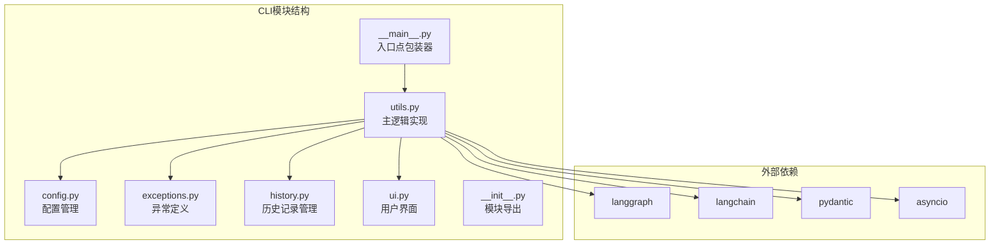
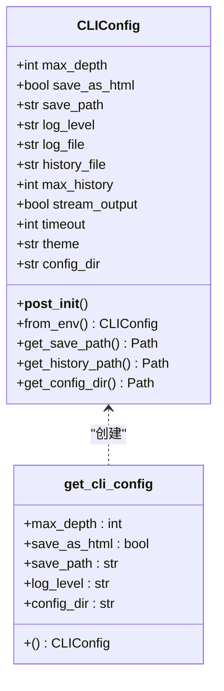
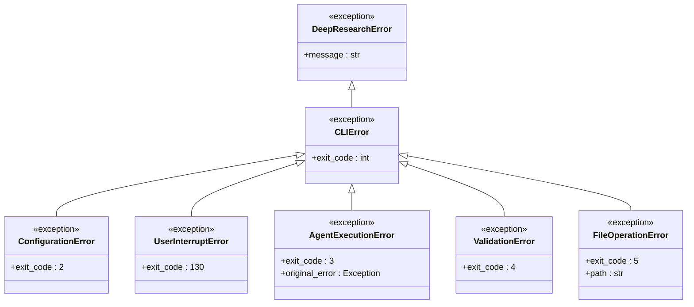
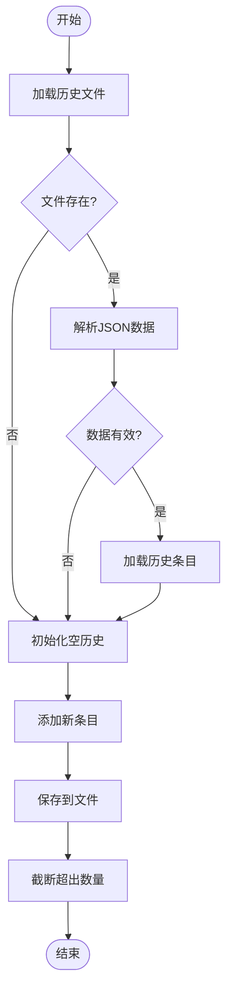
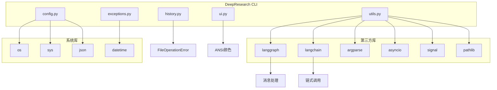
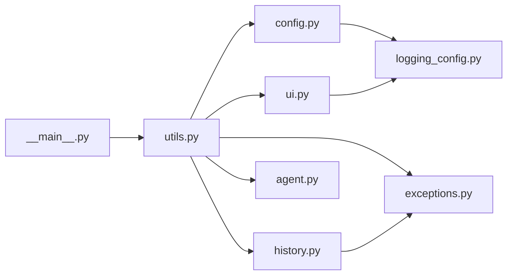

# 主命令入口

<cite>
**本文档引用的文件**
- [__main__.py](file://src/deepresearch/cli/__main__.py)
- [utils.py](file://src/deepresearch/cli/utils.py)
- [config.py](file://src/deepresearch/cli/config.py)
- [exceptions.py](file://src/deepresearch/cli/exceptions.py)
- [history.py](file://src/deepresearch/cli/history.py)
- [ui.py](file://src/deepresearch/cli/ui.py)
- [__init__.py](file://src/deepresearch/cli/__init__.py)
- [pyproject.toml](file://pyproject.toml)
- [README.md](file://README.md)
- [test_main.py](file://tests/unit/cli/test_main.py)
- [test_config.py](file://tests/unit/cli/test_config.py)
</cite>

## 目录
1. [简介](#简介)
2. [项目结构](#项目结构)
3. [核心组件](#核心组件)
4. [架构概览](#架构概览)
5. [详细组件分析](#详细组件分析)
6. [依赖分析](#依赖分析)
7. [性能考虑](#性能考虑)
8. [故障排除指南](#故障排除指南)
9. [结论](#结论)
10. [附录](#附录)

## 简介

DeepResearch的主命令入口是一个简洁而强大的CLI接口，负责处理用户输入、协调各个子系统并提供统一的程序生命周期管理。本文档深入分析了`__main__.py`的简单包装器设计和`utils.main()`函数的完整实现，包括命令行参数解析、异常处理和程序生命周期管理。

该系统采用异步编程模型，支持交互式对话模式和单次查询模式，集成了丰富的配置管理、历史记录管理和用户界面功能。

## 项目结构

DeepResearch CLI模块位于`src/deepresearch/cli/`目录下，主要包含以下关键文件：



**图表来源**
- [__main__.py:1-7](file://src/deepresearch/cli/__main__.py#L1-L7)
- [utils.py:1-575](file://src/deepresearch/cli/utils.py#L1-L575)

**章节来源**
- [__main__.py:1-7](file://src/deepresearch/cli/__main__.py#L1-L7)
- [utils.py:1-575](file://src/deepresearch/cli/utils.py#L1-L575)

## 核心组件

### 主入口包装器 (__main__.py)

`__main__.py`采用了极简的设计理念，仅包含3行代码：
- 导入sys模块用于进程控制
- 导入utils.main函数
- 在`__name__ == "__main__"`条件下调用main()并使用sys.exit()接收返回码

这种设计遵循了Python标准库的最佳实践，确保了：
- 清晰的入口点标识
- 标准化的退出码处理
- 与setuptools脚本入口的无缝集成

### 主逻辑实现 (utils.py)

`utils.main()`函数是整个CLI系统的核心，承担着以下职责：

#### 命令行参数解析
- 使用argparse创建完整的参数解析器
- 支持查询模式、配置目录、日志级别等参数
- 提供详细的帮助信息和环境变量说明

#### 异常处理机制
- 定义了专门的异常层次结构
- 实现了优雅的错误恢复和用户反馈
- 提供标准化的退出码

#### 程序生命周期管理
- 配置日志系统
- 初始化UI界面
- 管理Agent执行流程
- 处理信号中断

**章节来源**
- [__main__.py:1-7](file://src/deepresearch/cli/__main__.py#L1-L7)
- [utils.py:485-575](file://src/deepresearch/cli/utils.py#L485-L575)

## 架构概览

DeepResearch CLI采用分层架构设计，各组件职责明确：

```mermaid
graph TB
subgraph "用户层"
A[命令行用户]
B[配置文件]
end
subgraph "应用层"
C[CLI入口 (__main__.py)]
D[主逻辑 (utils.main)]
E[参数解析器]
end
subgraph "业务逻辑层"
F[配置管理 (CLIConfig)]
G[Agent执行 (call_agent)]
H[历史记录管理]
I[用户界面 (TerminalUI)]
end
subgraph "基础设施层"
J[日志系统]
K[异常处理]
L[信号处理]
end
subgraph "外部服务"
M[LLM服务]
N[搜索引擎]
O[文件系统]
end
A --> C
B --> F
C --> D
D --> E
D --> F
D --> G
D --> H
D --> I
F --> J
G --> K
G --> L
G --> M
G --> N
H --> O
I --> J
```

**图表来源**
- [utils.py:10-35](file://src/deepresearch/cli/utils.py#L10-L35)
- [config.py:15-28](file://src/deepresearch/cli/config.py#L15-L28)

## 详细组件分析

### 命令行参数解析器

`create_parser()`函数创建了一个功能完整的参数解析器：

#### 主要参数
- `-q, --query`: 单次查询模式，直接输入问题
- `-d, --depth`: 搜索深度设置 (1-10，默认3)
- `--no-html`: 禁用HTML报告保存
- `-o, --output`: 报告输出路径
- `--log-level`: 日志级别设置
- `--log-file`: 日志文件路径
- `--theme`: 界面主题样式
- `-c, --config-dir`: 自定义配置目录
- `-v, --version`: 版本信息

#### 环境变量支持
系统支持多个环境变量进行配置：
- `DEEPRESEARCH_MAX_DEPTH`: 默认搜索深度
- `DEEPRESEARCH_SAVE_AS_HTML`: HTML保存开关
- `DEEPRESEARCH_SAVE_PATH`: 报告保存路径
- `DEEPRESEARCH_LOG_LEVEL`: 日志级别
- `DEEPRESEARCH_THEME`: 界面主题
- `DEEPRESEARCH_CONFIG_DIR`: 配置目录

**章节来源**
- [utils.py:386-482](file://src/deepresearch/cli/utils.py#L386-L482)
- [config.py:35-50](file://src/deepresearch/cli/config.py#L35-L50)

### 配置管理系统

CLIConfig数据类提供了完整的配置管理能力：



**图表来源**
- [config.py:15-101](file://src/deepresearch/cli/config.py#L15-L101)

#### 配置验证
- 搜索深度限制在1-10范围内
- 历史记录数量限制在10-1000范围内
- 超时时间限制在30-3600秒范围内

#### 环境变量优先级
1. 命令行参数
2. 环境变量
3. 默认值

**章节来源**
- [config.py:29-33](file://src/deepresearch/cli/config.py#L29-L33)
- [config.py:72-93](file://src/deepresearch/cli/config.py#L72-L93)

### 异常处理体系

系统定义了专门的异常层次结构：



**图表来源**
- [exceptions.py:13-58](file://src/deepresearch/cli/exceptions.py#L13-L58)

#### 退出码规范
- 0: 正常退出
- 1: 通用错误
- 2: 配置错误
- 3: Agent执行错误
- 4: 输入验证错误
- 5: 文件操作错误
- 130: 用户中断

**章节来源**
- [exceptions.py:16-18](file://src/deepresearch/cli/exceptions.py#L16-L18)
- [utils.py:563-574](file://src/deepresearch/cli/utils.py#L563-L574)

### 用户界面系统

TerminalUI提供了丰富的终端输出功能：

#### 主题支持
- `default`: 标准主题
- `minimal`: 简洁主题  
- `colorful`: 彩色主题

#### 功能特性
- ANSI颜色支持
- 进度条显示
- 旋转指示器
- 格式化输出

**章节来源**
- [ui.py:66-382](file://src/deepresearch/cli/ui.py#L66-L382)

### 历史记录管理

HistoryManager提供了完整的对话历史管理：



**图表来源**
- [history.py:53-108](file://src/deepresearch/cli/history.py#L53-L108)

**章节来源**
- [history.py:18-166](file://src/deepresearch/cli/history.py#L18-L166)

## 依赖分析

### 外部依赖关系



**图表来源**
- [utils.py:10-35](file://src/deepresearch/cli/utils.py#L10-L35)
- [pyproject.toml:12-26](file://pyproject.toml#L12-L26)

### 内部模块依赖



**图表来源**
- [__main__.py:1-7](file://src/deepresearch/cli/__main__.py#L1-L7)
- [utils.py:20-35](file://src/deepresearch/cli/utils.py#L20-L35)

**章节来源**
- [pyproject.toml:12-26](file://pyproject.toml#L12-L26)

## 性能考虑

### 异步执行优化
- 使用asyncio提高并发性能
- 流式处理减少内存占用
- 异步Agent调用避免阻塞

### 资源管理
- 自动清理临时文件
- 进程信号处理
- 超时控制机制

### 缓存策略
- 配置文件缓存
- 历史记录持久化
- 日志轮转

## 故障排除指南

### 常见问题及解决方案

#### 配置错误
**症状**: 启动时出现配置错误
**原因**: 配置文件路径无效或权限不足
**解决**: 
1. 检查配置目录权限
2. 验证配置文件格式
3. 使用`--config-dir`指定正确路径

#### Agent执行失败
**症状**: Agent调用异常退出
**原因**: LLM服务不可用或API密钥错误
**解决**:
1. 检查网络连接
2. 验证API密钥配置
3. 查看日志文件获取详细错误信息

#### 内存不足
**症状**: 程序崩溃或响应缓慢
**原因**: 搜索深度过大或历史记录过多
**解决**:
1. 减小`--depth`参数
2. 清理历史记录
3. 增加系统内存

**章节来源**
- [exceptions.py:21-58](file://src/deepresearch/cli/exceptions.py#L21-L58)
- [utils.py:538-574](file://src/deepresearch/cli/utils.py#L538-L574)

## 结论

DeepResearch的主命令入口展现了优秀的软件工程实践：

1. **简洁性**: `__main__.py`仅3行代码，体现了"少即是多"的设计哲学
2. **健壮性**: 完善的异常处理和错误恢复机制
3. **可扩展性**: 模块化设计便于功能扩展
4. **用户体验**: 丰富的配置选项和友好的交互界面

该系统为深度研究任务提供了强大而易用的CLI工具，通过合理的架构设计和完善的错误处理，确保了稳定可靠的用户体验。

## 附录

### 命令行使用示例

#### 基本运行
```bash
# 启动交互式模式
deepresearch

# 单次查询模式
deepresearch -q "人工智能的发展趋势"

# 设置搜索深度
deepresearch --depth 5

# 禁用HTML保存
deepresearch --no-html

# 指定输出路径
deepresearch -o ./reports/my_report.html
```

#### 高级配置
```bash
# 设置日志级别
deepresearch --log-level DEBUG

# 指定配置目录
deepresearch --config-dir /path/to/config

# 设置主题
deepresearch --theme colorful

# 查看版本
deepresearch --version
```

#### 环境变量配置
```bash
export DEEPRESEARCH_MAX_DEPTH=7
export DEEPRESEARCH_THEME=colorful
export DEEPRESEARCH_LOG_LEVEL=DEBUG
deepresearch
```

**章节来源**
- [utils.py:392-408](file://src/deepresearch/cli/utils.py#L392-L408)
- [pyproject.toml:79-80](file://pyproject.toml#L79-L80)