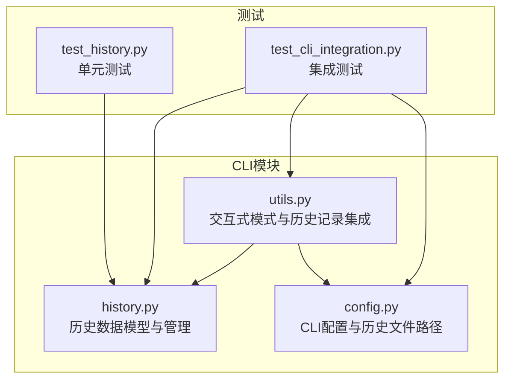
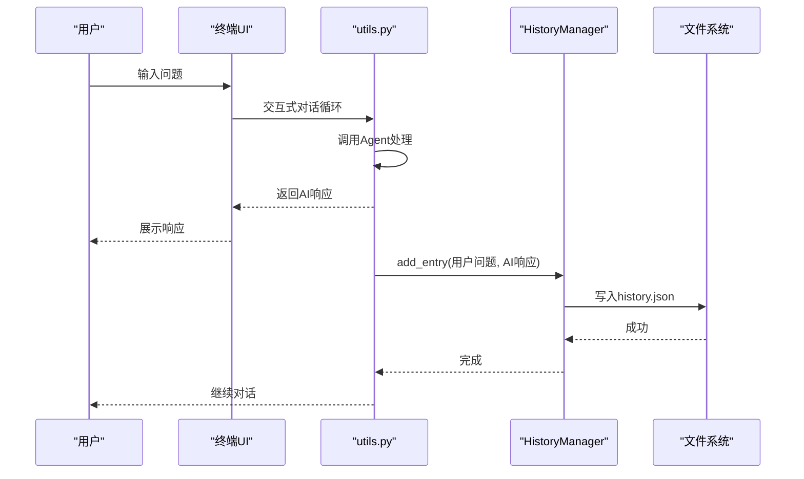
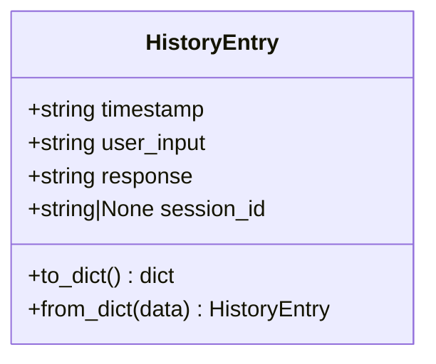
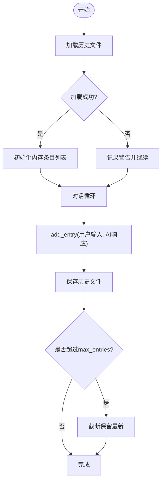
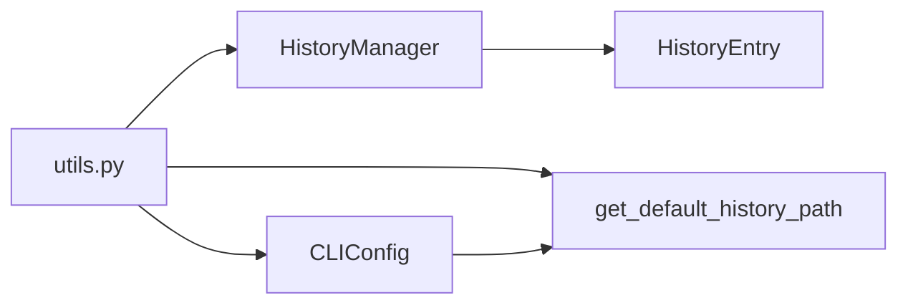

# 历史记录管理

<cite>
**本文引用的文件**
- [history.py](file://src/deepresearch/cli/history.py)
- [utils.py](file://src/deepresearch/cli/utils.py)
- [config.py](file://src/deepresearch/cli/config.py)
- [test_history.py](file://tests/unit/cli/test_history.py)
- [test_cli_integration.py](file://tests/integration/test_cli_integration.py)
</cite>

## 目录
1. [简介](#简介)
2. [项目结构](#项目结构)
3. [核心组件](#核心组件)
4. [架构总览](#架构总览)
5. [详细组件分析](#详细组件分析)
6. [依赖关系分析](#依赖关系分析)
7. [性能考量](#性能考量)
8. [故障排查指南](#故障排查指南)
9. [结论](#结论)
10. [附录](#附录)

## 简介
本文件面向DeepResearch的历史记录管理功能，聚焦于history.py中实现的历史查询、清理与恢复能力，说明历史记录的数据存储格式与检索机制，并提供增删改查（CRUD）操作示例（按时间、主题、状态过滤），以及清理策略与数据保留规则。同时给出历史记录导入导出与备份恢复的操作指南，帮助用户高效管理研究过程中的对话与问答历史。

## 项目结构
历史记录管理功能主要位于CLI子模块中：
- 数据模型与管理：src/deepresearch/cli/history.py
- CLI主流程与历史记录集成：src/deepresearch/cli/utils.py
- CLI配置与历史文件路径：src/deepresearch/cli/config.py
- 单元测试与集成测试：tests/unit/cli/test_history.py、tests/integration/test_cli_integration.py

图表来源
- [history.py:1-166](file://src/deepresearch/cli/history.py#L1-L166)
- [utils.py:1-575](file://src/deepresearch/cli/utils.py#L1-L575)
- [config.py:1-101](file://src/deepresearch/cli/config.py#L1-L101)
- [test_history.py:1-333](file://tests/unit/cli/test_history.py#L1-L333)
- [test_cli_integration.py:1-229](file://tests/integration/test_cli_integration.py#L1-L229)

章节来源
- [history.py:1-166](file://src/deepresearch/cli/history.py#L1-L166)
- [utils.py:195-303](file://src/deepresearch/cli/utils.py#L195-L303)
- [config.py:15-64](file://src/deepresearch/cli/config.py#L15-L64)

## 核心组件
- 历史条目模型：HistoryEntry，包含时间戳、用户输入、AI响应、会话ID等字段，支持序列化/反序列化。
- 历史管理器：HistoryManager，负责加载、保存、查询、清理历史记录，维护最大条目数与会话隔离。
- 默认历史文件路径：根据操作系统选择合适的用户数据目录，统一生成history.json路径。
- CLI集成：在交互式模式下自动初始化历史管理器，保存每次问答对；支持“history”、“search”等命令。

章节来源
- [history.py:18-36](file://src/deepresearch/cli/history.py#L18-L36)
- [history.py:38-152](file://src/deepresearch/cli/history.py#L38-L152)
- [history.py:155-166](file://src/deepresearch/cli/history.py#L155-L166)
- [utils.py:216-294](file://src/deepresearch/cli/utils.py#L216-L294)

## 架构总览
历史记录管理采用“内存+持久化”的双层设计：
- 内存层：HistoryManager维护当前进程内的历史条目列表，支持快速查询与统计。
- 持久化层：通过JSON文件保存历史记录，支持跨进程/重启恢复。

图表来源
- [utils.py:255-294](file://src/deepresearch/cli/utils.py#L255-L294)
- [history.py:72-90](file://src/deepresearch/cli/history.py#L72-L90)

## 详细组件分析

### 历史条目模型（HistoryEntry）
- 字段
  - 时间戳：字符串，ISO 8601格式
  - 用户输入：字符串
  - AI响应：字符串
  - 会话ID：字符串或None
- 方法
  - to_dict/from_dict：序列化/反序列化，兼容缺失字段
- 设计要点
  - 使用dataclass简化结构与默认值
  - 支持从字典部分字段构造，增强容错性

图表来源
- [history.py:18-36](file://src/deepresearch/cli/history.py#L18-L36)

章节来源
- [history.py:18-36](file://src/deepresearch/cli/history.py#L18-L36)

### 历史管理器（HistoryManager）
- 关键职责
  - 加载历史：从JSON文件读取，仅保留最新max_entries条目
  - 保存历史：写回JSON文件，UTF-8编码，缩进美化
  - 添加条目：追加新条目，超出上限则截断保留最新
  - 查询历史：最近N条、按会话ID筛选、关键字搜索
  - 清空历史：删除文件并清空内存
  - 统计信息：总条目数、会话数、首尾时间
- 错误处理
  - JSON格式错误：记录警告并保持可用状态
  - 文件写入异常：抛出FileOperationError
  - 删除文件异常：抛出FileOperationError
- 并发与一致性
  - 进程内线程安全：单实例管理；跨进程需外部同步
  - 保存策略：每次add_entry后立即落盘，失败记录警告

图表来源
- [history.py:53-108](file://src/deepresearch/cli/history.py#L53-L108)

章节来源
- [history.py:38-152](file://src/deepresearch/cli/history.py#L38-L152)

### 默认历史文件路径（get_default_history_path）
- 跨平台策略
  - Windows：APPDATA目录
  - Linux/Unix：XDG_DATA_HOME或~/.local/share
- 目录与文件
  - 目录：deepresearch
  - 文件：history.json
- 行为
  - 自动创建目录
  - 返回Path对象

章节来源
- [history.py:155-166](file://src/deepresearch/cli/history.py#L155-L166)

### CLI集成（utils.py）
- 初始化
  - 优先使用CLIConfig中配置的历史文件路径，否则使用默认路径
  - max_entries来自CLIConfig.max_history
- 命令支持
  - history：显示最近历史
  - search <关键词>：按关键词搜索
  - clear：清空当前对话（不影响历史文件）
  - help：显示帮助
- 保存策略
  - 每次AI响应后调用history.add_entry保存

章节来源
- [utils.py:216-294](file://src/deepresearch/cli/utils.py#L216-L294)
- [utils.py:329-355](file://src/deepresearch/cli/utils.py#L329-L355)

### 配置与路径（config.py）
- CLIConfig字段
  - history_file：历史文件路径（可为空）
  - max_history：最大历史条目数，默认100，范围[10, 1000]
  - get_history_path：解析并返回Path或None
- 环境变量覆盖
  - 支持DEEPRESEARCH_HISTORY_FILE、DEEPRESEARCH_MAX_HISTORY等

章节来源
- [config.py:15-64](file://src/deepresearch/cli/config.py#L15-L64)

## 依赖关系分析
- utils.py依赖HistoryManager与get_default_history_path
- HistoryManager依赖logging与异常类型
- CLIConfig提供历史文件路径与max_entries配置
- 测试覆盖了HistoryEntry、HistoryManager、持久化、跨平台、性能与错误恢复

图表来源
- [utils.py:28-29](file://src/deepresearch/cli/utils.py#L28-L29)
- [history.py:38-39](file://src/deepresearch/cli/history.py#L38-L39)
- [config.py:55-58](file://src/deepresearch/cli/config.py#L55-L58)

章节来源
- [utils.py:28-29](file://src/deepresearch/cli/utils.py#L28-L29)
- [history.py:38-39](file://src/deepresearch/cli/history.py#L38-L39)
- [config.py:55-58](file://src/deepresearch/cli/config.py#L55-L58)

## 性能考量
- 查询复杂度
  - 最近N条：O(N)，内存切片
  - 按会话筛选：O(n)，遍历列表
  - 关键词搜索：O(n)，逐条字符串匹配（大小写不敏感）
- 存储与I/O
  - JSON文件整体读写，适合中小规模历史
  - 每次新增均落盘，保证可靠性但可能影响高频场景吞吐
- 上限控制
  - max_entries限制内存与文件大小，避免无限增长
- 建议
  - 大量历史时建议定期清理或分段归档
  - 若需要高性能查询，可考虑引入索引或数据库替代方案

章节来源
- [history.py:109-123](file://src/deepresearch/cli/history.py#L109-L123)
- [test_cli_integration.py:195-208](file://tests/integration/test_cli_integration.py#L195-L208)

## 故障排查指南
- 历史文件损坏
  - 现象：启动时报格式错误或历史为空
  - 处理：修复或删除history.json，重新运行后自动重建
- 保存失败
  - 现象：新增条目后未落盘，记录警告
  - 处理：检查磁盘权限与空间，确认目标路径可写
- 删除历史文件失败
  - 现象：clear()抛出FileOperationError
  - 处理：确认文件不存在或权限足够，必要时手动删除
- 跨平台路径问题
  - 现象：历史文件不在预期位置
  - 处理：使用CLIConfig.history_file显式指定路径，或使用默认路径生成逻辑

章节来源
- [test_history.py:270-286](file://tests/unit/cli/test_history.py#L270-L286)
- [history.py:67-90](file://src/deepresearch/cli/history.py#L67-L90)
- [history.py:132-135](file://src/deepresearch/cli/history.py#L132-L135)

## 结论
DeepResearch的历史记录管理以简洁可靠为核心目标：基于JSON文件的轻量持久化、内存中的高效查询、严格的上限控制与良好的跨平台兼容性。通过CLI命令即可完成历史查询、清理与统计，满足日常研究过程中的历史追踪需求。对于大规模或高并发场景，建议结合外部工具进行定期归档与迁移。

## 附录

### 历史记录数据存储格式与检索机制
- 存储格式
  - JSON数组，元素为HistoryEntry的字典表示
  - 字段：timestamp、user_input、response、session_id
- 检索机制
  - 最近N条：直接取尾部切片
  - 按会话：按session_id过滤
  - 关键词搜索：对user_input与response进行大小写不敏感匹配
- 保留规则
  - max_entries限制最新条目数量
  - 清空历史会删除文件并清空内存

章节来源
- [history.py:57-84](file://src/deepresearch/cli/history.py#L57-L84)
- [history.py:109-123](file://src/deepresearch/cli/history.py#L109-L123)
- [history.py:125-136](file://src/deepresearch/cli/history.py#L125-L136)

### 增删改查（CRUD）操作示例
- 新增（保存一次问答）
  - 在交互式模式下输入问题，AI返回响应后自动保存
  - 示例路径：[utils.py:292-294](file://src/deepresearch/cli/utils.py#L292-L294)
- 查询
  - 最近历史：history命令
    - 示例路径：[utils.py:329-339](file://src/deepresearch/cli/utils.py#L329-L339)
  - 按关键词搜索：search <关键词>
    - 示例路径：[utils.py:341-355](file://src/deepresearch/cli/utils.py#L341-L355)
  - 按会话：get_session_history(session_id)
    - 示例路径：[history.py:112-114](file://src/deepresearch/cli/history.py#L112-L114)
- 修改
  - 当前实现不支持直接修改历史条目；可通过导出后编辑再导入的方式间接实现
- 删除
  - 清空历史：clear()
    - 示例路径：[history.py:125-136](file://src/deepresearch/cli/history.py#L125-L136)
  - 删除单条：当前未提供API；可通过导出后过滤再导入实现

章节来源
- [utils.py:255-294](file://src/deepresearch/cli/utils.py#L255-L294)
- [history.py:112-136](file://src/deepresearch/cli/history.py#L112-L136)

### 过滤与统计
- 按时间
  - 使用get_recent(count)获取最近N条，内部按时间顺序排列
  - 示例路径：[history.py:109-111](file://src/deepresearch/cli/history.py#L109-L111)
- 按主题（关键词）
  - 使用search(keyword)在user_input与response中检索
  - 示例路径：[history.py:116-123](file://src/deepresearch/cli/history.py#L116-L123)
- 按状态（会话）
  - 使用get_session_history(session_id)按会话ID过滤
  - 示例路径：[history.py:112-114](file://src/deepresearch/cli/history.py#L112-L114)
- 统计
  - 使用get_stats()获取总数、会话数与首尾时间
  - 示例路径：[history.py:137-152](file://src/deepresearch/cli/history.py#L137-L152)

章节来源
- [history.py:109-152](file://src/deepresearch/cli/history.py#L109-L152)

### 清理策略与数据保留规则
- 清理策略
  - clear()：删除历史文件并清空内存
  - 截断策略：当新增条目超过max_entries时，仅保留最新条目
- 数据保留规则
  - max_entries默认100，范围[10, 1000]
  - 会话隔离：不同会话ID的历史相互独立
- 建议
  - 定期导出重要历史，避免意外丢失
  - 大量历史时适当降低max_entries以控制文件大小

章节来源
- [history.py:125-136](file://src/deepresearch/cli/history.py#L125-L136)
- [history.py:101-103](file://src/deepresearch/cli/history.py#L101-L103)
- [config.py:31](file://src/deepresearch/cli/config.py#L31)

### 导入、导出与备份恢复
- 导出
  - 直接复制history.json文件至任意位置
  - 或使用CLI命令查看历史后手工记录关键内容
- 导入
  - 将备份的history.json替换当前历史文件
  - 注意：导入前应停止所有DeepResearch进程，避免并发写入
- 备份恢复
  - 建议定期备份history.json
  - 恢复时将备份文件重命名为history.json并放回原位
- 注意事项
  - 跨平台迁移时，注意路径差异与权限
  - 导入前确保JSON格式正确，避免损坏导致加载失败

章节来源
- [history.py:57-84](file://src/deepresearch/cli/history.py#L57-L84)
- [history.py:155-166](file://src/deepresearch/cli/history.py#L155-L166)