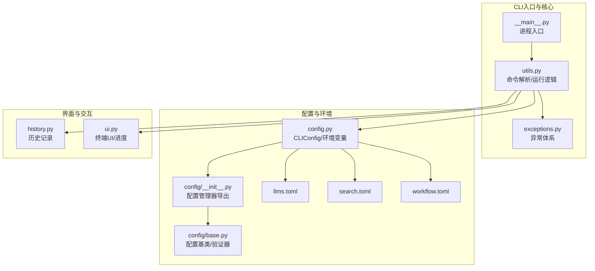
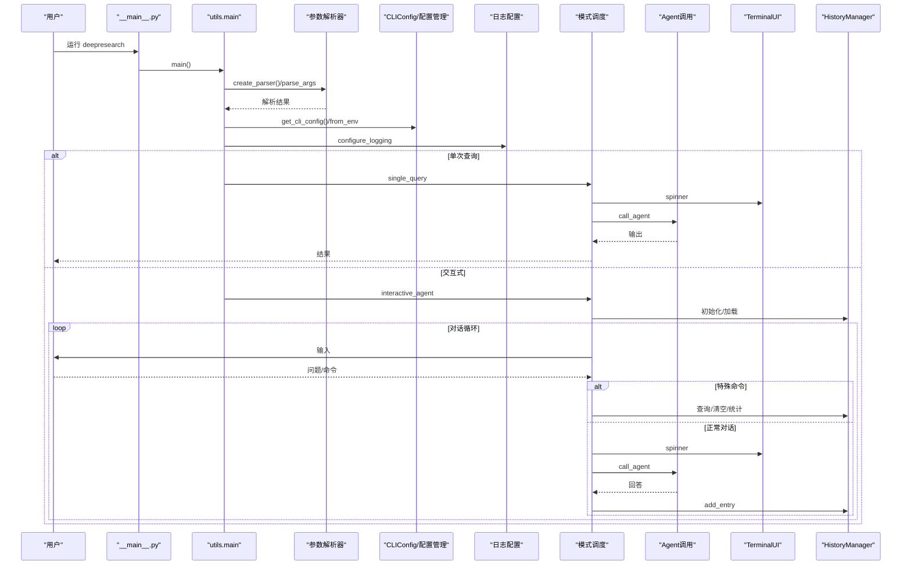
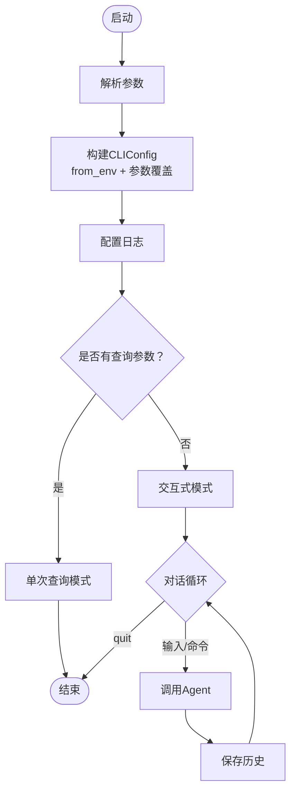
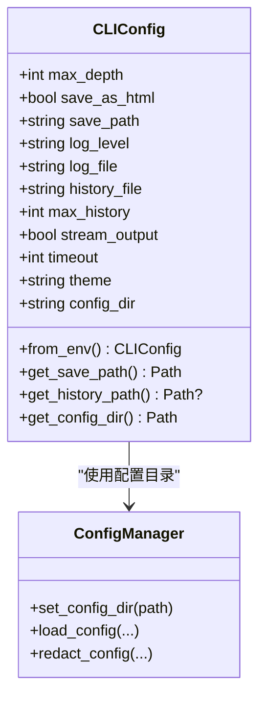
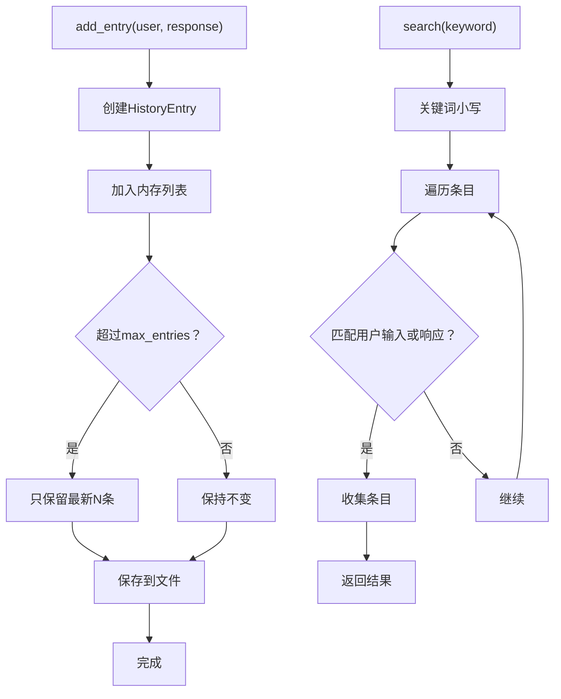
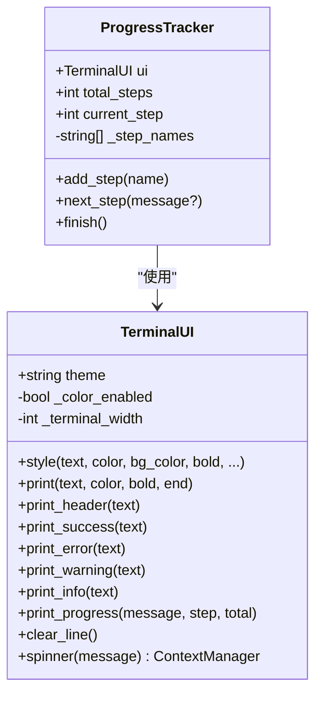
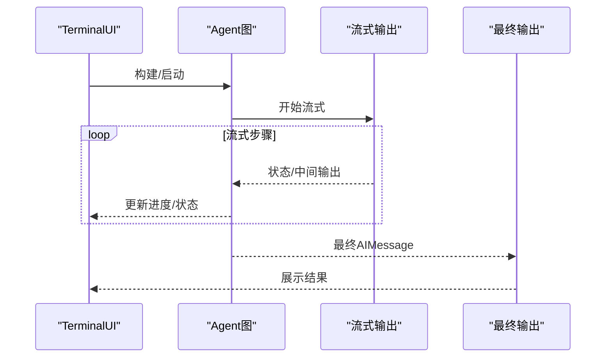
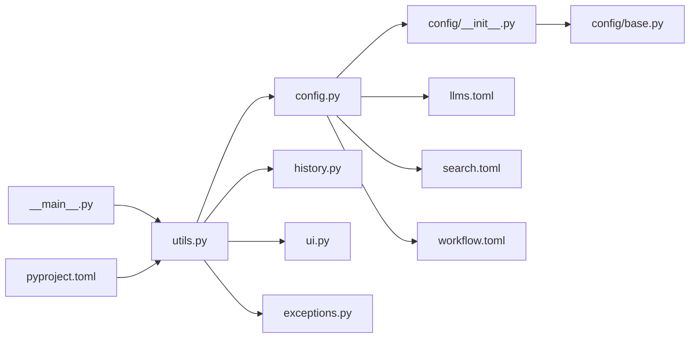

# 命令行界面

<cite>
**本文引用的文件**
- [src/deepresearch/cli/__main__.py](file://src/deepresearch/cli/__main__.py)
- [src/deepresearch/cli/utils.py](file://src/deepresearch/cli/utils.py)
- [src/deepresearch/cli/config.py](file://src/deepresearch/cli/config.py)
- [src/deepresearch/cli/history.py](file://src/deepresearch/cli/history.py)
- [src/deepresearch/cli/ui.py](file://src/deepresearch/cli/ui.py)
- [src/deepresearch/cli/exceptions.py](file://src/deepresearch/cli/exceptions.py)
- [src/deepresearch/config/__init__.py](file://src/deepresearch/config/__init__.py)
- [src/deepresearch/config/base.py](file://src/deepresearch/config/base.py)
- [config/llms.toml](file://config/llms.toml)
- [config/search.toml](file://config/search.toml)
- [config/workflow.toml](file://config/workflow.toml)
- [pyproject.toml](file://pyproject.toml)
- [tests/unit/cli/test_main.py](file://tests/unit/cli/test_main.py)
- [tests/unit/cli/test_config.py](file://tests/unit/cli/test_config.py)
- [tests/unit/cli/test_history.py](file://tests/unit/cli/test_history.py)
- [tests/unit/cli/test_ui.py](file://tests/unit/cli/test_ui.py)
</cite>

## 目录
1. [简介](#简介)
2. [项目结构](#项目结构)
3. [核心组件](#核心组件)
4. [架构总览](#架构总览)
5. [详细组件分析](#详细组件分析)
6. [依赖分析](#依赖分析)
7. [性能考虑](#性能考虑)
8. [故障排除指南](#故障排除指南)
9. [结论](#结论)
10. [附录](#附录)

## 简介
本文件面向DeepResearch命令行界面（CLI），系统性阐述主命令入口、命令解析机制、配置管理、历史记录管理、用户界面组件设计，以及命令行参数、使用示例与故障排除。同时提供CLI扩展与自定义命令的开发方法，帮助开发者快速上手并进行二次扩展。

## 项目结构
CLI相关代码集中在src/deepresearch/cli目录，核心文件包括：
- 入口模块：__main__.py、utils.py
- 配置管理：config.py
- 历史记录：history.py
- 用户界面：ui.py
- 异常定义：exceptions.py
- 配置系统：config子包（统一配置管理）
- 配置文件：config/*.toml
- 包元数据：pyproject.toml
- 单元测试：tests/unit/cli/*

**图表来源**
- [src/deepresearch/cli/__main__.py:1-7](file://src/deepresearch/cli/__main__.py#L1-L7)
- [src/deepresearch/cli/utils.py:1-575](file://src/deepresearch/cli/utils.py#L1-L575)
- [src/deepresearch/cli/config.py:1-101](file://src/deepresearch/cli/config.py#L1-L101)
- [src/deepresearch/cli/history.py:1-166](file://src/deepresearch/cli/history.py#L1-L166)
- [src/deepresearch/cli/ui.py:1-382](file://src/deepresearch/cli/ui.py#L1-L382)
- [src/deepresearch/cli/exceptions.py:1-58](file://src/deepresearch/cli/exceptions.py#L1-L58)
- [src/deepresearch/config/__init__.py:1-75](file://src/deepresearch/config/__init__.py#L1-L75)
- [src/deepresearch/config/base.py:1-200](file://src/deepresearch/config/base.py#L1-L200)
- [config/llms.toml:1-29](file://config/llms.toml#L1-L29)
- [config/search.toml:1-6](file://config/search.toml#L1-L6)
- [config/workflow.toml:1-3](file://config/workflow.toml#L1-L3)

**章节来源**
- [src/deepresearch/cli/__main__.py:1-7](file://src/deepresearch/cli/__main__.py#L1-L7)
- [src/deepresearch/cli/utils.py:386-482](file://src/deepresearch/cli/utils.py#L386-L482)
- [pyproject.toml:79-80](file://pyproject.toml#L79-L80)

## 核心组件
- 主入口与控制流：__main__.py委托utils.main执行；utils.py负责参数解析、配置构建、日志配置、单次查询与交互式模式调度。
- 配置管理：CLIConfig封装CLI相关配置，支持环境变量覆盖与参数覆盖；统一配置管理器负责配置目录与配置加载。
- 历史记录：HistoryManager提供历史条目的增删查统计与持久化。
- 用户界面：TerminalUI提供主题化输出、进度条、旋转指示器；ProgressTracker辅助多步任务进度展示。
- 异常体系：CLIError及其子类用于标准化错误传播与退出码。

**章节来源**
- [src/deepresearch/cli/utils.py:485-575](file://src/deepresearch/cli/utils.py#L485-L575)
- [src/deepresearch/cli/config.py:15-101](file://src/deepresearch/cli/config.py#L15-L101)
- [src/deepresearch/cli/history.py:18-166](file://src/deepresearch/cli/history.py#L18-L166)
- [src/deepresearch/cli/ui.py:66-382](file://src/deepresearch/cli/ui.py#L66-L382)
- [src/deepresearch/cli/exceptions.py:13-58](file://src/deepresearch/cli/exceptions.py#L13-L58)

## 架构总览
CLI采用“入口解析—配置构建—日志初始化—模式调度”的分层架构。交互式模式支持命令与历史查询；单次查询模式适合脚本化调用。UI模块与历史模块作为横切关注点贯穿流程。

**图表来源**
- [src/deepresearch/cli/__main__.py:1-7](file://src/deepresearch/cli/__main__.py#L1-L7)
- [src/deepresearch/cli/utils.py:386-575](file://src/deepresearch/cli/utils.py#L386-L575)
- [src/deepresearch/cli/history.py:38-166](file://src/deepresearch/cli/history.py#L38-L166)
- [src/deepresearch/cli/ui.py:260-300](file://src/deepresearch/cli/ui.py#L260-L300)

## 详细组件分析

### 主命令入口与控制流
- __main__.py仅导入并调用utils.main，实现最小入口。
- utils.main负责：
  - 创建参数解析器并解析参数
  - 校验并设置配置目录（支持环境变量与参数）
  - 构建CLIConfig（环境变量优先，参数覆盖）
  - 配置日志
  - 分派至单次查询或交互式模式
  - 捕获键盘中断与CLI错误，返回相应退出码

**图表来源**
- [src/deepresearch/cli/utils.py:485-575](file://src/deepresearch/cli/utils.py#L485-L575)
- [src/deepresearch/cli/utils.py:386-482](file://src/deepresearch/cli/utils.py#L386-L482)

**章节来源**
- [src/deepresearch/cli/__main__.py:1-7](file://src/deepresearch/cli/__main__.py#L1-L7)
- [src/deepresearch/cli/utils.py:485-575](file://src/deepresearch/cli/utils.py#L485-L575)

### 命令解析与参数说明
- 支持的主要参数：
  - -q/--query：单次查询模式
  - -d/--depth：搜索深度（1-10）
  - --no-html：不保存HTML报告
  - -o/--output：报告输出路径
  - --log-level/--log-file：日志级别与文件
  - --theme：界面主题（default/minimal/colorful）
  - -c/--config-dir：自定义配置目录
  - -v/--version：显示版本
- 环境变量：
  - DEEPRESEARCH_MAX_DEPTH、DEEPRESEARCH_SAVE_AS_HTML、DEEPRESEARCH_SAVE_PATH、DEEPRESEARCH_LOG_LEVEL、DEEPRESEARCH_LOG_FILE、DEEPRESEARCH_THEME、DEEPRESEARCH_CONFIG_DIR

使用示例（基于测试用例与帮助信息）：
- 启动交互式模式：deepresearch
- 单次查询：deepresearch -q "人工智能的发展趋势"
- 设置深度与主题：deepresearch --depth 5 --theme colorful
- 关闭HTML保存：deepresearch --no-html
- 指定配置目录：deepresearch --config-dir /path/to/config

**章节来源**
- [src/deepresearch/cli/utils.py:386-482](file://src/deepresearch/cli/utils.py#L386-L482)
- [tests/unit/cli/test_main.py:62-143](file://tests/unit/cli/test_main.py#L62-L143)
- [tests/unit/cli/test_main.py:230-270](file://tests/unit/cli/test_main.py#L230-L270)

### 配置管理
- CLIConfig：
  - 字段涵盖深度、保存策略、日志、历史、超时、主题、配置目录等
  - 环境变量加载：from_env
  - 参数覆盖：get_cli_config
  - 范围约束：__post_init__内对max_depth/max_history/timeout进行裁剪
  - 路径解析：get_save_path/get_history_path/get_config_dir
- 统一配置系统：
  - config/__init__.py导出ConfigManager与验证器
  - config/base.py提供BaseConfig、验证器、敏感字段处理等

**图表来源**
- [src/deepresearch/cli/config.py:15-101](file://src/deepresearch/cli/config.py#L15-L101)
- [src/deepresearch/config/__init__.py:14-75](file://src/deepresearch/config/__init__.py#L14-L75)
- [src/deepresearch/config/base.py:190-200](file://src/deepresearch/config/base.py#L190-L200)

**章节来源**
- [src/deepresearch/cli/config.py:15-101](file://src/deepresearch/cli/config.py#L15-L101)
- [tests/unit/cli/test_config.py:15-175](file://tests/unit/cli/test_config.py#L15-L175)
- [src/deepresearch/config/base.py:190-200](file://src/deepresearch/config/base.py#L190-L200)

### 历史记录管理
- 数据模型：
  - HistoryEntry：时间戳、用户输入、AI响应、会话ID
  - HistoryManager：增删查统计、持久化、会话隔离
- 关键能力：
  - add_entry：追加并截断至max_entries
  - get_recent：最近N条
  - get_session_history：按会话过滤
  - search：关键词模糊检索（大小写不敏感）
  - clear：清空并删除文件
  - get_stats：统计总数、会话数、首末时间
  - get_default_history_path：跨平台默认历史目录

**图表来源**
- [src/deepresearch/cli/history.py:18-166](file://src/deepresearch/cli/history.py#L18-L166)

**章节来源**
- [src/deepresearch/cli/history.py:18-166](file://src/deepresearch/cli/history.py#L18-L166)
- [tests/unit/cli/test_history.py:74-333](file://tests/unit/cli/test_history.py#L74-L333)

### 用户界面组件
- TerminalUI：
  - 主题：default/minimal/colorful
  - 颜色与样式：ANSI转义，自动检测TTY支持
  - 输出：print/print_header/print_success/print_error/print_warning/print_info
  - 进度：print_progress（百分比/计数）
  - 旋转指示器：spinner（上下文管理器）
- ProgressTracker：
  - 管理多步骤任务，自动显示步骤名称或自定义消息
- create_ui：工厂函数

**图表来源**
- [src/deepresearch/cli/ui.py:66-382](file://src/deepresearch/cli/ui.py#L66-L382)

**章节来源**
- [src/deepresearch/cli/ui.py:66-382](file://src/deepresearch/cli/ui.py#L66-L382)
- [tests/unit/cli/test_ui.py:14-320](file://tests/unit/cli/test_ui.py#L14-L320)

### Agent调用与消息流
- validate_messages：校验消息列表合法性
- call_agent：构建Agent图，流式消费输出，处理中断与异常
- 交互式模式：支持help/history/search/clear/quit等命令
- 单次查询：简化流程，直接返回结果

**图表来源**
- [src/deepresearch/cli/utils.py:106-193](file://src/deepresearch/cli/utils.py#L106-L193)

**章节来源**
- [src/deepresearch/cli/utils.py:82-193](file://src/deepresearch/cli/utils.py#L82-L193)

## 依赖分析
- 入口与运行：__main__.py依赖utils.main；utils依赖config/history/ui/exceptions。
- 配置系统：CLIConfig依赖config/__init__.py与config/base.py；配置文件为llms.toml/search.toml/workflow.toml。
- 包元数据：pyproject.toml定义命令入口deepresearch指向utils:main。

**图表来源**
- [src/deepresearch/cli/__main__.py:1-7](file://src/deepresearch/cli/__main__.py#L1-L7)
- [src/deepresearch/cli/utils.py:10-34](file://src/deepresearch/cli/utils.py#L10-L34)
- [src/deepresearch/cli/config.py:10-12](file://src/deepresearch/cli/config.py#L10-L12)
- [src/deepresearch/config/__init__.py:14-75](file://src/deepresearch/config/__init__.py#L14-L75)
- [src/deepresearch/config/base.py:4-12](file://src/deepresearch/config/base.py#L4-L12)
- [pyproject.toml:79-80](file://pyproject.toml#L79-L80)

**章节来源**
- [pyproject.toml:79-80](file://pyproject.toml#L79-L80)

## 性能考虑
- 流式输出：call_agent使用流式模式，避免一次性缓冲大量中间结果，提升交互体验。
- 历史截断：HistoryManager维护max_entries上限，防止历史文件无限增长。
- 终端宽度与颜色检测：减少不必要的ANSI开销，避免在非TTY环境输出彩色。
- 超时控制：CLIConfig.timeout提供全局超时上限，结合Agent执行策略降低长时间阻塞风险。
- I/O优化：历史文件写入采用批量序列化，避免频繁落盘。

[本节为通用指导，无需特定文件引用]

## 故障排除指南
常见问题与定位要点：
- 参数解析失败：检查--log-level/--theme等参数取值是否在允许范围内；参考帮助信息与测试用例。
- 配置目录无效：validate_config_dir会拒绝不存在/非目录/不可读路径；确认权限与路径展开。
- Agent执行错误：捕获AgentExecutionError，查看日志定位具体阶段；必要时增大--depth或调整--timeout。
- 历史文件损坏：HistoryManager对JSON解析失败进行降级处理；可通过clear清空并重建。
- 用户中断：KeyboardInterrupt映射为退出码130；交互式模式支持Ctrl+C中断当前操作。
- 日志级别与文件：若--log-file未指定，使用控制台输出；指定后需确保路径可写。

**章节来源**
- [src/deepresearch/cli/utils.py:538-575](file://src/deepresearch/cli/utils.py#L538-L575)
- [src/deepresearch/cli/history.py:53-90](file://src/deepresearch/cli/history.py#L53-L90)
- [src/deepresearch/cli/exceptions.py:13-58](file://src/deepresearch/cli/exceptions.py#L13-L58)

## 结论
DeepResearch CLI以清晰的分层架构实现了从参数解析到模式调度、从配置管理到历史记录与UI反馈的完整闭环。其设计兼顾易用性与可扩展性，既满足交互式探索，也支持脚本化调用。通过统一配置系统与完善的异常体系，CLI具备良好的稳定性与可维护性。

[本节为总结性内容，无需特定文件引用]

## 附录

### 命令行参数速查
- -q/--query：单次查询内容
- -d/--depth：搜索深度（1-10）
- --no-html：禁用HTML报告保存
- -o/--output：报告输出路径
- --log-level：日志级别（DEBUG/INFO/WARNING/ERROR/CRITICAL）
- --log-file：日志文件路径
- --theme：界面主题（default/minimal/colorful）
- -c/--config-dir：自定义配置目录
- -v/--version：显示版本

**章节来源**
- [src/deepresearch/cli/utils.py:386-482](file://src/deepresearch/cli/utils.py#L386-L482)

### 使用示例
- 交互式模式：deepresearch
- 单次查询：deepresearch -q "大模型发展趋势"
- 指定深度与主题：deepresearch --depth 5 --theme colorful
- 关闭HTML保存：deepresearch --no-html
- 指定配置目录：deepresearch --config-dir ~/.myconfig

**章节来源**
- [tests/unit/cli/test_main.py:62-143](file://tests/unit/cli/test_main.py#L62-L143)

### CLI扩展与自定义命令开发
- 新增命令子类：在utils.py中扩展create_parser，增加新子命令与参数。
- 自定义模式：新增模式函数并在main中分派；复用TerminalUI与HistoryManager。
- 配置扩展：在config子包中定义新配置字段与验证器，或通过环境变量注入。
- UI增强：在ui.py中扩展TerminalUI方法或新增工具函数。
- 历史扩展：在history.py中扩展HistoryManager能力，如新增索引或归档策略。

**章节来源**
- [src/deepresearch/cli/utils.py:386-482](file://src/deepresearch/cli/utils.py#L386-L482)
- [src/deepresearch/cli/ui.py:66-382](file://src/deepresearch/cli/ui.py#L66-L382)
- [src/deepresearch/config/base.py:65-183](file://src/deepresearch/config/base.py#L65-L183)