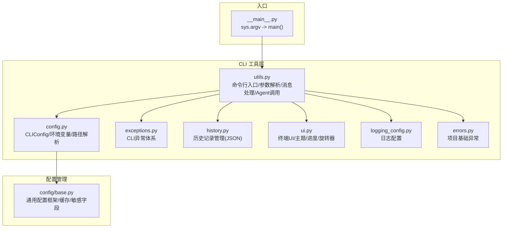
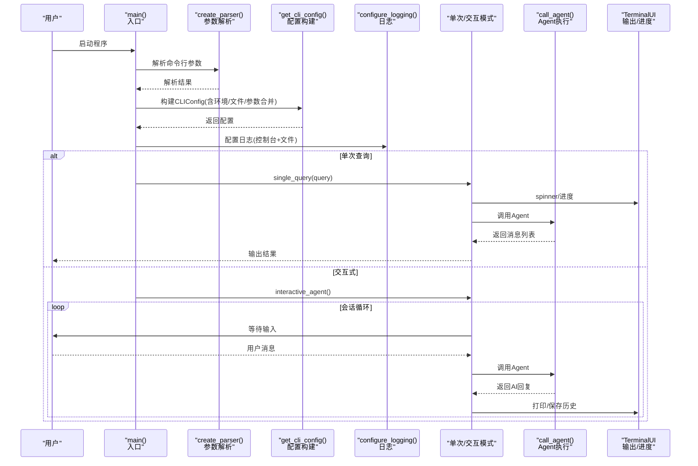
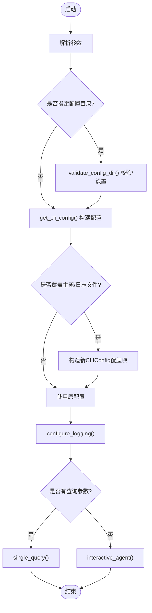
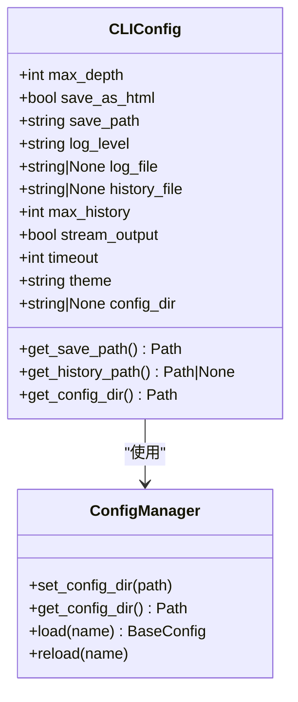
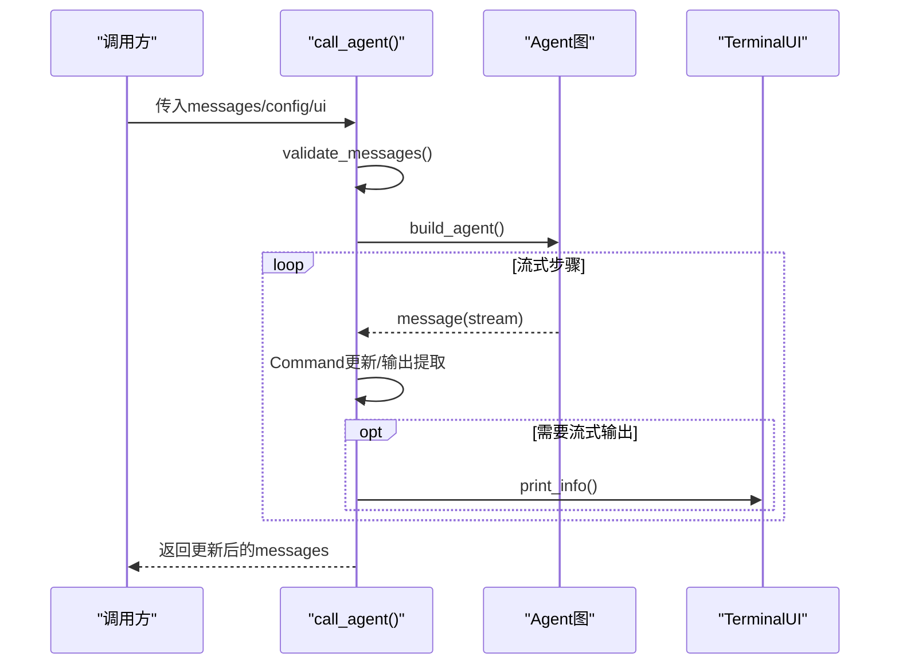
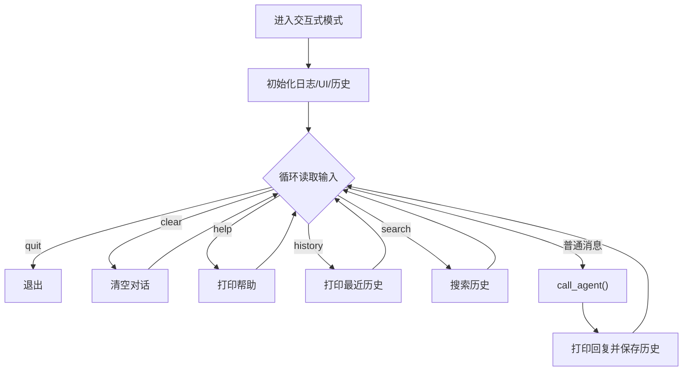
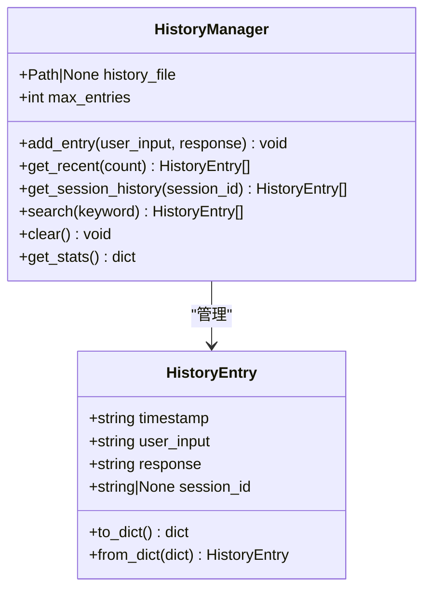
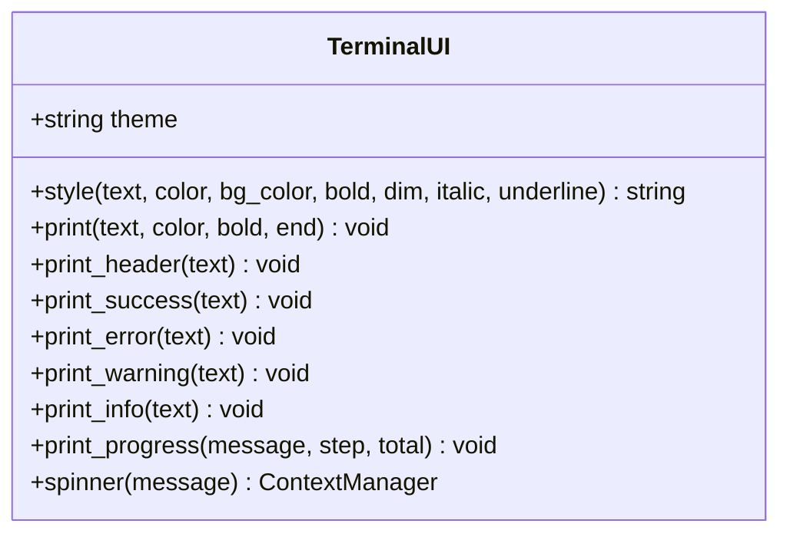
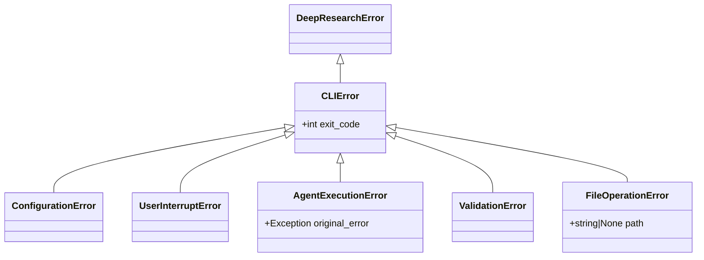
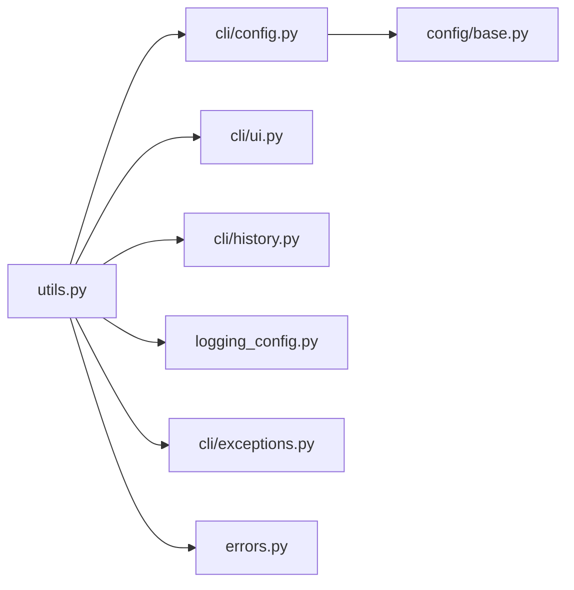

# 工具函数

<cite>
**本文引用的文件**
- [src/deepresearch/cli/utils.py](file://src/deepresearch/cli/utils.py)
- [src/deepresearch/cli/config.py](file://src/deepresearch/cli/config.py)
- [src/deepresearch/cli/exceptions.py](file://src/deepresearch/cli/exceptions.py)
- [src/deepresearch/cli/history.py](file://src/deepresearch/cli/history.py)
- [src/deepresearch/cli/ui.py](file://src/deepresearch/cli/ui.py)
- [src/deepresearch/cli/__main__.py](file://src/deepresearch/cli/__main__.py)
- [src/deepresearch/config/base.py](file://src/deepresearch/config/base.py)
- [src/deepresearch/logging_config.py](file://src/deepresearch/logging_config.py)
- [src/deepresearch/errors.py](file://src/deepresearch/errors.py)
- [tests/unit/cli/test_main.py](file://tests/unit/cli/test_main.py)
- [tests/unit/cli/test_config.py](file://tests/unit/cli/test_config.py)
</cite>

## 目录
1. [简介](#简介)
2. [项目结构](#项目结构)
3. [核心组件](#核心组件)
4. [架构总览](#架构总览)
5. [详细组件分析](#详细组件分析)
6. [依赖分析](#依赖分析)
7. [性能考虑](#性能考虑)
8. [故障排查指南](#故障排查指南)
9. [结论](#结论)
10. [附录](#附录)

## 简介
本文件面向 DeepResearch CLI 的工具函数，聚焦于 src/deepresearch/cli/utils.py 中的命令行参数处理、路径解析、文件操作与系统集成能力，系统阐述其设计原则、使用模式、扩展方法以及错误处理与异常管理机制。同时提供常见使用示例与最佳实践，帮助开发者快速上手并安全地定制工具函数。

## 项目结构
CLI 工具函数位于 src/deepresearch/cli/utils.py，围绕命令行入口、参数解析、配置加载、消息校验、Agent 调用、交互式对话与单次查询、历史记录与 UI 输出、信号处理与日志配置等模块协同工作。

**图表来源**
- [src/deepresearch/cli/utils.py:1-575](file://src/deepresearch/cli/utils.py#L1-L575)
- [src/deepresearch/cli/config.py:1-101](file://src/deepresearch/cli/config.py#L1-L101)
- [src/deepresearch/cli/exceptions.py:1-58](file://src/deepresearch/cli/exceptions.py#L1-L58)
- [src/deepresearch/cli/history.py:1-166](file://src/deepresearch/cli/history.py#L1-L166)
- [src/deepresearch/cli/ui.py:1-382](file://src/deepresearch/cli/ui.py#L1-L382)
- [src/deepresearch/logging_config.py:1-67](file://src/deepresearch/logging_config.py#L1-L67)
- [src/deepresearch/errors.py:1-26](file://src/deepresearch/errors.py#L1-L26)
- [src/deepresearch/config/base.py:1-590](file://src/deepresearch/config/base.py#L1-L590)
- [src/deepresearch/cli/__main__.py:1-7](file://src/deepresearch/cli/__main__.py#L1-L7)

**章节来源**
- [src/deepresearch/cli/utils.py:1-575](file://src/deepresearch/cli/utils.py#L1-L575)
- [src/deepresearch/cli/__main__.py:1-7](file://src/deepresearch/cli/__main__.py#L1-L7)

## 核心组件
- 命令行入口与控制流：负责解析参数、构建配置、选择运行模式（交互式/单次查询）、处理信号与异常、输出日志。
- 配置系统：提供 CLIConfig 数据类与 get_cli_config 工厂函数，支持环境变量、文件与参数的多源合并与范围约束。
- 消息处理：校验 LangChain 消息类型，保证 Agent 输入合法性。
- Agent 调用：封装构建图、流式执行、命令类型处理、输出提取与中断处理。
- 历史记录：JSON 存储、分页与搜索、统计与清理。
- 终端 UI：主题化输出、进度条、旋转器、颜色与终端能力检测。
- 日志系统：控制台与文件双通道、格式化、级别控制。
- 异常体系：CLIError 及其子类，统一错误码与用户反馈。

**章节来源**
- [src/deepresearch/cli/utils.py:106-384](file://src/deepresearch/cli/utils.py#L106-L384)
- [src/deepresearch/cli/config.py:15-101](file://src/deepresearch/cli/config.py#L15-L101)
- [src/deepresearch/cli/exceptions.py:13-58](file://src/deepresearch/cli/exceptions.py#L13-L58)
- [src/deepresearch/cli/history.py:18-166](file://src/deepresearch/cli/history.py#L18-L166)
- [src/deepresearch/cli/ui.py:66-382](file://src/deepresearch/cli/ui.py#L66-L382)
- [src/deepresearch/logging_config.py:15-67](file://src/deepresearch/logging_config.py#L15-L67)

## 架构总览
CLI 工具函数采用“入口解析 -> 配置构建 -> 模式分发 -> 业务执行 -> 结果输出”的流水线式控制流，并通过异常与日志保障可观测性与可维护性。

**图表来源**
- [src/deepresearch/cli/utils.py:485-575](file://src/deepresearch/cli/utils.py#L485-L575)
- [src/deepresearch/cli/utils.py:386-483](file://src/deepresearch/cli/utils.py#L386-L483)
- [src/deepresearch/cli/utils.py:511-544](file://src/deepresearch/cli/utils.py#L511-L544)
- [src/deepresearch/cli/utils.py:554-574](file://src/deepresearch/cli/utils.py#L554-L574)
- [src/deepresearch/cli/utils.py:357-384](file://src/deepresearch/cli/utils.py#L357-L384)
- [src/deepresearch/cli/utils.py:195-304](file://src/deepresearch/cli/utils.py#L195-L304)
- [src/deepresearch/cli/utils.py:106-193](file://src/deepresearch/cli/utils.py#L106-L193)
- [src/deepresearch/cli/ui.py:260-300](file://src/deepresearch/cli/ui.py#L260-L300)
- [src/deepresearch/logging_config.py:15-67](file://src/deepresearch/logging_config.py#L15-L67)

## 详细组件分析

### 命令行参数处理与入口
- 参数解析器 create_parser() 提供查询、深度、HTML 保存、输出路径、日志级别/文件、主题、配置目录、版本等选项，并附带示例与环境变量说明。
- 入口 main() 负责：
  - 解析参数
  - 校验并应用配置目录 validate_config_dir()
  - 构建 CLIConfig 并支持覆盖主题与日志文件
  - 配置日志
  - 分发到单次查询或交互式模式
  - 捕获 KeyboardInterrupt、CLIError 等并返回相应退出码

**图表来源**
- [src/deepresearch/cli/utils.py:386-483](file://src/deepresearch/cli/utils.py#L386-L483)
- [src/deepresearch/cli/utils.py:485-575](file://src/deepresearch/cli/utils.py#L485-L575)
- [src/deepresearch/cli/utils.py:497-544](file://src/deepresearch/cli/utils.py#L497-L544)
- [src/deepresearch/cli/utils.py:545-574](file://src/deepresearch/cli/utils.py#L545-L574)

**章节来源**
- [src/deepresearch/cli/utils.py:386-575](file://src/deepresearch/cli/utils.py#L386-L575)
- [tests/unit/cli/test_main.py:62-143](file://tests/unit/cli/test_main.py#L62-L143)

### 配置系统与路径解析
- CLIConfig 数据类提供默认值、范围约束与路径解析方法：
  - max_depth、max_history、timeout 的边界约束
  - get_save_path()/get_history_path()/get_config_dir() 统一进行 expanduser/resolve
- get_cli_config() 从环境变量加载，再与参数覆盖合并，确保灵活性与一致性。
- 配置目录支持环境变量与参数覆盖，结合 config/base.py 的 ConfigManager 实现全局缓存与目录切换。

**图表来源**
- [src/deepresearch/cli/config.py:15-101](file://src/deepresearch/cli/config.py#L15-L101)
- [src/deepresearch/config/base.py:373-456](file://src/deepresearch/config/base.py#L373-L456)

**章节来源**
- [src/deepresearch/cli/config.py:15-101](file://src/deepresearch/cli/config.py#L15-L101)
- [src/deepresearch/config/base.py:373-456](file://src/deepresearch/config/base.py#L373-L456)
- [tests/unit/cli/test_config.py:18-100](file://tests/unit/cli/test_config.py#L18-L100)

### 消息校验与 Agent 调用
- validate_messages() 校验输入消息列表，确保仅包含 HumanMessage/AIMessage。
- call_agent()：
  - 构建 Agent 图并流式执行
  - 处理 Command 类型更新
  - 提取 output.message 作为最终输出
  - 支持 SIGINT/SIGTERM 中断，抛出 UserInterruptError
  - 捕获 Agent 执行异常，抛出 AgentExecutionError

**图表来源**
- [src/deepresearch/cli/utils.py:106-193](file://src/deepresearch/cli/utils.py#L106-L193)

**章节来源**
- [src/deepresearch/cli/utils.py:82-193](file://src/deepresearch/cli/utils.py#L82-L193)
- [tests/unit/cli/test_main.py:24-60](file://tests/unit/cli/test_main.py#L24-L60)

### 交互式对话与单次查询
- interactive_agent()：
  - 初始化日志、UI、历史管理器
  - 循环读取用户输入，识别 help/clear/history/search 等命令
  - 调用 call_agent()，打印 AI 回复并写入历史
  - 捕获 UserInterruptError 与 AgentExecutionError，优雅恢复
- single_query()：
  - 构造单条 HumanMessage
  - 调用 call_agent()，返回最后一条 AIMessage 内容

**图表来源**
- [src/deepresearch/cli/utils.py:195-304](file://src/deepresearch/cli/utils.py#L195-L304)
- [src/deepresearch/cli/utils.py:357-384](file://src/deepresearch/cli/utils.py#L357-L384)

**章节来源**
- [src/deepresearch/cli/utils.py:195-384](file://src/deepresearch/cli/utils.py#L195-L384)
- [tests/unit/cli/test_main.py:145-228](file://tests/unit/cli/test_main.py#L145-L228)

### 历史记录管理
- HistoryEntry：记录时间戳、用户输入、AI 回复、会话 ID
- HistoryManager：
  - JSON 文件存储，支持加载、保存、搜索、统计
  - 最大条目数限制，自动截断
  - 清空历史文件（FileOperationError 包装）
  - 默认历史文件路径按平台选择

**图表来源**
- [src/deepresearch/cli/history.py:18-166](file://src/deepresearch/cli/history.py#L18-L166)

**章节来源**
- [src/deepresearch/cli/history.py:18-166](file://src/deepresearch/cli/history.py#L18-L166)

### 终端 UI 与系统集成
- TerminalUI：
  - 颜色与样式：ANSI 码、主题（default/minimal/colorful）
  - 终端能力检测（Windows/Unix）、宽度获取
  - 进度条、旋转器、标题/状态输出
- 系统集成：
  - 信号处理（SIGINT/SIGTERM）设置全局中断标记
  - 日志配置（控制台+文件）

**图表来源**
- [src/deepresearch/cli/ui.py:66-382](file://src/deepresearch/cli/ui.py#L66-L382)

**章节来源**
- [src/deepresearch/cli/ui.py:66-382](file://src/deepresearch/cli/ui.py#L66-L382)
- [src/deepresearch/cli/utils.py:70-80](file://src/deepresearch/cli/utils.py#L70-L80)
- [src/deepresearch/logging_config.py:15-67](file://src/deepresearch/logging_config.py#L15-L67)

### 错误处理与异常管理
- 异常层次：
  - DeepResearchError（项目基类）
  - CLIError（CLI通用错误，含 exit_code）
  - ConfigurationError、UserInterruptError、AgentExecutionError、ValidationError、FileOperationError
- main() 捕获 KeyboardInterrupt、CLIError 与未预期异常，分别返回不同退出码，保证用户友好提示。
- call_agent() 捕获 Agent 执行异常并包装为 AgentExecutionError；支持信号中断抛出 UserInterruptError。
- HistoryManager 在保存失败时抛出 FileOperationError，避免影响主流程。

**图表来源**
- [src/deepresearch/errors.py:4-26](file://src/deepresearch/errors.py#L4-L26)
- [src/deepresearch/cli/exceptions.py:13-58](file://src/deepresearch/cli/exceptions.py#L13-L58)

**章节来源**
- [src/deepresearch/cli/exceptions.py:13-58](file://src/deepresearch/cli/exceptions.py#L13-L58)
- [src/deepresearch/errors.py:4-26](file://src/deepresearch/errors.py#L4-L26)
- [src/deepresearch/cli/utils.py:147-192](file://src/deepresearch/cli/utils.py#L147-L192)
- [src/deepresearch/cli/history.py:87-90](file://src/deepresearch/cli/history.py#L87-L90)

## 依赖分析
- utils.py 依赖：
  - CLIConfig/get_cli_config：配置构建与覆盖
  - TerminalUI/create_ui：终端输出与进度
  - HistoryManager/get_default_history_path：历史记录持久化
  - 日志配置：configure_logging/get_logger
  - 异常体系：CLIError/ConfigurationError/UserInterruptError/AgentExecutionError/ValidationError
  - LangChain 消息类型：HumanMessage/AIMessage
  - LangGraph Command 类型：流式输出命令更新
- 配置管理：
  - CLIConfig 依赖 config/base.py 的 ConfigManager 与环境变量解析
- UI 与日志：
  - UI 依赖终端能力检测与 ANSI 控制
  - 日志支持控制台与文件双通道

**图表来源**
- [src/deepresearch/cli/utils.py:10-35](file://src/deepresearch/cli/utils.py#L10-L35)
- [src/deepresearch/cli/config.py:1-35](file://src/deepresearch/cli/config.py#L1-L35)
- [src/deepresearch/config/base.py:373-456](file://src/deepresearch/config/base.py#L373-L456)

**章节来源**
- [src/deepresearch/cli/utils.py:10-35](file://src/deepresearch/cli/utils.py#L10-L35)
- [src/deepresearch/cli/config.py:1-35](file://src/deepresearch/cli/config.py#L1-L35)
- [src/deepresearch/config/base.py:373-456](file://src/deepresearch/config/base.py#L373-L456)

## 性能考虑
- 流式输出：交互模式下可开启 stream_output，降低首帧延迟，提升感知性能。
- 缓存与范围约束：CLIConfig 对关键参数做范围约束，避免极端配置引发资源浪费。
- 日志级别：合理设置日志级别，生产环境建议 INFO 或 WARNING，减少 IO 压力。
- 历史文件：max_history 限制与 JSON 截断，避免历史文件过大影响读写性能。

[本节为通用指导，无需列出具体文件来源]

## 故障排查指南
- 配置目录无效
  - 症状：抛出 ConfigurationError，退出码 2
  - 排查：确认路径存在、为目录且可读；必要时使用环境变量 DEEPRESEARCH_CONFIG_DIR
  - 参考：validate_config_dir() 与 main() 的错误处理
- Agent 执行失败
  - 症状：抛出 AgentExecutionError，退出码 3
  - 排查：查看日志文件定位原始异常；检查模型配置与网络连通性
  - 参考：call_agent() 异常捕获与包装
- 用户中断
  - 症状：抛出 UserInterruptError，退出码 130
  - 排查：确认信号处理正常；交互模式下可重复尝试
  - 参考：信号处理器与 main() 捕获
- 历史记录保存失败
  - 症状：警告日志，但不影响主流程
  - 排查：检查历史文件权限与磁盘空间
  - 参考：HistoryManager._save_history() 的 FileOperationError 包装

**章节来源**
- [src/deepresearch/cli/utils.py:497-544](file://src/deepresearch/cli/utils.py#L497-L544)
- [src/deepresearch/cli/utils.py:147-192](file://src/deepresearch/cli/utils.py#L147-L192)
- [src/deepresearch/cli/history.py:72-90](file://src/deepresearch/cli/history.py#L72-L90)

## 结论
DeepResearch CLI 工具函数以清晰的职责划分与稳健的异常处理为核心，结合灵活的配置系统、完善的日志与 UI 能力，为用户提供一致、可扩展且易维护的命令行体验。遵循本文的最佳实践与扩展建议，可在不破坏现有行为的前提下安全地定制工具函数。

[本节为总结性内容，无需列出具体文件来源]

## 附录

### 常用工具函数与使用示例（路径指引）
- 参数解析与入口
  - [create_parser():386-483](file://src/deepresearch/cli/utils.py#L386-L483)
  - [main():485-575](file://src/deepresearch/cli/utils.py#L485-L575)
- 配置加载与覆盖
  - [CLIConfig:15-101](file://src/deepresearch/cli/config.py#L15-L101)
  - [get_cli_config():66-101](file://src/deepresearch/cli/config.py#L66-L101)
- 消息校验与 Agent 调用
  - [validate_messages():82-104](file://src/deepresearch/cli/utils.py#L82-L104)
  - [call_agent():106-193](file://src/deepresearch/cli/utils.py#L106-L193)
- 运行模式
  - [single_query():357-384](file://src/deepresearch/cli/utils.py#L357-L384)
  - [interactive_agent():195-304](file://src/deepresearch/cli/utils.py#L195-L304)
- 历史记录
  - [HistoryManager:38-166](file://src/deepresearch/cli/history.py#L38-L166)
- 终端 UI
  - [TerminalUI:66-382](file://src/deepresearch/cli/ui.py#L66-L382)
- 日志配置
  - [configure_logging():15-67](file://src/deepresearch/logging_config.py#L15-L67)

### 最佳实践
- 参数优先级：代码参数 > 环境变量 > 配置文件 > 默认值
- 路径解析：始终使用 get_save_path()/get_history_path()/get_config_dir() 统一解析
- 异常处理：对外暴露 CLIError 子类，保持 exit_code 语义一致
- UI 与日志：在关键步骤使用 spinner/print_progress，合理设置日志级别
- 历史记录：定期清理或调整 max_history，避免磁盘压力

### 扩展与自定义
- 新增命令行参数：在 create_parser() 中添加新选项，并在 main() 中解析与覆盖 CLIConfig
- 自定义配置来源：通过 config/base.py 的 ConfigManager.register_loader() 注册自定义加载器
- 替换 UI 主题：在 CLIConfig/theme 中选择 default/minimal/colorful，或扩展 TerminalUI
- 增强历史记录：在 HistoryManager 中扩展搜索策略或导出格式
- 错误分类：在 exceptions.py 中新增子类，保持与 CLIError 的继承关系

**章节来源**
- [src/deepresearch/cli/utils.py:386-575](file://src/deepresearch/cli/utils.py#L386-L575)
- [src/deepresearch/cli/config.py:66-101](file://src/deepresearch/cli/config.py#L66-L101)
- [src/deepresearch/config/base.py:410-456](file://src/deepresearch/config/base.py#L410-L456)
- [src/deepresearch/cli/ui.py:364-382](file://src/deepresearch/cli/ui.py#L364-L382)
- [src/deepresearch/cli/history.py:116-166](file://src/deepresearch/cli/history.py#L116-L166)
- [src/deepresearch/cli/exceptions.py:13-58](file://src/deepresearch/cli/exceptions.py#L13-L58)