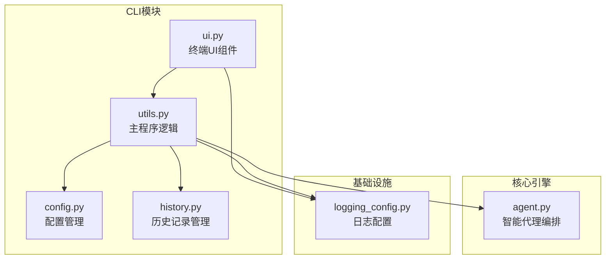
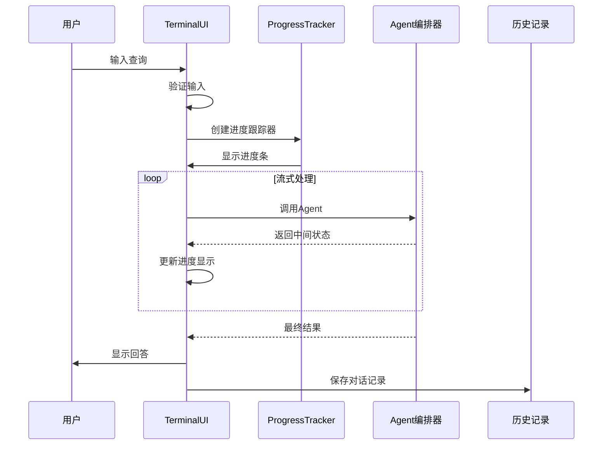
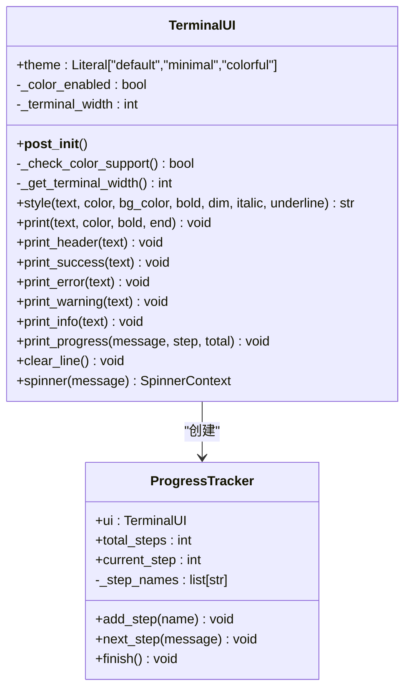
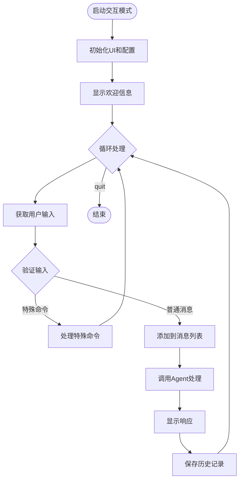
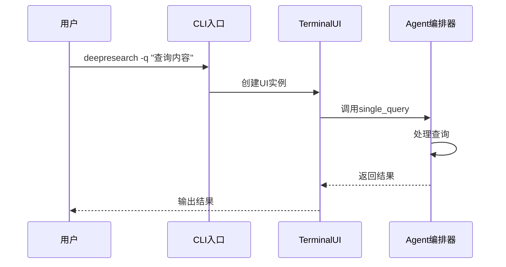
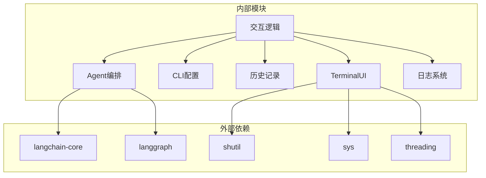

# 用户界面组件

<cite>
**本文引用的文件**
- [ui.py](file://src/deepresearch/cli/ui.py)
- [utils.py](file://src/deepresearch/cli/utils.py)
- [config.py](file://src/deepresearch/cli/config.py)
- [history.py](file://src/deepresearch/cli/history.py)
- [agent.py](file://src/deepresearch/agent/agent.py)
- [logging_config.py](file://src/deepresearch/logging_config.py)
- [test_ui.py](file://tests/unit/cli/test_ui.py)
- [README.md](file://README.md)
</cite>

## 目录
1. [简介](#简介)
2. [项目结构](#项目结构)
3. [核心组件](#核心组件)
4. [架构概览](#架构概览)
5. [详细组件分析](#详细组件分析)
6. [依赖分析](#依赖分析)
7. [性能考虑](#性能考虑)
8. [故障排除指南](#故障排除指南)
9. [结论](#结论)
10. [附录](#附录)

## 简介
本文档深入解析DeepResearch CLI用户界面组件，重点覆盖src/deepresearch/cli/ui.py中实现的交互式问答、进度显示和状态反馈功能。文档详细说明了用户界面的渲染机制、事件处理流程，并提供交互式查询的使用示例，包括多轮对话、上下文保持和结果展示。同时涵盖进度条、状态指示器和错误消息的显示方式，以及界面定制选项和用户体验优化建议。

## 项目结构
DeepResearch CLI模块采用分层设计，用户界面组件位于cli子包中，与配置管理、历史记录管理和日志系统协同工作。



**图表来源**
- [ui.py:1-382](file://src/deepresearch/cli/ui.py#L1-L382)
- [utils.py:1-575](file://src/deepresearch/cli/utils.py#L1-L575)
- [config.py:1-101](file://src/deepresearch/cli/config.py#L1-L101)
- [history.py:1-166](file://src/deepresearch/cli/history.py#L1-L166)
- [agent.py:1-45](file://src/deepresearch/agent/agent.py#L1-L45)
- [logging_config.py:1-67](file://src/deepresearch/logging_config.py#L1-L67)

**章节来源**
- [ui.py:1-382](file://src/deepresearch/cli/ui.py#L1-L382)
- [utils.py:1-575](file://src/deepresearch/cli/utils.py#L1-L575)
- [config.py:1-101](file://src/deepresearch/cli/config.py#L1-L101)

## 核心组件
用户界面系统由三个核心组件构成：TerminalUI终端界面类、ProgressTracker进度跟踪器和工厂函数create_ui。这些组件协同提供完整的交互式体验。

### TerminalUI终端界面类
TerminalUI是用户界面的核心类，提供以下功能：
- 文本样式化和颜色支持
- 主题系统（default、minimal、colorful）
- 进度条显示
- 状态消息输出
- 旋转指示器动画

### ProgressTracker进度跟踪器
ProgressTracker专门用于跟踪多步骤任务的进度，与TerminalUI配合使用：
- 自动管理步骤计数
- 动态步骤名称管理
- 进度百分比计算
- 完成状态标记

### 工厂函数create_ui
提供统一的UI实例创建接口，支持主题定制。

**章节来源**
- [ui.py:66-382](file://src/deepresearch/cli/ui.py#L66-L382)

## 架构概览
用户界面架构采用分层设计，从底层的终端渲染到底层的Agent交互，形成完整的数据流。



**图表来源**
- [utils.py:106-193](file://src/deepresearch/cli/utils.py#L106-L193)
- [ui.py:302-362](file://src/deepresearch/cli/ui.py#L302-L362)

## 详细组件分析

### TerminalUI类详细分析

#### 类结构图


**图表来源**
- [ui.py:66-382](file://src/deepresearch/cli/ui.py#L66-L382)

#### 颜色和样式系统
TerminalUI实现了完整的ANSI颜色支持系统，包括：
- 前景色映射（16种标准颜色）
- 背景色映射（8种背景色）
- 文本样式（粗体、斜体、下划线等）
- 自动颜色支持检测

#### 主题系统
支持三种主题风格：
- **default**: 标准蓝色主题，适合大多数场景
- **minimal**: 简洁主题，减少视觉干扰
- **colorful**: 彩色主题，增强视觉效果

#### 进度显示机制
进度条采用Unicode字符实现，支持：
- 百分比计算和显示
- 实心和空心块字符组合
- 主题适配的颜色显示
- 自动换行处理

#### 旋转指示器
提供上下文管理器形式的旋转动画：
- 多种Unicode旋转字符循环
- 线程安全的动画显示
- 自动清理机制

**章节来源**
- [ui.py:66-382](file://src/deepresearch/cli/ui.py#L66-L382)

### 交互式问答系统

#### 交互流程图


**图表来源**
- [utils.py:195-303](file://src/deepresearch/cli/utils.py#L195-L303)

#### 特殊命令系统
交互模式支持以下特殊命令：
- **help**: 显示帮助信息
- **quit**: 退出程序
- **clear**: 清空当前对话
- **history**: 显示最近历史记录
- **search <关键词>**: 搜索历史记录

#### 多轮对话上下文保持
系统通过维护消息列表实现上下文保持：
- 自动保存用户输入和AI响应
- 支持历史记录查询和搜索
- 会话ID自动管理

**章节来源**
- [utils.py:195-303](file://src/deepresearch/cli/utils.py#L195-L303)
- [history.py:18-166](file://src/deepresearch/cli/history.py#L18-L166)

### 单次查询模式

#### 单次查询流程


**图表来源**
- [utils.py:357-384](file://src/deepresearch/cli/utils.py#L357-L384)

**章节来源**
- [utils.py:357-384](file://src/deepresearch/cli/utils.py#L357-L384)

## 依赖分析

### 组件依赖关系


**图表来源**
- [ui.py:10-19](file://src/deepresearch/cli/ui.py#L10-L19)
- [utils.py:17-35](file://src/deepresearch/cli/utils.py#L17-L35)

### 关键依赖说明
- **langchain-core**: 提供消息类型定义（HumanMessage、AIMessage）
- **langgraph**: 提供状态图编排和流式处理能力
- **shutil**: 获取终端尺寸信息
- **threading**: 支持旋转指示器的并发显示

**章节来源**
- [utils.py:17-35](file://src/deepresearch/cli/utils.py#L17-L35)
- [ui.py:10-19](file://src/deepresearch/cli/ui.py#L10-L19)

## 性能考虑
用户界面组件在设计时充分考虑了性能和用户体验：

### 终端兼容性优化
- 自动检测终端颜色支持，避免不必要的ANSI转义序列
- 终端宽度动态获取，适应不同窗口大小
- 进度条使用固定长度，避免频繁重绘

### 内存管理
- 历史记录限制最大条目数（默认100条）
- 消息列表仅保存必要信息
- 自动清理临时文件和资源

### 并发处理
- 旋转指示器使用独立线程，不影响主流程
- 异步Agent调用支持流式输出
- 信号处理支持优雅中断

## 故障排除指南

### 常见问题及解决方案

#### 颜色显示异常
**症状**: 文本没有颜色或显示乱码
**原因**: 终端不支持ANSI颜色
**解决**: 
- 检查终端类型和配置
- 使用minimal主题避免颜色输出
- 在非TTY环境中自动禁用颜色

#### 进度条显示问题
**症状**: 进度条显示不完整或错位
**原因**: 终端宽度检测失败
**解决**:
- 检查终端环境变量
- 手动设置终端宽度
- 使用默认宽度80字符

#### 旋转指示器卡顿
**症状**: 动画停止或卡顿
**原因**: 线程阻塞或资源竞争
**解决**:
- 检查系统资源使用
- 确保线程安全访问
- 适当调整刷新频率

#### 历史记录保存失败
**症状**: 对话历史丢失或保存错误
**原因**: 文件权限或磁盘空间不足
**解决**:
- 检查目标目录权限
- 确保磁盘空间充足
- 验证文件路径有效性

**章节来源**
- [test_ui.py:192-218](file://tests/unit/cli/test_ui.py#L192-L218)
- [history.py:72-91](file://src/deepresearch/cli/history.py#L72-L91)

## 结论
DeepResearch用户界面组件提供了完整的交互式体验，具有以下特点：

1. **模块化设计**: TerminalUI和ProgressTracker职责清晰，易于扩展和维护
2. **主题灵活**: 支持多种主题风格，适应不同用户偏好
3. **性能优化**: 自动检测和资源管理，确保流畅的用户体验
4. **错误处理**: 完善的异常处理和恢复机制
5. **可扩展性**: 基于数据类的设计便于功能扩展

该组件体系为DeepResearch提供了强大而灵活的用户界面基础，支持从简单的单次查询到复杂的多轮对话场景。

## 附录

### 使用示例

#### 基本交互模式
```bash
# 启动交互式模式
deepresearch

# 单次查询模式
deepresearch -q "人工智能的发展趋势"

# 设置搜索深度
deepresearch --depth 5

# 使用彩色主题
deepresearch --theme colorful
```

#### 高级配置
```bash
# 设置自定义配置目录
deepresearch --config-dir /path/to/config

# 禁用HTML保存
deepresearch --no-html

# 设置输出路径
deepresearch -o /path/to/output
```

### 环境变量配置
- `DEEPRESEARCH_THEME`: 界面主题（default/minimal/colorful）
- `DEEPRESEARCH_MAX_DEPTH`: 最大搜索深度（1-10）
- `DEEPRESEARCH_SAVE_AS_HTML`: 是否保存HTML报告
- `DEEPRESEARCH_LOG_LEVEL`: 日志级别
- `DEEPRESEARCH_CONFIG_DIR`: 配置目录路径

### 用户体验优化建议
1. **主题选择**: 根据使用环境选择合适的主题
2. **历史记录管理**: 定期清理不需要的历史记录
3. **日志配置**: 在调试时启用详细日志
4. **超时设置**: 根据网络环境调整超时时间
5. **颜色支持**: 在支持ANSI的颜色终端中获得最佳视觉效果