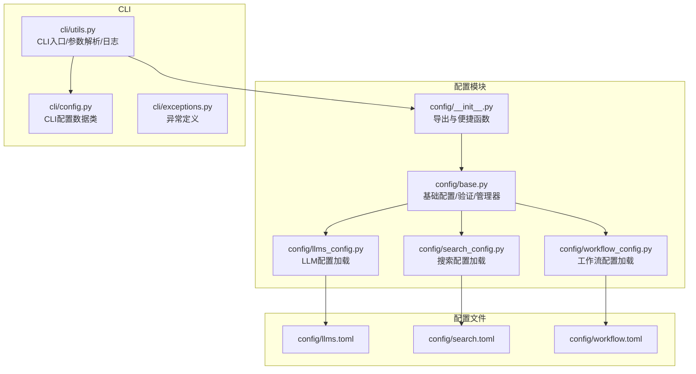
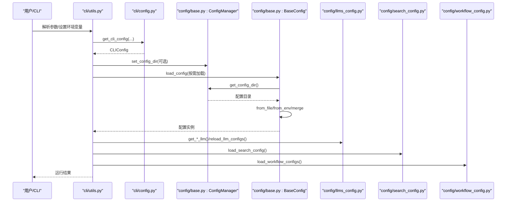
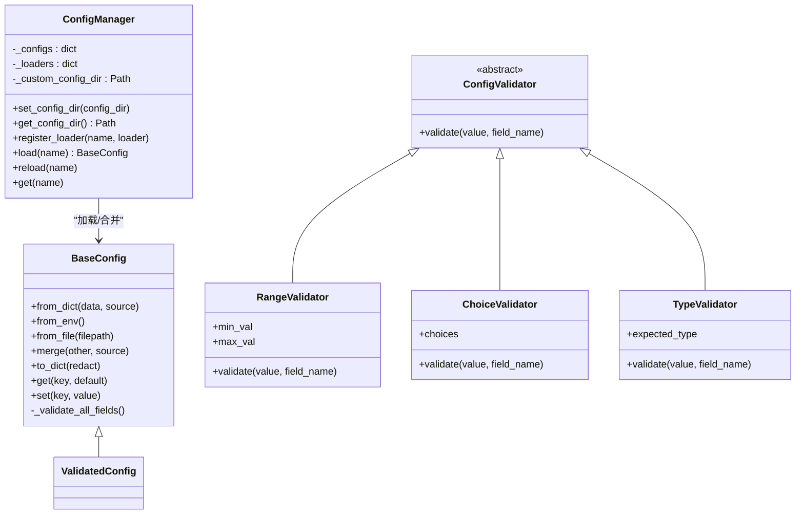
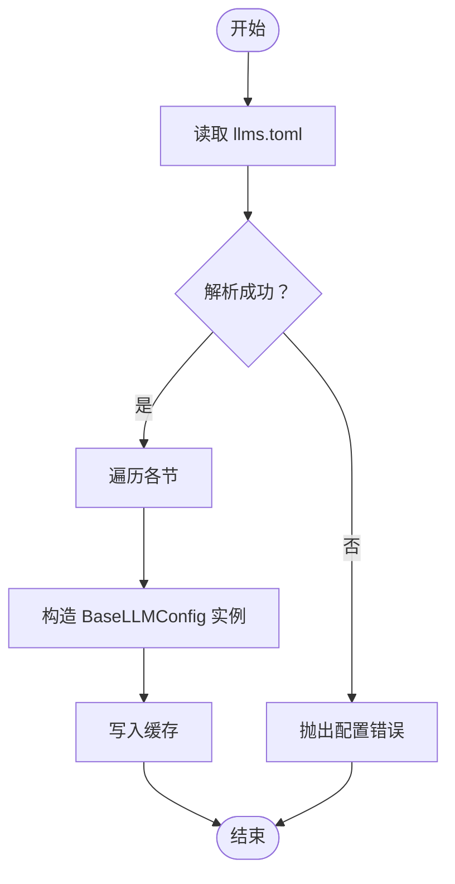
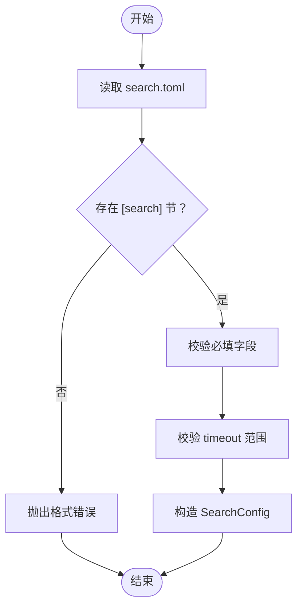
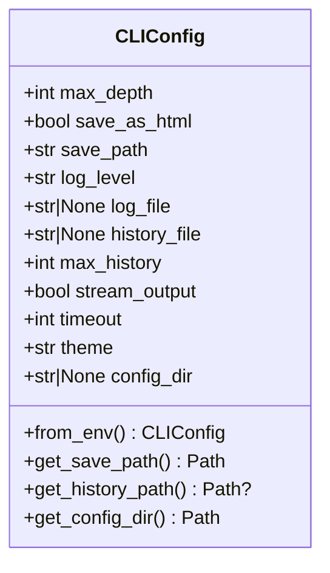
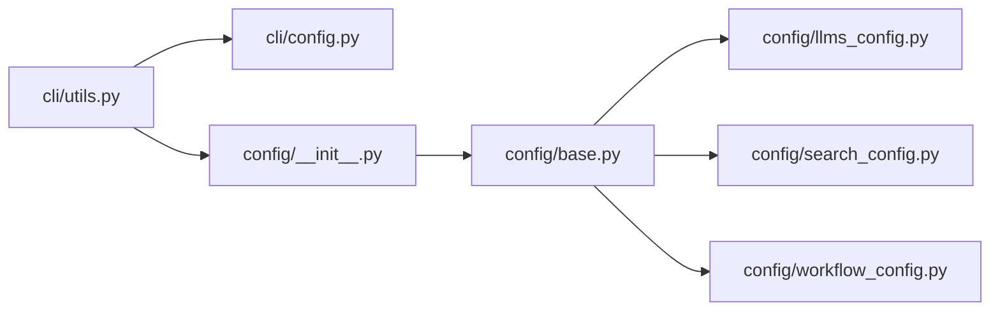

# 配置管理

<cite>
**本文引用的文件**
- [config/base.py](file://src/deepresearch/config/base.py)
- [config/__init__.py](file://src/deepresearch/config/__init__.py)
- [config/llms_config.py](file://src/deepresearch/config/llms_config.py)
- [config/search_config.py](file://src/deepresearch/config/search_config.py)
- [config/workflow_config.py](file://src/deepresearch/config/workflow_config.py)
- [cli/config.py](file://src/deepresearch/cli/config.py)
- [cli/utils.py](file://src/deepresearch/cli/utils.py)
- [cli/exceptions.py](file://src/deepresearch/cli/exceptions.py)
- [llms.toml](file://config/llms.toml)
- [search.toml](file://config/search.toml)
- [workflow.toml](file://config/workflow.toml)
- [tests/unit/config/test_base.py](file://tests/unit/config/test_base.py)
- [tests/unit/cli/test_config.py](file://tests/unit/cli/test_config.py)
</cite>

## 目录
1. [简介](#简介)
2. [项目结构](#项目结构)
3. [核心组件](#核心组件)
4. [架构总览](#架构总览)
5. [详细组件分析](#详细组件分析)
6. [依赖分析](#依赖分析)
7. [性能考虑](#性能考虑)
8. [故障排查指南](#故障排查指南)
9. [结论](#结论)
10. [附录](#附录)

## 简介
本文件面向DeepResearch的配置管理功能，围绕config.py中提供的配置查看、编辑与验证能力，系统阐述配置文件的读取、修改与保存机制，涵盖llms.toml、search.toml与workflow.toml的管理方式；同时给出配置验证规则、错误处理策略、备份/恢复/迁移操作指南，以及通过CLI进行配置调试与故障排除的方法。

## 项目结构
配置管理相关的核心代码位于src/deepresearch/config与src/deepresearch/cli两个子包内，配置文件位于config目录。CLI入口通过src/deepresearch/cli/utils.py解析参数并加载配置，最终由config模块完成配置的读取、合并与校验。

**图表来源**
- [config/base.py:1-590](file://src/deepresearch/config/base.py#L1-L590)
- [config/llms_config.py:1-115](file://src/deepresearch/config/llms_config.py#L1-L115)
- [config/search_config.py:1-82](file://src/deepresearch/config/search_config.py#L1-L82)
- [config/workflow_config.py:1-28](file://src/deepresearch/config/workflow_config.py#L1-L28)
- [cli/utils.py:1-575](file://src/deepresearch/cli/utils.py#L1-L575)
- [cli/config.py:1-101](file://src/deepresearch/cli/config.py#L1-L101)
- [llms.toml:1-29](file://config/llms.toml#L1-L29)
- [search.toml:1-6](file://config/search.toml#L1-L6)
- [workflow.toml:1-3](file://config/workflow.toml#L1-L3)

**章节来源**
- [config/base.py:1-590](file://src/deepresearch/config/base.py#L1-L590)
- [cli/utils.py:1-575](file://src/deepresearch/cli/utils.py#L1-L575)

## 核心组件
- 基础配置与验证
  - BaseConfig：提供从字典、环境变量、文件加载配置的能力，支持字段级验证器与合并策略。
  - ConfigManager：统一管理配置目录、注册加载器、缓存与重载。
  - 验证器：RangeValidator、ChoiceValidator、TypeValidator等。
  - 便捷函数：load_config、load_toml_config、redact_config、clear_config_cache、敏感键管理。
- LLM配置
  - BaseLLMConfig：定义通用LLM字段，提供from_dict与批量加载、脱敏、缓存与重载。
  - 工厂函数：get_*_llm系列，按角色获取对应LLM配置。
- 搜索配置
  - SearchConfig：定义引擎、密钥与超时等字段，含字段级校验。
  - 工厂函数：load_search_config、get_redacted_search_config、全局实例。
- 工作流配置
  - load_workflow_configs/get_redacted_workflow_configs：直接读取并脱敏。
- CLI配置
  - CLIConfig：CLI运行时参数的数据类，支持环境变量注入、范围约束与路径解析。
  - get_cli_config：组合环境变量与参数覆盖，生成最终CLI配置。

**章节来源**
- [config/base.py:190-590](file://src/deepresearch/config/base.py#L190-L590)
- [config/llms_config.py:12-115](file://src/deepresearch/config/llms_config.py#L12-L115)
- [config/search_config.py:12-82](file://src/deepresearch/config/search_config.py#L12-L82)
- [config/workflow_config.py:7-28](file://src/deepresearch/config/workflow_config.py#L7-L28)
- [cli/config.py:15-101](file://src/deepresearch/cli/config.py#L15-L101)

## 架构总览
配置加载遵循“代码默认值 → 环境变量 → 配置文件 → 默认值”的优先级链路；不同配置类型共享同一套验证与脱敏机制，CLI通过统一入口加载并应用配置。

**图表来源**
- [cli/utils.py:485-575](file://src/deepresearch/cli/utils.py#L485-L575)
- [cli/config.py:66-101](file://src/deepresearch/cli/config.py#L66-L101)
- [config/base.py:374-590](file://src/deepresearch/config/base.py#L374-L590)
- [config/llms_config.py:46-115](file://src/deepresearch/config/llms_config.py#L46-L115)
- [config/search_config.py:56-82](file://src/deepresearch/config/search_config.py#L56-L82)
- [config/workflow_config.py:7-28](file://src/deepresearch/config/workflow_config.py#L7-L28)

## 详细组件分析

### 基础配置与验证（BaseConfig/ConfigManager）
- 配置来源与合并
  - 支持从字典、环境变量、文件加载，并以“后者覆盖前者”的策略合并。
  - 环境变量自动识别布尔/整数/字符串，支持自定义前缀。
  - 文件加载基于TOML，带LRU缓存与错误包装。
- 字段级验证
  - RangeValidator/ChoiceValidator/TypeValidator提供范围、枚举与类型校验。
  - 支持敏感字段脱敏与自定义敏感键集合。
- 管理与缓存
  - ConfigManager统一管理配置目录（优先自定义，其次环境变量，最后默认），支持注册加载器与缓存清理。
- 便捷函数
  - load_config：按优先级组装配置；load_toml_config：读取并深拷贝；redact_config：脱敏；clear_config_cache：刷新缓存；敏感键增删。

**图表来源**
- [config/base.py:190-590](file://src/deepresearch/config/base.py#L190-L590)

**章节来源**
- [config/base.py:190-590](file://src/deepresearch/config/base.py#L190-L590)
- [tests/unit/config/test_base.py:1-546](file://tests/unit/config/test_base.py#L1-L546)

### LLM配置（llms.toml）
- 结构与字段
  - 每个LLM角色对应一个节，包含基础URL、API基础地址、模型名与API密钥等字段。
- 加载与校验
  - 通过load_llm_configs遍历节，构造BaseLLMConfig实例；提供脱敏读取与缓存重载。
- 访问接口
  - get_basic_llm、get_clarify_llm、get_planner_llm、get_query_generation_llm、get_evaluate_llm、get_report_llm按角色获取配置。

**图表来源**
- [config/llms_config.py:46-86](file://src/deepresearch/config/llms_config.py#L46-L86)
- [llms.toml:1-29](file://config/llms.toml#L1-L29)

**章节来源**
- [config/llms_config.py:12-115](file://src/deepresearch/config/llms_config.py#L12-L115)
- [llms.toml:1-29](file://config/llms.toml#L1-L29)

### 搜索配置（search.toml）
- 结构与字段
  - [search]节包含engine、jina_api_key、tavily_api_key与timeout。
- 加载与校验
  - load_search_config要求存在[search]节，timeout必须为1~300之间的整数。
- 访问接口
  - get_redacted_search_config提供脱敏视图；全局实例search_config供直接使用。

**图表来源**
- [config/search_config.py:56-82](file://src/deepresearch/config/search_config.py#L56-L82)
- [search.toml:1-6](file://config/search.toml#L1-L6)

**章节来源**
- [config/search_config.py:12-82](file://src/deepresearch/config/search_config.py#L12-L82)
- [search.toml:1-6](file://config/search.toml#L1-L6)

### 工作流配置（workflow.toml）
- 结构与字段
  - 顶层节包含topN等参数。
- 加载与访问
  - load_workflow_configs直接读取并返回字典；get_redacted_workflow_configs提供脱敏视图；全局workflow_configs供直接使用。

**章节来源**
- [config/workflow_config.py:7-28](file://src/deepresearch/config/workflow_config.py#L7-L28)
- [workflow.toml:1-3](file://config/workflow.toml#L1-L3)

### CLI配置（CLIConfig）
- 数据结构
  - 包含搜索深度、是否保存HTML、保存路径、日志级别/文件、历史文件与条数上限、流式输出、超时、主题、配置目录等。
- 环境变量注入
  - from_env从DEEPRESEARCH_*前缀环境变量读取并解析布尔/整数/字符串。
- 参数覆盖
  - get_cli_config支持传入参数覆盖默认值与环境变量值。
- 路径解析
  - get_save_path/get_history_path/config_dir解析用户路径并标准化。
- 范围约束
  - __post_init__对max_depth/max_history/timeout进行边界修正。

**图表来源**
- [cli/config.py:15-101](file://src/deepresearch/cli/config.py#L15-L101)

**章节来源**
- [cli/config.py:15-101](file://src/deepresearch/cli/config.py#L15-L101)
- [tests/unit/cli/test_config.py:15-175](file://tests/unit/cli/test_config.py#L15-L175)

### CLI入口与配置应用（cli/utils.py）
- 参数解析
  - 支持查询模式、深度、是否保存HTML、输出路径、日志级别/文件、主题、配置目录等。
- 配置目录与缓存
  - 校验并设置自定义配置目录，必要时重载LLM配置缓存。
- 日志与异常
  - 统一配置日志；捕获CLI/配置/Agent/用户中断等异常并返回相应退出码。

**章节来源**
- [cli/utils.py:386-575](file://src/deepresearch/cli/utils.py#L386-L575)
- [cli/exceptions.py:13-58](file://src/deepresearch/cli/exceptions.py#L13-L58)

## 依赖分析
- 组件耦合
  - CLI层依赖CLIConfig与ConfigManager；配置层依赖BaseConfig与ConfigManager；具体配置模块（LLM/搜索/工作流）依赖基础加载与脱敏工具。
- 外部依赖
  - TOML解析（tomllib）、路径解析（pathlib）、缓存（functools.lru_cache）。
- 潜在循环
  - 未发现循环导入；模块职责清晰，分层明确。

**图表来源**
- [cli/utils.py:1-575](file://src/deepresearch/cli/utils.py#L1-L575)
- [cli/config.py:1-101](file://src/deepresearch/cli/config.py#L1-L101)
- [config/__init__.py:14-75](file://src/deepresearch/config/__init__.py#L14-L75)
- [config/base.py:1-590](file://src/deepresearch/config/base.py#L1-L590)
- [config/llms_config.py:1-115](file://src/deepresearch/config/llms_config.py#L1-L115)
- [config/search_config.py:1-82](file://src/deepresearch/config/search_config.py#L1-L82)
- [config/workflow_config.py:1-28](file://src/deepresearch/config/workflow_config.py#L1-L28)

**章节来源**
- [config/__init__.py:14-75](file://src/deepresearch/config/__init__.py#L14-L75)
- [config/base.py:1-590](file://src/deepresearch/config/base.py#L1-L590)

## 性能考虑
- 缓存策略
  - TOML读取使用LRU缓存，避免频繁磁盘IO；ConfigManager内部缓存配置实例。
- 合并与验证
  - 合并采用浅拷贝字段替换，验证在初始化阶段一次性完成，减少运行时开销。
- 路径解析
  - expanduser/resolve仅在必要时执行，避免重复计算。

[本节为通用指导，无需特定文件来源]

## 故障排查指南
- 配置文件读取失败
  - 症状：抛出配置错误或文件未找到异常。
  - 排查：确认配置目录路径正确（可通过CLI参数或环境变量设置），检查文件权限与TOML语法。
- 配置验证失败
  - 症状：字段超出范围、类型不符或必填字段缺失。
  - 排查：对照各配置模块的字段与校验规则，修正配置文件或环境变量。
- 环境变量解析异常
  - 症状：布尔/整数解析失败导致使用默认值。
  - 排查：检查DEEPRESEARCH_*前缀变量的值是否符合约定（true/false/1/0等）。
- 配置目录无效
  - 症状：CLI报配置路径不存在/非目录/不可读。
  - 排查：使用--config-dir指定有效且可读的目录，或设置DEEPRESEARCH_CONFIG_DIR。
- LLM配置缓存未更新
  - 症状：修改llms.toml后未生效。
  - 排查：调用重载函数或重启进程，确保缓存被清理。
- 脱敏显示
  - 症状：敏感字段被隐藏。
  - 排查：这是正常行为，如需查看请关闭脱敏或调整敏感键集合。

**章节来源**
- [cli/utils.py:41-68](file://src/deepresearch/cli/utils.py#L41-L68)
- [config/base.py:459-590](file://src/deepresearch/config/base.py#L459-L590)
- [config/llms_config.py:70-86](file://src/deepresearch/config/llms_config.py#L70-L86)
- [tests/unit/config/test_base.py:272-284](file://tests/unit/config/test_base.py#L272-L284)
- [tests/unit/cli/test_config.py:150-157](file://tests/unit/cli/test_config.py#L150-L157)

## 结论
DeepResearch的配置管理以BaseConfig为核心，结合ConfigManager实现多源覆盖、统一验证与脱敏；LLM/搜索/工作流配置模块分别针对各自领域提供强类型的加载与校验；CLI通过CLIConfig与参数解析实现灵活的运行时配置。整体设计具备良好的扩展性与可维护性，适合在生产环境中稳定运行。

[本节为总结，无需特定文件来源]

## 附录

### 配置文件读取、修改与保存机制
- 读取
  - 通过load_toml_config或具体模块的load_*函数读取TOML文件，内部使用LRU缓存加速。
- 修改
  - 配置文件为静态资源，修改需直接编辑TOML文件；CLI层不提供写入接口。
- 保存
  - CLI运行时不会自动写回配置文件；如需持久化变更，请手动编辑对应TOML文件。

**章节来源**
- [config/base.py:479-485](file://src/deepresearch/config/base.py#L479-L485)
- [config/llms_config.py:57-61](file://src/deepresearch/config/llms_config.py#L57-L61)
- [config/search_config.py:67-72](file://src/deepresearch/config/search_config.py#L67-L72)
- [config/workflow_config.py:17-18](file://src/deepresearch/config/workflow_config.py#L17-L18)

### 配置验证规则与错误处理
- 验证器
  - 数值范围：RangeValidator
  - 枚举选择：ChoiceValidator（大小写不敏感）
  - 类型转换：TypeValidator
- 错误类型
  - ConfigError：配置加载/解析错误
  - ValidationError：字段验证失败
  - ConfigurationError：CLI配置参数非法
  - AgentExecutionError：Agent执行失败
  - UserInterruptError：用户中断
  - FileOperationError：文件操作失败

**章节来源**
- [config/base.py:65-150](file://src/deepresearch/config/base.py#L65-L150)
- [cli/exceptions.py:13-58](file://src/deepresearch/cli/exceptions.py#L13-L58)

### 配置备份、恢复与迁移
- 备份
  - 直接复制config目录下的llms.toml、search.toml与workflow.toml至安全位置。
- 恢复
  - 将备份文件覆盖回原路径，确保权限正确。
- 迁移
  - 若新增字段，先在新版本中定义默认值，再逐步将旧配置迁移至新格式；必要时使用ConfigManager切换配置目录进行灰度验证。

[本节为通用指导，无需特定文件来源]

### 通过CLI进行配置调试与故障排除
- 指定配置目录
  - 使用--config-dir或设置DEEPRESEARCH_CONFIG_DIR指向自定义目录，便于隔离测试。
- 调整运行参数
  - 使用--depth/--no-html/-o/--log-level/--log-file/--theme等参数快速验证不同配置组合。
- 观察日志
  - 设置较高日志级别与日志文件，定位问题根因。
- 重载LLM配置
  - 在CLI中调用重载逻辑或重启进程，确保LLM配置更新生效。

**章节来源**
- [cli/utils.py:386-575](file://src/deepresearch/cli/utils.py#L386-L575)
- [cli/config.py:60-64](file://src/deepresearch/cli/config.py#L60-L64)