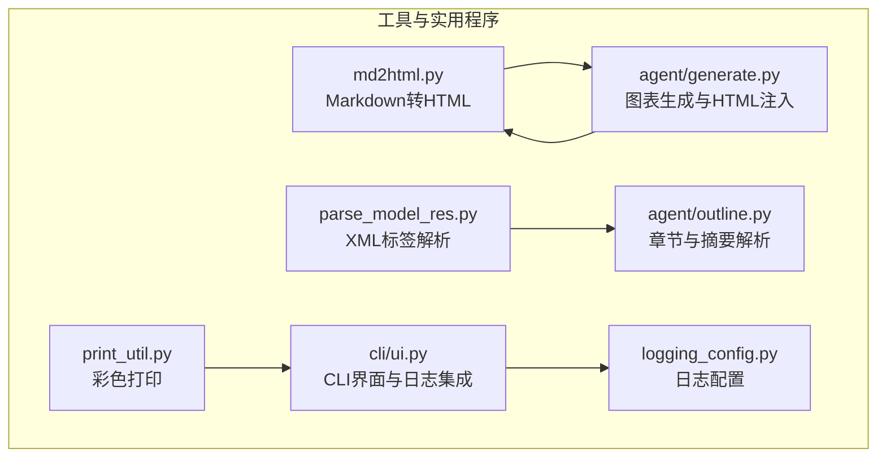
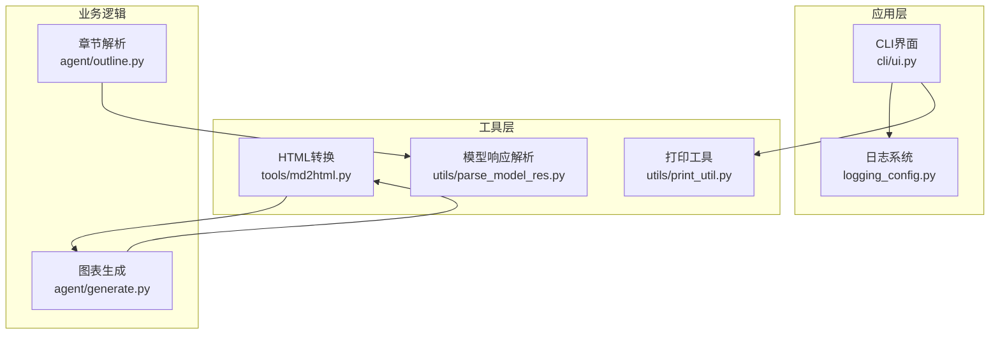
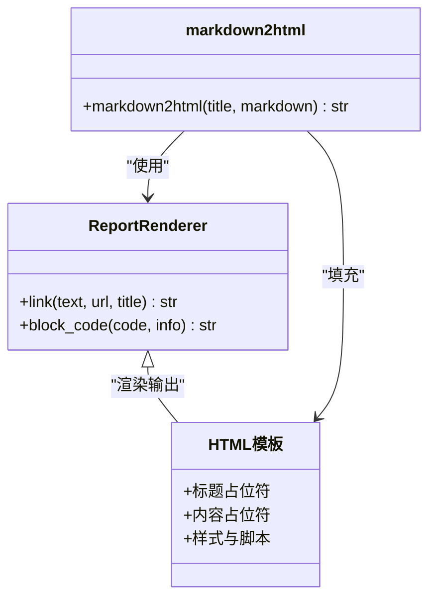
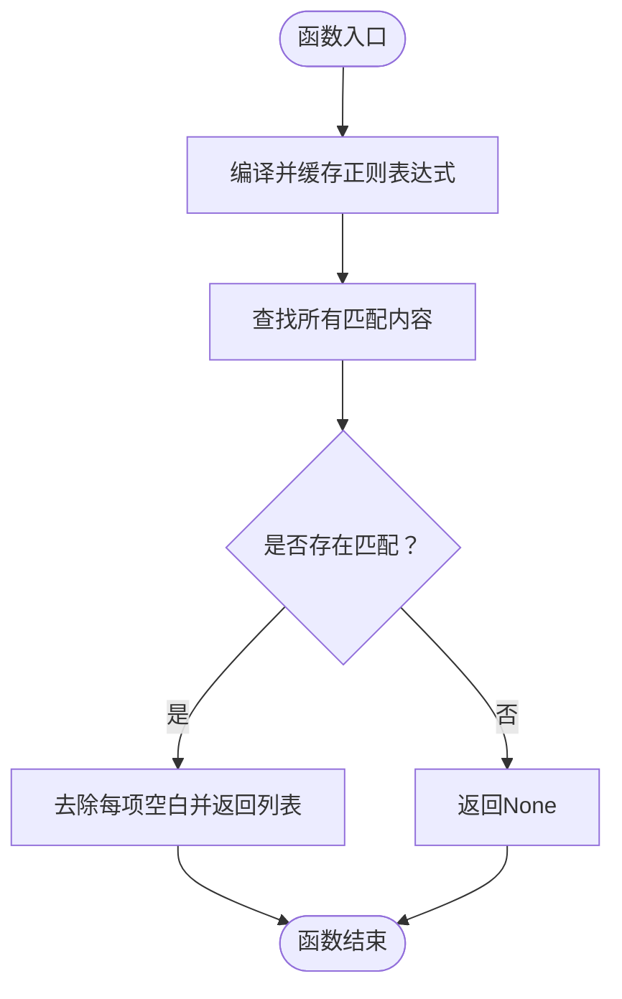
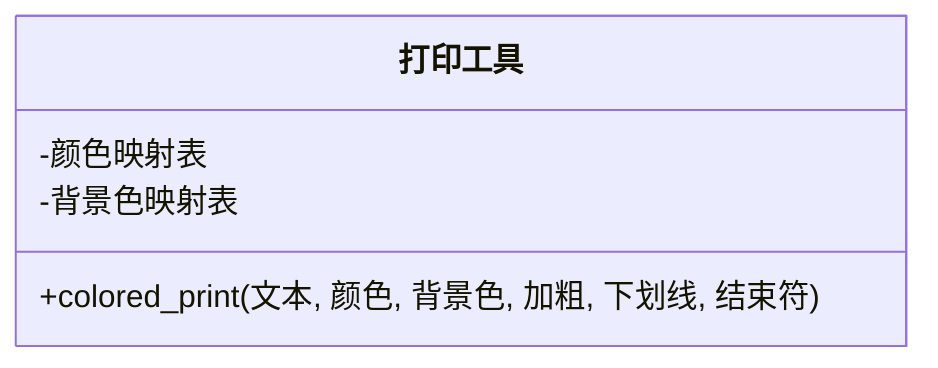
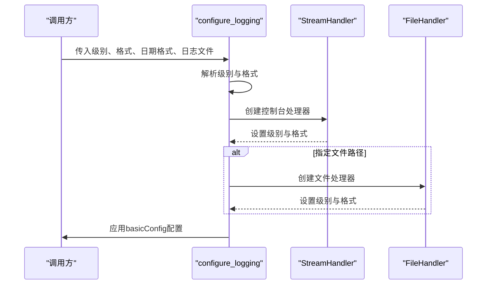
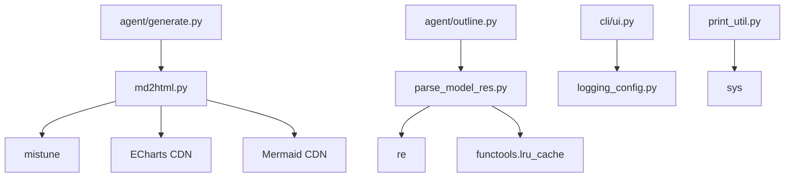

# 工具与实用程序

<cite>
**本文档引用的文件**
- [md2html.py](file://src/deepresearch/tools/md2html.py)
- [parse_model_res.py](file://src/deepresearch/utils/parse_model_res.py)
- [print_util.py](file://src/deepresearch/utils/print_util.py)
- [logging_config.py](file://src/deepresearch/logging_config.py)
- [ui.py](file://src/deepresearch/cli/ui.py)
- [generate.py](file://src/deepresearch/agent/generate.py)
- [outline.py](file://src/deepresearch/agent/outline.py)
- [README.md](file://README.md)
</cite>

## 目录
1. [简介](#简介)
2. [项目结构](#项目结构)
3. [核心组件](#核心组件)
4. [架构概览](#架构概览)
5. [详细组件分析](#详细组件分析)
6. [依赖分析](#依赖分析)
7. [性能考虑](#性能考虑)
8. [故障排除指南](#故障排除指南)
9. [结论](#结论)
10. [附录](#附录)

## 简介
本文件面向DeepResearch框架中的工具与实用程序，重点涵盖以下方面：
- HTML转换工具（md2html）：Markdown到HTML的转换规则、自定义渲染器、模板与样式处理、图表集成与交互。
- 解析工具（parse_model_res）：模型响应解析、XML标签内容提取与缓存优化。
- 打印工具（print_util）：格式化输出、颜色控制与调试信息显示。
- 日志配置（logging_config）：日志级别、格式化与输出目标的统一配置。
- 最佳实践与扩展方法：如何在项目中正确使用这些工具，以及如何进行扩展。

## 项目结构
工具与实用程序位于src/deepresearch目录下，分别分布在tools与utils子包中，并与CLI界面、日志配置协同工作。关键文件如下：
- HTML转换：src/deepresearch/tools/md2html.py
- 模型响应解析：src/deepresearch/utils/parse_model_res.py
- 打印工具：src/deepresearch/utils/print_util.py
- 日志配置：src/deepresearch/logging_config.py
- CLI界面与日志集成：src/deepresearch/cli/ui.py
- 与HTML转换相关的生成逻辑：src/deepresearch/agent/generate.py
- 章节与摘要解析（使用XML标签提取）：src/deepresearch/agent/outline.py

**图表来源**
- [md2html.py:1044-1054](file://src/deepresearch/tools/md2html.py#L1044-L1054)
- [parse_model_res.py:13-27](file://src/deepresearch/utils/parse_model_res.py#L13-L27)
- [print_util.py:3-44](file://src/deepresearch/utils/print_util.py#L3-L44)
- [logging_config.py:15-66](file://src/deepresearch/logging_config.py#L15-L66)
- [ui.py:17-19](file://src/deepresearch/cli/ui.py#L17-L19)
- [generate.py:274-295](file://src/deepresearch/agent/generate.py#L274-L295)
- [outline.py:202-210](file://src/deepresearch/agent/outline.py#L202-L210)

**章节来源**
- [README.md:1-69](file://README.md#L1-L69)

## 核心组件
本节概述四个核心工具的功能与职责：
- HTML转换工具（md2html）：基于mistune的Markdown渲染器，自定义链接与代码块处理，提供完整的HTML报告模板与样式，支持图表与交互。
- 解析工具（parse_model_res）：针对模型输出中的XML标签进行内容提取，使用LRU缓存避免重复编译正则表达式。
- 打印工具（print_util）：提供ANSI色彩控制的彩色打印接口，支持文本颜色、背景色、加粗与下划线。
- 日志配置（logging_config）：统一配置控制台与文件输出，支持灵活的日志级别与格式化。

**章节来源**
- [md2html.py:1044-1054](file://src/deepresearch/tools/md2html.py#L1044-L1054)
- [parse_model_res.py:7-27](file://src/deepresearch/utils/parse_model_res.py#L7-L27)
- [print_util.py:3-44](file://src/deepresearch/utils/print_util.py#L3-L44)
- [logging_config.py:15-66](file://src/deepresearch/logging_config.py#L15-L66)

## 架构概览
下图展示了工具与实用程序之间的交互关系，以及与CLI界面和日志系统的集成：

**图表来源**
- [ui.py:17-19](file://src/deepresearch/cli/ui.py#L17-L19)
- [logging_config.py:57-66](file://src/deepresearch/logging_config.py#L57-L66)
- [md2html.py:1044-1054](file://src/deepresearch/tools/md2html.py#L1044-L1054)
- [parse_model_res.py:13-27](file://src/deepresearch/utils/parse_model_res.py#L13-L27)
- [print_util.py:3-44](file://src/deepresearch/utils/print_util.py#L3-L44)
- [generate.py:274-295](file://src/deepresearch/agent/generate.py#L274-L295)
- [outline.py:202-210](file://src/deepresearch/agent/outline.py#L202-L210)

## 详细组件分析

### HTML转换工具（md2html）
- 功能概述
  - 使用mistune创建Markdown渲染器，启用表格、删除线、任务列表等插件。
  - 自定义ReportRenderer类，重写链接与块级代码处理：
    - 链接：以特定前缀开头的引用标记将被识别为引用链接并生成带样式的HTML。
    - 代码块：当info为特定标识时，允许直接嵌入HTML；若非有效HTML则丢弃。
  - 提供完整HTML模板，包含主题切换、样式表、图表容器与交互脚本。
  - 暴露markdown2html函数，将Markdown转换为完整的HTML报告。

- Markdown到HTML转换规则
  - 插件启用：表格、删除线、任务列表等。
  - 自定义渲染：链接与代码块的特殊处理。
  - 模板填充：标题与内容替换。

- 样式处理
  - 模板内嵌CSS变量与主题切换机制，支持现代与粗野主义两种主题。
  - 图表容器与数据源样式，确保图表与表格在报告中清晰展示。
  - 引用样式与交互弹窗，增强阅读体验。

- 图表集成与交互
  - 通过自定义代码块标识注入ECharts图表容器与脚本。
  - JavaScript负责加载CDN资源、初始化图表、主题切换与响应式调整。
  - DOM处理：移除章节序号、Markdown粗体转换、中英文间距优化。

**图表来源**
- [md2html.py:19-32](file://src/deepresearch/tools/md2html.py#L19-L32)
- [md2html.py:34-1041](file://src/deepresearch/tools/md2html.py#L34-L1041)
- [md2html.py:1044-1054](file://src/deepresearch/tools/md2html.py#L1044-L1054)

**章节来源**
- [md2html.py:19-32](file://src/deepresearch/tools/md2html.py#L19-L32)
- [md2html.py:34-1041](file://src/deepresearch/tools/md2html.py#L34-L1041)
- [md2html.py:1044-1054](file://src/deepresearch/tools/md2html.py#L1044-L1054)

### 解析工具（parse_model_res）
- 功能概述
  - 从包含XML标签的字符串中提取指定标签的内容。
  - 使用LRU缓存编译后的正则表达式，避免重复编译带来的性能开销。
  - 返回匹配内容列表，若无匹配则返回None。

- 处理逻辑
  - 编译阶段：将标签名作为参数传入，生成正则表达式并缓存。
  - 查找阶段：使用缓存的正则表达式在输入字符串中查找所有匹配项。
  - 结果处理：对每个匹配内容进行去空白处理并返回列表。

**图表来源**
- [parse_model_res.py:7-10](file://src/deepresearch/utils/parse_model_res.py#L7-L10)
- [parse_model_res.py:13-27](file://src/deepresearch/utils/parse_model_res.py#L13-L27)

**章节来源**
- [parse_model_res.py:7-27](file://src/deepresearch/utils/parse_model_res.py#L7-L27)

### 打印工具（print_util）
- 功能概述
  - 提供colored_print函数，支持文本颜色、背景色、加粗与下划线。
  - 使用ANSI转义序列实现跨平台彩色输出。
  - 默认回退到普通文本输出，确保在不支持彩色的环境中正常运行。

- 设计要点
  - 颜色映射：内置颜色与背景色映射表。
  - 样式拼装：根据参数动态拼接ANSI样式码。
  - 输出与重置：打印完成后重置样式，避免影响后续输出。

**图表来源**
- [print_util.py:3-44](file://src/deepresearch/utils/print_util.py#L3-L44)

**章节来源**
- [print_util.py:3-44](file://src/deepresearch/utils/print_util.py#L3-L44)

### 日志配置（logging_config）
- 功能概述
  - 统一日志配置：支持控制台与文件双重输出。
  - 可配置项：日志级别、格式字符串、日期格式、输出文件路径。
  - 获取Logger：提供便捷的Logger获取接口。

- 配置流程
  - 参数解析：将字符串级别的日志转换为logging常量。
  - 处理器组装：控制台处理器与可选的文件处理器。
  - 初始化：使用basicConfig应用配置，force=True确保覆盖默认配置。

**图表来源**
- [logging_config.py:15-54](file://src/deepresearch/logging_config.py#L15-L54)

**章节来源**
- [logging_config.py:15-66](file://src/deepresearch/logging_config.py#L15-L66)

## 依赖分析
- 组件耦合
  - HTML转换工具与图表生成逻辑存在直接依赖：图表生成模块会调用HTML转换工具生成的模板与容器。
  - 模型响应解析工具被章节解析模块使用，用于提取XML标签内容。
  - CLI界面与日志配置集成，通过get_logger获取Logger实例。
  - 打印工具与CLI界面相互独立，但都服务于终端输出的可读性与一致性。

- 外部依赖
  - HTML转换工具依赖mistune进行Markdown渲染，依赖浏览器环境脚本（ECharts、Mermaid）进行图表与流程图渲染。
  - 日志配置依赖Python标准库logging、sys、pathlib等。

**图表来源**
- [md2html.py:7-10](file://src/deepresearch/tools/md2html.py#L7-L10)
- [parse_model_res.py:3-4](file://src/deepresearch/utils/parse_model_res.py#L3-L4)
- [ui.py:17-19](file://src/deepresearch/cli/ui.py#L17-L19)
- [generate.py:274-295](file://src/deepresearch/agent/generate.py#L274-L295)
- [outline.py:202-210](file://src/deepresearch/agent/outline.py#L202-L210)

**章节来源**
- [md2html.py:7-10](file://src/deepresearch/tools/md2html.py#L7-L10)
- [parse_model_res.py:3-4](file://src/deepresearch/utils/parse_model_res.py#L3-L4)
- [ui.py:17-19](file://src/deepresearch/cli/ui.py#L17-L19)
- [generate.py:274-295](file://src/deepresearch/agent/generate.py#L274-L295)
- [outline.py:202-210](file://src/deepresearch/agent/outline.py#L202-L210)

## 性能考虑
- HTML转换工具
  - 使用自定义渲染器减少不必要的HTML转义，提升渲染效率。
  - 模板与样式内联，避免额外HTTP请求，提高页面加载速度。
  - 图表初始化与主题切换通过JavaScript异步处理，避免阻塞主线程。

- 解析工具
  - LRU缓存正则表达式编译结果，避免重复编译导致的CPU消耗。
  - 在大规模文本中使用findall一次性提取所有匹配，减少循环次数。

- 打印工具
  - 彩色输出仅在终端支持时启用，避免不必要的ANSI转义序列处理。
  - 对于大量输出场景，建议批量输出而非逐条打印，减少I/O开销。

- 日志配置
  - 控制台与文件双重输出时，注意文件I/O对性能的影响，建议在生产环境适当调整日志级别。
  - 使用basicConfig并force=True确保配置生效，避免重复初始化带来的开销。

## 故障排除指南
- HTML转换工具
  - 自定义代码块HTML校验失败：当代码块标识为特定类型时，若内容不是有效HTML，将被丢弃。请检查自定义HTML片段的完整性与闭合标签。
  - 图表无法加载：确认网络可访问CDN资源，或在离线环境下提供本地资源。JavaScript会尝试多个CDN地址并抛出最后的错误信息。
  - 主题切换失效：确保DOM中存在对应按钮与容器，且JavaScript正确执行。

- 解析工具
  - 未找到匹配内容：检查输入字符串是否包含正确的XML标签，大小写与命名需严格一致。
  - 性能问题：若频繁调用同一标签的解析，确保LRU缓存正常工作；如遇到异常，检查缓存键是否正确。

- 打印工具
  - 彩色输出无效：在Windows系统或不支持ANSI转义序列的终端中，彩色输出会被自动禁用。可在支持的终端中使用彩色输出以提升可读性。
  - 样式异常：检查传入的颜色与背景色参数是否在支持范围内，避免无效参数导致样式丢失。

- 日志配置
  - 日志未输出到文件：确认传入的日志文件路径存在且具有写权限，父目录会自动创建。
  - 日志级别不生效：确保传入的日志级别字符串与枚举值一致，大小写敏感。

**章节来源**
- [md2html.py:25-31](file://src/deepresearch/tools/md2html.py#L25-L31)
- [md2html.py:855-872](file://src/deepresearch/tools/md2html.py#L855-L872)
- [parse_model_res.py:13-27](file://src/deepresearch/utils/parse_model_res.py#L13-L27)
- [print_util.py:3-44](file://src/deepresearch/utils/print_util.py#L3-L44)
- [logging_config.py:40-46](file://src/deepresearch/logging_config.py#L40-L46)

## 结论
本文件系统性地梳理了DeepResearch框架中的工具与实用程序，包括HTML转换、模型响应解析、打印与日志配置。通过自定义渲染器与模板，HTML转换工具实现了高质量的报告生成与交互体验；解析工具通过LRU缓存提升了XML标签提取的性能；打印工具与日志配置则保证了终端输出与运行时信息的可读性与一致性。建议在实际使用中结合业务场景选择合适的工具组合，并关注性能与兼容性问题。

## 附录
- 最佳实践
  - HTML转换：优先使用自定义代码块标识插入图表，确保HTML片段完整；在离线环境准备本地资源以避免CDN依赖。
  - 解析工具：对高频标签使用LRU缓存，保持输入字符串的规范性以提高匹配成功率。
  - 打印工具：在支持彩色的终端中充分利用颜色与样式，提升调试与用户反馈的直观性。
  - 日志配置：根据部署环境调整日志级别与输出目标，平衡可观测性与性能。

- 扩展方法
  - HTML转换：可扩展更多自定义渲染器方法以适配新的Markdown语法；增加更多主题与样式变量以满足不同视觉需求。
  - 解析工具：支持更多XML标签与嵌套结构，或引入更复杂的解析策略（如XML DOM解析）。
  - 打印工具：增加更多样式选项与主题，或封装为CLI界面的一部分以统一输出风格。
  - 日志配置：支持结构化日志输出（如JSON），或集成外部日志收集系统以满足运维需求。