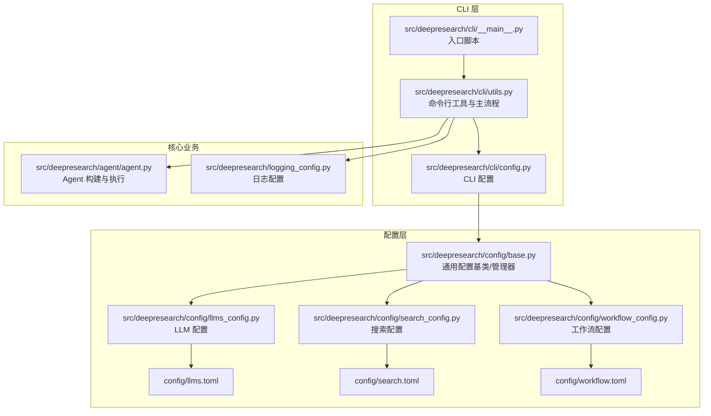
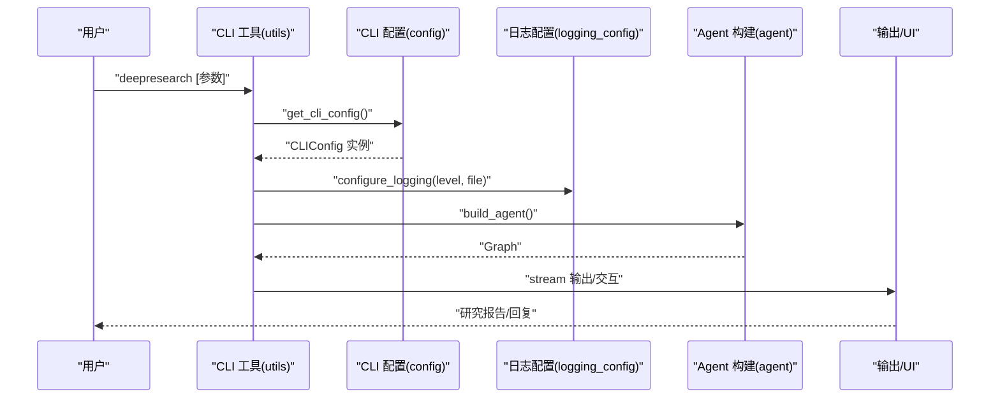
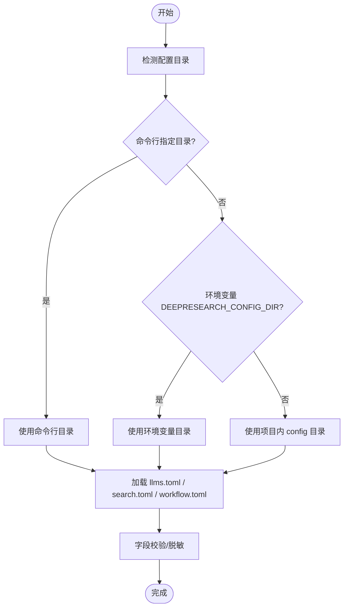
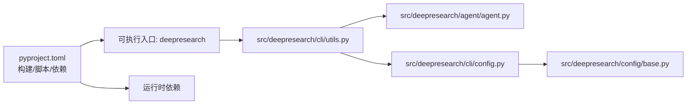

# 快速开始

<cite>
**本文引用的文件**
- [README.md](file://README.md)
- [pyproject.toml](file://pyproject.toml)
- [doc/intro.md](file://doc/intro.md)
- [src/deepresearch/cli/__main__.py](file://src/deepresearch/cli/__main__.py)
- [src/deepresearch/cli/utils.py](file://src/deepresearch/cli/utils.py)
- [src/deepresearch/cli/config.py](file://src/deepresearch/cli/config.py)
- [src/deepresearch/config/base.py](file://src/deepresearch/config/base.py)
- [src/deepresearch/config/llms_config.py](file://src/deepresearch/config/llms_config.py)
- [src/deepresearch/config/search_config.py](file://src/deepresearch/config/search_config.py)
- [src/deepresearch/config/workflow_config.py](file://src/deepresearch/config/workflow_config.py)
- [config/llms.toml](file://config/llms.toml)
- [config/search.toml](file://config/search.toml)
- [config/workflow.toml](file://config/workflow.toml)
- [src/deepresearch/logging_config.py](file://src/deepresearch/logging_config.py)
- [tests/unit/cli/test_main.py](file://tests/unit/cli/test_main.py)
- [tests/e2e/test_e2e.py](file://tests/e2e/test_e2e.py)
</cite>

## 目录
1. [简介](#简介)
2. [项目结构](#项目结构)
3. [核心组件](#核心组件)
4. [架构总览](#架构总览)
5. [详细组件分析](#详细组件分析)
6. [依赖分析](#依赖分析)
7. [性能考虑](#性能考虑)
8. [故障排除指南](#故障排除指南)
9. [结论](#结论)
10. [附录](#附录)

## 简介
本指南面向首次接触 DeepResearch 的用户，帮助你在最短时间内完成环境准备、安装、基础配置与首次运行，生成你的第一个研究报告。我们将覆盖：
- 环境要求（Python 版本）
- 安装步骤（pip 安装与开发模式安装）
- 基础配置说明（LLM 与搜索工具）
- 命令行使用示例（从简单命令到基本配置修改）
- 常见初始化问题与验证方法

## 项目结构
DeepResearch 采用模块化设计，CLI 入口位于 src/deepresearch/cli，配置由 config 目录下的 TOML 文件提供，核心业务逻辑封装在 agent、llms、tools 等子模块中。

**图表来源**
- [src/deepresearch/cli/__main__.py:1-7](file://src/deepresearch/cli/__main__.py#L1-L7)
- [src/deepresearch/cli/utils.py:1-575](file://src/deepresearch/cli/utils.py#L1-L575)
- [src/deepresearch/cli/config.py:1-101](file://src/deepresearch/cli/config.py#L1-L101)
- [src/deepresearch/config/base.py:1-590](file://src/deepresearch/config/base.py#L1-L590)
- [src/deepresearch/config/llms_config.py:1-115](file://src/deepresearch/config/llms_config.py#L1-L115)
- [src/deepresearch/config/search_config.py:1-82](file://src/deepresearch/config/search_config.py#L1-L82)
- [src/deepresearch/config/workflow_config.py:1-28](file://src/deepresearch/config/workflow_config.py#L1-L28)
- [config/llms.toml:1-29](file://config/llms.toml#L1-L29)
- [config/search.toml:1-6](file://config/search.toml#L1-L6)
- [config/workflow.toml:1-3](file://config/workflow.toml#L1-L3)

**章节来源**
- [README.md:39-56](file://README.md#L39-L56)
- [doc/intro.md:48-145](file://doc/intro.md#L48-L145)

## 核心组件
- CLI 入口与主流程：负责解析命令行参数、构建 UI、调用 Agent 并输出结果。
- 配置系统：提供统一的配置加载、合并与校验机制，支持文件、环境变量与默认值三层覆盖。
- LLM 与搜索配置：分别从 llms.toml 与 search.toml 加载，支持敏感信息脱敏与缓存清理。
- 日志系统：支持控制台与文件输出，便于调试与追踪。

**章节来源**
- [src/deepresearch/cli/utils.py:485-575](file://src/deepresearch/cli/utils.py#L485-L575)
- [src/deepresearch/cli/config.py:15-101](file://src/deepresearch/cli/config.py#L15-L101)
- [src/deepresearch/config/base.py:373-590](file://src/deepresearch/config/base.py#L373-L590)
- [src/deepresearch/config/llms_config.py:46-115](file://src/deepresearch/config/llms_config.py#L46-L115)
- [src/deepresearch/config/search_config.py:56-82](file://src/deepresearch/config/search_config.py#L56-L82)
- [src/deepresearch/logging_config.py:15-67](file://src/deepresearch/logging_config.py#L15-L67)

## 架构总览
下图展示了从命令行到 Agent 执行的关键调用链路，以及配置加载与日志初始化的顺序。

**图表来源**
- [src/deepresearch/cli/utils.py:485-575](file://src/deepresearch/cli/utils.py#L485-L575)
- [src/deepresearch/cli/config.py:66-101](file://src/deepresearch/cli/config.py#L66-L101)
- [src/deepresearch/logging_config.py:15-67](file://src/deepresearch/logging_config.py#L15-L67)

## 详细组件分析

### 环境要求与安装
- Python 版本：项目要求 Python >=3.14,<4.0。
- 安装方式：
  - 标准安装：pip install .
  - 开发模式安装：pip install -e .
  - 可选安装开发/文档依赖：pip install -e ".[dev]" 或 pip install -e ".[doc]"

**章节来源**
- [pyproject.toml:9](file://pyproject.toml#L9)
- [doc/intro.md:67-85](file://doc/intro.md#L67-L85)
- [README.md:41-51](file://README.md#L41-L51)

### 基础配置说明
- 配置目录优先级（高到低）：命令行参数指定的目录 > 环境变量 DEEPRESEARCH_CONFIG_DIR > 项目内 config 目录。
- LLM 配置（llms.toml）：包含 basic、clarify、planner、query_generation、evaluate、report 等段落，每段需提供 api_base、api_key、model。
- 搜索配置（search.toml）：engine 支持 jina 或 tavily；需提供对应 API Key；可设置 timeout。
- 工作流配置（workflow.toml）：例如 topN 控制搜索数量。

**图表来源**
- [src/deepresearch/cli/utils.py:497-509](file://src/deepresearch/cli/utils.py#L497-L509)
- [src/deepresearch/config/base.py:373-456](file://src/deepresearch/config/base.py#L373-L456)
- [src/deepresearch/config/llms_config.py:46-85](file://src/deepresearch/config/llms_config.py#L46-L85)
- [src/deepresearch/config/search_config.py:56-82](file://src/deepresearch/config/search_config.py#L56-L82)
- [src/deepresearch/config/workflow_config.py:7-28](file://src/deepresearch/config/workflow_config.py#L7-L28)

**章节来源**
- [doc/intro.md:89-113](file://doc/intro.md#L89-L113)
- [config/llms.toml:1-29](file://config/llms.toml#L1-L29)
- [config/search.toml:1-6](file://config/search.toml#L1-L6)
- [config/workflow.toml:1-3](file://config/workflow.toml#L1-L3)

### 命令行使用示例
- 启动交互式模式：deepresearch
- 单次查询模式：deepresearch -q "主题"
- 修改搜索深度：deepresearch -q "主题" --depth 5
- 关闭 HTML 保存：deepresearch -q "主题" --no-html
- 指定输出路径：deepresearch -q "主题" -o /path/to/report
- 指定日志级别/文件：deepresearch -q "主题" --log-level DEBUG --log-file /tmp/dr.log
- 指定主题：deepresearch -q "主题" --theme colorful
- 指定配置目录：deepresearch -q "主题" --config-dir /path/to/config

以上示例均来自 CLI 参数解析与帮助信息。

**章节来源**
- [src/deepresearch/cli/utils.py:386-483](file://src/deepresearch/cli/utils.py#L386-L483)
- [tests/unit/cli/test_main.py:62-143](file://tests/unit/cli/test_main.py#L62-L143)
- [tests/unit/cli/test_main.py:230-270](file://tests/unit/cli/test_main.py#L230-L270)

### 首次运行示例
- 在安装完成后，直接运行：deepresearch "人工智能的发展趋势"
- 若希望立即看到交互式对话，直接运行：deepresearch
- 如需查看帮助与示例：deepresearch --help

**章节来源**
- [doc/intro.md:114-140](file://doc/intro.md#L114-L140)
- [src/deepresearch/cli/utils.py:386-408](file://src/deepresearch/cli/utils.py#L386-L408)

## 依赖分析
- 构建系统：scikit-build-core，wheel 安装目录指向 src，版本由 setuptools_scm 动态生成。
- CLI 可执行入口：pyproject.toml 中的 scripts.deepresearch 指向 utils:main。
- 运行时依赖：HTTP 客户端、MCP、LangChain/LangGraph、解析与渲染等。

**图表来源**
- [pyproject.toml:79-93](file://pyproject.toml#L79-L93)
- [src/deepresearch/cli/utils.py:1-50](file://src/deepresearch/cli/utils.py#L1-L50)

**章节来源**
- [pyproject.toml:1-93](file://pyproject.toml#L1-L93)

## 性能考虑
- 搜索深度与超时：可通过 --depth 与 --log-file 等参数调整，合理设置可平衡性能与质量。
- 日志级别：在调试阶段使用 DEBUG，生产运行建议 INFO 或 WARNING。
- 报告保存：默认保存为 HTML，若不需要可使用 --no-html 降低 IO 压力。

[本节为通用指导，无需特定文件引用]

## 故障排除指南
- 安装失败（Python 版本不符）
  - 现象：pip 安装时报错，提示 Python 版本不满足 >=3.14,<4.0。
  - 处理：升级 Python 至 3.14+。
  - 参考：[pyproject.toml:9](file://pyproject.toml#L9)

- 配置目录无效
  - 现象：命令行指定 --config-dir 后报“配置路径不存在/不是目录/不可读”。
  - 处理：确认路径存在且可读，或使用 ~ 展开用户目录。
  - 参考：[src/deepresearch/cli/utils.py:41-67](file://src/deepresearch/cli/utils.py#L41-L67)

- LLM 配置缺失或格式错误
  - 现象：加载 llms.toml 时出现解析失败或缺少必要字段。
  - 处理：检查各段（basic/clarify/planner/query_generation/evaluate/report）是否包含 api_base、api_key、model。
  - 参考：[src/deepresearch/config/llms_config.py:21-44](file://src/deepresearch/config/llms_config.py#L21-L44)，[config/llms.toml:1-29](file://config/llms.toml#L1-L29)

- 搜索引擎配置错误
  - 现象：search.toml 缺少 [search] 段或 engine/tavily/jina API Key 未设置。
  - 处理：确保 engine 为 jina 或 tavily，填写对应 API Key；timeout 合法。
  - 参考：[src/deepresearch/config/search_config.py:56-82](file://src/deepresearch/config/search_config.py#L56-L82)，[config/search.toml:1-6](file://config/search.toml#L1-L6)

- Agent 执行异常
  - 现象：Agent 构建或执行过程中抛出异常。
  - 处理：查看日志文件（--log-file）定位错误；确认 LLM 与搜索服务可用。
  - 参考：[src/deepresearch/cli/utils.py:106-193](file://src/deepresearch/cli/utils.py#L106-L193)，[src/deepresearch/logging_config.py:15-67](file://src/deepresearch/logging_config.py#L15-L67)

- 验证安装成功
  - 方法一：运行 deepresearch --version
  - 方法二：运行 deepresearch -q "测试"，应返回包含输出的文本
  - 方法三：运行端到端测试（需要有效 API 密钥时可跳过 API 调用失败）
  - 参考：[tests/unit/cli/test_main.py:145-188](file://tests/unit/cli/test_main.py#L145-L188)，[tests/e2e/test_e2e.py:14-55](file://tests/e2e/test_e2e.py#L14-L55)

**章节来源**
- [src/deepresearch/cli/utils.py:41-67](file://src/deepresearch/cli/utils.py#L41-L67)
- [src/deepresearch/config/llms_config.py:21-44](file://src/deepresearch/config/llms_config.py#L21-L44)
- [src/deepresearch/config/search_config.py:56-82](file://src/deepresearch/config/search_config.py#L56-L82)
- [src/deepresearch/cli/utils.py:106-193](file://src/deepresearch/cli/utils.py#L106-L193)
- [tests/unit/cli/test_main.py:145-188](file://tests/unit/cli/test_main.py#L145-L188)
- [tests/e2e/test_e2e.py:14-55](file://tests/e2e/test_e2e.py#L14-L55)

## 结论
按照本指南完成环境与依赖准备、基础配置与安装后，你可以通过一条命令快速生成研究报告。遇到问题时，优先检查 Python 版本、配置文件完整性与网络连通性，并利用日志与帮助信息定位问题。

[本节为总结性内容，无需特定文件引用]

## 附录

### 常用命令速查
- 安装：pip install .
- 开发安装：pip install -e .
- 运行一次查询：deepresearch -q "主题"
- 交互式对话：deepresearch
- 查看帮助：deepresearch --help

**章节来源**
- [doc/intro.md:114-140](file://doc/intro.md#L114-L140)
- [src/deepresearch/cli/utils.py:386-408](file://src/deepresearch/cli/utils.py#L386-L408)