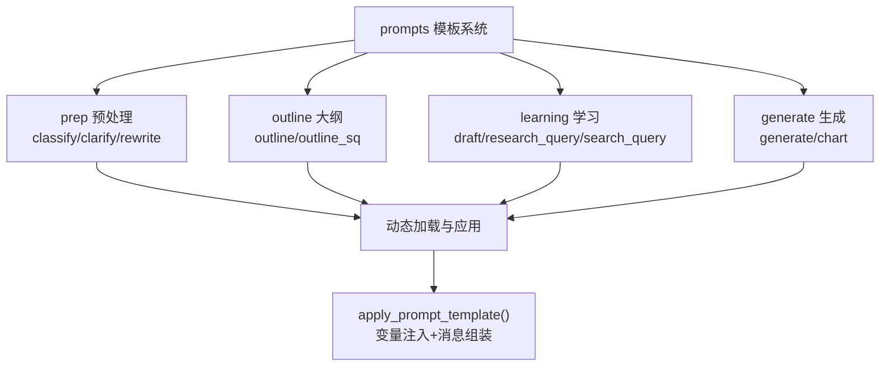
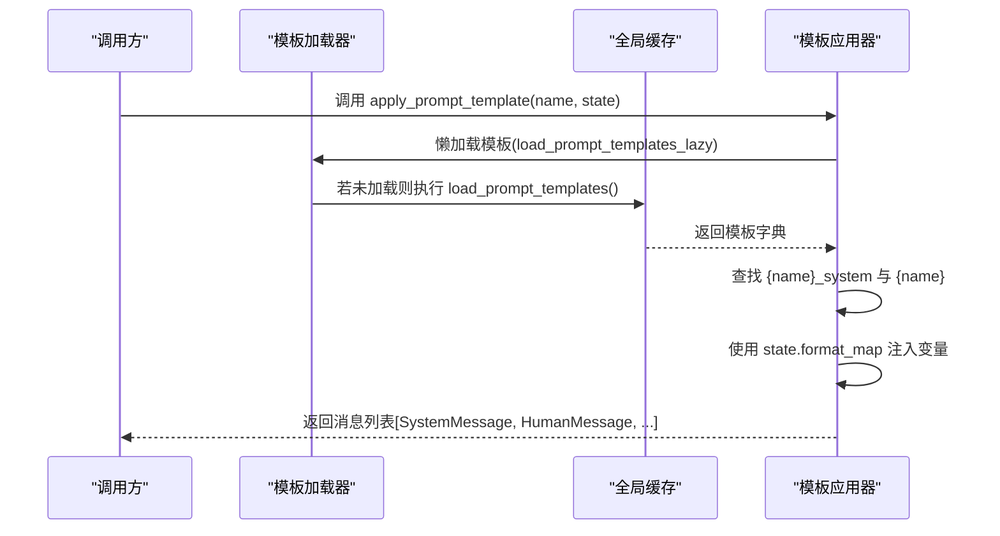
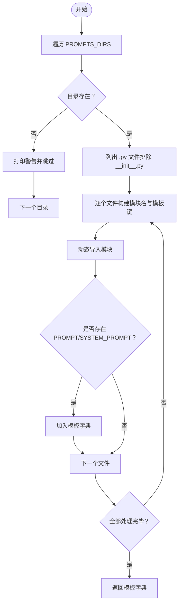
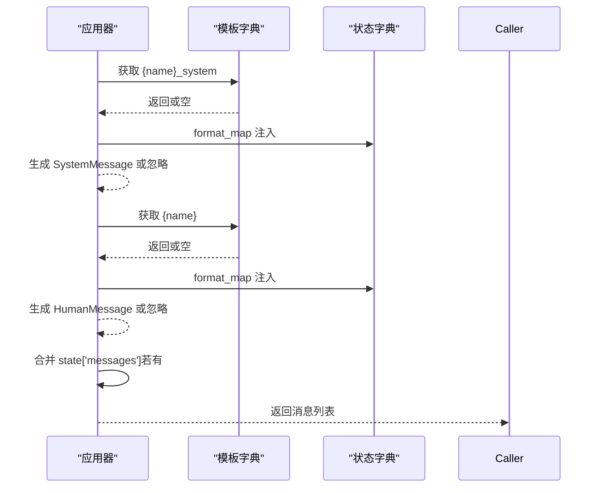
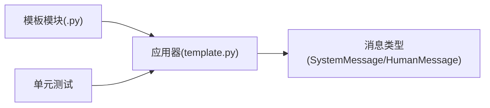

# 提示词模板系统

<cite>
**本文引用的文件**
- [src/deepresearch/prompts/template.py](file://src/deepresearch/prompts/template.py)
- [src/deepresearch/prompts/__init__.py](file://src/deepresearch/prompts/__init__.py)
- [src/deepresearch/prompts/prep/classify.py](file://src/deepresearch/prompts/prep/classify.py)
- [src/deepresearch/prompts/prep/clarify.py](file://src/deepresearch/prompts/prep/clarify.py)
- [src/deepresearch/prompts/prep/rewrite.py](file://src/deepresearch/prompts/prep/rewrite.py)
- [src/deepresearch/prompts/outline/outline.py](file://src/deepresearch/prompts/outline/outline.py)
- [src/deepresearch/prompts/outline/outline_sq.py](file://src/deepresearch/prompts/outline/outline_sq.py)
- [src/deepresearch/prompts/learning/draft.py](file://src/deepresearch/prompts/learning/draft.py)
- [src/deepresearch/prompts/learning/research_query.py](file://src/deepresearch/prompts/learning/research_query.py)
- [src/deepresearch/prompts/learning/search_query.py](file://src/deepresearch/prompts/learning/search_query.py)
- [src/deepresearch/prompts/generate/generate.py](file://src/deepresearch/prompts/generate/generate.py)
- [src/deepresearch/prompts/generate/chart.py](file://src/deepresearch/prompts/generate/chart.py)
- [tests/unit/prompts/test_template.py](file://tests/unit/prompts/test_template.py)
</cite>

## 目录
1. [简介](#简介)
2. [项目结构](#项目结构)
3. [核心组件](#核心组件)
4. [架构总览](#架构总览)
5. [详细组件分析](#详细组件分析)
6. [依赖分析](#依赖分析)
7. [性能考虑](#性能考虑)
8. [故障排查指南](#故障排查指南)
9. [结论](#结论)
10. [附录](#附录)

## 简介
本文件系统性阐述 DeepResearch 的提示词模板系统，包括动态模板加载机制、模板文件组织结构、模板分类与作用机制、变量注入与格式化处理、模板继承与复用策略、模板编写指南与最佳实践，以及模板缓存与性能优化策略。读者无需深入源码即可理解模板体系的设计思想与使用方法。

## 项目结构
提示词模板位于 prompts 子包下，按功能域划分为四个子目录：
- prep：预处理类模板（意图澄清、分类、重写）
- outline：大纲生成类模板（章节大纲、搜索查询）
- learning：学习/检索增强类模板（草稿生成、知识抽取、评估、补充查询）
- generate：内容生成类模板（正文生成、图表生成）

模板文件以模块形式组织，每个模块导出 PROMPT 和可选的 SYSTEM_PROMPT 变量，供运行时动态加载与格式化。

图示来源
- [src/deepresearch/prompts/template.py:12-17](file://src/deepresearch/prompts/template.py#L12-L17)
- [src/deepresearch/prompts/prep/classify.py:9-47](file://src/deepresearch/prompts/prep/classify.py#L9-L47)
- [src/deepresearch/prompts/outline/outline.py:14-67](file://src/deepresearch/prompts/outline/outline.py#L14-L67)
- [src/deepresearch/prompts/learning/draft.py:10-39](file://src/deepresearch/prompts/learning/draft.py#L10-L39)
- [src/deepresearch/prompts/generate/generate.py:15-102](file://src/deepresearch/prompts/generate/generate.py#L15-L102)

章节来源
- [src/deepresearch/prompts/template.py:11-17](file://src/deepresearch/prompts/template.py#L11-L17)
- [src/deepresearch/prompts/__init__.py:4-8](file://src/deepresearch/prompts/__init__.py#L4-L8)

## 核心组件
- 动态模板加载器：扫描指定目录，导入模块并提取 PROMPT/ SYSTEM_PROMPT，构建模板字典。
- 懒加载机制：首次调用时加载，后续复用全局缓存。
- 模板应用器：根据模板名与状态字典进行变量注入，返回标准化的消息列表（支持系统消息与用户消息），并可合并已有消息。

关键职责与行为
- 加载器负责目录遍历、模块命名、异常容错与模板键生成。
- 应用器负责系统消息优先注入、变量映射、错误定位与消息拼接。

章节来源
- [src/deepresearch/prompts/template.py:25-71](file://src/deepresearch/prompts/template.py#L25-L71)
- [src/deepresearch/prompts/template.py:78-87](file://src/deepresearch/prompts/template.py#L78-L87)
- [src/deepresearch/prompts/template.py:90-129](file://src/deepresearch/prompts/template.py#L90-L129)

## 架构总览
模板系统采用“目录扫描 + 动态导入 + 字典缓存 + 消息装配”的分层架构。模板模块仅需提供标准变量接口，运行时通过统一入口完成注入与消息构造，便于扩展与维护。

图示来源
- [src/deepresearch/prompts/template.py:78-87](file://src/deepresearch/prompts/template.py#L78-L87)
- [src/deepresearch/prompts/template.py:90-129](file://src/deepresearch/prompts/template.py#L90-L129)

## 详细组件分析

### 动态模板加载机制
- 扫描范围：generate、learning、outline、prep 四个子目录。
- 模块命名：基于相对路径与文件名组合为模块名，模板键为“子目录/文件名”。
- 导入策略：动态 import，提取 PROMPT 与 SYSTEM_PROMPT（若存在）。
- 错误处理：捕获导入与属性访问异常，打印警告并继续扫描。
- 缓存策略：懒加载一次，全局共享，避免重复 IO 与导入开销。

图示来源
- [src/deepresearch/prompts/template.py:25-71](file://src/deepresearch/prompts/template.py#L25-L71)

章节来源
- [src/deepresearch/prompts/template.py:11-17](file://src/deepresearch/prompts/template.py#L11-L17)
- [src/deepresearch/prompts/template.py:25-71](file://src/deepresearch/prompts/template.py#L25-L71)

### 模板应用与消息装配
- 系统消息优先：若存在 {name}_system，则先注入 SystemMessage。
- 用户消息：使用 {name} 对应模板，注入后作为 HumanMessage。
- 消息合并：若 state 中包含 "messages"，将其拼接到结果末尾。
- 变量注入：采用安全的 format_map，缺失变量会抛出明确错误，便于定位。

图示来源
- [src/deepresearch/prompts/template.py:90-129](file://src/deepresearch/prompts/template.py#L90-L129)

章节来源
- [src/deepresearch/prompts/template.py:90-129](file://src/deepresearch/prompts/template.py#L90-L129)

### 模板分类与作用机制
- 预处理（prep）
  - classify：意图分类，输出领域类别标签，用于后续流程分流。
  - clarify：意图澄清，生成限定维度的提问，提升后续检索与写作质量。
  - rewrite：上下文重写，整合多轮澄清后的完整问题。
- 大纲（outline）
  - outline：生成章节级大纲，包含总结与写作逻辑。
  - outline_sq：生成搜索查询，聚焦信息检索。
- 学习（learning）
  - draft：基于知识与章节大纲生成草稿，强调可溯源与结构化输出。
  - search_query：生成高质量搜索查询，支撑检索增强。
  - research_query：基于当前回答与评估结果生成补充查询。
- 生成（generate）
  - generate：依据参考材料与大纲生成正文，遵循严格的引用与表达规范。
  - chart：生成图表配置，辅助可视化呈现。

章节来源
- [src/deepresearch/prompts/prep/classify.py:9-47](file://src/deepresearch/prompts/prep/classify.py#L9-L47)
- [src/deepresearch/prompts/prep/clarify.py:10-50](file://src/deepresearch/prompts/prep/clarify.py#L10-L50)
- [src/deepresearch/prompts/prep/rewrite.py:9-24](file://src/deepresearch/prompts/prep/rewrite.py#L9-L24)
- [src/deepresearch/prompts/outline/outline.py:14-67](file://src/deepresearch/prompts/outline/outline.py#L14-L67)
- [src/deepresearch/prompts/outline/outline_sq.py:11-43](file://src/deepresearch/prompts/outline/outline_sq.py#L11-L43)
- [src/deepresearch/prompts/learning/draft.py:10-39](file://src/deepresearch/prompts/learning/draft.py#L10-L39)
- [src/deepresearch/prompts/learning/search_query.py:10-43](file://src/deepresearch/prompts/learning/search_query.py#L10-L43)
- [src/deepresearch/prompts/learning/research_query.py:13-56](file://src/deepresearch/prompts/learning/research_query.py#L13-L56)
- [src/deepresearch/prompts/generate/generate.py:15-102](file://src/deepresearch/prompts/generate/generate.py#L15-L102)
- [src/deepresearch/prompts/generate/chart.py:11-36](file://src/deepresearch/prompts/generate/chart.py#L11-L36)

### 变量注入、格式化与模板继承
- 变量注入：所有模板均通过 format_map 进行安全注入；若 state 缺失变量，将抛出明确错误，便于快速定位。
- 格式化处理：模板字符串中使用占位符，应用时由状态字典替换；生成类模板支持系统消息与用户消息的组合。
- 模板继承：通过在状态字典中传入 "messages" 实现消息级继承，将历史对话或中间结果无缝拼接到最终消息序列中。

章节来源
- [src/deepresearch/prompts/template.py:114-129](file://src/deepresearch/prompts/template.py#L114-L129)
- [src/deepresearch/prompts/generate/generate.py:15-65](file://src/deepresearch/prompts/generate/generate.py#L15-L65)

### 模板编写指南与最佳实践
- 命名规范
  - 模块文件名即模板名，建议语义清晰且与用途匹配。
  - 模板键为“子目录/文件名”，避免同名冲突。
- 变量声明
  - 在模块注释中明确列出模板使用的变量，便于使用者与调试。
  - 仅使用模板实际需要的变量，减少冗余与歧义。
- 消息结构
  - 如需系统角色约束，提供 SYSTEM_PROMPT；正文内容使用 PROMPT。
  - 生成类模板建议同时提供 SYSTEM_PROMPT 与 PROMPT，确保行为一致与可追溯。
- 输出约定
  - 生成类模板严格限制输出格式与字段，便于下游解析与一致性校验。
  - 图表类模板明确工具调用格式与数据来源要求。
- 维护建议
  - 将通用规则抽象到 SYSTEM_PROMPT，正文模板专注业务逻辑。
  - 保持模板可测试性，必要时在模块内提供最小可运行示例（参见模板文件中的示例调用）。

章节来源
- [src/deepresearch/prompts/prep/classify.py:4-7](file://src/deepresearch/prompts/prep/classify.py#L4-L7)
- [src/deepresearch/prompts/outline/outline.py:4-12](file://src/deepresearch/prompts/outline/outline.py#L4-L12)
- [src/deepresearch/prompts/generate/generate.py:15-65](file://src/deepresearch/prompts/generate/generate.py#L15-L65)
- [src/deepresearch/prompts/generate/chart.py:11-27](file://src/deepresearch/prompts/generate/chart.py#L11-L27)

### 自定义模板扩展方法
- 新增模板文件：在对应子目录新增 .py 文件，导出 PROMPT（可选 SYSTEM_PROMPT）。
- 模板键生成：系统自动以“子目录/文件名”作为模板键，无需额外注册。
- 消息拼接：在调用侧通过 state["messages"] 传入历史消息，实现跨步骤消息累积。
- 测试验证：建议在模块内提供示例调用，或在单元测试中覆盖关键场景。

章节来源
- [src/deepresearch/prompts/template.py:47-52](file://src/deepresearch/prompts/template.py#L47-L52)
- [src/deepresearch/prompts/template.py:127-129](file://src/deepresearch/prompts/template.py#L127-L129)

## 依赖分析
- 模块耦合
  - 模板模块彼此独立，仅通过状态字典与消息接口交互。
  - 应用器依赖模板字典与消息类型，不直接依赖具体模板实现。
- 外部依赖
  - 使用消息类型进行消息封装，保证与上层 LLM 接口兼容。
- 循环依赖
  - 模板模块之间无循环导入，加载器单向依赖模板模块。

图示来源
- [src/deepresearch/prompts/template.py:9-9](file://src/deepresearch/prompts/template.py#L9-L9)
- [tests/unit/prompts/test_template.py](file://tests/unit/prompts/test_template.py)

章节来源
- [src/deepresearch/prompts/template.py:9-9](file://src/deepresearch/prompts/template.py#L9-L9)
- [tests/unit/prompts/test_template.py](file://tests/unit/prompts/test_template.py)

## 性能考虑
- 懒加载与缓存
  - 首次调用时扫描与导入，随后复用全局字典，避免重复 IO 与反射开销。
- 目录扫描
  - 仅在初始化阶段扫描，模板数量有限，开销可忽略。
- 变量注入
  - 使用 format_map，避免正则与复杂解析，性能稳定。
- 并发与稳定性
  - 单线程加载，全局只读缓存，适合多线程并发使用。
- 建议
  - 在进程启动时预热模板加载，确保首次请求延迟可控。
  - 控制模板数量与层级，避免深层嵌套导致导入时间增长。

章节来源
- [src/deepresearch/prompts/template.py:78-87](file://src/deepresearch/prompts/template.py#L78-L87)
- [src/deepresearch/prompts/template.py:25-71](file://src/deepresearch/prompts/template.py#L25-L71)

## 故障排查指南
- 模板未找到
  - 检查模板键是否为“子目录/文件名”，确认文件已正确放置于对应目录。
- 变量缺失
  - 应用器会在变量缺失时抛出明确错误，检查状态字典是否包含所需键。
- 导入异常
  - 加载器对导入过程有异常捕获并打印警告，检查模板模块语法与依赖。
- 消息拼接异常
  - 若传入 "messages"，确保其为合法的消息列表；否则可能导致消息类型不匹配。

章节来源
- [src/deepresearch/prompts/template.py:67-68](file://src/deepresearch/prompts/template.py#L67-L68)
- [src/deepresearch/prompts/template.py:117-126](file://src/deepresearch/prompts/template.py#L117-L126)
- [src/deepresearch/prompts/template.py:127-129](file://src/deepresearch/prompts/template.py#L127-L129)

## 结论
提示词模板系统通过“目录扫描 + 动态导入 + 字典缓存 + 消息装配”的设计，在保证灵活性的同时实现了高可维护性与高性能。模板模块以最小接口暴露能力，应用器统一处理变量注入与消息拼接，辅以明确的错误定位与测试保障，使得模板体系易于扩展、易于维护、易于演进。

## 附录
- 快速上手
  - 在对应子目录新增模板模块，导出 PROMPT（可选 SYSTEM_PROMPT）。
  - 通过 apply_prompt_template(name, state) 调用，name 为“子目录/文件名”。
  - 若需保留历史消息，将消息列表放入 state["messages"]。
- 示例参考
  - 模块内示例调用展示了典型参数与期望输出，便于快速验证。

章节来源
- [src/deepresearch/prompts/template.py:132-166](file://src/deepresearch/prompts/template.py#L132-L166)
- [src/deepresearch/prompts/prep/clarify.py:52-56](file://src/deepresearch/prompts/prep/clarify.py#L52-L56)
- [src/deepresearch/prompts/generate/generate.py:68-102](file://src/deepresearch/prompts/generate/generate.py#L68-L102)