# 大纲模板分类

<cite>
**本文档引用的文件**
- [outline.py](file://src/deepresearch/prompts/outline/outline.py)
- [outline_sq.py](file://src/deepresearch/prompts/outline/outline_sq.py)
- [outline.py](file://src/deepresearch/agent/outline.py)
- [message.py](file://src/deepresearch/agent/message.py)
- [template.py](file://src/deepresearch/prompts/template.py)
- [parse_model_res.py](file://src/deepresearch/utils/parse_model_res.py)
- [workflow.toml](file://config/workflow.toml)
- [workflow_config.py](file://src/deepresearch/config/workflow_config.py)
- [test_agent.py](file://tests/unit/agent/test_agent.py)
</cite>

## 目录
1. [简介](#简介)
2. [项目结构](#项目结构)
3. [核心组件](#核心组件)
4. [架构概览](#架构概览)
5. [详细组件分析](#详细组件分析)
6. [依赖关系分析](#依赖关系分析)
7. [性能考量](#性能考量)
8. [故障排除指南](#故障排除指南)
9. [结论](#结论)
10. [附录](#附录)

## 简介
本文档深入解析DeepResearch系统中大纲生成阶段的两个核心模板：outline大纲模板和outline_sq大纲简化版模板。这两个模板分别服务于不同的应用场景，outline模板提供详细的多层次研究大纲结构，而outline_sq模板则专注于快速生成精确的搜索查询。本文将详细阐述它们的设计理念、使用场景、输出格式规范、层级结构要求以及与后续学习阶段的衔接机制，并提供模板参数配置、调用时机选择和最佳实践指南。

## 项目结构
大纲模板系统位于DeepResearch项目的提示模板目录中，采用分层组织结构：

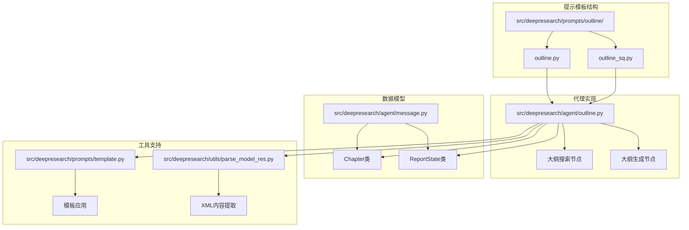

**图表来源**
- [outline.py:1-68](file://src/deepresearch/prompts/outline/outline.py#L1-L68)
- [outline_sq.py:1-44](file://src/deepresearch/prompts/outline/outline_sq.py#L1-L44)
- [outline.py:1-227](file://src/deepresearch/agent/outline.py#L1-L227)
- [message.py:1-112](file://src/deepresearch/agent/message.py#L1-L112)

**章节来源**
- [outline.py:1-68](file://src/deepresearch/prompts/outline/outline.py#L1-L68)
- [outline_sq.py:1-44](file://src/deepresearch/prompts/outline/outline_sq.py#L1-L44)
- [outline.py:1-227](file://src/deepresearch/agent/outline.py#L1-L227)

## 核心组件
大纲模板系统由三个核心组件构成：

### 1. outline大纲模板
outline模板专注于生成详细的研究大纲结构，具有以下特点：
- 提供多层次的章节分解
- 包含详细的写作逻辑说明
- 支持复杂的主题分析框架
- 输出完整的Markdown大纲格式

### 2. outline_sq简化版模板
outline_sq模板专注于快速生成精确的搜索查询，具有以下特点：
- 生成结构化的搜索查询列表
- 强调查询的准确性与时效性
- 支持多维度的问题分解
- 输出标准化的查询格式

### 3. 大纲处理代理
负责协调两个模板的执行流程，包括知识检索、大纲解析和状态管理。

**章节来源**
- [outline.py:14-68](file://src/deepresearch/prompts/outline/outline.py#L14-L68)
- [outline_sq.py:11-44](file://src/deepresearch/prompts/outline/outline_sq.py#L11-L44)
- [outline.py:88-119](file://src/deepresearch/agent/outline.py#L88-L119)

## 架构概览
大纲模板系统的整体架构采用流水线设计，实现了从模板应用到结果解析的完整流程：

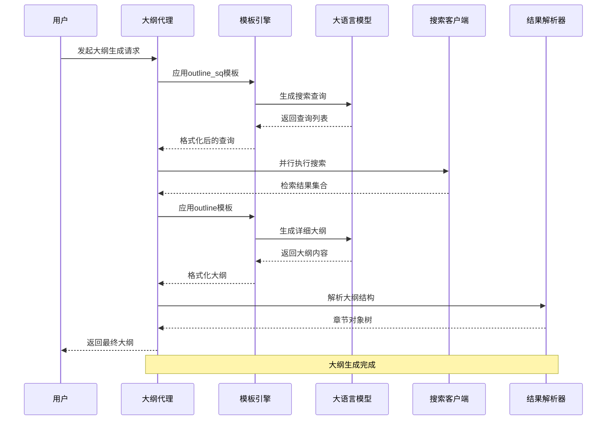

**图表来源**
- [outline.py:22-119](file://src/deepresearch/agent/outline.py#L22-L119)
- [template.py:90-129](file://src/deepresearch/prompts/template.py#L90-L129)

## 详细组件分析

### outline大纲模板深度解析

#### 设计理念
outline模板采用"专家写作"的角色设定，强调：
- **领域专精**：要求模型扮演特定领域的写作专家
- **逻辑严谨**：确保大纲结构的层次性和逻辑性
- **实用性导向**：提供可执行的写作策略和方法

#### 输出格式规范
outline模板严格遵循以下格式规范：

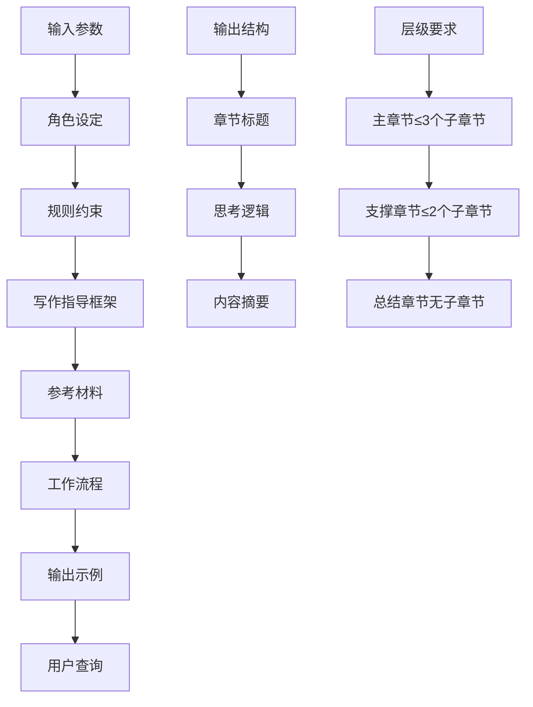

**图表来源**
- [outline.py:14-68](file://src/deepresearch/prompts/outline/outline.py#L14-L68)

#### 核心功能特性
1. **多层次章节分解**：支持从宏观到微观的渐进式分析
2. **结构化写作框架**：提供明确的分析路径和逻辑结构
3. **内容一致性保证**：确保摘要与思考逻辑的完全对应
4. **语言自适应**：自动检测并使用用户主要语言

**章节来源**
- [outline.py:14-68](file://src/deepresearch/prompts/outline/outline.py#L14-L68)

### outline_sq简化版模板深度解析

#### 设计理念
outline_sq模板采用"信息检索策略师"的角色，专注于：
- **查询质量控制**：确保每个搜索查询都符合质量标准
- **时效性优先**：结合当前时间信息生成最新的查询
- **覆盖范围优化**：从多个角度扩展查询范围
- **简洁高效**：保持查询的简洁性和搜索引擎友好性

#### 查询生成算法
outline_sq模板实现了智能的查询生成流程：

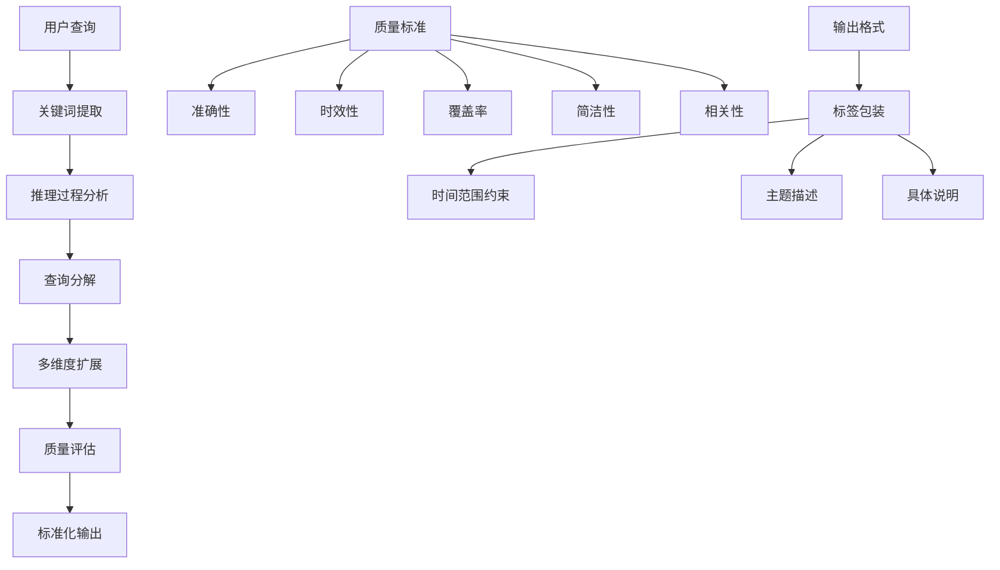

**图表来源**
- [outline_sq.py:22-44](file://src/deepresearch/prompts/outline/outline_sq.py#L22-L44)

#### 核心功能特性
1. **多查询生成**：一次生成3-5个精确的搜索查询
2. **结构化输出**：使用标准的XML标签格式
3. **智能分解**：将复杂问题分解为多个可操作的查询
4. **质量控制**：严格的查询质量评估和筛选机制

**章节来源**
- [outline_sq.py:11-44](file://src/deepresearch/prompts/outline/outline_sq.py#L11-L44)

### 大纲处理代理详解

#### 搜索节点实现
大纲搜索节点负责协调查询生成和知识检索：

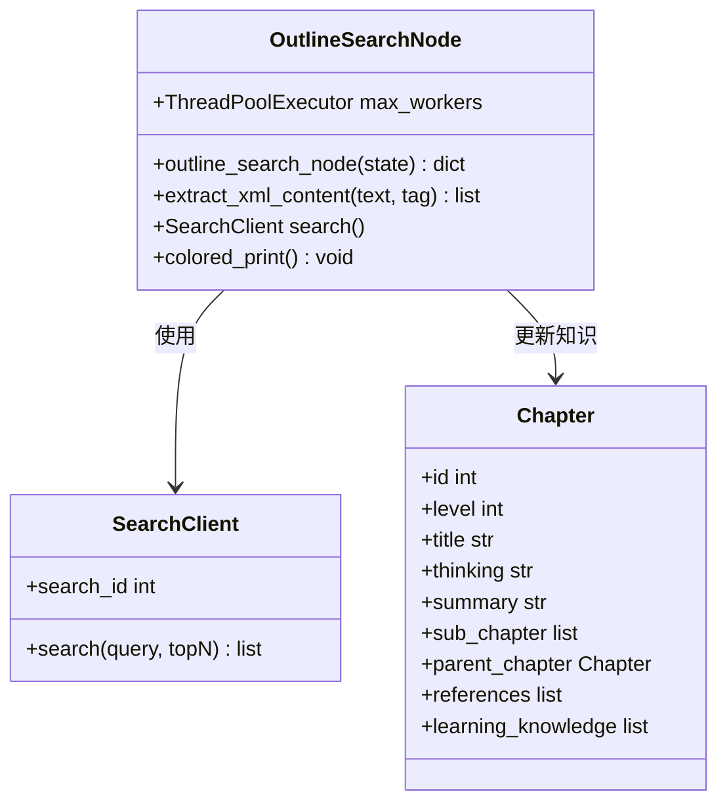

**图表来源**
- [outline.py:22-86](file://src/deepresearch/agent/outline.py#L22-L86)
- [message.py:18-29](file://src/deepresearch/agent/message.py#L18-L29)

#### 大纲生成节点实现
大纲生成节点负责将检索到的知识整合为完整的报告大纲：

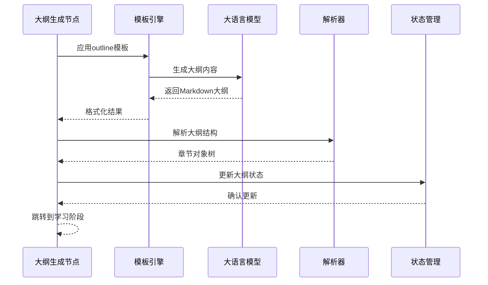

**图表来源**
- [outline.py:88-119](file://src/deepresearch/agent/outline.py#L88-L119)

#### 知识管理机制
系统实现了高效的知识管理机制：

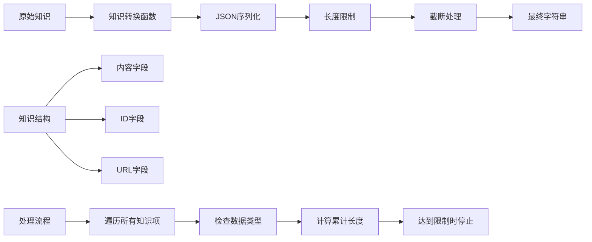

**图表来源**
- [outline.py:121-152](file://src/deepresearch/agent/outline.py#L121-L152)

**章节来源**
- [outline.py:22-227](file://src/deepresearch/agent/outline.py#L22-L227)
- [message.py:18-112](file://src/deepresearch/agent/message.py#L18-L112)

## 依赖关系分析

### 模板系统依赖
大纲模板系统采用了模块化的依赖设计：

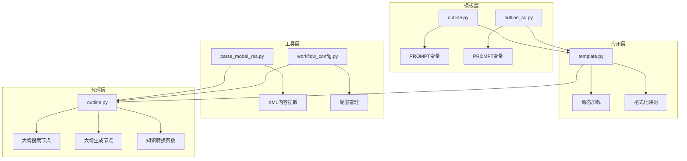

**图表来源**
- [template.py:12-75](file://src/deepresearch/prompts/template.py#L12-L75)
- [parse_model_res.py:7-28](file://src/deepresearch/utils/parse_model_res.py#L7-L28)
- [workflow_config.py:7-27](file://src/deepresearch/config/workflow_config.py#L7-L27)

### 数据流依赖
系统中的数据流体现了清晰的依赖关系：

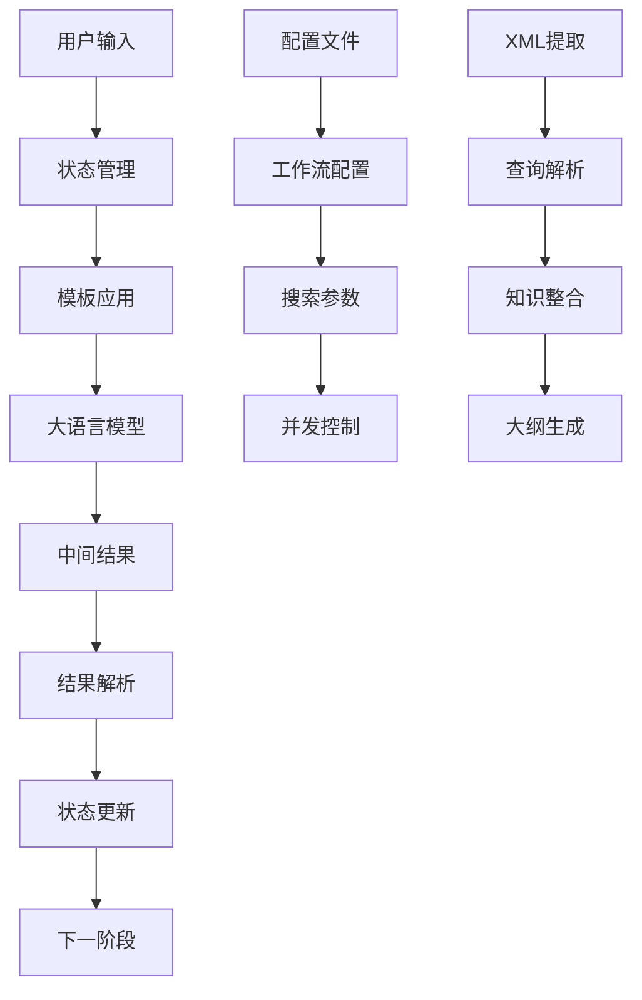

**图表来源**
- [outline.py:88-119](file://src/deepresearch/agent/outline.py#L88-L119)
- [workflow.toml:1-3](file://config/workflow.toml#L1-L3)

**章节来源**
- [template.py:1-166](file://src/deepresearch/prompts/template.py#L1-L166)
- [outline.py:1-227](file://src/deepresearch/agent/outline.py#L1-L227)

## 性能考量

### 复杂度分析

#### 时间复杂度对比
| 组件 | 复杂度 | 描述 |
|------|--------|------|
| outline模板 | O(n log n) | 主要受章节递归解析影响 |
| outline_sq模板 | O(m) | m为查询数量，线性增长 |
| 知识转换函数 | O(k) | k为知识项数量，线性处理 |
| 并行搜索 | O(p) | p为查询数量，最大并发5 |

#### 空间复杂度对比
- **outline模板**：主要消耗于章节对象树的内存存储
- **outline_sq模板**：内存占用相对较小，主要用于查询列表
- **知识管理**：采用流式处理，避免大量内存累积

### 性能优化策略

#### 并发搜索优化
系统实现了智能的并发控制机制：
- 最大并发数限制为5，避免资源过度消耗
- 使用线程池实现高效的并行搜索
- 保持查询顺序的一致性，确保确定性结果

#### 内存管理优化
- 知识转换函数采用单次遍历，避免重复处理
- 实现长度限制机制，防止内存溢出
- 使用LRU缓存优化正则表达式编译

**章节来源**
- [outline.py:42-80](file://src/deepresearch/agent/outline.py#L42-L80)
- [parse_model_res.py:7-11](file://src/deepresearch/utils/parse_model_res.py#L7-L11)

## 故障排除指南

### 常见问题及解决方案

#### 大纲解析错误
当大纲解析失败时，系统会记录错误日志并终止流程：

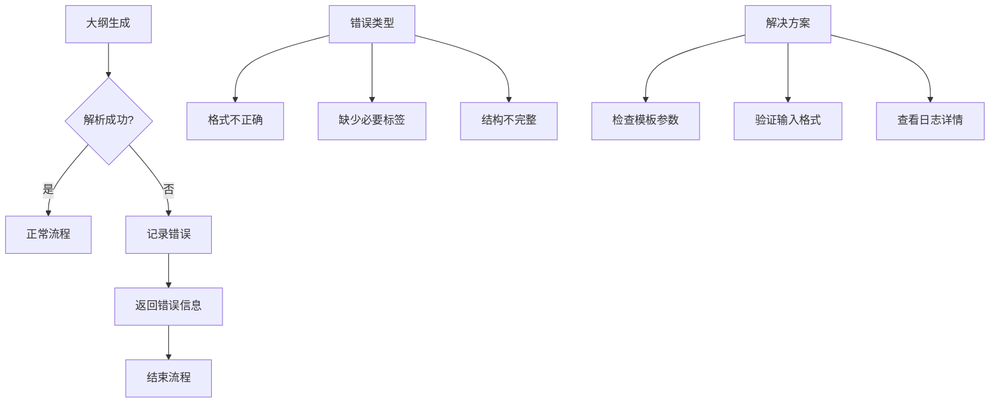

**图表来源**
- [outline.py:112-118](file://src/deepresearch/agent/outline.py#L112-L118)

#### 搜索查询无效
当搜索查询为空或无效时，系统会降级处理：

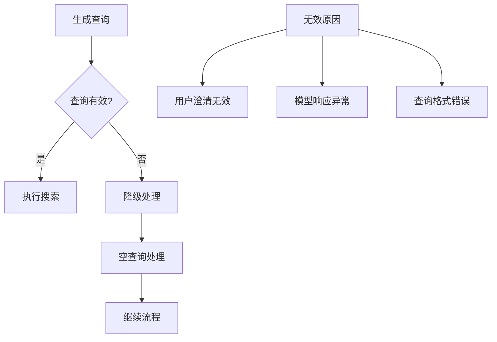

**图表来源**
- [outline.py:78-81](file://src/deepresearch/agent/outline.py#L78-L81)

#### 配置问题排查
工作流配置问题的诊断方法：

**章节来源**
- [outline.py:112-118](file://src/deepresearch/agent/outline.py#L112-L118)
- [test_agent.py:163-173](file://tests/unit/agent/test_agent.py#L163-L173)

## 结论
大纲模板系统通过两个互补的模板设计，实现了从快速查询生成到详细大纲构建的完整工作流程。outline模板提供了深度分析能力，适合需要全面研究的场景；outline_sq模板提供了高效的信息检索能力，适合快速探索阶段。两者结合使用可以显著提升研究效率和质量。

系统的设计充分考虑了性能优化、错误处理和可维护性，为不同规模的研究需求提供了灵活的解决方案。通过合理的参数配置和使用时机选择，用户可以根据具体需求选择最适合的模板类型。

## 附录

### 模板参数配置指南

#### outline模板参数
| 参数 | 类型 | 必需 | 描述 |
|------|------|------|------|
| domain | 字符串 | 是 | 领域名称，用于角色设定 |
| now | 字符串 | 是 | 当前时间，格式为星期月日年 |
| query | 字符串 | 是 | 用户查询内容 |
| reasoning | 字符串 | 是 | 推理过程说明 |
| thinking | 字符串 | 是 | 写作思路框架 |
| reference | 字符串 | 是 | 参考知识内容 |

#### outline_sq模板参数
| 参数 | 类型 | 必需 | 描述 |
|------|------|------|------|
| now | 字符串 | 是 | 当前时间，格式为星期月日年 |
| query | 字符串 | 是 | 用户查询内容 |
| reasoning | 字符串 | 是 | 推理过程说明 |

### 使用场景建议

#### 选择outline模板的场景
- 需要生成详细的研究大纲
- 研究主题复杂，需要多层次分析
- 需要明确的写作逻辑和结构
- 有充足的时间进行深度研究

#### 选择outline_sq模板的场景
- 需要快速获取相关信息
- 研究主题相对简单
- 需要精确的搜索查询
- 时间紧迫，需要快速推进

### 最佳实践指南

#### 模板选择策略
1. **初步探索阶段**：优先使用outline_sq模板快速获取信息
2. **深度分析阶段**：使用outline模板生成详细大纲
3. **混合使用**：先用outline_sq获取基础信息，再用outline模板深化分析

#### 参数优化建议
1. **domain参数**：准确描述研究领域，提高角色适配度
2. **reasoning参数**：提供清晰的分析思路，指导大纲结构
3. **query参数**：保持具体和明确，避免模糊表述

#### 性能优化技巧
1. **合理设置topN参数**：平衡搜索质量和性能
2. **控制并发数量**：避免过度并发导致资源竞争
3. **及时清理缓存**：定期清理正则表达式缓存

**章节来源**
- [workflow.toml:1-3](file://config/workflow.toml#L1-L3)
- [test_agent.py:60-81](file://tests/unit/agent/test_agent.py#L60-L81)