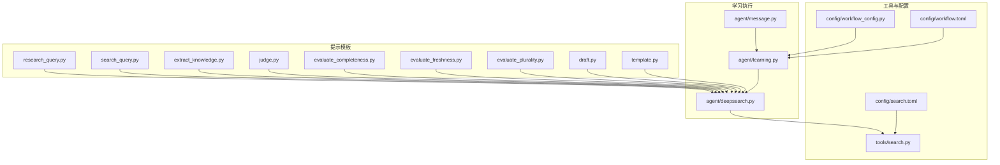
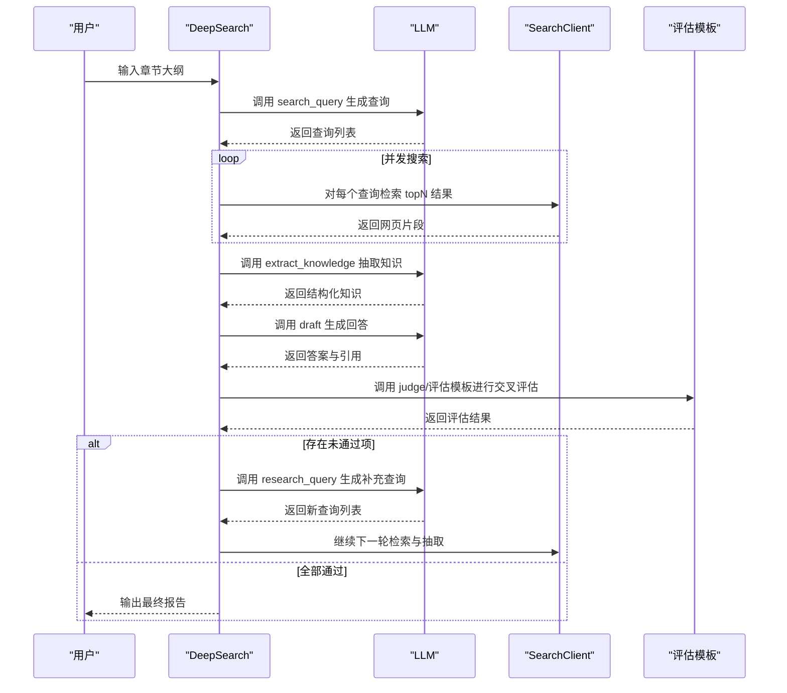
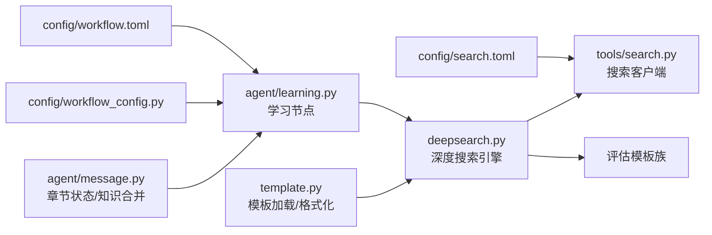

# 学习模板分类

<cite>
**本文档引用的文件**
- [src/deepresearch/prompts/learning/research_query.py](file://src/deepresearch/prompts/learning/research_query.py)
- [src/deepresearch/prompts/learning/search_query.py](file://src/deepresearch/prompts/learning/search_query.py)
- [src/deepresearch/prompts/learning/extract_knowledge.py](file://src/deepresearch/prompts/learning/extract_knowledge.py)
- [src/deepresearch/prompts/learning/judge.py](file://src/deepresearch/prompts/learning/judge.py)
- [src/deepresearch/prompts/learning/evaluate_completeness.py](file://src/deepresearch/prompts/learning/evaluate_completeness.py)
- [src/deepresearch/prompts/learning/evaluate_freshness.py](file://src/deepresearch/prompts/learning/evaluate_freshness.py)
- [src/deepresearch/prompts/learning/evaluate_plurality.py](file://src/deepresearch/prompts/learning/evaluate_plurality.py)
- [src/deepresearch/prompts/learning/draft.py](file://src/deepresearch/prompts/learning/draft.py)
- [src/deepresearch/prompts/template.py](file://src/deepresearch/prompts/template.py)
- [src/deepresearch/agent/deepsearch.py](file://src/deepresearch/agent/deepsearch.py)
- [src/deepresearch/agent/learning.py](file://src/deepresearch/agent/learning.py)
- [src/deepresearch/agent/message.py](file://src/deepresearch/agent/message.py)
- [src/deepresearch/tools/search.py](file://src/deepresearch/tools/search.py)
- [src/deepresearch/config/workflow_config.py](file://src/deepresearch/config/workflow_config.py)
- [config/workflow.toml](file://config/workflow.toml)
- [config/search.toml](file://config/search.toml)
- [README.md](file://README.md)
</cite>

## 目录
1. [简介](#简介)
2. [项目结构](#项目结构)
3. [核心组件](#核心组件)
4. [架构总览](#架构总览)
5. [详细组件分析](#详细组件分析)
6. [依赖分析](#依赖分析)
7. [性能考虑](#性能考虑)
8. [故障排查指南](#故障排查指南)
9. [结论](#结论)
10. [附录](#附录)

## 简介
本文件聚焦“学习模板分类”，系统性解析DeepResearch框架中学习阶段的四个核心模板：研究查询（research_query）、搜索查询（search_query）、知识抽取（extract_knowledge）、判断评估（judge）。文档从算法设计与应用场景出发，阐述模板如何协同工作以实现高质量、可迭代的研究流程；并给出输入输出规范、参数调优策略、性能优化技巧以及复杂查询场景下的模板组合实践。

## 项目结构
DeepResearch采用模块化组织，学习模板位于 prompts/learning 下，配合模板加载器、深度搜索引擎、章节状态管理与工具层共同构成端到端的“规划-检索-抽取-评估-迭代”的研究闭环。

图示来源
- [src/deepresearch/prompts/learning/research_query.py:1-57](file://src/deepresearch/prompts/learning/research_query.py#L1-L57)
- [src/deepresearch/prompts/learning/search_query.py:1-44](file://src/deepresearch/prompts/learning/search_query.py#L1-L44)
- [src/deepresearch/prompts/learning/extract_knowledge.py:1-51](file://src/deepresearch/prompts/learning/extract_knowledge.py#L1-L51)
- [src/deepresearch/prompts/learning/judge.py:1-65](file://src/deepresearch/prompts/learning/judge.py#L1-L65)
- [src/deepresearch/prompts/learning/evaluate_completeness.py:1-82](file://src/deepresearch/prompts/learning/evaluate_completeness.py#L1-L82)
- [src/deepresearch/prompts/learning/evaluate_freshness.py:1-61](file://src/deepresearch/prompts/learning/evaluate_freshness.py#L1-L61)
- [src/deepresearch/prompts/learning/evaluate_plurality.py:1-55](file://src/deepresearch/prompts/learning/evaluate_plurality.py#L1-L55)
- [src/deepresearch/prompts/learning/draft.py:1-40](file://src/deepresearch/prompts/learning/draft.py#L1-L40)
- [src/deepresearch/prompts/template.py:1-166](file://src/deepresearch/prompts/template.py#L1-L166)
- [src/deepresearch/agent/deepsearch.py:1-489](file://src/deepresearch/agent/deepsearch.py#L1-L489)
- [src/deepresearch/agent/learning.py:1-129](file://src/deepresearch/agent/learning.py#L1-L129)
- [src/deepresearch/agent/message.py:1-112](file://src/deepresearch/agent/message.py#L1-L112)
- [src/deepresearch/tools/search.py:1-46](file://src/deepresearch/tools/search.py#L1-L46)
- [src/deepresearch/config/workflow_config.py:1-28](file://src/deepresearch/config/workflow_config.py#L1-L28)
- [config/workflow.toml:1-3](file://config/workflow.toml#L1-L3)
- [config/search.toml:1-6](file://config/search.toml#L1-L6)

章节来源
- [README.md:15-32](file://README.md#L15-L32)

## 核心组件
- 模板加载器：动态扫描并加载 prompts 目录下的模板，支持系统提示与用户提示分离，按名称格式化注入变量。
- 深度搜索引擎：封装检索、抽取、评估、迭代逻辑，形成“查询-检索-抽取-评估-再查询”的树形搜索过程。
- 学习节点：并发处理各子章节，聚合检索结果与知识，维护引用映射与全局搜索ID。
- 章节状态：承载报告大纲、知识片段、引用关系等中间状态，支持知识合并与序列化。

章节来源
- [src/deepresearch/prompts/template.py:25-130](file://src/deepresearch/prompts/template.py#L25-L130)
- [src/deepresearch/agent/deepsearch.py:55-150](file://src/deepresearch/agent/deepsearch.py#L55-L150)
- [src/deepresearch/agent/learning.py:15-93](file://src/deepresearch/agent/learning.py#L15-L93)
- [src/deepresearch/agent/message.py:18-112](file://src/deepresearch/agent/message.py#L18-L112)

## 架构总览
学习模板在深度搜索引擎中被串联使用：先由 search_query 生成一组搜索查询，随后 judge 判定查询所需的质量维度（时效、多样、完整），基于检索结果用 extract_knowledge 抽取结构化知识，再用 draft 生成回答，最后通过多项评估模板完成交叉评估与迭代。

图示来源
- [src/deepresearch/agent/deepsearch.py:74-149](file://src/deepresearch/agent/deepsearch.py#L74-L149)
- [src/deepresearch/prompts/learning/search_query.py:10-44](file://src/deepresearch/prompts/learning/search_query.py#L10-L44)
- [src/deepresearch/prompts/learning/judge.py:10-65](file://src/deepresearch/prompts/learning/judge.py#L10-L65)
- [src/deepresearch/prompts/learning/extract_knowledge.py:10-51](file://src/deepresearch/prompts/learning/extract_knowledge.py#L10-L51)
- [src/deepresearch/prompts/learning/draft.py:10-40](file://src/deepresearch/prompts/learning/draft.py#L10-L40)
- [src/deepresearch/prompts/learning/evaluate_completeness.py:10-82](file://src/deepresearch/prompts/learning/evaluate_completeness.py#L10-L82)
- [src/deepresearch/prompts/learning/evaluate_freshness.py:11-61](file://src/deepresearch/prompts/learning/evaluate_freshness.py#L11-L61)
- [src/deepresearch/prompts/learning/evaluate_plurality.py:10-55](file://src/deepresearch/prompts/learning/evaluate_plurality.py#L10-L55)

## 详细组件分析

### research_query 模板：生成高质量研究补充查询
- 角色定位：高级搜索查询策略师，面向用户意图与现有回答，生成补充与优化后的查询，提升当前轮次的相关性与有效性。
- 关键规则
  - 明确主题：围绕写作要求的核心主题与目标维度，保留原始搜索词的关键术语。
  - 有效补充：基于当前检索与评估结果，仅生成能填补缺失信息的查询，避免重复或重叠。
  - 聚焦维度：每个查询集中于单一方面或维度，提取一个关键概念词，不包含具体参数或数字。
  - 精炼独立：措辞清晰、自包含且改动最小（不超过一个修饰语），适合搜索引擎。
  - 数量控制：最多生成三条查询，以减少冗余并最大化相关性。
- 输入输出
  - 输入：当前时间、现有搜索查询、章节大纲、中间答案、评估结果。
  - 输出：JSON 结构的查询列表，严格遵循模板格式。
- 应用场景
  - 当评估发现内容覆盖不足、时效性欠缺或多样性不够时，生成针对性补充查询。
  - 在多轮迭代中持续优化查询集合，逐步收敛到高质量的知识源。
- 复杂度与性能
  - 查询生成为一次LLM推理，开销主要受模板长度与上下文大小影响；建议控制输入上下文长度以提升响应速度。
- 参数调优
  - 评估维度开关：通过 judge 的返回值决定是否触发 research_query。
  - 最大查询数：模板限制为三条，确保检索与抽取阶段的可控性。
  - 时间约束：结合当前时间自动添加时效性约束，提高查询的实时性。

章节来源
- [src/deepresearch/prompts/learning/research_query.py:13-56](file://src/deepresearch/prompts/learning/research_query.py#L13-L56)
- [src/deepresearch/agent/deepsearch.py:392-418](file://src/deepresearch/agent/deepsearch.py#L392-L418)

### search_query 模板：优化搜索关键词
- 角色定位：信息检索策略师，根据研究需求生成清晰、抽象且精确的搜索查询。
- 关键标准
  - 准确性：紧密贴合研究主题，包含关键实体与标准术语。
  - 抽象性：将具体细节泛化为抽象维度（如“利润/亏损”→“财务报表”，“价格区间”→“产品定位”）。
  - 时效性：根据主题更新频率添加时间约束。
  - 覆盖性：按多个维度拆分信息需求，覆盖所有关键实体与方面。
  - 简洁性：每个查询聚焦一个主题加1–2个维度词，保持结构简洁。
- 输入输出
  - 输入：当前时间、章节大纲。
  - 输出：Markdown 格式的查询清单，每条查询以特定标记包裹，便于后续解析。
- 应用场景
  - 初次检索阶段，快速生成一组高覆盖、低冗余的查询集合。
  - 面向复杂主题时，通过维度拆分保证检索的系统性。
- 复杂度与性能
  - 查询生成为一次LLM推理，模板长度适中；并发搜索阶段的性能瓶颈通常在外部搜索服务。
- 参数调优
  - 查询数量：简单部分1–2条，复杂部分2–3条，避免过度分散。
  - 维度选择：依据主题类型选择合适的分析维度（介绍、现状、关系、应用、建议等）。

章节来源
- [src/deepresearch/prompts/learning/search_query.py:10-44](file://src/deepresearch/prompts/learning/search_query.py#L10-L44)
- [src/deepresearch/agent/deepsearch.py:162-182](file://src/deepresearch/agent/deepsearch.py#L162-L182)

### extract_knowledge 模板：从文本中抽取关键信息
- 角色定位：信息抽取专家，从参考材料中抽取直接支撑用户请求的事实，并组织为结构化的知识点。
- 关键规则
  - 来源限定：严格来自提供的源文本，不得编造、推断或使用外部信息。
  - 意图对齐：仅抽取与用户请求在主题、范围、对象、时间、区域或人群上相关的事实。
  - 完整性：每个知识点必须有明确主体与必要细节（数据、时间、条件或背景），碎片化内容需合并。
  - 有效性：排除无关或非信息性文本，禁止无意义条目。
- 输入输出
  - 输入：参考文本、章节大纲。
  - 输出：JSON 结构的知识数组，包含洞察与引用片段ID。
- 应用场景
  - 将检索到的网页内容转化为结构化知识，为后续合成与引用提供基础。
- 复杂度与性能
  - 抽取为一次LLM推理，受限于输入文本长度；系统内置分段处理以控制单次输入上限。
- 参数调优
  - 输入长度：通过分段与截断控制单次抽取的输入规模，平衡精度与成本。
  - 片段ID映射：确保引用ID与实际检索结果一一对应，便于溯源。

章节来源
- [src/deepresearch/prompts/learning/extract_knowledge.py:10-51](file://src/deepresearch/prompts/learning/extract_knowledge.py#L10-L51)
- [src/deepresearch/agent/deepsearch.py:241-316](file://src/deepresearch/agent/deepsearch.py#L241-L316)

### judge 模板：内容质量评估
- 角色定位：查询评估专家，基于定义与规则判断查询所需的三个质量维度：时效性（freshness）、多样性（plurality）、完整性（completeness）。
- 评估规则
  - fresh：若查询涉及具体年份、阶段、时间段、周期或事件进展，则强调“特定时效性”而非仅“最新”。
  - plurality：若查询包含“列出”、“什么是”、“多个”等提示，或需要多种方法/示例作为输出，则要求多样性。
  - completeness：若查询明确列出多个命名元素并要求对每个元素给出答案，则要求完整性。
- 输入输出
  - 输入：当前时间、章节大纲。
  - 输出：JSON 结构的布尔映射，指示是否需要对应维度。
- 应用场景
  - 在生成查询后，决定后续评估模板的选择与权重，指导回答的侧重点。
- 复杂度与性能
  - 评估为一次LLM推理，开销较小；主要影响后续评估模板链路的分支。
- 参数调优
  - 示例增强：通过示例引导模型更准确地识别关键词与意图，减少误判。

章节来源
- [src/deepresearch/prompts/learning/judge.py:10-65](file://src/deepresearch/prompts/learning/judge.py#L10-L65)
- [src/deepresearch/agent/deepsearch.py:183-207](file://src/deepresearch/agent/deepsearch.py#L183-L207)

### 评估模板族：交叉验证与迭代
- evaluate_completeness：评估回答是否充分覆盖大纲中的关键要点、证据是否充足、信息是否准确、逻辑是否一致、时间线是否完整。
- evaluate_freshness：基于显式或隐式的时间引用，评估材料是否过时或仍然有效，结合内容类型与更新周期设定阈值。
- evaluate_plurality：基于章节大纲中的意图类型，评估回答是否满足预期的数量与多样性要求，覆盖不同视角与类别。
- 输入输出
  - 输入：章节大纲、中间答案（或当前回答）。
  - 输出：包含内部思考与判定的JSON结构，用于决定是否继续迭代。
- 迭代机制
  - 若任一评估未通过，系统将收集未通过原因，调用 research_query 生成补充查询，进入下一轮检索与抽取，直至全部通过。

章节来源
- [src/deepresearch/prompts/learning/evaluate_completeness.py:10-82](file://src/deepresearch/prompts/learning/evaluate_completeness.py#L10-L82)
- [src/deepresearch/prompts/learning/evaluate_freshness.py:11-61](file://src/deepresearch/prompts/learning/evaluate_freshness.py#L11-L61)
- [src/deepresearch/prompts/learning/evaluate_plurality.py:10-55](file://src/deepresearch/prompts/learning/evaluate_plurality.py#L10-L55)
- [src/deepresearch/agent/deepsearch.py:351-391](file://src/deepresearch/agent/deepsearch.py#L351-L391)

### draft 模板：生成可溯源的综合回答
- 角色定位：专业信息分析师，综合多来源洞察并清晰标注其来源，帮助用户把握关键结论。
- 生成规则
  - 严格对齐用户查询，语言清晰精准，避免模糊、冗余或循环表述。
  - 可整合多来源信息但不得超出明确提供的范围。
  - 按不同事实或维度分段组织，避免逐字复制文档内容。
  - 使用自然流畅的风格，避免过于学术或机械的表达。
  - 溯源仅通过引用ID字段体现。
- 输入输出
  - 输入：章节大纲、已整理的知识。
  - 输出：JSON 结构的答案与引用ID数组。
- 应用场景
  - 在抽取完成后生成最终可发布或进一步编辑的报告内容。
- 复杂度与性能
  - 合成为一次LLM推理，输入规模取决于知识数量；建议先进行知识合并与去重以降低冗余。

章节来源
- [src/deepresearch/prompts/learning/draft.py:10-40](file://src/deepresearch/prompts/learning/draft.py#L10-L40)
- [src/deepresearch/agent/deepsearch.py:318-349](file://src/deepresearch/agent/deepsearch.py#L318-L349)

## 依赖分析
- 模板加载与消息格式化
  - 模板加载器负责扫描目录、导入模块并提取 PROMPT/SYSTEM_PROMPT，统一通过 apply_prompt_template 格式化消息，支持系统消息与用户消息的拼接。
- 搜索客户端
  - SearchClient 工厂根据配置选择 jina 或 tavily 引擎，屏蔽底层差异，向上提供统一接口。
- 工作流配置
  - workflow.toml 控制搜索返回条数等参数；search.toml 提供引擎与密钥配置。
- 并发与引用映射
  - 学习节点使用线程池并发处理各子章节，同时维护全局知识与引用ID映射，确保引用一致性。

图示来源
- [src/deepresearch/prompts/template.py:25-130](file://src/deepresearch/prompts/template.py#L25-L130)
- [src/deepresearch/agent/deepsearch.py:55-150](file://src/deepresearch/agent/deepsearch.py#L55-L150)
- [src/deepresearch/agent/learning.py:15-93](file://src/deepresearch/agent/learning.py#L15-L93)
- [src/deepresearch/agent/message.py:57-112](file://src/deepresearch/agent/message.py#L57-L112)
- [src/deepresearch/tools/search.py:12-37](file://src/deepresearch/tools/search.py#L12-L37)
- [src/deepresearch/config/workflow_config.py:7-28](file://src/deepresearch/config/workflow_config.py#L7-L28)
- [config/workflow.toml:1-3](file://config/workflow.toml#L1-L3)
- [config/search.toml:1-6](file://config/search.toml#L1-L6)

章节来源
- [src/deepresearch/prompts/template.py:25-130](file://src/deepresearch/prompts/template.py#L25-L130)
- [src/deepresearch/agent/deepsearch.py:55-150](file://src/deepresearch/agent/deepsearch.py#L55-L150)
- [src/deepresearch/agent/learning.py:15-93](file://src/deepresearch/agent/learning.py#L15-L93)
- [src/deepresearch/agent/message.py:57-112](file://src/deepresearch/agent/message.py#L57-L112)
- [src/deepresearch/tools/search.py:12-37](file://src/deepresearch/tools/search.py#L12-L37)
- [src/deepresearch/config/workflow_config.py:7-28](file://src/deepresearch/config/workflow_config.py#L7-L28)
- [config/workflow.toml:1-3](file://config/workflow.toml#L1-L3)
- [config/search.toml:1-6](file://config/search.toml#L1-L6)

## 性能考虑
- 检索并发
  - 搜索阶段最大并发数受查询数量与外部服务限制；建议根据API配额与延迟调整并发度，避免超限。
- 输入长度控制
  - 知识抽取阶段对输入长度有限制，系统会分段处理；合理设置分段阈值可在精度与成本间取得平衡。
- 线程安全与锁竞争
  - 学习节点使用锁保护全局计数与知识聚合，注意在高并发场景下适当降低最大工作线程数，避免锁争用。
- 模板格式化
  - 动态加载模板带来一定启动开销，建议在进程内复用已加载模板，避免重复导入。
- 评估与迭代
  - 评估模板链路可能多次调用LLM；可通过评估阈值与早期停止策略减少不必要的迭代次数。

## 故障排查指南
- 模板变量缺失
  - apply_prompt_template 在变量缺失时抛出异常；检查 state 中是否包含模板所需的键（如 now、chapter_outline、search、draft 等）。
- 搜索失败
  - SearchClient 在未知引擎名时抛出异常；确认 search.toml 中的引擎配置与可用密钥。
- JSON 解析错误
  - 模板输出经修复解析（json_repair）；若仍失败，检查模板输出格式是否严格遵循JSON结构。
- 引用ID映射异常
  - get_real_reference_ids 基于URL映射ID；若为空，检查检索结果URL与知识片段ID的一致性。
- 评估未通过导致的无限迭代
  - 确保 research_query 能够针对未通过原因生成有效补充查询；必要时增加迭代深度上限或提前终止条件。

章节来源
- [src/deepresearch/prompts/template.py:114-129](file://src/deepresearch/prompts/template.py#L114-L129)
- [src/deepresearch/tools/search.py:17-24](file://src/deepresearch/tools/search.py#L17-L24)
- [src/deepresearch/agent/deepsearch.py:198-207](file://src/deepresearch/agent/deepsearch.py#L198-L207)
- [src/deepresearch/agent/learning.py:104-129](file://src/deepresearch/agent/learning.py#L104-L129)

## 结论
学习模板分类通过“search_query → judge → extract_knowledge → draft → 评估模板族 → research_query”的闭环，实现了对复杂研究任务的渐进式优化。模板设计强调来源绑定、意图对齐与结构化输出，配合并发检索与引用映射，能够在保证准确性的同时提升效率。通过合理的参数调优与性能优化策略，系统可在多样化查询场景中稳定产出高质量研究成果。

## 附录
- 输入输出规范速查
  - search_query：输入（当前时间、章节大纲），输出（查询清单，标记包裹）。
  - judge：输入（当前时间、章节大纲），输出（fresh/plurality/completeness 布尔映射）。
  - extract_knowledge：输入（参考文本、章节大纲），输出（知识数组，含洞察与片段ID）。
  - research_query：输入（当前时间、现有查询、章节大纲、中间答案、评估结果），输出（查询列表）。
  - draft：输入（章节大纲、知识），输出（答案与引用ID数组）。
- 参数调优建议
  - 搜索：topN、并发度、超时；在 search.toml 与 workflow.toml 中配置。
  - 模板：控制输入上下文长度，确保模板输出严格遵循JSON结构。
  - 迭代：根据评估结果动态调整研究查询数量与维度，避免过度迭代。
- 复杂场景示例
  - 多维主题：优先使用 search_query 的维度拆分，确保覆盖全面。
  - 实时数据：启用 freshness 评估，结合时间阈值筛选最新资料。
  - 多示例需求：启用 plurality 评估，确保输出数量与多样性达标。
  - 完整列举：启用 completeness 评估，逐项核验命名元素的覆盖情况。