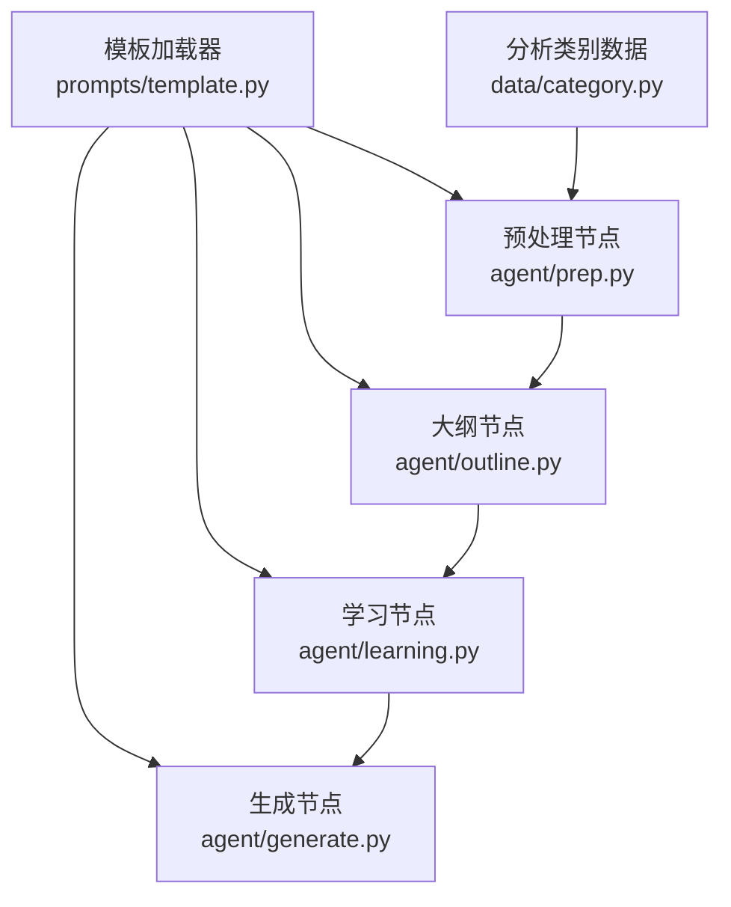
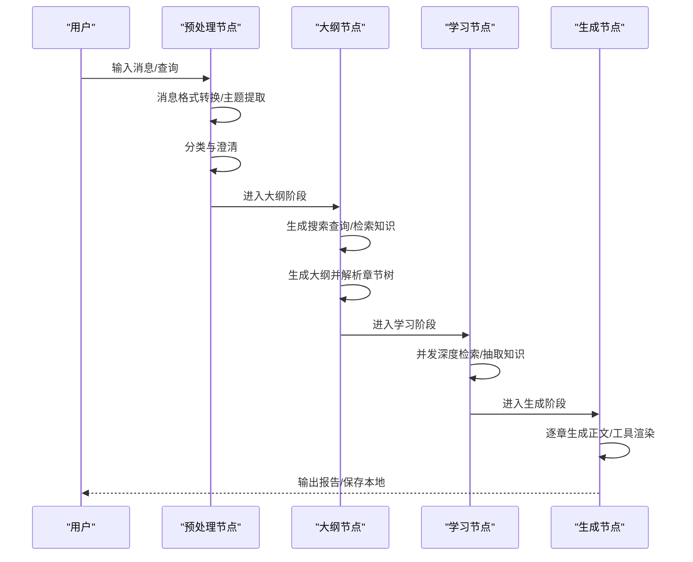
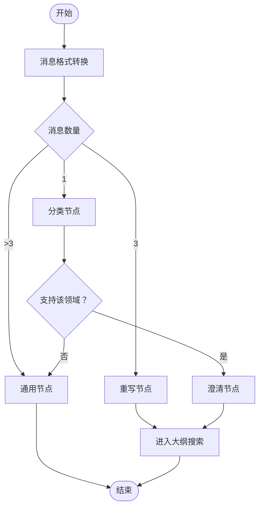
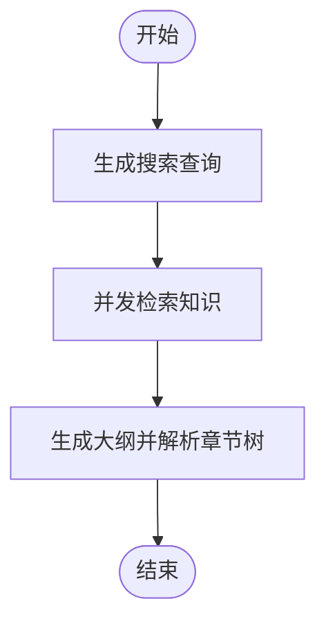
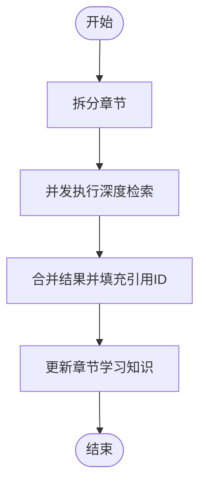
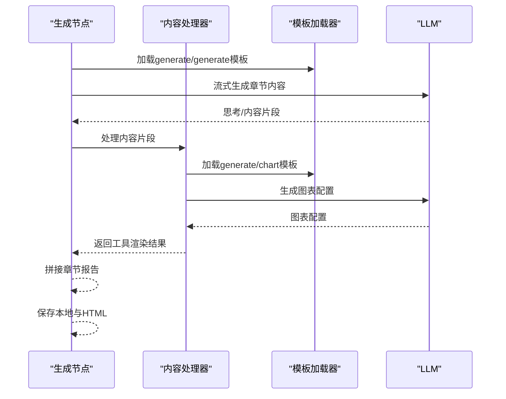
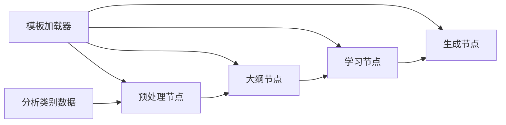

# 模板分类体系

<cite>
**本文引用的文件**
- [src/deepresearch/prompts/template.py](file://src/deepresearch/prompts/template.py)
- [src/deepresearch/agent/prep.py](file://src/deepresearch/agent/prep.py)
- [src/deepresearch/agent/outline.py](file://src/deepresearch/agent/outline.py)
- [src/deepresearch/agent/learning.py](file://src/deepresearch/agent/learning.py)
- [src/deepresearch/agent/generate.py](file://src/deepresearch/agent/generate.py)
- [src/deepresearch/data/category.py](file://src/deepresearch/data/category.py)
</cite>

## 目录
1. [简介](#简介)
2. [项目结构](#项目结构)
3. [核心组件](#核心组件)
4. [架构总览](#架构总览)
5. [详细组件分析](#详细组件分析)
6. [依赖分析](#依赖分析)
7. [性能考虑](#性能考虑)
8. [故障排查指南](#故障排查指南)
9. [结论](#结论)
10. [附录](#附录)

## 简介
本文件系统化梳理DeepResearch的模板分类体系，围绕四大模板分类“预处理（prep）、大纲（outline）、学习（learning）、生成（generate）”展开，明确各分类的功能定位、模板类型与作用机制，解释模板文件组织结构与命名约定，阐明模板间的协作关系与数据流转过程，并给出典型应用场景、参数要求与输出格式说明。

## 项目结构
模板体系以“提示词模板加载器”为核心，按分类目录动态扫描并注册模板；各Agent节点通过模板名称调用对应模板，完成消息构造与流程推进。

图表来源
- [src/deepresearch/prompts/template.py:12-17](file://src/deepresearch/prompts/template.py#L12-L17)
- [src/deepresearch/agent/prep.py:105-150](file://src/deepresearch/agent/prep.py#L105-L150)
- [src/deepresearch/agent/outline.py:88-118](file://src/deepresearch/agent/outline.py#L88-L118)
- [src/deepresearch/agent/learning.py:15-93](file://src/deepresearch/agent/learning.py#L15-L93)
- [src/deepresearch/agent/generate.py:26-111](file://src/deepresearch/agent/generate.py#L26-L111)
- [src/deepresearch/data/category.py:74-103](file://src/deepresearch/data/category.py#L74-L103)

章节来源
- [src/deepresearch/prompts/template.py:12-17](file://src/deepresearch/prompts/template.py#L12-L17)
- [src/deepresearch/agent/prep.py:105-150](file://src/deepresearch/agent/prep.py#L105-L150)
- [src/deepresearch/agent/outline.py:88-118](file://src/deepresearch/agent/outline.py#L88-L118)
- [src/deepresearch/agent/learning.py:15-93](file://src/deepresearch/agent/learning.py#L15-L93)
- [src/deepresearch/agent/generate.py:26-111](file://src/deepresearch/agent/generate.py#L26-L111)
- [src/deepresearch/data/category.py:74-103](file://src/deepresearch/data/category.py#L74-L103)

## 核心组件
- 模板加载器：从四个分类目录动态导入模板模块，提取模板变量，支持系统提示与用户提示分别注册。
- 预处理节点：负责消息格式转换、主题提取、问题分类、澄清与通用回复。
- 大纲节点：基于领域逻辑与检索知识生成报告大纲，并解析为章节树。
- 学习节点：针对大纲章节执行深度检索与知识抽取，构建学习型知识库。
- 生成节点：逐章生成报告正文，支持表格与图表工具渲染，最终保存本地并可转HTML。

章节来源
- [src/deepresearch/prompts/template.py:25-87](file://src/deepresearch/prompts/template.py#L25-L87)
- [src/deepresearch/agent/prep.py:21-80](file://src/deepresearch/agent/prep.py#L21-L80)
- [src/deepresearch/agent/outline.py:88-118](file://src/deepresearch/agent/outline.py#L88-L118)
- [src/deepresearch/agent/learning.py:15-93](file://src/deepresearch/agent/learning.py#L15-L93)
- [src/deepresearch/agent/generate.py:26-111](file://src/deepresearch/agent/generate.py#L26-L111)

## 架构总览
模板分类体系采用“模板即代码”的设计：每个模板以独立Python模块导出PROMPT与可选SYSTEM_PROMPT，模板加载器统一注册后，Agent节点通过名称选择模板并注入状态变量，形成端到端的数据流。

图表来源
- [src/deepresearch/agent/prep.py:21-80](file://src/deepresearch/agent/prep.py#L21-L80)
- [src/deepresearch/agent/outline.py:22-85](file://src/deepresearch/agent/outline.py#L22-L85)
- [src/deepresearch/agent/learning.py:15-93](file://src/deepresearch/agent/learning.py#L15-L93)
- [src/deepresearch/agent/generate.py:26-111](file://src/deepresearch/agent/generate.py#L26-L111)

## 详细组件分析

### 预处理（prep）分类
- 功能定位：将多轮对话消息标准化为LLM可消费的消息序列，提取主题，进行领域分类与一次澄清，或进入通用回复。
- 关键模板与调用：
  - prep/rewrite：重写用户需求，提炼主题。
  - prep/classify：将主题映射到分析类别，返回逻辑步骤与细节。
  - prep/clarify：在首次交互时进行一次性澄清确认。
- 典型流程：
  - 单轮输入：直接进入分类。
  - 三轮历史：触发重写与主题提炼。
  - 后续轮次：仅模型回复。
- 参数与输出：
  - 输入：messages（消息列表）、topic（主题）、query（当前查询）。
  - 输出：domain（领域）、logic（逻辑步骤）、details（详细分析内容）、topic（最终主题）。
- 错误处理：当分类结果缺失或不支持时，回退至通用节点。

图表来源
- [src/deepresearch/agent/prep.py:21-80](file://src/deepresearch/agent/prep.py#L21-L80)
- [src/deepresearch/agent/prep.py:82-103](file://src/deepresearch/agent/prep.py#L82-L103)
- [src/deepresearch/agent/prep.py:105-150](file://src/deepresearch/agent/prep.py#L105-L150)
- [src/deepresearch/agent/prep.py:153-181](file://src/deepresearch/agent/prep.py#L153-L181)
- [src/deepresearch/agent/prep.py:184-202](file://src/deepresearch/agent/prep.py#L184-L202)
- [src/deepresearch/data/category.py:74-103](file://src/deepresearch/data/category.py#L74-L103)

章节来源
- [src/deepresearch/agent/prep.py:21-80](file://src/deepresearch/agent/prep.py#L21-L80)
- [src/deepresearch/agent/prep.py:82-103](file://src/deepresearch/agent/prep.py#L82-L103)
- [src/deepresearch/agent/prep.py:105-150](file://src/deepresearch/agent/prep.py#L105-L150)
- [src/deepresearch/agent/prep.py:153-181](file://src/deepresearch/agent/prep.py#L153-L181)
- [src/deepresearch/agent/prep.py:184-202](file://src/deepresearch/agent/prep.py#L184-L202)
- [src/deepresearch/data/category.py:74-103](file://src/deepresearch/data/category.py#L74-L103)

### 大纲（outline）分类
- 功能定位：根据主题与领域逻辑生成报告大纲，结合检索知识增强规划质量。
- 关键模板与调用：
  - outline/outline_sq：生成多条搜索查询，用于大纲知识收集。
  - outline/outline：基于主题、逻辑、参考知识生成章节大纲。
- 数据结构：
  - 章节树（Chapter）：包含层级、标题、摘要、思考点与子章节。
- 参数与输出：
  - 输入：topic、domain、logic、details、reference（检索知识）、reasoning。
  - 输出：outline（章节树对象）。

图表来源
- [src/deepresearch/agent/outline.py:22-85](file://src/deepresearch/agent/outline.py#L22-L85)
- [src/deepresearch/agent/outline.py:88-118](file://src/deepresearch/agent/outline.py#L88-L118)
- [src/deepresearch/agent/outline.py:158-220](file://src/deepresearch/agent/outline.py#L158-L220)

章节来源
- [src/deepresearch/agent/outline.py:22-85](file://src/deepresearch/agent/outline.py#L22-L85)
- [src/deepresearch/agent/outline.py:88-118](file://src/deepresearch/agent/outline.py#L88-L118)
- [src/deepresearch/agent/outline.py:158-220](file://src/deepresearch/agent/outline.py#L158-L220)

### 学习（learning）分类
- 功能定位：对大纲中的每一章节执行深度检索与知识抽取，构建学习型知识库，并建立引用ID映射。
- 关键流程：
  - 并发处理：限制最大线程数，避免LLM API过载。
  - 引用映射：将模板中声明的引用与全局知识库中的URL匹配，生成真实引用ID。
- 参数与输出：
  - 输入：outline（章节树）、knowledge（全局知识库）、search_id（自增ID）。
  - 输出：更新后的outline（含每章学习知识）、扩展的知识库与search_id。

图表来源
- [src/deepresearch/agent/learning.py:15-93](file://src/deepresearch/agent/learning.py#L15-L93)
- [src/deepresearch/agent/learning.py:104-129](file://src/deepresearch/agent/learning.py#L104-L129)

章节来源
- [src/deepresearch/agent/learning.py:15-93](file://src/deepresearch/agent/learning.py#L15-L93)
- [src/deepresearch/agent/learning.py:104-129](file://src/deepresearch/agent/learning.py#L104-L129)

### 生成（generate）分类
- 功能定位：逐章生成报告正文，支持表格与图表工具渲染，最终保存本地Markdown与HTML。
- 关键模板与调用：
  - generate/generate：生成单章内容，注入上下文与参考知识。
  - generate/chart：根据描述生成图表配置并嵌入HTML。
- 工具处理：
  - ContentProcessor：流式解析输出，识别表格与图表标记，按需调用模板生成工具内容。
- 参数与输出：
  - 输入：topic、domain、outline、chapter_outline、reference、above、now。
  - 输出：final_report（完整报告）、output.message（报告文本）、保存路径（可选）。

图表来源
- [src/deepresearch/agent/generate.py:26-111](file://src/deepresearch/agent/generate.py#L26-L111)
- [src/deepresearch/agent/generate.py:169-295](file://src/deepresearch/agent/generate.py#L169-L295)
- [src/deepresearch/prompts/template.py:90-129](file://src/deepresearch/prompts/template.py#L90-L129)

章节来源
- [src/deepresearch/agent/generate.py:26-111](file://src/deepresearch/agent/generate.py#L26-L111)
- [src/deepresearch/agent/generate.py:169-295](file://src/deepresearch/agent/generate.py#L169-L295)
- [src/deepresearch/prompts/template.py:90-129](file://src/deepresearch/prompts/template.py#L90-L129)

## 依赖分析
- 模板加载器依赖于四个分类目录，动态导入模块并提取模板变量，支持系统提示与用户提示分别注册。
- Agent节点通过模板名称调用模板，注入状态字典，形成强解耦的提示词体系。
- 分类间依赖链：预处理 → 大纲 → 学习 → 生成；分类内模板相互独立，通过状态传递衔接。

图表来源
- [src/deepresearch/prompts/template.py:25-87](file://src/deepresearch/prompts/template.py#L25-L87)
- [src/deepresearch/agent/prep.py:105-150](file://src/deepresearch/agent/prep.py#L105-L150)
- [src/deepresearch/agent/outline.py:88-118](file://src/deepresearch/agent/outline.py#L88-L118)
- [src/deepresearch/agent/learning.py:15-93](file://src/deepresearch/agent/learning.py#L15-L93)
- [src/deepresearch/agent/generate.py:26-111](file://src/deepresearch/agent/generate.py#L26-L111)
- [src/deepresearch/data/category.py:74-103](file://src/deepresearch/data/category.py#L74-L103)

章节来源
- [src/deepresearch/prompts/template.py:25-87](file://src/deepresearch/prompts/template.py#L25-L87)
- [src/deepresearch/agent/prep.py:105-150](file://src/deepresearch/agent/prep.py#L105-L150)
- [src/deepresearch/agent/outline.py:88-118](file://src/deepresearch/agent/outline.py#L88-L118)
- [src/deepresearch/agent/learning.py:15-93](file://src/deepresearch/agent/learning.py#L15-L93)
- [src/deepresearch/agent/generate.py:26-111](file://src/deepresearch/agent/generate.py#L26-L111)
- [src/deepresearch/data/category.py:74-103](file://src/deepresearch/data/category.py#L74-L103)

## 性能考虑
- 模板加载：惰性加载策略，首次使用时扫描并缓存模板，避免重复开销。
- 大纲检索：并发线程池限制最大工作线程数，保证API速率控制与稳定性。
- 学习阶段：章节级并发处理，使用锁保护全局search_id与知识库，避免竞态。
- 生成阶段：流式处理与缓冲区管理，减少大段输出的内存压力；工具渲染按需触发，降低不必要的调用。

## 故障排查指南
- 模板缺失：若模板名称不存在或变量缺失，将抛出错误提示，检查模板名称与状态字段。
- 分类不支持：当领域不在支持列表时，回退至通用节点；确认分析类别数据配置正确。
- 引用映射失败：若URL无法匹配到全局知识库，引用ID为空；检查检索结果与URL一致性。
- 保存失败：保存目录创建或文件写入异常时记录日志；检查权限与路径配置。

章节来源
- [src/deepresearch/prompts/template.py:114-129](file://src/deepresearch/prompts/template.py#L114-L129)
- [src/deepresearch/agent/prep.py:118-132](file://src/deepresearch/agent/prep.py#L118-L132)
- [src/deepresearch/agent/learning.py:104-129](file://src/deepresearch/agent/learning.py#L104-L129)
- [src/deepresearch/agent/generate.py:133-158](file://src/deepresearch/agent/generate.py#L133-L158)

## 结论
模板分类体系通过“提示词即模块”的方式实现了高度解耦与可扩展的提示工程框架。四大分类各司其职：预处理负责消息与主题治理，大纲负责结构化规划，学习负责知识增强，生成负责内容产出与落地。配合统一的模板加载与状态注入机制，形成清晰的数据流与稳定的运行时行为。

## 附录

### 模板文件组织结构与命名约定
- 目录布局：模板位于提示词根目录下，按分类划分子目录（generate、learning、outline、prep）。
- 文件命名：每个模板为独立Python模块，导出PROMPT与可选SYSTEM_PROMPT变量。
- 注册规则：模板加载器自动扫描分类目录，导入模块并注册“分类/模块名”与“分类/模块名_system”两条键位。

章节来源
- [src/deepresearch/prompts/template.py:12-17](file://src/deepresearch/prompts/template.py#L12-L17)
- [src/deepresearch/prompts/template.py:47-70](file://src/deepresearch/prompts/template.py#L47-L70)

### 各分类模板清单与作用
- 预处理（prep）
  - prep/rewrite：重写用户需求，提炼主题。
  - prep/classify：将主题映射到分析类别，返回逻辑步骤与细节。
  - prep/clarify：一次性澄清确认。
- 大纲（outline）
  - outline/outline_sq：生成搜索查询，辅助知识收集。
  - outline/outline：生成章节大纲并解析为章节树。
- 学习（learning）
  - 通过深度检索与知识抽取构建学习型知识库。
- 生成（generate）
  - generate/generate：生成单章内容。
  - generate/chart：生成图表配置并嵌入HTML。

章节来源
- [src/deepresearch/agent/prep.py:84-103](file://src/deepresearch/agent/prep.py#L84-L103)
- [src/deepresearch/agent/prep.py:107-113](file://src/deepresearch/agent/prep.py#L107-L113)
- [src/deepresearch/agent/prep.py:155-165](file://src/deepresearch/agent/prep.py#L155-L165)
- [src/deepresearch/agent/outline.py:24-35](file://src/deepresearch/agent/outline.py#L24-L35)
- [src/deepresearch/agent/outline.py:89-106](file://src/deepresearch/agent/outline.py#L89-L106)
- [src/deepresearch/agent/generate.py:72-86](file://src/deepresearch/agent/generate.py#L72-L86)
- [src/deepresearch/agent/generate.py:260-271](file://src/deepresearch/agent/generate.py#L260-L271)

### 典型应用场景与参数要求
- 预处理（prep）
  - 场景：多轮对话、需求澄清、主题提炼。
  - 参数：messages、topic、query。
  - 输出：domain、logic、details、topic。
- 大纲（outline）
  - 场景：结构化报告规划、知识引导。
  - 参数：topic、domain、logic、details、reference、reasoning。
  - 输出：outline（章节树）。
- 学习（learning）
  - 场景：章节级知识检索与抽取。
  - 参数：outline、knowledge、search_id。
  - 输出：更新后的outline、扩展知识库、search_id。
- 生成（generate）
  - 场景：逐章生成正文、表格/图表渲染、本地保存。
  - 参数：topic、domain、outline、chapter_outline、reference、above、now。
  - 输出：final_report、output.message、保存路径。

章节来源
- [src/deepresearch/agent/prep.py:84-103](file://src/deepresearch/agent/prep.py#L84-L103)
- [src/deepresearch/agent/outline.py:89-106](file://src/deepresearch/agent/outline.py#L89-L106)
- [src/deepresearch/agent/learning.py:15-93](file://src/deepresearch/agent/learning.py#L15-L93)
- [src/deepresearch/agent/generate.py:72-86](file://src/deepresearch/agent/generate.py#L72-L86)