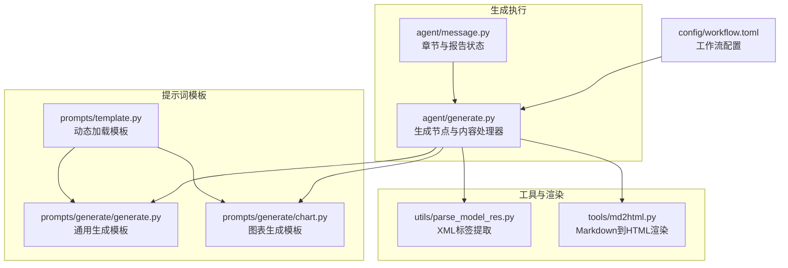
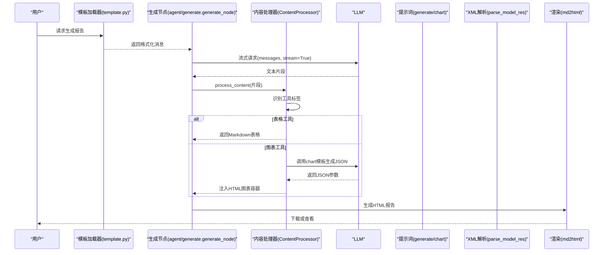
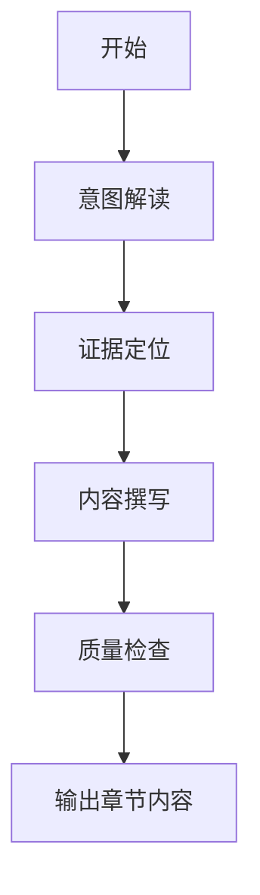
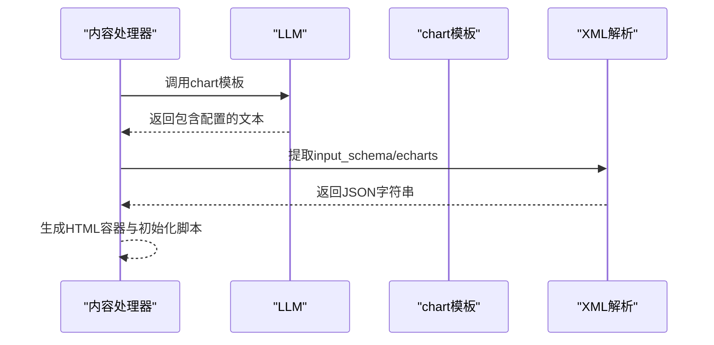
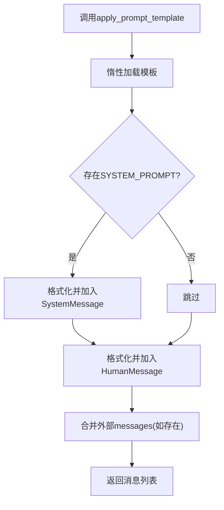
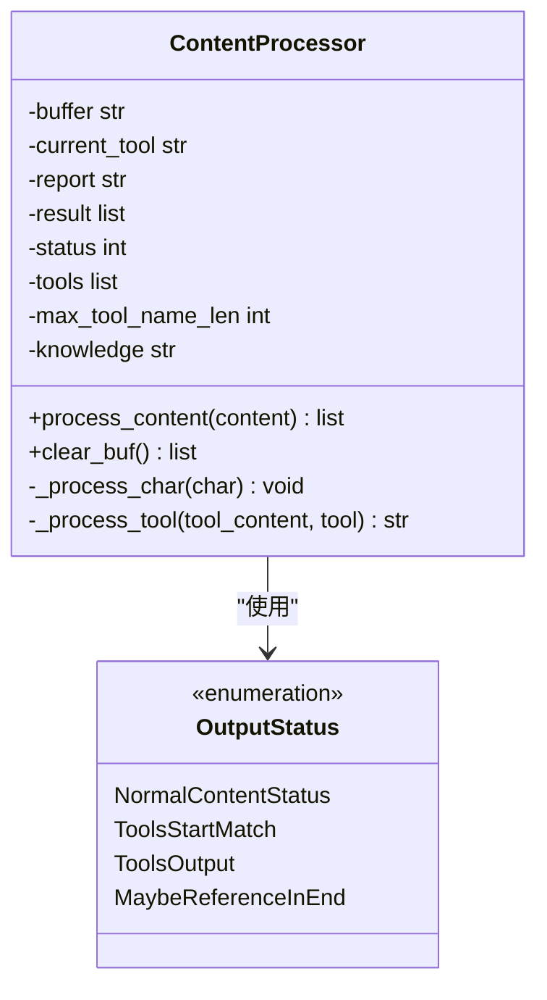
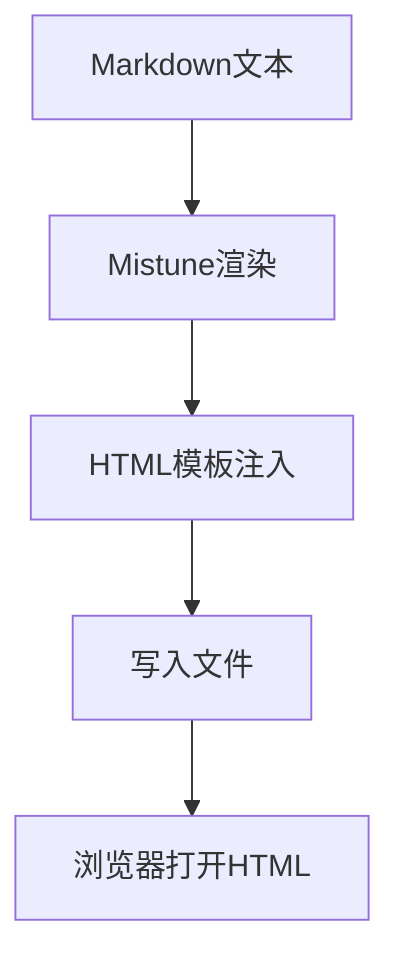
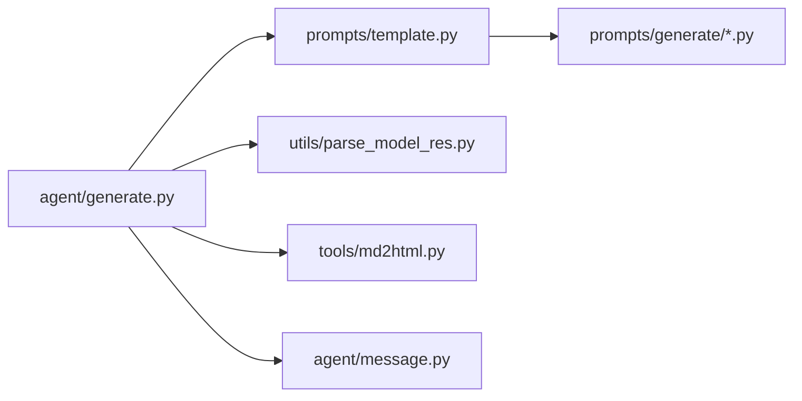

# 生成模板分类

<cite>
**本文引用的文件**
- [generate.py](file://src/deepresearch/prompts/generate/generate.py)
- [chart.py](file://src/deepresearch/prompts/generate/chart.py)
- [generate.py](file://src/deepresearch/agent/generate.py)
- [template.py](file://src/deepresearch/prompts/template.py)
- [parse_model_res.py](file://src/deepresearch/utils/parse_model_res.py)
- [md2html.py](file://src/deepresearch/tools/md2html.py)
- [message.py](file://src/deepresearch/agent/message.py)
- [workflow.toml](file://config/workflow.toml)
- [README.md](file://README.md)
</cite>

## 目录
1. [引言](#引言)
2. [项目结构](#项目结构)
3. [核心组件](#核心组件)
4. [架构总览](#架构总览)
5. [详细组件分析](#详细组件分析)
6. [依赖分析](#依赖分析)
7. [性能考虑](#性能考虑)
8. [故障排查指南](#故障排查指南)
9. [结论](#结论)
10. [附录](#附录)

## 引言
本文件系统性梳理生成阶段两类核心模板：通用生成模板与图表生成模板，并围绕其功能特性、技术实现、输出格式控制、样式定制、质量保障机制以及多模态（文本+图表）协同生成进行深入解析。同时给出参数配置指南、性能调优建议、质量评估标准与模板选择策略，帮助用户在不同领域与呈现需求下做出最优选择。

## 项目结构
生成模板位于 prompts/generate 目录，配套的提示词模板加载器与工具链分布在 prompts/template.py、agent/generate.py、utils/parse_model_res.py、tools/md2html.py 等模块中；章节与报告状态由 agent/message.py 提供；工作流配置位于 config/workflow.toml。

**图示来源**
- [template.py:25-129](file://src/deepresearch/prompts/template.py#L25-L129)
- [generate.py:15-103](file://src/deepresearch/prompts/generate/generate.py#L15-L103)
- [chart.py:11-37](file://src/deepresearch/prompts/generate/chart.py#L11-L37)
- [generate.py:26-313](file://src/deepresearch/agent/generate.py#L26-L313)
- [parse_model_res.py:13-27](file://src/deepresearch/utils/parse_model_res.py#L13-L27)
- [md2html.py:34-800](file://src/deepresearch/tools/md2html.py#L34-L800)
- [message.py:101-112](file://src/deepresearch/agent/message.py#L101-L112)
- [workflow.toml:1-3](file://config/workflow.toml#L1-L3)

**章节来源**
- [README.md:15-32](file://README.md#L15-L32)
- [template.py:12-70](file://src/deepresearch/prompts/template.py#L12-L70)
- [generate.py:26-111](file://src/deepresearch/agent/generate.py#L26-L111)

## 核心组件
- 通用生成模板（generate/generate）
  - 定义领域专家角色、事实优先、精确引用、实体匹配、聚焦主题等核心约束
  - 规定逻辑严谨、深度洞察、表达规范三大写作标准
  - 明确可视化工具使用原则：图表生成与表格生成的适用场景与格式要求
  - 提供任务流程：意图解读、证据定位、内容撰写、质量检查
- 图表生成模板（generate/chart）
  - 基于参考材料生成 ECharts 图表的 JSON 配置
  - 通过工具调用生成 HTML 图表页面，严格限定参数与格式
- 提示词模板加载器（prompts/template）
  - 动态扫描 generate/learning/outline/prep 等目录，按约定提取 PROMPT 与 SYSTEM_PROMPT
  - 支持惰性加载与变量注入，返回标准化消息列表
- 内容处理器（agent/generate.ContentProcessor）
  - 流式解析模型输出，识别并提取表格与图表工具调用片段
  - 对表格直接内嵌 Markdown 表格，对图表触发二次调用生成 ECharts JSON 并注入 HTML 容器
- XML 解析工具（utils/parse_model_res）
  - 缓存编译后的正则，高效提取工具调用中的输入参数
- 渲染器（tools/md2html）
  - 将 Markdown 报告渲染为 HTML，内置图表容器与 ECharts 脚本，支持主题切换与引用高亮
- 状态与章节（agent/message）
  - 定义章节树、学习知识合并与序列化，支撑上下文传递与引用映射

**章节来源**
- [generate.py:15-103](file://src/deepresearch/prompts/generate/generate.py#L15-L103)
- [chart.py:11-37](file://src/deepresearch/prompts/generate/chart.py#L11-L37)
- [template.py:25-129](file://src/deepresearch/prompts/template.py#L25-L129)
- [generate.py:169-295](file://src/deepresearch/agent/generate.py#L169-L295)
- [parse_model_res.py:7-27](file://src/deepresearch/utils/parse_model_res.py#L7-L27)
- [md2html.py:19-800](file://src/deepresearch/tools/md2html.py#L19-L800)
- [message.py:18-99](file://src/deepresearch/agent/message.py#L18-L99)

## 架构总览
生成流程从提示词模板加载开始，结合章节与知识上下文，通过 LLM 流式生成文本内容；内容处理器实时解析工具调用片段，分别处理表格与图表两类工具；最终统一渲染为 HTML 报告并保存本地。

**图示来源**
- [template.py:90-129](file://src/deepresearch/prompts/template.py#L90-L129)
- [generate.py:26-111](file://src/deepresearch/agent/generate.py#L26-L111)
- [generate.py:169-295](file://src/deepresearch/agent/generate.py#L169-L295)
- [chart.py:29-37](file://src/deepresearch/prompts/generate/chart.py#L29-L37)
- [parse_model_res.py:13-27](file://src/deepresearch/utils/parse_model_res.py#L13-L27)
- [md2html.py:34-800](file://src/deepresearch/tools/md2html.py#L34-L800)

## 详细组件分析

### 通用生成模板（generate/generate）
- 角色与约束
  - 以领域专家身份生成内容，强调“事实优先、精确引用、实体匹配、聚焦主题”
  - 写作标准涵盖逻辑严谨、深度洞察、表达规范三方面
- 可视化工具
  - 明确图表与表格的适用场景与输出格式要求
  - 工具调用需遵循严格 XML 格式，缺失参数视为强制项
- 工作流
  - 意图解读、证据定位、内容撰写、质量检查四步法
  - 上下文包含用户查询、章节大纲、前序摘要、总体大纲与参考材料

**图示来源**
- [generate.py:68-102](file://src/deepresearch/prompts/generate/generate.py#L68-L102)

**章节来源**
- [generate.py:15-103](file://src/deepresearch/prompts/generate/generate.py#L15-L103)

### 图表生成模板（generate/chart）
- 输入
  - 图表描述（定位或作用）、前序上下文、参考材料
- 输出
  - 严格来自参考材料的 ECharts JSON 配置
  - 通过工具调用生成 HTML 图表页面，仅提供必要参数
- 处理
  - 内容处理器在检测到图表标签后，构造 chart 模板消息并调用 LLM
  - 使用 XML 解析工具提取 input_schema 或 echarts 字段作为配置源

**图示来源**
- [chart.py:29-37](file://src/deepresearch/prompts/generate/chart.py#L29-L37)
- [generate.py:242-295](file://src/deepresearch/agent/generate.py#L242-L295)
- [parse_model_res.py:13-27](file://src/deepresearch/utils/parse_model_res.py#L13-L27)

**章节来源**
- [chart.py:11-37](file://src/deepresearch/prompts/generate/chart.py#L11-L37)
- [generate.py:242-295](file://src/deepresearch/agent/generate.py#L242-L295)
- [parse_model_res.py:13-27](file://src/deepresearch/utils/parse_model_res.py#L13-L27)

### 提示词模板加载器（prompts/template）
- 功能
  - 扫描指定目录，动态导入模块并提取 PROMPT 与 SYSTEM_PROMPT
  - 支持惰性加载，首次访问时完成缓存
  - apply_prompt_template 接受 state 变量字典，进行格式化并返回消息列表
- 错误处理
  - 缺失变量时抛出明确异常，便于定位问题

**图示来源**
- [template.py:78-129](file://src/deepresearch/prompts/template.py#L78-L129)

**章节来源**
- [template.py:25-129](file://src/deepresearch/prompts/template.py#L25-L129)

### 内容处理器（agent/generate.ContentProcessor）
- 职责
  - 流式处理模型输出，维护状态机识别工具标签起止
  - 对表格直接返回 Markdown 表格内容
  - 对图表触发二次模板调用，注入 HTML 容器与 ECharts 初始化脚本
- 关键点
  - 使用预编译正则与 LRU 缓存提升性能
  - 在工具输出结束时进行清理与结果提交

**图示来源**
- [generate.py:161-295](file://src/deepresearch/agent/generate.py#L161-L295)

**章节来源**
- [generate.py:169-295](file://src/deepresearch/agent/generate.py#L169-L295)
- [parse_model_res.py:7-11](file://src/deepresearch/utils/parse_model_res.py#L7-L11)

### 渲染与保存（tools/md2html 与本地保存）
- 渲染
  - 使用 Mistune 渲染 Markdown，自定义 ReportRenderer 支持自定义代码块与引用链接
  - 内置 ECharts 与 Mermaid 资源，提供主题切换与弹窗引用交互
- 保存
  - 生成 Markdown 与 HTML 文件，自动附加参考文献清单
  - 可配置保存路径与是否生成 HTML

**图示来源**
- [md2html.py:34-800](file://src/deepresearch/tools/md2html.py#L34-L800)
- [generate.py:114-159](file://src/deepresearch/agent/generate.py#L114-L159)

**章节来源**
- [md2html.py:19-800](file://src/deepresearch/tools/md2html.py#L19-L800)
- [generate.py:114-159](file://src/deepresearch/agent/generate.py#L114-L159)

## 依赖分析
- 组件耦合
  - agent/generate 依赖 prompts/template 进行模板注入，依赖 utils/parse_model_res 提取工具参数
  - 生成节点与内容处理器共同承担流式解析与工具调用的职责
  - tools/md2html 与 agent/generate 的保存逻辑形成闭环
- 外部依赖
  - LLM 接口用于流式生成与二次工具调用
  - ECharts 资源由渲染器内嵌 CDN 加载

**图示来源**
- [generate.py:10-18](file://src/deepresearch/agent/generate.py#L10-L18)
- [template.py:4-17](file://src/deepresearch/prompts/template.py#L4-L17)
- [parse_model_res.py:3-4](file://src/deepresearch/utils/parse_model_res.py#L3-L4)
- [md2html.py:4-8](file://src/deepresearch/tools/md2html.py#L4-L8)
- [message.py:18-28](file://src/deepresearch/agent/message.py#L18-L28)

**章节来源**
- [generate.py:10-18](file://src/deepresearch/agent/generate.py#L10-L18)
- [template.py:4-17](file://src/deepresearch/prompts/template.py#L4-L17)

## 性能考虑
- 正则与缓存
  - 使用 LRU 缓存编译后的 XML 标签正则，避免重复编译开销
  - 内容处理器使用预编译正则进行引用 ID 替换，减少每块处理的计算成本
- 流式处理
  - 采用流式生成与增量拼接，降低内存峰值
- 惰性加载
  - 模板惰性加载，首次访问时完成扫描与缓存，后续复用
- I/O 优化
  - 保存前统一渲染，减少多次 I/O 操作

**章节来源**
- [parse_model_res.py:7-11](file://src/deepresearch/utils/parse_model_res.py#L7-L11)
- [generate.py:22-23](file://src/deepresearch/agent/generate.py#L22-L23)
- [template.py:78-87](file://src/deepresearch/prompts/template.py#L78-L87)

## 故障排查指南
- 模板变量缺失
  - 现象：提示词应用时报错，指出缺少变量
  - 处理：核对传入 state，确保包含模板所需字段（如 domain、query、chapter_outline、above、outline、reference）
- 工具调用格式错误
  - 现象：图表未生成或表格不显示
  - 处理：确认工具调用严格遵循模板要求的 XML 结构；检查 input_schema 是否被正确提取
- 引用 ID 不匹配
  - 现象：章节末尾引用未正确替换
  - 处理：检查引用 ID 列表与真实引用映射，确保范围合法
- HTML 渲染失败
  - 现象：保存的 HTML 无法正常显示图表
  - 处理：确认渲染器注入的 ECharts 资源可用；检查自定义代码块标记与 HTML 校验

**章节来源**
- [template.py:114-129](file://src/deepresearch/prompts/template.py#L114-L129)
- [generate.py:242-295](file://src/deepresearch/agent/generate.py#L242-L295)
- [md2html.py:19-32](file://src/deepresearch/tools/md2html.py#L19-L32)

## 结论
本框架通过“通用生成模板 + 图表生成模板”的双轨设计，实现了结构化内容生成与数据可视化的无缝衔接。借助流式处理、惰性加载与缓存优化，系统在保证质量的同时兼顾性能。通过清晰的输出格式控制与样式定制能力，用户可在多领域场景中灵活选择模板并获得高质量的可视化报告。

## 附录

### 输出格式控制与样式定制
- 输出格式
  - 文本：Markdown 格式，支持标题、段落、列表、加粗等
  - 表格：Markdown 表格，自动内嵌
  - 图表：HTML 容器 + ECharts 初始化脚本，支持主题切换与交互
- 样式定制
  - 渲染器内置现代与粗野主义两种主题，可通过按钮切换
  - 引用高亮与弹窗展示，增强可读性与可追溯性

**章节来源**
- [generate.py:242-295](file://src/deepresearch/agent/generate.py#L242-L295)
- [md2html.py:34-800](file://src/deepresearch/tools/md2html.py#L34-L800)

### 质量保证机制
- 事实校验
  - 严格基于参考材料，禁止虚构与跨实体引用
- 引用一致性
  - 每个论点必须标注来源，连续引用仅在末句标注
- 逻辑完备性
  - 明确推理链结构（解释/决策/评估/预测），确保论证完整
- 自动检查
  - 逐段校验事实准确性、引用一致性、逻辑合理性与证据充分性

**章节来源**
- [generate.py:18-65](file://src/deepresearch/prompts/generate/generate.py#L18-L65)

### 参数配置指南
- 生成节点
  - configurable.save_as_html：是否保存为 HTML
  - configurable.save_path：保存目录
- 工作流
  - config/workflow.toml 中的 topN 控制检索条数

**章节来源**
- [generate.py:114-122](file://src/deepresearch/agent/generate.py#L114-L122)
- [workflow.toml:1-3](file://config/workflow.toml#L1-L3)

### 模板选择策略与示例
- 通用生成模板（generate/generate）
  - 适用：需要结构化论述、深度分析与精确引用的报告章节
  - 特点：强约束、强标准、支持图表/表格工具调用
- 图表生成模板（generate/chart）
  - 适用：需要将数据转化为可视化图表的场景
  - 特点：严格依据参考材料生成 ECharts 配置，输出 HTML 页面
- 示例场景
  - 市场研究：先用通用模板生成正文，再在合适位置插入图表模板生成趋势图
  - 财务对比：用表格模板呈现关键指标，用图表模板展示变化趋势

**章节来源**
- [generate.py:48-65](file://src/deepresearch/prompts/generate/generate.py#L48-L65)
- [chart.py:14-27](file://src/deepresearch/prompts/generate/chart.py#L14-L27)
- [README.md:34-38](file://README.md#L34-L38)