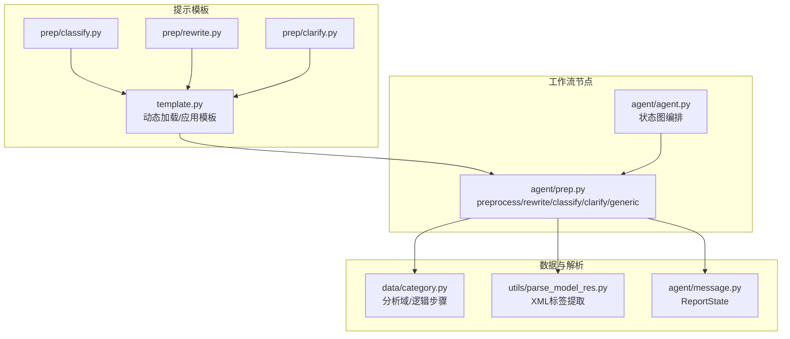
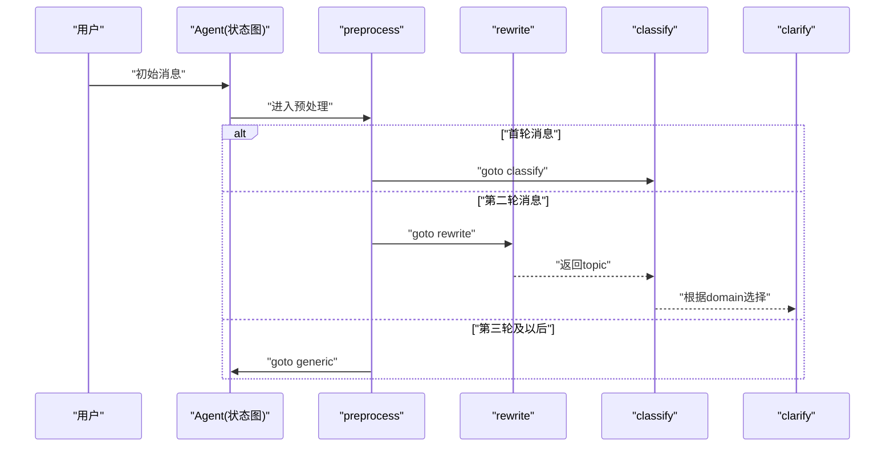
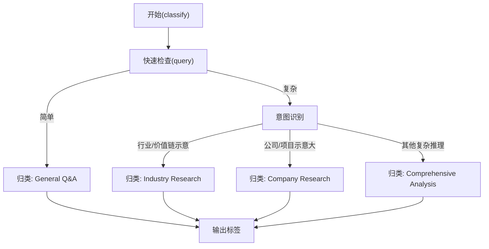
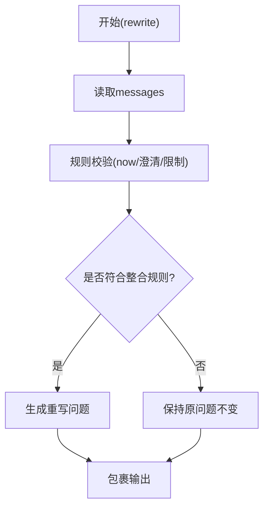
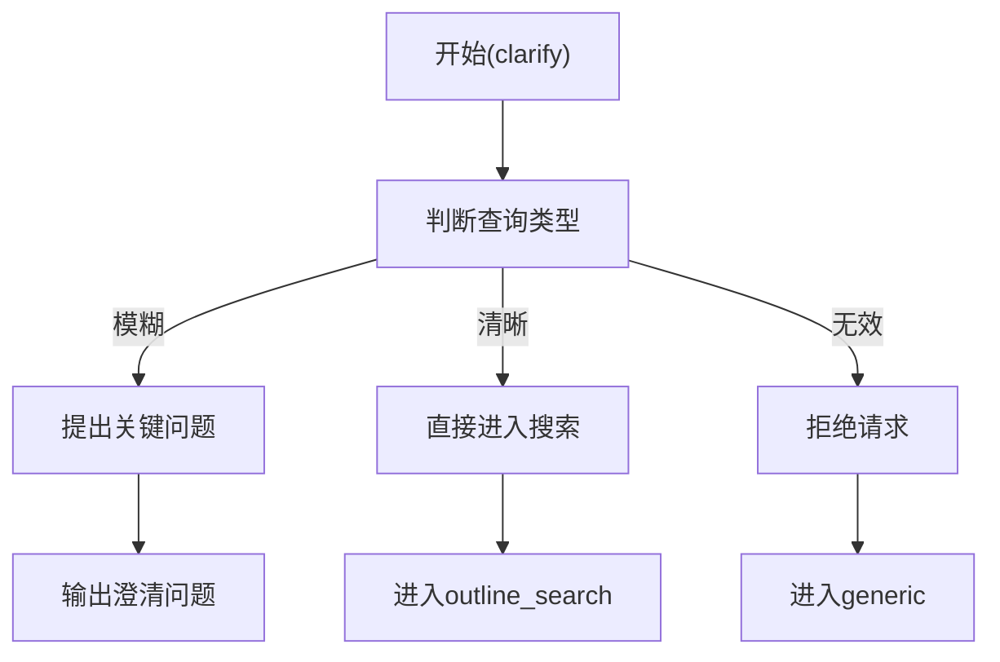
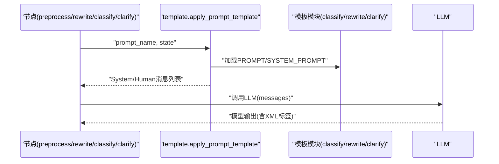
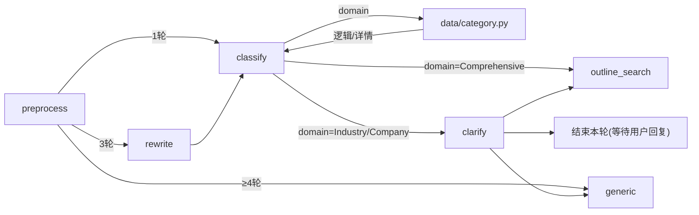
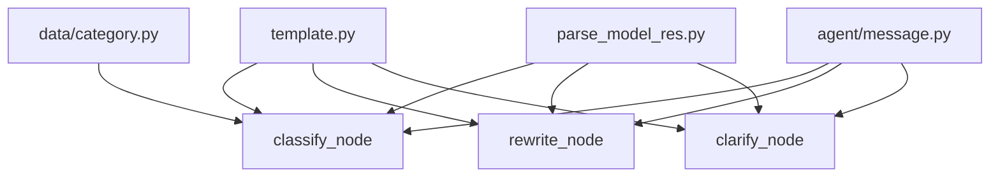

# 预处理模板分类

<cite>
**本文引用的文件**
- [src/deepresearch/prompts/prep/classify.py](file://src/deepresearch/prompts/prep/classify.py)
- [src/deepresearch/prompts/prep/rewrite.py](file://src/deepresearch/prompts/prep/rewrite.py)
- [src/deepresearch/prompts/prep/clarify.py](file://src/deepresearch/prompts/prep/clarify.py)
- [src/deepresearch/prompts/template.py](file://src/deepresearch/prompts/template.py)
- [src/deepresearch/agent/prep.py](file://src/deepresearch/agent/prep.py)
- [src/deepresearch/data/category.py](file://src/deepresearch/data/category.py)
- [src/deepresearch/utils/parse_model_res.py](file://src/deepresearch/utils/parse_model_res.py)
- [src/deepresearch/agent/message.py](file://src/deepresearch/agent/message.py)
- [src/deepresearch/agent/agent.py](file://src/deepresearch/agent/agent.py)
- [config/workflow.toml](file://config/workflow.toml)
- [src/deepresearch/config/workflow_config.py](file://src/deepresearch/config/workflow_config.py)
- [tests/unit/prompts/test_template.py](file://tests/unit/prompts/test_template.py)
- [tests/unit/agent/test_agent.py](file://tests/unit/agent/test_agent.py)
</cite>

## 目录
1. [简介](#简介)
2. [项目结构](#项目结构)
3. [核心组件](#核心组件)
4. [架构总览](#架构总览)
5. [详细组件分析](#详细组件分析)
6. [依赖分析](#依赖分析)
7. [性能考虑](#性能考虑)
8. [故障排查指南](#故障排查指南)
9. [结论](#结论)
10. [附录](#附录)

## 简介
本文件聚焦“预处理模板分类”，系统性阐述 DeepResearch 预处理阶段的三个核心模板：classify（分类）、rewrite（重写）、clarify（澄清）。我们将从功能定位、工作机制、输入参数、处理逻辑、输出格式与典型场景出发，结合数据流转与节点依赖关系，帮助开发者理解预处理在整体工作流中的关键作用。

## 项目结构
预处理模板位于 prompts/prep 目录，模板加载与应用由 prompts/template.py 提供；实际工作流节点在 agent/prep.py 中实现；分析域与逻辑步骤由 data/category.py 管理；消息状态结构定义于 agent/message.py；工作流编排在 agent/agent.py 中完成。

图表来源
- [src/deepresearch/prompts/prep/classify.py:1-48](file://src/deepresearch/prompts/prep/classify.py#L1-L48)
- [src/deepresearch/prompts/prep/rewrite.py:1-25](file://src/deepresearch/prompts/prep/rewrite.py#L1-L25)
- [src/deepresearch/prompts/prep/clarify.py:1-57](file://src/deepresearch/prompts/prep/clarify.py#L1-L57)
- [src/deepresearch/prompts/template.py:1-166](file://src/deepresearch/prompts/template.py#L1-L166)
- [src/deepresearch/agent/prep.py:1-202](file://src/deepresearch/agent/prep.py#L1-L202)
- [src/deepresearch/data/category.py:1-123](file://src/deepresearch/data/category.py#L1-L123)
- [src/deepresearch/utils/parse_model_res.py:1-32](file://src/deepresearch/utils/parse_model_res.py#L1-L32)
- [src/deepresearch/agent/message.py:1-112](file://src/deepresearch/agent/message.py#L1-L112)
- [src/deepresearch/agent/agent.py:1-44](file://src/deepresearch/agent/agent.py#L1-L44)

章节来源
- [src/deepresearch/prompts/template.py:1-166](file://src/deepresearch/prompts/template.py#L1-L166)
- [src/deepresearch/agent/agent.py:19-44](file://src/deepresearch/agent/agent.py#L19-L44)

## 核心组件
- classify 分类模板：对用户查询进行意图与领域识别，输出单一领域标签，作为后续分析路径选择依据。
- rewrite 重写模板：基于完整对话历史整合并重写用户意图，生成清晰、可直接使用的最终问题表述。
- clarify 澄清模板：针对模糊或宽泛的输入，提出不超过三条关键问题以明确时间、区域、受众、偏好等维度。

章节来源
- [src/deepresearch/prompts/prep/classify.py:9-47](file://src/deepresearch/prompts/prep/classify.py#L9-L47)
- [src/deepresearch/prompts/prep/rewrite.py:9-24](file://src/deepresearch/prompts/prep/rewrite.py#L9-L24)
- [src/deepresearch/prompts/prep/clarify.py:10-56](file://src/deepresearch/prompts/prep/clarify.py#L10-L56)

## 架构总览
预处理工作流在 LangGraph 状态图中执行，按消息轮次自动分流到不同节点：preprocess → rewrite → classify → clarify → outline_search → outline → learning → generate → save_local。其中 rewrite 与 classify 是关键分叉点，决定是否进入澄清或直接生成大纲。

图表来源
- [src/deepresearch/agent/agent.py:19-44](file://src/deepresearch/agent/agent.py#L19-L44)
- [src/deepresearch/agent/prep.py:21-80](file://src/deepresearch/agent/prep.py#L21-L80)

## 详细组件分析

### classify 分类模板
- 功能定位：将用户查询映射到三大分析域之一，确保后续分析路径与资源匹配。
- 输入参数
  - query：用户输入文本
- 处理逻辑
  - 快速检查：简单查询归入“General Q&A”
  - 意图识别：行业/公司层面归入对应域；复杂推理任务归入“Comprehensive Analysis”
  - 不确定时默认归类为“Comprehensive Analysis”
- 输出格式
  - 使用 XML 标签包裹的单一领域标签
- 典型场景
  - 行业研究：政策影响、产业链分析、市场格局
  - 公司研究：竞争地位、财务质量、业务模型
  - 综合分析：战略规划、评估预测、方案设计
- 与工作流的衔接
  - classify 成功后，根据 domain 获取分析逻辑与细节，决定是否进入 clarify 或直接 outline_search

图表来源
- [src/deepresearch/prompts/prep/classify.py:27-44](file://src/deepresearch/prompts/prep/classify.py#L27-L44)
- [src/deepresearch/agent/prep.py:105-150](file://src/deepresearch/agent/prep.py#L105-L150)
- [src/deepresearch/data/category.py:31-103](file://src/deepresearch/data/category.py#L31-L103)

章节来源
- [src/deepresearch/prompts/prep/classify.py:9-47](file://src/deepresearch/prompts/prep/classify.py#L9-L47)
- [src/deepresearch/agent/prep.py:105-150](file://src/deepresearch/agent/prep.py#L105-L150)
- [src/deepresearch/data/category.py:31-103](file://src/deepresearch/data/category.py#L31-L103)

### rewrite 重写模板
- 功能定位：将多轮对话中的意图整合为一条清晰、完整、可直接用于检索的最终问题。
- 输入参数
  - now：当前时间（用于时效性更新）
  - messages：完整的对话历史（含用户与助手消息）
- 处理逻辑
  - 综合整合：将原始问题与所有澄清、限制、新增细节合并
  - 忠实表达：仅保留用户明确给出的信息，不臆测
  - 结构清晰：确保重写后的语句逻辑连贯、无歧义
  - 特殊情况：若澄清为开放性（如“都行”、“不限”），保持原问题不变
- 输出格式
  - 使用 XML 标签包裹的最终重写问题
- 典型场景
  - 用户先提出宽泛主题，再逐步补充时间范围、地域范围、分析重点
  - 需要结合上下文生成面向检索的精确问法
- 与工作流的衔接
  - rewrite 成功后更新 topic，随后进入 classify

图表来源
- [src/deepresearch/prompts/prep/rewrite.py:9-24](file://src/deepresearch/prompts/prep/rewrite.py#L9-L24)
- [src/deepresearch/agent/prep.py:82-102](file://src/deepresearch/agent/prep.py#L82-L102)

章节来源
- [src/deepresearch/prompts/prep/rewrite.py:9-24](file://src/deepresearch/prompts/prep/rewrite.py#L9-L24)
- [src/deepresearch/agent/prep.py:82-102](file://src/deepresearch/agent/prep.py#L82-L102)

### clarify 澄清模板
- 功能定位：对模糊或宽泛的输入提出精准的三选一/二问题，一次性明确关键边界条件。
- 输入参数
  - query：当前 topic
  - now：当前时间
- 处理逻辑
  - 查询类型判断：模糊 → <confirm>；清晰 → <query>；无效 → <reject>
  - 明确澄清维度：时间、区域、受众、偏好、其他（如上下游、因果链、基准）
  - 输出规范：最多三条问题，每条含2–3个选项，示例简述
- 输出格式
  - <confirm> 包裹澄清问题，或 <query> 直接进入正式响应，或 <reject> 拒绝
- 典型场景
  - “某政策对市场的影响” → 明确具体市场类别、时间窗口、是否包含历史案例
- 与工作流的衔接
  - 若返回 <query>，直接进入 outline_search；若返回 <confirm>，将问题写回状态并结束本轮，等待用户回复后再继续

图表来源
- [src/deepresearch/prompts/prep/clarify.py:10-56](file://src/deepresearch/prompts/prep/clarify.py#L10-L56)
- [src/deepresearch/agent/prep.py:153-181](file://src/deepresearch/agent/prep.py#L153-L181)

章节来源
- [src/deepresearch/prompts/prep/clarify.py:10-56](file://src/deepresearch/prompts/prep/clarify.py#L10-L56)
- [src/deepresearch/agent/prep.py:153-181](file://src/deepresearch/agent/prep.py#L153-L181)

### 模板加载与应用机制
- prompts/template.py
  - 动态扫描 prep 目录，导入模块并提取 PROMPT 与 SYSTEM_PROMPT
  - apply_prompt_template 支持变量注入与消息拼装，支持在 state 中携带 messages 进行追加
- 在 agent/prep.py 中，各节点按需调用 apply_prompt_template 并传入相应 state

图表来源
- [src/deepresearch/prompts/template.py:25-129](file://src/deepresearch/prompts/template.py#L25-L129)
- [src/deepresearch/agent/prep.py:82-181](file://src/deepresearch/agent/prep.py#L82-L181)

章节来源
- [src/deepresearch/prompts/template.py:25-129](file://src/deepresearch/prompts/template.py#L25-L129)
- [src/deepresearch/agent/prep.py:82-181](file://src/deepresearch/agent/prep.py#L82-L181)

### 数据流转与节点依赖
- preprocess：根据消息轮次决定走向
  - 1轮：直接进入 classify
  - 3轮：进入 rewrite
  - 3轮以上：进入 generic
- classify：根据 domain 获取分析逻辑与细节，决定是否进入 clarify 或 outline_search
- clarify：根据输出分支决定后续流程
- 与分析域的耦合：domain 通过 data/category.py 的映射提供逻辑步骤与详细内容

图表来源
- [src/deepresearch/agent/prep.py:21-181](file://src/deepresearch/agent/prep.py#L21-L181)
- [src/deepresearch/data/category.py:31-103](file://src/deepresearch/data/category.py#L31-L103)

章节来源
- [src/deepresearch/agent/prep.py:21-181](file://src/deepresearch/agent/prep.py#L21-L181)
- [src/deepresearch/data/category.py:31-103](file://src/deepresearch/data/category.py#L31-L103)

## 依赖分析
- 模板依赖
  - classify/rewrite/clarify 均依赖 prompts/template.py 的动态加载与应用
- 解析依赖
  - agent/prep.py 使用 utils/parse_model_res.py 提取 XML 标签内容
- 数据依赖
  - classify 后通过 data/category.py 获取分析逻辑与细节
- 状态依赖
  - 所有节点共享 agent/message.py 中的 ReportState 字段（topic、domain、logic、details、messages 等）

图表来源
- [src/deepresearch/prompts/template.py:25-129](file://src/deepresearch/prompts/template.py#L25-L129)
- [src/deepresearch/utils/parse_model_res.py:13-27](file://src/deepresearch/utils/parse_model_res.py#L13-L27)
- [src/deepresearch/data/category.py:74-103](file://src/deepresearch/data/category.py#L74-L103)
- [src/deepresearch/agent/message.py:101-112](file://src/deepresearch/agent/message.py#L101-L112)

章节来源
- [src/deepresearch/prompts/template.py:25-129](file://src/deepresearch/prompts/template.py#L25-L129)
- [src/deepresearch/utils/parse_model_res.py:13-27](file://src/deepresearch/utils/parse_model_res.py#L13-L27)
- [src/deepresearch/data/category.py:74-103](file://src/deepresearch/data/category.py#L74-L103)
- [src/deepresearch/agent/message.py:101-112](file://src/deepresearch/agent/message.py#L101-L112)

## 性能考虑
- 模板加载策略
  - prompts/template.py 采用惰性加载，首次访问时扫描目录并缓存结果，避免重复 IO
- 模型调用
  - 预处理节点均设置非流式调用，减少流式输出带来的额外开销
- 歧义处理
  - 通过 clarify 一次性收集关键边界，降低后续检索与分析的无效往返
- 配置参数
  - workflow.toml 中的 topN 控制检索召回数量，影响下游学习与生成阶段的输入规模

章节来源
- [src/deepresearch/prompts/template.py:78-87](file://src/deepresearch/prompts/template.py#L78-L87)
- [src/deepresearch/agent/prep.py:84-94](file://src/deepresearch/agent/prep.py#L84-L94)
- [config/workflow.toml:1-3](file://config/workflow.toml#L1-L3)
- [src/deepresearch/config/workflow_config.py:7-27](file://src/deepresearch/config/workflow_config.py#L7-L27)

## 故障排查指南
- 模板变量缺失
  - apply_prompt_template 在变量缺失时抛出异常，检查 state 是否包含所需键（如 query、messages、now）
- XML 标签未命中
  - parse_model_res.extract_xml_content 返回空时，节点会回退到安全策略（如使用拼接的对话串作为 topic）
- 分类域无效
  - get_analysis_data 对非法标签抛出异常；若 classify 未返回有效标签，节点会回退至 generic
- 流式输出与单元测试
  - 单元测试覆盖了节点返回值类型与字段存在性，便于定位问题

章节来源
- [src/deepresearch/prompts/template.py:114-127](file://src/deepresearch/prompts/template.py#L114-L127)
- [src/deepresearch/utils/parse_model_res.py:13-27](file://src/deepresearch/utils/parse_model_res.py#L13-L27)
- [src/deepresearch/data/category.py:94-103](file://src/deepresearch/data/category.py#L94-L103)
- [tests/unit/prompts/test_template.py:28-56](file://tests/unit/prompts/test_template.py#L28-L56)
- [tests/unit/agent/test_agent.py:122-170](file://tests/unit/agent/test_agent.py#L122-L170)

## 结论
预处理模板通过“分类-重写-澄清”的递进式设计，将模糊或宽泛的用户意图转化为可检索、可分析、可执行的结构化问题。classify 提供领域锚定，rewrite 强化问题质量，clarify 明确边界条件。配合惰性模板加载、XML 标签解析与状态图编排，预处理在整体工作流中承担“入口治理”的关键角色，显著提升后续检索、大纲生成与报告产出的质量与效率。

## 附录
- 使用模式建议
  - 仅一轮消息：直接进入 classify，适合明确且聚焦的问题
  - 多轮交互：先 rewrite 再 classify，最后根据 domain 与 clarify 结果决定是否进入 outline_search
  - 无效/闲聊：进入 generic，避免浪费资源
- 配置参考
  - workflow.toml 中的 topN 影响检索深度与召回规模
  - llms.toml 中的 llm_type（basic/clarify 等）决定节点调用的模型类型

章节来源
- [src/deepresearch/agent/prep.py:21-181](file://src/deepresearch/agent/prep.py#L21-L181)
- [config/workflow.toml:1-3](file://config/workflow.toml#L1-L3)
- [src/deepresearch/config/workflow_config.py:7-27](file://src/deepresearch/config/workflow_config.py#L7-L27)