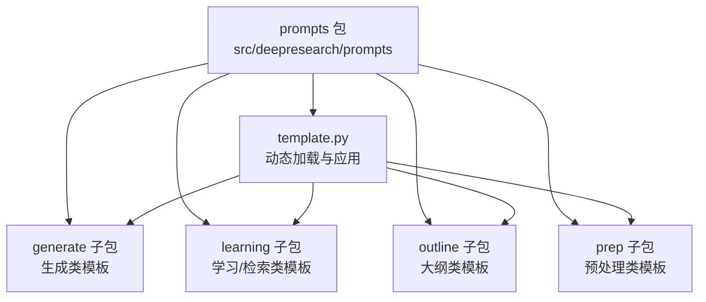
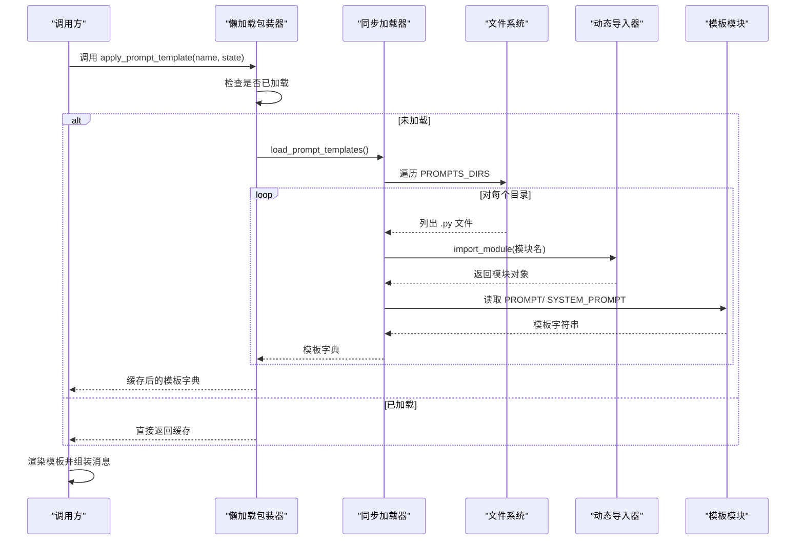
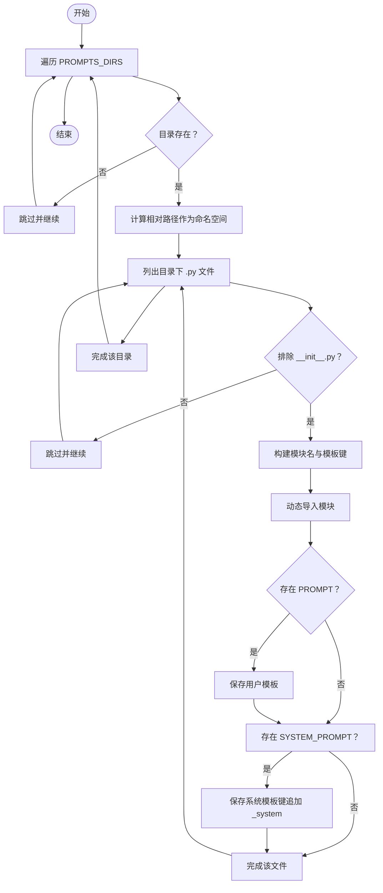
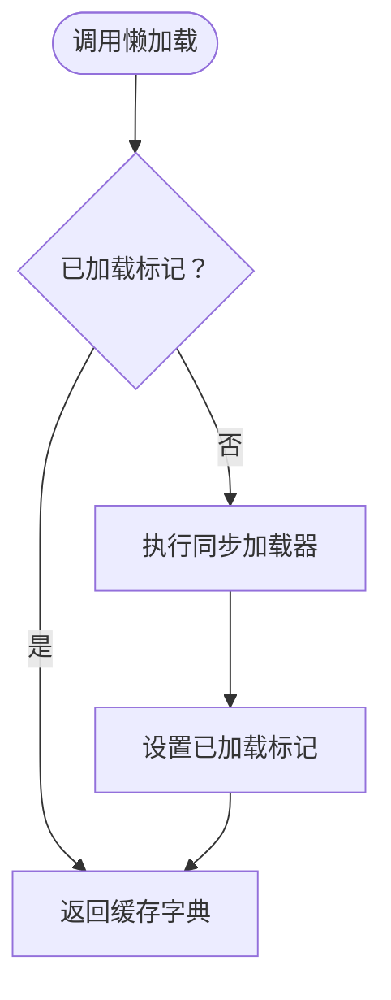
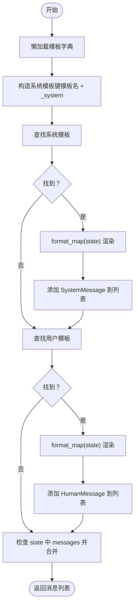
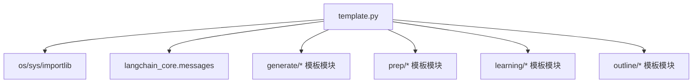

# 模板加载机制

<cite>
**本文引用的文件**
- [src/deepresearch/prompts/template.py](file://src/deepresearch/prompts/template.py)
- [src/deepresearch/prompts/__init__.py](file://src/deepresearch/prompts/__init__.py)
- [src/deepresearch/prompts/generate/generate.py](file://src/deepresearch/prompts/generate/generate.py)
- [src/deepresearch/prompts/prep/classify.py](file://src/deepresearch/prompts/prep/classify.py)
- [src/deepresearch/prompts/learning/research_query.py](file://src/deepresearch/prompts/learning/research_query.py)
- [tests/unit/prompts/test_template.py](file://tests/unit/prompts/test_template.py)
</cite>

## 目录
1. [简介](#简介)
2. [项目结构](#项目结构)
3. [核心组件](#核心组件)
4. [架构总览](#架构总览)
5. [详细组件分析](#详细组件分析)
6. [依赖分析](#依赖分析)
7. [性能考虑](#性能考虑)
8. [故障排查指南](#故障排查指南)
9. [结论](#结论)
10. [附录](#附录)

## 简介
本文件系统性阐述DeepResearch中“模板加载机制”的设计与实现，重点覆盖以下方面：
- 动态模板加载：通过扫描指定目录、动态导入模块并提取模板变量的完整流程
- 键名生成规则：相对路径与文件基名组合为“命名空间/模板名”的键值
- 命名空间隔离：按子目录划分命名空间，避免键冲突
- 懒加载策略：首次使用时才加载模板，减少启动开销
- 错误处理与调试：模块导入异常捕获、缺失变量提示与常见问题定位方法

## 项目结构
模板相关代码集中在prompts包内，核心入口为template.py，配套模板文件位于generate、learning、outline、prep等子目录下；对外通过__init__.py导出应用接口。

图表来源
- [src/deepresearch/prompts/template.py](file://src/deepresearch/prompts/template.py)
- [src/deepresearch/prompts/__init__.py](file://src/deepresearch/prompts/__init__.py)

章节来源
- [src/deepresearch/prompts/template.py](file://src/deepresearch/prompts/template.py)
- [src/deepresearch/prompts/__init__.py](file://src/deepresearch/prompts/__init__.py)

## 核心组件
- PROMPTS_DIRS：定义模板目录集合，包含generate、learning、outline、prep四个子目录
- load_prompt_templates()：同步加载所有模板，返回键值映射
- load_prompt_templates_lazy()：懒加载包装器，首次调用时执行一次性加载
- apply_prompt_template()：根据模板名与状态字典渲染消息列表，支持系统消息与用户消息
- 模块命名与键名生成：基于相对路径与文件基名构造模块名与模板键

章节来源
- [src/deepresearch/prompts/template.py](file://src/deepresearch/prompts/template.py)

## 架构总览
模板加载的整体流程如下：

图表来源
- [src/deepresearch/prompts/template.py](file://src/deepresearch/prompts/template.py)

## 详细组件分析

### 动态模板加载器：load_prompt_templates()
- 扫描范围：遍历PROMPTS_DIRS中的每个目录
- 过滤规则：仅处理.py文件且排除__init__.py
- 模块命名：相对当前目录的路径替换分隔符为点号，拼接文件基名为模块名
- 键名生成：相对路径以斜杠连接文件基名为模板键
- 变量提取：优先读取PROMPT；若存在SYSTEM_PROMPT则额外生成“模板键_system”的系统模板键
- 异常处理：捕获导入与运行时异常并打印错误信息，保证其他模板正常加载

图表来源
- [src/deepresearch/prompts/template.py](file://src/deepresearch/prompts/template.py)

章节来源
- [src/deepresearch/prompts/template.py](file://src/deepresearch/prompts/template.py)

### 懒加载器：load_prompt_templates_lazy()
- 设计目标：首次访问时才进行全量加载，后续直接复用缓存
- 实现要点：全局字典存储结果与加载标记位，仅在标记为未加载时执行一次加载
- 性能收益：避免应用启动时不必要的IO与导入开销，按需触发

图表来源
- [src/deepresearch/prompts/template.py](file://src/deepresearch/prompts/template.py)

章节来源
- [src/deepresearch/prompts/template.py](file://src/deepresearch/prompts/template.py)

### 模板应用器：apply_prompt_template()
- 输入：模板键（如命名空间/模板名）、状态字典（包含渲染变量）
- 处理流程：
  - 先尝试读取“模板键_system”对应的系统模板，成功则渲染后加入消息列表
  - 再读取模板键对应的用户模板，成功则渲染后加入消息列表
  - 若状态字典中存在“messages”，将其拼接到最终结果末尾
- 错误处理：当模板变量缺失导致格式化失败时抛出明确的ValueError，便于定位问题

图表来源
- [src/deepresearch/prompts/template.py](file://src/deepresearch/prompts/template.py)

章节来源
- [src/deepresearch/prompts/template.py](file://src/deepresearch/prompts/template.py)

### 模板文件示例与变量约定
- generate/generate.py：包含SYSTEM_PROMPT与PROMPT，用于报告生成场景
- prep/classify.py：包含PROMPT，用于意图分类场景
- learning/research_query.py：包含PROMPT，用于搜索查询优化场景

章节来源
- [src/deepresearch/prompts/generate/generate.py](file://src/deepresearch/prompts/generate/generate.py)
- [src/deepresearch/prompts/prep/classify.py](file://src/deepresearch/prompts/prep/classify.py)
- [src/deepresearch/prompts/learning/research_query.py](file://src/deepresearch/prompts/learning/research_query.py)

### 单元测试要点
- 验证load_prompt_templates()与load_prompt_templates_lazy()返回非空字典
- 验证apply_prompt_template()对多个模板键的渲染能力
- 验证消息列表的类型与长度

章节来源
- [tests/unit/prompts/test_template.py](file://tests/unit/prompts/test_template.py)

## 依赖分析
- 模块耦合
  - template.py内部依赖标准库（os、sys、importlib）与第三方库（langchain_core消息类型）
  - 模板模块之间无显式依赖，通过键名约定进行解耦
- 导入路径
  - 通过将当前目录插入sys.path，确保动态导入能够解析相对模块名
- 命名空间隔离
  - 不同子目录对应不同命名空间，模板键采用“命名空间/模板名”的形式，天然避免键冲突

图表来源
- [src/deepresearch/prompts/template.py](file://src/deepresearch/prompts/template.py)

章节来源
- [src/deepresearch/prompts/template.py](file://src/deepresearch/prompts/template.py)

## 性能考虑
- 启动时延：懒加载显著降低首次启动的IO与导入成本
- 内存占用：模板内容以字符串形式缓存，占用与模板数量及大小成正比
- IO开销：目录扫描与模块导入为O(N)复杂度，N为模板文件数
- 建议
  - 将常用模板置于靠近项目根部的目录，减少相对路径层级
  - 控制模板体积，避免超大文本影响内存与序列化成本
  - 如需热更新，可提供刷新缓存的接口或重启进程

## 故障排查指南
- 目录不存在
  - 现象：出现“目录未找到”的警告
  - 排查：确认PROMPTS_DIRS中各目录路径正确且存在
- 模块导入失败
  - 现象：打印“导入模块时发生错误”的提示
  - 排查：检查模板模块语法、依赖第三方库是否可用、模块名与文件名是否一致
- 变量缺失导致格式化异常
  - 现象：抛出“缺少变量”的ValueError
  - 排查：核对模板中使用的占位符是否在state中提供，注意大小写与拼写
- 键名不匹配
  - 现象：找不到模板
  - 排查：确认模板键为“命名空间/模板名”，命名空间来自相对路径，模板名来自文件基名
- 调试技巧
  - 在load_prompt_templates()中临时打印模块名与键名，验证命名规则
  - 使用最小state进行单测，逐步增加变量定位缺失项
  - 通过单元测试覆盖多模板键，确保懒加载缓存一致性

章节来源
- [src/deepresearch/prompts/template.py](file://src/deepresearch/prompts/template.py)
- [tests/unit/prompts/test_template.py](file://tests/unit/prompts/test_template.py)

## 结论
模板加载机制通过“目录扫描 + 动态导入 + 键名约定 + 懒加载”实现了高扩展、低耦合与易维护的模板体系。命名空间隔离与统一的变量注入接口，使得新增模板无需修改核心逻辑即可无缝接入；懒加载策略在保证功能完整性的同时兼顾了启动性能。建议在团队内统一模板变量命名规范与文档注释，持续提升可维护性与可测试性。

## 附录
- 键名生成规则
  - 命名空间：相对当前目录的子目录路径，斜杠分隔
  - 模板名：去掉.py后缀的文件基名
  - 最终键：命名空间/模板名
- 系统模板键
  - 在上述键基础上追加“_system”作为系统模板键
- 模块命名规则
  - 相对路径中的分隔符替换为点号，拼接文件基名构成模块名
- 导出接口
  - 通过prompts/__init__.py对外暴露apply_prompt_template

章节来源
- [src/deepresearch/prompts/template.py](file://src/deepresearch/prompts/template.py)
- [src/deepresearch/prompts/__init__.py](file://src/deepresearch/prompts/__init__.py)