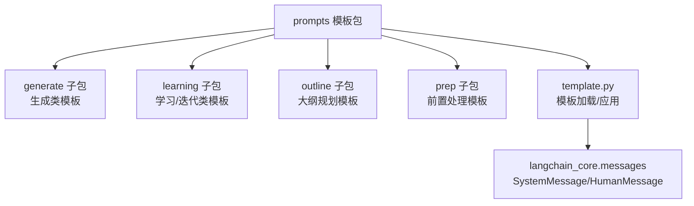
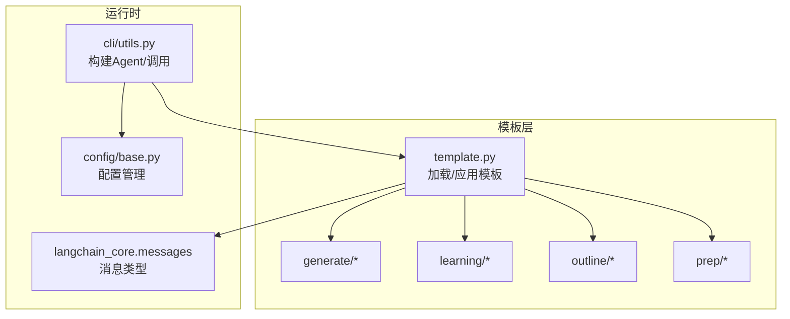
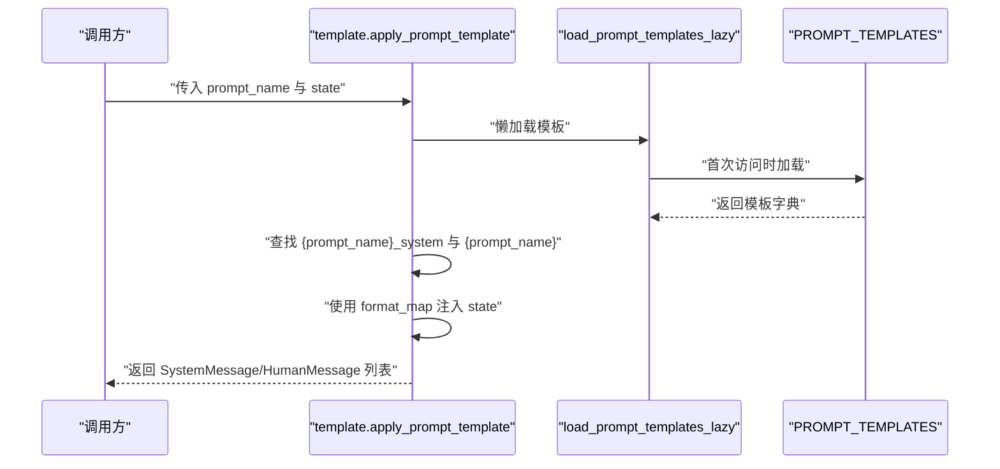
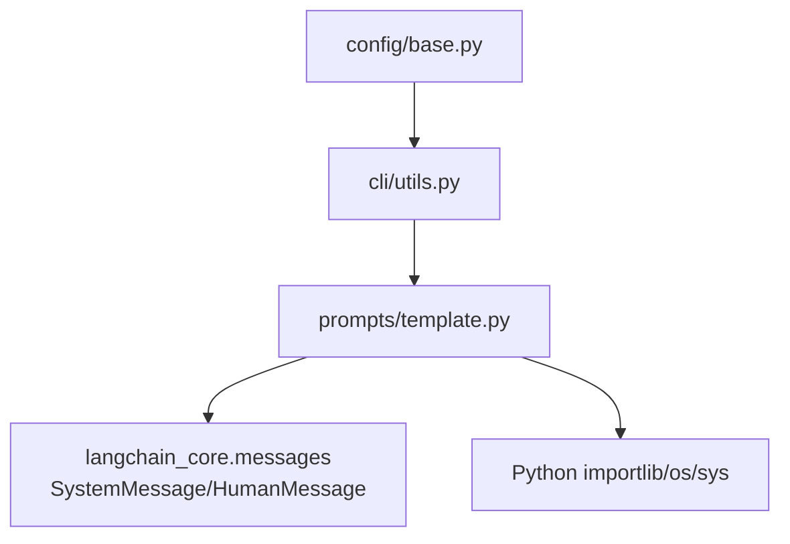
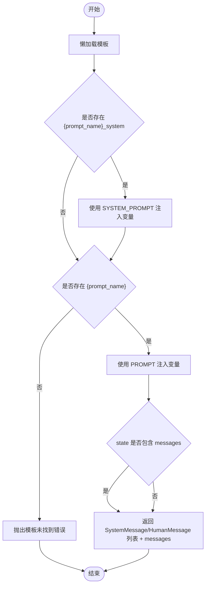
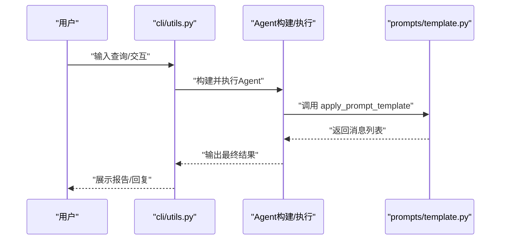

# 模板定制指南

<cite>
**本文引用的文件**
- [src/deepresearch/prompts/template.py](file://src/deepresearch/prompts/template.py)
- [src/deepresearch/prompts/__init__.py](file://src/deepresearch/prompts/__init__.py)
- [src/deepresearch/prompts/generate/generate.py](file://src/deepresearch/prompts/generate/generate.py)
- [src/deepresearch/prompts/generate/chart.py](file://src/deepresearch/prompts/generate/chart.py)
- [src/deepresearch/prompts/learning/research_query.py](file://src/deepresearch/prompts/learning/research_query.py)
- [src/deepresearch/prompts/learning/draft.py](file://src/deepresearch/prompts/learning/draft.py)
- [src/deepresearch/prompts/outline/outline.py](file://src/deepresearch/prompts/outline/outline.py)
- [src/deepresearch/prompts/prep/classify.py](file://src/deepresearch/prompts/prep/classify.py)
- [tests/unit/prompts/test_template.py](file://tests/unit/prompts/test_template.py)
- [src/deepresearch/cli/utils.py](file://src/deepresearch/cli/utils.py)
- [src/deepresearch/config/base.py](file://src/deepresearch/config/base.py)
- [config/workflow.toml](file://config/workflow.toml)
- [README.md](file://README.md)
- [doc/intro.md](file://doc/intro.md)
</cite>

## 目录
1. [引言](#引言)
2. [项目结构](#项目结构)
3. [核心组件](#核心组件)
4. [架构总览](#架构总览)
5. [详细组件分析](#详细组件分析)
6. [依赖分析](#依赖分析)
7. [性能考量](#性能考量)
8. [故障排查指南](#故障排查指南)
9. [结论](#结论)
10. [附录](#附录)

## 引言
本指南面向需要在DeepResearch中进行模板定制开发的工程师与研究者，系统讲解模板编写规范、变量命名约定、格式化语法、继承与扩展机制、调试与测试方法、性能优化策略、版本管理与兼容性考虑以及部署最佳实践。通过深入剖析模板系统实现与现有模板样例，帮助读者快速上手并安全地扩展模板体系。

## 项目结构
DeepResearch的模板系统位于src/deepresearch/prompts目录下，采用“按功能域分组”的模块化组织方式：
- generate：生成类模板（如报告正文、图表）
- learning：学习/迭代类模板（如草稿、查询优化、评估）
- outline：大纲规划模板
- prep：前置处理模板（如意图分类）
- template.py：模板加载、懒加载与应用的核心逻辑
- __init__.py：对外暴露模板应用接口

**图示来源**
- [src/deepresearch/prompts/template.py:1-166](file://src/deepresearch/prompts/template.py#L1-L166)
- [src/deepresearch/prompts/__init__.py:1-9](file://src/deepresearch/prompts/__init__.py#L1-L9)

**章节来源**
- [src/deepresearch/prompts/template.py:11-17](file://src/deepresearch/prompts/template.py#L11-L17)
- [src/deepresearch/prompts/__init__.py:4-8](file://src/deepresearch/prompts/__init__.py#L4-L8)

## 核心组件
- 模板加载与懒加载：扫描指定目录，动态导入模块，提取PROMPT与SYSTEM_PROMPT变量，构建模板字典；首次使用时才加载，避免启动开销。
- 模板应用：根据模板名查找用户模板与系统模板（若存在），使用format_map注入state中的变量，返回SystemMessage与HumanMessage序列。
- 接口导出：通过prompts包的__init__.py对外暴露apply_prompt_template。

关键行为与约束：
- 模板键命名：采用“子包名/文件名”的形式；系统模板键为“{模板名}_system”。
- 变量注入：使用format_map进行安全注入，缺失变量会抛出异常，便于早期发现配置错误。
- 消息拼接：若state中包含messages键，则将其追加到返回消息列表末尾。

**章节来源**
- [src/deepresearch/prompts/template.py:25-70](file://src/deepresearch/prompts/template.py#L25-L70)
- [src/deepresearch/prompts/template.py:78-87](file://src/deepresearch/prompts/template.py#L78-L87)
- [src/deepresearch/prompts/template.py:90-129](file://src/deepresearch/prompts/template.py#L90-L129)
- [src/deepresearch/prompts/__init__.py:4-8](file://src/deepresearch/prompts/__init__.py#L4-L8)

## 架构总览
模板系统与CLI、配置管理的关系如下：

**图示来源**
- [src/deepresearch/prompts/template.py:1-166](file://src/deepresearch/prompts/template.py#L1-L166)
- [src/deepresearch/cli/utils.py:106-193](file://src/deepresearch/cli/utils.py#L106-L193)
- [src/deepresearch/config/base.py:374-456](file://src/deepresearch/config/base.py#L374-L456)

## 详细组件分析

### 模板加载与应用流程
模板加载与应用的关键步骤如下：

**图示来源**
- [src/deepresearch/prompts/template.py:78-87](file://src/deepresearch/prompts/template.py#L78-L87)
- [src/deepresearch/prompts/template.py:90-129](file://src/deepresearch/prompts/template.py#L90-L129)

**章节来源**
- [src/deepresearch/prompts/template.py:78-129](file://src/deepresearch/prompts/template.py#L78-L129)

### 模板变量与格式化语法
- 变量来源：state字典中的键值，通过format_map注入到模板字符串。
- 系统模板：当存在“{prompt_name}_system”键时，自动作为SystemMessage注入。
- 缺失变量：format_map在遇到未提供的变量时会抛出异常，便于定位问题。
- 模板命名：模板名由“子包名/文件名”构成，例如“generate/generate”、“prep/classify”。

**章节来源**
- [src/deepresearch/prompts/template.py:58-65](file://src/deepresearch/prompts/template.py#L58-L65)
- [src/deepresearch/prompts/template.py:114-126](file://src/deepresearch/prompts/template.py#L114-L126)

### 模板继承与扩展机制
- 目录扫描：PROMPTS_DIRS列出generate、learning、outline、prep四个目录，动态导入其中的Python模块。
- 模块命名：相对路径与模块名映射规则为“相对根.子包.文件名”，确保导入正确。
- 新增模板：在对应子包下新增Python文件，导出PROMPT与可选的SYSTEM_PROMPT，即可被自动发现与加载。
- 自定义模板目录：当前实现固定扫描四个子包目录。若需扩展新的模板目录，可在模板加载逻辑中增加新目录路径（需同步更新模块导入路径计算）。

**章节来源**
- [src/deepresearch/prompts/template.py:11-17](file://src/deepresearch/prompts/template.py#L11-L17)
- [src/deepresearch/prompts/template.py:43-52](file://src/deepresearch/prompts/template.py#L43-L52)

### 模板编写规范与命名约定
- 变量命名：遵循“小写+下划线”风格，语义清晰，避免与内置保留字冲突。
- 模板键：采用“子包名/文件名”，保证全局唯一且可读性强。
- 系统模板：若需要独立的系统提示词，导出SYSTEM_PROMPT变量，并通过“{prompt_name}_system”键使用。
- 输出格式：若模板要求特定JSON结构，应在模板中明确格式要求与示例，便于下游解析。

**章节来源**
- [src/deepresearch/prompts/generate/generate.py:15-65](file://src/deepresearch/prompts/generate/generate.py#L15-L65)
- [src/deepresearch/prompts/learning/research_query.py:50-56](file://src/deepresearch/prompts/learning/research_query.py#L50-L56)
- [src/deepresearch/prompts/learning/draft.py:31-38](file://src/deepresearch/prompts/learning/draft.py#L31-L38)

### 现有模板样例与用途
- 生成类模板
  - generate/generate：面向报告正文生成，强调事实准确、逻辑严谨、引用规范。
  - generate/chart：面向图表生成，要求严格依据参考材料生成ECharts配置。
- 学习/迭代类模板
  - learning/research_query：基于当前回答与评估结果生成补充搜索查询。
  - learning/draft：整合知识片段生成可溯源的综合回答。
- 规划类模板
  - outline/outline：生成Markdown格式的大纲，包含summary与thinking两部分。
- 前置处理模板
  - prep/classify：对用户查询进行意图分类，指导后续处理路径。

**章节来源**
- [src/deepresearch/prompts/generate/generate.py:1-103](file://src/deepresearch/prompts/generate/generate.py#L1-L103)
- [src/deepresearch/prompts/generate/chart.py:1-37](file://src/deepresearch/prompts/generate/chart.py#L1-L37)
- [src/deepresearch/prompts/learning/research_query.py:1-57](file://src/deepresearch/prompts/learning/research_query.py#L1-L57)
- [src/deepresearch/prompts/learning/draft.py:1-40](file://src/deepresearch/prompts/learning/draft.py#L1-L40)
- [src/deepresearch/prompts/outline/outline.py:1-68](file://src/deepresearch/prompts/outline/outline.py#L1-L68)
- [src/deepresearch/prompts/prep/classify.py:1-48](file://src/deepresearch/prompts/prep/classify.py#L1-L48)

### 模板调试与测试方法
- 单元测试：提供模板模块的单元测试，验证加载、懒加载与模板应用的基本行为。
- 调试建议：
  - 在调用apply_prompt_template前，先打印state中的变量，确认键名与类型。
  - 若出现变量缺失异常，检查模板键名与state键名是否一致。
  - 对于需要系统模板的场景，确认是否存在“{prompt_name}_system”对应的模板键。
- CLI集成：通过CLI交互或单次查询模式，观察最终输出是否符合预期，必要时开启更详细的日志。

**章节来源**
- [tests/unit/prompts/test_template.py:1-60](file://tests/unit/prompts/test_template.py#L1-L60)
- [src/deepresearch/cli/utils.py:106-193](file://src/deepresearch/cli/utils.py#L106-L193)

### 性能优化策略
- 懒加载：模板仅在首次使用时加载，避免启动时的IO与导入开销。
- 模板复用：将通用的系统提示词抽取为SYSTEM_PROMPT，减少重复文本。
- 变量最小化：仅注入模板实际使用的变量，降低format_map的匹配成本。
- 目录扫描优化：当前实现固定扫描四个子包目录；若模板数量较多，可考虑按需扫描或缓存扫描结果。

**章节来源**
- [src/deepresearch/prompts/template.py:78-87](file://src/deepresearch/prompts/template.py#L78-L87)
- [src/deepresearch/prompts/template.py:37-41](file://src/deepresearch/prompts/template.py#L37-L41)

### 版本管理与兼容性
- 版本管理：项目采用基于Git标签的动态版本管理，确保版本与代码状态一致。
- 兼容性考虑：
  - 模板键命名与模块导入路径需保持稳定，避免破坏性变更。
  - 新增模板时，尽量沿用既有变量命名与输出格式约定，提升兼容性。
  - 若需调整模板加载逻辑（如新增模板目录），应同步更新模块导入路径计算与错误处理。

**章节来源**
- [doc/intro.md:24-24](file://doc/intro.md#L24-L24)
- [src/deepresearch/prompts/template.py:43-52](file://src/deepresearch/prompts/template.py#L43-L52)

### 部署最佳实践
- 配置管理：通过配置管理器加载与合并配置，支持环境变量、文件与默认值的多层级覆盖。
- CLI参数：CLI支持自定义配置目录、主题、日志级别等参数，便于在不同环境中部署。
- 工作流配置：工作流相关参数可通过workflow.toml进行配置，影响搜索与生成的行为。

**章节来源**
- [src/deepresearch/config/base.py:536-589](file://src/deepresearch/config/base.py#L536-L589)
- [src/deepresearch/cli/utils.py:386-482](file://src/deepresearch/cli/utils.py#L386-L482)
- [config/workflow.toml:1-3](file://config/workflow.toml#L1-L3)

## 依赖分析
模板系统与外部依赖的关系如下：

**图示来源**
- [src/deepresearch/prompts/template.py:9-10](file://src/deepresearch/prompts/template.py#L9-L10)
- [src/deepresearch/prompts/template.py:4-7](file://src/deepresearch/prompts/template.py#L4-L7)
- [src/deepresearch/cli/utils.py:20-33](file://src/deepresearch/cli/utils.py#L20-L33)
- [src/deepresearch/config/base.py:374-456](file://src/deepresearch/config/base.py#L374-L456)

**章节来源**
- [src/deepresearch/prompts/template.py:1-166](file://src/deepresearch/prompts/template.py#L1-L166)
- [src/deepresearch/cli/utils.py:1-575](file://src/deepresearch/cli/utils.py#L1-L575)
- [src/deepresearch/config/base.py:1-590](file://src/deepresearch/config/base.py#L1-L590)

## 性能考量
- 模板加载：懒加载策略显著降低冷启动时间；建议在生产环境中避免频繁重载模板。
- 消息构造：使用format_map进行变量注入，性能优于正则替换；确保state结构简单明了。
- 并发与稳定性：结合CLI的异步执行与错误处理，确保在高并发场景下的稳定性。

[本节为通用性能建议，不直接分析具体文件]

## 故障排查指南
- 模板未找到：检查模板名是否为“子包名/文件名”，并确认SYSTEM_PROMPT键是否正确命名为“{prompt_name}_system”。
- 变量缺失：format_map会抛出异常，检查state中是否包含模板所需的全部键。
- 导入失败：确认模板文件位于预定义的四个子包目录内，且模块名与文件名一致。
- CLI执行错误：查看CLI的异常处理与日志输出，定位Agent执行过程中的问题。

**章节来源**
- [src/deepresearch/prompts/template.py:114-126](file://src/deepresearch/prompts/template.py#L114-L126)
- [src/deepresearch/cli/utils.py:147-192](file://src/deepresearch/cli/utils.py#L147-L192)
- [tests/unit/prompts/test_template.py:16-26](file://tests/unit/prompts/test_template.py#L16-L26)

## 结论
通过本指南，您可以：
- 正确编写与命名模板变量，遵循format_map的安全注入原则；
- 基于现有模板扩展新的功能域模板，并理解懒加载与导入机制；
- 使用单元测试与CLI模式进行调试与验证；
- 在性能、版本与部署层面采取最佳实践，确保模板系统的稳定与可维护性。

[本节为总结性内容，不直接分析具体文件]

## 附录

### 模板应用流程（算法流程图）

**图示来源**
- [src/deepresearch/prompts/template.py:78-129](file://src/deepresearch/prompts/template.py#L78-L129)

### CLI与模板应用的调用序列

**图示来源**
- [src/deepresearch/cli/utils.py:106-193](file://src/deepresearch/cli/utils.py#L106-L193)
- [src/deepresearch/prompts/template.py:90-129](file://src/deepresearch/prompts/template.py#L90-L129)