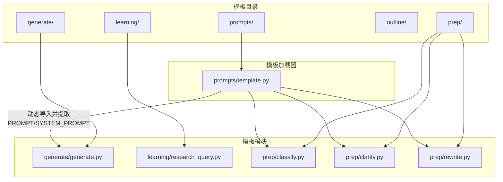
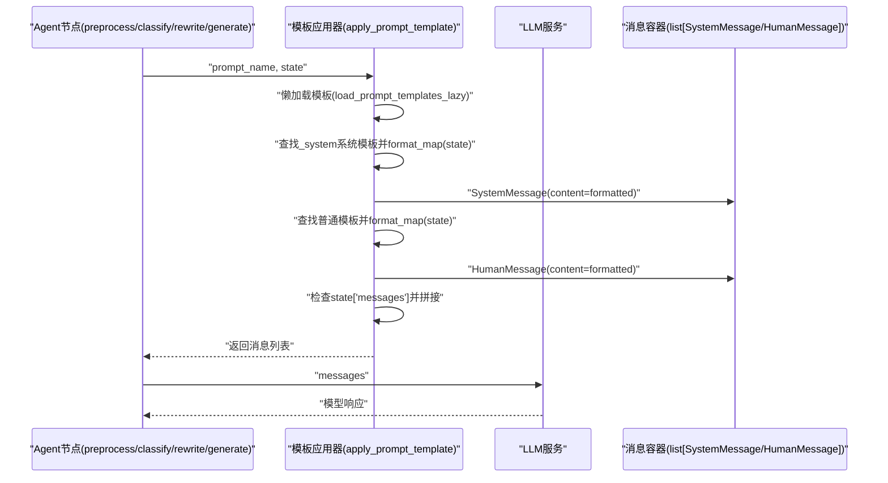
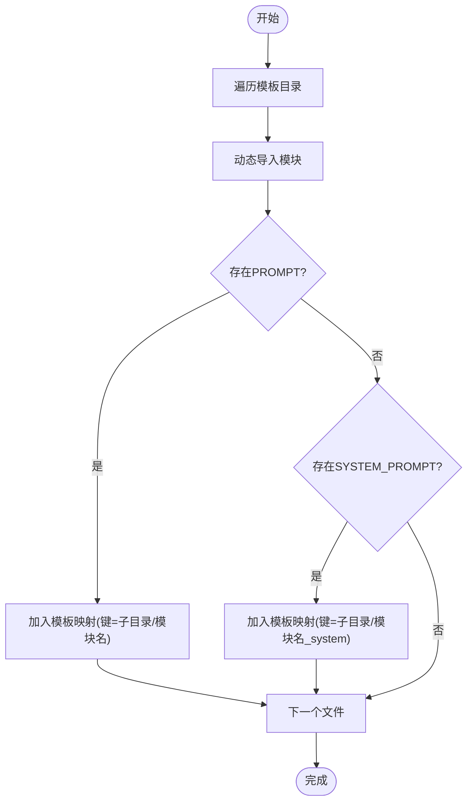
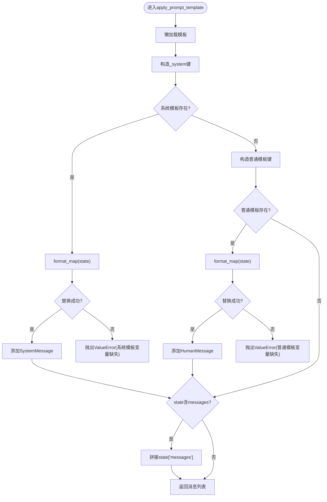
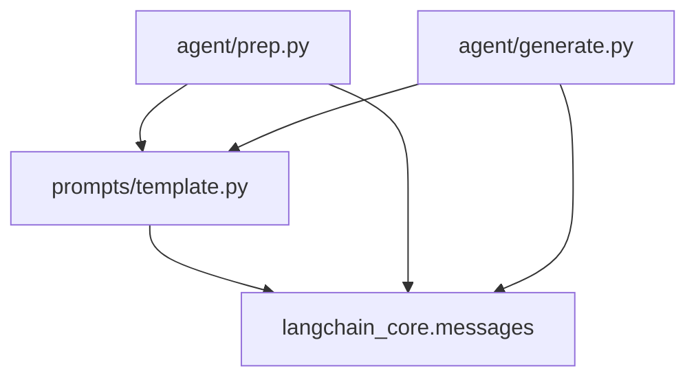

# 模板应用系统

<cite>
**本文引用的文件**
- [src/deepresearch/prompts/template.py](file://src/deepresearch/prompts/template.py)
- [src/deepresearch/prompts/__init__.py](file://src/deepresearch/prompts/__init__.py)
- [src/deepresearch/prompts/generate/generate.py](file://src/deepresearch/prompts/generate/generate.py)
- [src/deepresearch/prompts/prep/classify.py](file://src/deepresearch/prompts/prep/classify.py)
- [src/deepresearch/prompts/prep/clarify.py](file://src/deepresearch/prompts/prep/clarify.py)
- [src/deepresearch/prompts/prep/rewrite.py](file://src/deepresearch/prompts/prep/rewrite.py)
- [src/deepresearch/prompts/learning/research_query.py](file://src/deepresearch/prompts/learning/research_query.py)
- [src/deepresearch/agent/prep.py](file://src/deepresearch/agent/prep.py)
- [src/deepresearch/agent/generate.py](file://src/deepresearch/agent/generate.py)
- [src/deepresearch/agent/message.py](file://src/deepresearch/agent/message.py)
- [tests/unit/prompts/test_template.py](file://tests/unit/prompts/test_template.py)
</cite>

## 目录
1. [简介](#简介)
2. [项目结构](#项目结构)
3. [核心组件](#核心组件)
4. [架构总览](#架构总览)
5. [详细组件分析](#详细组件分析)
6. [依赖分析](#依赖分析)
7. [性能考虑](#性能考虑)
8. [故障排查指南](#故障排查指南)
9. [结论](#结论)
10. [附录](#附录)

## 简介
本文件面向DeepResearch模板应用系统，聚焦于模板加载与应用的核心流程，尤其是apply_prompt_template()函数的实现原理。文档将从以下维度展开：
- 变量注入与格式化处理：state字典如何通过format_map()注入模板变量，以及缺失变量的检测与报错策略
- 消息构建：SystemMessage与HumanMessage的创建机制及命名约定
- 消息链拼接：state['messages']的合并逻辑
- 模板查找规则：_system后缀的系统模板识别与加载
- 错误处理策略：KeyError到ValueError的转换与提示
- 实际使用示例、最佳实践与常见问题解决方案

## 项目结构
模板系统位于prompts目录下，采用按功能分组的子目录组织（generate、learning、outline、prep），每个子目录包含若干模板模块，每个模块导出PROMPT与可选的SYSTEM_PROMPT。模板加载器负责动态扫描这些模块并提取模板内容，供应用层调用。

图表来源
- [src/deepresearch/prompts/template.py:12-70](file://src/deepresearch/prompts/template.py#L12-L70)
- [src/deepresearch/prompts/generate/generate.py:15-102](file://src/deepresearch/prompts/generate/generate.py#L15-L102)
- [src/deepresearch/prompts/prep/classify.py:9-47](file://src/deepresearch/prompts/prep/classify.py#L9-L47)
- [src/deepresearch/prompts/prep/clarify.py:10-56](file://src/deepresearch/prompts/prep/clarify.py#L10-L56)
- [src/deepresearch/prompts/prep/rewrite.py:9-24](file://src/deepresearch/prompts/prep/rewrite.py#L9-L24)

章节来源
- [src/deepresearch/prompts/template.py:12-87](file://src/deepresearch/prompts/template.py#L12-L87)
- [src/deepresearch/prompts/generate/generate.py:15-102](file://src/deepresearch/prompts/generate/generate.py#L15-L102)
- [src/deepresearch/prompts/prep/classify.py:9-47](file://src/deepresearch/prompts/prep/classify.py#L9-L47)

## 核心组件
- 模板加载器：扫描指定目录，动态导入模块，提取PROMPT与SYSTEM_PROMPT，生成键值映射；支持懒加载以减少初始化开销
- 应用器：根据模板名与state字典，优先解析_system系统模板，再解析普通用户模板；将结果包装为SystemMessage与HumanMessage；若state中存在messages，则将其拼接到返回列表之前
- 调用方：在Agent各节点中通过llm()传入由模板应用器生成的消息序列

章节来源
- [src/deepresearch/prompts/template.py:25-87](file://src/deepresearch/prompts/template.py#L25-L87)
- [src/deepresearch/prompts/template.py:90-129](file://src/deepresearch/prompts/template.py#L90-L129)
- [src/deepresearch/agent/prep.py:84-113](file://src/deepresearch/agent/prep.py#L84-L113)
- [src/deepresearch/agent/generate.py:72-87](file://src/deepresearch/agent/generate.py#L72-L87)

## 架构总览
模板应用系统围绕“模板加载-变量注入-消息构建-链路拼接”的主流程运行。下图展示了从Agent节点到模板应用器再到LLM调用的整体交互：

图表来源
- [src/deepresearch/agent/prep.py:84-113](file://src/deepresearch/agent/prep.py#L84-L113)
- [src/deepresearch/agent/generate.py:72-87](file://src/deepresearch/agent/generate.py#L72-L87)
- [src/deepresearch/prompts/template.py:90-129](file://src/deepresearch/prompts/template.py#L90-L129)

## 详细组件分析

### 模板加载与懒加载机制
- 扫描路径：模板目录数组中包含generate、learning、outline、prep四个子目录
- 动态导入：基于相对路径计算模块名，避免硬编码；导入后读取PROMPT与SYSTEM_PROMPT（若存在）
- 键命名规则：普通模板键为“子目录/模块名”，系统模板键为“子目录/模块名_system”
- 懒加载：首次调用时才执行扫描与导入，后续复用全局缓存

图表来源
- [src/deepresearch/prompts/template.py:25-70](file://src/deepresearch/prompts/template.py#L25-L70)

章节来源
- [src/deepresearch/prompts/template.py:12-70](file://src/deepresearch/prompts/template.py#L12-L70)
- [src/deepresearch/prompts/template.py:77-87](file://src/deepresearch/prompts/template.py#L77-L87)

### apply_prompt_template()函数详解
- 输入参数：prompt_name（模板键）、state（变量字典）
- 处理步骤：
  1) 懒加载模板
  2) 查找_system系统模板，若存在则使用format_map(state)进行变量替换，失败抛出KeyError，转为ValueError并提示缺失变量
  3) 查找普通模板，同样使用format_map(state)，异常处理同上
  4) 若state中存在messages字段，则将其拼接到返回列表之前
- 返回值：SystemMessage与HumanMessage组成的列表

图表来源
- [src/deepresearch/prompts/template.py:90-129](file://src/deepresearch/prompts/template.py#L90-L129)

章节来源
- [src/deepresearch/prompts/template.py:90-129](file://src/deepresearch/prompts/template.py#L90-L129)

### SystemMessage与HumanMessage的创建机制
- 创建时机：系统模板存在时先创建SystemMessage，再创建HumanMessage
- 内容来源：format_map(state)后的字符串
- 类型选择：langchain_core.messages中的SystemMessage与HumanMessage
- 消息拼接：若state["messages"]存在，将其前置拼接到最终返回列表

章节来源
- [src/deepresearch/prompts/template.py:114-129](file://src/deepresearch/prompts/template.py#L114-L129)

### 模板变量的format_map()处理方式
- 使用format_map(state)进行变量替换，不抛出KeyError时直接返回
- 当state缺少模板所需的变量时，KeyError被捕获并转换为ValueError，错误信息明确指出缺失的变量名
- 建议在调用前确保state包含所有模板所需变量，或在上层节点中预填充默认值

章节来源
- [src/deepresearch/prompts/template.py:115-126](file://src/deepresearch/prompts/template.py#L115-L126)

### 消息链拼接逻辑（state['messages']合并）
- 若state中存在"messages"键且其值为列表，则将其与新生成的SystemMessage/HumanMessage合并
- 合并顺序：先state["messages"]，后新消息
- 这一设计使得历史上下文得以保留，便于多轮对话与链式推理

章节来源
- [src/deepresearch/prompts/template.py:127-129](file://src/deepresearch/prompts/template.py#L127-L129)

### 模板查找规则与命名约定
- 普通模板键：子目录/模块名（例如"generate/generate"）
- 系统模板键：子目录/模块名_system（例如"generate/generate_system"）
- 加载器会自动为存在SYSTEM_PROMPT的模块生成_system键
- 调用方应确保prompt_name与模块文件名一致，以便正确匹配

章节来源
- [src/deepresearch/prompts/template.py:62-65](file://src/deepresearch/prompts/template.py#L62-L65)
- [src/deepresearch/prompts/template.py:110-111](file://src/deepresearch/prompts/template.py#L110-L111)

### 错误处理策略
- 变量缺失：KeyError被捕获并转换为ValueError，错误信息包含具体缺失变量名
- 模块加载异常：导入模块时的异常会被捕获并打印警告，但不会中断整体流程
- 建议：在调用前校验state完整性，或在上层节点中提供默认值与降级策略

章节来源
- [src/deepresearch/prompts/template.py:67-68](file://src/deepresearch/prompts/template.py#L67-L68)
- [src/deepresearch/prompts/template.py:117-126](file://src/deepresearch/prompts/template.py#L117-L126)

### 实际使用示例
- 预处理阶段（rewrite）：调用prep/rewrite模板，传入当前时间与历史消息
- 分类阶段（classify）：调用prep/classify模板，传入用户查询
- 生成阶段（generate）：调用generate/generate模板，传入领域、时间、查询、大纲、参考知识等
- 说明：上述调用均通过apply_prompt_template生成消息列表后传递给llm()

章节来源
- [src/deepresearch/agent/prep.py:84-113](file://src/deepresearch/agent/prep.py#L84-L113)
- [src/deepresearch/agent/generate.py:72-87](file://src/deepresearch/agent/generate.py#L72-L87)

### 最佳实践
- 明确模板变量：在调用前确保state包含模板所需全部变量，避免KeyError
- 合理使用_system模板：仅当需要设置系统角色或约束时提供SYSTEM_PROMPT
- 保持messages一致性：统一使用HumanMessage/SystemMessage类型，便于链路拼接
- 懒加载优势：首次调用后模板缓存复用，减少重复导入开销
- 单元测试覆盖：已有针对模板加载与应用的测试用例，建议在新增模板时补充测试

章节来源
- [tests/unit/prompts/test_template.py:16-56](file://tests/unit/prompts/test_template.py#L16-L56)

### 常见问题与解决方案
- 问题：提示“缺少变量”错误
  - 解决：检查state是否包含模板声明的所有变量；必要时在上层节点补全默认值
- 问题：找不到模板
  - 解决：确认prompt_name与模块文件名一致；检查模板目录是否存在且可导入
- 问题：历史消息未生效
  - 解决：确保state["messages"]为列表且包含有效消息；检查拼接逻辑是否被覆盖
- 问题：系统模板未生效
  - 解决：确认模块中定义了SYSTEM_PROMPT；模板键需为“模块名_system”

章节来源
- [src/deepresearch/prompts/template.py:117-126](file://src/deepresearch/prompts/template.py#L117-L126)
- [src/deepresearch/prompts/template.py:110-111](file://src/deepresearch/prompts/template.py#L110-L111)
- [src/deepresearch/prompts/template.py:127-129](file://src/deepresearch/prompts/template.py#L127-L129)

## 依赖分析
- 模块内聚性：模板加载器与模板模块解耦，通过约定的键名与模块结构实现松耦合
- 外部依赖：langchain_core.messages（SystemMessage/HumanMessage）、标准库importlib/os/sys
- Agent集成：prep与generate节点通过apply_prompt_template将state转化为消息序列，再交由llm()处理

图表来源
- [src/deepresearch/prompts/template.py:9-9](file://src/deepresearch/prompts/template.py#L9-L9)
- [src/deepresearch/agent/prep.py:12-13](file://src/deepresearch/agent/prep.py#L12-L13)
- [src/deepresearch/agent/generate.py:13-15](file://src/deepresearch/agent/generate.py#L13-L15)

章节来源
- [src/deepresearch/prompts/template.py:9-9](file://src/deepresearch/prompts/template.py#L9-L9)
- [src/deepresearch/agent/prep.py:12-13](file://src/deepresearch/agent/prep.py#L12-L13)
- [src/deepresearch/agent/generate.py:13-15](file://src/deepresearch/agent/generate.py#L13-L15)

## 性能考虑
- 懒加载：首次调用时扫描与导入，后续复用缓存，降低启动成本
- 动态导入：按需导入，避免一次性加载所有模板模块
- 字符串格式化：format_map()比format()更高效且安全，适合大规模变量注入
- 建议：在高频调用场景中，尽量复用已加载的模板映射；对state进行预处理，减少缺失变量导致的重试

章节来源
- [src/deepresearch/prompts/template.py:77-87](file://src/deepresearch/prompts/template.py#L77-L87)
- [src/deepresearch/prompts/template.py:115-124](file://src/deepresearch/prompts/template.py#L115-L124)

## 故障排查指南
- 模板未加载：检查模板目录是否存在；确认模块可导入；查看控制台警告信息
- 变量缺失：根据错误提示定位缺失变量；在上层节点补齐默认值
- 消息类型不一致：统一使用HumanMessage/SystemMessage；避免混合字典与消息对象
- 链路拼接异常：确认state["messages"]为列表；检查拼接顺序与去重逻辑

章节来源
- [src/deepresearch/prompts/template.py:39-41](file://src/deepresearch/prompts/template.py#L39-L41)
- [src/deepresearch/prompts/template.py:67-68](file://src/deepresearch/prompts/template.py#L67-L68)
- [src/deepresearch/prompts/template.py:127-129](file://src/deepresearch/prompts/template.py#L127-L129)

## 结论
模板应用系统通过约定化的目录结构与键名规则，实现了模板的动态加载与变量注入；apply_prompt_template()函数以简洁的流程完成了系统消息与用户消息的构建，并与state中的历史消息无缝拼接。配合懒加载与严格的错误处理，系统在易用性与稳定性之间取得了良好平衡。建议在实际使用中遵循最佳实践，确保state完整性与消息类型一致性，以获得稳定可靠的输出。

## 附录
- 模块导出：prompts包导出apply_prompt_template，便于外部直接调用
- 模板样例：generate/generate、prep/classify、prep/clarify、prep/rewrite、learning/research_query等

章节来源
- [src/deepresearch/prompts/__init__.py:4-8](file://src/deepresearch/prompts/__init__.py#L4-L8)
- [src/deepresearch/prompts/generate/generate.py:15-102](file://src/deepresearch/prompts/generate/generate.py#L15-L102)
- [src/deepresearch/prompts/prep/classify.py:9-47](file://src/deepresearch/prompts/prep/classify.py#L9-L47)
- [src/deepresearch/prompts/prep/clarify.py:10-56](file://src/deepresearch/prompts/prep/clarify.py#L10-L56)
- [src/deepresearch/prompts/prep/rewrite.py:9-24](file://src/deepresearch/prompts/prep/rewrite.py#L9-L24)
- [src/deepresearch/prompts/learning/research_query.py:13-56](file://src/deepresearch/prompts/learning/research_query.py#L13-L56)