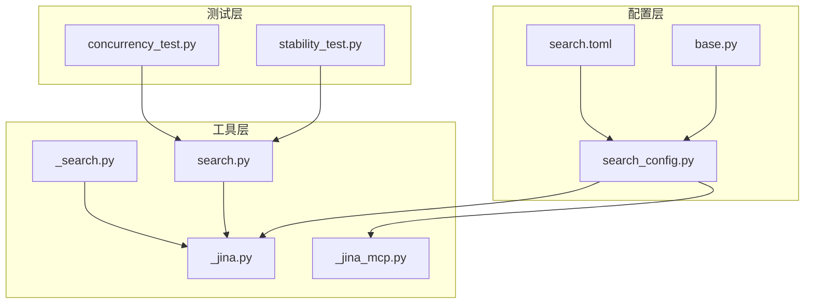
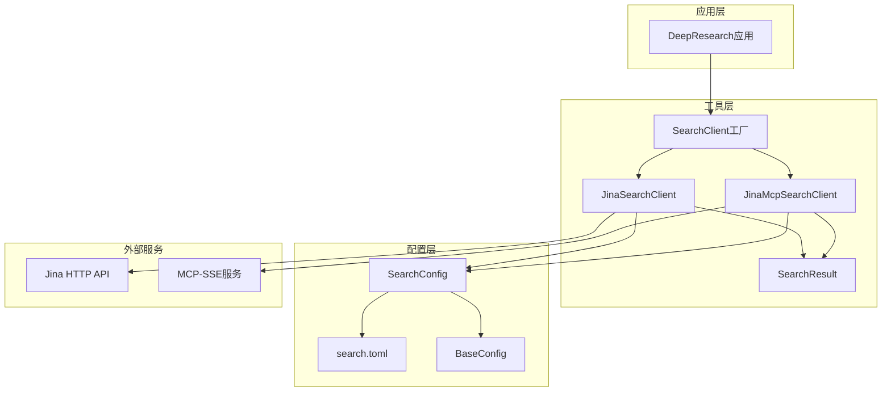
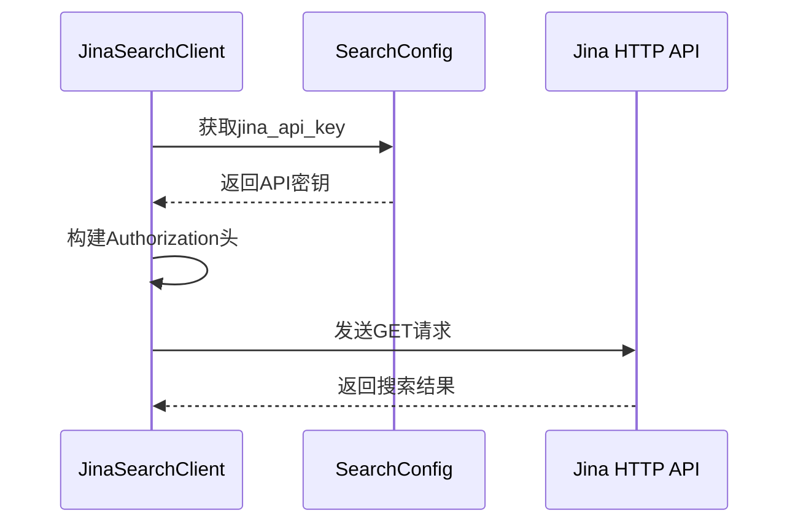
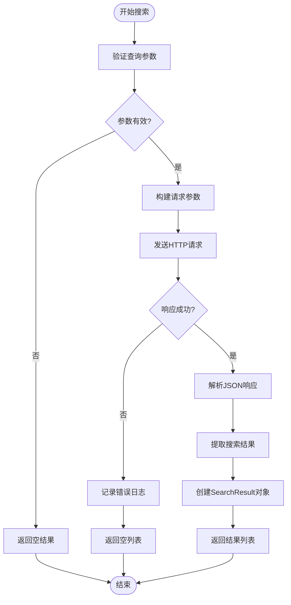
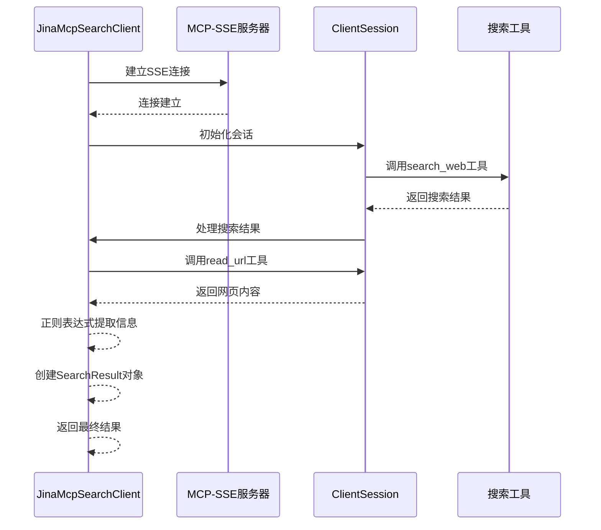
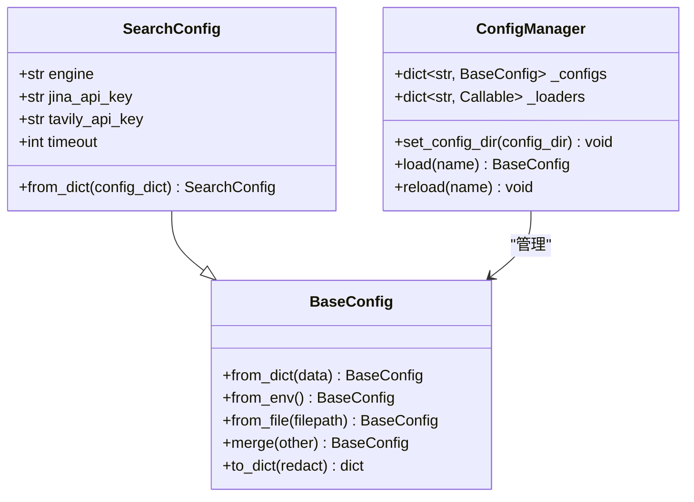
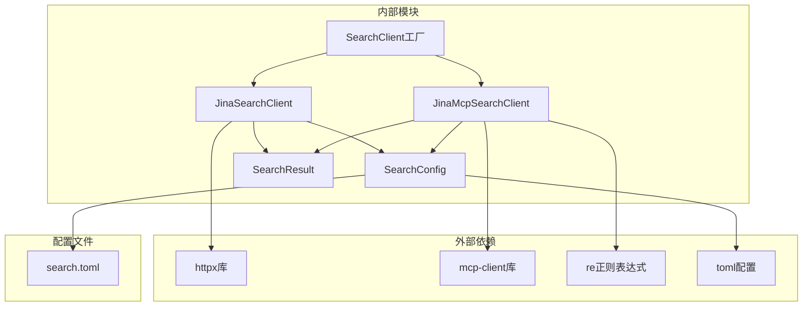
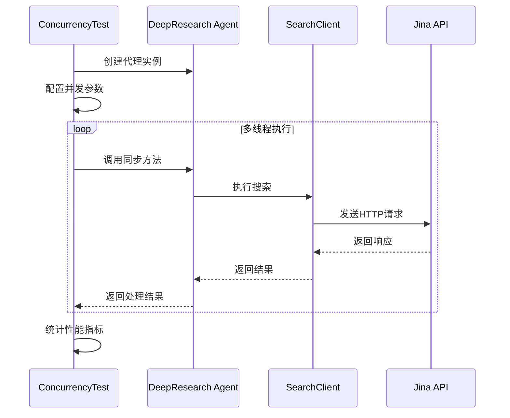

# Jina搜索引擎集成

<cite>
**本文档引用的文件**
- [src/deepresearch/tools/_jina.py](file://src/deepresearch/tools/_jina.py)
- [src/deepresearch/tools/_jina_mcp.py](file://src/deepresearch/tools/_jina_mcp.py)
- [src/deepresearch/tools/search.py](file://src/deepresearch/tools/search.py)
- [src/deepresearch/tools/_search.py](file://src/deepresearch/tools/_search.py)
- [src/deepresearch/config/search_config.py](file://src/deepresearch/config/search_config.py)
- [config/search.toml](file://config/search.toml)
- [src/deepresearch/config/base.py](file://src/deepresearch/config/base.py)
- [tests/performance/concurrency_test.py](file://tests/performance/concurrency_test.py)
- [tests/performance/stability_test.py](file://tests/performance/stability_test.py)
- [README.md](file://README.md)
</cite>

## 目录
1. [简介](#简介)
2. [项目结构](#项目结构)
3. [核心组件](#核心组件)
4. [架构概览](#架构概览)
5. [详细组件分析](#详细组件分析)
6. [依赖关系分析](#依赖关系分析)
7. [性能考虑](#性能考虑)
8. [故障排除指南](#故障排除指南)
9. [结论](#结论)
10. [附录](#附录)

## 简介

DeepResearch是一个基于渐进式搜索和交叉评估的深度研究框架，支持多个LLMs协作，通过智能工作流"任务规划 → 工具调用 → 评估与迭代"来解决复杂的信息分析问题。本文件专注于Jina搜索引擎的集成实现，详细说明JinaSearchClient类的实现原理、API使用方法以及在学术搜索和内容提取方面的特点。

## 项目结构

DeepResearch项目采用模块化设计，Jina搜索引擎集成位于tools模块中，主要包含以下关键文件：



**图表来源**
- [src/deepresearch/tools/_jina.py:1-92](file://src/deepresearch/tools/_jina.py#L1-L92)
- [src/deepresearch/tools/_jina_mcp.py:1-162](file://src/deepresearch/tools/_jina_mcp.py#L1-L162)
- [src/deepresearch/config/search_config.py:1-82](file://src/deepresearch/config/search_config.py#L1-L82)

**章节来源**
- [src/deepresearch/tools/_jina.py:1-92](file://src/deepresearch/tools/_jina.py#L1-L92)
- [src/deepresearch/tools/_jina_mcp.py:1-162](file://src/deepresearch/tools/_jina_mcp.py#L1-L162)
- [src/deepresearch/config/search_config.py:1-82](file://src/deepresearch/config/search_config.py#L1-L82)

## 核心组件

### JinaSearchClient类

JinaSearchClient是Jina搜索引擎的主要客户端实现，继承自SearchClient基类，提供了HTTP API接口的完整封装。

**主要特性：**
- 支持Bearer Token认证机制
- 配置化的超时控制
- 结构化的搜索结果处理
- 完善的错误处理机制

**关键实现要点：**
- 使用HTTPX库进行异步HTTP请求
- 集成搜索配置管理系统
- 实现标准化的结果数据结构

**章节来源**
- [src/deepresearch/tools/_jina.py:15-92](file://src/deepresearch/tools/_jina.py#L15-L92)

### SearchResult数据模型

SearchResult是标准化的搜索结果数据结构，定义了统一的字段规范：

| 字段名 | 类型 | 描述 | 默认值 |
|--------|------|------|--------|
| url | str | 搜索结果URL链接 | 空字符串 |
| title | str | 结果标题 | 空字符串 |
| summary | str | 摘要内容 | 空字符串 |
| content | str | 完整内容 | 空字符串 |
| date | str | 发布日期 | 空字符串 |
| id | int | 结果标识符 | 0 |

**章节来源**
- [src/deepresearch/tools/_search.py:8-18](file://src/deepresearch/tools/_search.py#L8-L18)

## 架构概览

DeepResearch的Jina搜索引擎集成采用了分层架构设计，确保了良好的可扩展性和维护性：



**图表来源**
- [src/deepresearch/tools/search.py:12-37](file://src/deepresearch/tools/search.py#L12-L37)
- [src/deepresearch/config/search_config.py:56-82](file://src/deepresearch/config/search_config.py#L56-L82)

## 详细组件分析

### JinaSearchClient实现详解

#### 认证机制

JinaSearchClient使用Bearer Token认证方式，通过配置文件中的API密钥进行身份验证：



**图表来源**
- [src/deepresearch/tools/_jina.py:18-26](file://src/deepresearch/tools/_jina.py#L18-L26)
- [src/deepresearch/config/search_config.py:16-18](file://src/deepresearch/config/search_config.py#L16-L18)

#### 请求参数配置

搜索请求支持以下参数配置：

| 参数名 | 类型 | 范围 | 描述 | 默认值 |
|--------|------|------|------|--------|
| q | str | 必需 | 搜索查询字符串 | 无 |
| num | int | 1-20 | 返回结果数量 | 10 |
| timeout | int | 1-300秒 | 请求超时时间 | 30秒 |

**章节来源**
- [src/deepresearch/tools/_jina.py:44-47](file://src/deepresearch/tools/_jina.py#L44-L47)
- [src/deepresearch/config/search_config.py:40-46](file://src/deepresearch/config/search_config.py#L40-L46)

#### 响应处理流程

JinaSearchClient实现了完整的响应处理逻辑：



**图表来源**
- [src/deepresearch/tools/_jina.py:28-79](file://src/deepresearch/tools/_jina.py#L28-L79)

**章节来源**
- [src/deepresearch/tools/_jina.py:28-79](file://src/deepresearch/tools/_jina.py#L28-L79)

### JinaMcpSearchClient实现

JinaMcpSearchClient提供了基于MCP-SSE协议的高级搜索能力：

#### 异步搜索流程



**图表来源**
- [src/deepresearch/tools/_jina_mcp.py:30-103](file://src/deepresearch/tools/_jina_mcp.py#L30-L103)

**章节来源**
- [src/deepresearch/tools/_jina_mcp.py:30-103](file://src/deepresearch/tools/_jina_mcp.py#L30-L103)

### 配置管理系统

#### SearchConfig类

SearchConfig提供了完整的配置管理功能：



**图表来源**
- [src/deepresearch/config/search_config.py:12-53](file://src/deepresearch/config/search_config.py#L12-L53)
- [src/deepresearch/config/base.py:190-372](file://src/deepresearch/config/base.py#L190-L372)

**章节来源**
- [src/deepresearch/config/search_config.py:12-53](file://src/deepresearch/config/search_config.py#L12-L53)
- [src/deepresearch/config/base.py:190-372](file://src/deepresearch/config/base.py#L190-L372)

## 依赖关系分析

### 组件依赖图



**图表来源**
- [src/deepresearch/tools/_jina.py:7-10](file://src/deepresearch/tools/_jina.py#L7-L10)
- [src/deepresearch/tools/_jina_mcp.py:8-9](file://src/deepresearch/tools/_jina_mcp.py#L8-L9)

### 错误处理策略

系统实现了多层次的错误处理机制：

| 错误类型 | 处理方式 | 日志级别 |
|----------|----------|----------|
| TimeoutException | 记录超时错误 | ERROR |
| HTTPStatusError | 记录HTTP状态码 | ERROR |
| RequestError | 记录请求异常 | ERROR |
| 其他异常 | 记录通用错误 | ERROR |

**章节来源**
- [src/deepresearch/tools/_jina.py:71-78](file://src/deepresearch/tools/_jina.py#L71-L78)

## 性能考虑

### 并发性能测试

基于现有的性能测试框架，Jina搜索引擎集成了完整的并发测试能力：



**图表来源**
- [tests/performance/concurrency_test.py:21-40](file://tests/performance/concurrency_test.py#L21-L40)

### 稳定性监控

系统提供了长期稳定性测试能力，监控关键性能指标：

| 监控指标 | 测量方法 | 阈值标准 |
|----------|----------|----------|
| 响应时间 | 统计请求耗时 | 平均<5s |
| 成功率 | 计算成功/总请求比 | >95% |
| CPU使用率 | 系统监控 | <80% |
| 内存使用率 | 进程监控 | <70% |
| 内存泄漏 | RSS趋势分析 | 增长<10MB |

**章节来源**
- [tests/performance/stability_test.py:16-222](file://tests/performance/stability_test.py#L16-L222)

## 故障排除指南

### 常见问题诊断

#### 认证失败
- 检查API密钥格式是否正确
- 验证网络连接是否正常
- 确认账户状态是否有效

#### 超时问题
- 调整timeout配置参数
- 检查网络延迟情况
- 考虑增加重试机制

#### 结果为空
- 验证查询语句是否合理
- 检查返回数量参数范围
- 确认目标网站可访问性

### 调试建议

1. **启用详细日志**：检查搜索过程中的每一步操作
2. **监控API配额**：确保未超过服务限制
3. **验证网络配置**：检查防火墙和代理设置
4. **测试独立功能**：单独测试Jina API的可用性

**章节来源**
- [src/deepresearch/tools/_jina.py:71-78](file://src/deepresearch/tools/_jina.py#L71-L78)

## 结论

DeepResearch的Jina搜索引擎集成为学术研究和内容提取提供了强大而灵活的解决方案。通过模块化的架构设计、完善的配置管理和健壮的错误处理机制，该集成能够在保证性能的同时提供高质量的搜索体验。

主要优势包括：
- **易用性强**：简洁的API接口和配置管理
- **性能优异**：支持并发处理和优化的请求管理
- **可靠性高**：完整的错误处理和监控机制
- **扩展灵活**：基于接口的设计便于功能扩展

## 附录

### 配置示例

#### 基础配置
```toml
[search]
engine = "jina"
timeout = 30
jina_api_key = "jina_your_api_key_here"
```

#### 高级配置
```toml
[search]
engine = "jina"
timeout = 60
jina_api_key = "jina_your_api_key_here"
tavily_api_key = "tavily_your_api_key_here"
```

### 使用示例

#### 基本搜索
```python
from deepresearch.tools.search import SearchClient

search_client = SearchClient()
results = search_client.search("人工智能发展趋势", 10)
for result in results:
    print(f"标题: {result.title}")
    print(f"摘要: {result.summary}")
    print(f"链接: {result.url}")
```

#### 高级配置
```python
from deepresearch.config.search_config import search_config

# 动态调整超时设置
search_config.timeout = 45

# 切换搜索引擎
search_config.engine = "tavily"
```

### API参考

#### JinaSearchClient方法

| 方法名 | 参数 | 返回值 | 描述 |
|--------|------|--------|------|
| search | query: str, top_n: int | List[SearchResult] | 执行搜索并返回结果 |
| __init__ | 无 | None | 初始化客户端配置 |

#### SearchResult属性

| 属性名 | 类型 | 描述 |
|--------|------|------|
| url | str | 搜索结果URL |
| title | str | 结果标题 |
| summary | str | 摘要内容 |
| content | str | 完整内容 |
| date | str | 发布日期 |
| id | int | 结果标识符 |

**章节来源**
- [src/deepresearch/tools/search.py:12-37](file://src/deepresearch/tools/search.py#L12-L37)
- [src/deepresearch/tools/_search.py:8-18](file://src/deepresearch/tools/_search.py#L8-L18)