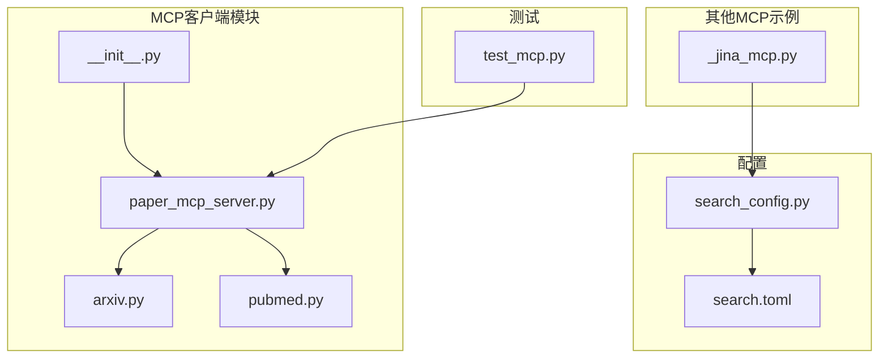
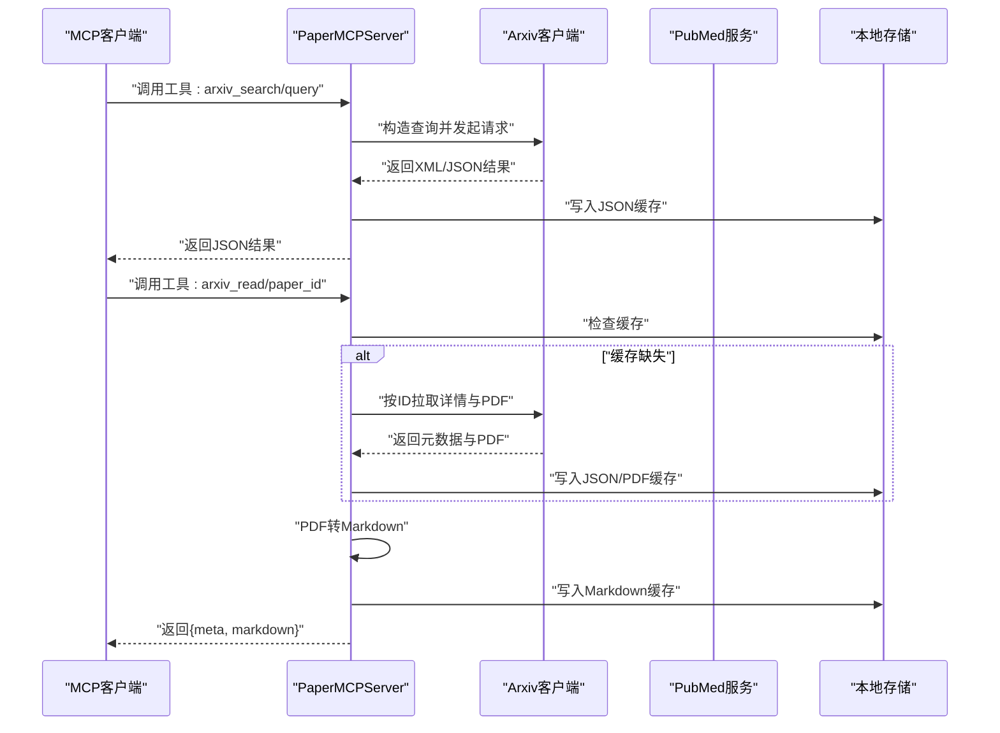
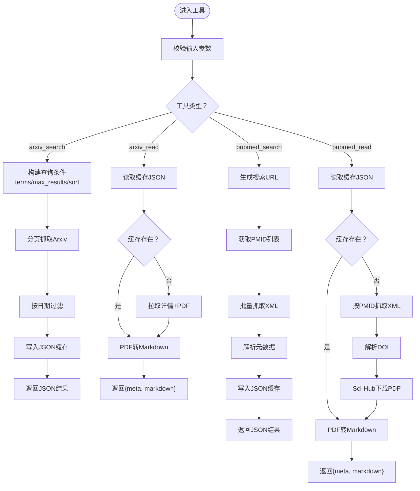
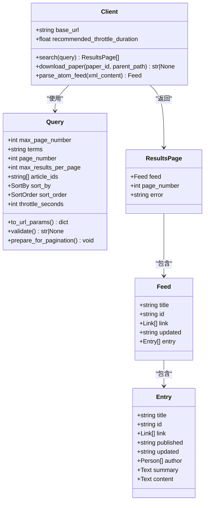
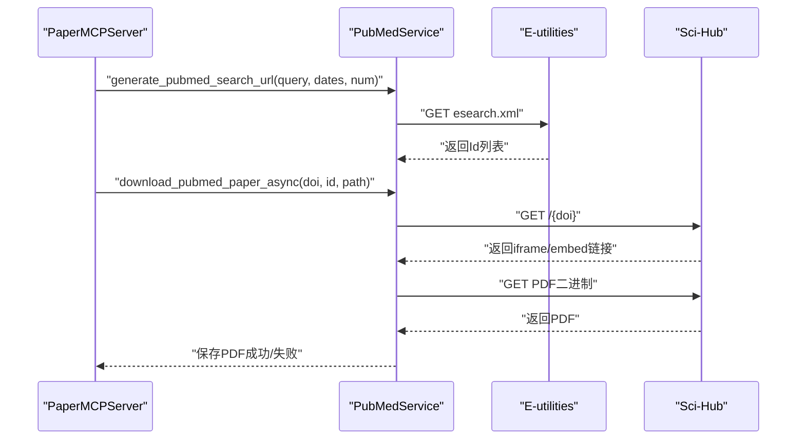
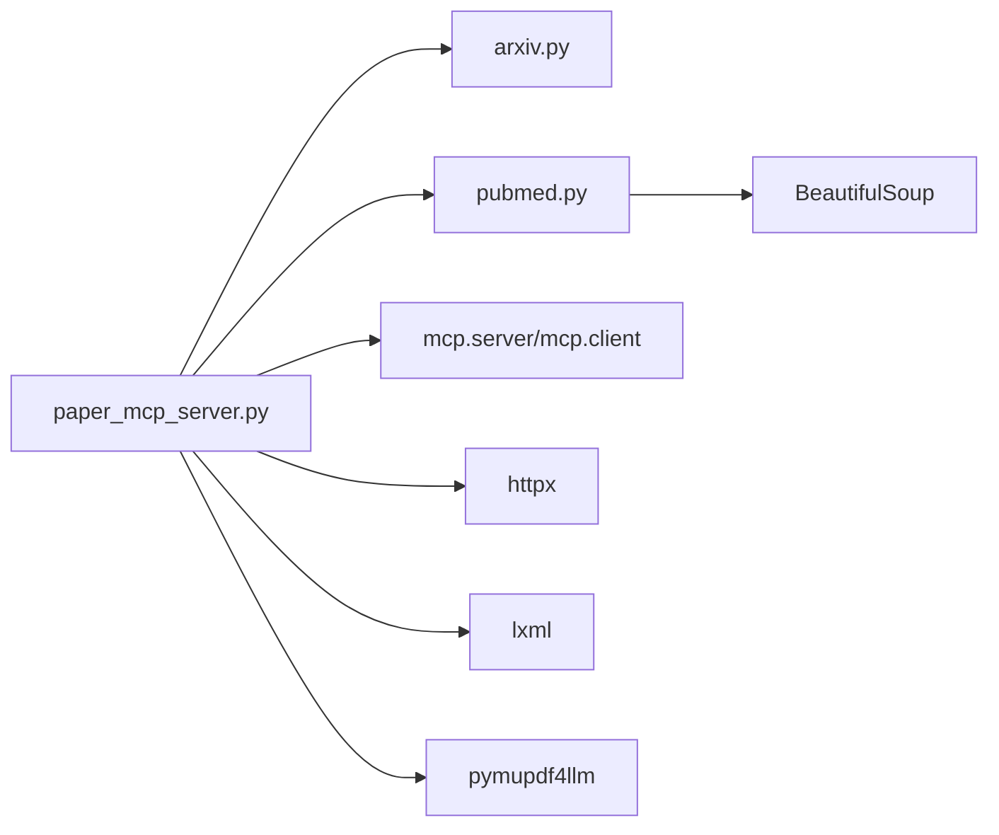

# MCP客户端集成

<cite>
**本文引用的文件**
- [paper_mcp_server.py](file://src/deepresearch/mcp_client/paper_mcp_server.py)
- [arxiv.py](file://src/deepresearch/mcp_client/arxiv.py)
- [pubmed.py](file://src/deepresearch/mcp_client/pubmed.py)
- [__init__.py](file://src/deepresearch/mcp_client/__init__.py)
- [test_mcp.py](file://tests/unit/mcp_client/test_mcp.py)
- [search.toml](file://config/search.toml)
- [search_config.py](file://src/deepresearch/config/search_config.py)
- [_jina_mcp.py](file://src/deepresearch/tools/_jina_mcp.py)
- [README.md](file://README.md)
</cite>

## 目录
1. [简介](#简介)
2. [项目结构](#项目结构)
3. [核心组件](#核心组件)
4. [架构总览](#架构总览)
5. [详细组件分析](#详细组件分析)
6. [依赖分析](#依赖分析)
7. [性能考虑](#性能考虑)
8. [故障排查指南](#故障排查指南)
9. [结论](#结论)
10. [附录](#附录)

## 简介
本文件面向DeepResearch的MCP客户端集成，系统性阐述MCP（Model Control Protocol）协议在学术搜索中的应用与实现。文档聚焦PaperMCPServer的实现原理与Paper MCP协议规范，详解Arxiv与Pubmed两个学术数据库的MCP客户端实现，包括工具定义、API调用方式、数据格式转换与结果处理流程。同时提供完整的配置示例与使用指南，涵盖MCP服务器连接、认证机制与查询参数设置，并总结学术论文搜索的最佳实践与结果质量评估方法。

## 项目结构
DeepResearch的MCP客户端位于src/deepresearch/mcp_client目录，包含四个核心模块：
- paper_mcp_server.py：MCP服务器实现，暴露arxiv_search、arxiv_read、pubmed_search、pubmed_read四个工具
- arxiv.py：Arxiv API客户端，负责查询、分页、解析与PDF下载
- pubmed.py：PubMed服务封装，负责搜索、抓取、DOI解析与Sci-Hub下载
- __init__.py：导出上述四个工具函数

单元测试位于tests/unit/mcp_client/test_mcp.py，验证工具的可用性与基本数据结构。

**图表来源**
- [paper_mcp_server.py:1-463](file://src/deepresearch/mcp_client/paper_mcp_server.py#L1-L463)
- [arxiv.py:1-456](file://src/deepresearch/mcp_client/arxiv.py#L1-L456)
- [pubmed.py:1-480](file://src/deepresearch/mcp_client/pubmed.py#L1-L480)
- [__init__.py:1-8](file://src/deepresearch/mcp_client/__init__.py#L1-L8)
- [test_mcp.py:1-93](file://tests/unit/mcp_client/test_mcp.py#L1-L93)
- [search.toml:1-6](file://config/search.toml#L1-L6)
- [search_config.py:1-82](file://src/deepresearch/config/search_config.py#L1-L82)
- [_jina_mcp.py:1-162](file://src/deepresearch/tools/_jina_mcp.py#L1-L162)

**章节来源**
- [paper_mcp_server.py:1-463](file://src/deepresearch/mcp_client/paper_mcp_server.py#L1-L463)
- [arxiv.py:1-456](file://src/deepresearch/mcp_client/arxiv.py#L1-L456)
- [pubmed.py:1-480](file://src/deepresearch/mcp_client/pubmed.py#L1-L480)
- [__init__.py:1-8](file://src/deepresearch/mcp_client/__init__.py#L1-L8)
- [test_mcp.py:1-93](file://tests/unit/mcp_client/test_mcp.py#L1-L93)
- [search.toml:1-6](file://config/search.toml#L1-L6)
- [search_config.py:1-82](file://src/deepresearch/config/search_config.py#L1-L82)
- [_jina_mcp.py:1-162](file://src/deepresearch/tools/_jina_mcp.py#L1-L162)

## 核心组件
- PaperMCPServer：基于mcp.server框架实现的MCP服务器，提供四个工具：
  - arxiv_search：按关键词与日期范围检索Arxiv论文，返回JSON列表
  - arxiv_read：根据Arxiv ID读取论文元数据与Markdown内容
  - pubmed_search：按关键词与日期范围检索PubMed论文，返回JSON列表
  - pubmed_read：根据PubMed ID读取论文元数据与Markdown内容
- Arxiv客户端：封装Arxiv Atom API，支持分页、排序、节流与PDF下载
- PubMed服务：封装E-utilities API，支持搜索、抓取、DOI解析与Sci-Hub下载

**章节来源**
- [paper_mcp_server.py:361-433](file://src/deepresearch/mcp_client/paper_mcp_server.py#L361-L433)
- [arxiv.py:208-456](file://src/deepresearch/mcp_client/arxiv.py#L208-L456)
- [pubmed.py:65-480](file://src/deepresearch/mcp_client/pubmed.py#L65-L480)

## 架构总览
PaperMCPServer通过MCP协议对外暴露工具，内部分别对接Arxiv与PubMed服务。工具调用流程如下：

**图表来源**
- [paper_mcp_server.py:45-175](file://src/deepresearch/mcp_client/paper_mcp_server.py#L45-L175)
- [arxiv.py:330-426](file://src/deepresearch/mcp_client/arxiv.py#L330-L426)

**章节来源**
- [paper_mcp_server.py:45-175](file://src/deepresearch/mcp_client/paper_mcp_server.py#L45-L175)
- [arxiv.py:330-426](file://src/deepresearch/mcp_client/arxiv.py#L330-L426)

## 详细组件分析

### PaperMCPServer实现与工具定义
- 工具清单与输入模式：
  - arxiv_search：必需参数query；可选max_results、date_from、date_to
  - arxiv_read：必需参数paper_id
  - pubmed_search：必需参数query；可选max_results、date_from、date_to
  - pubmed_read：必需参数paper_id
- 工具执行逻辑：
  - arxiv_search：构建查询条件，遍历分页，提取元数据，过滤日期，写入JSON缓存，返回JSON
  - arxiv_read：优先读取缓存，缺失则拉取详情与PDF，再转Markdown，返回元数据+正文
  - pubmed_search：生成搜索URL，获取PMID列表，批量抓取XML，提取元数据，写入JSON缓存，返回JSON
  - pubmed_read：优先读取缓存，缺失则按PMID抓取XML，解析DOI，通过Sci-Hub下载PDF，转Markdown，返回元数据+正文
- 缓存策略：以PAPER_STORAGE环境变量为根目录，默认./paper_cache，按ID命名保存JSON/PDF/Markdown

**图表来源**
- [paper_mcp_server.py:45-337](file://src/deepresearch/mcp_client/paper_mcp_server.py#L45-L337)

**章节来源**
- [paper_mcp_server.py:361-433](file://src/deepresearch/mcp_client/paper_mcp_server.py#L361-L433)
- [paper_mcp_server.py:45-337](file://src/deepresearch/mcp_client/paper_mcp_server.py#L45-L337)

### Arxiv客户端实现
- 查询模型与参数：
  - Query：支持terms、article_ids、max_page_number、max_results_per_page、sort_by、sort_order、throttle_seconds
  - 支持校验与分页准备，自动计算退避延迟
- 数据结构：
  - Feed/Entry/Person/Link/Text等，用于解析Atom XML
- 搜索流程：
  - 校验参数，循环分页，HTTP GET抓取，解析为Feed，遇到空集停止
- 下载流程：
  - 通过/ftp路径下载PDF，支持流式写入与超时控制

**图表来源**
- [arxiv.py:26-206](file://src/deepresearch/mcp_client/arxiv.py#L26-L206)
- [arxiv.py:208-456](file://src/deepresearch/mcp_client/arxiv.py#L208-L456)

**章节来源**
- [arxiv.py:26-206](file://src/deepresearch/mcp_client/arxiv.py#L26-L206)
- [arxiv.py:208-456](file://src/deepresearch/mcp_client/arxiv.py#L208-L456)

### PubMed服务实现
- URL生成：
  - 生成搜索URL，支持日期过滤与结果数量控制
- 搜索与抓取：
  - 同步/异步搜索与抓取，解析XML为文章对象
- 下载流程：
  - 通过Sci-Hub解析iframe/embed链接，下载PDF并保存

**图表来源**
- [pubmed.py:75-105](file://src/deepresearch/mcp_client/pubmed.py#L75-L105)
- [pubmed.py:285-341](file://src/deepresearch/mcp_client/pubmed.py#L285-L341)

**章节来源**
- [pubmed.py:75-105](file://src/deepresearch/mcp_client/pubmed.py#L75-L105)
- [pubmed.py:285-341](file://src/deepresearch/mcp_client/pubmed.py#L285-L341)

### 单元测试与使用验证
- 测试覆盖：
  - arxiv_search与arxiv_read：从搜索结果中抽取ID，验证返回结构
  - pubmed_search与pubmed_read：从搜索结果中抽取ID，验证返回结构
- 测试策略：若网络不可用则跳过，确保CI稳定性

**章节来源**
- [test_mcp.py:1-93](file://tests/unit/mcp_client/test_mcp.py#L1-L93)

## 依赖分析
- 内部依赖：
  - paper_mcp_server.py依赖arxiv.py与pubmed.py提供的客户端能力
  - __init__.py导出四个工具函数，供外部直接调用
- 外部依赖：
  - mcp.server与mcp.client用于MCP协议通信
  - httpx用于HTTP请求
  - lxml用于XML解析
  - pymupdf4llm用于PDF转Markdown
  - BeautifulSoup用于Sci-Hub页面解析

**图表来源**
- [paper_mcp_server.py:19-33](file://src/deepresearch/mcp_client/paper_mcp_server.py#L19-L33)
- [pubmed.py:9-10](file://src/deepresearch/mcp_client/pubmed.py#L9-L10)

**章节来源**
- [paper_mcp_server.py:19-33](file://src/deepresearch/mcp_client/paper_mcp_server.py#L19-L33)
- [pubmed.py:9-10](file://src/deepresearch/mcp_client/pubmed.py#L9-L10)

## 性能考虑
- 请求节流与退避：Arxiv客户端内置指数退避与随机抖动，避免触发限流
- 分页与并发：PaperMCPServer对每个工具提供最大结果数限制，避免一次性拉取过多数据
- 缓存策略：本地JSON/PDF/Markdown缓存减少重复下载与解析开销
- 异步下载：PubMed下载采用异步客户端，提升I/O吞吐
- 超时控制：统一设置HTTP超时，避免长时间阻塞

**章节来源**
- [arxiv.py:340-392](file://src/deepresearch/mcp_client/arxiv.py#L340-L392)
- [paper_mcp_server.py:38-42](file://src/deepresearch/mcp_client/paper_mcp_server.py#L38-L42)
- [pubmed.py:285-341](file://src/deepresearch/mcp_client/pubmed.py#L285-L341)

## 故障排查指南
- 常见错误与定位
  - arxiv_search错误：检查查询参数与网络连通性，确认返回文本包含“search error”
  - arxiv_read错误：检查paper_id是否存在、PDF下载是否成功、pymupdf4llm是否安装
  - pubmed_search错误：检查日期格式与PMID列表是否为空
  - pubmed_read错误：检查DOI是否存在、Sci-Hub页面是否可访问
- 缓存问题：删除对应ID的JSON/PDF/Markdown文件，强制重新抓取
- 认证与配额：当前实现不涉及认证头，如遇限流请降低并发与频率
- 日志与调试：工具返回文本中包含具体异常信息，便于快速定位

**章节来源**
- [paper_mcp_server.py:92-93](file://src/deepresearch/mcp_client/paper_mcp_server.py#L92-L93)
- [paper_mcp_server.py:165-166](file://src/deepresearch/mcp_client/paper_mcp_server.py#L165-L166)
- [paper_mcp_server.py:237-238](file://src/deepresearch/mcp_client/paper_mcp_server.py#L237-L238)
- [paper_mcp_server.py:327-328](file://src/deepresearch/mcp_client/paper_mcp_server.py#L327-L328)

## 结论
本集成以MCP协议为核心，将Arxiv与PubMed两大学术数据库的能力标准化为可复用工具，具备清晰的输入输出契约、完善的缓存与下载机制，以及良好的错误处理与性能特性。通过统一的工具接口，DeepResearch可在研究工作流中高效地进行跨库论文检索与内容读取。

## 附录

### MCP服务器与工具使用指南
- 运行MCP服务器
  - 直接运行脚本启动stdio服务器，输出符合MCP协议标准
- 工具调用
  - arxiv_search：提供query，可选max_results、date_from、date_to
  - arxiv_read：提供paper_id
  - pubmed_search：提供query，可选max_results、date_from、date_to
  - pubmed_read：提供paper_id
- 输出格式
  - 搜索工具返回JSON字符串，包含papers数组
  - 读取工具返回JSON字符串，包含meta与markdown字段

**章节来源**
- [paper_mcp_server.py:361-433](file://src/deepresearch/mcp_client/paper_mcp_server.py#L361-L433)
- [paper_mcp_server.py:445-462](file://src/deepresearch/mcp_client/paper_mcp_server.py#L445-L462)

### 配置示例与最佳实践
- 环境变量与配置文件
  - PAPER_STORAGE：设置本地缓存根目录，默认./paper_cache
  - search.toml：包含通用搜索配置（与MCP无关），可用于其他搜索工具
- 最佳实践
  - 合理设置max_results，避免过度拉取
  - 使用date_from/date_to限定时间范围，提高相关性
  - 安装pymupdf4llm以启用PDF转Markdown
  - 在CI环境中适当降低并发，避免触发外部服务限流
- 结果质量评估
  - 关注标题、摘要与作者匹配度
  - 优先选择近期内发表的高质量期刊/会议论文
  - 对比多个来源的结果，交叉验证关键信息

**章节来源**
- [paper_mcp_server.py:29-30](file://src/deepresearch/mcp_client/paper_mcp_server.py#L29-L30)
- [search.toml:1-6](file://config/search.toml#L1-L6)
- [search_config.py:12-53](file://src/deepresearch/config/search_config.py#L12-L53)

### 与其他MCP实现的对比参考
- Jina MCP搜索客户端展示了MCP-SSE的典型用法，包括认证头、工具调用与结果解析流程，可作为理解MCP协议的补充参考

**章节来源**
- [_jina_mcp.py:15-162](file://src/deepresearch/tools/_jina_mcp.py#L15-L162)