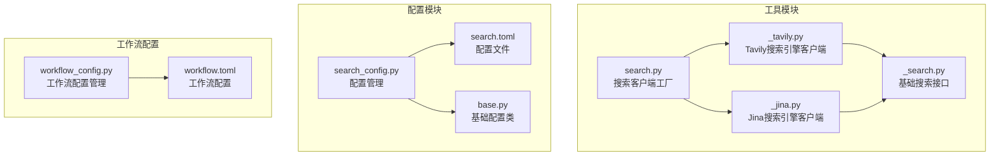
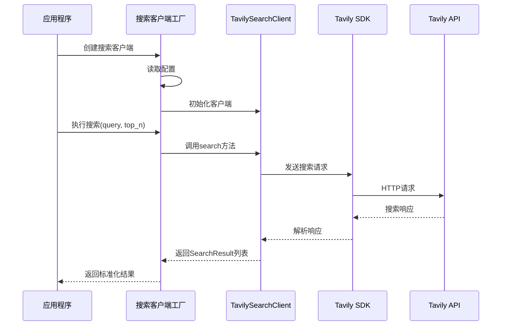
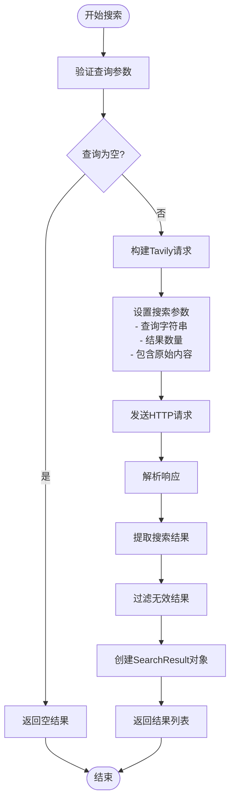
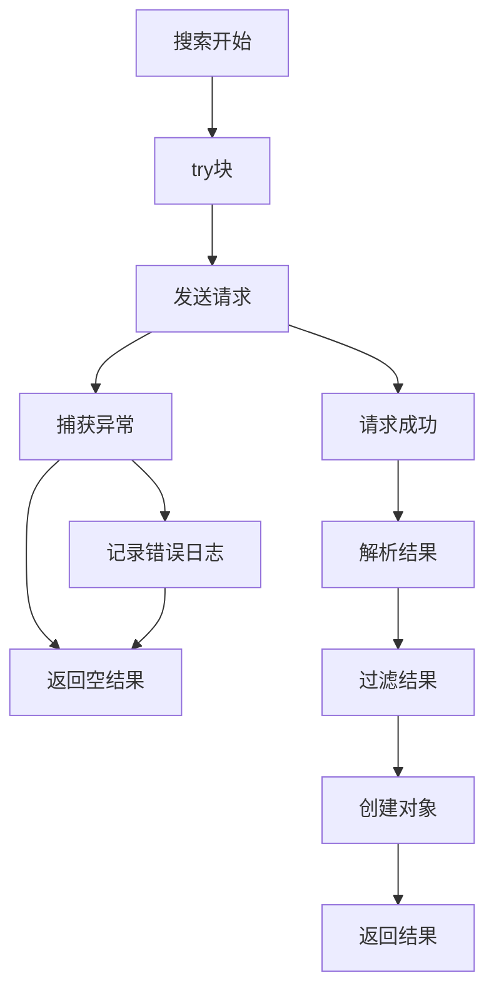
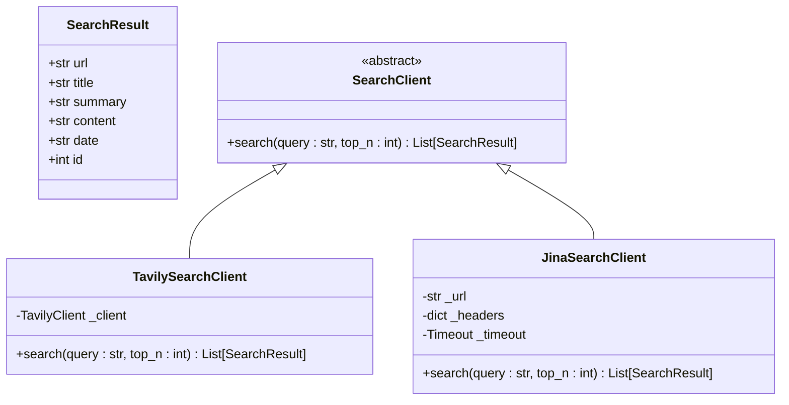
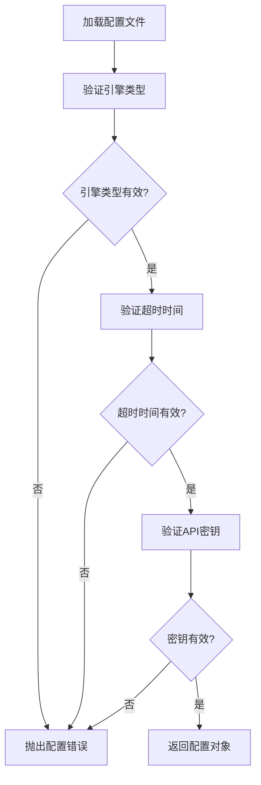
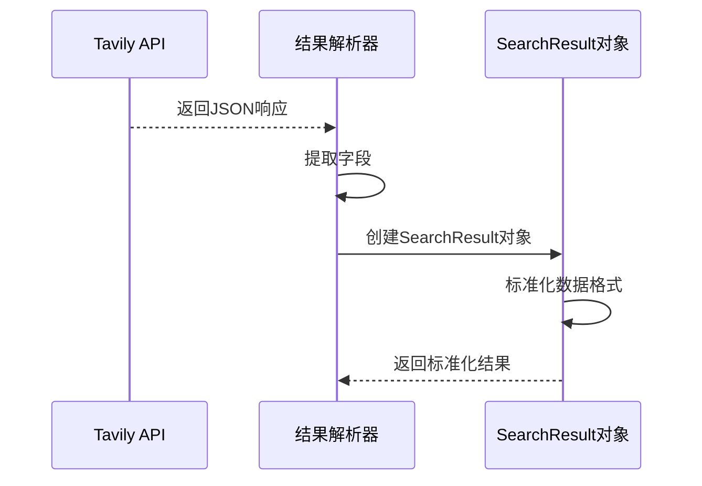
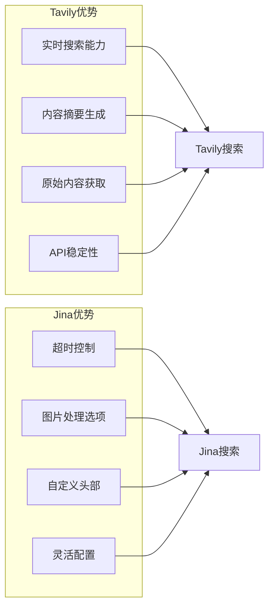
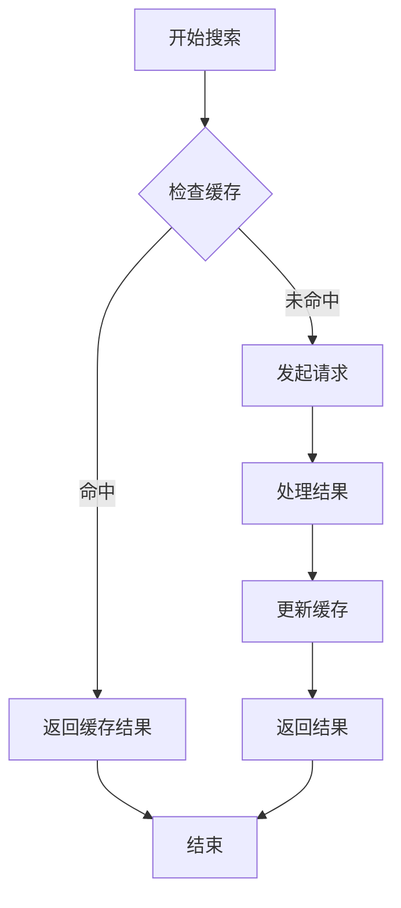

# Tavily搜索引擎集成

<cite>
**本文档中引用的文件**
- [_tavily.py](file://src/deepresearch/tools/_tavily.py)
- [search.py](file://src/deepresearch/tools/search.py)
- [_search.py](file://src/deepresearch/tools/_search.py)
- [_jina.py](file://src/deepresearch/tools/_jina.py)
- [search.toml](file://config/search.toml)
- [search_config.py](file://src/deepresearch/config/search_config.py)
- [base.py](file://src/deepresearch/config/base.py)
- [workflow.toml](file://config/workflow.toml)
- [workflow_config.py](file://src/deepresearch/config/workflow_config.py)
</cite>

## 目录
1. [简介](#简介)
2. [项目结构](#项目结构)
3. [核心组件](#核心组件)
4. [架构概览](#架构概览)
5. [详细组件分析](#详细组件分析)
6. [配置指南](#配置指南)
7. [使用示例](#使用示例)
8. [结果格式与数据结构](#结果格式与数据结构)
9. [与Jina搜索的对比](#与jina搜索的对比)
10. [性能考虑](#性能考虑)
11. [故障排除指南](#故障排除指南)
12. [结论](#结论)

## 简介

DeepResearch框架集成了Tavily搜索引擎，为用户提供高质量的实时搜索能力。TavilySearchClient作为搜索引擎客户端，通过Tavily SDK提供强大的搜索功能，包括实时搜索能力和内容摘要生成。该集成采用工厂模式设计，支持多种搜索引擎的无缝切换，同时保持统一的API接口。

## 项目结构

Tavily搜索引擎集成位于DeepResearch项目的工具模块中，采用分层架构设计：



**图表来源**
- [search.py:1-46](file://src/deepresearch/tools/search.py#L1-L46)
- [_tavily.py:1-72](file://src/deepresearch/tools/_tavily.py#L1-L72)
- [_search.py:1-35](file://src/deepresearch/tools/_search.py#L1-L35)
- [_jina.py:1-92](file://src/deepresearch/tools/_jina.py#L1-L92)

**章节来源**
- [search.py:1-46](file://src/deepresearch/tools/search.py#L1-L46)
- [_tavily.py:1-72](file://src/deepresearch/tools/_tavily.py#L1-L72)
- [_search.py:1-35](file://src/deepresearch/tools/_search.py#L1-L35)

## 核心组件

### TavilySearchClient类

TavilySearchClient是Tavily搜索引擎的主要客户端实现，继承自SearchClient基类。该类封装了Tavily SDK的所有功能，提供了简洁的搜索接口。

**主要特性：**
- 基于Tavily SDK的官方实现
- 支持实时搜索和内容摘要
- 自动处理API密钥和认证
- 错误处理和日志记录
- 结果过滤和数据标准化

### 搜索客户端工厂

SearchClient工厂类实现了统一的搜索接口，根据配置自动选择合适的搜索引擎客户端。

**工厂模式优势：**
- 支持引擎切换（jina/tavily）
- 统一的API接口
- 易于扩展新的搜索引擎
- 配置驱动的引擎选择

**章节来源**
- [_tavily.py:15-60](file://src/deepresearch/tools/_tavily.py#L15-L60)
- [search.py:12-36](file://src/deepresearch/tools/search.py#L12-L36)

## 架构概览

DeepResearch的搜索架构采用了分层设计，确保了代码的可维护性和可扩展性：



**图表来源**
- [search.py:17-23](file://src/deepresearch/tools/search.py#L17-L23)
- [_tavily.py:37-41](file://src/deepresearch/tools/_tavily.py#L37-L41)

## 详细组件分析

### TavilySearchClient实现细节

#### 请求构建流程

TavilySearchClient的search方法实现了完整的请求构建和处理流程：



**图表来源**
- [_tavily.py:32-60](file://src/deepresearch/tools/_tavily.py#L32-L60)

#### 参数配置机制

TavilySearchClient使用以下参数进行搜索配置：

| 参数 | 类型 | 默认值 | 描述 |
|------|------|--------|------|
| query | str | - | 搜索查询字符串 |
| top_n | int | - | 返回结果数量 |
| max_results | int | 1-20 | Tavily API限制范围 |
| include_raw_content | bool | True | 是否包含原始内容 |

#### 错误处理策略

系统实现了多层次的错误处理机制：



**图表来源**
- [_tavily.py:57-58](file://src/deepresearch/tools/_tavily.py#L57-L58)

**章节来源**
- [_tavily.py:18-60](file://src/deepresearch/tools/_tavily.py#L18-L60)

### 搜索结果数据模型

SearchResult数据类定义了统一的结果格式：



**图表来源**
- [_search.py:8-17](file://src/deepresearch/tools/_search.py#L8-L17)
- [_tavily.py:15-16](file://src/deepresearch/tools/_tavily.py#L15-L16)
- [_jina.py:15-16](file://src/deepresearch/tools/_jina.py#L15-L16)

**章节来源**
- [_search.py:8-17](file://src/deepresearch/tools/_search.py#L8-L17)

## 配置指南

### API密钥配置

Tavily搜索引擎需要有效的API密钥才能正常工作。配置文件位于`config/search.toml`：

```toml
[search]
engine = "tavily"           # 搜索引擎选择
timeout = 30               # 超时时间（秒）
jina_api_key = "jina_xxxxxxx-RLKa8AVEHppbFJ"  # Jina API密钥
tavily_api_key = "tvly-xxxxxxx-l2N15UuLUq104H8X"  # Tavily API密钥
```

### 配置验证机制

系统提供了完整的配置验证机制，确保配置的有效性：



**图表来源**
- [search_config.py:35-53](file://src/deepresearch/config/search_config.py#L35-L53)

### 工作流配置

工作流配置文件`config/workflow.toml`控制搜索结果的数量：

```toml
[search]
topN = 5  # 搜索结果数量
```

**章节来源**
- [search.toml:1-6](file://config/search.toml#L1-L6)
- [search_config.py:56-82](file://src/deepresearch/config/search_config.py#L56-L82)
- [workflow.toml:1-3](file://config/workflow.toml#L1-L3)

## 使用示例

### 基本使用方法

```python
from deepresearch.tools.search import SearchClient

# 创建搜索客户端
search_client = SearchClient()

# 执行搜索
results = search_client.search("人工智能发展趋势", 5)

# 处理结果
for result in results:
    print(f"标题: {result.title}")
    print(f"链接: {result.url}")
    print(f"摘要: {result.summary}")
    print("---")
```

### 高级配置示例

```python
from deepresearch.tools._tavily import TavilySearchClient
from deepresearch.config.search_config import search_config

# 直接使用Tavily客户端
client = TavilySearchClient()

# 设置自定义参数
results = client.search(
    query="机器学习最新进展",
    top_n=10  # 最多返回10个结果
)

# 处理搜索结果
for i, result in enumerate(results, 1):
    print(f"结果 {i}:")
    print(f"  标题: {result.title}")
    print(f"  内容长度: {len(result.content)} 字符")
    print(f"  URL: {result.url}")
```

### 错误处理示例

```python
from deepresearch.tools.search import SearchClient

try:
    search_client = SearchClient()
    results = search_client.search("Python编程", 3)
    
    if not results:
        print("未找到搜索结果")
    else:
        print(f"找到 {len(results)} 个结果")
        
except ValueError as e:
    print(f"配置错误: {e}")
except Exception as e:
    print(f"搜索过程中发生错误: {e}")
```

## 结果格式与数据结构

### SearchResult数据结构

每个搜索结果都遵循统一的数据结构：

| 字段名 | 类型 | 描述 | 示例 |
|--------|------|------|------|
| url | str | 搜索结果的URL地址 | "https://example.com/article" |
| title | str | 页面标题 | "人工智能技术发展报告" |
| summary | str | 搜索结果摘要 | "本文讨论了AI技术的发展趋势..." |
| content | str | 完整内容（如果可用） | "详细的技术分析和数据..." |
| date | str | 发布日期 | "2024-01-15" |
| id | int | 结果标识符 | 0, 1, 2, ... |

### 数据获取流程



**图表来源**
- [_tavily.py:42-55](file://src/deepresearch/tools/_tavily.py#L42-L55)

**章节来源**
- [_search.py:8-17](file://src/deepresearch/tools/_search.py#L8-L17)
- [_tavily.py:42-55](file://src/deepresearch/tools/_tavily.py#L42-L55)

## 与Jina搜索的对比

### 功能对比表

| 特性 | Tavily | Jina |
|------|--------|------|
| 实时搜索 | ✅ 支持 | ✅ 支持 |
| 内容摘要 | ✅ 自动生成 | ✅ 支持描述字段 |
| 原始内容 | ✅ 包含 | ✅ 支持 |
| API密钥 | ✅ 需要 | ✅ 需要 |
| 超时控制 | ❌ 固定 | ✅ 可配置 |
| 图片处理 | ❌ 不支持 | ✅ 可禁用 |
| 认证方式 | ✅ Bearer Token | ✅ Bearer Token |

### 性能差异



### 选择建议

**选择Tavily当：**
- 需要高质量的内容摘要
- 重视搜索结果的准确性
- 不需要图片处理功能
- 追求更稳定的API服务

**选择Jina当：**
- 需要精确的超时控制
- 需要灵活的请求配置
- 需要自定义HTTP头部
- 对延迟敏感的应用场景

**章节来源**
- [_tavily.py:37-41](file://src/deepresearch/tools/_tavily.py#L37-L41)
- [_jina.py:44-47](file://src/deepresearch/tools/_jina.py#L44-L47)

## 性能考虑

### 并发处理

TavilySearchClient目前采用同步请求模式，适合单线程应用。对于高并发场景，建议：

1. **连接池管理**：考虑实现连接池以复用HTTP连接
2. **异步支持**：未来版本可以考虑添加异步搜索方法
3. **缓存策略**：对热门查询结果实施缓存机制

### 资源优化



### 错误重试机制

建议实现指数退避的重试策略：
- 最多重试3次
- 初始延迟1秒，每次翻倍
- 仅对网络错误和临时服务器错误重试
- 超时错误直接失败

## 故障排除指南

### 常见问题及解决方案

#### API密钥错误

**症状：** `401 Unauthorized` 或认证失败
**解决方案：**
1. 检查`config/search.toml`中的`tavily_api_key`配置
2. 确认API密钥格式正确（应为`tvly-`开头）
3. 验证API密钥是否已激活

#### 超时问题

**症状：** 请求超时或响应缓慢
**解决方案：**
1. 检查网络连接状态
2. 调整`timeout`配置值
3. 考虑减少`top_n`参数

#### 结果为空

**症状：** 搜索返回空结果列表
**解决方案：**
1. 检查查询语句是否过于具体
2. 尝试简化查询关键词
3. 验证搜索引擎配置

### 日志分析

系统提供了详细的日志记录机制：

```python
# 错误级别日志
logger.error(f"Error in Tavily search: {e}")

# 调试级别日志
logger.debug(f"Search query: {query[:50]}...")
logger.debug(f"Number of results: {len(search_results)}")
```

**章节来源**
- [_tavily.py:57-58](file://src/deepresearch/tools/_tavily.py#L57-L58)
- [_jina.py:71-78](file://src/deepresearch/tools/_jina.py#L71-L78)

## 结论

DeepResearch的Tavily搜索引擎集成为用户提供了强大而灵活的搜索能力。通过工厂模式设计，系统实现了搜索引擎的无缝切换，同时保持了统一的API接口。TavilySearchClient充分利用了Tavily SDK的功能，提供了实时搜索和内容摘要生成功能。

### 主要优势

1. **统一接口**：通过SearchClient工厂类提供一致的API体验
2. **配置驱动**：支持运行时切换不同的搜索引擎
3. **错误处理**：完善的异常处理和日志记录机制
4. **数据标准化**：统一的SearchResult数据结构
5. **易于扩展**：清晰的架构设计便于添加新的搜索引擎

### 未来改进方向

1. **异步支持**：添加异步搜索方法以提高性能
2. **缓存机制**：实现智能缓存以减少重复请求
3. **监控指标**：添加性能监控和统计功能
4. **配置热更新**：支持运行时配置的动态更新
5. **批量搜索**：支持批量查询以提高效率

通过合理配置和使用，Tavily搜索引擎集成为DeepResearch框架提供了可靠的信息检索能力，为后续的深度研究和报告生成奠定了坚实的基础。