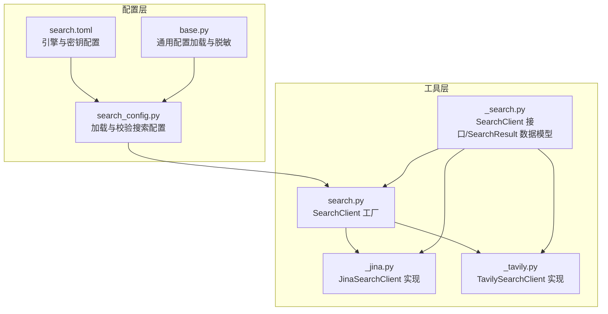
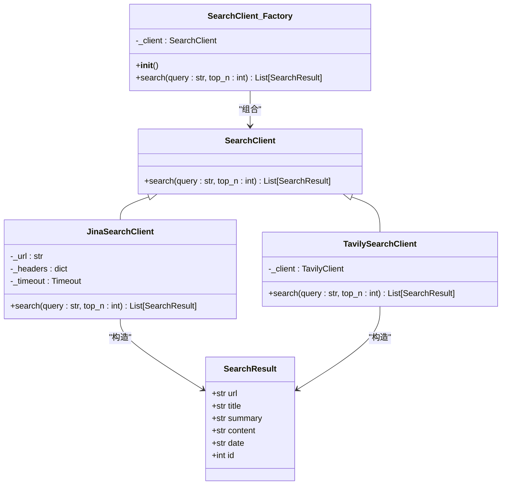
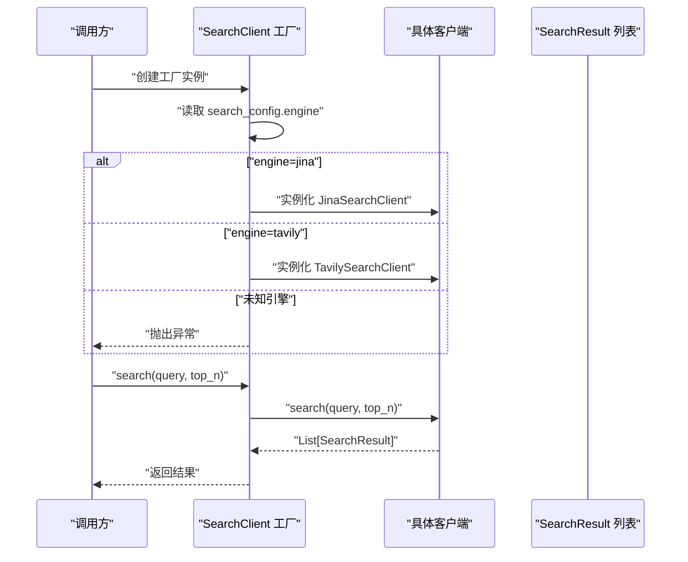
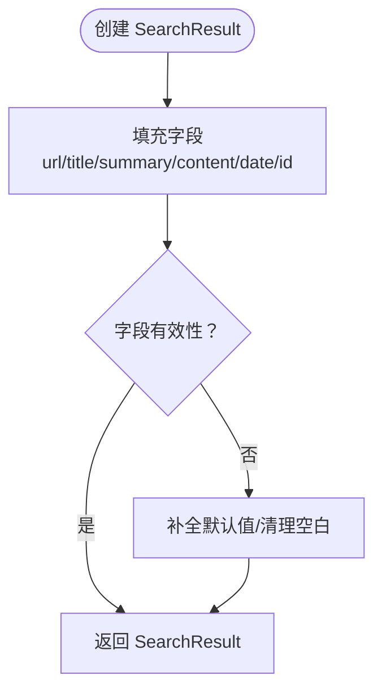
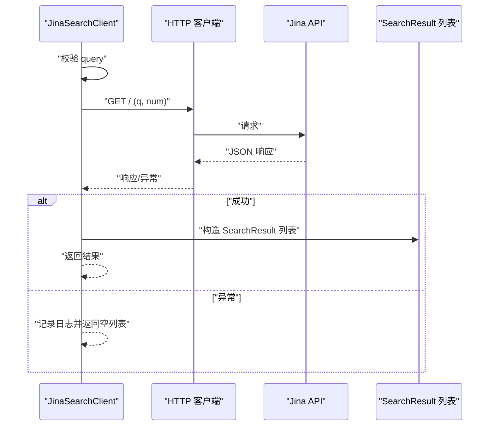
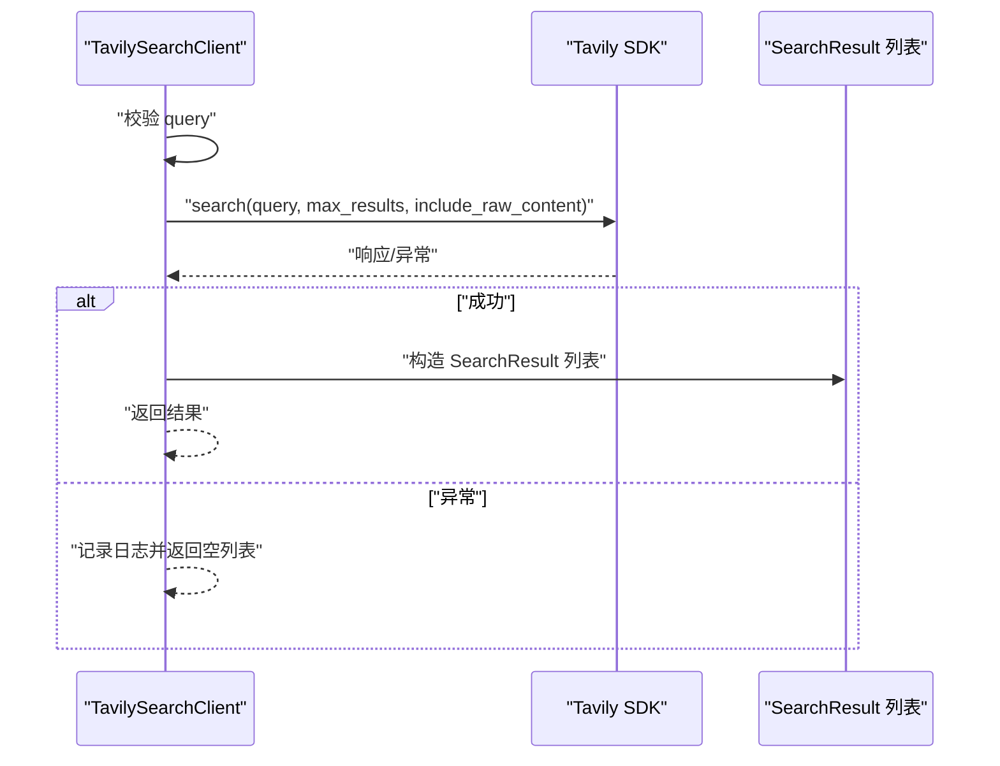
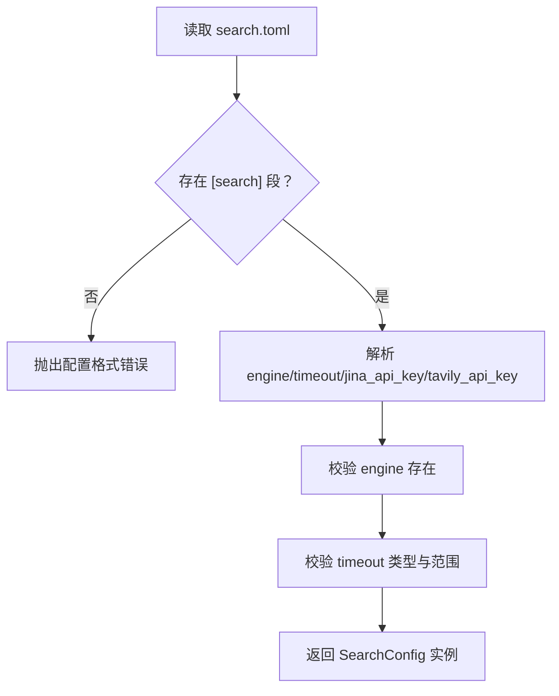
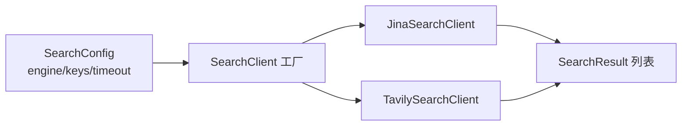

# 搜索客户端工厂

<cite>
**本文引用的文件**
- [src/deepresearch/tools/search.py](file://src/deepresearch/tools/search.py)
- [src/deepresearch/tools/_search.py](file://src/deepresearch/tools/_search.py)
- [src/deepresearch/tools/_jina.py](file://src/deepresearch/tools/_jina.py)
- [src/deepresearch/tools/_tavily.py](file://src/deepresearch/tools/_tavily.py)
- [src/deepresearch/config/search_config.py](file://src/deepresearch/config/search_config.py)
- [config/search.toml](file://config/search.toml)
- [src/deepresearch/config/base.py](file://src/deepresearch/config/base.py)
</cite>

## 目录
1. [简介](#简介)
2. [项目结构](#项目结构)
3. [核心组件](#核心组件)
4. [架构总览](#架构总览)
5. [详细组件分析](#详细组件分析)
6. [依赖关系分析](#依赖关系分析)
7. [性能考量](#性能考量)
8. [故障排查指南](#故障排查指南)
9. [结论](#结论)

## 简介
本文件围绕 DeepResearch 搜索客户端工厂进行深入技术文档编写，重点解释 SearchClient 工厂类的设计模式与实现原理，说明其如何依据配置动态选择不同搜索引擎客户端（Jina 或 Tavily），并详述工厂方法的工作流程、配置检查、客户端实例化与错误处理机制。同时，文档阐述 SearchResult 数据模型的结构与字段定义，并提供工厂类的使用示例与最佳实践，包括异常处理与性能优化建议。

## 项目结构
DeepResearch 的搜索相关代码主要分布在 tools 与 config 两个子包中：
- 工具层（tools）：定义通用搜索接口、具体搜索引擎客户端实现以及工厂类。
- 配置层（config）：负责加载与校验搜索配置，提供全局可用的 search_config 实例。

图表来源
- [src/deepresearch/config/search_config.py:56-82](file://src/deepresearch/config/search_config.py#L56-L82)
- [config/search.toml:1-6](file://config/search.toml#L1-L6)
- [src/deepresearch/tools/search.py:12-36](file://src/deepresearch/tools/search.py#L12-L36)
- [src/deepresearch/tools/_search.py:8-35](file://src/deepresearch/tools/_search.py#L8-L35)
- [src/deepresearch/tools/_jina.py:15-80](file://src/deepresearch/tools/_jina.py#L15-L80)
- [src/deepresearch/tools/_tavily.py:15-61](file://src/deepresearch/tools/_tavily.py#L15-L61)

章节来源
- [src/deepresearch/config/search_config.py:56-82](file://src/deepresearch/config/search_config.py#L56-L82)
- [config/search.toml:1-6](file://config/search.toml#L1-L6)
- [src/deepresearch/tools/search.py:12-36](file://src/deepresearch/tools/search.py#L12-L36)
- [src/deepresearch/tools/_search.py:8-35](file://src/deepresearch/tools/_search.py#L8-L35)
- [src/deepresearch/tools/_jina.py:15-80](file://src/deepresearch/tools/_jina.py#L15-L80)
- [src/deepresearch/tools/_tavily.py:15-61](file://src/deepresearch/tools/_tavily.py#L15-L61)

## 核心组件
- SearchClient 工厂类：根据配置动态选择具体搜索引擎客户端，屏蔽上层调用差异。
- SearchClient 抽象接口：定义统一的 search(query, top_n) 行为契约。
- SearchResult 数据模型：标准化搜索结果字段，便于后续处理与展示。
- JinaSearchClient/TavilySearchClient：具体搜索引擎实现，分别对接 Jina HTTP API 与 Tavily SDK。
- SearchConfig：封装引擎类型、API 密钥与超时等配置项，并提供校验逻辑。
- 配置加载与脱敏：通过通用配置加载器与脱敏工具，保证安全与一致性。

章节来源
- [src/deepresearch/tools/search.py:12-36](file://src/deepresearch/tools/search.py#L12-L36)
- [src/deepresearch/tools/_search.py:8-35](file://src/deepresearch/tools/_search.py#L8-L35)
- [src/deepresearch/tools/_jina.py:15-80](file://src/deepresearch/tools/_jina.py#L15-L80)
- [src/deepresearch/tools/_tavily.py:15-61](file://src/deepresearch/tools/_tavily.py#L15-L61)
- [src/deepresearch/config/search_config.py:12-54](file://src/deepresearch/config/search_config.py#L12-L54)
- [src/deepresearch/config/base.py:479-511](file://src/deepresearch/config/base.py#L479-L511)

## 架构总览
工厂模式在此处体现为：上层业务仅依赖抽象接口 SearchClient，通过工厂类在运行时注入具体实现（Jina 或 Tavily）。配置层提供统一的 SearchConfig，工厂基于该配置选择客户端；客户端内部封装网络请求、参数校验与异常处理，向上返回标准化的 SearchResult 列表。

图表来源
- [src/deepresearch/tools/_search.py:20-35](file://src/deepresearch/tools/_search.py#L20-L35)
- [src/deepresearch/tools/_search.py:8-18](file://src/deepresearch/tools/_search.py#L8-L18)
- [src/deepresearch/tools/search.py:12-36](file://src/deepresearch/tools/search.py#L12-L36)
- [src/deepresearch/tools/_jina.py:15-80](file://src/deepresearch/tools/_jina.py#L15-L80)
- [src/deepresearch/tools/_tavily.py:15-61](file://src/deepresearch/tools/_tavily.py#L15-L61)

## 详细组件分析

### SearchClient 工厂类
- 设计模式：简单工厂（Simple Factory）。在构造阶段依据配置选择具体实现，对外暴露统一接口。
- 关键职责：
  - 读取全局配置 search_config.engine。
  - 条件实例化 JinaSearchClient 或 TavilySearchClient。
  - 在未知引擎时抛出异常，避免静默失败。
  - 将 search(query, top_n) 请求转发给具体客户端。
- 配置检查：
  - 依赖 search_config.engine 的值进行分支判断。
  - 依赖 search_config.timeout 与 API 密钥在具体客户端内部生效。
- 错误处理：
  - 工厂层在未知引擎时显式抛错，便于快速定位配置问题。
  - 具体客户端内部捕获网络与解析异常并记录日志，返回空列表或部分结果，保证健壮性。

图表来源
- [src/deepresearch/tools/search.py:17-23](file://src/deepresearch/tools/search.py#L17-L23)
- [src/deepresearch/tools/search.py:25-36](file://src/deepresearch/tools/search.py#L25-L36)
- [src/deepresearch/config/search_config.py:81-82](file://src/deepresearch/config/search_config.py#L81-L82)

章节来源
- [src/deepresearch/tools/search.py:12-36](file://src/deepresearch/tools/search.py#L12-L36)
- [src/deepresearch/config/search_config.py:81-82](file://src/deepresearch/config/search_config.py#L81-L82)

### SearchClient 抽象接口与 SearchResult 数据模型
- SearchClient 抽象接口：
  - 定义统一的 search(query, top_n) 方法签名，约束实现类的行为。
  - 未实现时抛出 NotImplementedError，强制子类覆盖。
- SearchResult 数据模型：
  - 字段：url、title、summary、content、date（可选）、id（可选）。
  - 采用 dataclass(kw_only=True)，强调关键字参数与不可变语义。
  - 作为跨客户端统一的数据载体，便于上层处理与序列化。

图表来源
- [src/deepresearch/tools/_search.py:8-18](file://src/deepresearch/tools/_search.py#L8-L18)

章节来源
- [src/deepresearch/tools/_search.py:8-35](file://src/deepresearch/tools/_search.py#L8-L35)

### JinaSearchClient 客户端实现
- 关键点：
  - 使用 httpx 发起 GET 请求至 Jina API，携带 Authorization、Accept、X-Retain-Images、X-Timeout 等头部。
  - 参数范围控制：top_n 限定在 1-20 区间，防止越界。
  - 异常处理：捕获超时、HTTP 错误、请求错误与通用异常，记录日志并返回空列表。
  - 结果映射：遍历返回数据，构造 SearchResult 列表，过滤无效 URL。

图表来源
- [src/deepresearch/tools/_jina.py:28-79](file://src/deepresearch/tools/_jina.py#L28-L79)

章节来源
- [src/deepresearch/tools/_jina.py:15-80](file://src/deepresearch/tools/_jina.py#L15-L80)

### TavilySearchClient 客户端实现
- 关键点：
  - 使用 tavily SDK 初始化客户端，传入 API 密钥。
  - 参数范围控制：top_n 限定在 1-20 区间。
  - 结果映射：遍历 results，构造 SearchResult，提取 raw_content 作为 content。
  - 异常处理：捕获通用异常并记录日志，返回空列表。

图表来源
- [src/deepresearch/tools/_tavily.py:21-60](file://src/deepresearch/tools/_tavily.py#L21-L60)

章节来源
- [src/deepresearch/tools/_tavily.py:15-61](file://src/deepresearch/tools/_tavily.py#L15-L61)

### 配置加载与校验（SearchConfig）
- 配置来源与优先级：
  - 通过 load_toml_config 读取 config/search.toml。
  - 期望包含 [search] 段落，否则抛出异常。
  - engine 为必填项；timeout 支持默认值与范围校验（1-300 秒）。
- 脱敏与安全：
  - redact_config 提供敏感字段脱敏能力，隐藏 API 密钥等信息。
- 全局实例：
  - search_config = load_search_config() 提供全局访问。

图表来源
- [src/deepresearch/config/search_config.py:56-82](file://src/deepresearch/config/search_config.py#L56-L82)
- [config/search.toml:1-6](file://config/search.toml#L1-L6)
- [src/deepresearch/config/base.py:479-511](file://src/deepresearch/config/base.py#L479-L511)

章节来源
- [src/deepresearch/config/search_config.py:12-82](file://src/deepresearch/config/search_config.py#L12-L82)
- [config/search.toml:1-6](file://config/search.toml#L1-L6)
- [src/deepresearch/config/base.py:479-511](file://src/deepresearch/config/base.py#L479-L511)

## 依赖关系分析
- 工厂依赖配置：工厂在初始化时读取 search_config.engine，决定具体实现。
- 客户端依赖配置：JinaSearchClient 使用 jina_api_key 与 timeout；TavilySearchClient 使用 tavily_api_key。
- 客户端依赖第三方库：JinaSearchClient 使用 httpx；TavilySearchClient 使用 tavily SDK。
- 数据模型依赖：所有客户端均返回 SearchResult 列表，保持上层处理一致性。

图表来源
- [src/deepresearch/config/search_config.py:12-54](file://src/deepresearch/config/search_config.py#L12-L54)
- [src/deepresearch/tools/search.py:17-23](file://src/deepresearch/tools/search.py#L17-L23)
- [src/deepresearch/tools/_jina.py:18-26](file://src/deepresearch/tools/_jina.py#L18-L26)
- [src/deepresearch/tools/_tavily.py:18-19](file://src/deepresearch/tools/_tavily.py#L18-L19)
- [src/deepresearch/tools/_search.py:8-18](file://src/deepresearch/tools/_search.py#L8-L18)

章节来源
- [src/deepresearch/tools/search.py:12-36](file://src/deepresearch/tools/search.py#L12-L36)
- [src/deepresearch/tools/_jina.py:15-26](file://src/deepresearch/tools/_jina.py#L15-L26)
- [src/deepresearch/tools/_tavily.py:15-19](file://src/deepresearch/tools/_tavily.py#L15-L19)
- [src/deepresearch/tools/_search.py:8-18](file://src/deepresearch/tools/_search.py#L8-L18)

## 性能考量
- 超时控制：JinaSearchClient 使用 search_config.timeout 构造 httpx.Timeout，避免长时间阻塞；TavilySearchClient 由 SDK 内部处理超时策略。
- 结果数量限制：两端均将 top_n 限制在 1-20，减少网络开销与解析成本。
- 连接复用：JinaSearchClient 使用 with 上下文创建一次性客户端，避免连接泄漏；如需高频调用，可考虑复用客户端并配合连接池策略。
- 日志与可观测性：客户端内部记录异常日志，便于定位性能瓶颈与失败原因。
- 配置缓存：通用配置加载器使用 LRU 缓存 TOML 文件，降低重复读取开销。

章节来源
- [src/deepresearch/tools/_jina.py:26-26](file://src/deepresearch/tools/_jina.py#L26-L26)
- [src/deepresearch/tools/_jina.py:48-54](file://src/deepresearch/tools/_jina.py#L48-L54)
- [src/deepresearch/tools/_tavily.py:37-41](file://src/deepresearch/tools/_tavily.py#L37-L41)
- [src/deepresearch/config/base.py:459-472](file://src/deepresearch/config/base.py#L459-L472)

## 故障排查指南
- 配置错误
  - 缺少 [search] 段：检查 search.toml 格式，确保包含 [search]。
  - 缺少 engine 字段：在 [search] 下添加 engine = "jina" 或 "tavily"。
  - timeout 非法：确保 timeout 为 1-300 的整数。
- 引擎选择异常
  - 未知引擎：确认 engine 值正确且大小写符合要求。
- Jina 相关问题
  - 认证失败：检查 jina_api_key 是否正确。
  - 超时或网络错误：检查网络连通性与 timeout 设置。
- Tavily 相关问题
  - 认证失败：检查 tavily_api_key 是否正确。
  - SDK 异常：查看日志中的异常堆栈，定位具体错误。
- 结果为空
  - query 为空或空白：确保传入非空查询。
  - 返回数据中缺少有效 URL：客户端会跳过无效 URL，确认目标站点可被检索。

章节来源
- [src/deepresearch/config/search_config.py:67-72](file://src/deepresearch/config/search_config.py#L67-L72)
- [src/deepresearch/config/search_config.py:35-53](file://src/deepresearch/config/search_config.py#L35-L53)
- [src/deepresearch/tools/search.py:22-23](file://src/deepresearch/tools/search.py#L22-L23)
- [src/deepresearch/tools/_jina.py:71-78](file://src/deepresearch/tools/_jina.py#L71-L78)
- [src/deepresearch/tools/_tavily.py:57-58](file://src/deepresearch/tools/_tavily.py#L57-L58)

## 结论
SearchClient 工厂通过简单工厂模式与配置驱动的方式，实现了搜索引擎的可插拔扩展。SearchResult 数据模型提供了统一的结果载体，保障了上层处理的一致性。Jina 与 Tavily 两种实现分别面向 HTTP API 与 SDK 场景，具备完善的参数校验与异常处理机制。结合配置加载与脱敏工具，系统在安全性、可维护性与性能方面均具备良好表现。建议在生产环境中严格校验配置、合理设置超时与结果数量上限，并通过日志与监控持续观察客户端行为。