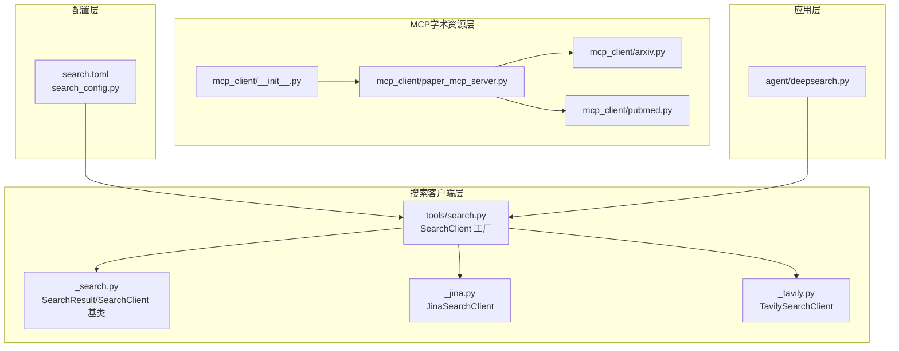
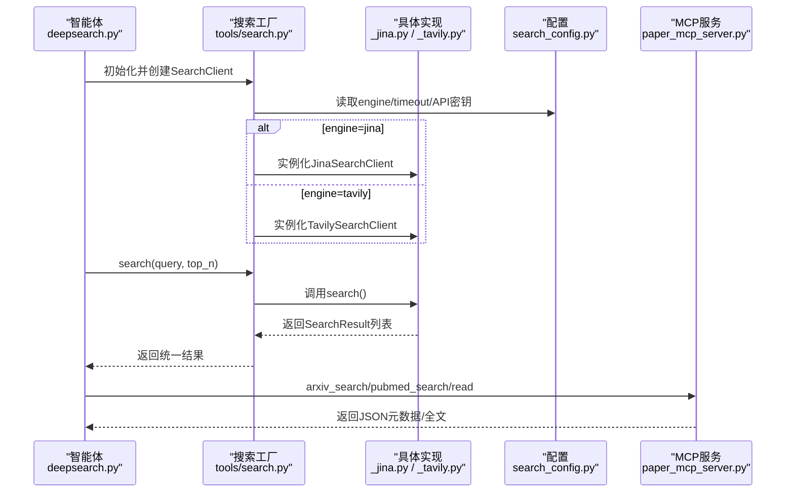
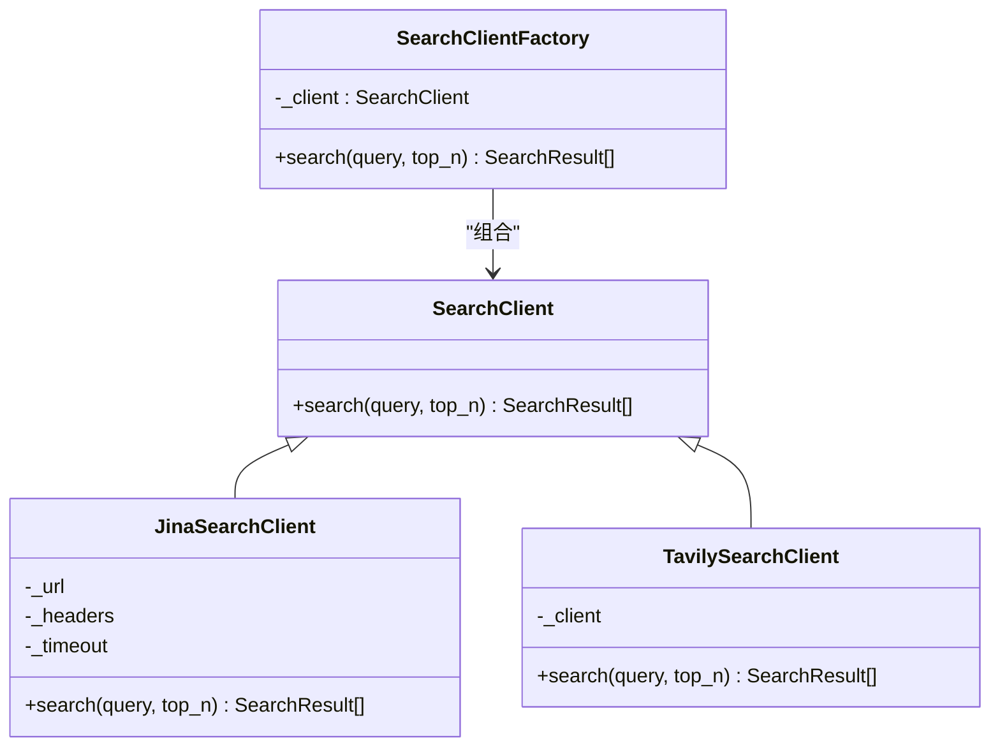
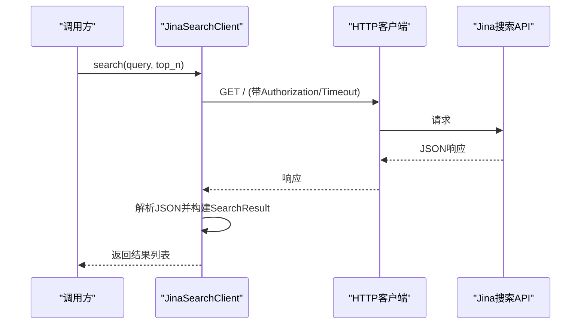
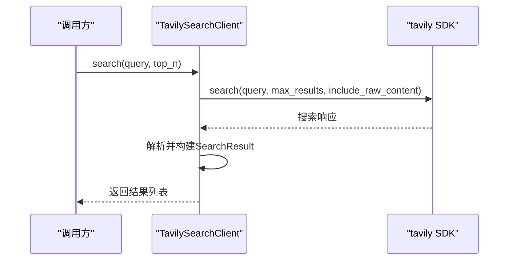
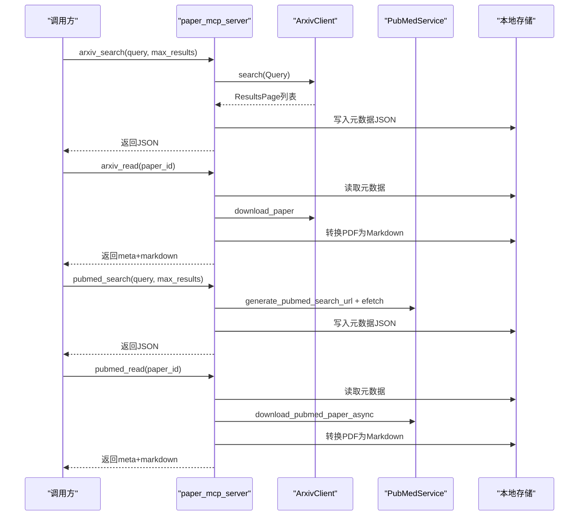
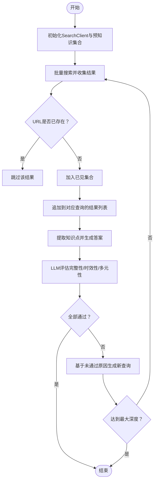
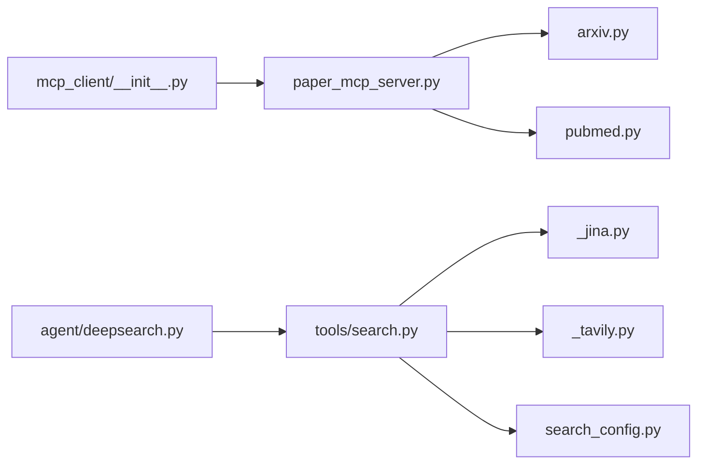

# 搜索工具集成

<cite>
**本文引用的文件**
- [search.py](file://src/deepresearch/tools/search.py)
- [_search.py](file://src/deepresearch/tools/_search.py)
- [_jina.py](file://src/deepresearch/tools/_jina.py)
- [_tavily.py](file://src/deepresearch/tools/_tavily.py)
- [search.toml](file://config/search.toml)
- [search_config.py](file://src/deepresearch/config/search_config.py)
- [paper_mcp_server.py](file://src/deepresearch/mcp_client/paper_mcp_server.py)
- [arxiv.py](file://src/deepresearch/mcp_client/arxiv.py)
- [pubmed.py](file://src/deepresearch/mcp_client/pubmed.py)
- [__init__.py（mcp_client）](file://src/deepresearch/mcp_client/__init__.py)
- [deepsearch.py](file://src/deepresearch/agent/deepsearch.py)
- [test_mcp.py](file://tests/unit/mcp_client/test_mcp.py)
</cite>

## 目录
1. [简介](#简介)
2. [项目结构](#项目结构)
3. [核心组件](#核心组件)
4. [架构总览](#架构总览)
5. [详细组件分析](#详细组件分析)
6. [依赖分析](#依赖分析)
7. [性能考虑](#性能考虑)
8. [故障排查指南](#故障排查指南)
9. [结论](#结论)
10. [附录](#附录)

## 简介
本文件面向DeepResearch搜索工具集成，系统性阐述以下内容：
- 搜索客户端工厂的设计与实现，如何通过统一接口适配多种搜索引擎。
- Jina搜索引擎的集成技术实现与API使用方法。
- Tavily搜索引擎的集成方式与配置选项。
- MCP客户端实现原理，包括Arxiv与Pubmed的学术资源获取机制。
- 搜索结果处理、去重算法与质量评估策略。
- 搜索引擎切换与自定义扩展方法。

## 项目结构
本项目采用“按功能域分层”的组织方式，搜索相关能力集中在tools与mcp_client两个子模块中；配置通过独立的search.toml与search_config加载；上层智能体在agent中调用统一的SearchClient进行检索。

**图表来源**
- [search.py:12-36](file://src/deepresearch/tools/search.py#L12-L36)
- [_search.py:20-35](file://src/deepresearch/tools/_search.py#L20-L35)
- [_jina.py:15-79](file://src/deepresearch/tools/_jina.py#L15-L79)
- [_tavily.py:15-60](file://src/deepresearch/tools/_tavily.py#L15-L60)
- [paper_mcp_server.py:25-33](file://src/deepresearch/mcp_client/paper_mcp_server.py#L25-L33)
- [arxiv.py:208-456](file://src/deepresearch/mcp_client/arxiv.py#L208-L456)
- [pubmed.py:65-480](file://src/deepresearch/mcp_client/pubmed.py#L65-L480)
- [search.toml:1-6](file://config/search.toml#L1-L6)
- [search_config.py:56-82](file://src/deepresearch/config/search_config.py#L56-L82)
- [deepsearch.py:55-80](file://src/deepresearch/agent/deepsearch.py#L55-L80)

**章节来源**
- [search.py:12-36](file://src/deepresearch/tools/search.py#L12-L36)
- [search.toml:1-6](file://config/search.toml#L1-L6)
- [search_config.py:56-82](file://src/deepresearch/config/search_config.py#L56-L82)

## 核心组件
- 统一接口基类：SearchClient与SearchResult，定义标准数据结构与抽象方法，确保不同搜索引擎实现的一致性。
- 搜索客户端工厂：根据配置选择具体搜索引擎实现（Jina或Tavily），屏蔽外部差异。
- 配置加载：从search.toml读取engine、timeout、API密钥等参数，提供校验与脱敏输出。
- MCP学术资源服务：提供Arxiv与Pubmed的搜索与阅读能力，支持元数据缓存、PDF下载与Markdown转换。

**章节来源**
- [_search.py:8-35](file://src/deepresearch/tools/_search.py#L8-L35)
- [search.py:12-36](file://src/deepresearch/tools/search.py#L12-L36)
- [search_config.py:12-53](file://src/deepresearch/config/search_config.py#L12-L53)
- [paper_mcp_server.py:361-431](file://src/deepresearch/mcp_client/paper_mcp_server.py#L361-L431)

## 架构总览
下图展示从应用层到搜索引擎与学术资源的调用链路，以及工厂模式如何实现多引擎切换。

**图表来源**
- [deepsearch.py:65-80](file://src/deepresearch/agent/deepsearch.py#L65-L80)
- [search.py:17-23](file://src/deepresearch/tools/search.py#L17-L23)
- [_jina.py:18-26](file://src/deepresearch/tools/_jina.py#L18-L26)
- [_tavily.py:18-19](file://src/deepresearch/tools/_tavily.py#L18-L19)
- [search_config.py:81-82](file://src/deepresearch/config/search_config.py#L81-L82)
- [paper_mcp_server.py:45-104](file://src/deepresearch/mcp_client/paper_mcp_server.py#L45-L104)

## 详细组件分析

### 搜索客户端工厂（SearchClient 工厂）
- 设计要点
  - 通过配置项engine决定实例化JinaSearchClient或TavilySearchClient。
  - 统一对外接口search(query, top_n)，返回SearchResult列表。
  - 对未知engine抛出异常，避免静默失败。
- 使用流程
  - 应用层仅依赖tools.search.SearchClient，无需关心具体实现细节。
  - 配置层负责提供engine与API密钥等参数。

**图表来源**
- [_search.py:20-35](file://src/deepresearch/tools/_search.py#L20-L35)
- [_jina.py:15-79](file://src/deepresearch/tools/_jina.py#L15-L79)
- [_tavily.py:15-60](file://src/deepresearch/tools/_tavily.py#L15-L60)
- [search.py:12-36](file://src/deepresearch/tools/search.py#L12-L36)

**章节来源**
- [search.py:12-36](file://src/deepresearch/tools/search.py#L12-L36)

### Jina搜索引擎集成
- 技术实现
  - 通过HTTP GET访问Jina搜索端点，携带Authorization与超时控制头。
  - 将返回的JSON数据映射为SearchResult对象，字段包括url、title、summary、content、date、id。
  - 对异常进行日志记录，保证调用方稳定。
- API使用方法
  - 从search_config读取jina_api_key与timeout，构造请求头与超时。
  - 参数q为查询词，num限制在[1,20]区间。
- 错误处理
  - 捕获超时、HTTP状态错误与通用请求错误，记录日志并返回空列表。

**图表来源**
- [_jina.py:28-79](file://src/deepresearch/tools/_jina.py#L28-L79)

**章节来源**
- [_jina.py:15-79](file://src/deepresearch/tools/_jina.py#L15-L79)
- [search_config.py:12-53](file://src/deepresearch/config/search_config.py#L12-L53)

### Tavily搜索引擎集成
- 集成方式
  - 使用tavily SDK初始化客户端，传入tavily_api_key。
  - 调用search接口，设置max_results在[1,20]范围内，并开启include_raw_content。
- 结果映射
  - 将每个结果的url、title、content、raw_content等字段映射到SearchResult。
- 配置选项
  - 从search_config读取tavily_api_key与timeout，其中timeout用于HTTP请求超时控制。

**图表来源**
- [_tavily.py:21-60](file://src/deepresearch/tools/_tavily.py#L21-L60)

**章节来源**
- [_tavily.py:15-60](file://src/deepresearch/tools/_tavily.py#L15-L60)
- [search_config.py:12-53](file://src/deepresearch/config/search_config.py#L12-L53)

### MCP客户端与学术资源获取
- 实现原理
  - paper_mcp_server提供四个工具函数：arxiv_search、arxiv_read、pubmed_search、pubmed_read。
  - 通过MCP协议暴露工具清单与调用入口，支持同步包装器。
  - 使用异步httpx客户端提升并发效率，本地存储论文元数据与PDF。
- Arxiv集成
  - arxiv.py封装Query、Feed、Entry等模型，支持分页、排序与节流。
  - paper_mcp_server调用ArxivClient.search与download_paper，结合pymupdf4llm生成Markdown。
- Pubmed集成
  - pubmed.py封装PubMedService，提供搜索、抓取、下载PDF（Sci-Hub）与异步版本。
  - paper_mcp_server通过generate_pubmed_search_url与efetch获取XML并解析为论文元数据。

**图表来源**
- [paper_mcp_server.py:45-104](file://src/deepresearch/mcp_client/paper_mcp_server.py#L45-L104)
- [paper_mcp_server.py:178-249](file://src/deepresearch/mcp_client/paper_mcp_server.py#L178-L249)
- [paper_mcp_server.py:354-358](file://src/deepresearch/mcp_client/paper_mcp_server.py#L354-L358)
- [arxiv.py:208-456](file://src/deepresearch/mcp_client/arxiv.py#L208-L456)
- [pubmed.py:65-480](file://src/deepresearch/mcp_client/pubmed.py#L65-L480)

**章节来源**
- [paper_mcp_server.py:25-33](file://src/deepresearch/mcp_client/paper_mcp_server.py#L25-L33)
- [arxiv.py:208-456](file://src/deepresearch/mcp_client/arxiv.py#L208-L456)
- [pubmed.py:65-480](file://src/deepresearch/mcp_client/pubmed.py#L65-L480)

### 搜索结果处理、去重与质量评估
- 去重算法
  - 在deepsearch.py中，使用集合记录已见过的url，重复链接直接跳过，避免重复学习与浪费资源。
- 质量评估
  - 通过LLM对生成答案进行三维度评估：完整性、时效性、多元性。
  - 若评估未通过，基于原因生成新的查询，进入递归深度搜索以完善知识。
- 结果聚合
  - 将各轮次搜索结果按查询键聚合，形成search_result字典，便于后续学习与总结。

**图表来源**
- [deepsearch.py:82-149](file://src/deepresearch/agent/deepsearch.py#L82-L149)

**章节来源**
- [deepsearch.py:82-149](file://src/deepresearch/agent/deepsearch.py#L82-L149)

### 引擎切换与自定义扩展
- 切换方法
  - 修改search.toml中的engine字段为"jina"或"tavily"，重启应用后生效。
  - 可同时配置timeout与API密钥，确保不同引擎的连接稳定性。
- 自定义扩展步骤
  - 新建类继承SearchClient，实现search方法，返回SearchResult列表。
  - 在tools/search.py的工厂分支中增加elif分支，按engine返回新实例。
  - 在search_config中添加必要配置项（如API密钥、超时等）。
  - 如需MCP扩展，参考paper_mcp_server的工具注册与调用模式，新增工具函数并更新__all__导出。

**章节来源**
- [search.toml:1-6](file://config/search.toml#L1-L6)
- [search.py:17-23](file://src/deepresearch/tools/search.py#L17-L23)
- [search_config.py:12-53](file://src/deepresearch/config/search_config.py#L12-L53)
- [paper_mcp_server.py:361-431](file://src/deepresearch/mcp_client/paper_mcp_server.py#L361-L431)

## 依赖分析
- 组件耦合
  - tools.search.SearchClient工厂与具体实现松耦合，通过SearchClient基类解耦。
  - 配置层与实现层通过search_config解耦，便于热切换与环境隔离。
  - MCP服务与Arxiv/Pubmed实现通过paper_mcp_server集中编排。
- 外部依赖
  - Jina依赖HTTP客户端与JSON解析。
  - Tavily依赖tavily SDK。
  - MCP服务依赖httpx、lxml、mcp协议库与可选的pymupdf4llm。
- 潜在循环依赖
  - 当前模块间为单向依赖，未发现循环导入。

**图表来源**
- [search.py:4-7](file://src/deepresearch/tools/search.py#L4-L7)
- [_jina.py:9-10](file://src/deepresearch/tools/_jina.py#L9-L10)
- [_tavily.py:9-10](file://src/deepresearch/tools/_tavily.py#L9-L10)
- [search_config.py:7](file://src/deepresearch/config/search_config.py#L7)
- [paper_mcp_server.py:25-27](file://src/deepresearch/mcp_client/paper_mcp_server.py#L25-L27)
- [arxiv.py:1-12](file://src/deepresearch/mcp_client/arxiv.py#L1-L12)
- [pubmed.py:1-11](file://src/deepresearch/mcp_client/pubmed.py#L1-L11)
- [deepsearch.py:18](file://src/deepresearch/agent/deepsearch.py#L18)

**章节来源**
- [search.py:4-7](file://src/deepresearch/tools/search.py#L4-L7)
- [paper_mcp_server.py:25-27](file://src/deepresearch/mcp_client/paper_mcp_server.py#L25-L27)

## 性能考虑
- 连接与超时
  - Jina/Tavily均使用可配置超时，避免长时间阻塞。
  - MCP服务使用异步httpx客户端，提升并发吞吐。
- 分页与节流
  - Arxiv客户端支持分页与指数退避节流，降低被限速风险。
- 缓存与复用
  - MCP服务将元数据写入本地JSON，PDF与Markdown按需生成并缓存，减少重复下载与转换开销。
- 并发执行
  - 智能体内部使用线程池并发执行任务，提高整体效率。

[本节为通用性能建议，不直接分析具体文件]

## 故障排查指南
- 配置问题
  - 确认search.toml中engine字段合法（"jina"或"tavily"），timeout在有效范围。
  - 检查API密钥是否正确配置，避免认证失败。
- Jina错误
  - 关注超时、HTTP状态码与请求异常日志，定位网络或配额问题。
- Tavily错误
  - 检查SDK可用性与网络连通性，确认max_results在[1,20]范围内。
- MCP工具
  - 确保pymupdf4llm已安装，否则无法生成Markdown。
  - 检查本地存储目录权限与磁盘空间。
- 单元测试
  - 使用test_mcp.py验证Arxiv与Pubmed的搜索与读取流程，若失败可跳过并检查网络与依赖。

**章节来源**
- [search_config.py:40-53](file://src/deepresearch/config/search_config.py#L40-L53)
- [_jina.py:71-78](file://src/deepresearch/tools/_jina.py#L71-L78)
- [_tavily.py:57-58](file://src/deepresearch/tools/_tavily.py#L57-L58)
- [paper_mcp_server.py:148-155](file://src/deepresearch/mcp_client/paper_mcp_server.py#L148-L155)
- [test_mcp.py:41-92](file://tests/unit/mcp_client/test_mcp.py#L41-L92)

## 结论
本集成方案通过统一接口与工厂模式实现了多搜索引擎的无缝切换，配合MCP学术资源服务与智能体的质量评估机制，形成了从检索、去重、学习到评估的完整闭环。通过合理的配置管理与错误处理，系统具备良好的可维护性与扩展性。

[本节为总结性内容，不直接分析具体文件]

## 附录
- 配置文件位置与示例字段
  - [search.toml:1-6](file://config/search.toml#L1-L6)
- 导出入口
  - [mcp_client/__init__.py:5-7](file://src/deepresearch/mcp_client/__init__.py#L5-L7)