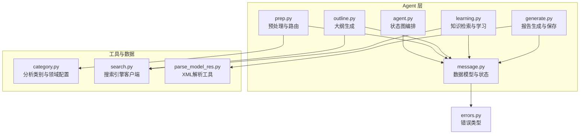
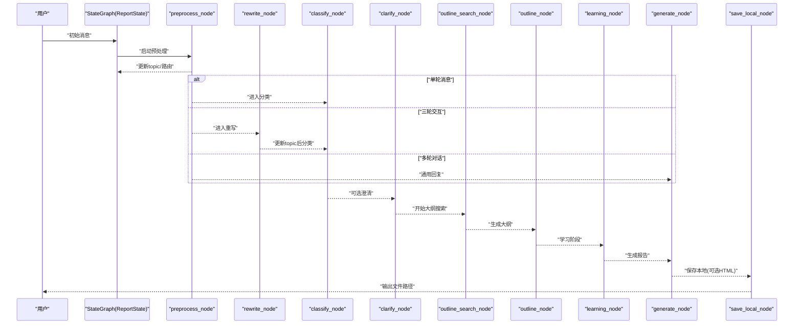
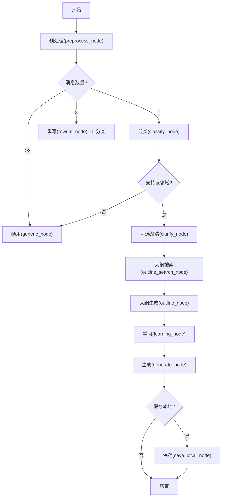
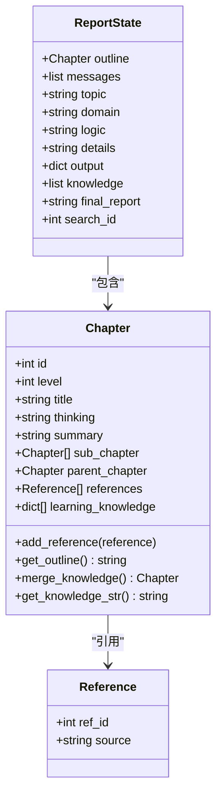
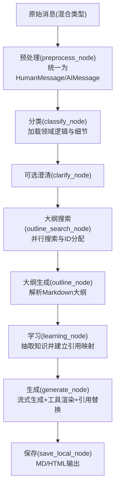
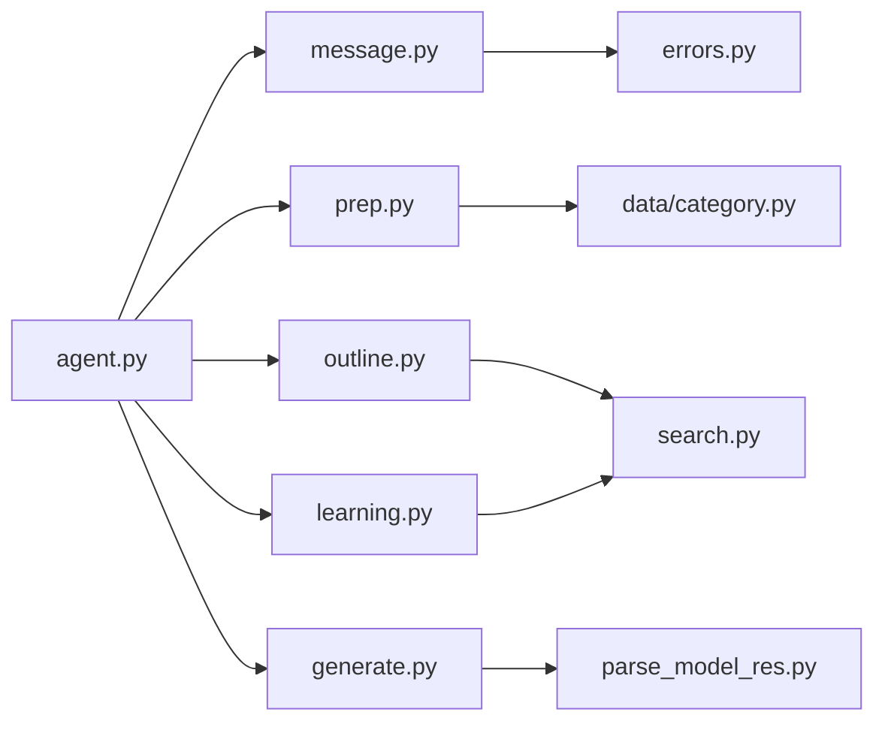

# 数据模型与状态管理

<cite>
**本文档引用的文件**
- [message.py](file://src/deepresearch/agent/message.py)
- [agent.py](file://src/deepresearch/agent/agent.py)
- [generate.py](file://src/deepresearch/agent/generate.py)
- [learning.py](file://src/deepresearch/agent/learning.py)
- [outline.py](file://src/deepresearch/agent/outline.py)
- [prep.py](file://src/deepresearch/agent/prep.py)
- [category.py](file://src/deepresearch/data/category.py)
- [search.py](file://src/deepresearch/tools/search.py)
- [parse_model_res.py](file://src/deepresearch/utils/parse_model_res.py)
- [errors.py](file://src/deepresearch/errors.py)
</cite>

## 目录
1. [简介](#简介)
2. [项目结构](#项目结构)
3. [核心组件](#核心组件)
4. [架构总览](#架构总览)
5. [详细组件分析](#详细组件分析)
6. [依赖分析](#依赖分析)
7. [性能考量](#性能考量)
8. [故障排查指南](#故障排查指南)
9. [结论](#结论)
10. [附录](#附录)

## 简介
本文件聚焦于DeepResearch项目中的数据模型与状态管理，系统性阐述以下主题：
- ReportState状态定义与状态转换规则
- 章节与参考文献的数据模型结构（Chapter与Reference类设计与关系）
- 消息传递机制（消息格式、序列化与反序列化）
- 状态持久化与恢复机制现状与建议
- 数据验证规则、业务规则约束与数据完整性保障
- 数据模型扩展与自定义字段添加方法

## 项目结构
本项目采用“按功能域分层”的组织方式：数据模型与状态位于agent子模块；工作流编排在agent顶层；提示词模板与工具位于prompts与tools目录；分类与领域逻辑在data目录；错误类型在errors中集中定义。

图表来源
- [agent.py:19-45](file://src/deepresearch/agent/agent.py#L19-L45)
- [message.py:101-112](file://src/deepresearch/agent/message.py#L101-L112)
- [prep.py:105-151](file://src/deepresearch/agent/prep.py#L105-L151)
- [outline.py:88-118](file://src/deepresearch/agent/outline.py#L88-L118)
- [learning.py:15-93](file://src/deepresearch/agent/learning.py#L15-L93)
- [generate.py:26-123](file://src/deepresearch/agent/generate.py#L26-L123)
- [category.py:74-104](file://src/deepresearch/data/category.py#L74-L104)
- [search.py:12-36](file://src/deepresearch/tools/search.py#L12-L36)
- [parse_model_res.py:13-27](file://src/deepresearch/utils/parse_model_res.py#L13-L27)
- [errors.py:4-26](file://src/deepresearch/errors.py#L4-L26)

章节来源
- [agent.py:19-45](file://src/deepresearch/agent/agent.py#L19-L45)
- [message.py:101-112](file://src/deepresearch/agent/message.py#L101-L112)

## 核心组件
- ReportState：LangGraph消息状态的扩展，承载报告生成全流程的状态数据，包括大纲、消息历史、主题、领域、逻辑步骤、细节、输出、知识库、最终报告与搜索ID等。
- Chapter：报告大纲的树形结构，包含层级、标题、思考、摘要、子章节、父章节、引用列表与学习知识等字段，并提供大纲导出、知识合并与序列化等方法。
- Reference：引用条目，包含引用ID与来源信息。
- 工作流节点：预处理、重写、分类、澄清、大纲搜索、大纲生成、学习、生成、保存本地等节点协同完成状态流转。

章节来源
- [message.py:12-112](file://src/deepresearch/agent/message.py#L12-L112)
- [agent.py:19-45](file://src/deepresearch/agent/agent.py#L19-L45)

## 架构总览
下图展示从输入消息到最终报告保存的端到端流程，以及状态在各节点之间的传递与更新。

图表来源
- [agent.py:19-45](file://src/deepresearch/agent/agent.py#L19-L45)
- [prep.py:21-80](file://src/deepresearch/agent/prep.py#L21-L80)
- [outline.py:22-86](file://src/deepresearch/agent/outline.py#L22-L86)
- [outline.py:88-118](file://src/deepresearch/agent/outline.py#L88-L118)
- [learning.py:15-93](file://src/deepresearch/agent/learning.py#L15-L93)
- [generate.py:26-123](file://src/deepresearch/agent/generate.py#L26-L123)
- [generate.py:125-160](file://src/deepresearch/agent/generate.py#L125-L160)

## 详细组件分析

### ReportState状态定义与转换规则
- 定义要点
  - 继承自MessagesState，具备消息历史的通用能力。
  - 关键字段：outline（大纲树）、messages（消息历史）、topic（主题）、domain（领域）、logic（逻辑步骤）、details（细节）、output（输出）、knowledge（全局知识库）、final_report（最终报告）、search_id（引用ID计数器）。
- 转换规则
  - 预处理阶段根据消息数量与类型决定后续路由：单轮消息→分类；三轮交互→重写→分类；多轮对话→通用回复。
  - 分类阶段依据领域标签加载对应分析逻辑与细节，若不支持则回退至通用节点。
  - 可选澄清阶段根据LLM判断是否需要进一步澄清，否则直接进入大纲搜索。
  - 大纲搜索与生成阶段产出大纲树，随后进入学习阶段。
  - 学习阶段并发检索并填充学习知识，建立引用映射，更新全局知识库与search_id。
  - 生成阶段基于大纲逐章生成内容，替换占位引用为真实ID，最终保存本地（可选HTML）。

图表来源
- [agent.py:19-45](file://src/deepresearch/agent/agent.py#L19-L45)
- [prep.py:21-80](file://src/deepresearch/agent/prep.py#L21-L80)
- [outline.py:22-86](file://src/deepresearch/agent/outline.py#L22-L86)
- [outline.py:88-118](file://src/deepresearch/agent/outline.py#L88-L118)
- [learning.py:15-93](file://src/deepresearch/agent/learning.py#L15-L93)
- [generate.py:114-160](file://src/deepresearch/agent/generate.py#L114-L160)

章节来源
- [message.py:101-112](file://src/deepresearch/agent/message.py#L101-L112)
- [agent.py:19-45](file://src/deepresearch/agent/agent.py#L19-L45)
- [prep.py:21-80](file://src/deepresearch/agent/prep.py#L21-L80)
- [outline.py:88-118](file://src/deepresearch/agent/outline.py#L88-L118)
- [learning.py:15-93](file://src/deepresearch/agent/learning.py#L15-L93)
- [generate.py:114-160](file://src/deepresearch/agent/generate.py#L114-L160)

### 章节与参考文献数据模型：Chapter与Reference
- Chapter设计
  - 字段：id、level、title、thinking、summary、sub_chapter、parent_chapter、references、learning_knowledge。
  - 方法：add_reference、get_outline（导出Markdown大纲）、merge_knowledge（合并同类知识并生成引用映射）、get_knowledge_str（序列化当前章节知识为JSON字符串）。
- Reference设计
  - 字段：ref_id、source。
- 关系
  - Chapter通过parent_chapter与sub_chapter形成树形结构；通过references关联Reference；通过learning_knowledge承载学习阶段抽取的知识片段及其引用映射。

图表来源
- [message.py:12-112](file://src/deepresearch/agent/message.py#L12-L112)

章节来源
- [message.py:12-112](file://src/deepresearch/agent/message.py#L12-L112)

### 消息传递机制：格式、序列化与反序列化
- 消息格式
  - 输入消息支持多种来源：列表、字典、HumanMessage、AIMessage，以及可转为字符串的任意对象。预处理节点会将其统一转换为LangChain的HumanMessage/AIMessage列表。
- 序列化与反序列化
  - 知识序列化：Chapter.get_knowledge_str将learning_knowledge序列化为JSON字符串，供生成节点作为上下文注入。
  - XML解析：工具函数extract_xml_content使用LRU缓存编译正则表达式，高效提取LLM输出中的XML标签内容（如<thinking>、
、<domain>等）。
  - 引用替换：生成节点在流式输出过程中，使用预编译正则批量替换占位引用为真实ID，确保引用一致性。
- 流水线
  - 预处理→分类/澄清→大纲搜索→大纲生成→学习→生成→保存本地。

图表来源
- [prep.py:21-80](file://src/deepresearch/agent/prep.py#L21-L80)
- [outline.py:22-86](file://src/deepresearch/agent/outline.py#L22-L86)
- [outline.py:88-118](file://src/deepresearch/agent/outline.py#L88-L118)
- [learning.py:15-93](file://src/deepresearch/agent/learning.py#L15-L93)
- [generate.py:26-123](file://src/deepresearch/agent/generate.py#L26-L123)
- [parse_model_res.py:13-27](file://src/deepresearch/utils/parse_model_res.py#L13-L27)

章节来源
- [prep.py:21-80](file://src/deepresearch/agent/prep.py#L21-L80)
- [outline.py:22-86](file://src/deepresearch/agent/outline.py#L22-L86)
- [outline.py:88-118](file://src/deepresearch/agent/outline.py#L88-L118)
- [learning.py:15-93](file://src/deepresearch/agent/learning.py#L15-L93)
- [generate.py:26-123](file://src/deepresearch/agent/generate.py#L26-L123)
- [parse_model_res.py:13-27](file://src/deepresearch/utils/parse_model_res.py#L13-L27)

### 状态持久化与恢复机制
- 现状
  - 当前实现未见显式的磁盘持久化与恢复逻辑。状态主要在内存中随LangGraph执行流传递，节点返回的字典增量更新ReportState。
- 建议
  - 在关键节点（如生成完成后）增加状态快照保存，结合唯一任务ID命名文件，便于中断恢复与审计。
  - 对search_id、knowledge等全局状态进行版本化管理，避免并发场景下的引用错配。
  - 提供命令行参数控制是否启用持久化与恢复。

[本节为一般性建议，不直接分析具体文件，故无章节来源]

### 数据验证规则、业务规则约束与数据完整性
- 领域标签校验
  - AnalysisTag枚举统一管理有效标签，提供校验与遍历接口；get_analysis_data对标签有效性进行严格校验，非法标签抛出异常。
- XML解析健壮性
  - extract_xml_content对空匹配返回None，调用方需做空值检查；LRU缓存避免重复编译正则带来的性能损耗。
- 大纲解析约束
  - parse_outline要求存在至少一个有效章节，否则返回错误并终止流程；同时清理根节点父引用，确保树结构正确。
- 引用映射一致性
  - learning_node在全局知识库就绪后回填real_reference，确保引用ID与实际知识项一一对应；generate阶段替换占位引用，避免悬空ID。
- 错误类型
  - 统一的错误体系（DeepResearchError、ConfigError、SearchError、LLMError、ReportError）便于定位问题来源。

章节来源
- [category.py:74-104](file://src/deepresearch/data/category.py#L74-L104)
- [parse_model_res.py:13-27](file://src/deepresearch/utils/parse_model_res.py#L13-L27)
- [outline.py:158-221](file://src/deepresearch/agent/outline.py#L158-L221)
- [learning.py:104-129](file://src/deepresearch/agent/learning.py#L104-L129)
- [errors.py:4-26](file://src/deepresearch/errors.py#L4-L26)

### 数据模型扩展与自定义字段添加方法
- 扩展原则
  - 新增字段应明确其作用域与生命周期，避免与现有字段冲突。
  - 对于状态字段，建议在ReportState中声明并在相关节点返回的字典中显式更新。
- 添加步骤
  - 在message.py中为ReportState、Chapter、Reference增加字段，并在必要时补充默认值与序列化逻辑。
  - 在对应节点（如prep、outline、learning、generate）中读取并更新该字段。
  - 若涉及外部依赖（如新的搜索引擎或解析器），在tools或utils中新增适配器并更新工厂类。
- 注意事项
  - 保持向后兼容：新增字段应有默认值，避免破坏既有流程。
  - 加强校验：对新增字段增加类型与范围校验，确保数据完整性。
  - 文档同步：更新提示词模板与注释，确保团队成员理解新字段用途。

[本节为方法论指导，不直接分析具体文件，故无章节来源]

## 依赖分析
- 组件耦合
  - Agent层通过StateGraph编排各节点，节点间通过ReportState进行弱耦合传递。
  - Outline与Learning依赖SearchClient以获取外部知识；Learning与Generate依赖LLM服务与提示词模板。
- 外部依赖
  - LangGraph（状态图）、LangChain（消息类型与运行时）、提示词模板系统、搜索引擎客户端（Jina/Tavily）。
- 循环依赖
  - 未发现循环导入；模块职责清晰，工具函数与数据模型相互独立。

图表来源
- [agent.py:19-45](file://src/deepresearch/agent/agent.py#L19-L45)
- [message.py:101-112](file://src/deepresearch/agent/message.py#L101-L112)
- [outline.py:22-86](file://src/deepresearch/agent/outline.py#L22-L86)
- [learning.py:15-93](file://src/deepresearch/agent/learning.py#L15-L93)
- [generate.py:26-123](file://src/deepresearch/agent/generate.py#L26-L123)
- [search.py:12-36](file://src/deepresearch/tools/search.py#L12-L36)
- [parse_model_res.py:13-27](file://src/deepresearch/utils/parse_model_res.py#L13-L27)
- [category.py:74-104](file://src/deepresearch/data/category.py#L74-L104)
- [errors.py:4-26](file://src/deepresearch/errors.py#L4-L26)

章节来源
- [agent.py:19-45](file://src/deepresearch/agent/agent.py#L19-L45)
- [outline.py:22-86](file://src/deepresearch/agent/outline.py#L22-L86)
- [learning.py:15-93](file://src/deepresearch/agent/learning.py#L15-L93)
- [generate.py:26-123](file://src/deepresearch/agent/generate.py#L26-L123)
- [search.py:12-36](file://src/deepresearch/tools/search.py#L12-L36)
- [parse_model_res.py:13-27](file://src/deepresearch/utils/parse_model_res.py#L13-L27)
- [category.py:74-104](file://src/deepresearch/data/category.py#L74-L104)
- [errors.py:4-26](file://src/deepresearch/errors.py#L4-L26)

## 性能考量
- 并发与限流
  - 大纲搜索与学习阶段均采用ThreadPoolExecutor，并限制最大并发数，避免LLM与搜索引擎过载。
- 正则与缓存
  - XML解析使用LRU缓存编译后的正则表达式；生成阶段使用预编译正则避免重复编译。
- 输出流控
  - ContentProcessor通过状态机识别工具标签边界，减少无效拼接与回溯。
- I/O优化
  - 保存本地时先写入MD再按需生成HTML，降低重复计算成本。

[本节为一般性讨论，不直接分析具体文件，故无章节来源]

## 故障排查指南
- 常见问题与定位
  - 大纲解析失败：检查LLM输出是否包含有效的Markdown大纲与XML标签；查看日志中“outline is invalid”记录。
  - 领域不支持：当classify结果不在AnalysisTag枚举内，将回退至通用节点；检查领域标签拼写与配置。
  - 引用错配：若生成阶段出现悬空引用，检查search_id与knowledge是否在学习阶段正确回填。
  - 保存失败：检查保存路径权限与可用空间；关注保存HTML过程中的异常日志。
- 相关错误类型
  - DeepResearchError（基类）、ConfigError（配置错误）、SearchError（搜索错误）、LLMError（LLM调用错误）、ReportError（报告生成错误）。

章节来源
- [outline.py:114-118](file://src/deepresearch/agent/outline.py#L114-L118)
- [category.py:94-103](file://src/deepresearch/data/category.py#L94-L103)
- [generate.py:125-160](file://src/deepresearch/agent/generate.py#L125-L160)
- [errors.py:4-26](file://src/deepresearch/errors.py#L4-L26)

## 结论
本项目通过清晰的数据模型（ReportState、Chapter、Reference）与严谨的工作流编排（StateGraph），实现了从消息输入到报告输出的完整闭环。Chapter与Reference构成的树形结构与引用映射，确保了报告内容的层次化与可追溯性；XML解析与流式生成机制提升了处理效率与可读性。建议在未来增强状态持久化与恢复能力，并持续完善数据校验与异常处理，以提升系统的稳定性与可维护性。

## 附录
- 关键流程图与类图已在前述章节中给出，读者可据此快速定位实现位置与调用关系。
- 如需扩展字段或功能，建议遵循“先模型、后节点、再工具”的顺序，确保变更可控且可追踪。