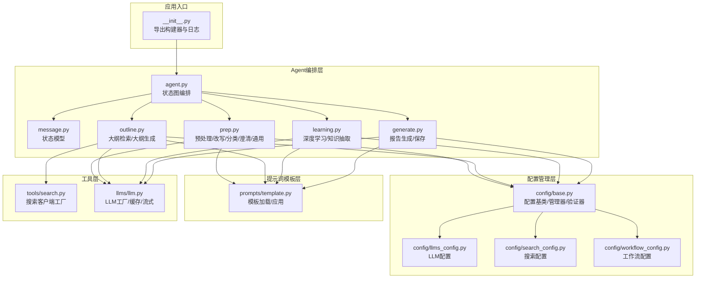
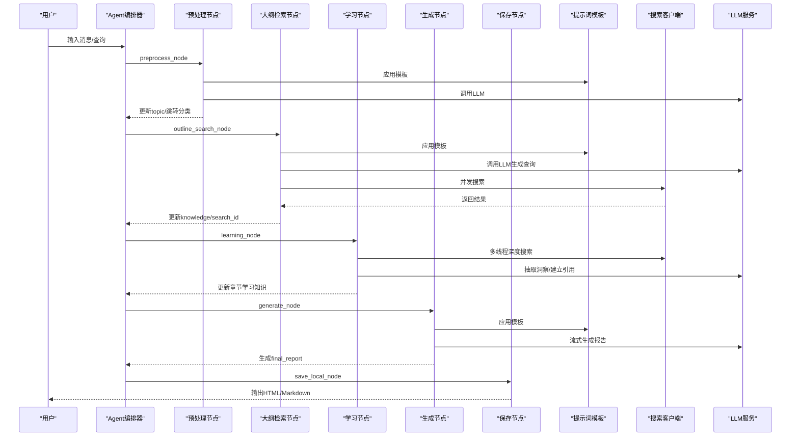
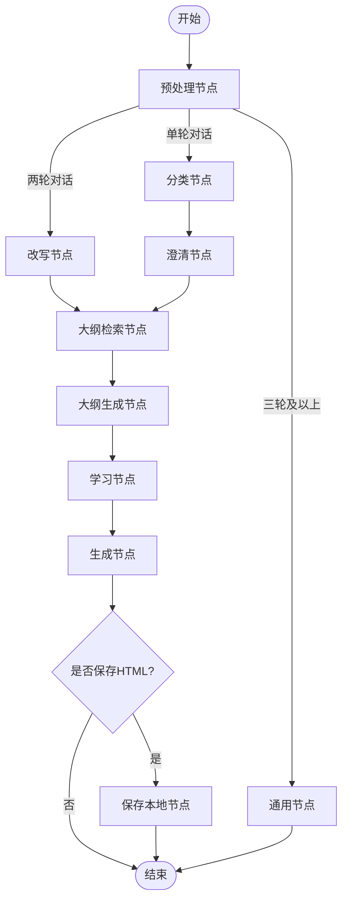
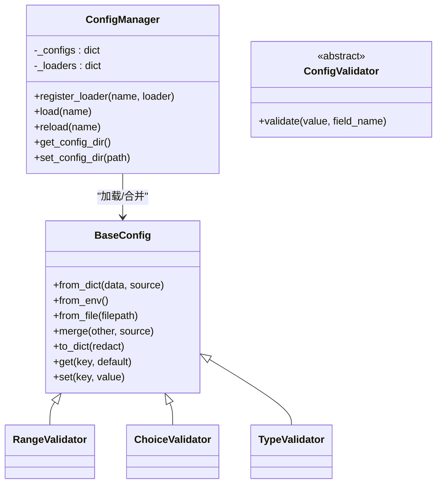
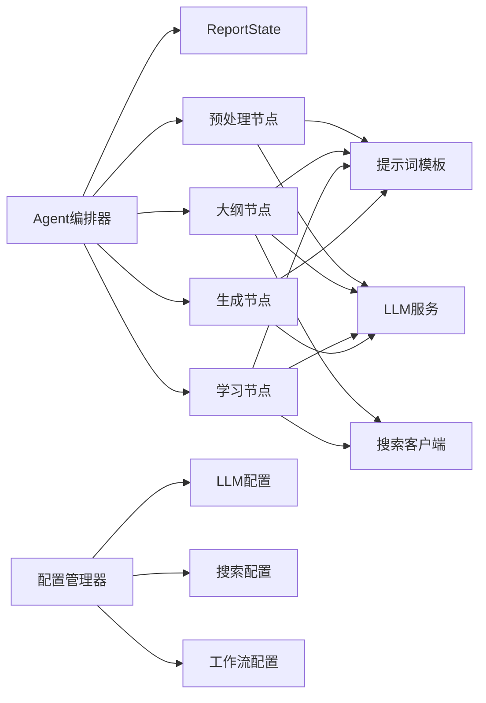

# 架构设计

<cite>
**本文档引用的文件**
- [README.md](file://README.md)
- [__init__.py](file://src/deepresearch/__init__.py)
- [agent.py](file://src/deepresearch/agent/agent.py)
- [message.py](file://src/deepresearch/agent/message.py)
- [prep.py](file://src/deepresearch/agent/prep.py)
- [outline.py](file://src/deepresearch/agent/outline.py)
- [learning.py](file://src/deepresearch/agent/learning.py)
- [generate.py](file://src/deepresearch/agent/generate.py)
- [base.py](file://src/deepresearch/config/base.py)
- [llms_config.py](file://src/deepresearch/config/llms_config.py)
- [search_config.py](file://src/deepresearch/config/search_config.py)
- [workflow_config.py](file://src/deepresearch/config/workflow_config.py)
- [llm.py](file://src/deepresearch/llms/llm.py)
- [search.py](file://src/deepresearch/tools/search.py)
- [template.py](file://src/deepresearch/prompts/template.py)
- [llms.toml](file://config/llms.toml)
- [search.toml](file://config/search.toml)
- [workflow.toml](file://config/workflow.toml)
</cite>

## 目录
1. [引言](#引言)
2. [项目结构](#项目结构)
3. [核心组件](#核心组件)
4. [架构总览](#架构总览)
5. [详细组件分析](#详细组件分析)
6. [依赖关系分析](#依赖关系分析)
7. [性能考量](#性能考量)
8. [故障排查指南](#故障排查指南)
9. [结论](#结论)
10. [附录](#附录)

## 引言
本架构设计文档面向DeepResearch框架，聚焦于其基于LangGraph的状态图工作流编排架构。文档系统性阐述状态图模式的设计原理与实现细节，解释模块化分层结构（Agent编排器、配置管理系统、提示词模板系统、搜索工具集成等），并总结设计模式（状态图模式、插件化架构、配置驱动设计）在系统中的应用方式。同时，明确系统边界、技术决策与约束条件，帮助读者快速理解并高效扩展该框架。

## 项目结构
DeepResearch采用“功能域+分层”的组织方式：
- 核心入口与导出：通过包级导出统一暴露构建Agent、日志配置与错误类型。
- Agent编排层：以LangGraph状态图为核心，串联预处理、改写、分类、澄清、大纲检索与生成、学习与报告生成、本地保存等节点。
- 配置管理层：提供统一的配置加载、合并、校验与缓存机制，支持文件、环境变量与代码注入的多源覆盖。
- 提示词模板层：动态扫描模板目录，按约定加载用户/系统消息模板，并支持延迟加载与变量注入。
- 工具层：封装搜索客户端工厂，按配置选择不同搜索引擎；LLM层提供线程安全缓存与流式/非流式响应。
- 数据模型层：定义报告状态与章节知识结构，支撑跨节点的数据传递与持久化。

图表来源
- [__init__.py:1-30](file://src/deepresearch/__init__.py#L1-L30)
- [agent.py:1-45](file://src/deepresearch/agent/agent.py#L1-L45)
- [message.py:101-112](file://src/deepresearch/agent/message.py#L101-L112)
- [prep.py:21-200](file://src/deepresearch/agent/prep.py#L21-L200)
- [outline.py:22-200](file://src/deepresearch/agent/outline.py#L22-L200)
- [learning.py:15-129](file://src/deepresearch/agent/learning.py#L15-L129)
- [generate.py:26-200](file://src/deepresearch/agent/generate.py#L26-L200)
- [base.py:190-590](file://src/deepresearch/config/base.py#L190-L590)
- [llm.py:24-308](file://src/deepresearch/llms/llm.py#L24-L308)
- [search.py:12-46](file://src/deepresearch/tools/search.py#L12-L46)
- [template.py:25-166](file://src/deepresearch/prompts/template.py#L25-L166)

章节来源
- [README.md:15-32](file://README.md#L15-L32)
- [__init__.py:4-29](file://src/deepresearch/__init__.py#L4-L29)

## 核心组件
- 状态图编排器：以LangGraph StateGraph定义节点与边，形成“预处理→改写/分类/澄清/通用→大纲检索→大纲→学习→生成→保存”的闭环流程。
- 报告状态模型：以MessagesState为基础，扩展章节树、领域、逻辑、细节、输出、知识、最终报告、搜索ID等字段，承载跨节点状态流转。
- 配置管理系统：提供统一的配置基类、验证器、环境变量映射、文件加载与合并策略，支持多源覆盖与缓存。
- 提示词模板系统：动态扫描模板目录，按约定提取PROMPT与SYSTEM_PROMPT，支持延迟加载与变量注入。
- 搜索工具集成：搜索客户端工厂根据配置选择引擎，支持并发搜索与结果聚合。
- LLM服务层：提供LLM实例工厂、响应缓存、线程安全、流式/非流式调用与统计信息。

章节来源
- [agent.py:19-45](file://src/deepresearch/agent/agent.py#L19-L45)
- [message.py:101-112](file://src/deepresearch/agent/message.py#L101-L112)
- [base.py:190-590](file://src/deepresearch/config/base.py#L190-L590)
- [template.py:25-166](file://src/deepresearch/prompts/template.py#L25-L166)
- [search.py:12-46](file://src/deepresearch/tools/search.py#L12-L46)
- [llm.py:24-308](file://src/deepresearch/llms/llm.py#L24-L308)

## 架构总览
系统采用“状态图编排 + 插件化组件 + 配置驱动”的混合架构：
- 状态图编排：以ReportState为数据载体，节点间通过条件边与命令控制流切换，支持保存策略分支与结束节点。
- 插件化组件：提示词模板、搜索客户端、LLM实现均以可替换的插件形式接入，便于扩展与维护。
- 配置驱动：通过配置文件、环境变量与代码注入的多源覆盖，实现运行时行为的灵活调整。

图表来源
- [agent.py:19-45](file://src/deepresearch/agent/agent.py#L19-L45)
- [prep.py:21-200](file://src/deepresearch/agent/prep.py#L21-L200)
- [outline.py:22-200](file://src/deepresearch/agent/outline.py#L22-L200)
- [learning.py:15-129](file://src/deepresearch/agent/learning.py#L15-L129)
- [generate.py:26-200](file://src/deepresearch/agent/generate.py#L26-L200)
- [template.py:90-130](file://src/deepresearch/prompts/template.py#L90-L130)
- [search.py:12-46](file://src/deepresearch/tools/search.py#L12-L46)
- [llm.py:146-308](file://src/deepresearch/llms/llm.py#L146-L308)

## 详细组件分析

### Agent编排器与状态图
- 设计原理：以状态图为骨架，将复杂研究任务分解为可组合的节点，每个节点负责特定子任务，节点间通过条件边实现动态路由。
- 关键实现：
  - 定义节点：预处理、改写、分类、澄清、通用、大纲检索、大纲生成、学习、生成、保存。
  - 边与路由：起始边、顺序边、条件边（生成节点根据保存策略决定下一步）。
  - 结束控制：END节点与Command.goto配合实现流程终止。
- 数据流：ReportState作为全局上下文，贯穿各节点，节点通过Command.update更新状态字段。

图表来源
- [agent.py:19-45](file://src/deepresearch/agent/agent.py#L19-L45)
- [prep.py:21-200](file://src/deepresearch/agent/prep.py#L21-L200)
- [outline.py:88-119](file://src/deepresearch/agent/outline.py#L88-L119)
- [learning.py:15-129](file://src/deepresearch/agent/learning.py#L15-L129)
- [generate.py:114-123](file://src/deepresearch/agent/generate.py#L114-L123)

章节来源
- [agent.py:19-45](file://src/deepresearch/agent/agent.py#L19-L45)
- [message.py:101-112](file://src/deepresearch/agent/message.py#L101-L112)

### 预处理与对话管理
- 功能职责：将输入消息标准化为LangChain消息类型，根据交互轮次决定后续流程（改写→分类/通用）。
- 关键点：消息类型转换、Command路由、异常降级至通用节点。

章节来源
- [prep.py:21-80](file://src/deepresearch/agent/prep.py#L21-L80)

### 大纲检索与生成
- 大纲检索：基于提示词生成多个搜索查询，使用线程池并发执行，聚合结果并分配唯一ID。
- 大纲生成：将检索到的知识与领域逻辑结合，流式生成章节大纲，解析为章节树结构。
- 性能优化：限制并发度、保持原始顺序以确保ID一致性、字符串拼接与截断策略。

章节来源
- [outline.py:22-86](file://src/deepresearch/agent/outline.py#L22-L86)
- [outline.py:88-119](file://src/deepresearch/agent/outline.py#L88-L119)
- [outline.py:121-152](file://src/deepresearch/agent/outline.py#L121-L152)
- [outline.py:158-200](file://src/deepresearch/agent/outline.py#L158-L200)

### 学习与知识抽取
- 深度搜索：针对每个二级章节构造DeepSearch任务，多线程并发执行，收集搜索结果与洞察。
- 引用映射：将模型中引用占位符映射为全局知识库的真实ID，保证报告引用一致性。
- 章节回填：将学习到的知识按序回填到章节树，供生成阶段使用。

章节来源
- [learning.py:15-94](file://src/deepresearch/agent/learning.py#L15-L94)
- [learning.py:96-129](file://src/deepresearch/agent/learning.py#L96-L129)

### 报告生成与保存
- 生成流程：逐章流式生成内容，实时进行引用替换与缓冲输出，最终汇总为完整报告。
- 保存策略：根据配置决定是否保存为HTML，同时追加参考文献列表。
- 输出控制：ContentProcessor按工具标记与引用规则进行内容切分与输出。

章节来源
- [generate.py:26-112](file://src/deepresearch/agent/generate.py#L26-L112)
- [generate.py:114-160](file://src/deepresearch/agent/generate.py#L114-L160)

### 配置管理系统
- 统一基类：提供字段验证、环境变量映射、文件加载、合并策略与字典导出。
- 验证器体系：范围、选项、类型等验证器，支持自定义敏感字段集合。
- 管理器：集中注册与加载配置，支持缓存与动态目录切换。
- 多源覆盖：代码→环境变量→文件→默认值的优先级链路。

图表来源
- [base.py:190-590](file://src/deepresearch/config/base.py#L190-L590)

章节来源
- [base.py:190-590](file://src/deepresearch/config/base.py#L190-L590)

### 提示词模板系统
- 动态加载：扫描多个模板目录，导入模块并提取PROMPT与SYSTEM_PROMPT。
- 延迟加载：首次使用时加载，避免启动开销。
- 变量注入：format_map按状态字典注入变量，支持保留历史消息。

章节来源
- [template.py:25-166](file://src/deepresearch/prompts/template.py#L25-L166)

### 搜索工具集成
- 客户端工厂：根据配置选择具体搜索引擎实现，屏蔽外部差异。
- 并发策略：限制最大并发，保证资源可控与稳定性。

章节来源
- [search.py:12-46](file://src/deepresearch/tools/search.py#L12-L46)

### LLM服务层
- 工厂与缓存：LRU缓存LLM实例与响应，线程安全，命中率统计。
- 流式/非流式：统一接口支持两种模式，自动处理推理内容与正文分离。
- 参数控制：温度、最大token、流式开关等参数封装。

章节来源
- [llm.py:24-308](file://src/deepresearch/llms/llm.py#L24-L308)

## 依赖关系分析
- 组件耦合：
  - Agent编排器对提示词模板、LLM服务、搜索客户端存在直接依赖。
  - 配置管理器被各模块间接依赖，用于读取运行时参数。
- 数据依赖：
  - ReportState作为共享上下文，贯穿所有节点。
  - 知识库与搜索ID在大纲检索与学习阶段持续累积。
- 外部依赖：
  - LangGraph用于状态图编排；LangChain消息类型用于LLM输入。
  - 第三方LLM SDK与搜索SDK由配置驱动注入。

图表来源
- [agent.py:19-45](file://src/deepresearch/agent/agent.py#L19-L45)
- [message.py:101-112](file://src/deepresearch/agent/message.py#L101-L112)
- [prep.py:84-103](file://src/deepresearch/agent/prep.py#L84-L103)
- [outline.py:24-35](file://src/deepresearch/agent/outline.py#L24-L35)
- [learning.py:26-34](file://src/deepresearch/agent/learning.py#L26-L34)
- [generate.py:72-86](file://src/deepresearch/agent/generate.py#L72-L86)
- [base.py:374-457](file://src/deepresearch/config/base.py#L374-L457)

章节来源
- [base.py:374-457](file://src/deepresearch/config/base.py#L374-L457)

## 性能考量
- 缓存策略：
  - LLM实例与响应双重缓存，限制容量避免内存膨胀。
  - 配置文件读取缓存，支持动态刷新。
- 并发控制：
  - 大纲检索与学习阶段限制最大并发，避免资源争用。
- I/O优化：
  - 模板延迟加载与消息格式化按需执行。
  - 知识聚合采用单次遍历与长度截断，降低内存压力。
- 可观测性：
  - LLM响应缓存命中率统计，便于容量规划与调优。

章节来源
- [llm.py:68-121](file://src/deepresearch/llms/llm.py#L68-L121)
- [base.py:459-471](file://src/deepresearch/config/base.py#L459-L471)
- [outline.py:42-80](file://src/deepresearch/agent/outline.py#L42-L80)
- [learning.py:63-75](file://src/deepresearch/agent/learning.py#L63-L75)

## 故障排查指南
- 配置相关：
  - 配置文件解析失败或缺失：检查配置目录与文件权限，确认TOML格式正确。
  - 环境变量未生效：确认环境变量前缀与字段名一致，注意大小写与布尔值解析。
- LLM相关：
  - 空消息或空响应：检查消息序列构造与模板变量注入。
  - 流式错误：关注LLM SDK异常与分片内容完整性。
- 搜索相关：
  - 引擎未知：确认配置engine值与可用实现匹配。
  - 并发超限：适当降低并发度或增加资源配额。
- 模板相关：
  - 变量缺失：检查apply_prompt_template调用处的state字段是否齐全。
- 日志与监控：
  - 使用统一日志配置与错误类型，定位问题根因。

章节来源
- [base.py:15-25](file://src/deepresearch/config/base.py#L15-L25)
- [llm.py:215-217](file://src/deepresearch/llms/llm.py#L215-L217)
- [search.py:22-23](file://src/deepresearch/tools/search.py#L22-L23)
- [template.py:114-127](file://src/deepresearch/prompts/template.py#L114-L127)

## 结论
DeepResearch以LangGraph状态图为骨架，结合插件化与配置驱动的设计，实现了可扩展、可观测且高性能的研究工作流。通过清晰的模块边界与稳定的依赖关系，系统能够在多轮对话、并发搜索与流式生成等复杂场景下保持一致性与可维护性。建议在扩展新节点或工具时遵循现有模式，确保配置与模板的统一管理，以维持整体架构的简洁与健壮。

## 附录
- 系统边界定义：
  - 内部：Agent编排、提示词模板、配置管理、LLM服务、搜索工具。
  - 外部：第三方LLM与搜索服务、文件系统（保存报告）。
- 技术决策说明：
  - 使用LangGraph实现状态图编排，提升流程可视化与可维护性。
  - 采用延迟加载与缓存策略平衡启动时间与运行时性能。
  - 通过配置驱动实现部署灵活性与环境隔离。
- 架构约束条件：
  - 模板变量必须完备，否则节点调用会抛出异常。
  - 搜索并发受工作流配置与线程池限制，避免资源过载。
  - LLM响应缓存容量固定，需结合业务规模评估命中率与内存占用。