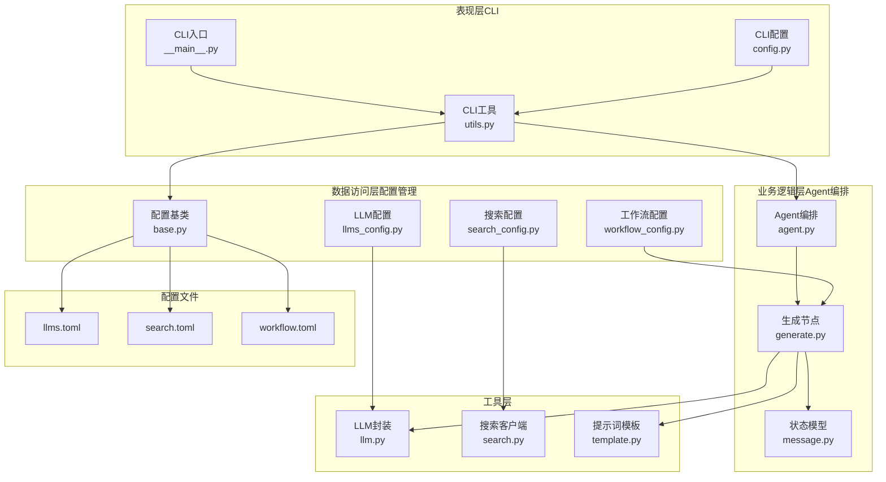
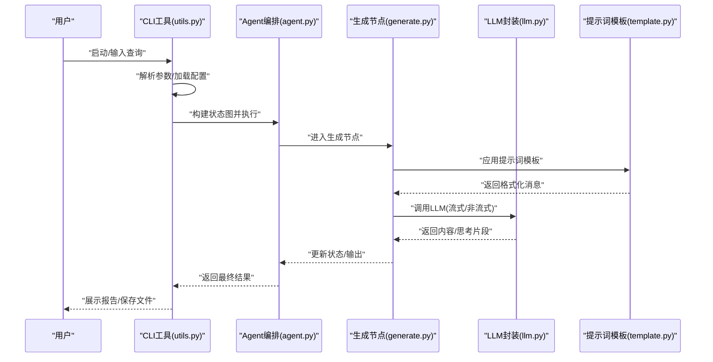
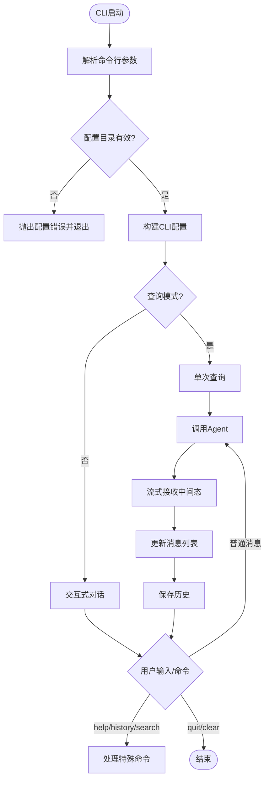
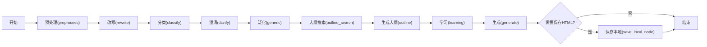
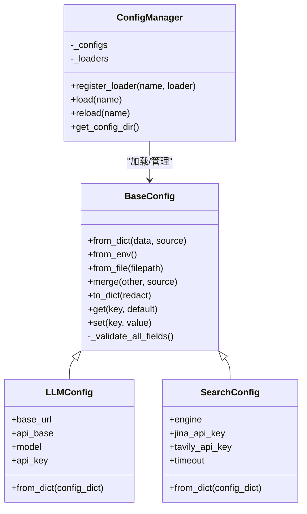
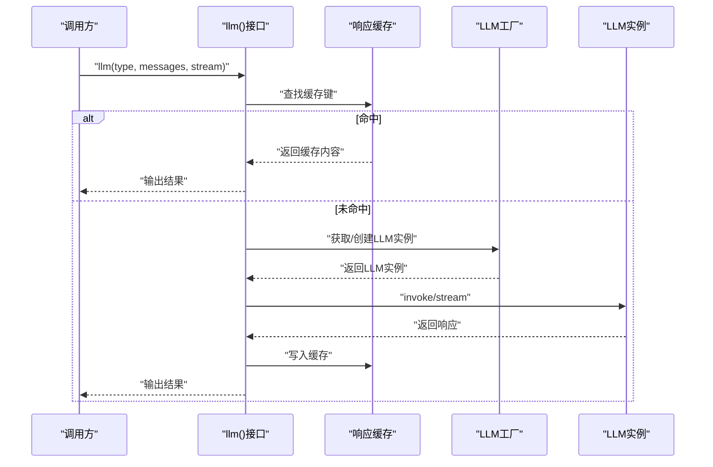
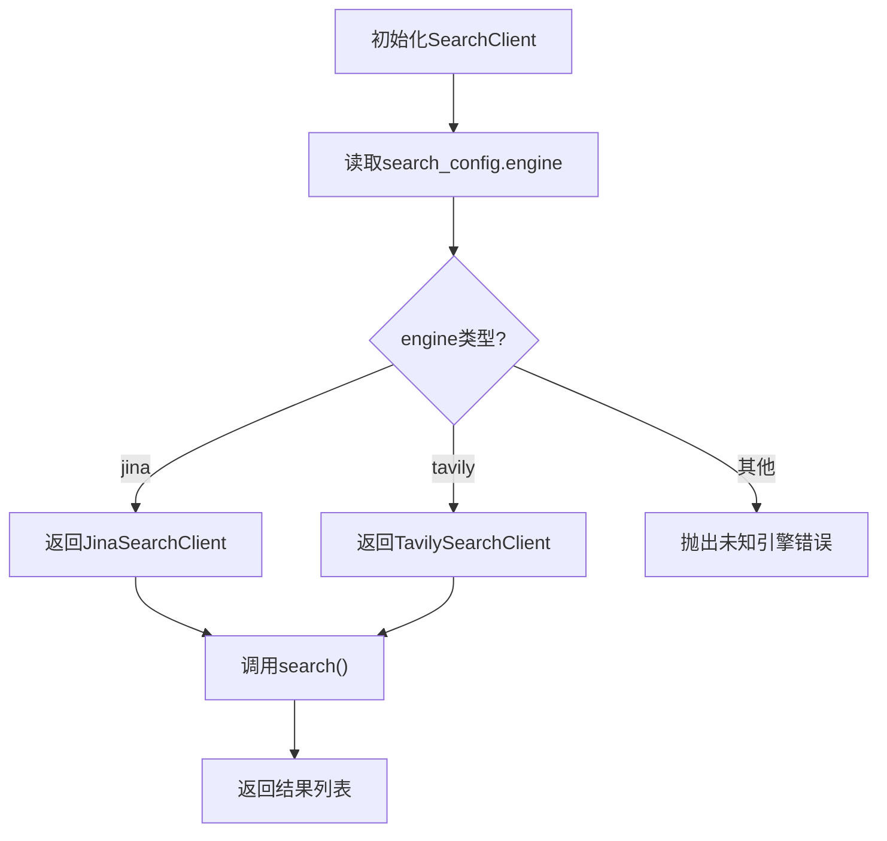
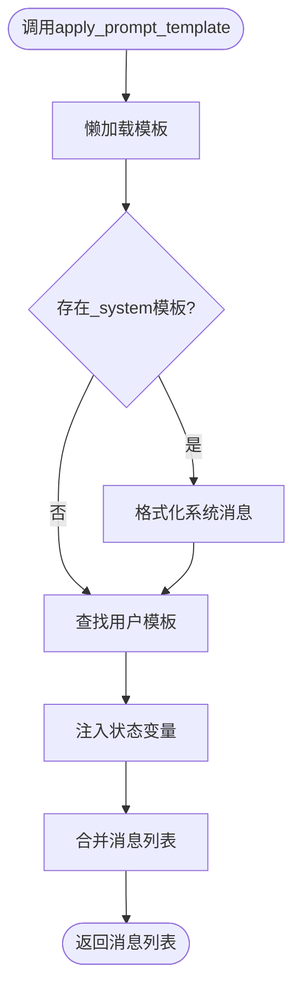
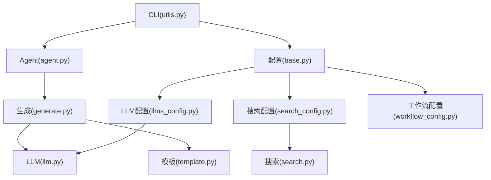

# 模块化架构设计

<cite>
**本文档引用的文件**
- [README.md](file://README.md)
- [__init__.py](file://src/deepresearch/__init__.py)
- [__main__.py](file://src/deepresearch/cli/__main__.py)
- [agent.py](file://src/deepresearch/agent/agent.py)
- [base.py](file://src/deepresearch/config/base.py)
- [llm.py](file://src/deepresearch/llms/llm.py)
- [workflow_config.py](file://src/deepresearch/config/workflow_config.py)
- [search_config.py](file://src/deepresearch/config/search_config.py)
- [llms_config.py](file://src/deepresearch/config/llms_config.py)
- [search.py](file://src/deepresearch/tools/search.py)
- [template.py](file://src/deepresearch/prompts/template.py)
- [utils.py](file://src/deepresearch/cli/utils.py)
- [generate.py](file://src/deepresearch/agent/generate.py)
- [message.py](file://src/deepresearch/agent/message.py)
- [config.py](file://src/deepresearch/cli/config.py)
- [llms.toml](file://config/llms.toml)
- [search.toml](file://config/search.toml)
- [workflow.toml](file://config/workflow.toml)
</cite>

## 目录
1. [简介](#简介)
2. [项目结构](#项目结构)
3. [核心组件](#核心组件)
4. [架构总览](#架构总览)
5. [详细组件分析](#详细组件分析)
6. [依赖关系分析](#依赖关系分析)
7. [性能考虑](#性能考虑)
8. [故障排除指南](#故障排除指南)
9. [结论](#结论)

## 简介
本项目是一个基于渐进式检索与交叉评估的轻量级深度研究框架，通过多智能体协作与搜索工具集成，实现复杂信息分析任务的自动化工作流。其模块化架构遵循分层设计：表现层（CLI）、业务逻辑层（Agent编排）、数据访问层（配置管理），并通过插件化机制支持LLM、搜索、提示词模板的扩展与动态切换。

## 项目结构
项目采用按功能域分层的组织方式：
- 表现层（CLI）：命令行交互与用户界面，负责参数解析、日志配置、UI渲染与Agent调用
- 业务逻辑层（Agent编排）：基于LangGraph的状态机编排，定义研究流程节点与流转条件
- 数据访问层（配置管理）：统一的配置加载、验证与缓存机制，支持多源覆盖
- 工具层（LLM/搜索/提示词）：LLM调用封装、搜索客户端工厂、提示词模板动态加载
- 配置文件：TOML格式集中管理各模块参数

**图表来源**
- [__main__.py:1-7](file://src/deepresearch/cli/__main__.py#L1-L7)
- [utils.py:1-575](file://src/deepresearch/cli/utils.py#L1-L575)
- [agent.py:1-45](file://src/deepresearch/agent/agent.py#L1-L45)
- [generate.py:1-343](file://src/deepresearch/agent/generate.py#L1-L343)
- [llm.py:1-308](file://src/deepresearch/llms/llm.py#L1-L308)
- [search.py:1-46](file://src/deepresearch/tools/search.py#L1-L46)
- [template.py:1-166](file://src/deepresearch/prompts/template.py#L1-L166)
- [base.py:1-590](file://src/deepresearch/config/base.py#L1-L590)
- [llms_config.py:1-115](file://src/deepresearch/config/llms_config.py#L1-L115)
- [search_config.py:1-82](file://src/deepresearch/config/search_config.py#L1-L82)
- [workflow_config.py:1-28](file://src/deepresearch/config/workflow_config.py#L1-L28)
- [llms.toml:1-29](file://config/llms.toml#L1-L29)
- [search.toml:1-6](file://config/search.toml#L1-L6)
- [workflow.toml:1-3](file://config/workflow.toml#L1-L3)

**章节来源**
- [README.md:1-69](file://README.md#L1-L69)
- [__main__.py:1-7](file://src/deepresearch/cli/__main__.py#L1-L7)
- [utils.py:1-575](file://src/deepresearch/cli/utils.py#L1-L575)

## 核心组件
- CLI入口与工具：提供命令行参数解析、信号处理、交互式/单次查询模式、日志配置与UI渲染，并调用Agent进行处理
- Agent编排：基于状态图定义预处理、改写、分类、澄清、泛化、大纲搜索、大纲生成、学习、生成、本地保存等节点及条件边
- 配置管理：统一的BaseConfig与ConfigManager，支持文件、环境变量、代码三源覆盖，提供验证、脱敏、缓存与懒加载
- LLM封装：工厂缓存、响应缓存、线程安全、流式/非流式调用、消息哈希缓存键生成
- 搜索客户端：根据配置选择Jina或Tavily，统一搜索接口
- 提示词模板：动态扫描目录、导入模块、提取模板变量，支持系统与用户消息格式化

**章节来源**
- [agent.py:19-45](file://src/deepresearch/agent/agent.py#L19-L45)
- [base.py:190-590](file://src/deepresearch/config/base.py#L190-L590)
- [llm.py:24-308](file://src/deepresearch/llms/llm.py#L24-L308)
- [search.py:12-46](file://src/deepresearch/tools/search.py#L12-L46)
- [template.py:25-166](file://src/deepresearch/prompts/template.py#L25-L166)

## 架构总览
分层架构设计理念：
- 表现层（CLI）：薄UI与控制逻辑，负责参数校验、日志与UI，调用Agent并展示结果
- 业务逻辑层（Agent）：以状态图为驱动，将“任务规划→工具调用→评估与迭代”流程模块化
- 数据访问层（配置）：集中化配置管理，支持多源覆盖与运行时重载，保证灵活性与安全性

插件化扩展机制：
- LLM插件：通过LLM类型标识在配置中注册不同模型，封装工厂与缓存，支持多类型LLM并行使用
- 搜索插件：通过配置选择具体搜索引擎，客户端工厂按引擎类型返回对应实现
- 提示词模板插件：动态扫描目录，按约定导出模板变量，实现模板的即插即用

配置驱动设计原则：
- 通过TOML配置文件集中声明各模块参数，结合环境变量与代码覆盖实现灵活组合
- 支持敏感信息脱敏与缓存，保障生产环境安全与性能
- 运行时可重载配置，满足动态切换需求

**图表来源**
- [utils.py:106-193](file://src/deepresearch/cli/utils.py#L106-L193)
- [agent.py:19-45](file://src/deepresearch/agent/agent.py#L19-L45)
- [generate.py:26-111](file://src/deepresearch/agent/generate.py#L26-L111)
- [llm.py:146-266](file://src/deepresearch/llms/llm.py#L146-L266)
- [template.py:90-129](file://src/deepresearch/prompts/template.py#L90-L129)

## 详细组件分析

### 表现层（CLI）
职责划分：
- 参数解析与校验：支持查询模式、深度、HTML保存、输出路径、日志级别、主题、配置目录等
- 信号处理：优雅中断与退出
- UI与历史：终端UI渲染、历史记录管理、帮助与搜索
- Agent调用：构建状态、配置Agent运行参数、流式接收中间态并更新消息

关键流程：
- 交互式模式：循环读取用户输入，调用Agent并展示结果
- 单次查询模式：一次性处理并返回结果
- 配置目录与LLM配置重载：支持外部配置目录与运行时重载

**图表来源**
- [utils.py:386-575](file://src/deepresearch/cli/utils.py#L386-L575)
- [utils.py:195-304](file://src/deepresearch/cli/utils.py#L195-L304)
- [utils.py:357-384](file://src/deepresearch/cli/utils.py#L357-L384)

**章节来源**
- [utils.py:1-575](file://src/deepresearch/cli/utils.py#L1-L575)
- [config.py:15-101](file://src/deepresearch/cli/config.py#L15-L101)

### 业务逻辑层（Agent编排）
职责划分：
- 状态模型：定义研究过程中的结构化状态（大纲、消息、主题、领域、知识库等）
- 节点定义：预处理、改写、分类、澄清、泛化、大纲搜索、大纲生成、学习、生成、本地保存
- 流转控制：起止边、顺序边、条件边（生成完成后决定是否保存）

**图表来源**
- [agent.py:19-45](file://src/deepresearch/agent/agent.py#L19-L45)
- [message.py:101-112](file://src/deepresearch/agent/message.py#L101-L112)

**章节来源**
- [agent.py:1-45](file://src/deepresearch/agent/agent.py#L1-L45)
- [generate.py:114-160](file://src/deepresearch/agent/generate.py#L114-L160)
- [message.py:1-112](file://src/deepresearch/agent/message.py#L1-L112)

### 数据访问层（配置管理）
职责划分：
- 配置基类：统一字段定义、验证器、环境变量映射、字典转换与敏感信息脱敏
- 配置管理器：注册加载器、按名称加载、缓存与重载、配置目录解析
- LLM配置：类型化配置类、懒加载缓存、重载接口
- 搜索配置：强类型校验、必填字段检查、超时范围约束
- 工作流配置：工作流参数（如搜索条数）集中管理

**图表来源**
- [base.py:190-590](file://src/deepresearch/config/base.py#L190-L590)
- [llms_config.py:12-115](file://src/deepresearch/config/llms_config.py#L12-L115)
- [search_config.py:12-82](file://src/deepresearch/config/search_config.py#L12-L82)

**章节来源**
- [base.py:1-590](file://src/deepresearch/config/base.py#L1-L590)
- [llms_config.py:1-115](file://src/deepresearch/config/llms_config.py#L1-L115)
- [search_config.py:1-82](file://src/deepresearch/config/search_config.py#L1-L82)
- [workflow_config.py:1-28](file://src/deepresearch/config/workflow_config.py#L1-L28)

### LLM插件与缓存
实现要点：
- 工厂缓存：按类型、流式、最大token组合缓存LLM实例，避免重复创建
- 响应缓存：基于消息哈希的线程安全LRU缓存，命中则直接返回
- 流式/非流式：统一接口，分别处理增量输出与完整响应
- 错误处理：捕获异常并记录日志，保证稳定性

**图表来源**
- [llm.py:146-266](file://src/deepresearch/llms/llm.py#L146-L266)
- [llm.py:71-123](file://src/deepresearch/llms/llm.py#L71-L123)

**章节来源**
- [llm.py:1-308](file://src/deepresearch/llms/llm.py#L1-L308)

### 搜索插件
实现要点：
- 客户端工厂：根据配置引擎类型返回Jina或Tavily客户端
- 统一接口：对外暴露search(query, top_n)，屏蔽底层差异
- 配置校验：要求存在引擎类型，支持超时范围约束

**图表来源**
- [search.py:12-46](file://src/deepresearch/tools/search.py#L12-L46)
- [search_config.py:56-82](file://src/deepresearch/config/search_config.py#L56-L82)

**章节来源**
- [search.py:1-46](file://src/deepresearch/tools/search.py#L1-L46)
- [search_config.py:1-82](file://src/deepresearch/config/search_config.py#L1-L82)

### 提示词模板插件
实现要点：
- 动态扫描：遍历多个模板目录，导入模块并提取模板变量
- 懒加载：首次使用时加载，避免启动开销
- 格式化：支持系统消息与用户消息，按状态变量注入

**图表来源**
- [template.py:25-166](file://src/deepresearch/prompts/template.py#L25-L166)

**章节来源**
- [template.py:1-166](file://src/deepresearch/prompts/template.py#L1-L166)

## 依赖关系分析
模块间耦合与内聚：
- 表现层与业务逻辑层：通过Agent接口解耦，CLI仅负责控制与UI
- 业务逻辑层与工具层：通过LLM、提示词、搜索等接口解耦，便于替换与扩展
- 配置管理层：被所有层依赖，提供统一的配置来源与验证
- 插件化：LLM与搜索通过配置驱动，提示词通过目录约定，降低硬编码耦合

**图表来源**
- [utils.py:106-193](file://src/deepresearch/cli/utils.py#L106-L193)
- [agent.py:19-45](file://src/deepresearch/agent/agent.py#L19-L45)
- [generate.py:26-111](file://src/deepresearch/agent/generate.py#L26-L111)
- [llm.py:146-266](file://src/deepresearch/llms/llm.py#L146-L266)
- [template.py:90-129](file://src/deepresearch/prompts/template.py#L90-L129)
- [base.py:374-457](file://src/deepresearch/config/base.py#L374-L457)
- [llms_config.py:46-85](file://src/deepresearch/config/llms_config.py#L46-L85)
- [search_config.py:56-82](file://src/deepresearch/config/search_config.py#L56-L82)
- [workflow_config.py:7-28](file://src/deepresearch/config/workflow_config.py#L7-L28)
- [search.py:12-46](file://src/deepresearch/tools/search.py#L12-L46)

**章节来源**
- [__init__.py:1-30](file://src/deepresearch/__init__.py#L1-L30)
- [__main__.py:1-7](file://src/deepresearch/cli/__main__.py#L1-L7)

## 性能考虑
- 缓存策略：LLM实例LRU缓存与响应LRU缓存，减少重复创建与网络调用
- 线程安全：响应缓存使用锁保护，避免并发竞争
- 流式输出：支持流式响应，提升用户体验与内存效率
- 配置缓存：TOML读取带LRU缓存，避免频繁磁盘IO
- 懒加载：提示词模板与LLM配置按需加载，降低启动时间

优化建议：
- 根据实际负载调整缓存容量与淘汰策略
- 在高并发场景下增加连接池与限流控制
- 对长文本处理增加分片与增量写入策略

[本节为通用性能指导，无需特定文件引用]

## 故障排除指南
常见问题与定位：
- 配置加载失败：检查配置文件路径、权限与格式；确认环境变量前缀与键名
- LLM调用异常：查看缓存统计与错误日志，确认API密钥与网络连通性
- 搜索引擎错误：确认引擎类型与API Key配置，检查超时设置
- Agent执行错误：查看Agent执行日志与中间态输出，定位节点与模板变量缺失

排查步骤：
- 启用调试日志，观察配置加载与Agent执行链路
- 使用脱敏配置输出，核对敏感信息是否正确隐藏
- 逐步替换插件（LLM/搜索/模板），定位问题模块

**章节来源**
- [base.py:15-25](file://src/deepresearch/config/base.py#L15-L25)
- [llm.py:258-266](file://src/deepresearch/llms/llm.py#L258-L266)
- [utils.py:106-193](file://src/deepresearch/cli/utils.py#L106-L193)

## 结论
本项目通过清晰的分层架构与配置驱动设计，实现了表现层、业务逻辑层与数据访问层的职责分离；借助插件化机制，LLM、搜索与提示词模板可灵活扩展与动态切换。统一的配置管理提供了多源覆盖、验证、脱敏与缓存能力，既保证了开发期的灵活性，也满足了生产环境的安全与性能要求。该架构为后续的功能扩展与维护奠定了坚实基础。