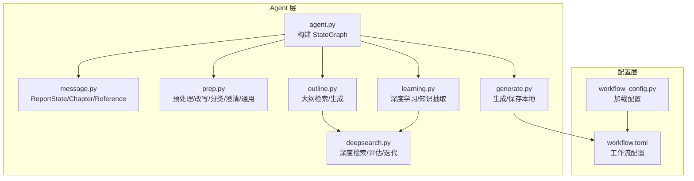
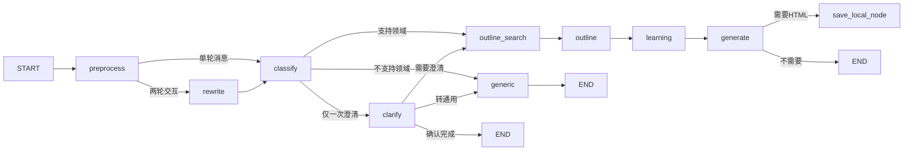
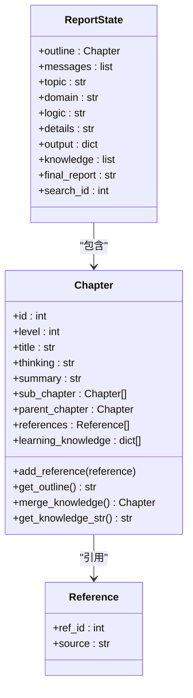
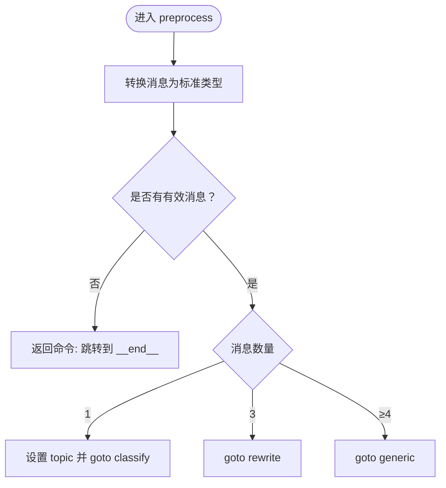
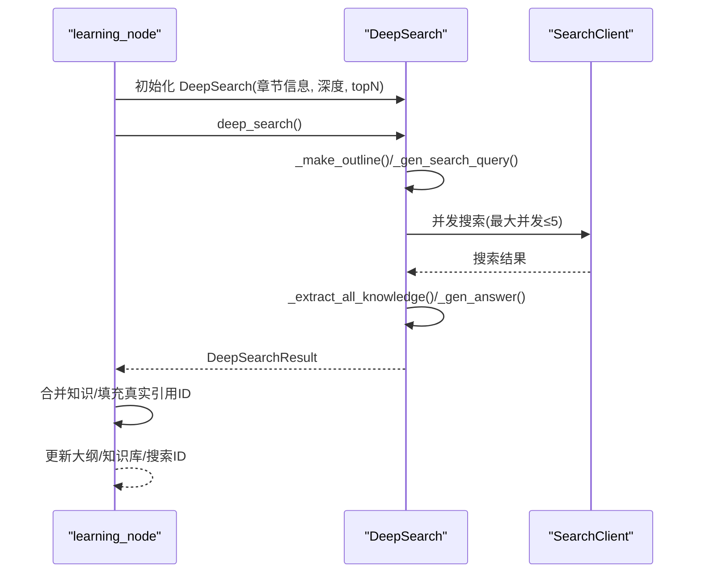
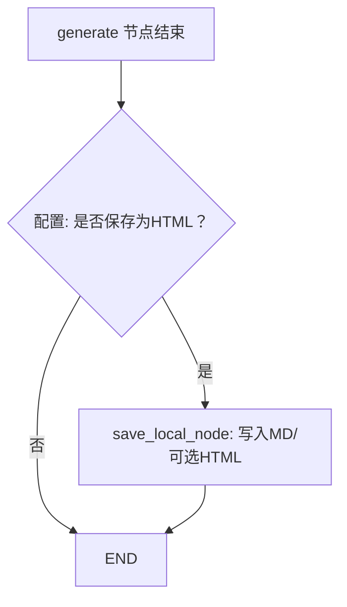
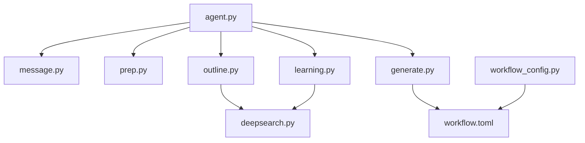

# 状态图工作流架构

<cite>
**本文档引用的文件**
- [agent.py](file://src/deepresearch/agent/agent.py)
- [message.py](file://src/deepresearch/agent/message.py)
- [prep.py](file://src/deepresearch/agent/prep.py)
- [outline.py](file://src/deepresearch/agent/outline.py)
- [learning.py](file://src/deepresearch/agent/learning.py)
- [generate.py](file://src/deepresearch/agent/generate.py)
- [deepsearch.py](file://src/deepresearch/agent/deepsearch.py)
- [workflow.toml](file://config/workflow.toml)
- [workflow_config.py](file://src/deepresearch/config/workflow_config.py)
</cite>

## 目录
1. [简介](#简介)
2. [项目结构](#项目结构)
3. [核心组件](#核心组件)
4. [架构总览](#架构总览)
5. [详细组件分析](#详细组件分析)
6. [依赖关系分析](#依赖关系分析)
7. [性能考虑](#性能考虑)
8. [故障排除指南](#故障排除指南)
9. [结论](#结论)

## 简介
本文件系统性解析基于 LangGraph 的 StateGraph 工作流架构，聚焦 DeepResearch 的报告生成流水线。文档从状态模型设计、节点职责与连接逻辑、条件分支机制入手，逐步给出状态流转图与执行序列示例，并对关键算法与并发策略进行深入剖析，帮助读者快速掌握该工作流的运行原理与扩展方式。

## 项目结构
本项目采用按功能域分层的组织方式：核心 Agent 定义在 agent 子包中，状态模型与节点实现分别位于 message.py 与各功能模块；配置通过 workflow.toml 与 workflow_config.py 提供；工具与提示词模板位于 tools 与 prompts 相关目录。

图表来源
- [agent.py:19-45](file://src/deepresearch/agent/agent.py#L19-L45)
- [message.py:101-112](file://src/deepresearch/agent/message.py#L101-L112)
- [prep.py:21-202](file://src/deepresearch/agent/prep.py#L21-L202)
- [outline.py:22-227](file://src/deepresearch/agent/outline.py#L22-L227)
- [learning.py:15-129](file://src/deepresearch/agent/learning.py#L15-L129)
- [generate.py:26-343](file://src/deepresearch/agent/generate.py#L26-L343)
- [deepsearch.py:55-489](file://src/deepresearch/agent/deepsearch.py#L55-L489)
- [workflow.toml:1-3](file://config/workflow.toml#L1-L3)
- [workflow_config.py:7-28](file://src/deepresearch/config/workflow_config.py#L7-L28)

章节来源
- [agent.py:19-45](file://src/deepresearch/agent/agent.py#L19-L45)
- [workflow.toml:1-3](file://config/workflow.toml#L1-L3)
- [workflow_config.py:7-28](file://src/deepresearch/config/workflow_config.py#L7-L28)

## 核心组件
- StateGraph 构建器：在 agent.py 中定义起止节点与所有处理节点，建立有向边与条件边。
- ReportState 状态模型：继承自 MessagesState，承载消息、主题、领域、逻辑、细节、输出、知识、最终报告、搜索 ID 等字段。
- 节点集合：预处理、改写、分类、澄清、通用、大纲检索、大纲生成、学习、生成、保存本地。
- 条件边：根据生成阶段的可选保存策略，决定进入保存节点或结束。

章节来源
- [agent.py:19-45](file://src/deepresearch/agent/agent.py#L19-L45)
- [message.py:101-112](file://src/deepresearch/agent/message.py#L101-L112)

## 架构总览
下图展示基于 LangGraph 的 StateGraph 在 DeepResearch 中的完整拓扑：START → 预处理 → 分支 → 多路径并行/串行 → 生成 → 条件保存 → 结束。

图表来源
- [agent.py:19-45](file://src/deepresearch/agent/agent.py#L19-L45)
- [prep.py:21-202](file://src/deepresearch/agent/prep.py#L21-L202)
- [outline.py:22-227](file://src/deepresearch/agent/outline.py#L22-L227)
- [learning.py:15-129](file://src/deepresearch/agent/learning.py#L15-L129)
- [generate.py:26-123](file://src/deepresearch/agent/generate.py#L26-L123)

## 详细组件分析

### ReportState 状态模型
- 字段定义：包含大纲（Chapter）、消息列表、主题、领域、逻辑、细节、输出、知识列表、最终报告、搜索 ID。
- 数据结构：Chapter 支持层级标题、思考、摘要、子章节、引用、学习知识等，提供大纲渲染、知识合并、引用 ID 映射等方法。
- 设计要点：通过数据类与继承 MessagesState，确保与 LangGraph 的消息状态兼容；同时扩展业务所需字段，支撑多轮对话与报告生成。

图表来源
- [message.py:101-112](file://src/deepresearch/agent/message.py#L101-L112)
- [message.py:12-99](file://src/deepresearch/agent/message.py#L12-L99)

章节来源
- [message.py:101-112](file://src/deepresearch/agent/message.py#L101-L112)
- [message.py:12-99](file://src/deepresearch/agent/message.py#L12-L99)

### 预处理节点（preprocess）
- 功能：统一消息格式，推导主题，控制后续流程走向。
- 流程要点：
  - 将输入 messages 转换为标准消息类型；
  - 若无有效消息，跳过至结束；
  - 单条消息：更新主题并进入分类；
  - 三条消息：进入改写以提炼主题；
  - 三轮及以上：直接进入通用节点由基础模型回复。
- 关键决策：依据消息数量与转换结果选择 goto 目标。

图表来源
- [prep.py:21-80](file://src/deepresearch/agent/prep.py#L21-L80)

章节来源
- [prep.py:21-80](file://src/deepresearch/agent/prep.py#L21-L80)

### 改写节点（rewrite）
- 功能：基于历史对话重写用户需求，提取明确主题。
- 输出：更新 state.topic；若解析失败则回退为拼接历史内容作为主题。

章节来源
- [prep.py:82-103](file://src/deepresearch/agent/prep.py#L82-L103)

### 分类节点（classify）
- 功能：对主题进行领域分类，决定后续路径。
- 逻辑：
  - 调用 LLM 获取领域标签；
  - 若不支持该领域，回退到通用节点；
  - 若为首轮对话，进入澄清节点；
  - 否则进入大纲检索节点。
- 异常处理：当领域映射缺失时记录警告并回退。

章节来源
- [prep.py:105-151](file://src/deepresearch/agent/prep.py#L105-L151)

### 澄清节点（clarify）
- 功能：对用户问题进行一次性澄清。
- 逻辑：
  - 若 LLM 返回“需要澄清”，继续大纲检索；
  - 若返回“确认完成”，输出确认信息并结束；
  - 否则回退到通用节点。

章节来源
- [prep.py:153-182](file://src/deepresearch/agent/prep.py#L153-L182)

### 通用节点（generic）
- 功能：处理非研究类对话，直接调用基础模型进行回复。
- 错误处理：捕获 LLM 调用异常并返回错误信息。

章节来源
- [prep.py:184-202](file://src/deepresearch/agent/prep.py#L184-L202)

### 大纲检索节点（outline_search）
- 功能：基于主题与推理逻辑生成搜索查询，检索相关知识。
- 并发策略：使用线程池并发执行多个查询，限制最大并发数，保证顺序一致性。
- 输出：累积知识库与递增的搜索 ID。

章节来源
- [outline.py:22-86](file://src/deepresearch/agent/outline.py#L22-L86)

### 大纲生成节点（outline）
- 功能：基于领域、主题、推理与检索知识生成报告大纲。
- 解析：从 LLM 输出中提取 Markdown 代码块，解析为章节树结构。
- 错误处理：解析失败时记录错误并结束。

章节来源
- [outline.py:88-119](file://src/deepresearch/agent/outline.py#L88-L119)
- [outline.py:158-221](file://src/deepresearch/agent/outline.py#L158-L221)

### 学习节点（learning）
- 功能：对大纲中的每个章节进行深度检索与知识抽取，填充每章的学习知识。
- 并发策略：按章节并行处理，使用锁保护全局知识 ID 与知识列表，完成后回填真实引用 ID。
- 输出：更新大纲（含学习知识）、全局知识库与搜索 ID。

图表来源
- [learning.py:15-93](file://src/deepresearch/agent/learning.py#L15-L93)
- [deepsearch.py:74-149](file://src/deepresearch/agent/deepsearch.py#L74-L149)

章节来源
- [learning.py:15-129](file://src/deepresearch/agent/learning.py#L15-L129)
- [deepsearch.py:55-489](file://src/deepresearch/agent/deepsearch.py#L55-L489)

### 生成节点（generate）
- 功能：按章节顺序生成报告正文，流式输出并实时替换参考编号。
- 参考替换：通过正则与章节内学习知识映射，将占位引用替换为真实编号。
- 输出：最终报告与输出消息。

章节来源
- [generate.py:26-112](file://src/deepresearch/agent/generate.py#L26-L112)

### 保存本地节点（save_local_node）与条件边（save_report_local）
- 条件边：根据配置决定是否保存为 HTML。
- 保存逻辑：将最终报告与参考文献写入 Markdown 文件，必要时转换为 HTML 并输出保存路径。

图表来源
- [generate.py:114-160](file://src/deepresearch/agent/generate.py#L114-L160)

章节来源
- [generate.py:114-160](file://src/deepresearch/agent/generate.py#L114-L160)

## 依赖关系分析
- 组件耦合：
  - agent.py 作为编排中心，依赖各节点实现与状态模型；
  - outline.py 与 learning.py 共同依赖 DeepSearch 实现深度检索；
  - generate.py 依赖工具链（Markdown 转 HTML）与配置（保存路径、是否生成 HTML）。
- 外部依赖：
  - 配置通过 workflow_config.py 加载 workflow.toml；
  - LLM 调用与提示词模板在各节点中使用。

图表来源
- [agent.py:19-45](file://src/deepresearch/agent/agent.py#L19-L45)
- [outline.py:22-86](file://src/deepresearch/agent/outline.py#L22-L86)
- [learning.py:15-93](file://src/deepresearch/agent/learning.py#L15-L93)
- [generate.py:114-160](file://src/deepresearch/agent/generate.py#L114-L160)
- [workflow_config.py:7-28](file://src/deepresearch/config/workflow_config.py#L7-L28)

章节来源
- [agent.py:19-45](file://src/deepresearch/agent/agent.py#L19-L45)
- [workflow_config.py:7-28](file://src/deepresearch/config/workflow_config.py#L7-L28)

## 性能考虑
- 并发控制：
  - 大纲检索与深度学习均采用线程池并发，最大并发数受控，避免 LLM 与搜索接口过载。
- 流式输出：
  - 生成过程采用流式输出，边生成边渲染，降低首屏延迟。
- 正则优化：
  - 预编译参考替换正则表达式，减少重复编译开销。
- 配置化参数：
  - 搜索 topN 与深度等参数通过配置文件管理，便于在不同场景下调整性能与质量平衡。

## 故障排除指南
- 分类失败：
  - 现象：领域不可识别或无标签。
  - 处理：自动回退到通用节点；检查领域映射与提示词模板。
- 大纲解析失败：
  - 现象：LLM 输出非预期格式。
  - 处理：记录错误并结束；检查提示词与输出解析逻辑。
- 保存失败：
  - 现象：创建目录或写入文件异常。
  - 处理：记录错误日志；检查保存路径权限与磁盘空间。
- 搜索超时/失败：
  - 现象：并发搜索过程中出现异常。
  - 处理：记录错误并跳过该查询；检查网络与搜索引擎可用性。

章节来源
- [prep.py:118-132](file://src/deepresearch/agent/prep.py#L118-L132)
- [outline.py:114-118](file://src/deepresearch/agent/outline.py#L114-L118)
- [generate.py:134-158](file://src/deepresearch/agent/generate.py#L134-L158)
- [deepsearch.py:216-238](file://src/deepresearch/agent/deepsearch.py#L216-L238)

## 结论
本工作流以 ReportState 为核心，通过 LangGraph 的 StateGraph 将预处理、检索、学习、生成与保存串联为一条完整的报告生产链路。其关键特性包括：灵活的条件分支、强大的并发控制、稳健的错误处理与可配置的参数体系。该架构既满足复杂研究场景的深度检索与知识整合需求，又保持了良好的可维护性与扩展性。