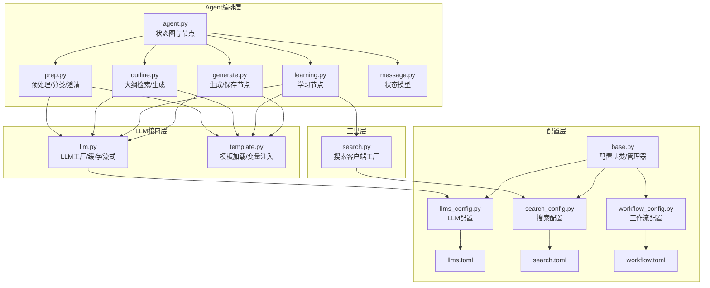
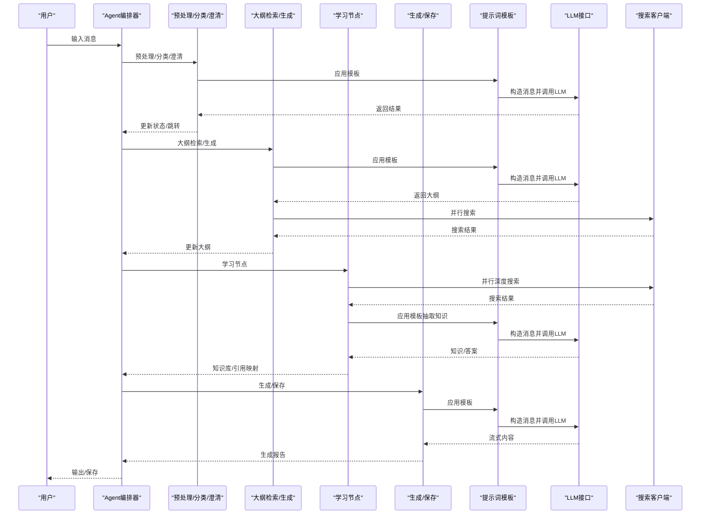
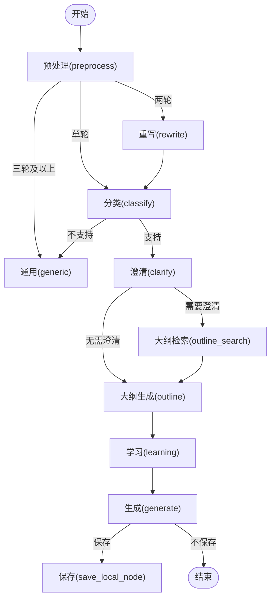
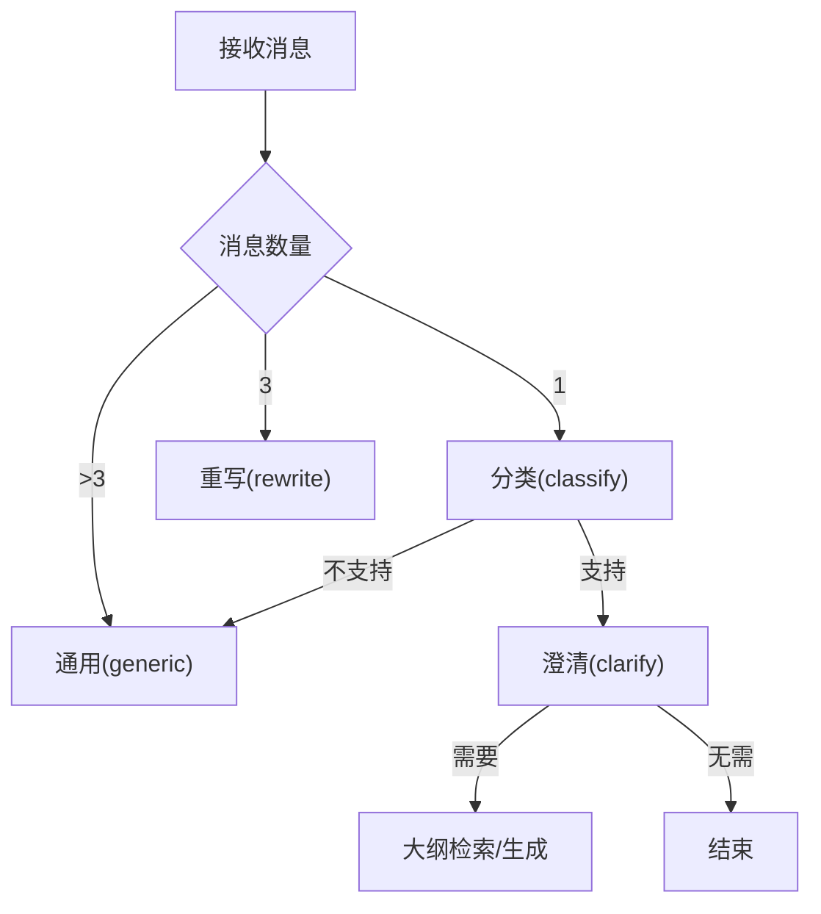
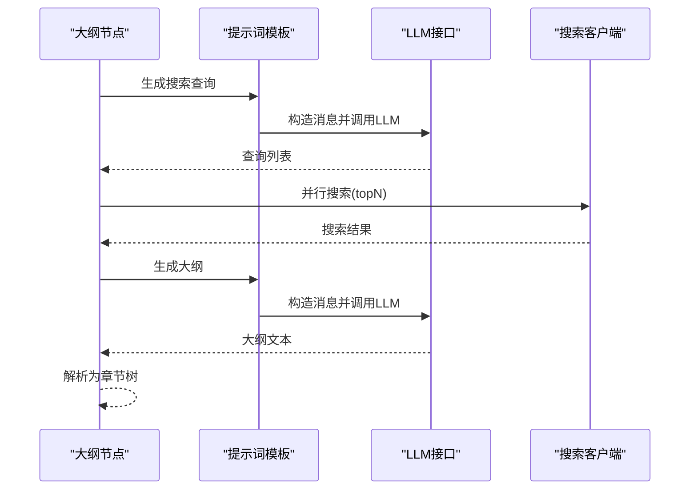
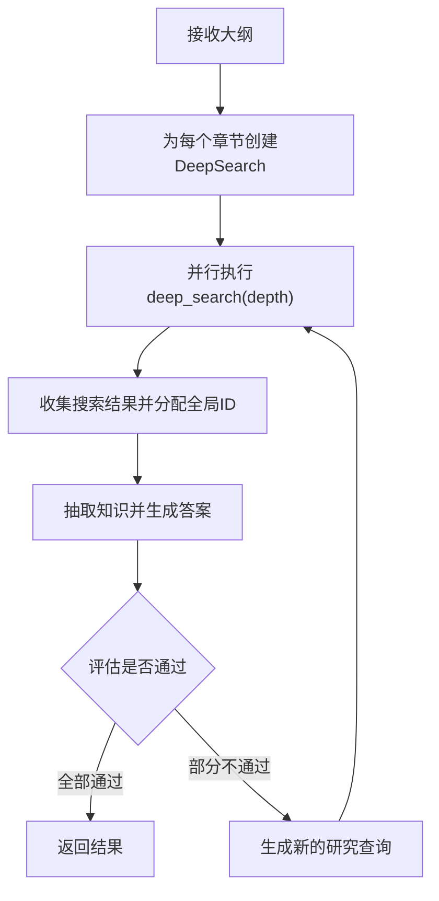
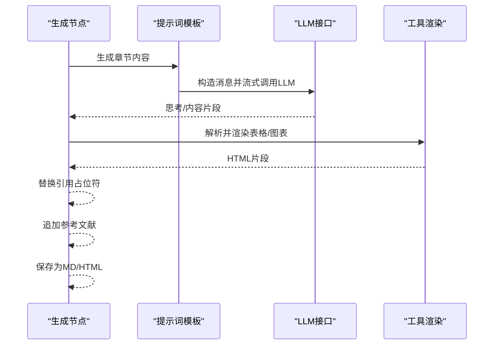
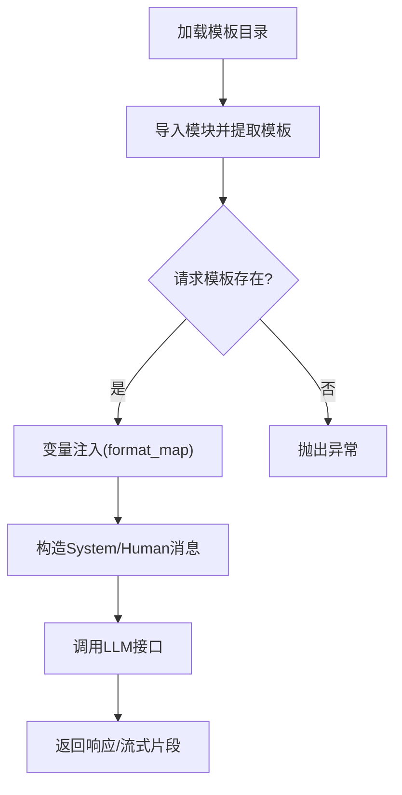
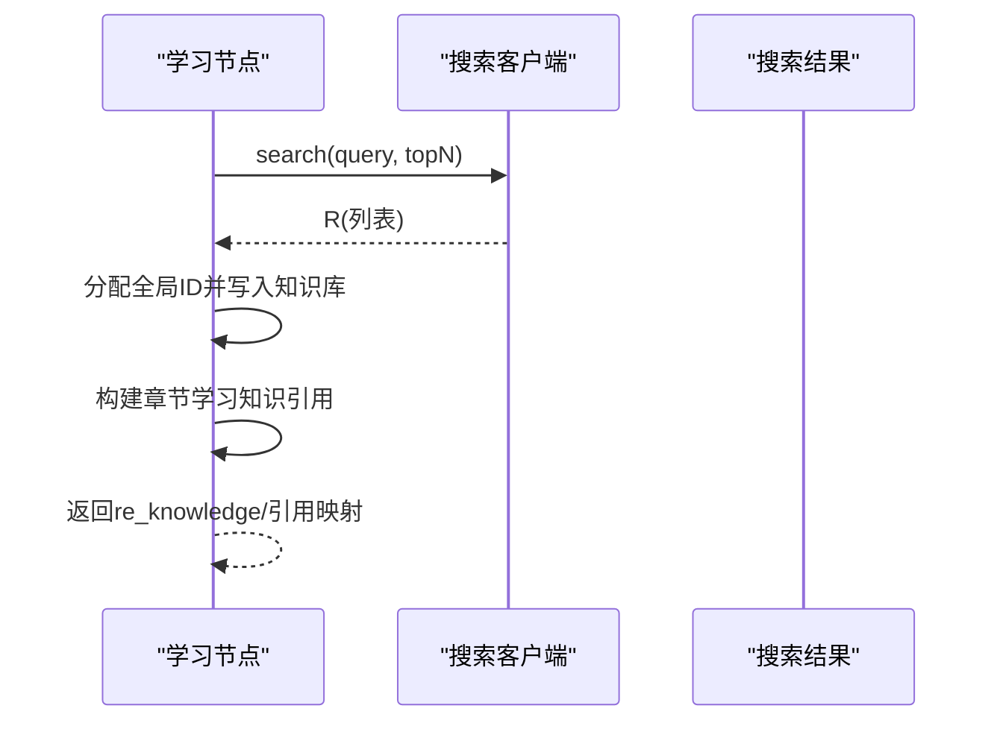
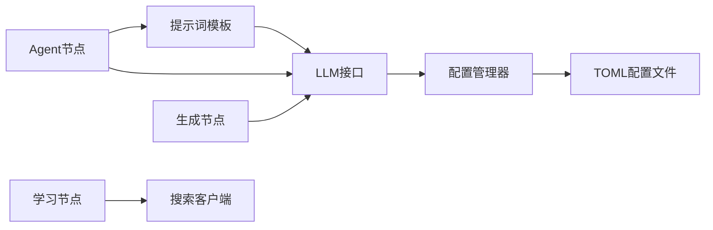

# 组件交互机制

<cite>
**本文档引用的文件**
- [agent.py](file://src/deepresearch/agent/agent.py)
- [deepsearch.py](file://src/deepresearch/agent/deepsearch.py)
- [generate.py](file://src/deepresearch/agent/generate.py)
- [learning.py](file://src/deepresearch/agent/learning.py)
- [message.py](file://src/deepresearch/agent/message.py)
- [outline.py](file://src/deepresearch/agent/outline.py)
- [prep.py](file://src/deepresearch/agent/prep.py)
- [llm.py](file://src/deepresearch/llms/llm.py)
- [template.py](file://src/deepresearch/prompts/template.py)
- [search.py](file://src/deepresearch/tools/search.py)
- [llms_config.py](file://src/deepresearch/config/llms_config.py)
- [search_config.py](file://src/deepresearch/config/search_config.py)
- [workflow_config.py](file://src/deepresearch/config/workflow_config.py)
- [base.py](file://src/deepresearch/config/base.py)
- [llms.toml](file://config/llms.toml)
- [search.toml](file://config/search.toml)
- [workflow.toml](file://config/workflow.toml)
</cite>

## 目录
1. [简介](#简介)
2. [项目结构](#项目结构)
3. [核心组件](#核心组件)
4. [架构总览](#架构总览)
5. [详细组件分析](#详细组件分析)
6. [依赖分析](#依赖分析)
7. [性能考虑](#性能考虑)
8. [故障排查指南](#故障排查指南)
9. [结论](#结论)

## 简介
本文件聚焦于DeepResearch组件间的交互机制，围绕以下目标展开：
- Agent编排器与各工作节点的交互模式：消息传递、状态共享与结果返回
- 配置管理器在系统中的协调作用：配置如何影响组件行为与选择
- 提示词模板系统与LLM接口的交互流程：模板加载、变量注入与响应解析
- 搜索工具与学习节点的数据交换机制：搜索结果如何转化为学习材料
- 组件间通信的时序图与数据流图

## 项目结构
系统采用“分层+职责分离”的组织方式：
- agent层：定义状态图与节点，负责编排与控制流
- llms层：封装LLM调用、缓存与流式输出
- prompts层：动态加载模板、变量注入与消息构造
- tools层：封装搜索引擎客户端与工具
- config层：集中式配置管理与加载
- data层：领域知识与分类数据
- utils层：解析、打印等辅助能力

**图表来源**
- [agent.py:19-45](file://src/deepresearch/agent/agent.py#L19-L45)
- [prep.py:21-80](file://src/deepresearch/agent/prep.py#L21-L80)
- [outline.py:22-118](file://src/deepresearch/agent/outline.py#L22-L118)
- [learning.py:15-93](file://src/deepresearch/agent/learning.py#L15-L93)
- [generate.py:26-111](file://src/deepresearch/agent/generate.py#L26-L111)
- [message.py:101-112](file://src/deepresearch/agent/message.py#L101-L112)
- [llm.py:146-185](file://src/deepresearch/llms/llm.py#L146-L185)
- [template.py:90-129](file://src/deepresearch/prompts/template.py#L90-L129)
- [search.py:12-36](file://src/deepresearch/tools/search.py#L12-L36)
- [base.py:374-456](file://src/deepresearch/config/base.py#L374-L456)
- [llms_config.py:46-85](file://src/deepresearch/config/llms_config.py#L46-L85)
- [search_config.py:56-81](file://src/deepresearch/config/search_config.py#L56-L81)
- [workflow_config.py:7-27](file://src/deepresearch/config/workflow_config.py#L7-L27)

**章节来源**
- [agent.py:19-45](file://src/deepresearch/agent/agent.py#L19-L45)
- [base.py:374-456](file://src/deepresearch/config/base.py#L374-L456)

## 核心组件
- Agent编排器：基于状态图定义节点与边，实现预处理、分类、澄清、大纲检索/生成、学习、报告生成与本地保存的流水线
- 预处理/分类/澄清：根据消息历史进行主题抽取、领域分类与二次确认
- 大纲检索/生成：基于提示词生成搜索查询，执行并聚合知识，再生成结构化大纲
- 学习节点：并发深度搜索、知识抽取、答案生成与评估，构建引用映射
- 报告生成/保存：流式生成报告、工具渲染（表格/图表）、引用替换与本地落盘
- LLM接口：统一的LLM工厂、响应缓存、线程安全与流式输出
- 提示词模板：动态扫描模板目录、变量注入、系统消息拼接
- 搜索工具：引擎选择（Jina/Tavily）、超时与密钥管理
- 配置管理：多源覆盖（环境变量>配置文件>默认值）、验证与脱敏

**章节来源**
- [agent.py:19-45](file://src/deepresearch/agent/agent.py#L19-L45)
- [prep.py:21-80](file://src/deepresearch/agent/prep.py#L21-L80)
- [outline.py:22-118](file://src/deepresearch/agent/outline.py#L22-L118)
- [learning.py:15-93](file://src/deepresearch/agent/learning.py#L15-L93)
- [generate.py:26-111](file://src/deepresearch/agent/generate.py#L26-L111)
- [llm.py:146-185](file://src/deepresearch/llms/llm.py#L146-L185)
- [template.py:90-129](file://src/deepresearch/prompts/template.py#L90-L129)
- [search.py:12-36](file://src/deepresearch/tools/search.py#L12-L36)
- [base.py:374-456](file://src/deepresearch/config/base.py#L374-L456)

## 架构总览
下图展示端到端的组件交互：从用户输入到报告生成与保存。

**图表来源**
- [agent.py:19-45](file://src/deepresearch/agent/agent.py#L19-L45)
- [prep.py:21-80](file://src/deepresearch/agent/prep.py#L21-L80)
- [outline.py:22-118](file://src/deepresearch/agent/outline.py#L22-L118)
- [learning.py:15-93](file://src/deepresearch/agent/learning.py#L15-L93)
- [generate.py:26-111](file://src/deepresearch/agent/generate.py#L26-L111)
- [template.py:90-129](file://src/deepresearch/prompts/template.py#L90-L129)
- [llm.py:146-185](file://src/deepresearch/llms/llm.py#L146-L185)
- [search.py:12-36](file://src/deepresearch/tools/search.py#L12-L36)

## 详细组件分析

### Agent编排器与节点交互
- 状态图定义：从预处理开始，按顺序经过重写、分类、澄清、大纲检索、大纲生成、学习、生成与保存；条件边决定是否保存本地
- 状态共享：通过ReportState携带大纲、消息、主题、领域、逻辑、细节、输出、知识库、最终报告与搜索ID
- 结果返回：每个节点返回增量状态，由编排器合并并驱动下一步

**图表来源**
- [agent.py:19-45](file://src/deepresearch/agent/agent.py#L19-L45)
- [message.py:101-112](file://src/deepresearch/agent/message.py#L101-L112)

**章节来源**
- [agent.py:19-45](file://src/deepresearch/agent/agent.py#L19-L45)
- [message.py:101-112](file://src/deepresearch/agent/message.py#L101-L112)

### 预处理/分类/澄清节点
- 预处理：将混合消息类型转换为标准消息，根据轮次决定后续路径
- 分类：识别领域并加载对应逻辑与细节，若不支持则进入通用节点
- 澄清：一次澄清后决定是否继续或结束

**图表来源**
- [prep.py:21-80](file://src/deepresearch/agent/prep.py#L21-L80)
- [prep.py:105-150](file://src/deepresearch/agent/prep.py#L105-L150)
- [prep.py:153-181](file://src/deepresearch/agent/prep.py#L153-L181)

**章节来源**
- [prep.py:21-80](file://src/deepresearch/agent/prep.py#L21-L80)
- [prep.py:105-150](file://src/deepresearch/agent/prep.py#L105-L150)
- [prep.py:153-181](file://src/deepresearch/agent/prep.py#L153-L181)

### 大纲检索与生成
- 大纲检索：基于提示词生成多个搜索查询，使用受限并发执行搜索，收集知识并分配全局搜索ID
- 大纲生成：将知识与上下文注入模板，流式生成大纲，解析为章节树

**图表来源**
- [outline.py:22-85](file://src/deepresearch/agent/outline.py#L22-L85)
- [outline.py:88-118](file://src/deepresearch/agent/outline.py#L88-L118)
- [template.py:90-129](file://src/deepresearch/prompts/template.py#L90-L129)
- [llm.py:146-185](file://src/deepresearch/llms/llm.py#L146-L185)
- [search.py:12-36](file://src/deepresearch/tools/search.py#L12-L36)

**章节来源**
- [outline.py:22-85](file://src/deepresearch/agent/outline.py#L22-L85)
- [outline.py:88-118](file://src/deepresearch/agent/outline.py#L88-L118)

### 学习节点与深度搜索
- 并发策略：按章节并发执行深度搜索，限制最大工作线程避免LLM过载
- 深度搜索流程：生成搜索查询→并行搜索→抽取知识→生成答案→评估→必要时生成新的研究查询→递归
- 引用映射：将局部搜索ID映射为全局知识库ID，填充章节内的学习知识引用

**图表来源**
- [learning.py:15-93](file://src/deepresearch/agent/learning.py#L15-L93)
- [deepsearch.py:74-149](file://src/deepresearch/agent/deepsearch.py#L74-L149)

**章节来源**
- [learning.py:15-93](file://src/deepresearch/agent/learning.py#L15-L93)
- [deepsearch.py:74-149](file://src/deepresearch/agent/deepsearch.py#L74-L149)

### 报告生成与保存
- 流式生成：逐章节流式生成内容，实时渲染表格/图表，替换引用占位符
- 工具渲染：表格直接解析Markdown，图表通过模板生成ECharts配置并嵌入HTML
- 本地保存：生成Markdown与HTML报告，并追加参考文献列表

**图表来源**
- [generate.py:26-111](file://src/deepresearch/agent/generate.py#L26-L111)
- [generate.py:169-295](file://src/deepresearch/agent/generate.py#L169-L295)
- [template.py:90-129](file://src/deepresearch/prompts/template.py#L90-L129)
- [llm.py:146-185](file://src/deepresearch/llms/llm.py#L146-L185)

**章节来源**
- [generate.py:26-111](file://src/deepresearch/agent/generate.py#L26-L111)
- [generate.py:169-295](file://src/deepresearch/agent/generate.py#L169-L295)

### 提示词模板系统与LLM接口
- 模板加载：动态扫描多个目录，导入模块并提取PROMPT与SYSTEM_PROMPT变量
- 变量注入：使用format_map将state注入模板，支持系统消息与用户消息组合
- LLM调用：统一工厂创建实例，LRU缓存实例与响应，支持流式与非流式两种模式

**图表来源**
- [template.py:25-87](file://src/deepresearch/prompts/template.py#L25-L87)
- [template.py:90-129](file://src/deepresearch/prompts/template.py#L90-L129)
- [llm.py:146-185](file://src/deepresearch/llms/llm.py#L146-L185)

**章节来源**
- [template.py:25-87](file://src/deepresearch/prompts/template.py#L25-L87)
- [template.py:90-129](file://src/deepresearch/prompts/template.py#L90-L129)
- [llm.py:146-185](file://src/deepresearch/llms/llm.py#L146-L185)

### 搜索工具与学习节点的数据交换
- 引擎选择：根据配置选择Jina或Tavily，统一接口返回SearchResult
- 数据交换：学习节点将搜索结果映射为全局知识库条目，章节内学习知识引用替换为全局ID

**图表来源**
- [search.py:12-36](file://src/deepresearch/tools/search.py#L12-L36)
- [learning.py:96-129](file://src/deepresearch/agent/learning.py#L96-L129)

**章节来源**
- [search.py:12-36](file://src/deepresearch/tools/search.py#L12-L36)
- [learning.py:96-129](file://src/deepresearch/agent/learning.py#L96-L129)

## 依赖分析
- 组件耦合：Agent节点依赖提示词模板与LLM接口；学习节点依赖搜索客户端；生成节点依赖工具渲染与LLM接口
- 配置耦合：LLM配置、搜索配置与工作流配置通过配置管理器集中加载，降低硬编码耦合
- 外部依赖：LangChain消息类型、DeepSeek客户端、TOML解析与线程池

**图表来源**
- [agent.py:19-45](file://src/deepresearch/agent/agent.py#L19-L45)
- [template.py:90-129](file://src/deepresearch/prompts/template.py#L90-L129)
- [llm.py:146-185](file://src/deepresearch/llms/llm.py#L146-L185)
- [search.py:12-36](file://src/deepresearch/tools/search.py#L12-L36)
- [base.py:374-456](file://src/deepresearch/config/base.py#L374-L456)

**章节来源**
- [base.py:374-456](file://src/deepresearch/config/base.py#L374-L456)

## 性能考虑
- 并发控制：大纲检索与学习节点均采用受限并发，避免LLM与网络请求过载
- 缓存策略：LLM实例与响应双重缓存，减少重复调用开销
- 流式输出：生成节点采用流式LLM输出，边生成边渲染，提升用户体验
- 模板懒加载：提示词模板按需加载，避免启动时的IO开销

## 故障排查指南
- LLM调用异常：检查LLM配置与密钥，查看缓存统计与错误日志
- 模板缺失变量：确认state中包含模板所需变量，或调整模板
- 搜索失败：检查搜索引擎配置与API密钥，确认超时设置合理
- 配置加载失败：核对TOML文件格式与必需字段，确认配置目录可访问

**章节来源**
- [llm.py:258-266](file://src/deepresearch/llms/llm.py#L258-L266)
- [template.py:117-126](file://src/deepresearch/prompts/template.py#L117-L126)
- [search_config.py:56-81](file://src/deepresearch/config/search_config.py#L56-L81)
- [base.py:459-471](file://src/deepresearch/config/base.py#L459-L471)

## 结论
本系统通过清晰的分层设计与集中式配置管理，实现了从输入到报告生成的完整闭环。Agent编排器以状态图为骨架，结合提示词模板与LLM接口，配合搜索与工具链，形成高效、可扩展的研究流程。配置管理器贯穿全链路，确保行为一致性与可运维性。