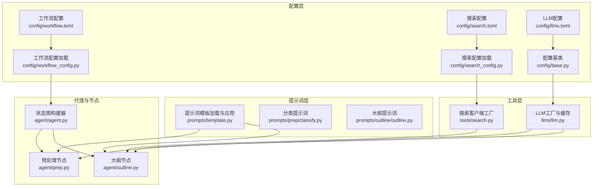
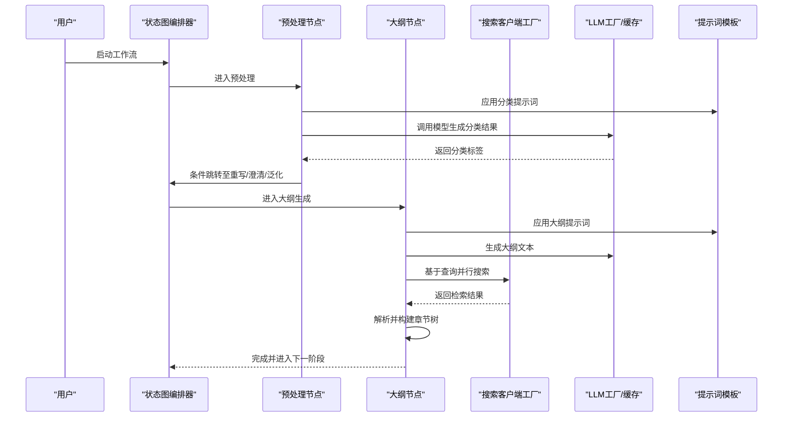
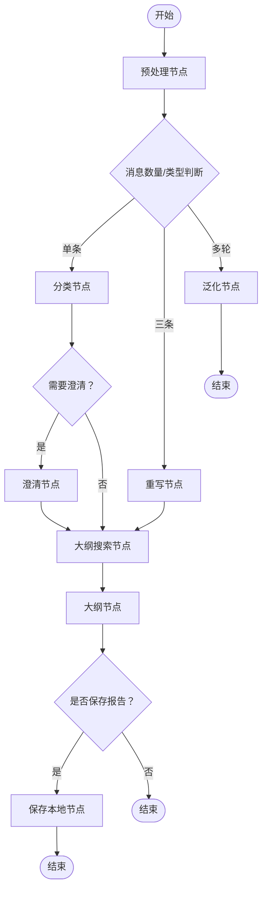
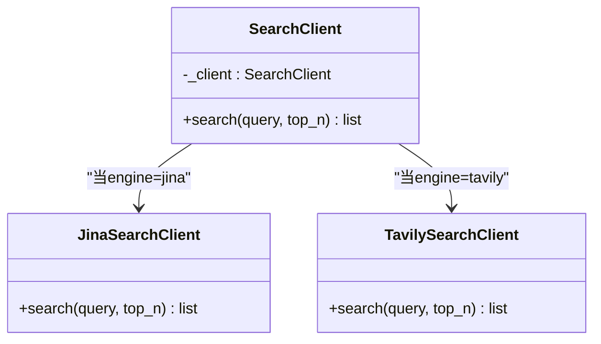
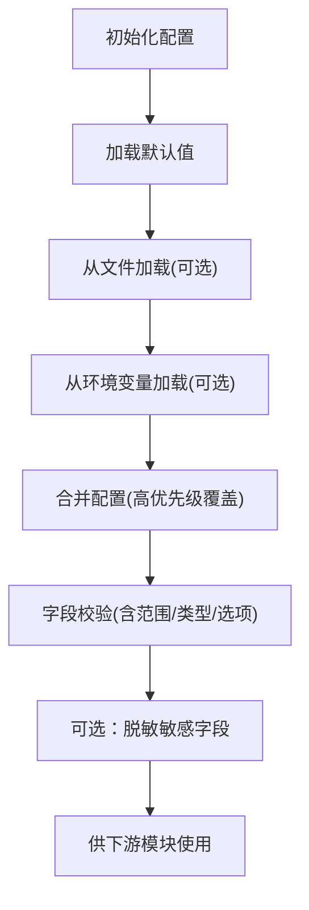
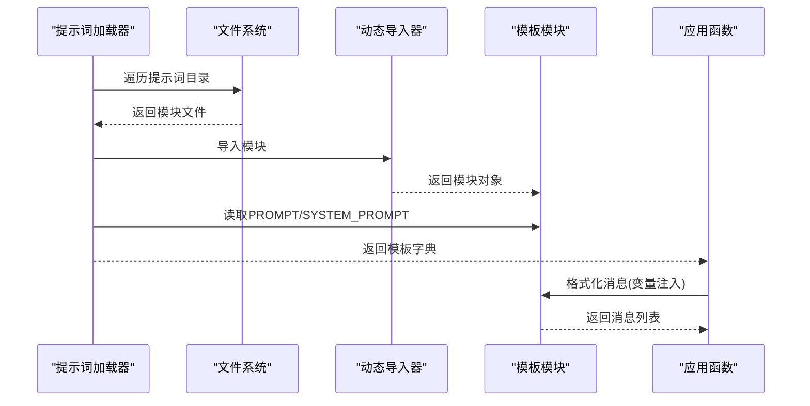
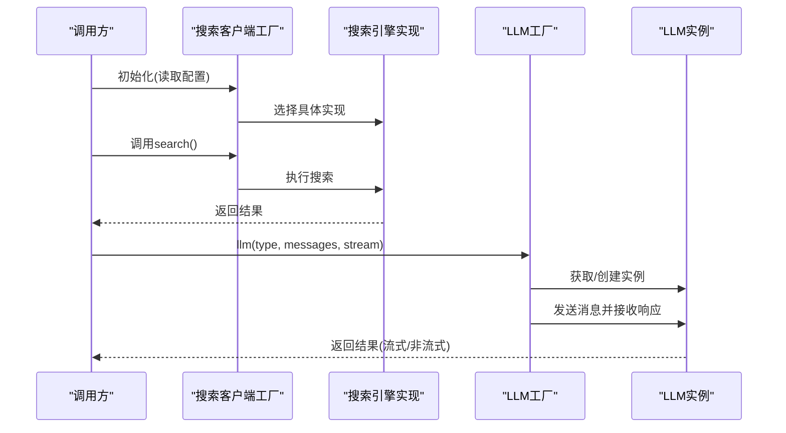
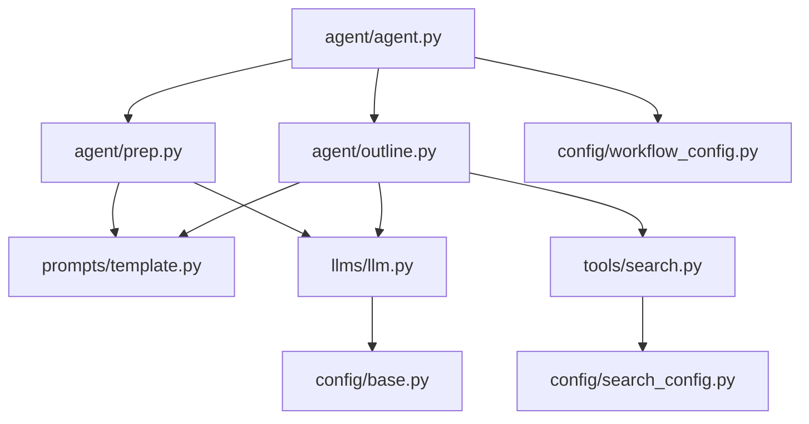

# 设计模式应用

<cite>
**本文引用的文件**
- [src/deepresearch/agent/agent.py](file://src/deepresearch/agent/agent.py)
- [src/deepresearch/agent/prep.py](file://src/deepresearch/agent/prep.py)
- [src/deepresearch/agent/outline.py](file://src/deepresearch/agent/outline.py)
- [src/deepresearch/config/base.py](file://src/deepresearch/config/base.py)
- [src/deepresearch/config/workflow_config.py](file://src/deepresearch/config/workflow_config.py)
- [src/deepresearch/config/search_config.py](file://src/deepresearch/config/search_config.py)
- [src/deepresearch/prompts/template.py](file://src/deepresearch/prompts/template.py)
- [src/deepresearch/prompts/prep/classify.py](file://src/deepresearch/prompts/prep/classify.py)
- [src/deepresearch/prompts/outline/outline.py](file://src/deepresearch/prompts/outline/outline.py)
- [src/deepresearch/llms/llm.py](file://src/deepresearch/llms/llm.py)
- [src/deepresearch/tools/search.py](file://src/deepresearch/tools/search.py)
- [config/workflow.toml](file://config/workflow.toml)
- [config/search.toml](file://config/search.toml)
- [config/llms.toml](file://config/llms.toml)
</cite>

## 目录
1. [引言](#引言)
2. [项目结构](#项目结构)
3. [核心组件](#核心组件)
4. [架构总览](#架构总览)
5. [详细组件分析](#详细组件分析)
6. [依赖分析](#依赖分析)
7. [性能考虑](#性能考虑)
8. [故障排查指南](#故障排查指南)
9. [结论](#结论)
10. [附录](#附录)

## 引言
本文件聚焦于DeepResearch项目中应用的设计模式，围绕以下主题展开：
- 状态图模式（State Graph Pattern）在工作流编排中的应用：状态管理、事件驱动与条件分支。
- 插件化架构模式：通过接口抽象实现功能的动态扩展。
- 配置驱动设计模式：配置文件如何影响系统行为与组件选择。
- 模板方法模式在提示词系统中的体现。
- 工厂模式在搜索客户端与LLM接口中的使用。

目标是帮助读者在不深入源码的前提下，理解系统如何通过这些设计模式实现可扩展、可维护与可配置的智能研究工作流。

## 项目结构
项目采用按职责分层的组织方式：
- 配置层：集中管理各类配置（LLM、搜索、工作流），提供加载、校验与脱敏能力。
- 提示词层：动态加载提示词模板，形成统一的消息格式。
- 工具层：封装外部服务访问（搜索客户端工厂、LLM调用与缓存）。
- 代理与节点：基于LangGraph的状态图编排，串联预处理、规划、学习与生成等节点。
- CLI与工具辅助：命令行入口、历史记录、UI与实用工具。

图表来源
- [src/deepresearch/agent/agent.py:19-45](file://src/deepresearch/agent/agent.py#L19-L45)
- [src/deepresearch/agent/prep.py:21-202](file://src/deepresearch/agent/prep.py#L21-L202)
- [src/deepresearch/agent/outline.py:22-227](file://src/deepresearch/agent/outline.py#L22-L227)
- [src/deepresearch/config/workflow_config.py:7-28](file://src/deepresearch/config/workflow_config.py#L7-L28)
- [src/deepresearch/config/search_config.py:56-82](file://src/deepresearch/config/search_config.py#L56-L82)
- [src/deepresearch/prompts/template.py:25-130](file://src/deepresearch/prompts/template.py#L25-L130)
- [src/deepresearch/llms/llm.py:24-308](file://src/deepresearch/llms/llm.py#L24-L308)
- [src/deepresearch/tools/search.py:12-46](file://src/deepresearch/tools/search.py#L12-L46)

章节来源
- [src/deepresearch/agent/agent.py:19-45](file://src/deepresearch/agent/agent.py#L19-L45)
- [src/deepresearch/config/base.py:190-590](file://src/deepresearch/config/base.py#L190-L590)
- [src/deepresearch/prompts/template.py:25-130](file://src/deepresearch/prompts/template.py#L25-L130)
- [src/deepresearch/llms/llm.py:24-308](file://src/deepresearch/llms/llm.py#L24-L308)
- [src/deepresearch/tools/search.py:12-46](file://src/deepresearch/tools/search.py#L12-L46)

## 核心组件
- 状态图构建器：负责声明状态、节点与边，包含条件分支与结束节点，形成端到端工作流。
- 预处理节点：根据消息轮次与类型进行分流，决定后续路径。
- 大纲节点：结合提示词模板与搜索结果生成报告大纲。
- 搜索客户端工厂：依据配置选择具体搜索引擎实现。
- LLM工厂与缓存：统一LLM实例创建、响应缓存与线程安全访问。
- 配置管理：提供多源配置加载、校验、合并与脱敏。

章节来源
- [src/deepresearch/agent/agent.py:19-45](file://src/deepresearch/agent/agent.py#L19-L45)
- [src/deepresearch/agent/prep.py:21-202](file://src/deepresearch/agent/prep.py#L21-L202)
- [src/deepresearch/agent/outline.py:22-227](file://src/deepresearch/agent/outline.py#L22-L227)
- [src/deepresearch/tools/search.py:12-46](file://src/deepresearch/tools/search.py#L12-L46)
- [src/deepresearch/llms/llm.py:24-308](file://src/deepresearch/llms/llm.py#L24-L308)
- [src/deepresearch/config/base.py:190-590](file://src/deepresearch/config/base.py#L190-L590)

## 架构总览
下图展示从配置到节点执行的端到端流程，强调状态图编排、提示词模板应用、搜索与LLM调用之间的协作关系。

图表来源
- [src/deepresearch/agent/agent.py:19-45](file://src/deepresearch/agent/agent.py#L19-L45)
- [src/deepresearch/agent/prep.py:21-202](file://src/deepresearch/agent/prep.py#L21-L202)
- [src/deepresearch/agent/outline.py:22-227](file://src/deepresearch/agent/outline.py#L22-L227)
- [src/deepresearch/prompts/template.py:90-130](file://src/deepresearch/prompts/template.py#L90-L130)
- [src/deepresearch/tools/search.py:12-46](file://src/deepresearch/tools/search.py#L12-L46)
- [src/deepresearch/llms/llm.py:146-308](file://src/deepresearch/llms/llm.py#L146-L308)

## 详细组件分析

### 状态图模式（State Graph Pattern）
- 状态管理：以统一的状态对象承载消息与中间结果，节点间通过Command或返回值更新状态并切换下一节点。
- 事件驱动：节点根据输入状态与业务规则决定下一步动作；条件边在生成节点处根据保存策略决定是否结束。
- 条件分支：预处理节点依据消息数量与类型进行分流；大纲生成节点根据解析结果决定输出或结束。

图表来源
- [src/deepresearch/agent/agent.py:19-45](file://src/deepresearch/agent/agent.py#L19-L45)
- [src/deepresearch/agent/prep.py:21-80](file://src/deepresearch/agent/prep.py#L21-L80)
- [src/deepresearch/agent/outline.py:88-119](file://src/deepresearch/agent/outline.py#L88-L119)

章节来源
- [src/deepresearch/agent/agent.py:19-45](file://src/deepresearch/agent/agent.py#L19-L45)
- [src/deepresearch/agent/prep.py:21-202](file://src/deepresearch/agent/prep.py#L21-L202)
- [src/deepresearch/agent/outline.py:22-227](file://src/deepresearch/agent/outline.py#L22-L227)

### 插件化架构模式（接口抽象与动态扩展）
- 搜索客户端插件：通过工厂类根据配置选择具体实现，新增搜索引擎只需实现一致接口并接入工厂分支。
- LLM插件：通过LLM类型映射到不同配置集，便于替换底层模型供应商或切换推理模式。

图表来源
- [src/deepresearch/tools/search.py:12-46](file://src/deepresearch/tools/search.py#L12-L46)
- [src/deepresearch/config/search_config.py:56-82](file://src/deepresearch/config/search_config.py#L56-L82)

章节来源
- [src/deepresearch/tools/search.py:12-46](file://src/deepresearch/tools/search.py#L12-L46)
- [src/deepresearch/config/search_config.py:12-82](file://src/deepresearch/config/search_config.py#L12-L82)

### 配置驱动设计模式
- 配置来源与优先级：默认值 → 文件 → 环境变量 → 代码参数，逐层覆盖。
- 动态加载与合并：配置管理器支持注册加载器、懒加载与缓存清理，确保运行时可热更新。
- 脱敏与安全：对敏感字段进行脱敏输出，支持自定义敏感键集合。
- 工作流与搜索配置：通过TOML文件控制搜索并发与超时、选择搜索引擎与API密钥。

图表来源
- [src/deepresearch/config/base.py:224-590](file://src/deepresearch/config/base.py#L224-L590)
- [src/deepresearch/config/workflow_config.py:7-28](file://src/deepresearch/config/workflow_config.py#L7-L28)
- [src/deepresearch/config/search_config.py:56-82](file://src/deepresearch/config/search_config.py#L56-L82)

章节来源
- [src/deepresearch/config/base.py:190-590](file://src/deepresearch/config/base.py#L190-L590)
- [config/workflow.toml:1-3](file://config/workflow.toml#L1-L3)
- [config/search.toml:1-6](file://config/search.toml#L1-L6)
- [config/llms.toml:1-29](file://config/llms.toml#L1-L29)

### 模板方法模式在提示词系统中的应用
- 统一加载与应用：提示词模板通过扫描目录动态导入模块，提取变量并格式化为消息列表。
- 可插拔提示词：新增提示词无需改动核心逻辑，只需在对应子目录下新增模块并导出变量即可被系统识别与应用。
- 分层提示词：按功能域（prep/outline/generate/learning）组织，便于维护与复用。

图表来源
- [src/deepresearch/prompts/template.py:25-130](file://src/deepresearch/prompts/template.py#L25-L130)
- [src/deepresearch/prompts/prep/classify.py:1-48](file://src/deepresearch/prompts/prep/classify.py#L1-L48)
- [src/deepresearch/prompts/outline/outline.py:1-68](file://src/deepresearch/prompts/outline/outline.py#L1-L68)

章节来源
- [src/deepresearch/prompts/template.py:25-130](file://src/deepresearch/prompts/template.py#L25-L130)
- [src/deepresearch/prompts/prep/classify.py:1-48](file://src/deepresearch/prompts/prep/classify.py#L1-L48)
- [src/deepresearch/prompts/outline/outline.py:1-68](file://src/deepresearch/prompts/outline/outline.py#L1-L68)

### 工厂模式在搜索客户端与LLM接口中的使用
- 搜索客户端工厂：根据配置选择具体搜索引擎实现，屏蔽外部差异。
- LLM工厂：统一创建与缓存LLM实例，支持流式与非流式响应、响应缓存与统计。

图表来源
- [src/deepresearch/tools/search.py:12-46](file://src/deepresearch/tools/search.py#L12-L46)
- [src/deepresearch/llms/llm.py:24-308](file://src/deepresearch/llms/llm.py#L24-L308)

章节来源
- [src/deepresearch/tools/search.py:12-46](file://src/deepresearch/tools/search.py#L12-L46)
- [src/deepresearch/llms/llm.py:24-308](file://src/deepresearch/llms/llm.py#L24-L308)

## 依赖分析
- 组件耦合与内聚：状态图编排器与节点之间通过状态对象解耦；提示词与LLM通过统一的消息接口耦合；搜索客户端通过工厂降低对外部实现的耦合。
- 外部依赖：LangGraph用于状态图编排；LangChain用于消息格式与模型交互；第三方搜索服务与LLM供应商。
- 配置驱动：工作流并发与搜索参数、引擎选择与API密钥均来自配置文件，便于运维与灰度发布。

图表来源
- [src/deepresearch/agent/agent.py:19-45](file://src/deepresearch/agent/agent.py#L19-L45)
- [src/deepresearch/agent/prep.py:21-202](file://src/deepresearch/agent/prep.py#L21-L202)
- [src/deepresearch/agent/outline.py:22-227](file://src/deepresearch/agent/outline.py#L22-L227)
- [src/deepresearch/prompts/template.py:25-130](file://src/deepresearch/prompts/template.py#L25-L130)
- [src/deepresearch/tools/search.py:12-46](file://src/deepresearch/tools/search.py#L12-L46)
- [src/deepresearch/llms/llm.py:24-308](file://src/deepresearch/llms/llm.py#L24-L308)
- [src/deepresearch/config/search_config.py:56-82](file://src/deepresearch/config/search_config.py#L56-L82)
- [src/deepresearch/config/workflow_config.py:7-28](file://src/deepresearch/config/workflow_config.py#L7-L28)
- [src/deepresearch/config/base.py:190-590](file://src/deepresearch/config/base.py#L190-L590)

章节来源
- [src/deepresearch/agent/agent.py:19-45](file://src/deepresearch/agent/agent.py#L19-L45)
- [src/deepresearch/config/base.py:190-590](file://src/deepresearch/config/base.py#L190-L590)

## 性能考虑
- 并发搜索：大纲生成阶段使用有界线程池并发执行多个查询，提升吞吐同时避免资源耗尽。
- LLM实例缓存：对LLM实例与响应分别进行LRU缓存，减少重复初始化与网络调用开销。
- 流式输出：LLM支持流式响应，前端可渐进式渲染，改善用户体验。
- 配置缓存：TOML文件读取使用缓存，避免频繁磁盘IO。

章节来源
- [src/deepresearch/agent/outline.py:42-85](file://src/deepresearch/agent/outline.py#L42-L85)
- [src/deepresearch/llms/llm.py:24-308](file://src/deepresearch/llms/llm.py#L24-L308)
- [src/deepresearch/config/base.py:459-485](file://src/deepresearch/config/base.py#L459-L485)

## 故障排查指南
- 配置加载失败：检查配置文件是否存在、格式是否正确、字段是否满足校验规则；确认环境变量命名与前缀是否符合约定。
- 搜索引擎异常：确认配置中engine字段与可用实现匹配；核对API密钥与超时设置；查看工厂分支逻辑。
- LLM调用异常：检查消息格式是否正确；确认LLM类型在配置中存在；关注缓存命中率与空响应日志。
- 提示词缺失变量：应用提示词时若出现变量缺失，需在状态中补齐所需字段或修正模板。

章节来源
- [src/deepresearch/config/base.py:15-83](file://src/deepresearch/config/base.py#L15-L83)
- [src/deepresearch/tools/search.py:18-24](file://src/deepresearch/tools/search.py#L18-L24)
- [src/deepresearch/llms/llm.py:132-256](file://src/deepresearch/llms/llm.py#L132-L256)
- [src/deepresearch/prompts/template.py:104-129](file://src/deepresearch/prompts/template.py#L104-L129)

## 结论
本项目通过状态图模式实现清晰的工作流编排，借助插件化架构与配置驱动设计实现了高度可扩展与可维护的系统。模板方法模式使提示词系统易于扩展，工厂模式则在搜索与LLM层面提供了稳定的抽象与灵活的替换能力。整体架构在保证功能完整性的同时，兼顾了性能与可运维性。

## 附录
- 关键配置文件位置与用途
  - 工作流配置：用于控制搜索并发与结果数量等参数。
  - 搜索配置：用于选择搜索引擎与设置API密钥及超时。
  - LLM配置：用于定义不同推理角色对应的模型参数。

章节来源
- [config/workflow.toml:1-3](file://config/workflow.toml#L1-L3)
- [config/search.toml:1-6](file://config/search.toml#L1-L6)
- [config/llms.toml:1-29](file://config/llms.toml#L1-L29)