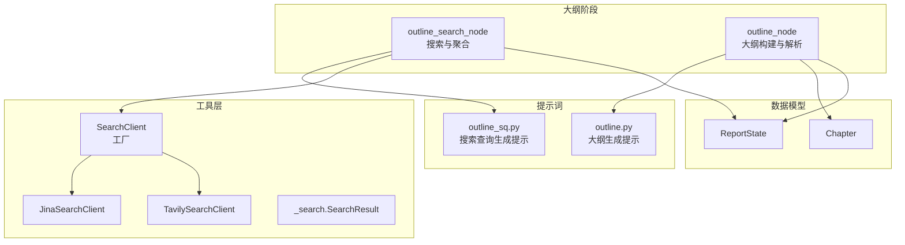
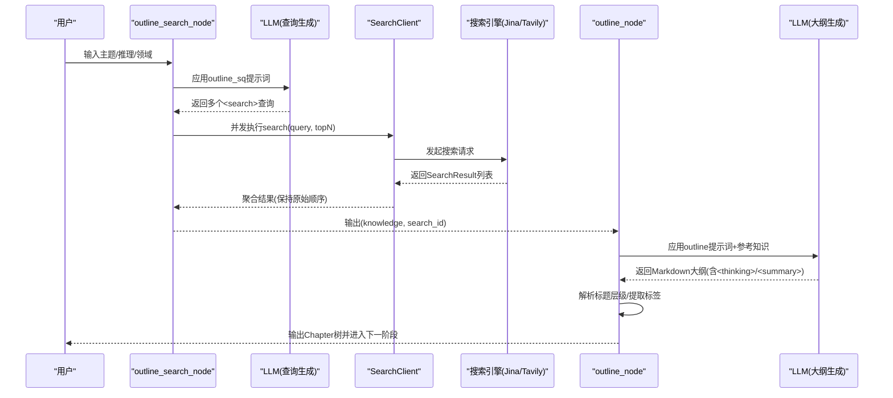
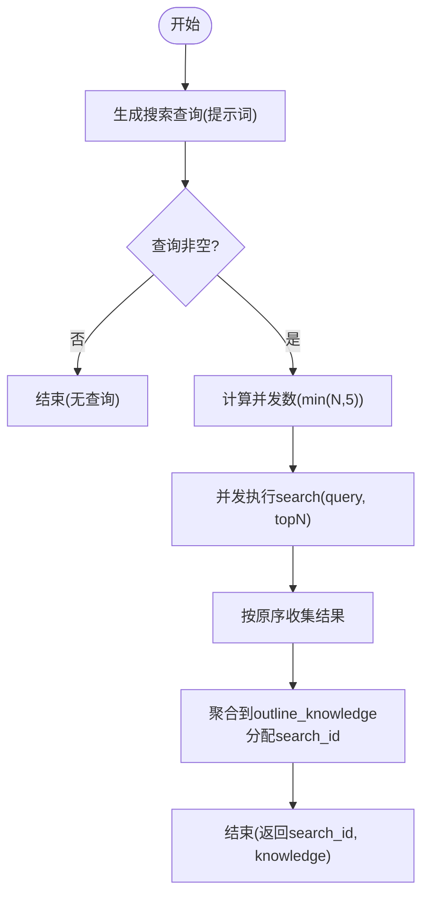
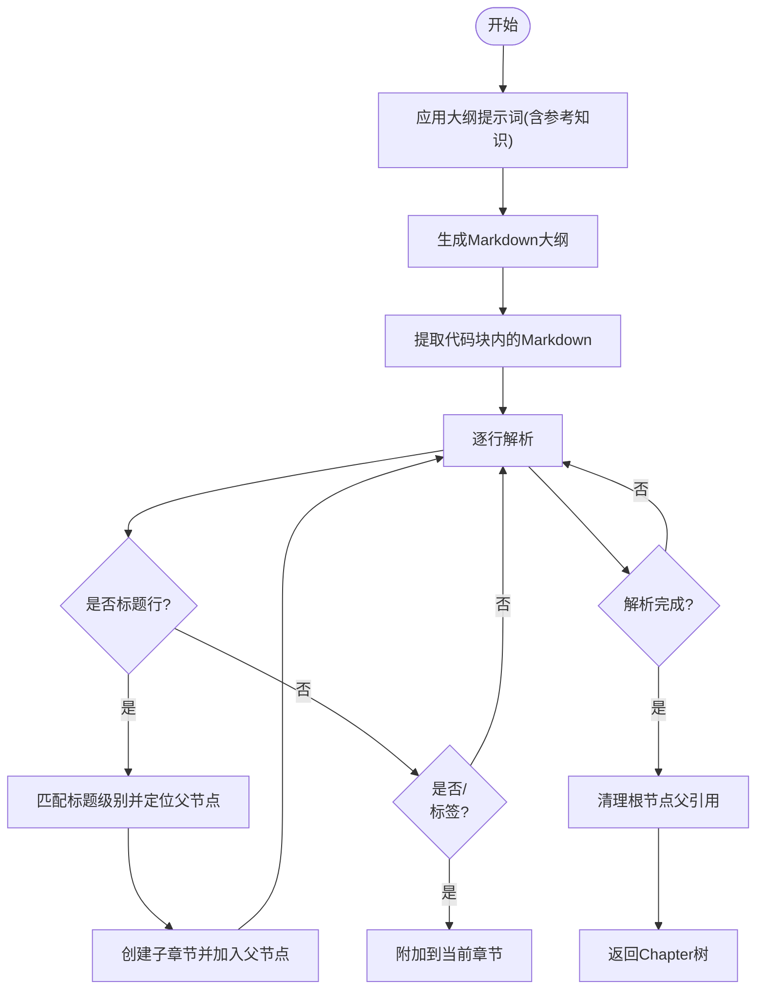
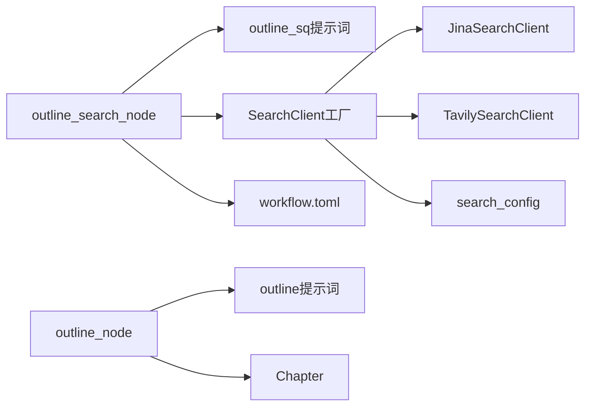

# 大纲生成节点

<cite>
**本文档引用的文件**
- [src/deepresearch/agent/outline.py](file://src/deepresearch/agent/outline.py)
- [src/deepresearch/prompts/outline/outline.py](file://src/deepresearch/prompts/outline/outline.py)
- [src/deepresearch/prompts/outline/outline_sq.py](file://src/deepresearch/prompts/outline/outline_sq.py)
- [src/deepresearch/tools/search.py](file://src/deepresearch/tools/search.py)
- [src/deepresearch/tools/_search.py](file://src/deepresearch/tools/_search.py)
- [src/deepresearch/tools/_jina.py](file://src/deepresearch/tools/_jina.py)
- [src/deepresearch/tools/_tavily.py](file://src/deepresearch/tools/_tavily.py)
- [src/deepresearch/utils/parse_model_res.py](file://src/deepresearch/utils/parse_model_res.py)
- [src/deepresearch/agent/message.py](file://src/deepresearch/agent/message.py)
- [src/deepresearch/config/search_config.py](file://src/deepresearch/config/search_config.py)
- [config/workflow.toml](file://config/workflow.toml)
- [config/search.toml](file://config/search.toml)
</cite>

## 目录
1. [简介](#简介)
2. [项目结构](#项目结构)
3. [核心组件](#核心组件)
4. [架构总览](#架构总览)
5. [详细组件分析](#详细组件分析)
6. [依赖分析](#依赖分析)
7. [性能考虑](#性能考虑)
8. [故障排查指南](#故障排查指南)
9. [结论](#结论)
10. [附录](#附录)

## 简介
本文件聚焦“大纲生成节点”的技术实现，围绕以下目标展开：
- outline_search_node 的搜索策略与结果聚合机制
- outline_node 的大纲构建算法与结构化处理流程
- 搜索结果的筛选标准与排序逻辑
- 大纲节点的递归构建过程与层级关系维护
- 搜索关键词生成、结果去重与质量评估的实现细节
- 搜索优化技巧与性能调优建议

## 项目结构
大纲生成节点位于智能研究工作流的“大纲阶段”，由两个核心节点组成：
- outline_search_node：负责基于用户主题与推理过程生成多条搜索查询，并并发执行搜索，聚合检索结果
- outline_node：基于检索知识与提示词模板生成结构化大纲，解析为章节树并进入后续学习阶段

图表来源
- [src/deepresearch/agent/outline.py:22-85](file://src/deepresearch/agent/outline.py#L22-L85)
- [src/deepresearch/agent/outline.py:88-118](file://src/deepresearch/agent/outline.py#L88-L118)
- [src/deepresearch/tools/search.py:12-36](file://src/deepresearch/tools/search.py#L12-L36)
- [src/deepresearch/tools/_jina.py:15-79](file://src/deepresearch/tools/_jina.py#L15-L79)
- [src/deepresearch/tools/_tavily.py:15-60](file://src/deepresearch/tools/_tavily.py#L15-L60)
- [src/deepresearch/prompts/outline/outline_sq.py:11-43](file://src/deepresearch/prompts/outline/outline_sq.py#L11-L43)
- [src/deepresearch/prompts/outline/outline.py:14-67](file://src/deepresearch/prompts/outline/outline.py#L14-L67)
- [src/deepresearch/agent/message.py:18-55](file://src/deepresearch/agent/message.py#L18-L55)

章节来源
- [src/deepresearch/agent/outline.py:22-118](file://src/deepresearch/agent/outline.py#L22-L118)
- [src/deepresearch/tools/search.py:12-36](file://src/deepresearch/tools/search.py#L12-L36)

## 核心组件
- outline_search_node：生成搜索查询、并发搜索、有序聚合、分配唯一 search_id
- outline_node：调用大模型生成大纲、解析 Markdown 标题层级、提取 summary/thinking、构建章节树
- Chapter：章节树的数据模型，支持层级关系、引用合并与知识序列化
- SearchClient 工厂：根据配置选择 Jina 或 Tavily 引擎，统一对外接口
- 提示词模板：搜索查询生成与大纲生成的提示词，约束输出格式与质量要求

章节来源
- [src/deepresearch/agent/outline.py:22-118](file://src/deepresearch/agent/outline.py#L22-L118)
- [src/deepresearch/agent/message.py:18-55](file://src/deepresearch/agent/message.py#L18-L55)
- [src/deepresearch/tools/search.py:12-36](file://src/deepresearch/tools/search.py#L12-L36)
- [src/deepresearch/prompts/outline/outline_sq.py:11-43](file://src/deepresearch/prompts/outline/outline_sq.py#L11-L43)
- [src/deepresearch/prompts/outline/outline.py:14-67](file://src/deepresearch/prompts/outline/outline.py#L14-L67)

## 架构总览
大纲生成节点的端到端流程如下：

图表来源
- [src/deepresearch/agent/outline.py:22-85](file://src/deepresearch/agent/outline.py#L22-L85)
- [src/deepresearch/agent/outline.py:88-118](file://src/deepresearch/agent/outline.py#L88-L118)
- [src/deepresearch/prompts/outline/outline_sq.py:11-43](file://src/deepresearch/prompts/outline/outline_sq.py#L11-L43)
- [src/deepresearch/prompts/outline/outline.py:14-67](file://src/deepresearch/prompts/outline/outline.py#L14-L67)
- [src/deepresearch/tools/search.py:12-36](file://src/deepresearch/tools/search.py#L12-L36)
- [src/deepresearch/tools/_jina.py:28-79](file://src/deepresearch/tools/_jina.py#L28-L79)
- [src/deepresearch/tools/_tavily.py:21-60](file://src/deepresearch/tools/_tavily.py#L21-L60)

## 详细组件分析

### outline_search_node：搜索策略与结果聚合
- 关键职责
  - 基于提示词模板生成多条搜索查询（每个查询包裹在特定标签内）
  - 并发执行搜索，最大并发数受查询数量与阈值限制
  - 保持原始查询顺序，按顺序写入聚合知识库，同时分配连续的 search_id
- 搜索策略
  - 查询生成：使用专门的提示词模板，强调准确性、时效性、覆盖度、简洁性与相关性
  - 引擎选择：通过工厂类根据配置动态选择 Jina 或 Tavily
  - 结果截取：每条查询返回固定数量的结果（受工作流配置控制）
- 聚合机制
  - 有序收集：使用线程安全的数组与索引映射，确保最终顺序与查询顺序一致
  - 去重与限流：通过 search_id 保证全局唯一；topN 限制单查询结果数量
  - 数据结构：将检索结果转换为统一的知识项（包含内容与来源链接），便于后续阶段使用

图表来源
- [src/deepresearch/agent/outline.py:22-85](file://src/deepresearch/agent/outline.py#L22-L85)
- [src/deepresearch/prompts/outline/outline_sq.py:11-43](file://src/deepresearch/prompts/outline/outline_sq.py#L11-L43)
- [src/deepresearch/tools/search.py:12-36](file://src/deepresearch/tools/search.py#L12-L36)
- [config/workflow.toml:1-2](file://config/workflow.toml#L1-L2)

章节来源
- [src/deepresearch/agent/outline.py:22-85](file://src/deepresearch/agent/outline.py#L22-L85)
- [src/deepresearch/prompts/outline/outline_sq.py:11-43](file://src/deepresearch/prompts/outline/outline_sq.py#L11-L43)
- [src/deepresearch/tools/search.py:12-36](file://src/deepresearch/tools/search.py#L12-L36)
- [config/workflow.toml:1-2](file://config/workflow.toml#L1-L2)

### outline_node：大纲构建算法与结构化处理
- 关键职责
  - 调用大模型生成结构化大纲（仅 Markdown），包含章节标题、summary 与 thinking
  - 解析输出，构建章节树（Chapter），维护父子层级关系
  - 将解析失败的情况回退至结束状态，避免流程中断
- 大纲构建算法
  - 输入：领域、主题、推理、细节、参考知识（截断后的 JSON 字符串）
  - 输出：Markdown 大纲（严格遵循提示词约束）
  - 解析：正则提取代码块中的 Markdown；按标题层级构建章节树；为每个节点补充 thinking 与 summary
- 结构化处理流程
  - 标题解析：使用正则匹配标题级别（# 数量），自动推导父子关系
  - 层级维护：通过栈式推进与回溯，确保父子关系正确
  - 根节点清理：移除根节点的父引用，保证输出树的合法性
  - 错误处理：若未解析出有效章节，抛出异常并终止当前流程

图表来源
- [src/deepresearch/agent/outline.py:88-118](file://src/deepresearch/agent/outline.py#L88-L118)
- [src/deepresearch/agent/outline.py:158-220](file://src/deepresearch/agent/outline.py#L158-L220)
- [src/deepresearch/prompts/outline/outline.py:14-67](file://src/deepresearch/prompts/outline/outline.py#L14-L67)

章节来源
- [src/deepresearch/agent/outline.py:88-118](file://src/deepresearch/agent/outline.py#L88-L118)
- [src/deepresearch/agent/outline.py:158-220](file://src/deepresearch/agent/outline.py#L158-L220)
- [src/deepresearch/prompts/outline/outline.py:14-67](file://src/deepresearch/prompts/outline/outline.py#L14-L67)

### 搜索结果筛选与排序逻辑
- 筛选标准
  - URL 去重：在深度搜索中，使用集合记录已见过的 URL，避免重复收录
  - 有效性校验：跳过空 URL 的结果
  - 配额控制：单查询 topN 受工作流配置控制，避免超载
- 排序逻辑
  - 引擎内部排序：由搜索引擎决定结果排序
  - 外部排序：当前实现不进行二次排序，保持引擎返回顺序
- 截断与聚合
  - outline_search_node 聚合时保持原始顺序，通过 search_id 维护全局唯一性
  - 知识转字符串时按长度截断，避免上下文溢出

章节来源
- [src/deepresearch/agent/outline.py:22-85](file://src/deepresearch/agent/outline.py#L22-L85)
- [src/deepresearch/agent/outline.py:121-152](file://src/deepresearch/agent/outline.py#L121-L152)
- [src/deepresearch/agent/deepsearch.py:103-121](file://src/deepresearch/agent/deepsearch.py#L103-L121)
- [config/workflow.toml:1-2](file://config/workflow.toml#L1-L2)

### 大纲节点递归构建与层级关系维护
- 递归构建
  - outline_node 仅解析当前轮次的大纲输出，不进行递归生成
  - 若需更深层级，应在提示词或上层流程中设计分层策略
- 层级关系维护
  - 使用正则匹配标题级别，通过回溯父节点确保层级正确
  - 根节点清理后，输出树的根为首个有效章节
- 数据模型
  - Chapter 支持子章节列表、父节点指针、思考与摘要字段
  - 提供知识序列化与引用合并能力，便于后续学习阶段复用

章节来源
- [src/deepresearch/agent/outline.py:158-220](file://src/deepresearch/agent/outline.py#L158-L220)
- [src/deepresearch/agent/message.py:18-55](file://src/deepresearch/agent/message.py#L18-L55)

### 搜索关键词生成、结果去重与质量评估
- 关键词生成
  - 使用专用提示词模板生成多条查询，每条查询被包裹在特定标签内
  - 通过 LRU 缓存编译正则表达式，提升标签提取效率
- 结果去重
  - 在深度搜索场景中，使用集合记录已见 URL，避免重复
  - outline_search_node 通过 search_id 保证全局唯一性
- 质量评估
  - 当前大纲阶段不包含质量评估逻辑；质量评估主要体现在深度搜索阶段的多维度评估
  - 如需在大纲阶段引入评估，可在提示词中增加评分与理由字段，并在解析阶段读取

章节来源
- [src/deepresearch/prompts/outline/outline_sq.py:11-43](file://src/deepresearch/prompts/outline/outline_sq.py#L11-L43)
- [src/deepresearch/utils/parse_model_res.py:7-27](file://src/deepresearch/utils/parse_model_res.py#L7-L27)
- [src/deepresearch/agent/outline.py:22-85](file://src/deepresearch/agent/outline.py#L22-L85)
- [src/deepresearch/agent/deepsearch.py:351-390](file://src/deepresearch/agent/deepsearch.py#L351-L390)

## 依赖分析
- 组件耦合
  - outline_search_node 依赖提示词模板、SearchClient 工厂与配置模块
  - outline_node 依赖提示词模板、Chapter 数据模型与解析工具
- 外部依赖
  - JinaSearchClient 与 TavilySearchClient 分别封装不同搜索引擎的访问方式
  - SearchClient 工厂根据配置动态选择具体实现
- 配置依赖
  - 引擎类型、超时时间、API Key 等由配置文件加载
  - 工作流配置控制每查询返回结果数量

图表来源
- [src/deepresearch/agent/outline.py:22-118](file://src/deepresearch/agent/outline.py#L22-L118)
- [src/deepresearch/tools/search.py:12-36](file://src/deepresearch/tools/search.py#L12-L36)
- [src/deepresearch/tools/_jina.py:15-79](file://src/deepresearch/tools/_jina.py#L15-L79)
- [src/deepresearch/tools/_tavily.py:15-60](file://src/deepresearch/tools/_tavily.py#L15-L60)
- [src/deepresearch/config/search_config.py:56-81](file://src/deepresearch/config/search_config.py#L56-L81)
- [config/workflow.toml:1-2](file://config/workflow.toml#L1-L2)

章节来源
- [src/deepresearch/agent/outline.py:22-118](file://src/deepresearch/agent/outline.py#L22-L118)
- [src/deepresearch/tools/search.py:12-36](file://src/deepresearch/tools/search.py#L12-L36)
- [src/deepresearch/config/search_config.py:56-81](file://src/deepresearch/config/search_config.py#L56-L81)
- [config/search.toml:1-6](file://config/search.toml#L1-L6)

## 性能考虑
- 并发搜索
  - 最大并发数限制为查询数量与阈值的较小者，避免过度并发导致资源争用
  - 使用线程池与 as_completed 保证结果顺序与稳定性
- 上下文截断
  - 将知识转为字符串时按长度截断，防止上下文超限影响模型性能
- 正则缓存
  - 对标签提取使用的正则表达式进行 LRU 缓存，减少重复编译开销
- 引擎选择
  - 根据配置切换搜索引擎，结合超时参数平衡响应速度与质量
- 建议
  - 合理设置每查询 topN，避免过多结果导致解析与传输成本上升
  - 在高并发场景下适当降低并发上限，结合监控指标动态调整

章节来源
- [src/deepresearch/agent/outline.py:42-85](file://src/deepresearch/agent/outline.py#L42-L85)
- [src/deepresearch/agent/outline.py:121-152](file://src/deepresearch/agent/outline.py#L121-L152)
- [src/deepresearch/utils/parse_model_res.py:7-27](file://src/deepresearch/utils/parse_model_res.py#L7-L27)
- [src/deepresearch/config/search_config.py:12-53](file://src/deepresearch/config/search_config.py#L12-L53)

## 故障排查指南
- 搜索无结果
  - 检查查询生成是否成功，确认提示词模板返回了包裹在标签内的查询
  - 核对引擎配置与 API Key 是否正确
  - 查看超时日志，必要时增大超时时间
- 结果重复或顺序错乱
  - 确认并发执行与结果收集逻辑未被外部修改
  - 检查 search_id 分配与聚合顺序
- 大纲解析失败
  - 确认输出严格为 Markdown 且包含标题
  - 检查提示词约束是否被遵守（仅输出大纲，不包含其他内容）
- 引擎错误
  - Jina：关注超时与 HTTP 状态码
  - Tavily：关注客户端异常与返回结构

章节来源
- [src/deepresearch/agent/outline.py:22-118](file://src/deepresearch/agent/outline.py#L22-L118)
- [src/deepresearch/tools/_jina.py:71-79](file://src/deepresearch/tools/_jina.py#L71-L79)
- [src/deepresearch/tools/_tavily.py:57-60](file://src/deepresearch/tools/_tavily.py#L57-L60)

## 结论
大纲生成节点通过“查询生成—并发搜索—有序聚合—结构化解析”形成闭环，既保证了搜索的覆盖面与时效性，又确保了大纲结构的层次清晰与可扩展。结合配置化的搜索引擎与上下文截断策略，能够在不同规模与复杂度的任务中稳定运行。为进一步提升质量，可在大纲阶段引入轻量级的质量评估与去重策略，并持续优化提示词模板与并发参数。

## 附录
- 配置文件位置与关键项
  - 搜索引擎配置：包含引擎类型、超时、API Key
  - 工作流配置：控制每查询返回结果数量
- 数据模型要点
  - SearchResult：统一的搜索结果结构
  - Chapter：章节树的核心数据结构，支持层级与引用管理

章节来源
- [config/search.toml:1-6](file://config/search.toml#L1-L6)
- [config/workflow.toml:1-2](file://config/workflow.toml#L1-L2)
- [src/deepresearch/tools/_search.py:8-34](file://src/deepresearch/tools/_search.py#L8-L34)
- [src/deepresearch/agent/message.py:18-55](file://src/deepresearch/agent/message.py#L18-L55)