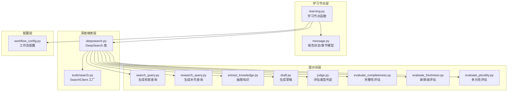
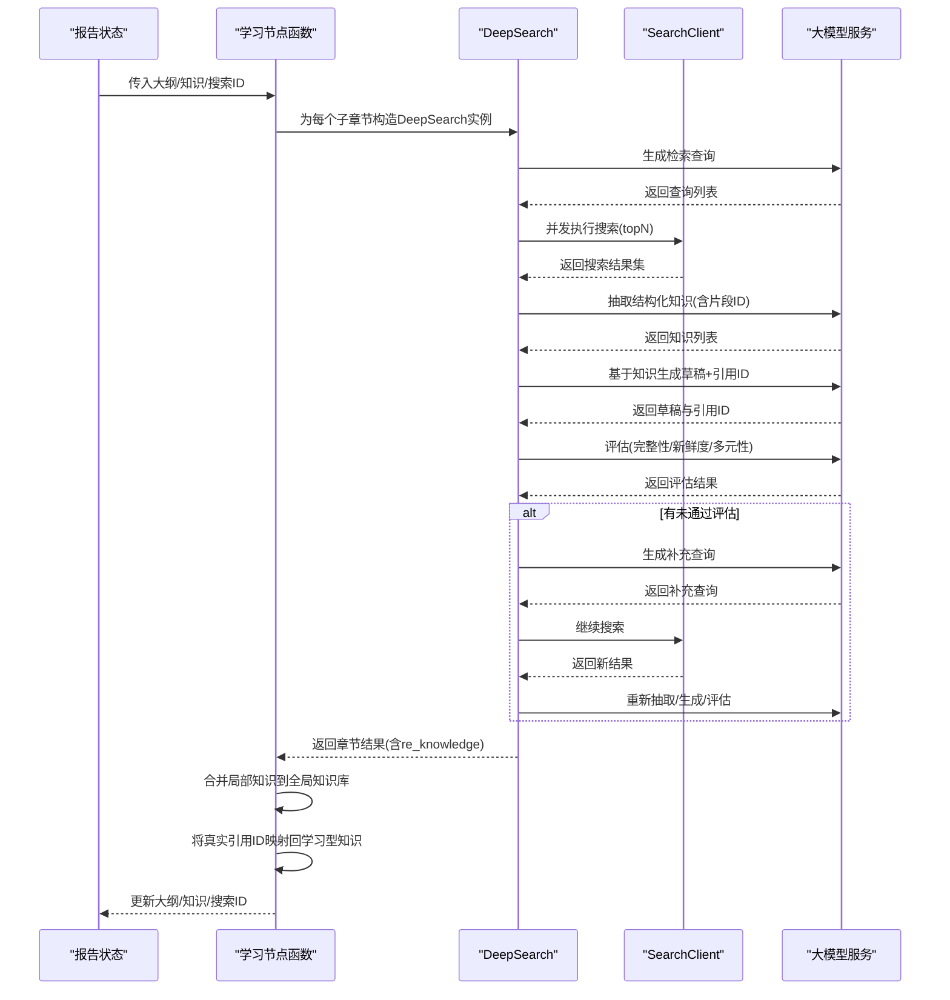
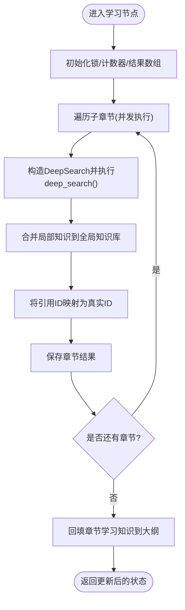
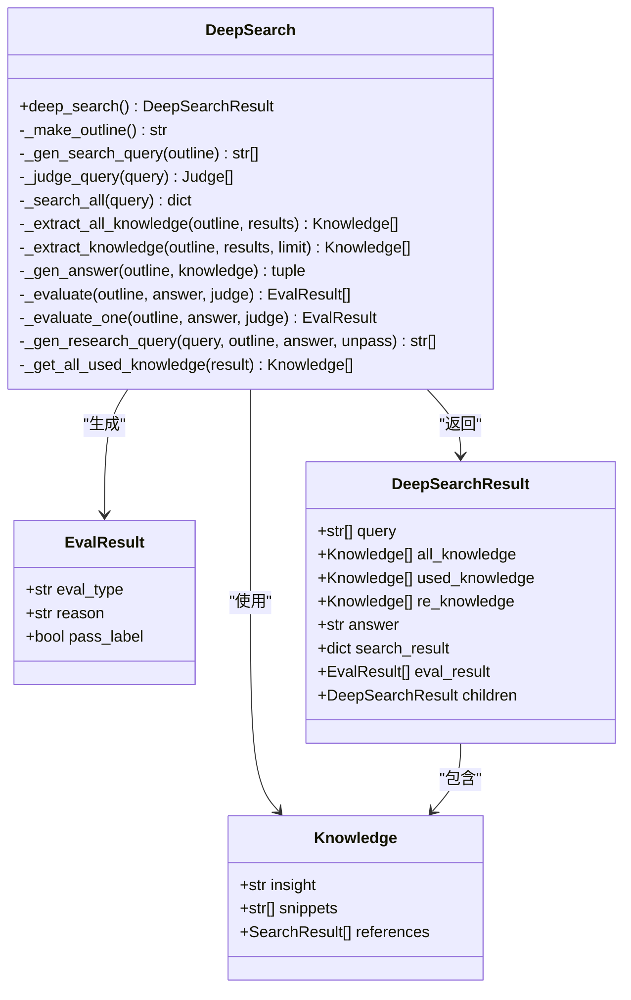
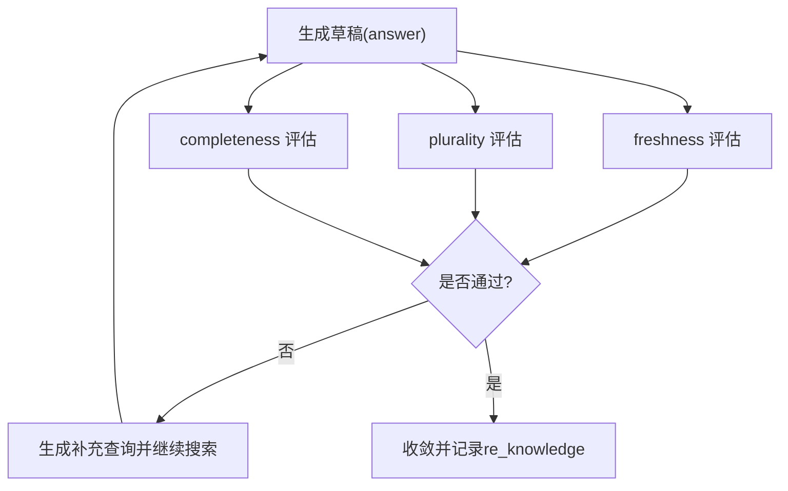
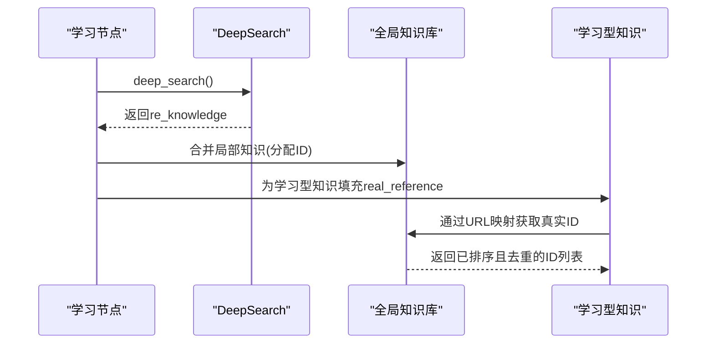
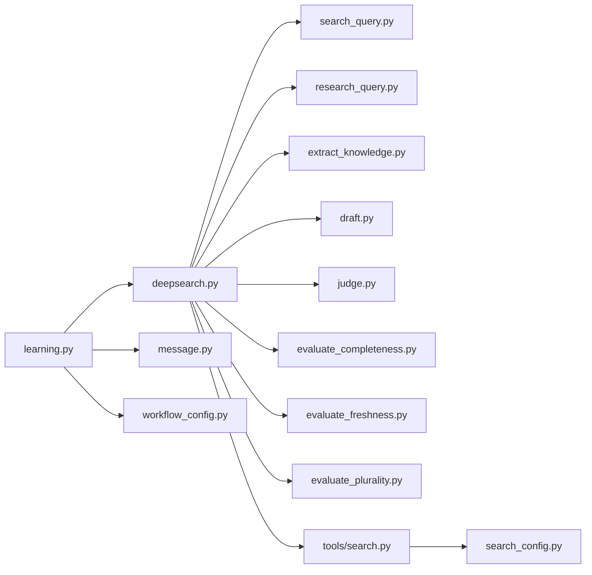

# 学习节点

<cite>
**本文档引用的文件**
- [src/deepresearch/agent/learning.py](file://src/deepresearch/agent/learning.py)
- [src/deepresearch/agent/deepsearch.py](file://src/deepresearch/agent/deepsearch.py)
- [src/deepresearch/agent/message.py](file://src/deepresearch/agent/message.py)
- [src/deepresearch/prompts/learning/extract_knowledge.py](file://src/deepresearch/prompts/learning/extract_knowledge.py)
- [src/deepresearch/prompts/learning/draft.py](file://src/deepresearch/prompts/learning/draft.py)
- [src/deepresearch/prompts/learning/judge.py](file://src/deepresearch/prompts/learning/judge.py)
- [src/deepresearch/prompts/learning/research_query.py](file://src/deepresearch/prompts/learning/research_query.py)
- [src/deepresearch/prompts/learning/search_query.py](file://src/deepresearch/prompts/learning/search_query.py)
- [src/deepresearch/prompts/learning/evaluate_completeness.py](file://src/deepresearch/prompts/learning/evaluate_completeness.py)
- [src/deepresearch/prompts/learning/evaluate_freshness.py](file://src/deepresearch/prompts/learning/evaluate_freshness.py)
- [src/deepresearch/prompts/learning/evaluate_plurality.py](file://src/deepresearch/prompts/learning/evaluate_plurality.py)
- [src/deepresearch/tools/search.py](file://src/deepresearch/tools/search.py)
- [src/deepresearch/config/workflow_config.py](file://src/deepresearch/config/workflow_config.py)
- [src/deepresearch/data/category.py](file://src/deepresearch/data/category.py)
</cite>

## 目录
1. [引言](#引言)
2. [项目结构](#项目结构)
3. [核心组件](#核心组件)
4. [架构总览](#架构总览)
5. [详细组件分析](#详细组件分析)
6. [依赖分析](#依赖分析)
7. [性能考虑](#性能考虑)
8. [故障排查指南](#故障排查指南)
9. [结论](#结论)
10. [附录](#附录)

## 引言
本文件围绕“学习节点”的技术实现进行系统化说明，重点覆盖以下方面：
- 知识提取机制与信息整合流程
- 交叉评估算法（新鲜度、完整性、多元性）的实现原理与评估指标
- 新鲜度评估、完整性检查、多元性分析的具体方法
- 学习过程中的迭代优化策略与收敛判断
- 知识库构建、引用管理与证据链维护的实现细节
- 学习效果评估与质量控制的方法论

## 项目结构
学习节点位于深度研究工作流的“学习”阶段，负责基于章节大纲生成检索查询、执行多轮检索、抽取结构化知识、生成初稿、并进行多维度评估与迭代优化。其核心由“学习节点函数”“深度搜索器”“提示词模板”“消息状态模型”等组成。

图示来源
- [src/deepresearch/agent/learning.py:15-93](file://src/deepresearch/agent/learning.py#L15-L93)
- [src/deepresearch/agent/deepsearch.py:55-489](file://src/deepresearch/agent/deepsearch.py#L55-L489)
- [src/deepresearch/agent/message.py:18-112](file://src/deepresearch/agent/message.py#L18-L112)
- [src/deepresearch/prompts/learning/search_query.py:10-44](file://src/deepresearch/prompts/learning/search_query.py#L10-L44)
- [src/deepresearch/prompts/learning/research_query.py:13-57](file://src/deepresearch/prompts/learning/research_query.py#L13-L57)
- [src/deepresearch/prompts/learning/extract_knowledge.py:10-51](file://src/deepresearch/prompts/learning/extract_knowledge.py#L10-L51)
- [src/deepresearch/prompts/learning/draft.py:10-40](file://src/deepresearch/prompts/learning/draft.py#L10-L40)
- [src/deepresearch/prompts/learning/judge.py:10-65](file://src/deepresearch/prompts/learning/judge.py#L10-L65)
- [src/deepresearch/prompts/learning/evaluate_completeness.py:10-82](file://src/deepresearch/prompts/learning/evaluate_completeness.py#L10-L82)
- [src/deepresearch/prompts/learning/evaluate_freshness.py:11-61](file://src/deepresearch/prompts/learning/evaluate_freshness.py#L11-L61)
- [src/deepresearch/prompts/learning/evaluate_plurality.py:10-55](file://src/deepresearch/prompts/learning/evaluate_plurality.py#L10-L55)
- [src/deepresearch/tools/search.py:12-37](file://src/deepresearch/tools/search.py#L12-L37)
- [src/deepresearch/config/workflow_config.py:7-28](file://src/deepresearch/config/workflow_config.py#L7-L28)

章节来源
- [src/deepresearch/agent/learning.py:15-93](file://src/deepresearch/agent/learning.py#L15-L93)
- [src/deepresearch/agent/deepsearch.py:55-150](file://src/deepresearch/agent/deepsearch.py#L55-L150)
- [src/deepresearch/agent/message.py:18-112](file://src/deepresearch/agent/message.py#L18-L112)
- [src/deepresearch/tools/search.py:12-37](file://src/deepresearch/tools/search.py#L12-L37)
- [src/deepresearch/config/workflow_config.py:7-28](file://src/deepresearch/config/workflow_config.py#L7-L28)

## 核心组件
- 学习节点函数：并发处理各子章节，执行深度搜索、抽取知识、构建局部知识库与学习型知识，并回填引用 ID；汇总全局知识与章节学习结果。
- 深度搜索器：根据章节大纲生成检索查询，执行多轮搜索与知识抽取，生成草稿并进行三类评估（完整性、新鲜度、多元性），必要时生成补充查询以迭代优化。
- 提示词模板：分别覆盖检索查询生成、补充查询生成、知识抽取、草稿生成、评估类型判定以及三大评估维度的评估提示。
- 消息状态模型：承载报告大纲、章节树、学习型知识、引用映射、全局知识库与搜索 ID 计数等状态。
- 搜索客户端：按配置选择搜索引擎（Jina/Tavily），统一对外提供搜索能力。
- 工作流配置：读取工作流配置（如搜索 topN、深度等），为学习节点与深度搜索器提供参数。

章节来源
- [src/deepresearch/agent/learning.py:15-93](file://src/deepresearch/agent/learning.py#L15-L93)
- [src/deepresearch/agent/deepsearch.py:55-489](file://src/deepresearch/agent/deepsearch.py#L55-L489)
- [src/deepresearch/prompts/learning/search_query.py:10-44](file://src/deepresearch/prompts/learning/search_query.py#L10-L44)
- [src/deepresearch/prompts/learning/research_query.py:13-57](file://src/deepresearch/prompts/learning/research_query.py#L13-L57)
- [src/deepresearch/prompts/learning/extract_knowledge.py:10-51](file://src/deepresearch/prompts/learning/extract_knowledge.py#L10-L51)
- [src/deepresearch/prompts/learning/draft.py:10-40](file://src/deepresearch/prompts/learning/draft.py#L10-L40)
- [src/deepresearch/prompts/learning/judge.py:10-65](file://src/deepresearch/prompts/learning/judge.py#L10-L65)
- [src/deepresearch/prompts/learning/evaluate_completeness.py:10-82](file://src/deepresearch/prompts/learning/evaluate_completeness.py#L10-L82)
- [src/deepresearch/prompts/learning/evaluate_freshness.py:11-61](file://src/deepresearch/prompts/learning/evaluate_freshness.py#L11-L61)
- [src/deepresearch/prompts/learning/evaluate_plurality.py:10-55](file://src/deepresearch/prompts/learning/evaluate_plurality.py#L10-L55)
- [src/deepresearch/agent/message.py:18-112](file://src/deepresearch/agent/message.py#L18-L112)
- [src/deepresearch/tools/search.py:12-37](file://src/deepresearch/tools/search.py#L12-L37)
- [src/deepresearch/config/workflow_config.py:7-28](file://src/deepresearch/config/workflow_config.py#L7-L28)

## 架构总览
学习节点在 LangGraph 的状态机中作为节点运行，输入为报告状态（包含大纲、领域、逻辑等），输出更新后的状态（包含更新后的章节学习知识、全局知识库与搜索 ID）。其内部通过深度搜索器完成检索、抽取、评估与迭代优化，最终形成可溯源的学习型知识集合。

图示来源
- [src/deepresearch/agent/learning.py:15-93](file://src/deepresearch/agent/learning.py#L15-L93)
- [src/deepresearch/agent/deepsearch.py:74-149](file://src/deepresearch/agent/deepsearch.py#L74-L149)
- [src/deepresearch/tools/search.py:25-36](file://src/deepresearch/tools/search.py#L25-L36)

## 详细组件分析

### 学习节点函数（并发学习与知识整合）
- 并发策略：按子章节数量限制最大线程数，避免 LLM API 调用过载。
- 深度搜索：为每个子章节构造 DeepSearch 实例，执行检索、抽取、生成草稿与评估。
- 局部知识库：为每个子章节分配连续的搜索 ID，保证全局唯一性。
- 全局知识库：将所有局部知识合并到全局知识库，同时将学习型知识中的引用 ID 映射为真实 ID。
- 结果回填：将每章的 re_knowledge 回填至章节对象，便于后续章节合并与引用管理。

图示来源
- [src/deepresearch/agent/learning.py:15-93](file://src/deepresearch/agent/learning.py#L15-L93)

章节来源
- [src/deepresearch/agent/learning.py:15-93](file://src/deepresearch/agent/learning.py#L15-L93)

### 深度搜索器（检索-抽取-评估-迭代）
- 大纲生成：将主题、章节标题、子章节与用户要求拼装为完整写作大纲。
- 查询生成：调用 LLM 生成检索查询（SQ），支持时间约束与抽象维度覆盖。
- 判定评估类型：根据用户意图判定是否需要新鲜度、多元性或完整性评估。
- 搜索执行：并发执行查询，去重 URL，累积搜索结果。
- 知识抽取：将多条网页内容拼接后送入 LLM，抽取结构化知识（insight/snippets/references）。
- 草稿生成：基于知识生成可溯源的初稿，并标注引用 ID。
- 评估与迭代：对初稿进行三类评估；若存在未通过项，则生成补充查询继续迭代，直至收敛或达到最大深度。
- 证据链收集：将每轮使用的知识累加为 re_knowledge，形成可追溯的证据链。

图示来源
- [src/deepresearch/agent/deepsearch.py:24-53](file://src/deepresearch/agent/deepsearch.py#L24-L53)
- [src/deepresearch/agent/deepsearch.py:55-489](file://src/deepresearch/agent/deepsearch.py#L55-L489)

章节来源
- [src/deepresearch/agent/deepsearch.py:74-149](file://src/deepresearch/agent/deepsearch.py#L74-L149)
- [src/deepresearch/agent/deepsearch.py:241-350](file://src/deepresearch/agent/deepsearch.py#L241-L350)
- [src/deepresearch/agent/deepsearch.py:351-418](file://src/deepresearch/agent/deepsearch.py#L351-L418)

### 知识提取机制与信息整合
- 输入：多条网页内容（带标题、正文、日期）拼接后的文本。
- 规则约束：仅从源材料中抽取事实，不虚构、不外推；强调意图对齐、事实完备、内容有效。
- 输出：结构化知识列表，包含洞察（insight）与片段 ID（snippets），并建立与原始搜索结果的引用关系（references）。
- 整合策略：将来自不同网页的等价/重叠事实进行合并，形成更连贯的知识点；随后用于生成草稿并标注引用 ID。

章节来源
- [src/deepresearch/prompts/learning/extract_knowledge.py:10-51](file://src/deepresearch/prompts/learning/extract_knowledge.py#L10-L51)
- [src/deepresearch/agent/deepsearch.py:241-316](file://src/deepresearch/agent/deepsearch.py#L241-L316)

### 交叉评估算法与评估指标
- 评估类型判定：根据用户意图自动判定是否需要新鲜度、多元性或完整性评估。
- 完整性评估：关注内容覆盖面、证据充分性、信息准确性、逻辑一致性与时间相关性。
- 新鲜度评估：依据内容类型设定典型更新周期，结合用户意图与当前时间判断时效性。
- 多元性评估：依据章节意图类型匹配多样性要求（数量、视角、维度），确保覆盖不同类别与层次。
- 评估流程：先生成草稿，再对草稿进行三项评估；若任一未通过，生成补充查询继续迭代，直至全部通过或达到最大深度。

图示来源
- [src/deepresearch/agent/deepsearch.py:351-418](file://src/deepresearch/agent/deepsearch.py#L351-L418)
- [src/deepresearch/prompts/learning/judge.py:10-65](file://src/deepresearch/prompts/learning/judge.py#L10-L65)
- [src/deepresearch/prompts/learning/evaluate_freshness.py:11-61](file://src/deepresearch/prompts/learning/evaluate_freshness.py#L11-L61)
- [src/deepresearch/prompts/learning/evaluate_plurality.py:10-55](file://src/deepresearch/prompts/learning/evaluate_plurality.py#L10-L55)
- [src/deepresearch/prompts/learning/evaluate_completeness.py:10-82](file://src/deepresearch/prompts/learning/evaluate_completeness.py#L10-L82)

章节来源
- [src/deepresearch/agent/deepsearch.py:351-390](file://src/deepresearch/agent/deepsearch.py#L351-L390)
- [src/deepresearch/prompts/learning/judge.py:10-65](file://src/deepresearch/prompts/learning/judge.py#L10-L65)
- [src/deepresearch/prompts/learning/evaluate_freshness.py:11-61](file://src/deepresearch/prompts/learning/evaluate_freshness.py#L11-L61)
- [src/deepresearch/prompts/learning/evaluate_plurality.py:10-55](file://src/deepresearch/prompts/learning/evaluate_plurality.py#L10-L55)
- [src/deepresearch/prompts/learning/evaluate_completeness.py:10-82](file://src/deepresearch/prompts/learning/evaluate_completeness.py#L10-L82)

### 新鲜度评估、完整性检查与多元性分析
- 新鲜度评估：依据内容类型设定典型更新周期，结合用户明确的时间要求与当前时间进行判断，优先关注影响结论的关键事实。
- 完整性检查：从覆盖面、证据充分性、准确性、逻辑一致性与时间相关性五个维度综合判断，允许部分背景信息保留但需清晰标注时间语境。
- 多元性分析：依据章节意图类型匹配多样性标准，确保覆盖数量、视角与维度，避免单一来源或单一角度。

章节来源
- [src/deepresearch/prompts/learning/evaluate_freshness.py:11-61](file://src/deepresearch/prompts/learning/evaluate_freshness.py#L11-L61)
- [src/deepresearch/prompts/learning/evaluate_completeness.py:10-82](file://src/deepresearch/prompts/learning/evaluate_completeness.py#L10-L82)
- [src/deepresearch/prompts/learning/evaluate_plurality.py:10-55](file://src/deepresearch/prompts/learning/evaluate_plurality.py#L10-L55)

### 迭代优化策略与收敛判断
- 迭代触发：当任一评估未通过时，生成补充查询继续搜索。
- 查询生成：基于当前回答与评估反馈，聚焦缺失维度生成简洁独立的补充查询。
- 收敛条件：当所有评估均通过或达到最大深度时停止迭代。
- 证据链维护：将每轮使用的知识累加为 re_knowledge，形成可追溯的证据链。

章节来源
- [src/deepresearch/agent/deepsearch.py:132-149](file://src/deepresearch/agent/deepsearch.py#L132-L149)
- [src/deepresearch/agent/deepsearch.py:392-418](file://src/deepresearch/agent/deepsearch.py#L392-L418)

### 知识库构建、引用管理与证据链维护
- 知识库构建：学习节点将各子章节的局部知识合并为全局知识库，同时为每条知识分配唯一的搜索 ID。
- 引用管理：学习型知识中的 references 与全局知识库中的 url 建立映射，生成 real_reference（真实引用 ID）列表，确保可溯源。
- 证据链维护：DeepSearchResult 中的 re_knowledge 累积每轮使用的知识，形成完整的证据链。

图示来源
- [src/deepresearch/agent/learning.py:73-87](file://src/deepresearch/agent/learning.py#L73-L87)
- [src/deepresearch/agent/learning.py:104-128](file://src/deepresearch/agent/learning.py#L104-L128)
- [src/deepresearch/agent/deepsearch.py:420-435](file://src/deepresearch/agent/deepsearch.py#L420-L435)

章节来源
- [src/deepresearch/agent/learning.py:73-87](file://src/deepresearch/agent/learning.py#L73-L87)
- [src/deepresearch/agent/learning.py:104-128](file://src/deepresearch/agent/learning.py#L104-L128)
- [src/deepresearch/agent/deepsearch.py:420-435](file://src/deepresearch/agent/deepsearch.py#L420-L435)

### 学习效果评估与质量控制
- 评估维度：完整性、新鲜度、多元性三者共同决定草稿质量。
- 质量控制：通过自动化的评估与补充查询迭代，减少人工干预；同时通过证据链与引用 ID 提升可追溯性与可信度。
- 方法论建议：在实际应用中，可结合业务场景调整评估阈值与迭代深度，确保在时效性与成本之间取得平衡。

章节来源
- [src/deepresearch/agent/deepsearch.py:351-390](file://src/deepresearch/agent/deepsearch.py#L351-L390)
- [src/deepresearch/prompts/learning/evaluate_completeness.py:10-82](file://src/deepresearch/prompts/learning/evaluate_completeness.py#L10-L82)
- [src/deepresearch/prompts/learning/evaluate_freshness.py:11-61](file://src/deepresearch/prompts/learning/evaluate_freshness.py#L11-L61)
- [src/deepresearch/prompts/learning/evaluate_plurality.py:10-55](file://src/deepresearch/prompts/learning/evaluate_plurality.py#L10-L55)

## 依赖分析
- 学习节点依赖：工作流配置（深度、topN）、章节模型（大纲、学习型知识）、深度搜索器（检索、抽取、评估、迭代）。
- 深度搜索器依赖：提示词模板（查询生成、知识抽取、草稿生成、评估）、搜索客户端（Jina/Tavily）、LLM 接口。
- 搜索客户端依赖：配置模块（引擎类型、超时等）。

图示来源
- [src/deepresearch/agent/learning.py:15-93](file://src/deepresearch/agent/learning.py#L15-L93)
- [src/deepresearch/agent/deepsearch.py:55-489](file://src/deepresearch/agent/deepsearch.py#L55-L489)
- [src/deepresearch/agent/message.py:18-112](file://src/deepresearch/agent/message.py#L18-L112)
- [src/deepresearch/config/workflow_config.py:7-28](file://src/deepresearch/config/workflow_config.py#L7-L28)
- [src/deepresearch/tools/search.py:12-37](file://src/deepresearch/tools/search.py#L12-L37)

章节来源
- [src/deepresearch/agent/learning.py:15-93](file://src/deepresearch/agent/learning.py#L15-L93)
- [src/deepresearch/agent/deepsearch.py:55-489](file://src/deepresearch/agent/deepsearch.py#L55-L489)
- [src/deepresearch/tools/search.py:12-37](file://src/deepresearch/tools/search.py#L12-L37)
- [src/deepresearch/config/workflow_config.py:7-28](file://src/deepresearch/config/workflow_config.py#L7-L28)

## 性能考虑
- 并发控制：学习节点与深度搜索器均采用线程池限制并发度，避免 LLM API 与搜索引擎压力过大。
- 内容分片：知识抽取前对输入内容进行分片，避免超过 LLM 上下文限制。
- URL 去重：在搜索阶段对重复 URL 进行去重，减少无效请求与重复处理。
- 配置化参数：通过工作流配置控制搜索深度与 topN，平衡质量与成本。

章节来源
- [src/deepresearch/agent/learning.py:62-67](file://src/deepresearch/agent/learning.py#L62-L67)
- [src/deepresearch/agent/deepsearch.py:214-239](file://src/deepresearch/agent/deepsearch.py#L214-L239)
- [src/deepresearch/agent/deepsearch.py:244-267](file://src/deepresearch/agent/deepsearch.py#L244-L267)
- [src/deepresearch/config/workflow_config.py:7-28](file://src/deepresearch/config/workflow_config.py#L7-L28)

## 故障排查指南
- 检索查询为空：检查查询生成提示词与 LLM 返回格式，确认正则提取是否正确。
- 知识抽取失败：检查输入内容长度与格式，确认 JSON 修复与解析逻辑。
- 评估未通过：查看评估原因字段，针对性生成补充查询；必要时放宽阈值或增加深度。
- 引用映射异常：核对 URL 到 ID 的映射表，确保 URL 唯一且非空。
- 搜索引擎异常：检查搜索客户端配置与 API 密钥，确认超时设置合理。

章节来源
- [src/deepresearch/agent/deepsearch.py:162-181](file://src/deepresearch/agent/deepsearch.py#L162-L181)
- [src/deepresearch/agent/deepsearch.py:279-316](file://src/deepresearch/agent/deepsearch.py#L279-L316)
- [src/deepresearch/agent/deepsearch.py:359-390](file://src/deepresearch/agent/deepsearch.py#L359-L390)
- [src/deepresearch/agent/learning.py:104-128](file://src/deepresearch/agent/learning.py#L104-L128)
- [src/deepresearch/tools/search.py:12-37](file://src/deepresearch/tools/search.py#L12-L37)

## 结论
学习节点通过“检索-抽取-评估-迭代”的闭环机制，实现了高质量、可溯源的知识学习与整合。其并发设计与配置化参数提升了稳定性与可扩展性；交叉评估与证据链维护保障了学习质量与可信度。结合引用管理与章节合并策略，最终形成结构化、可追溯、可复用的学习型知识体系。

## 附录
- 分析类型与逻辑步骤：提供行业研究、公司研究、综合分析等类型的分析步骤与内容模板，辅助学习节点在不同场景下的任务分解与知识组织。

章节来源
- [src/deepresearch/data/category.py:31-103](file://src/deepresearch/data/category.py#L31-L103)