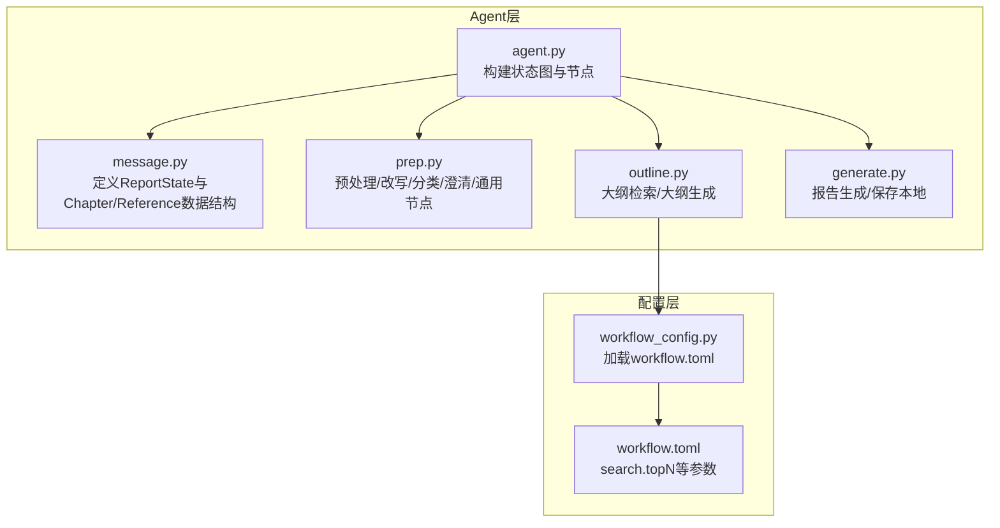
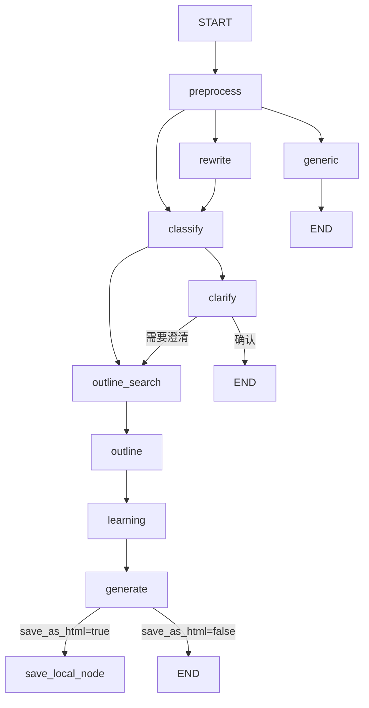
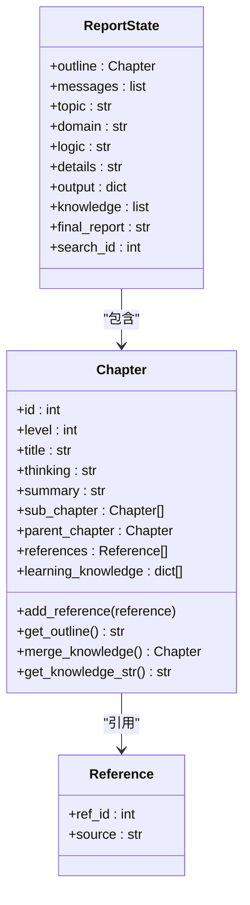
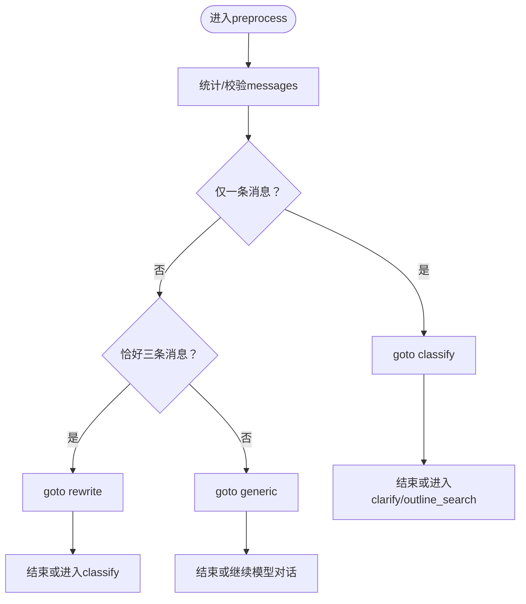
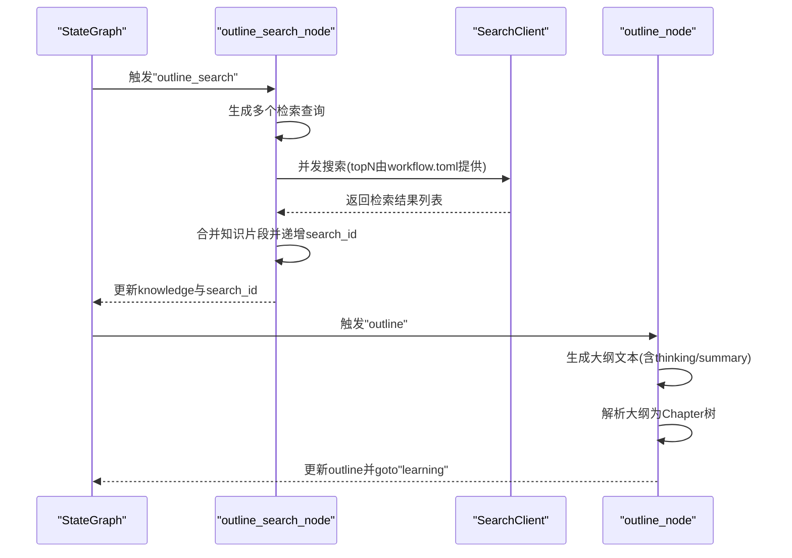
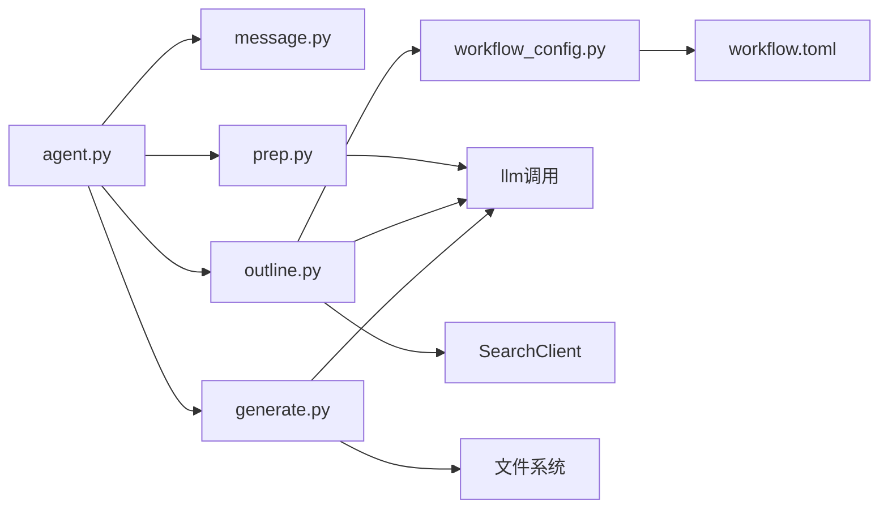

# 工作流概览

<cite>
**本文档引用的文件**
- [agent.py](file://src/deepresearch/agent/agent.py)
- [message.py](file://src/deepresearch/agent/message.py)
- [prep.py](file://src/deepresearch/agent/prep.py)
- [outline.py](file://src/deepresearch/agent/outline.py)
- [generate.py](file://src/deepresearch/agent/generate.py)
- [workflow_config.py](file://src/deepresearch/config/workflow_config.py)
- [workflow.toml](file://config/workflow.toml)
</cite>

## 目录
1. [简介](#简介)
2. [项目结构](#项目结构)
3. [核心组件](#核心组件)
4. [架构总览](#架构总览)
5. [详细组件分析](#详细组件分析)
6. [依赖关系分析](#依赖关系分析)
7. [性能考量](#性能考量)
8. [故障排查指南](#故障排查指南)
9. [结论](#结论)
10. [附录](#附录)

## 简介
本文件面向DeepResearch工作流的“状态图工作流”进行系统化概览与深入解析。重点涵盖：
- 整体架构设计：以状态图为核心，明确START与END节点的作用与职责边界
- 工作节点间的连接关系与执行顺序
- 条件边（conditional_edges）的判断逻辑与分支选择机制
- ReportState状态模型的设计理念与字段含义
- 生命周期管理、状态转换规则与错误处理策略
- 可视化的执行流程图与序列图，帮助读者快速理解端到端流程

## 项目结构
本工作流位于src/deepresearch/agent目录下，围绕状态图（StateGraph）组织节点与边，配合配置模块与提示词模板完成端到端的研究报告生成。



**图表来源**
- [agent.py:19-44](file://src/deepresearch/agent/agent.py#L19-L44)
- [message.py:101-112](file://src/deepresearch/agent/message.py#L101-L112)
- [prep.py:21-80](file://src/deepresearch/agent/prep.py#L21-L80)
- [outline.py:22-86](file://src/deepresearch/agent/outline.py#L22-L86)
- [generate.py:26-123](file://src/deepresearch/agent/generate.py#L26-L123)
- [workflow_config.py:7-28](file://src/deepresearch/config/workflow_config.py#L7-L28)
- [workflow.toml:1-3](file://config/workflow.toml#L1-L3)

**章节来源**
- [agent.py:19-44](file://src/deepresearch/agent/agent.py#L19-L44)
- [workflow_config.py:7-28](file://src/deepresearch/config/workflow_config.py#L7-L28)
- [workflow.toml:1-3](file://config/workflow.toml#L1-L3)

## 核心组件
- 状态图构建器：在agent.py中通过StateGraph(ReportState)定义状态图，并注册所有节点与边
- 状态模型：ReportState继承自MessagesState，承载主题、领域、逻辑、细节、大纲、知识、输出、最终报告等关键字段
- 预处理与交互节点：负责消息预处理、改写、分类、澄清与通用回复
- 大纲阶段：基于检索与规划生成可解析的大纲结构
- 报告生成与保存：按章节生成报告内容，支持本地保存与HTML导出
- 配置加载：从workflow.toml读取search.topN等参数，供大纲检索使用

**章节来源**
- [agent.py:19-44](file://src/deepresearch/agent/agent.py#L19-L44)
- [message.py:101-112](file://src/deepresearch/agent/message.py#L101-L112)
- [prep.py:21-80](file://src/deepresearch/agent/prep.py#L21-L80)
- [outline.py:22-86](file://src/deepresearch/agent/outline.py#L22-L86)
- [generate.py:26-123](file://src/deepresearch/agent/generate.py#L26-L123)
- [workflow_config.py:7-28](file://src/deepresearch/config/workflow_config.py#L7-L28)
- [workflow.toml:1-3](file://config/workflow.toml#L1-L3)

## 架构总览
本工作流采用LangGraph的状态图范式，以START为入口，END为出口，中间节点按业务阶段串联与分叉。条件边在“generate”节点处根据配置决定是否保存本地或直接结束。



**图表来源**
- [agent.py:21-44](file://src/deepresearch/agent/agent.py#L21-L44)
- [prep.py:75-79](file://src/deepresearch/agent/prep.py#L75-L79)
- [prep.py:133-150](file://src/deepresearch/agent/prep.py#L133-L150)
- [prep.py:166-181](file://src/deepresearch/agent/prep.py#L166-L181)
- [outline.py:82-85](file://src/deepresearch/agent/outline.py#L82-L85)
- [generate.py:114-123](file://src/deepresearch/agent/generate.py#L114-L123)

## 详细组件分析

### ReportState状态模型
- 设计理念
  - 继承MessagesState，复用消息历史能力，便于多轮对话与上下文传递
  - 将研究任务的关键要素（主题、领域、逻辑、细节、大纲、知识、最终报告、输出）集中于单一状态对象，便于跨节点共享与持久化
  - 通过Chapter/Reference数据结构表达层级化的大纲与引用，支撑生成阶段的结构化输出
- 字段含义
  - outline：章节树根节点，承载标题、层级、思考、摘要、子章节、引用与学习知识
  - messages：用户与助手的历史消息列表
  - topic：当前研究主题
  - domain：所属领域
  - logic/details：领域逻辑与细节，用于指导大纲生成
  - output：中间输出（如确认信息）
  - knowledge：检索到的知识片段集合
  - final_report：最终报告文本
  - search_id：检索结果的全局ID游标，保证引用编号连续性



**图表来源**
- [message.py:101-112](file://src/deepresearch/agent/message.py#L101-L112)
- [message.py:12-29](file://src/deepresearch/agent/message.py#L12-L29)

**章节来源**
- [message.py:101-112](file://src/deepresearch/agent/message.py#L101-L112)
- [message.py:12-29](file://src/deepresearch/agent/message.py#L12-L29)

### 预处理与交互节点（preprocess/rewrite/classify/clarify/generic）
- preprocess
  - 输入：messages（多种类型兼容）
  - 行为：根据消息数量与类型决定后续路径
    - 仅一条消息：直接进入classify
    - 三条消息：进入rewrite
    - 其他轮次：仅调用模型回复，进入generic
  - 异常：若无法转换任何有效消息，返回“结束”
- rewrite
  - 基于历史消息重写主题，提取XML标签中的主题字符串
- classify
  - 对主题进行领域分类，读取领域逻辑与细节
  - 若不支持该领域或解析失败，回退至generic
  - 首轮分类后进入clarify；否则直接进入outline_search
- clarify
  - 一次澄清，支持确认结束或继续生成
- generic
  - 通用回复节点，对任意非研究类对话进行流畅回复



**图表来源**
- [prep.py:21-80](file://src/deepresearch/agent/prep.py#L21-L80)
- [prep.py:82-103](file://src/deepresearch/agent/prep.py#L82-L103)
- [prep.py:105-151](file://src/deepresearch/agent/prep.py#L105-L151)
- [prep.py:153-182](file://src/deepresearch/agent/prep.py#L153-L182)
- [prep.py:184-202](file://src/deepresearch/agent/prep.py#L184-L202)

**章节来源**
- [prep.py:21-80](file://src/deepresearch/agent/prep.py#L21-L80)
- [prep.py:82-103](file://src/deepresearch/agent/prep.py#L82-L103)
- [prep.py:105-151](file://src/deepresearch/agent/prep.py#L105-L151)
- [prep.py:153-182](file://src/deepresearch/agent/prep.py#L153-L182)
- [prep.py:184-202](file://src/deepresearch/agent/prep.py#L184-L202)

### 大纲检索与生成（outline_search/outline）
- outline_search
  - 基于主题与逻辑生成多个检索查询
  - 并发执行搜索（最大并发不超过5），保持原始顺序以确保search_id连续
  - 汇总检索结果为知识片段，更新search_id与knowledge
- outline
  - 使用领域、主题、逻辑、细节与检索知识生成大纲
  - 解析Markdown代码块与XML标签，构建Chapter树
  - 若解析失败，直接结束并输出当前outline作为兜底



**图表来源**
- [outline.py:22-86](file://src/deepresearch/agent/outline.py#L22-L86)
- [outline.py:88-119](file://src/deepresearch/agent/outline.py#L88-L119)
- [workflow_config.py:7-28](file://src/deepresearch/config/workflow_config.py#L7-L28)
- [workflow.toml:1-3](file://config/workflow.toml#L1-L3)

**章节来源**
- [outline.py:22-86](file://src/deepresearch/agent/outline.py#L22-L86)
- [outline.py:88-119](file://src/deepresearch/agent/outline.py#L88-L119)
- [workflow_config.py:7-28](file://src/deepresearch/config/workflow_config.py#L7-L28)
- [workflow.toml:1-3](file://config/workflow.toml#L1-L3)

### 报告生成与保存（generate/save_local）
- generate
  - 逐级遍历大纲章节，结合领域、主题、大纲与知识生成报告
  - 流式输出时进行工具渲染（表格/图表）与引用替换
  - 最终汇总为final_report并输出
- save_report_local（条件边）
  - 判断RunnableConfig中的save_as_html标志
  - true：进入save_local_node保存为MD与HTML
  - false：直接结束
- save_local_node
  - 保存MD文件，追加参考文献列表
  - 若需要HTML，调用markdown2html生成并保存

```mermaid
sequenceDiagram
participant G as "StateGraph"
participant GN as "generate_node"
participant CFG as "RunnableConfig"
participant SL as "save_local_node"
G->>GN : 触发"generate"
GN->>GN : 流式生成报告(含工具渲染/引用替换)
GN-->>G : 返回final_report与output
G->>CFG : 读取save_as_html
alt save_as_html=true
G->>SL : 进入"save_local_node"
SL->>SL : 保存MD与HTML
SL-->>G : 完成
G-->>END["END"]
else save_as_html=false
G-->>END["END"]
end
```

**图表来源**
- [generate.py:26-123](file://src/deepresearch/agent/generate.py#L26-L123)
- [generate.py:125-160](file://src/deepresearch/agent/generate.py#L125-L160)

**章节来源**
- [generate.py:26-123](file://src/deepresearch/agent/generate.py#L26-L123)
- [generate.py:125-160](file://src/deepresearch/agent/generate.py#L125-L160)

### 条件边与分支选择机制
- 条件边定义位置：在generate节点之后，使用save_report_local作为条件判定函数
- 分支逻辑：
  - 当save_as_html为true时，进入save_local_node，随后结束
  - 当save_as_html为false时，直接结束
- 配置来源：通过RunnableConfig的configurable键传入，可在运行期动态控制

**章节来源**
- [agent.py:37-41](file://src/deepresearch/agent/agent.py#L37-L41)
- [generate.py:114-123](file://src/deepresearch/agent/generate.py#L114-L123)

### 生命周期管理与状态转换规则
- 生命周期阶段
  - 初始化：START进入preprocess
  - 预处理：根据消息形态分流至rewrite/classify/generic
  - 规划：classify后可能clarify确认或直接outline_search
  - 检索与生成：outline_search聚合知识，outline生成大纲，learning准备学习知识，generate生成报告
  - 结束：根据save_as_html决定是否保存后结束
- 转换规则
  - 明确边：START→preprocess；preprocess→rewrite/classify/generic；outline_search→outline；learning→generate；generate→save_local_node/END
  - 条件边：generate→save_local_node或END
  - 异常回退：classify失败→generic；outline解析失败→END；preprocess无有效消息→END
- 错误处理策略
  - classify解析失败或领域不支持：回退generic
  - outline解析异常：记录日志并结束
  - LLM调用异常：generic节点捕获并返回错误信息
  - 保存失败：记录日志并继续流程

**章节来源**
- [agent.py:21-44](file://src/deepresearch/agent/agent.py#L21-L44)
- [prep.py:118-132](file://src/deepresearch/agent/prep.py#L118-L132)
- [outline.py:114-118](file://src/deepresearch/agent/outline.py#L114-L118)
- [prep.py:199-201](file://src/deepresearch/agent/prep.py#L199-L201)

## 依赖关系分析
- 组件耦合
  - agent.py集中定义节点与边，耦合度低，便于扩展
  - prep/outline/generate各自职责清晰，通过ReportState共享数据
  - workflow_config与workflow.toml提供外部配置注入，降低硬编码
- 外部依赖
  - LangGraph：状态图与命令式控制（Command）
  - LangChain：消息类型与提示词模板应用
  - 并发：ThreadPoolExecutor用于大纲检索的并发控制
  - I/O：文件系统用于报告保存



**图表来源**
- [agent.py:19-44](file://src/deepresearch/agent/agent.py#L19-L44)
- [outline.py:37-54](file://src/deepresearch/agent/outline.py#L37-L54)
- [generate.py:129-160](file://src/deepresearch/agent/generate.py#L129-L160)
- [workflow_config.py:7-28](file://src/deepresearch/config/workflow_config.py#L7-L28)
- [workflow.toml:1-3](file://config/workflow.toml#L1-L3)

**章节来源**
- [agent.py:19-44](file://src/deepresearch/agent/agent.py#L19-L44)
- [outline.py:37-54](file://src/deepresearch/agent/outline.py#L37-L54)
- [generate.py:129-160](file://src/deepresearch/agent/generate.py#L129-L160)
- [workflow_config.py:7-28](file://src/deepresearch/config/workflow_config.py#L7-L28)
- [workflow.toml:1-3](file://config/workflow.toml#L1-L3)

## 性能考量
- 并发检索：大纲检索使用线程池并发，最大并发数限制为5，兼顾吞吐与资源占用
- 流式生成：报告生成采用流式输出，边生成边渲染工具与引用，降低延迟
- 内容缓冲与状态机：ContentProcessor通过状态机识别工具标签，避免重复编译正则，提升处理效率
- 配置化参数：search.topN通过配置文件控制，便于在不同场景下调整召回规模

**章节来源**
- [outline.py:42-80](file://src/deepresearch/agent/outline.py#L42-L80)
- [generate.py:169-295](file://src/deepresearch/agent/generate.py#L169-L295)
- [workflow_config.py:7-28](file://src/deepresearch/config/workflow_config.py#L7-L28)
- [workflow.toml:1-3](file://config/workflow.toml#L1-L3)

## 故障排查指南
- classify失败
  - 现象：解析不到领域或抛出异常
  - 处理：自动回退至generic；检查提示词模板与解析逻辑
- outline解析失败
  - 现象：解析章节树为空
  - 处理：记录错误并结束；检查生成的大纲文本格式
- LLM调用异常
  - 现象：generic节点捕获异常并返回错误信息
  - 处理：检查模型服务可用性与提示词模板
- 保存失败
  - 现象：创建目录或写文件失败
  - 处理：检查权限与路径；查看日志输出

**章节来源**
- [prep.py:118-132](file://src/deepresearch/agent/prep.py#L118-L132)
- [outline.py:114-118](file://src/deepresearch/agent/outline.py#L114-L118)
- [prep.py:199-201](file://src/deepresearch/agent/prep.py#L199-L201)
- [generate.py:133-135](file://src/deepresearch/agent/generate.py#L133-L135)
- [generate.py:157-158](file://src/deepresearch/agent/generate.py#L157-L158)

## 结论
本工作流以状态图为骨架，将预处理、规划、检索、学习与生成等阶段有机串联，并通过条件边实现灵活的输出策略。ReportState统一承载任务上下文，使各节点职责清晰、耦合可控。通过并发检索与流式生成优化性能，同时提供完善的错误处理与配置化参数，满足多样化应用场景。

## 附录
- 关键流程回顾
  - START → preprocess → classify/rewrite/generic → outline_search → outline → learning → generate → save_local_node/END
- 配置要点
  - workflow.toml中的search.topN影响大纲检索召回数量
  - RunnableConfig的save_as_html控制是否保存本地