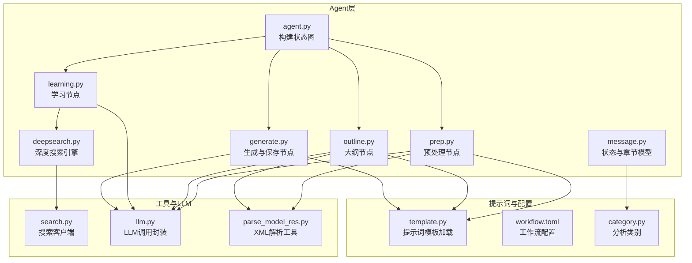
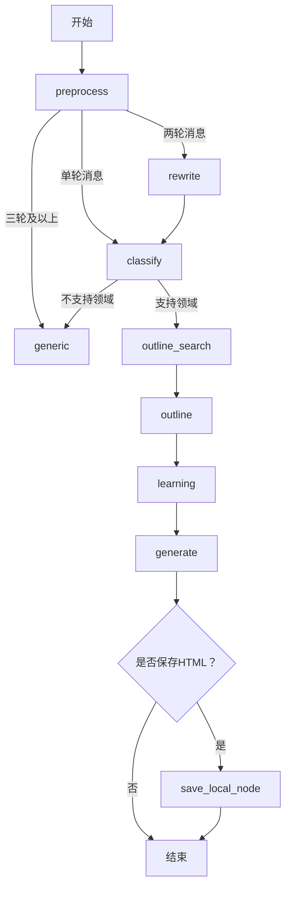
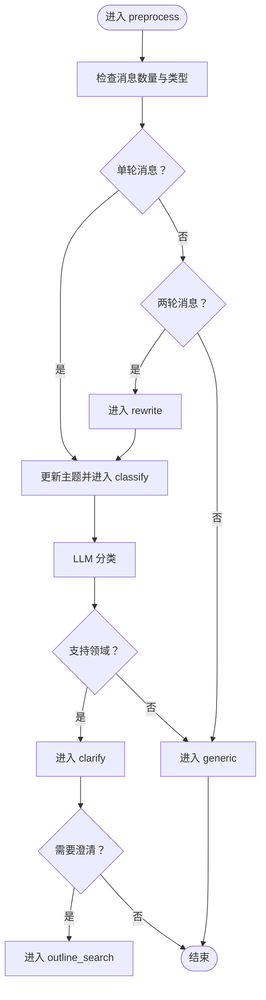
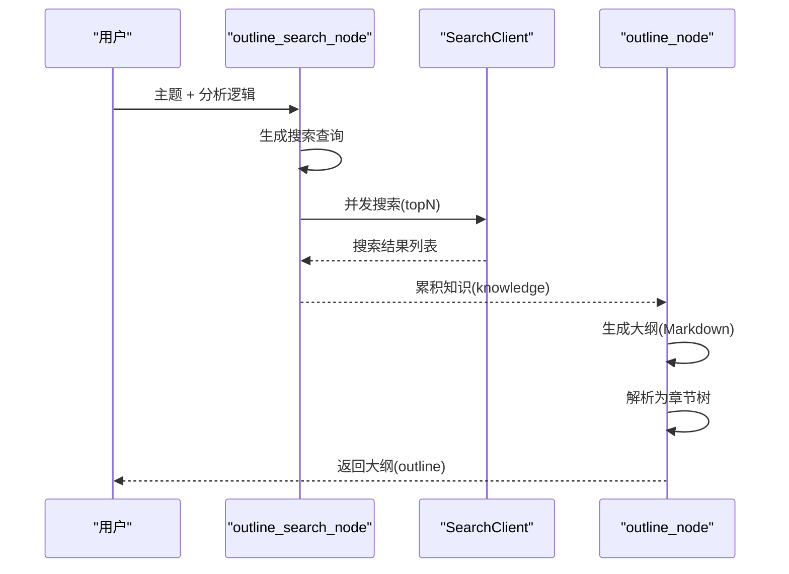
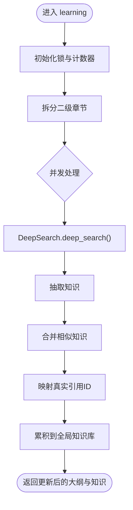
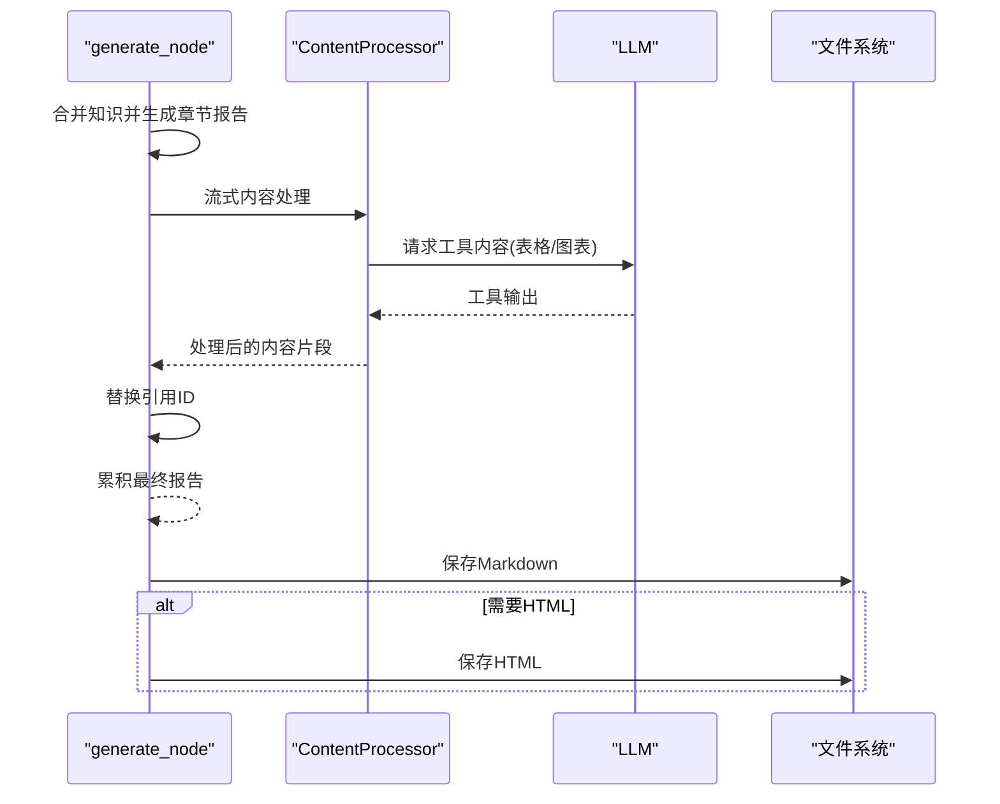
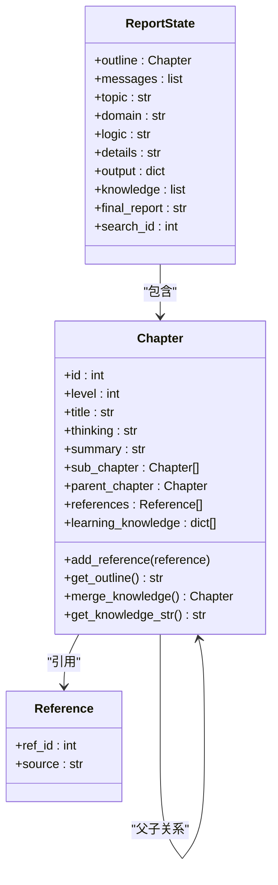
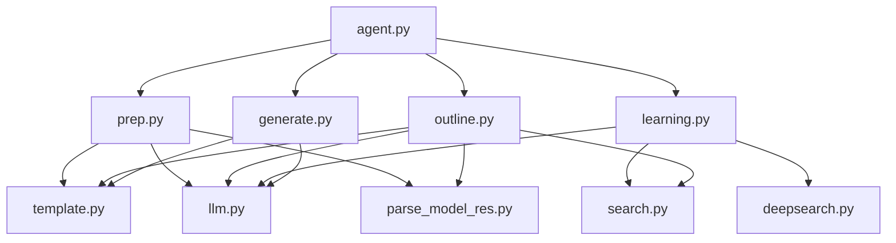

# 核心Agent工作流

<cite>
**本文档引用的文件**
- [agent.py](file://src/deepresearch/agent/agent.py)
- [prep.py](file://src/deepresearch/agent/prep.py)
- [outline.py](file://src/deepresearch/agent/outline.py)
- [learning.py](file://src/deepresearch/agent/learning.py)
- [generate.py](file://src/deepresearch/agent/generate.py)
- [deepsearch.py](file://src/deepresearch/agent/deepsearch.py)
- [message.py](file://src/deepresearch/agent/message.py)
- [category.py](file://src/deepresearch/data/category.py)
- [template.py](file://src/deepresearch/prompts/template.py)
- [rewrite.py](file://src/deepresearch/prompts/prep/rewrite.py)
- [classify.py](file://src/deepresearch/prompts/prep/classify.py)
- [outline_prompt.py](file://src/deepresearch/prompts/outline/outline.py)
- [extract_knowledge.py](file://src/deepresearch/prompts/learning/extract_knowledge.py)
- [parse_model_res.py](file://src/deepresearch/utils/parse_model_res.py)
- [search.py](file://src/deepresearch/tools/search.py)
- [llm.py](file://src/deepresearch/llms/llm.py)
- [workflow.toml](file://config/workflow.toml)
</cite>

## 目录
1. [简介](#简介)
2. [项目结构](#项目结构)
3. [核心组件](#核心组件)
4. [架构总览](#架构总览)
5. [详细组件分析](#详细组件分析)
6. [依赖关系分析](#依赖关系分析)
7. [性能考虑](#性能考虑)
8. [故障排除指南](#故障排除指南)
9. [结论](#结论)

## 简介
本文件系统性解析DeepResearch核心Agent工作流，围绕智能工作流编排展开，重点覆盖以下节点与流程：
- 预处理节点：preprocess、rewrite、classify、clarify、generic 的功能与处理逻辑
- 大纲生成节点：outline_search、outline 的工作机制与算法实现
- 学习节点：learning 的知识提取与交叉评估过程
- 生成节点：generate、save_local 的报告生成与保存流程
- 状态转换规则、消息传递机制与错误处理策略

该工作流基于LangGraph的状态图模型，通过明确的节点与条件边实现端到端的研究报告生成。

## 项目结构
核心Agent工作流位于src/deepresearch/agent目录，配合提示词模板、数据分类、工具与LLM接口等模块协同完成任务。

**图表来源**
- [agent.py:19-44](file://src/deepresearch/agent/agent.py#L19-L44)
- [prep.py:21-202](file://src/deepresearch/agent/prep.py#L21-L202)
- [outline.py:22-227](file://src/deepresearch/agent/outline.py#L22-L227)
- [learning.py:15-129](file://src/deepresearch/agent/learning.py#L15-L129)
- [generate.py:26-343](file://src/deepresearch/agent/generate.py#L26-L343)
- [deepsearch.py:55-489](file://src/deepresearch/agent/deepsearch.py#L55-L489)
- [message.py:12-112](file://src/deepresearch/agent/message.py#L12-L112)
- [template.py:25-166](file://src/deepresearch/prompts/template.py#L25-L166)
- [workflow.toml:1-3](file://config/workflow.toml#L1-L3)
- [category.py:31-123](file://src/deepresearch/data/category.py#L31-L123)
- [search.py:12-46](file://src/deepresearch/tools/search.py#L12-L46)
- [llm.py:146-200](file://src/deepresearch/llms/llm.py#L146-L200)
- [parse_model_res.py:13-32](file://src/deepresearch/utils/parse_model_res.py#L13-L32)

**章节来源**
- [agent.py:19-44](file://src/deepresearch/agent/agent.py#L19-L44)
- [template.py:25-166](file://src/deepresearch/prompts/template.py#L25-L166)
- [workflow.toml:1-3](file://config/workflow.toml#L1-L3)

## 核心组件
- 状态图构建器：在agent.py中定义节点、边与条件边，形成从预处理到生成再到保存的完整工作流。
- 预处理子图：负责消息类型转换、主题抽取、领域分类、澄清与通用回复。
- 大纲生成子图：基于用户意图与分析逻辑生成可执行的大纲，并检索参考知识。
- 学习子图：对每个章节进行深度搜索、知识抽取、交叉评估与答案生成。
- 报告生成与保存：按章节顺序生成报告，替换引用，支持本地保存与HTML导出。

**章节来源**
- [agent.py:19-44](file://src/deepresearch/agent/agent.py#L19-L44)
- [message.py:101-112](file://src/deepresearch/agent/message.py#L101-L112)

## 架构总览
下图展示核心Agent工作流的节点交互与控制流：

**图表来源**
- [agent.py:21-44](file://src/deepresearch/agent/agent.py#L21-L44)
- [prep.py:21-80](file://src/deepresearch/agent/prep.py#L21-L80)
- [outline.py:22-86](file://src/deepresearch/agent/outline.py#L22-L86)
- [learning.py:15-94](file://src/deepresearch/agent/learning.py#L15-L94)
- [generate.py:114-160](file://src/deepresearch/agent/generate.py#L114-L160)

## 详细组件分析

### 预处理节点（preprocess、rewrite、classify、clarify、generic）
- preprocess_node
  - 功能：将输入消息统一转换为LangChain消息类型；根据消息轮次决定后续路径：单轮进入分类、两轮进入重写、三轮及以上进入通用节点。
  - 关键逻辑：消息类型判断、空消息处理（跳转结束）、多轮对话的简化与保留。
  - 错误处理：无有效消息时返回结束命令，避免后续节点执行。
  
- rewrite_node
  - 功能：基于历史对话重写用户意图，输出更精确的主题。
  - 实现：调用LLM与提示词模板，解析XML标签中的重写结果；失败时回退拼接历史消息作为主题。
  
- classify_node
  - 功能：对主题进行领域分类，支持“行业研究”“公司研究”“综合分析”等。
  - 实现：调用LLM与提示词模板，解析XML标签；若未找到对应分析逻辑或异常，则进入通用节点。
  - 集成：使用数据分析模块提供写作逻辑与详细内容，供大纲生成阶段使用。
  
- clarify_node
  - 功能：对用户问题进行一次性澄清；若需要澄清则返回outline_search，否则直接结束。
  - 实现：解析LLM输出的XML标签，支持确认信息输出。
  
- generic_node
  - 功能：通用回复节点，对非研究类对话进行流式回复。
  - 实现：逐块打印思考与内容，捕获异常并返回错误信息。

**图表来源**
- [prep.py:21-202](file://src/deepresearch/agent/prep.py#L21-L202)
- [category.py:74-103](file://src/deepresearch/data/category.py#L74-L103)

**章节来源**
- [prep.py:21-202](file://src/deepresearch/agent/prep.py#L21-L202)
- [category.py:31-123](file://src/deepresearch/data/category.py#L31-L123)

### 大纲生成节点（outline_search、outline）
- outline_search_node
  - 功能：基于主题与分析逻辑生成搜索查询，使用并发搜索收集参考知识。
  - 并发策略：限制最大线程数，保证结果顺序一致性，维护全局search_id。
  - 输出：累积知识列表（含id、content、url）。
  
- outline_node
  - 功能：调用LLM生成Markdown大纲，解析为章节树结构，包含层级、标题、总结与思路。
  - 解析算法：正则提取代码块与XML标签，构建章节树，清理根节点引用。
  - 错误处理：解析失败时记录日志并结束流程。

**图表来源**
- [outline.py:22-118](file://src/deepresearch/agent/outline.py#L22-L118)
- [search.py:25-36](file://src/deepresearch/tools/search.py#L25-L36)

**章节来源**
- [outline.py:22-227](file://src/deepresearch/agent/outline.py#L22-L227)
- [search.py:12-46](file://src/deepresearch/tools/search.py#L12-L46)

### 学习节点（learning）
- 功能：对大纲的每个二级章节并行执行深度搜索，抽取知识、交叉评估并生成答案。
- 并发策略：章节级线程池，限制最大并发；使用锁保护全局search_id与知识列表。
- 知识合并：将相同引用集合的知识进行合并，减少冗余。
- 引用映射：将学习阶段的虚拟引用ID映射为最终知识库的真实ID。

**图表来源**
- [learning.py:15-94](file://src/deepresearch/agent/learning.py#L15-L94)
- [deepsearch.py:74-149](file://src/deepresearch/agent/deepsearch.py#L74-L149)

**章节来源**
- [learning.py:15-129](file://src/deepresearch/agent/learning.py#L15-L129)
- [deepsearch.py:55-489](file://src/deepresearch/agent/deepsearch.py#L55-L489)

### 生成节点（generate、save_local）
- generate_node
  - 功能：按章节顺序生成报告，流式处理LLM输出，实时替换引用ID，支持表格与图表工具。
  - 工具处理：ContentProcessor检测并解析表格与图表标记，动态生成图表HTML。
  - 引用替换：将章节内的占位引用映射为最终知识库的真实ID。
  - 输出：最终报告与输出消息。
  
- save_report_local 与 save_local_node
  - 条件判断：根据配置决定是否保存HTML。
  - 保存流程：创建目录、写入Markdown与引用列表；可选生成HTML并保存。

**图表来源**
- [generate.py:26-160](file://src/deepresearch/agent/generate.py#L26-L160)
- [generate.py:169-313](file://src/deepresearch/agent/generate.py#L169-L313)

**章节来源**
- [generate.py:26-343](file://src/deepresearch/agent/generate.py#L26-L343)

### 数据模型与状态
- ReportState：继承自MessagesState，包含大纲、消息、主题、领域、逻辑、详情、输出、知识、最终报告与搜索ID等字段。
- Chapter：章节树模型，支持获取大纲、合并知识、生成知识字符串与引用管理。

**图表来源**
- [message.py:101-112](file://src/deepresearch/agent/message.py#L101-L112)
- [message.py:18-99](file://src/deepresearch/agent/message.py#L18-L99)

**章节来源**
- [message.py:12-112](file://src/deepresearch/agent/message.py#L12-L112)

## 依赖关系分析
- 组件耦合
  - agent.py集中定义节点与边，低耦合高内聚。
  - 预处理与大纲节点依赖提示词模板与LLM；学习节点依赖搜索客户端与深度搜索引擎；生成节点依赖工具链与文件系统。
- 外部依赖
  - LLM：通过llm.py封装，支持缓存与流式输出。
  - 搜索：通过search.py抽象不同搜索引擎实现。
  - 提示词：通过template.py动态加载各模块提示词。

**图表来源**
- [agent.py:6-16](file://src/deepresearch/agent/agent.py#L6-L16)
- [prep.py:10-16](file://src/deepresearch/agent/prep.py#L10-L16)
- [outline.py:10-17](file://src/deepresearch/agent/outline.py#L10-L17)
- [learning.py:8-12](file://src/deepresearch/agent/learning.py#L8-L12)
- [generate.py:12-18](file://src/deepresearch/agent/generate.py#L12-L18)
- [template.py:25-70](file://src/deepresearch/prompts/template.py#L25-L70)
- [llm.py:146-200](file://src/deepresearch/llms/llm.py#L146-L200)
- [search.py:12-36](file://src/deepresearch/tools/search.py#L12-L36)
- [parse_model_res.py:13-32](file://src/deepresearch/utils/parse_model_res.py#L13-L32)

**章节来源**
- [agent.py:6-16](file://src/deepresearch/agent/agent.py#L6-L16)
- [template.py:25-166](file://src/deepresearch/prompts/template.py#L25-L166)

## 性能考虑
- 并发控制
  - outline_search与learning均采用有界线程池，避免LLM与搜索API过载。
  - learning对章节级并发上限进行限制，确保资源可控。
- 缓存优化
  - LLM响应缓存：基于消息哈希的LRU缓存，命中率统计便于监控。
  - XML正则缓存：提示词解析工具对常用模式进行编译缓存。
- I/O与内存
  - 大纲知识字符串截断与早期退出，避免超长文本影响性能。
  - 章节知识合并减少冗余，降低生成阶段处理负担。

[本节为通用性能建议，无需特定文件来源]

## 故障排除指南
- 预处理阶段
  - 无有效消息：preprocess直接结束，检查输入消息格式。
  - 分类失败：当领域不支持或解析异常，自动降级至generic。
- 大纲生成
  - 解析失败：outline解析抛出异常时记录错误并结束，检查LLM输出格式。
- 学习阶段
  - 搜索异常：单个查询失败不影响整体流程，记录错误并继续。
  - 知识抽取异常：捕获异常并记录堆栈，返回空结果继续执行。
- 生成阶段
  - 工具解析失败：表格/图表解析失败时忽略工具标记，继续输出正文。
  - 文件保存失败：捕获异常并记录错误，不影响主流程。

**章节来源**
- [prep.py:118-132](file://src/deepresearch/agent/prep.py#L118-L132)
- [outline.py:114-118](file://src/deepresearch/agent/outline.py#L114-L118)
- [deepsearch.py:225-238](file://src/deepresearch/agent/deepsearch.py#L225-L238)
- [generate.py:260-271](file://src/deepresearch/agent/generate.py#L260-L271)

## 结论
本工作流通过清晰的节点划分与严格的错误处理，实现了从用户意图到研究报告的自动化生产。预处理确保输入质量，大纲生成提供结构化框架，学习节点完成知识深度挖掘与交叉评估，生成与保存节点保证输出质量与持久化。建议在实际部署中结合配置文件调整并发度与深度参数，并持续监控LLM缓存命中率与搜索成功率以优化性能。