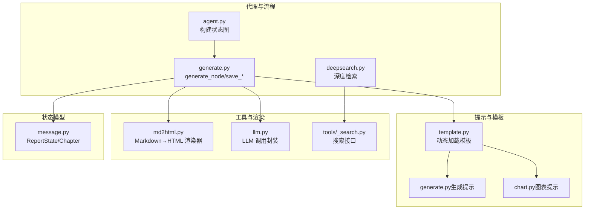
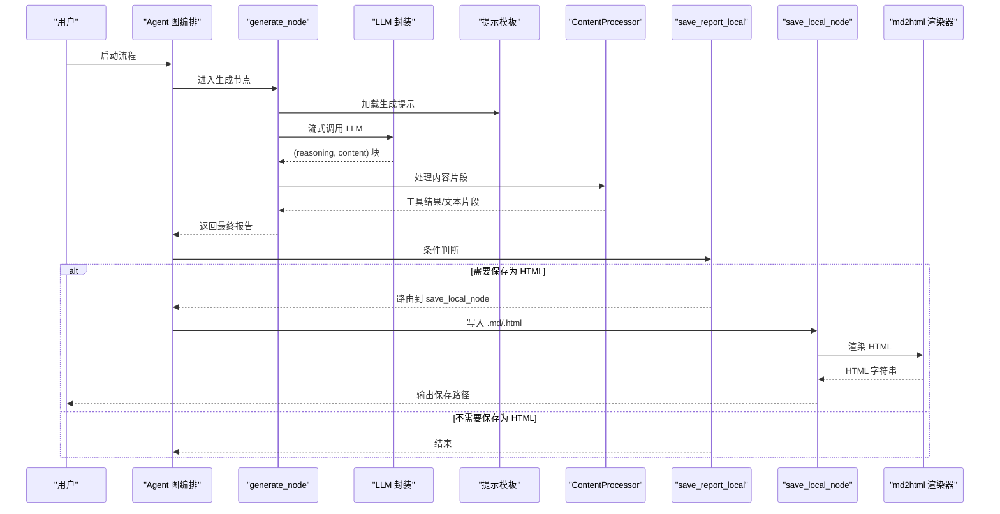
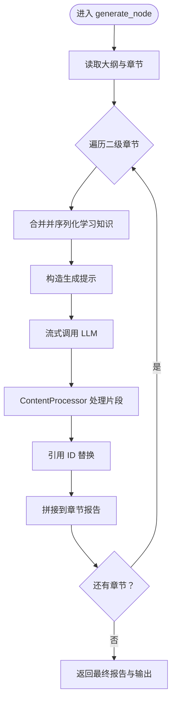
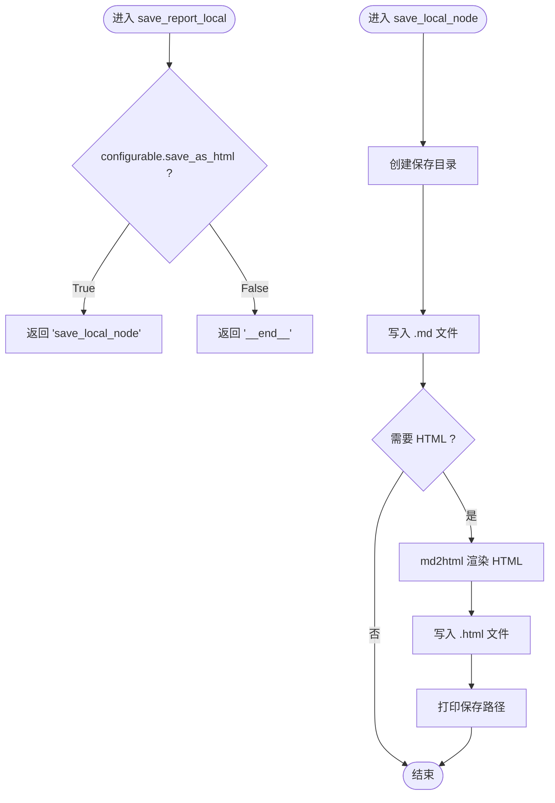
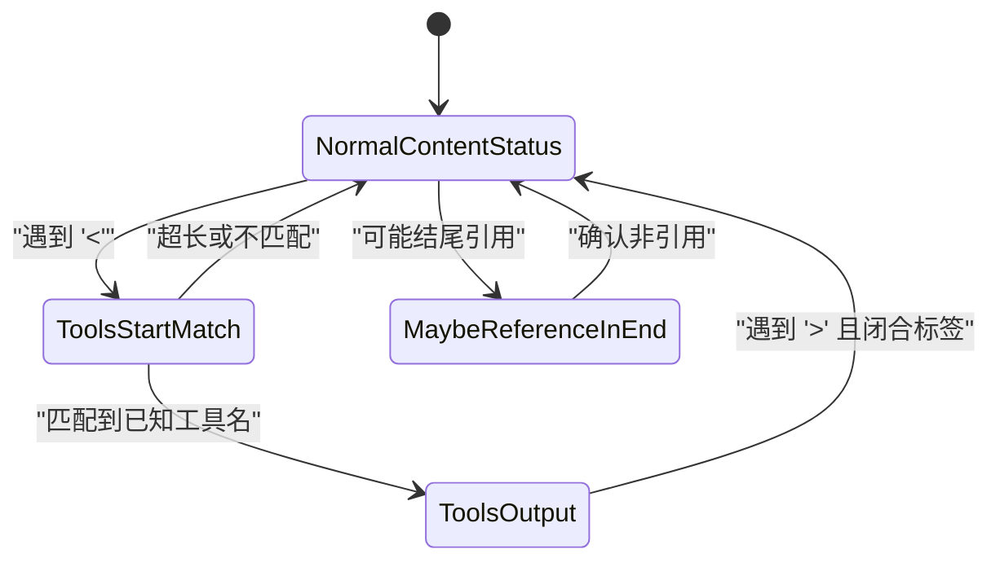
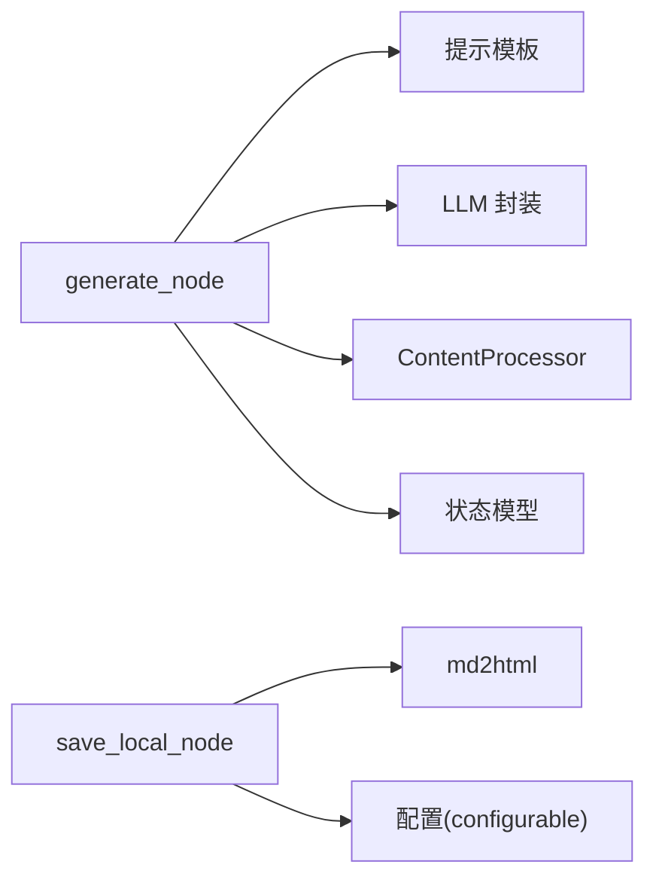

# 生成与保存节点

<cite>
**本文引用的文件**
- [generate.py](file://src/deepresearch/agent/generate.py)
- [agent.py](file://src/deepresearch/agent/agent.py)
- [message.py](file://src/deepresearch/agent/message.py)
- [md2html.py](file://src/deepresearch/tools/md2html.py)
- [generate.py（生成提示）](file://src/deepresearch/prompts/generate/generate.py)
- [chart.py（图表提示）](file://src/deepresearch/prompts/generate/chart.py)
- [template.py（提示模板）](file://src/deepresearch/prompts/template.py)
- [llm.py（大模型封装）](file://src/deepresearch/llms/llm.py)
- [_search.py（搜索接口）](file://src/deepresearch/tools/_search.py)
- [deepsearch.py（深度检索）](file://src/deepresearch/agent/deepsearch.py)
- [workflow.toml（工作流配置）](file://config/workflow.toml)
- [test_agent.py（代理单元测试）](file://tests/unit/agent/test_agent.py)
</cite>

## 目录
1. [引言](#引言)
2. [项目结构](#项目结构)
3. [核心组件](#核心组件)
4. [架构总览](#架构总览)
5. [详细组件分析](#详细组件分析)
6. [依赖分析](#依赖分析)
7. [性能考虑](#性能考虑)
8. [故障排查指南](#故障排查指南)
9. [结论](#结论)
10. [附录](#附录)

## 引言
本文件聚焦于“生成与保存节点”的技术实现，围绕以下目标展开：
- 深入解析 generate_node 的报告生成算法与内容组织机制
- 详述 save_local_node 的本地保存策略与文件管理
- 阐明 save_report_local 的条件判断逻辑与分支处理
- 说明报告格式化、样式渲染与元数据管理的实现细节
- 提供生成质量控制、内容审核与版本管理的机制说明
- 给出自定义报告模板与输出格式的扩展方法

## 项目结构
该模块位于 src/deepresearch/agent 下，核心文件包括 generate.py（生成与保存）、agent.py（图编排）、message.py（状态与章节模型）、以及配套的提示模板与工具。

**图表来源**
- [agent.py:19-44](file://src/deepresearch/agent/agent.py#L19-L44)
- [generate.py:26-160](file://src/deepresearch/agent/generate.py#L26-L160)
- [template.py:25-130](file://src/deepresearch/prompts/template.py#L25-L130)
- [generate.py（生成提示）:15-103](file://src/deepresearch/prompts/generate/generate.py#L15-L103)
- [chart.py（图表提示）:11-37](file://src/deepresearch/prompts/generate/chart.py#L11-L37)
- [md2html.py:19-800](file://src/deepresearch/tools/md2html.py#L19-L800)
- [llm.py:146-266](file://src/deepresearch/llms/llm.py#L146-L266)
- [_search.py:20-35](file://src/deepresearch/tools/_search.py#L20-L35)
- [message.py:12-112](file://src/deepresearch/agent/message.py#L12-L112)

**章节来源**
- [agent.py:19-44](file://src/deepresearch/agent/agent.py#L19-L44)
- [generate.py:26-160](file://src/deepresearch/agent/generate.py#L26-L160)
- [template.py:25-130](file://src/deepresearch/prompts/template.py#L25-L130)

## 核心组件
- generate_node：按章节顺序生成报告正文，支持流式输出、工具（表格/图表）内联生成与引用替换
- save_report_local：根据配置决定是否进入本地保存分支
- save_local_node：写入 Markdown 与可选 HTML 文件，追加参考文献列表，调用渲染器生成 HTML
- ContentProcessor：流式内容缓冲与状态机，解析并产出表格与图表等工具片段
- ReportRenderer：基于 mistune 的 HTML 渲染器，定制链接与代码块行为，注入样式与脚本
- LLM 封装：统一的流式/非流式调用、消息哈希缓存、线程安全 LRU 缓存
- 提示模板：动态加载 generate/chart 等模板，注入上下文变量
- 搜索与深度检索：为生成提供高质量知识源

**章节来源**
- [generate.py:26-160](file://src/deepresearch/agent/generate.py#L26-L160)
- [generate.py:169-295](file://src/deepresearch/agent/generate.py#L169-L295)
- [md2html.py:19-800](file://src/deepresearch/tools/md2html.py#L19-L800)
- [llm.py:146-266](file://src/deepresearch/llms/llm.py#L146-L266)
- [template.py:90-130](file://src/deepresearch/prompts/template.py#L90-L130)
- [deepsearch.py:55-150](file://src/deepresearch/agent/deepsearch.py#L55-L150)

## 架构总览
下图展示从“生成节点”到“保存节点”的端到端流程，包括条件路由与工具处理。

**图表来源**
- [agent.py:37-41](file://src/deepresearch/agent/agent.py#L37-L41)
- [generate.py:72-111](file://src/deepresearch/agent/generate.py#L72-L111)
- [generate.py:114-160](file://src/deepresearch/agent/generate.py#L114-L160)
- [llm.py:146-217](file://src/deepresearch/llms/llm.py#L146-L217)
- [template.py:90-130](file://src/deepresearch/prompts/template.py#L90-L130)
- [md2html.py:19-800](file://src/deepresearch/tools/md2html.py#L19-L800)

## 详细组件分析

### 生成节点：generate_node
- 输入状态：包含报告大纲、领域、主题、知识等
- 处理流程：
  - 打印章节标题并累积到最终报告
  - 对每个二级章节：
    - 合并与序列化学习知识为字符串
    - 使用提示模板构造消息，调用 LLM 流式生成
    - 通过 ContentProcessor 分段处理，解析表格与图表工具
    - 替换引用占位符为实际引用 ID
    - 拼接章节报告至最终报告
- 关键点：
  - 引用替换：预编译正则避免重复编译；按知识索引映射真实引用
  - 流式处理：边生成边输出，实时打印思考与内容
  - 上下文拼接：prev_report 与章节标题确保连贯性

**图表来源**
- [generate.py:26-111](file://src/deepresearch/agent/generate.py#L26-L111)
- [generate.py:169-295](file://src/deepresearch/agent/generate.py#L169-L295)

**章节来源**
- [generate.py:26-111](file://src/deepresearch/agent/generate.py#L26-L111)
- [generate.py:169-295](file://src/deepresearch/agent/generate.py#L169-L295)
- [generate.py（生成提示）:15-103](file://src/deepresearch/prompts/generate/generate.py#L15-L103)
- [template.py:90-130](file://src/deepresearch/prompts/template.py#L90-L130)
- [llm.py:146-217](file://src/deepresearch/llms/llm.py#L146-L217)

### 保存节点：save_report_local 与 save_local_node
- save_report_local：
  - 依据配置 configurable.save_as_html 判断是否保存为 HTML
  - 返回 "save_local_node" 或 "__end__" 作为条件路由
- save_local_node：
  - 创建保存目录（失败记录日志）
  - 写入 Markdown：正文 + 参考文献列表
  - 若启用 HTML：
    - 使用 ReportRenderer 渲染 HTML
    - 写入 .html 文件并打印保存路径
  - 文件名采用时间戳前缀，避免覆盖

**图表来源**
- [generate.py:114-160](file://src/deepresearch/agent/generate.py#L114-L160)
- [md2html.py:19-800](file://src/deepresearch/tools/md2html.py#L19-L800)

**章节来源**
- [generate.py:114-160](file://src/deepresearch/agent/generate.py#L114-L160)
- [md2html.py:19-800](file://src/deepresearch/tools/md2html.py#L19-L800)

### 内容处理器：ContentProcessor
- 状态机：
  - NormalContentStatus：常规文本
  - ToolsStartMatch：检测到 '<'
  - ToolsOutput：匹配到具体工具标签，收集完整工具块
- 支持工具：
  - table：提取 markdown 表格内容
  - chart：根据上方上下文与描述生成 ECharts 配置，插入自定义 HTML 容器
- 缓冲与分片：
  - 逐字符扫描，遇到 '>' 且匹配到已知工具名时切换状态
  - 完整工具块结束后，产出对应格式片段并清空缓冲

**图表来源**
- [generate.py:169-295](file://src/deepresearch/agent/generate.py#L169-L295)

**章节来源**
- [generate.py:169-295](file://src/deepresearch/agent/generate.py#L169-L295)
- [chart.py（图表提示）:11-37](file://src/deepresearch/prompts/generate/chart.py#L11-L37)
- [llm.py:146-266](file://src/deepresearch/llms/llm.py#L146-L266)

### 报告渲染与样式：md2html
- ReportRenderer：
  - 自定义链接：以 "^" 开头的引用链接转为带样式的引用元素
  - 自定义代码块：当 info 为 "custom_html" 时，仅在 HTML 合法时保留
- HTML 模板：
  - 注入 echarts 与 mermaid 资源
  - 提供现代/粗野两种主题切换
  - 引入弹出式引用气泡交互
- 输出：
  - 将 Markdown 报告渲染为完整的 HTML 页面，包含样式与脚本

**章节来源**
- [md2html.py:19-800](file://src/deepresearch/tools/md2html.py#L19-L800)

### 提示模板与 LLM 调用
- 提示模板：
  - 动态扫描 generate、learning、outline、prep 目录，加载 PROMPT 与 SYSTEM_PROMPT
  - apply_prompt_template 支持变量注入与消息拼接
- LLM 封装：
  - 支持流式与非流式调用
  - 消息级响应缓存（LRU），提升重复请求性能
  - 线程安全缓存统计与清理

**章节来源**
- [template.py:25-130](file://src/deepresearch/prompts/template.py#L25-L130)
- [llm.py:146-266](file://src/deepresearch/llms/llm.py#L146-L266)

### 知识与大纲模型
- Chapter/ReportState：
  - 章节树结构，支持合并学习知识、序列化为字符串
  - 用于生成提示中的 reference 与 outline 输出
- 深度检索：
  - 递归搜索、抽取知识、生成答案与评估
  - 用于为生成提供高质量、可溯源的知识源

**章节来源**
- [message.py:12-112](file://src/deepresearch/agent/message.py#L12-L112)
- [deepsearch.py:55-150](file://src/deepresearch/agent/deepsearch.py#L55-L150)

## 依赖分析
- generate_node 依赖：
  - 提示模板：生成与图表提示
  - LLM 封装：流式/非流式调用
  - 内容处理器：工具解析与分片
  - 状态模型：大纲与知识序列化
- 保存节点依赖：
  - md2html 渲染器：HTML 生成
  - 配置：保存路径、是否生成 HTML
- 模块耦合：
  - 低耦合：通过模板与配置解耦提示与调用
  - 可观测：LLM 缓存统计、错误日志

**图表来源**
- [generate.py:26-160](file://src/deepresearch/agent/generate.py#L26-L160)
- [md2html.py:19-800](file://src/deepresearch/tools/md2html.py#L19-L800)

**章节来源**
- [generate.py:26-160](file://src/deepresearch/agent/generate.py#L26-L160)
- [md2html.py:19-800](file://src/deepresearch/tools/md2html.py#L19-L800)

## 性能考虑
- LLM 缓存：
  - 响应缓存（LRU）与实例缓存，命中率统计，避免重复调用
- 流式输出：
  - 边生成边输出，降低首屏延迟
- 正则与解析：
  - 预编译引用替换正则，减少重复编译开销
- 并发搜索：
  - 深度检索使用线程池并发搜索，限制最大并发数

**章节来源**
- [llm.py:68-121](file://src/deepresearch/llms/llm.py#L68-L121)
- [generate.py:22-23](file://src/deepresearch/agent/generate.py#L22-L23)
- [deepsearch.py:214-239](file://src/deepresearch/agent/deepsearch.py#L214-L239)

## 故障排查指南
- 保存失败：
  - 目录创建异常：检查权限与路径
  - HTML 写入异常：确认渲染器输出合法
- LLM 错误：
  - 空消息或空响应：检查提示模板变量注入
  - 缓存命中异常：查看缓存统计与清理
- 引用与工具：
  - 引用未替换：确认知识索引与 ID 映射
  - 工具未生成：检查提示中工具调用格式与上下文

**章节来源**
- [generate.py:131-158](file://src/deepresearch/agent/generate.py#L131-L158)
- [llm.py:163-184](file://src/deepresearch/llms/llm.py#L163-L184)
- [md2html.py:10-17](file://src/deepresearch/tools/md2html.py#L10-L17)

## 结论
本模块通过“生成-保存”两条主线，结合流式 LLM、工具内联生成与模板化提示，实现了高质量、可扩展的报告生成与落地。保存节点提供灵活的本地落盘策略，并通过 md2html 实现美观的 HTML 展示。建议在生产环境关注缓存命中率、引用一致性与工具生成稳定性，持续优化提示模板与工具链。

## 附录

### 生成质量控制与内容审核
- 质量控制：
  - 引用一致性：严格要求每句论断标注来源，避免跨实体引用
  - 证据充分性：逐段校验事实与证据链
  - 语言规范：遵循表达标准，突出关键数据与结论
- 内容审核：
  - 评估维度：完整性、新鲜度、多元性
  - 递归评估：未达标时生成新查询，迭代补充知识

**章节来源**
- [generate.py（生成提示）:15-103](file://src/deepresearch/prompts/generate/generate.py#L15-L103)
- [deepsearch.py:351-391](file://src/deepresearch/agent/deepsearch.py#L351-L391)

### 版本管理与元数据
- 元数据：
  - 报告标题、生成时间、引用条目
- 版本策略：
  - 文件名采用时间戳前缀，避免覆盖
  - 可扩展为 Git/LFS 管理或数据库记录

**章节来源**
- [generate.py:129-160](file://src/deepresearch/agent/generate.py#L129-L160)

### 自定义报告模板与输出格式扩展
- 自定义提示模板：
  - 在 prompts/generate 目录新增 .py 文件，导出 PROMPT 与 SYSTEM_PROMPT
  - 通过 apply_prompt_template 动态加载并注入变量
- 输出格式扩展：
  - 新增渲染器：继承 mistune 渲染器，重写 block_code/link 等方法
  - 新增工具：在 ContentProcessor 中注册工具名与解析逻辑
- 配置扩展：
  - 在 workflow.toml 或运行时 configurable 中增加开关与参数

**章节来源**
- [template.py:25-130](file://src/deepresearch/prompts/template.py#L25-L130)
- [md2html.py:19-800](file://src/deepresearch/tools/md2html.py#L19-L800)
- [generate.py:169-295](file://src/deepresearch/agent/generate.py#L169-L295)
- [workflow.toml:1-3](file://config/workflow.toml#L1-L3)