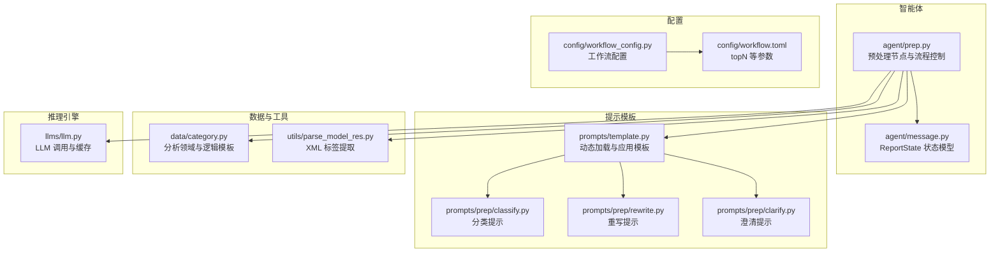
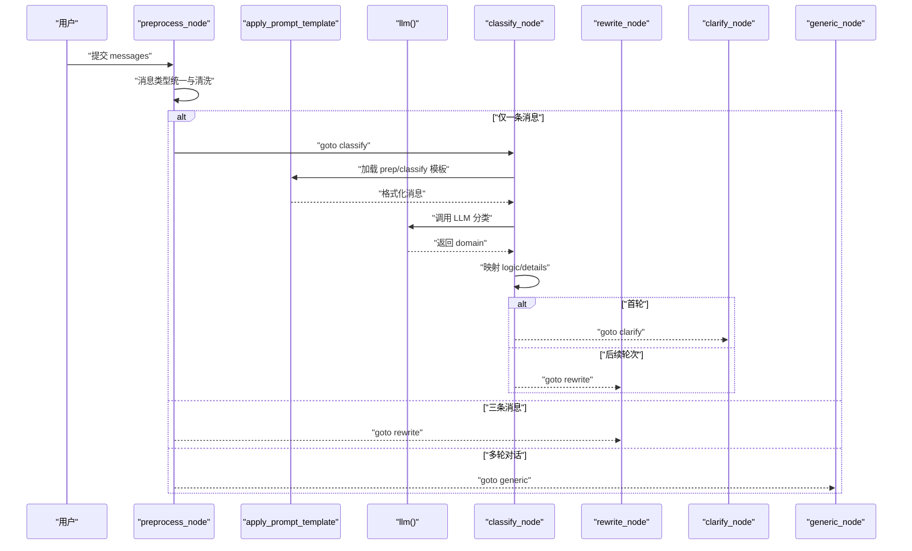
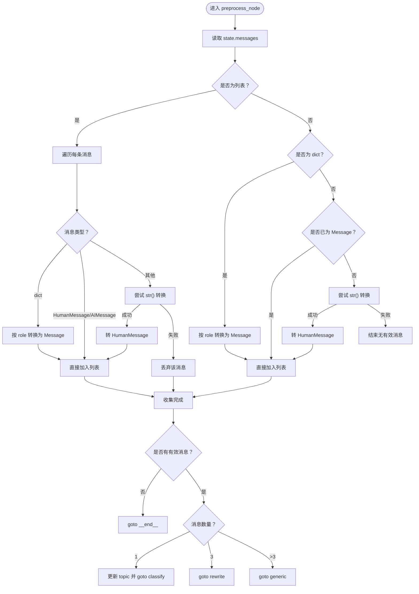
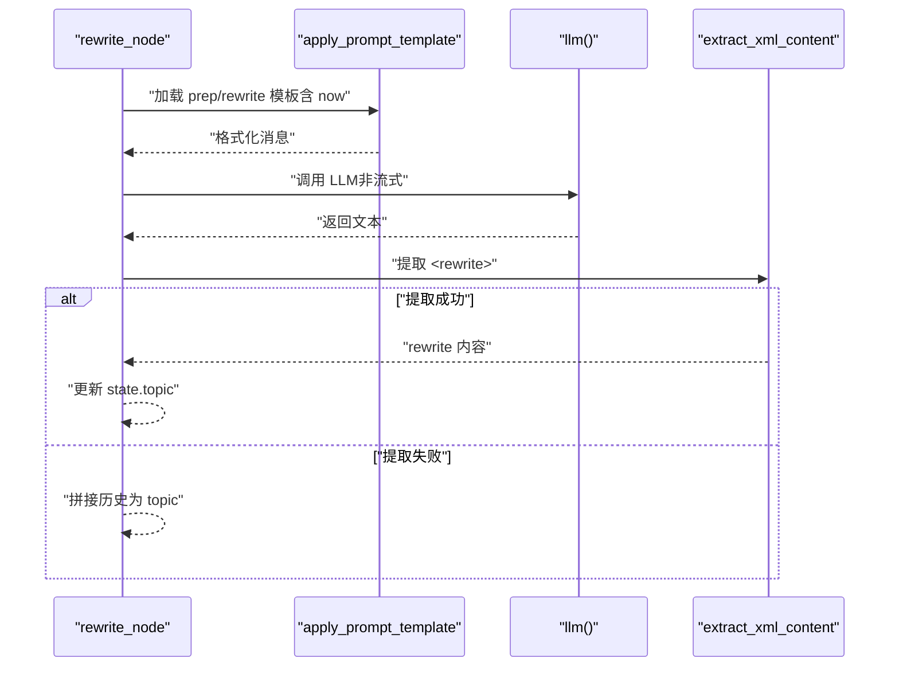
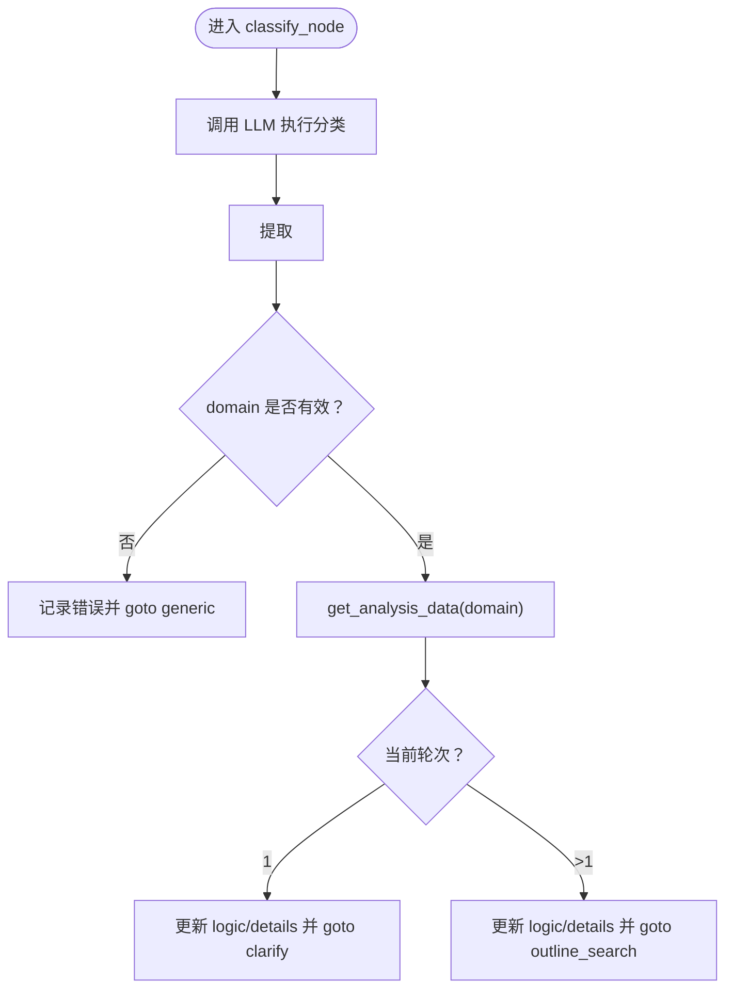
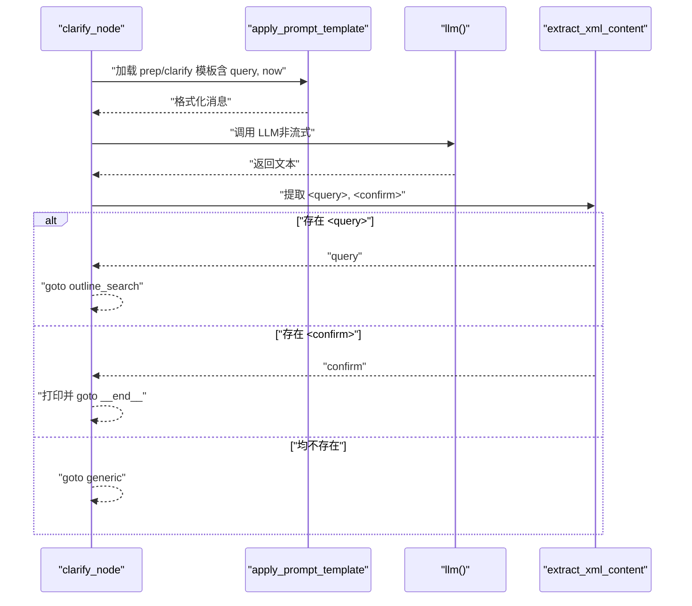
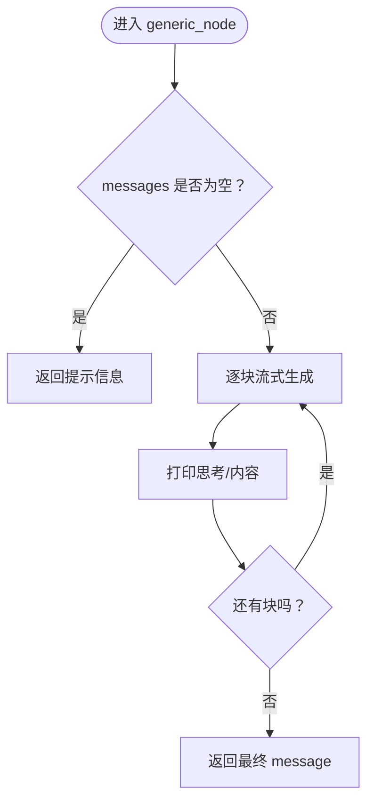
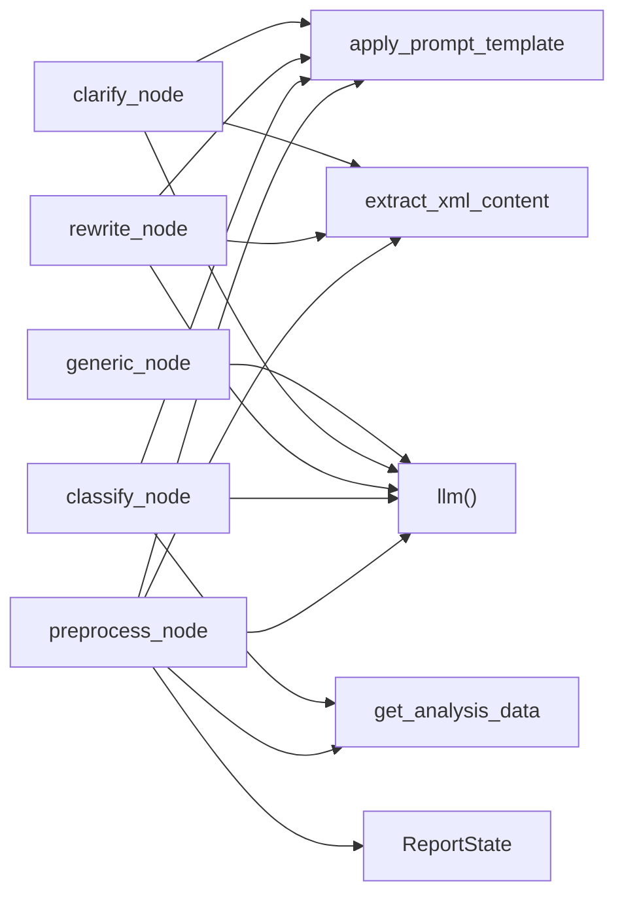

# 预处理节点

<cite>
**本文引用的文件**
- [src/deepresearch/agent/prep.py](file://src/deepresearch/agent/prep.py)
- [src/deepresearch/prompts/prep/clarify.py](file://src/deepresearch/prompts/prep/clarify.py)
- [src/deepresearch/prompts/prep/classify.py](file://src/deepresearch/prompts/prep/classify.py)
- [src/deepresearch/prompts/prep/rewrite.py](file://src/deepresearch/prompts/prep/rewrite.py)
- [src/deepresearch/data/category.py](file://src/deepresearch/data/category.py)
- [src/deepresearch/utils/parse_model_res.py](file://src/deepresearch/utils/parse_model_res.py)
- [src/deepresearch/prompts/template.py](file://src/deepresearch/prompts/template.py)
- [src/deepresearch/agent/message.py](file://src/deepresearch/agent/message.py)
- [src/deepresearch/llms/llm.py](file://src/deepresearch/llms/llm.py)
- [src/deepresearch/config/workflow_config.py](file://src/deepresearch/config/workflow_config.py)
- [config/workflow.toml](file://config/workflow.toml)
</cite>

## 目录
1. [简介](#简介)
2. [项目结构](#项目结构)
3. [核心组件](#核心组件)
4. [架构总览](#架构总览)
5. [详细组件分析](#详细组件分析)
6. [依赖分析](#依赖分析)
7. [性能考虑](#性能考虑)
8. [故障排查指南](#故障排查指南)
9. [结论](#结论)
10. [附录](#附录)

## 简介
本文件聚焦“预处理节点”在研究型对话与报告生成流水线中的关键作用，系统性阐述以下节点的技术细节与运行机制：
- preprocess_node：输入消息的统一化与路由决策，实现数据清洗与初始意图提取。
- rewrite_node：基于交互历史的文本重写，提炼完整、精确且可执行的研究主题。
- classify_node：对用户查询进行意图分类，映射到分析领域与执行路径。
- clarify_node：一次性澄清模糊或宽泛的用户意图，必要时直接结束流程。
- generic_node：通用兜底处理，面向非研究类对话的流畅回复。

文档覆盖每个节点的输入输出格式、处理流程、配置参数、错误处理与性能优化，并提供可视化图示与使用场景说明，帮助读者快速理解与扩展。

## 项目结构
预处理节点位于智能体模块中，配合提示模板、解析工具、LLM封装与状态模型协同工作。下图展示与预处理节点直接相关的模块与文件：

图表来源
- [src/deepresearch/agent/prep.py:1-202](file://src/deepresearch/agent/prep.py#L1-L202)
- [src/deepresearch/prompts/template.py:1-166](file://src/deepresearch/prompts/template.py#L1-L166)
- [src/deepresearch/prompts/prep/classify.py:1-48](file://src/deepresearch/prompts/prep/classify.py#L1-L48)
- [src/deepresearch/prompts/prep/rewrite.py:1-25](file://src/deepresearch/prompts/prep/rewrite.py#L1-L25)
- [src/deepresearch/prompts/prep/clarify.py:1-57](file://src/deepresearch/prompts/prep/clarify.py#L1-L57)
- [src/deepresearch/data/category.py:1-123](file://src/deepresearch/data/category.py#L1-L123)
- [src/deepresearch/utils/parse_model_res.py:1-32](file://src/deepresearch/utils/parse_model_res.py#L1-L32)
- [src/deepresearch/llms/llm.py:1-308](file://src/deepresearch/llms/llm.py#L1-L308)
- [src/deepresearch/config/workflow_config.py:1-28](file://src/deepresearch/config/workflow_config.py#L1-L28)
- [config/workflow.toml:1-3](file://config/workflow.toml#L1-L3)

章节来源
- [src/deepresearch/agent/prep.py:1-202](file://src/deepresearch/agent/prep.py#L1-L202)
- [src/deepresearch/prompts/template.py:1-166](file://src/deepresearch/prompts/template.py#L1-L166)

## 核心组件
本节概述五个预处理节点的职责、输入输出与关键处理步骤。

- preprocess_node
  - 输入：ReportState 中的 messages（支持列表、字典、LangChain Message 对象）
  - 输出：根据消息数量与类型决定路由至 classify、rewrite 或 generic；同时更新 topic 字段
  - 关键点：消息类型统一、异常对象丢弃、空消息直接结束

- rewrite_node
  - 输入：当前时间与完整交互历史
  - 输出：标准化后的研究主题 topic（置于 state）
  - 关键点：通过模板与 LLM 提取 <rewrite> 内容，失败回退为拼接历史

- classify_node
  - 输入：topic 文本
  - 输出：domain、logic、details；根据轮次决定是否进入 clarify 或 outline_search
  - 关键点：调用 category 数据库映射领域，缺失时报错并回退 generic

- clarify_node
  - 输入：topic 与当前时间
  - 输出：若需澄清则返回 goto="outline_search"，否则确认后结束；不澄清则回退 generic
  - 关键点：优先解析 <query>，其次解析 <confirm>，最后回退 generic

- generic_node
  - 输入：messages 列表
  - 输出：流式生成的回复字符串
  - 关键点：异常捕获与错误提示，避免中断流程

章节来源
- [src/deepresearch/agent/prep.py:21-202](file://src/deepresearch/agent/prep.py#L21-L202)
- [src/deepresearch/agent/message.py:101-112](file://src/deepresearch/agent/message.py#L101-L112)
- [src/deepresearch/data/category.py:74-104](file://src/deepresearch/data/category.py#L74-L104)

## 架构总览
下图展示从用户输入到各预处理节点的端到端流程，包括消息规范化、意图识别与澄清、主题重写与领域分类等关键步骤。

图表来源
- [src/deepresearch/agent/prep.py:21-80](file://src/deepresearch/agent/prep.py#L21-L80)
- [src/deepresearch/prompts/template.py:90-129](file://src/deepresearch/prompts/template.py#L90-L129)
- [src/deepresearch/llms/llm.py:146-185](file://src/deepresearch/llms/llm.py#L146-L185)
- [src/deepresearch/agent/prep.py:105-150](file://src/deepresearch/agent/prep.py#L105-L150)
- [src/deepresearch/agent/prep.py:82-103](file://src/deepresearch/agent/prep.py#L82-L103)
- [src/deepresearch/agent/prep.py:153-181](file://src/deepresearch/agent/prep.py#L153-L181)

## 详细组件分析

### preprocess_node：输入处理与数据清洗
- 处理目标
  - 将混合类型的消息统一为 LangChain 的 HumanMessage/AIMessage
  - 清洗不可序列化对象，丢弃无法转换的消息
  - 基于消息数量与类型选择后续节点
- 输入格式
  - messages 可为：列表（含 dict/HumanMessage/AIMessage）、单个 dict、单个 HumanMessage、其他可转字符串对象
- 输出与路由
  - 无有效消息：直接结束
  - 单条消息：更新 topic 并 goto classify
  - 三条消息：goto rewrite
  - 多轮对话：goto generic
- 错误处理
  - 异常对象转换失败时跳过该条消息
  - 空消息列表直接结束

图表来源
- [src/deepresearch/agent/prep.py:21-80](file://src/deepresearch/agent/prep.py#L21-L80)

章节来源
- [src/deepresearch/agent/prep.py:21-80](file://src/deepresearch/agent/prep.py#L21-L80)

### rewrite_node：文本重写与主题提炼
- 目标
  - 综合交互历史与时间信息，提炼出完整、精确、可执行的研究主题
- 输入
  - 当前时间 now 与 messages
- 处理流程
  - 应用 prep/rewrite 模板生成系统提示
  - 调用 LLM 获取重写结果，提取 <rewrite> 标签内容
  - 若未提取到，则回退为拼接历史消息作为 topic
- 输出
  - 更新 state.topic

图表来源
- [src/deepresearch/agent/prep.py:82-103](file://src/deepresearch/agent/prep.py#L82-L103)
- [src/deepresearch/prompts/prep/rewrite.py:1-25](file://src/deepresearch/prompts/prep/rewrite.py#L1-L25)
- [src/deepresearch/utils/parse_model_res.py:13-27](file://src/deepresearch/utils/parse_model_res.py#L13-L27)

章节来源
- [src/deepresearch/agent/prep.py:82-103](file://src/deepresearch/agent/prep.py#L82-L103)
- [src/deepresearch/prompts/prep/rewrite.py:1-25](file://src/deepresearch/prompts/prep/rewrite.py#L1-L25)
- [src/deepresearch/utils/parse_model_res.py:1-32](file://src/deepresearch/utils/parse_model_res.py#L1-L32)

### classify_node：分类逻辑与标签体系
- 目标
  - 将用户查询归类到固定领域，映射分析逻辑与详细内容
- 输入
  - topic 文本
- 处理流程
  - 应用 prep/classify 模板，调用 LLM 返回 domain
  - 使用 AnalysisTag 与 get_analysis_data(domain) 获取 logic 与 details
  - 若为首轮且存在澄清需求则 goto clarify，否则 goto outline_search
- 输出
  - 更新 state.domain、state.logic、state.details

图表来源
- [src/deepresearch/agent/prep.py:105-150](file://src/deepresearch/agent/prep.py#L105-L150)
- [src/deepresearch/prompts/prep/classify.py:1-48](file://src/deepresearch/prompts/prep/classify.py#L1-L48)
- [src/deepresearch/data/category.py:74-104](file://src/deepresearch/data/category.py#L74-L104)

章节来源
- [src/deepresearch/agent/prep.py:105-150](file://src/deepresearch/agent/prep.py#L105-L150)
- [src/deepresearch/data/category.py:1-123](file://src/deepresearch/data/category.py#L1-L123)

### clarify_node：澄清处理与上下文增强
- 目标
  - 一次性澄清模糊或宽泛的意图，必要时直接结束
- 输入
  - topic 与当前时间 now
- 处理流程
  - 应用 prep/clarify 模板，调用 LLM
  - 优先解析 <query>：表示无需澄清，直接进入 outline_search
  - 解析 <confirm>：打印确认信息并结束
  - 否则回退 generic
- 输出
  - 根据解析结果决定 goto 或输出确认信息

图表来源
- [src/deepresearch/agent/prep.py:153-181](file://src/deepresearch/agent/prep.py#L153-L181)
- [src/deepresearch/prompts/prep/clarify.py:1-57](file://src/deepresearch/prompts/prep/clarify.py#L1-L57)
- [src/deepresearch/utils/parse_model_res.py:13-27](file://src/deepresearch/utils/parse_model_res.py#L13-L27)

章节来源
- [src/deepresearch/agent/prep.py:153-181](file://src/deepresearch/agent/prep.py#L153-L181)
- [src/deepresearch/prompts/prep/clarify.py:1-57](file://src/deepresearch/prompts/prep/clarify.py#L1-L57)

### generic_node：通用处理模式与应用场景
- 目标
  - 非研究类对话的通用回复，保证流程不中断
- 输入
  - messages 列表
- 处理流程
  - 流式消费 LLM 输出，实时打印思考与内容
  - 捕获异常并返回错误信息
- 输出
  - {"output": {"message": ...}}

图表来源
- [src/deepresearch/agent/prep.py:184-202](file://src/deepresearch/agent/prep.py#L184-L202)
- [src/deepresearch/llms/llm.py:187-217](file://src/deepresearch/llms/llm.py#L187-L217)

章节来源
- [src/deepresearch/agent/prep.py:184-202](file://src/deepresearch/agent/prep.py#L184-L202)
- [src/deepresearch/llms/llm.py:1-308](file://src/deepresearch/llms/llm.py#L1-L308)

## 依赖分析
- 模块耦合
  - preprocess_node 依赖模板加载、LLM 调用、消息解析与领域映射
  - classify_node 依赖 category 数据库与模板
  - rewrite/clarify 节点依赖各自模板与 XML 提取工具
  - generic_node 依赖 LLM 流式接口
- 外部依赖
  - LLM 实现（ChatDeepSeek）与响应缓存
  - 动态提示模板加载机制
  - 工作流配置（如 topN）

图表来源
- [src/deepresearch/agent/prep.py:1-202](file://src/deepresearch/agent/prep.py#L1-L202)
- [src/deepresearch/prompts/template.py:1-166](file://src/deepresearch/prompts/template.py#L1-L166)
- [src/deepresearch/utils/parse_model_res.py:1-32](file://src/deepresearch/utils/parse_model_res.py#L1-L32)
- [src/deepresearch/data/category.py:1-123](file://src/deepresearch/data/category.py#L1-L123)
- [src/deepresearch/llms/llm.py:1-308](file://src/deepresearch/llms/llm.py#L1-L308)

章节来源
- [src/deepresearch/agent/prep.py:1-202](file://src/deepresearch/agent/prep.py#L1-L202)
- [src/deepresearch/prompts/template.py:1-166](file://src/deepresearch/prompts/template.py#L1-L166)
- [src/deepresearch/utils/parse_model_res.py:1-32](file://src/deepresearch/utils/parse_model_res.py#L1-L32)
- [src/deepresearch/data/category.py:1-123](file://src/deepresearch/data/category.py#L1-L123)
- [src/deepresearch/llms/llm.py:1-308](file://src/deepresearch/llms/llm.py#L1-L308)

## 性能考虑
- LLM 缓存
  - 响应级缓存：基于消息哈希的 LRU 缓存，命中率统计可用于监控
  - 实例缓存：LLM 实例 LRU，限制最大缓存实例数
- 流式输出
  - 通用节点采用流式生成，降低首帧延迟，提升交互体验
- 正则与解析
  - XML 标签提取使用带缓存的编译正则，避免重复编译开销
- 模板加载
  - 提示模板懒加载，首次访问时扫描目录并导入模块，减少启动成本

章节来源
- [src/deepresearch/llms/llm.py:68-121](file://src/deepresearch/llms/llm.py#L68-L121)
- [src/deepresearch/llms/llm.py:126-185](file://src/deepresearch/llms/llm.py#L126-L185)
- [src/deepresearch/utils/parse_model_res.py:7-11](file://src/deepresearch/utils/parse_model_res.py#L7-L11)
- [src/deepresearch/prompts/template.py:78-87](file://src/deepresearch/prompts/template.py#L78-L87)

## 故障排查指南
- 分类失败
  - 现象：domain 未提取或非法
  - 排查：检查 prep/classify 模板输出格式；确认 AnalysisTag 是否包含对应值
  - 处置：记录错误并回退 generic
- 领域数据缺失
  - 现象：get_analysis_data 抛出异常
  - 排查：确认领域名称与 category.py 中枚举一致
  - 处置：回退 generic 并提示不支持的领域
- 重写失败
  - 现象：<rewrite> 标签未出现
  - 排查：检查 prep/rewrite 模板与 LLM 输出稳定性
  - 处置：回退拼接历史作为 topic
- 澄清无结果
  - 现象：<query>/<confirm> 均未提取
  - 排查：确认 prep/clarify 模板与语言检测
  - 处置：回退 generic
- LLM 异常
  - 现象：流式/非流式调用报错
  - 排查：检查网络、密钥与响应结构
  - 处置：捕获异常并返回错误信息

章节来源
- [src/deepresearch/agent/prep.py:105-150](file://src/deepresearch/agent/prep.py#L105-L150)
- [src/deepresearch/agent/prep.py:153-181](file://src/deepresearch/agent/prep.py#L153-L181)
- [src/deepresearch/agent/prep.py:82-103](file://src/deepresearch/agent/prep.py#L82-L103)
- [src/deepresearch/llms/llm.py:219-255](file://src/deepresearch/llms/llm.py#L219-L255)

## 结论
预处理节点通过“消息清洗—主题重写—意图分类—澄清确认—通用兜底”的闭环，确保研究型对话的准确性与稳定性。其设计强调：
- 输入的鲁棒性与路由的确定性
- 主题表达的完整性与可执行性
- 领域映射的一致性与可扩展性
- 流式输出与缓存优化的性能保障
- 明确的错误回退与可观测性

## 附录

### 输入输出格式与配置参数
- preprocess_node
  - 输入：state.messages（列表/字典/消息对象）
  - 输出：更新 state.topic；路由：classify/rewrite/generic/__end__
- rewrite_node
  - 输入：state.messages, now
  - 输出：state.topic
- classify_node
  - 输入：state.topic
  - 输出：state.domain, state.logic, state.details；路由：clarify/outline_search
- clarify_node
  - 输入：state.topic, now
  - 输出：goto outline_search/确认信息/__end__ 或 generic
- generic_node
  - 输入：state.messages
  - 输出：{"output": {"message": ...}}
- 配置参数
  - 工作流配置：config/workflow.toml 中的 topN（影响检索轮次）
  - LLM 类型：basic/clarify/report 等（由调用方传入）

章节来源
- [src/deepresearch/agent/message.py:101-112](file://src/deepresearch/agent/message.py#L101-L112)
- [src/deepresearch/config/workflow_config.py:7-27](file://src/deepresearch/config/workflow_config.py#L7-L27)
- [config/workflow.toml:1-3](file://config/workflow.toml#L1-L3)

### 使用场景示例（路径指引）
- 场景一：初次输入，需要分类与澄清
  - 触发路径：preprocess_node（1 条消息）→ classify → clarify
  - 参考实现路径：[src/deepresearch/agent/prep.py:21-80](file://src/deepresearch/agent/prep.py#L21-L80), [src/deepresearch/agent/prep.py:105-150](file://src/deepresearch/agent/prep.py#L105-L150), [src/deepresearch/agent/prep.py:153-181](file://src/deepresearch/agent/prep.py#L153-L181)
- 场景二：已有完整历史，直接重写主题
  - 触发路径：preprocess_node（3 条消息）→ rewrite
  - 参考实现路径：[src/deepresearch/agent/prep.py:21-80](file://src/deepresearch/agent/prep.py#L21-L80), [src/deepresearch/agent/prep.py:82-103](file://src/deepresearch/agent/prep.py#L82-L103)
- 场景三：非研究类问题，通用回复
  - 触发路径：preprocess_node（多轮）→ generic
  - 参考实现路径：[src/deepresearch/agent/prep.py:21-80](file://src/deepresearch/agent/prep.py#L21-L80), [src/deepresearch/agent/prep.py:184-202](file://src/deepresearch/agent/prep.py#L184-L202)