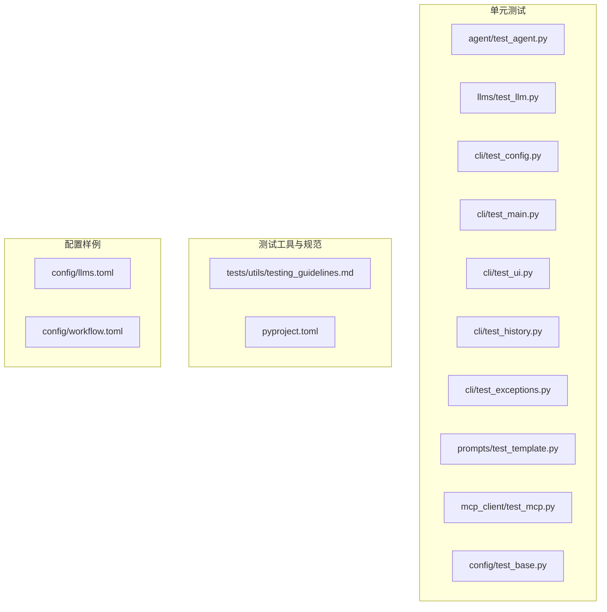
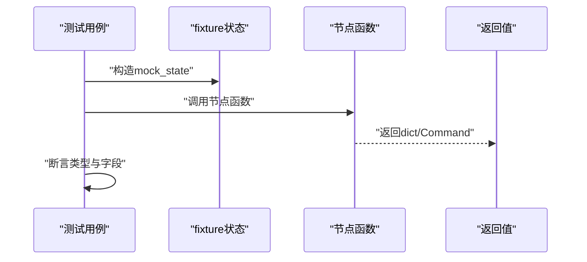
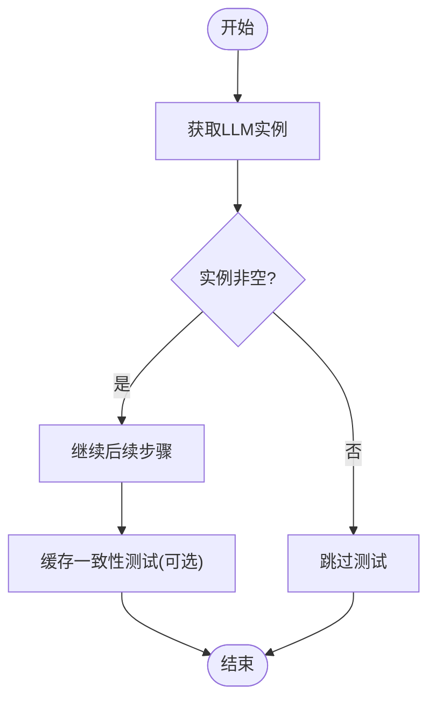
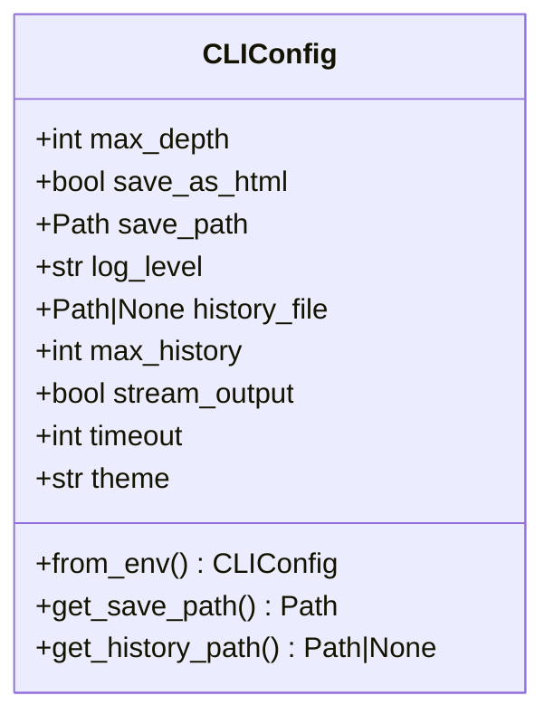
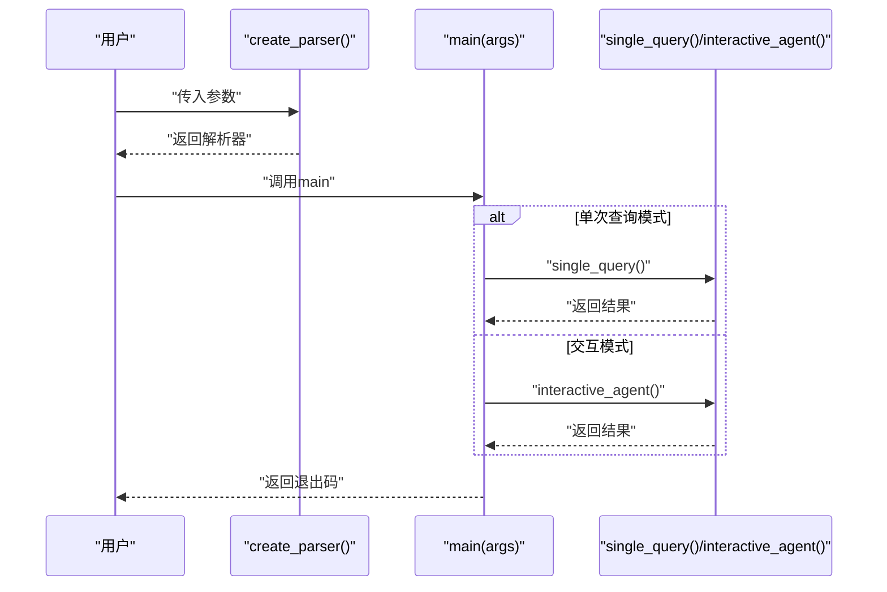
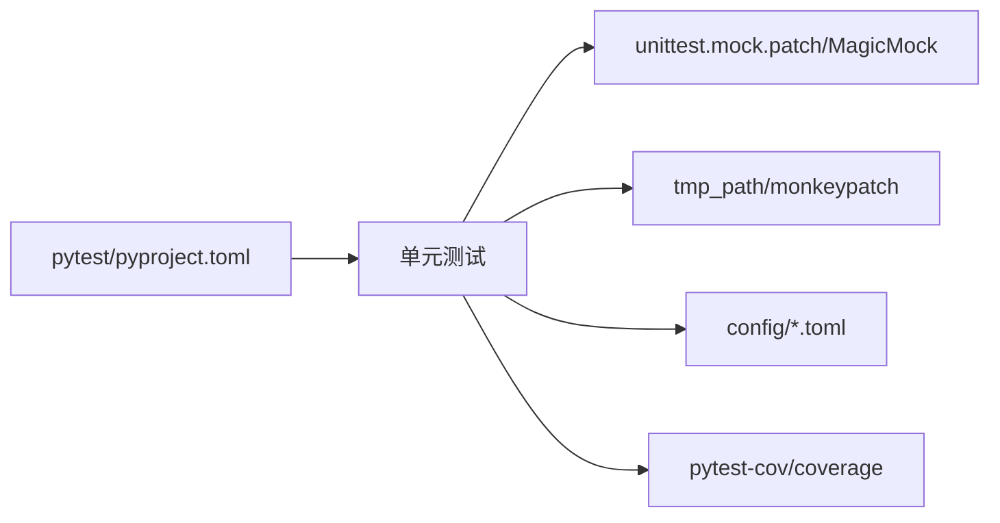

# 单元测试

<cite>
**本文引用的文件**
- [tests/unit/agent/test_agent.py](file://tests/unit/agent/test_agent.py)
- [tests/unit/llms/test_llm.py](file://tests/unit/llms/test_llm.py)
- [tests/unit/cli/test_config.py](file://tests/unit/cli/test_config.py)
- [tests/unit/cli/test_main.py](file://tests/unit/cli/test_main.py)
- [tests/unit/cli/test_ui.py](file://tests/unit/cli/test_ui.py)
- [tests/unit/cli/test_history.py](file://tests/unit/cli/test_history.py)
- [tests/unit/cli/test_exceptions.py](file://tests/unit/cli/test_exceptions.py)
- [tests/unit/prompts/test_template.py](file://tests/unit/prompts/test_template.py)
- [tests/unit/mcp_client/test_mcp.py](file://tests/unit/mcp_client/test_mcp.py)
- [tests/unit/config/test_base.py](file://tests/unit/config/test_base.py)
- [tests/utils/testing_guidelines.md](file://tests/utils/testing_guidelines.md)
- [pyproject.toml](file://pyproject.toml)
- [config/llms.toml](file://config/llms.toml)
- [config/workflow.toml](file://config/workflow.toml)
</cite>

## 目录
1. [简介](#简介)
2. [项目结构](#项目结构)
3. [核心组件](#核心组件)
4. [架构总览](#架构总览)
5. [详细组件分析](#详细组件分析)
6. [依赖分析](#依赖分析)
7. [性能考虑](#性能考虑)
8. [故障排查指南](#故障排查指南)
9. [结论](#结论)
10. [附录](#附录)

## 简介
本文件面向DeepResearch项目的单元测试，系统阐述测试设计原则、实现方法与最佳实践，覆盖Agent模块、LLM模块、CLI配置与命令行、提示词模板、MCP客户端以及通用配置基类等子系统。文档同时给出测试隔离策略、Mock使用建议、断言策略、测试数据准备与环境配置、测试执行方法，并提供测试覆盖率目标与具体示例路径。

## 项目结构
单元测试位于tests/unit目录下，按模块划分，便于定位与维护：
- agent：Agent工作流节点与图构建的单元测试
- llms：LLM实例获取与调用的单元测试
- cli：CLI配置、主入口、UI、历史记录、异常等模块的单元测试
- prompts：提示词模板加载与应用的单元测试
- mcp_client：ArXiv/PubMed MCP客户端接口的单元测试
- config：配置基类与验证器的单元测试

图表来源
- [tests/unit/agent/test_agent.py:1-184](file://tests/unit/agent/test_agent.py#L1-L184)
- [tests/unit/llms/test_llm.py:1-61](file://tests/unit/llms/test_llm.py#L1-L61)
- [tests/unit/cli/test_config.py:1-175](file://tests/unit/cli/test_config.py#L1-L175)
- [tests/unit/cli/test_main.py:1-378](file://tests/unit/cli/test_main.py#L1-L378)
- [tests/unit/cli/test_ui.py:1-320](file://tests/unit/cli/test_ui.py#L1-L320)
- [tests/unit/cli/test_history.py:1-333](file://tests/unit/cli/test_history.py#L1-L333)
- [tests/unit/cli/test_exceptions.py:1-169](file://tests/unit/cli/test_exceptions.py#L1-L169)
- [tests/unit/prompts/test_template.py:1-60](file://tests/unit/prompts/test_template.py#L1-L60)
- [tests/unit/mcp_client/test_mcp.py:1-93](file://tests/unit/mcp_client/test_mcp.py#L1-L93)
- [tests/unit/config/test_base.py:1-546](file://tests/unit/config/test_base.py#L1-L546)
- [tests/utils/testing_guidelines.md:1-201](file://tests/utils/testing_guidelines.md#L1-L201)
- [pyproject.toml:68-70](file://pyproject.toml#L68-L70)

章节来源
- [tests/utils/testing_guidelines.md:1-201](file://tests/utils/testing_guidelines.md#L1-L201)
- [pyproject.toml:68-70](file://pyproject.toml#L68-L70)

## 核心组件
- 测试框架与覆盖率
  - 使用pytest作为测试框架，pytest-cov用于覆盖率统计
  - 测试路径由pyproject.toml统一配置，测试入口为tests目录
- 测试隔离
  - 使用pytest fixture进行状态注入；对需要外部服务的测试采用skip策略
  - 对CLI与UI进行Mock，避免真实终端与网络请求
- Mock与桩
  - 使用unittest.mock.patch与MagicMock/AsyncMock替换外部依赖
  - 对LLM调用、网络请求、文件系统进行Mock
- 断言策略
  - 明确断言目标：类型、范围、行为与异常
  - 对环境变量与参数合并场景，断言优先级与回退逻辑

章节来源
- [tests/utils/testing_guidelines.md:65-100](file://tests/utils/testing_guidelines.md#L65-L100)
- [pyproject.toml:48-52](file://pyproject.toml#L48-L52)

## 架构总览
单元测试围绕各模块职责进行分层测试：
- Agent模块：验证节点函数返回结构、图构建与流式执行
- LLM模块：验证实例工厂与响应缓存（需有效密钥）
- CLI模块：配置加载、参数解析、主入口、UI与历史记录
- 提示词模板：模板加载与应用
- MCP客户端：ArXiv/PubMed搜索与读取接口
- 配置基类：验证器、环境变量与文件加载、配置管理器

```mermaid
graph TB
subgraph "Agent"
AG1["build_agent()"]
AG2["generic_node()"]
AG3["classify_node()"]
AG4["clarify_node()"]
AG5["rewrite_node()"]
AG6["outline_search_node()"]
AG7["outline_knowledge_2_str()"]
end
subgraph "LLM"
LL1["_get_llm_instance()"]
LL2["llm()"]
end
subgraph "CLI"
CL1["CLIConfig"]
CL2["create_parser()/main()"]
CL3["TerminalUI/ProgressTracker"]
CL4["HistoryManager"]
CL5["异常体系"]
end
subgraph "Prompts"
PR1["load_prompt_templates()"]
PR2["apply_prompt_template()"]
end
subgraph "MCP"
MC1["arxiv_search/read"]
MC2["pubmed_search/read"]
end
subgraph "Config"
CF1["BaseConfig/ConfigManager"]
CF2["Range/Choice/Type 验证器"]
end
AG1 --> AG2 --> AG3 --> AG4 --> AG5 --> AG6 --> AG7
CL2 --> CL1
CL3 --> CL1
CL4 --> CL1
PR2 --> PR1
MC1 --> MC2
CF1 --> CF2
```

图表来源
- [tests/unit/agent/test_agent.py:83-184](file://tests/unit/agent/test_agent.py#L83-L184)
- [tests/unit/llms/test_llm.py:19-57](file://tests/unit/llms/test_llm.py#L19-L57)
- [tests/unit/cli/test_config.py:15-175](file://tests/unit/cli/test_config.py#L15-L175)
- [tests/unit/cli/test_main.py:145-188](file://tests/unit/cli/test_main.py#L145-L188)
- [tests/unit/cli/test_ui.py:14-320](file://tests/unit/cli/test_ui.py#L14-L320)
- [tests/unit/cli/test_history.py:74-333](file://tests/unit/cli/test_history.py#L74-L333)
- [tests/unit/prompts/test_template.py:13-60](file://tests/unit/prompts/test_template.py#L13-L60)
- [tests/unit/mcp_client/test_mcp.py:41-93](file://tests/unit/mcp_client/test_mcp.py#L41-L93)
- [tests/unit/config/test_base.py:122-546](file://tests/unit/config/test_base.py#L122-L546)

## 详细组件分析

### Agent模块单元测试
- 设计原则
  - 使用fixture构造典型状态，覆盖节点函数返回结构与跳转命令
  - 对outline_search_node进行异常保护，必要时跳过
- 关键测试点
  - 构建Agent图与流式执行
  - 各节点函数返回类型与Command结构
  - 知识到字符串转换函数的边界条件
- Mock与断言
  - 断言返回dict或Command，检查goto/update字段
  - outline_search_node对TypeError进行skip处理

图表来源
- [tests/unit/agent/test_agent.py:17-184](file://tests/unit/agent/test_agent.py#L17-L184)

章节来源
- [tests/unit/agent/test_agent.py:17-184](file://tests/unit/agent/test_agent.py#L17-L184)

### LLM模块单元测试
- 设计原则
  - 验证LLM实例工厂与多角色实例创建
  - 响应缓存测试通过标记跳过（需有效API密钥）
- 关键测试点
  - 获取不同角色的LLM实例
  - 缓存一致性（当可用时）
- Mock与断言
  - 使用skip标记跳过网络依赖测试
  - 断言返回字符串且长度合理时进行缓存一致性校验

图表来源
- [tests/unit/llms/test_llm.py:19-57](file://tests/unit/llms/test_llm.py#L19-L57)

章节来源
- [tests/unit/llms/test_llm.py:19-57](file://tests/unit/llms/test_llm.py#L19-L57)

### CLI配置模块单元测试
- 设计原则
  - 验证默认值、范围约束与路径解析
  - 环境变量与参数合并策略
  - 不可变性与数据类特性
- 关键测试点
  - CLIConfig默认值与自定义值
  - max_depth/max_history/timeout范围校验
  - 保存路径与历史文件路径解析
  - 环境变量加载与参数优先级
  - 数据类冻结与post_init行为
- Mock与断言
  - 使用monkeypatch设置环境变量
  - 断言路径解析为Path类型且包含期望片段

图表来源
- [tests/unit/cli/test_config.py:15-175](file://tests/unit/cli/test_config.py#L15-L175)

章节来源
- [tests/unit/cli/test_config.py:15-175](file://tests/unit/cli/test_config.py#L15-L175)

### CLI主入口与参数解析单元测试
- 设计原则
  - 解析器创建与默认参数
  - 参数组合与短选项
  - 错误参数触发系统退出
  - 主函数分支：单次查询与交互模式
  - 键盘中断与配置错误处理
- 关键测试点
  - 解析器参数与默认值
  - 日志级别非法输入触发退出
  - main函数根据模式调用对应函数
  - 键盘中断返回特定退出码
- Mock与断议
  - patch替换关键函数，断言调用次数与参数
  - 异常场景断言返回码

图表来源
- [tests/unit/cli/test_main.py:145-188](file://tests/unit/cli/test_main.py#L145-L188)

章节来源
- [tests/unit/cli/test_main.py:145-188](file://tests/unit/cli/test_main.py#L145-L188)

### CLI UI模块单元测试
- 设计原则
  - 终端UI主题与样式
  - 进度跟踪器步骤管理
  - 颜色支持检测与平台差异
  - 数据类字段与默认值
- 关键测试点
  - 主题切换与样式输出
  - 进度跟踪器add/next/finish
  - 平台差异下的颜色支持
  - 数据类字段与repr行为
- Mock与断言
  - patch内置print验证输出
  - patch sys.platform与stdout验证颜色能力

章节来源
- [tests/unit/cli/test_ui.py:14-320](file://tests/unit/cli/test_ui.py#L14-L320)

### CLI历史记录模块单元测试
- 设计原则
  - 历史条目创建、序列化与反序列化
  - 历史管理器增删改查与持久化
  - 搜索、统计与最大条目限制
- 关键测试点
  - HistoryEntry字段与to/from dict
  - HistoryManager增删改查与文件持久化
  - 搜索大小写不敏感与响应检索
  - 统计信息与会话历史
- Mock与断言
  - 使用tmp_path创建临时文件
  - 断言文件存在与内容一致性

章节来源
- [tests/unit/cli/test_history.py:18-333](file://tests/unit/cli/test_history.py#L18-L333)

### CLI异常体系单元测试
- 设计原则
  - 异常层次结构与唯一退出码
  - 继承关系与原始错误携带
- 关键测试点
  - CLIError基类与派生异常
  - UserInterruptError的默认消息与退出码
  - AgentExecutionError携带原始异常
- 断言策略
  - 断言继承链与exit_code唯一性

章节来源
- [tests/unit/cli/test_exceptions.py:21-169](file://tests/unit/cli/test_exceptions.py#L21-L169)

### 提示词模板模块单元测试
- 设计原则
  - 模板加载与懒加载
  - 模板应用返回消息列表
- 关键测试点
  - 加载模板集合非空
  - 应用模板返回list且长度>0
  - 覆盖classify/clarify/planner等常用模板
- 断言策略
  - 断言返回类型与长度

章节来源
- [tests/unit/prompts/test_template.py:13-60](file://tests/unit/prompts/test_template.py#L13-L60)

### MCP客户端单元测试
- 设计原则
  - 通过搜索获取paper_id，再读取内容
  - 外部服务不稳定时跳过测试
- 关键测试点
  - arxiv_search/pubmed_search返回JSON结构
  - arxiv_read/pubmed_read返回包含meta.title的内容
- 断言策略
  - 断言JSON解析成功与关键字段存在

章节来源
- [tests/unit/mcp_client/test_mcp.py:41-93](file://tests/unit/mcp_client/test_mcp.py#L41-L93)

### 配置基类与验证器单元测试
- 设计原则
  - 验证器：范围、选择、类型
  - 配置来源：默认、环境变量、文件
  - 配置管理器：注册、加载、缓存与重载
- 关键测试点
  - Range/Choice/Type验证器行为
  - from_env/from_file/merge/get/set等方法
  - ConfigManager注册、缓存与重载
  - backward compatibility函数
- 断言策略
  - 断言异常类型与错误信息
  - 断言优先级与默认值

章节来源
- [tests/unit/config/test_base.py:37-546](file://tests/unit/config/test_base.py#L37-L546)

## 依赖分析
- 测试框架与工具
  - pytest、pytest-cov、coverage
  - unittest.mock（patch/Mock）
- 外部依赖与隔离
  - LLM与MCP客户端依赖外部API，通过skip策略避免失败
  - CLI/UI依赖终端与文件系统，通过Mock与tmp_path隔离
- 配置与环境
  - llms.toml/workflow.toml提供默认配置样例
  - 环境变量前缀DEEPRESEARCH_用于配置加载

图表来源
- [pyproject.toml:48-52](file://pyproject.toml#L48-L52)
- [config/llms.toml:1-29](file://config/llms.toml#L1-L29)
- [config/workflow.toml:1-3](file://config/workflow.toml#L1-L3)

章节来源
- [pyproject.toml:48-52](file://pyproject.toml#L48-L52)
- [config/llms.toml:1-29](file://config/llms.toml#L1-L29)
- [config/workflow.toml:1-3](file://config/workflow.toml#L1-L3)

## 性能考虑
- 单元测试应保持快速与稳定，避免外部依赖
- 对涉及IO与网络的测试使用Mock或skip策略
- 使用pytest-cov评估覆盖率，持续优化关键路径测试

## 故障排查指南
- LLM缓存测试失败
  - 现象：响应为空或API密钥无效导致跳过
  - 排查：确认llms.toml中的密钥与模型配置
- MCP客户端测试失败
  - 现象：网络不稳定导致skip
  - 排查：检查ArXiv/PubMed服务可用性
- CLI参数解析失败
  - 现象：非法日志级别触发SystemExit
  - 排查：检查参数合法性与默认值
- 配置加载异常
  - 现象：无效TOML或环境变量解析失败
  - 排查：检查配置文件格式与环境变量命名

章节来源
- [tests/unit/llms/test_llm.py:39-57](file://tests/unit/llms/test_llm.py#L39-L57)
- [tests/unit/mcp_client/test_mcp.py:41-93](file://tests/unit/mcp_client/test_mcp.py#L41-L93)
- [tests/unit/cli/test_main.py:113-118](file://tests/unit/cli/test_main.py#L113-L118)
- [tests/unit/config/test_base.py:277-284](file://tests/unit/config/test_base.py#L277-L284)

## 结论
本项目的单元测试遵循“隔离、Mock、明确断言”的原则，覆盖Agent、LLM、CLI、提示词模板、MCP与配置基类等核心模块。通过pytest与覆盖率工具，结合规范化的测试数据与环境配置，确保测试的稳定性与可维护性。建议持续提升覆盖率至80%以上，并针对关键业务逻辑补充边界与异常场景测试。

## 附录
- 测试执行方法
  - 运行特定模块：pytest tests/unit/agent/test_agent.py
  - 运行全部测试：pytest
  - 生成覆盖率报告：pytest --cov=src
- 测试覆盖率目标
  - 目标：80%以上
  - 重点：核心功能与关键业务逻辑
- 测试数据与环境
  - 配置样例：config/llms.toml、config/workflow.toml
  - 环境变量：DEEPRESEARCH_* 前缀

章节来源
- [tests/utils/testing_guidelines.md:126-130](file://tests/utils/testing_guidelines.md#L126-L130)
- [pyproject.toml:68-70](file://pyproject.toml#L68-L70)