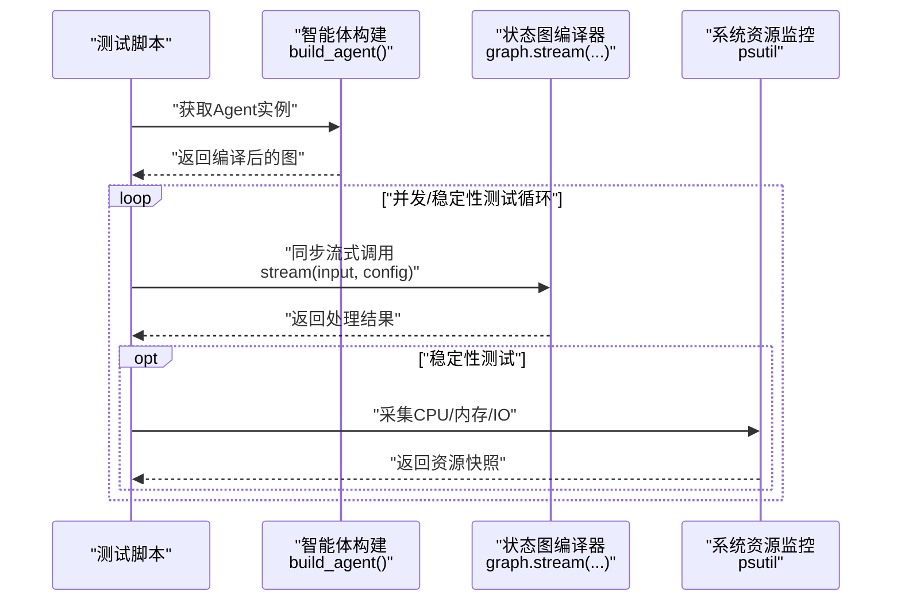
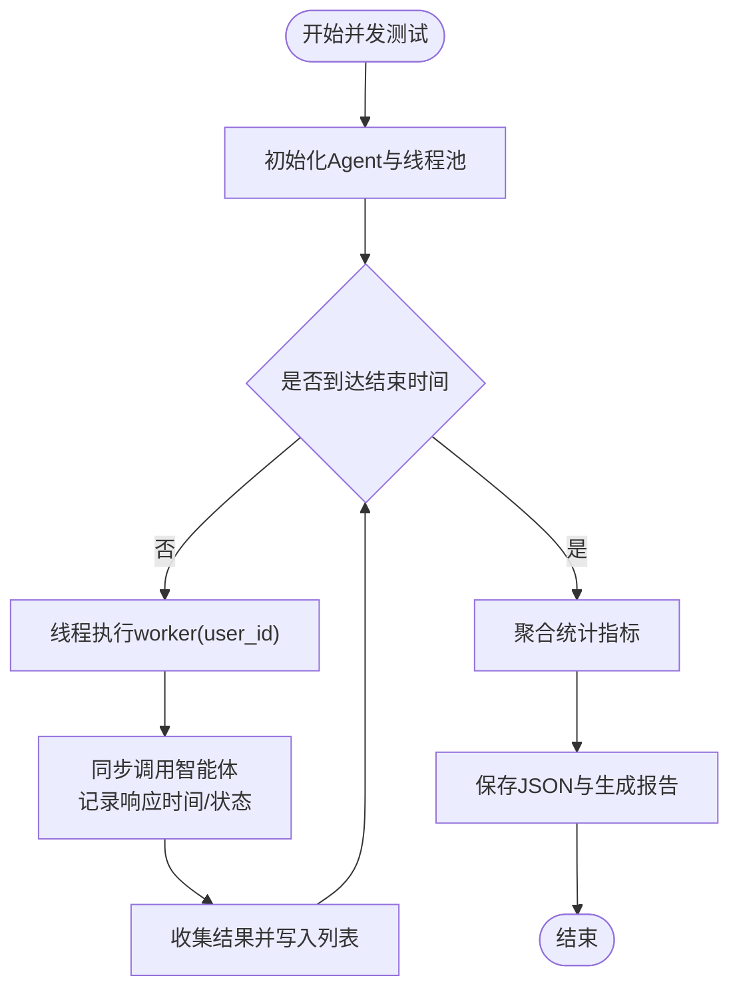
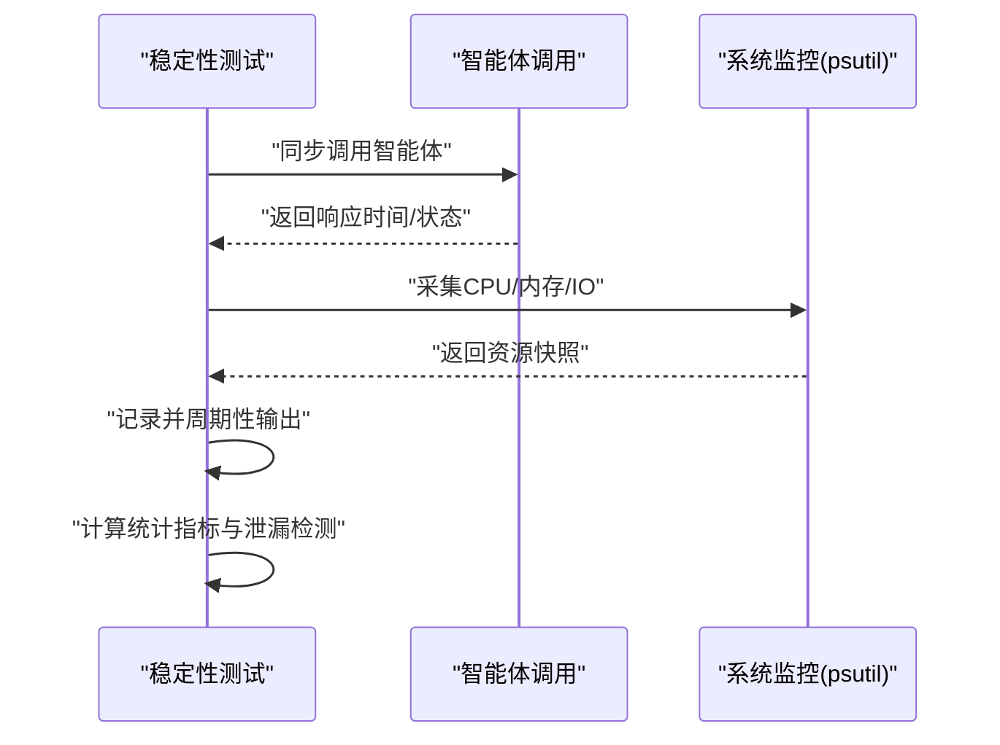
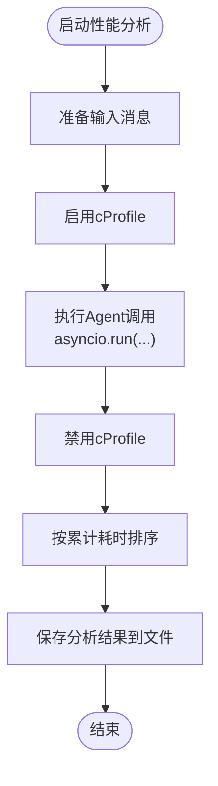
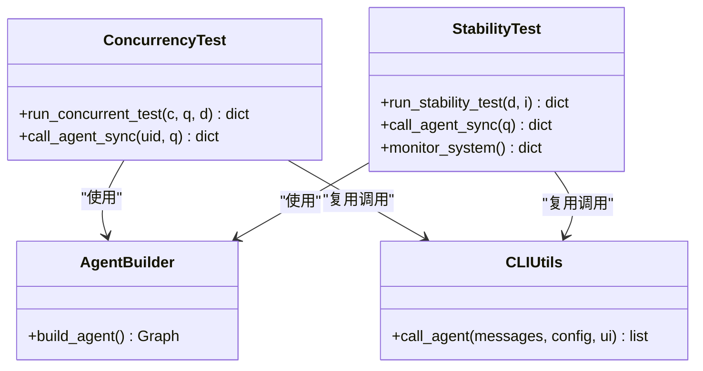
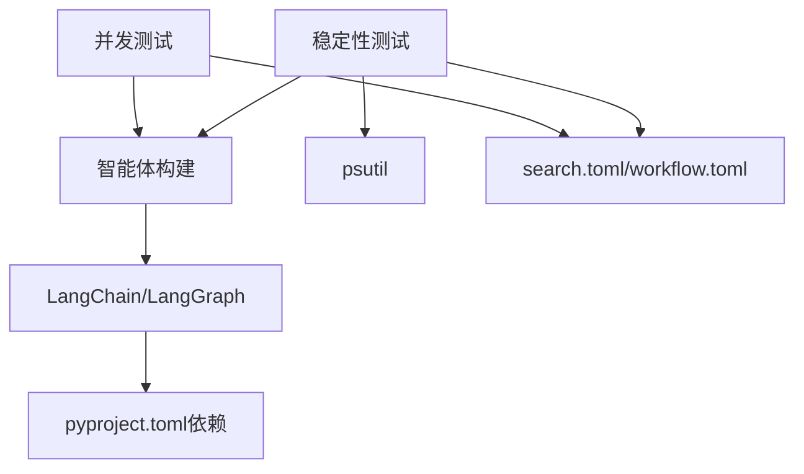

# 性能测试

<cite>
**本文引用的文件**
- [concurrency_test.py](file://tests/performance/concurrency_test.py)
- [stability_test.py](file://tests/performance/stability_test.py)
- [performance_analysis.py](file://tests/performance_analysis.py)
- [agent.py](file://src/deepresearch/agent/agent.py)
- [__init__.py](file://src/deepresearch/__init__.py)
- [utils.py](file://src/deepresearch/cli/utils.py)
- [pyproject.toml](file://pyproject.toml)
- [README.md](file://README.md)
- [search.toml](file://config/search.toml)
- [workflow.toml](file://config/workflow.toml)
</cite>

## 目录
1. [引言](#引言)
2. [项目结构](#项目结构)
3. [核心组件](#核心组件)
4. [架构总览](#架构总览)
5. [详细组件分析](#详细组件分析)
6. [依赖分析](#依赖分析)
7. [性能考量](#性能考量)
8. [故障排查指南](#故障排查指南)
9. [结论](#结论)
10. [附录](#附录)

## 引言
本文件面向DeepResearch系统的性能测试与评估，聚焦并发测试与稳定性测试两大维度，系统化阐述测试策略、实施方法与指标定义。内容涵盖响应时间、吞吐量与资源使用率的测量方式，多线程与同步调用的性能评估要点，以及长时间运行与压力测试的执行流程。同时提供性能分析工具的使用方法与报告解读建议，帮助读者高效定位性能瓶颈并制定优化方案。

## 项目结构
DeepResearch采用模块化设计，核心能力由“智能体编排”“CLI交互”“配置体系”等组成；性能测试位于tests/performance目录，分别覆盖并发与稳定性两类场景，并提供性能分析脚本辅助定位热点。

```mermaid
graph TB
subgraph "测试层"
CT["并发测试<br/>concurrency_test.py"]
ST["稳定性测试<br/>stability_test.py"]
PA["性能分析脚本<br/>performance_analysis.py"]
end
subgraph "应用层"
AG["智能体构建<br/>agent.py"]
INIT["导出入口<br/>__init__.py"]
CLI["CLI工具与调用<br/>cli/utils.py"]
end
subgraph "配置层"
CFG1["搜索配置<br/>config/search.toml"]
CFG2["工作流配置<br/>config/workflow.toml"]
end
subgraph "工程配置"
PP["项目配置<br/>pyproject.toml"]
RD["项目说明<br/>README.md"]
end
CT --> AG
ST --> AG
PA --> CLI
AG --> INIT
CLI --> AG
CT --> CFG1
ST --> CFG1
CT --> CFG2
ST --> CFG2
PP --> AG
PP --> CLI
```

图示来源
- [concurrency_test.py:1-184](file://tests/performance/concurrency_test.py#L1-L184)
- [stability_test.py:1-314](file://tests/performance/stability_test.py#L1-L314)
- [performance_analysis.py:1-49](file://tests/performance_analysis.py#L1-L49)
- [agent.py:1-45](file://src/deepresearch/agent/agent.py#L1-L45)
- [__init__.py:1-30](file://src/deepresearch/__init__.py#L1-L30)
- [utils.py:1-575](file://src/deepresearch/cli/utils.py#L1-L575)
- [pyproject.toml:1-93](file://pyproject.toml#L1-L93)
- [README.md:1-69](file://README.md#L1-L69)
- [search.toml:1-6](file://config/search.toml#L1-L6)
- [workflow.toml:1-3](file://config/workflow.toml#L1-L3)

章节来源
- [pyproject.toml:1-93](file://pyproject.toml#L1-L93)
- [README.md:1-69](file://README.md#L1-L69)

## 核心组件
- 并发测试组件：负责在固定时长内以指定并发度发起同步请求，统计响应时间、成功率与吞吐量，并生成JSON结果与Markdown报告。
- 稳定性测试组件：在长时间运行期间周期性采集系统资源（CPU、内存、磁盘IO、网络IO）与Agent响应时间，检测内存泄漏并汇总统计指标。
- 性能分析脚本：基于cProfile对单次Agent调用进行性能剖析，输出热点函数与累计耗时排序，便于定位瓶颈。
- 智能体与调用链：通过build_agent构建状态图编译器，CLI层提供call_agent异步流式调用接口，供测试脚本复用。

章节来源
- [concurrency_test.py:16-184](file://tests/performance/concurrency_test.py#L16-L184)
- [stability_test.py:16-314](file://tests/performance/stability_test.py#L16-L314)
- [performance_analysis.py:16-49](file://tests/performance_analysis.py#L16-L49)
- [agent.py:19-45](file://src/deepresearch/agent/agent.py#L19-L45)
- [utils.py:106-193](file://src/deepresearch/cli/utils.py#L106-L193)

## 架构总览
下图展示性能测试与被测系统之间的交互关系：测试脚本通过统一的智能体构建入口获取Agent实例，随后以同步方式触发流式处理，期间并发测试使用线程池模拟多用户，稳定性测试周期性采集系统资源并记录Agent结果。

图示来源
- [concurrency_test.py:21-40](file://tests/performance/concurrency_test.py#L21-L40)
- [stability_test.py:22-40](file://tests/performance/stability_test.py#L22-L40)
- [agent.py:19-45](file://src/deepresearch/agent/agent.py#L19-L45)
- [utils.py:160-162](file://src/deepresearch/cli/utils.py#L160-L162)

## 详细组件分析

### 并发测试组件
- 设计原理
  - 以固定时长驱动的并发压测，使用线程池模拟多用户同时访问，避免异步事件循环带来的调度偏差。
  - 在每个请求中记录响应时间与成功/失败状态，聚合统计指标并生成报告。
- 关键指标
  - 响应时间：平均/最大/最小/标准差，衡量服务延迟分布。
  - 吞吐量：单位时间内完成的请求数，反映系统承载能力。
  - 成功率：成功请求占比，体现系统稳定性与错误恢复能力。
- 实现要点
  - 同步调用封装：在worker线程内循环调用智能体，保证测试一致性。
  - 统计聚合：按并发度分组汇总，便于横向对比。
  - 结果持久化：JSON存储原始数据，Markdown生成可读报告。

图示来源
- [concurrency_test.py:42-115](file://tests/performance/concurrency_test.py#L42-L115)

章节来源
- [concurrency_test.py:16-184](file://tests/performance/concurrency_test.py#L16-L184)

### 稳定性测试组件
- 设计原理
  - 长时间运行测试，周期性采集系统资源与Agent响应时间，识别异常波动与潜在内存泄漏。
  - 通过RSS趋势判断是否出现内存泄漏，结合成功率与响应时间评估系统健康度。
- 关键指标
  - 响应时间：平均/最大/最小/标准差，观察随时间的变化趋势。
  - CPU/内存使用率：平均/最大/最小，评估资源占用稳定性。
  - 内存泄漏检测：基于首尾RSS差值阈值判断。
- 实施流程
  - 循环执行智能体调用与系统监控，记录每轮结果。
  - 统计阶段计算各类指标并输出结论摘要。

图示来源
- [stability_test.py:62-222](file://tests/performance/stability_test.py#L62-L222)

章节来源
- [stability_test.py:16-314](file://tests/performance/stability_test.py#L16-L314)

### 性能分析脚本
- 设计原理
  - 使用cProfile对单次Agent调用进行性能剖析，输出累计耗时排序，定位热点函数与调用链。
- 使用方法
  - 准备输入消息，启用Profiler后执行异步调用，最后将统计结果写入文本文件。
- 报告解读
  - 关注累计耗时（cumulative）排名靠前的函数，结合调用栈定位瓶颈模块（如LLM调用、工具检索、序列化等）。

图示来源
- [performance_analysis.py:16-49](file://tests/performance_analysis.py#L16-L49)

章节来源
- [performance_analysis.py:16-49](file://tests/performance_analysis.py#L16-L49)

### 智能体与调用链
- 智能体构建
  - 通过build_agent构建状态图并编译，形成可流式执行的图编译器。
- CLI调用
  - call_agent提供异步流式调用，支持深度控制与HTML保存开关，供测试脚本复用。

图示来源
- [agent.py:19-45](file://src/deepresearch/agent/agent.py#L19-L45)
- [utils.py:106-193](file://src/deepresearch/cli/utils.py#L106-L193)
- [concurrency_test.py:17-40](file://tests/performance/concurrency_test.py#L17-L40)
- [stability_test.py:22-40](file://tests/performance/stability_test.py#L22-L40)

章节来源
- [agent.py:19-45](file://src/deepresearch/agent/agent.py#L19-L45)
- [utils.py:106-193](file://src/deepresearch/cli/utils.py#L106-L193)

## 依赖分析
- 测试脚本依赖
  - 并发测试与稳定性测试均依赖智能体构建入口与LangChain消息类型，稳定性测试额外依赖psutil进行系统监控。
- 工程与外部依赖
  - 项目通过pyproject.toml声明LangGraph、LangChain等核心依赖，直接影响智能体编译与流式处理性能。
- 配置影响
  - 搜索引擎与超时配置来自search.toml，工作流topN来自workflow.toml，这些参数会影响检索与后续处理的耗时与稳定性。

图示来源
- [concurrency_test.py:13](file://tests/performance/concurrency_test.py#L13)
- [stability_test.py:13](file://tests/performance/stability_test.py#L13)
- [pyproject.toml:12-26](file://pyproject.toml#L12-L26)
- [search.toml:1-6](file://config/search.toml#L1-L6)
- [workflow.toml:1-3](file://config/workflow.toml#L1-L3)

章节来源
- [pyproject.toml:12-26](file://pyproject.toml#L12-L26)
- [search.toml:1-6](file://config/search.toml#L1-L6)
- [workflow.toml:1-3](file://config/workflow.toml#L1-L3)

## 性能考量
- 响应时间
  - 并发测试通过同步调用记录每次请求的响应时间，稳定性测试在长期内观察其分布变化，二者结合可识别抖动与退化趋势。
- 吞吐量
  - 并发测试以总请求数除以测试时长得到吞吐量，用于评估系统在不同并发度下的承载能力。
- 资源使用率
  - 稳定性测试采集CPU与内存使用率及RSS，结合内存泄漏检测阈值，评估系统在长时间运行中的资源消耗与稳定性。
- 并发与异步
  - 测试采用ThreadPoolExecutor模拟并发，避免异步事件循环对测试结果的影响；CLI层提供异步流式调用，便于在真实场景中评估异步处理性能。
- 配置与外部依赖
  - 搜索引擎与超时参数、模型调用链路、工具调用等均可能成为性能瓶颈，需结合性能分析报告与稳定性测试结果综合评估。

## 故障排查指南
- 并发测试常见问题
  - 线程池阻塞：检查智能体内部是否有阻塞性调用或锁竞争；适当降低并发度或拆分任务。
  - 响应时间异常：关注网络/外部API超时与重试策略，必要时调整超时参数。
- 稳定性测试常见问题
  - 内存泄漏：若RSS持续上升且超过阈值，检查对象释放与缓存清理逻辑；关注长生命周期对象的持有。
  - 资源峰值：CPU/IO峰值通常与外部服务调用相关，建议限流或引入队列缓冲。
- 性能分析报告解读
  - 关注累计耗时最高的函数及其调用栈，优先优化热点路径；结合并发与稳定性测试结果，确认优化效果。

章节来源
- [stability_test.py:163-168](file://tests/performance/stability_test.py#L163-L168)
- [performance_analysis.py:35-44](file://tests/performance_analysis.py#L35-L44)

## 结论
通过并发测试与稳定性测试的协同，可全面评估DeepResearch在不同负载与时间尺度下的性能表现。配合cProfile性能分析，能够快速定位瓶颈模块并指导优化。建议在持续集成中定期运行这两类测试，并将结果纳入版本发布质量门禁，以保障系统在生产环境中的稳定与高效。

## 附录
- 测试执行建议
  - 并发测试：从低并发逐步提升，观察吞吐量与响应时间拐点；记录不同并发度下的成功率与资源使用情况。
  - 稳定性测试：建议至少运行数小时以上，间隔1~5分钟采集一次，以便捕捉间歇性问题。
- 报告解读模板
  - 并发报告：按并发度分段列出平均/最大/最小响应时间、吞吐量与成功率，标注异常点与改进建议。
  - 稳定性报告：列出资源使用趋势、内存泄漏检测结论与异常时段说明，给出容量规划与优化方向。