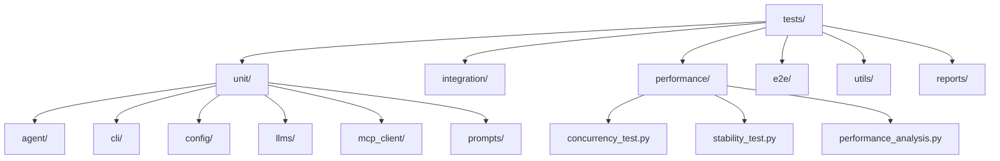
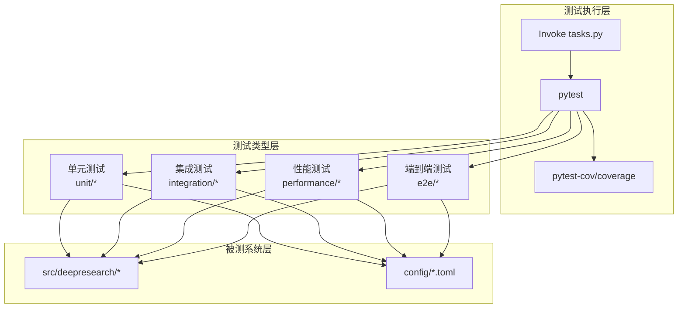
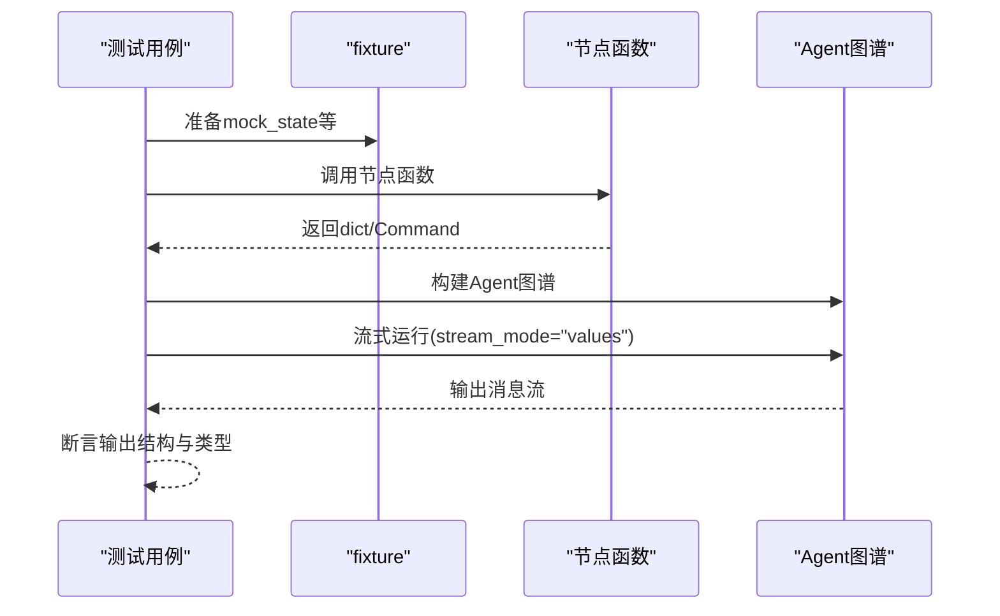
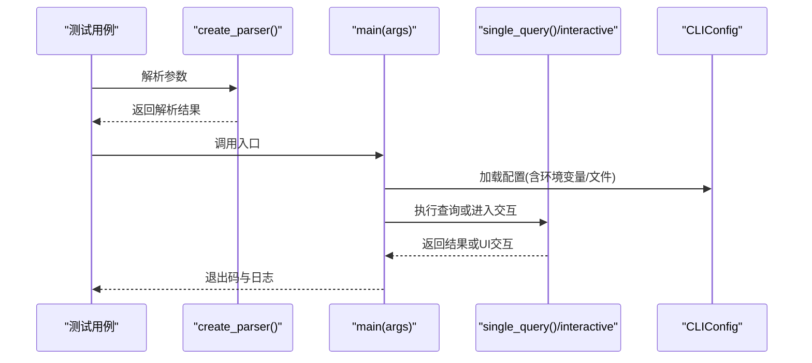
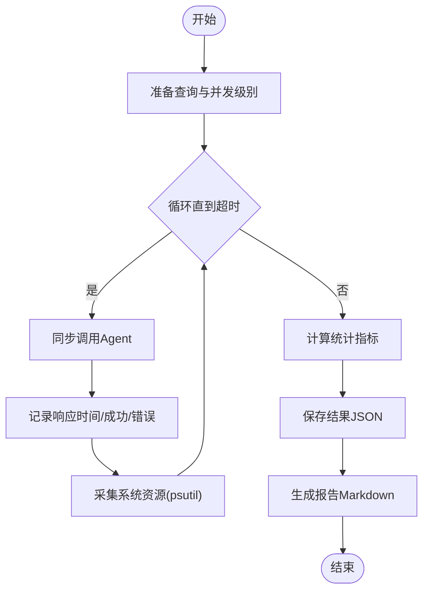
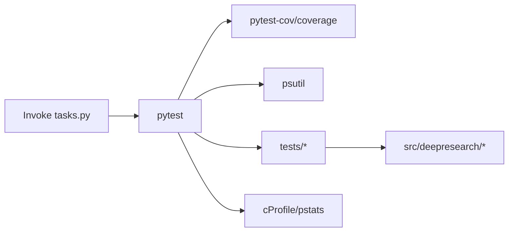

# 测试指南与最佳实践

<cite>
**本文引用的文件**
- [README.md](file://README.md)
- [CONTRIBUTING.md](file://CONTRIBUTING.md)
- [pyproject.toml](file://pyproject.toml)
- [tasks.py](file://tasks.py)
- [tests/utils/testing_guidelines.md](file://tests/utils/testing_guidelines.md)
- [tests/unit/agent/test_agent.py](file://tests/unit/agent/test_agent.py)
- [tests/integration/test_integration.py](file://tests/integration/test_integration.py)
- [tests/e2e/test_e2e.py](file://tests/e2e/test_e2e.py)
- [tests/performance/concurrency_test.py](file://tests/performance/concurrency_test.py)
- [tests/performance/stability_test.py](file://tests/performance/stability_test.py)
- [tests/performance_analysis.py](file://tests/performance_analysis.py)
- [tests/unit/cli/test_main.py](file://tests/unit/cli/test_main.py)
- [tests/unit/config/test_base.py](file://tests/unit/config/test_base.py)
- [config/workflow.toml](file://config/workflow.toml)
- [config/search.toml](file://config/search.toml)
- [config/llms.toml](file://config/llms.toml)
</cite>

## 目录
1. 引言
2. 项目结构
3. 核心组件
4. 架构总览
5. 详细组件分析
6. 依赖关系分析
7. 性能考量
8. 故障排查指南
9. 结论
10. 附录

## 引言
本测试指南面向DeepResearch项目，提供权威的测试规范与最佳实践，涵盖目录结构、命名规范、测试类型定义；测试框架选择与配置（pytest及相关工具）；测试用例设计原则（独立性、可重复性、覆盖率）；测试执行与CI/CD集成策略；测试报告生成与分析；以及测试维护与模板工具使用方法。目标是帮助开发者建立稳定、可维护、可扩展的测试体系。

## 项目结构
测试相关目录与文件组织遵循“按类型分层”的结构，便于定位与维护：
- tests/
  - unit/：单元测试，按模块细分（如agent、cli、config、llms、mcp_client、prompts）
  - integration/：集成测试（如CLI集成、通用集成）
  - performance/：性能测试（并发、稳定性、性能分析）
  - e2e/：端到端测试（完整工作流）
  - utils/：测试规范与辅助工具
  - reports/：测试报告归档（按版本）

图表来源
- [tests/unit/agent/test_agent.py:1-184](file://tests/unit/agent/test_agent.py#L1-L184)
- [tests/integration/test_integration.py:1-54](file://tests/integration/test_integration.py#L1-L54)
- [tests/e2e/test_e2e.py:1-59](file://tests/e2e/test_e2e.py#L1-L59)
- [tests/performance/concurrency_test.py:1-184](file://tests/performance/concurrency_test.py#L1-L184)
- [tests/performance/stability_test.py:1-314](file://tests/performance/stability_test.py#L1-L314)
- [tests/performance_analysis.py:1-49](file://tests/performance_analysis.py#L1-L49)

章节来源
- [tests/utils/testing_guidelines.md:1-201](file://tests/utils/testing_guidelines.md#L1-L201)
- [pyproject.toml:68-71](file://pyproject.toml#L68-L71)

## 核心组件
- 测试框架与工具
  - pytest：统一测试执行与断言
  - pytest-cov/coverage：覆盖率统计
  - mock：对外部依赖进行模拟
  - psutil：系统资源监控（性能测试）
  - cProfile/pstats：性能分析
- 测试类型与职责
  - 单元测试：隔离模块功能，覆盖正常/异常路径
  - 集成测试：模块间交互，可使用模拟外部服务
  - 性能测试：并发、稳定性、响应时间、资源使用
  - 端到端测试：完整用户场景与工作流
- 测试配置
  - pytest.ini选项：testpaths、pythonpath
  - 可选依赖：test组包含pytest、pytest-cov、coverage

章节来源
- [tests/utils/testing_guidelines.md:65-100](file://tests/utils/testing_guidelines.md#L65-L100)
- [pyproject.toml:48-52](file://pyproject.toml#L48-L52)
- [pyproject.toml:68-71](file://pyproject.toml#L68-L71)

## 架构总览
测试架构围绕“分层测试”展开，从单元到端到端逐层验证，配合性能与稳定性测试保障系统质量。

图表来源
- [pyproject.toml:48-52](file://pyproject.toml#L48-L52)
- [pyproject.toml:68-71](file://pyproject.toml#L68-L71)
- [tasks.py:20-35](file://tasks.py#L20-L35)

## 详细组件分析

### 单元测试：Agent与工作流节点
- 覆盖范围
  - 构建Agent图谱、流式运行
  - 分类、澄清、改写、大纲搜索、知识转字符串等节点
  - 使用fixture构造状态，断言返回结构与类型
- 设计要点
  - 使用pytest.fixture准备测试上下文
  - 断言返回值结构与类型，必要时跳过依赖外部LLM的分支
  - 关注Command/goto与update字段的合法性

图表来源
- [tests/unit/agent/test_agent.py:17-81](file://tests/unit/agent/test_agent.py#L17-L81)
- [tests/unit/agent/test_agent.py:83-184](file://tests/unit/agent/test_agent.py#L83-L184)

章节来源
- [tests/unit/agent/test_agent.py:1-184](file://tests/unit/agent/test_agent.py#L1-L184)

### 集成测试：CLI与配置
- 覆盖范围
  - CLI参数解析、校验、异常处理
  - 单次查询与交互模式调用
  - 配置目录校验、环境变量优先级
- 设计要点
  - 使用unittest.TestCase与pytest混合风格
  - 通过patch模拟外部调用，隔离网络依赖
  - 验证参数组合与帮助输出

图表来源
- [tests/unit/cli/test_main.py:13-22](file://tests/unit/cli/test_main.py#L13-L22)
- [tests/unit/cli/test_main.py:145-188](file://tests/unit/cli/test_main.py#L145-L188)

章节来源
- [tests/unit/cli/test_main.py:1-378](file://tests/unit/cli/test_main.py#L1-L378)

### 集成测试：Prompt与LLM模板
- 覆盖范围
  - Prompt模板应用与消息列表生成
  - LLM调用集成（需有效API密钥时可跳过）
- 设计要点
  - 使用skipif标注外部依赖条件
  - 断言消息列表非空且类型正确

章节来源
- [tests/integration/test_integration.py:1-54](file://tests/integration/test_integration.py#L1-L54)

### 端到端测试：完整工作流
- 覆盖范围
  - 构建Agent并运行完整工作流
  - 限制步数避免超时，捕获异常但仍验证启动流程
- 设计要点
  - 断言输出非空，容忍外部API调用失败

章节来源
- [tests/e2e/test_e2e.py:1-59](file://tests/e2e/test_e2e.py#L1-L59)

### 性能测试：并发与稳定性
- 并发测试
  - 多线程模拟并发用户，统计成功率、响应时间、吞吐量
  - 生成JSON结果与Markdown报告
- 稳定性测试
  - 长时间运行监控CPU/内存/Disk/Network
  - 检测内存泄漏趋势，生成报告

图表来源
- [tests/performance/concurrency_test.py:42-116](file://tests/performance/concurrency_test.py#L42-L116)
- [tests/performance/stability_test.py:62-222](file://tests/performance/stability_test.py#L62-L222)

章节来源
- [tests/performance/concurrency_test.py:1-184](file://tests/performance/concurrency_test.py#L1-L184)
- [tests/performance/stability_test.py:1-314](file://tests/performance/stability_test.py#L1-L314)

### 性能分析：热点定位
- 使用cProfile收集性能数据，排序输出，保存至文本文件
- 适用于定位慢调用与热点函数

章节来源
- [tests/performance_analysis.py:1-49](file://tests/performance_analysis.py#L1-L49)

### 配置与测试数据
- 配置文件
  - workflow.toml：搜索topN等工作流参数
  - search.toml：搜索引擎与密钥
  - llms.toml：各角色LLM的API配置
- 测试数据
  - 使用真实测试数据与生成器，避免硬编码
  - 配置加载顺序：环境变量 > 配置文件 > 默认值

章节来源
- [config/workflow.toml:1-3](file://config/workflow.toml#L1-L3)
- [config/search.toml:1-6](file://config/search.toml#L1-L6)
- [config/llms.toml:1-29](file://config/llms.toml#L1-L29)
- [tests/unit/config/test_base.py:385-441](file://tests/unit/config/test_base.py#L385-L441)

## 依赖关系分析
- 测试框架与工具
  - pytest负责执行与断言
  - pytest-cov/coverage生成覆盖率报告
  - psutil用于性能测试中的系统监控
  - cProfile用于性能分析
- 项目依赖与测试依赖
  - 测试依赖在pyproject.toml的test组中声明
  - pytest配置位于tool.pytest.ini_options

图表来源
- [pyproject.toml:48-52](file://pyproject.toml#L48-L52)
- [pyproject.toml:68-71](file://pyproject.toml#L68-L71)
- [tasks.py:20-35](file://tasks.py#L20-L35)

章节来源
- [pyproject.toml:48-52](file://pyproject.toml#L48-L52)
- [pyproject.toml:68-71](file://pyproject.toml#L68-L71)
- [tasks.py:20-35](file://tasks.py#L20-L35)

## 性能考量
- 响应时间与吞吐量
  - 通过并发测试统计平均/最大/最小响应时间与吞吐量
- 资源使用
  - CPU使用率、内存RSS/VMS、磁盘与网络IO
- 稳定性
  - 长时间运行检测内存泄漏趋势
- 分析手段
  - cProfile定位热点，结合日志与报告进行优化

章节来源
- [tests/performance/concurrency_test.py:65-115](file://tests/performance/concurrency_test.py#L65-L115)
- [tests/performance/stability_test.py:136-222](file://tests/performance/stability_test.py#L136-L222)
- [tests/performance_analysis.py:16-44](file://tests/performance_analysis.py#L16-L44)

## 故障排查指南
- 常见问题
  - API密钥无效导致LLM调用失败：使用skipif跳过或配置有效密钥
  - 外部服务不可用：通过mock或fixture隔离
  - 覆盖率不足：补充单元测试与边界条件
- 排查步骤
  - 本地运行pytest，查看失败用例与断言信息
  - 生成覆盖率报告，定位未覆盖路径
  - 使用性能分析脚本定位热点
  - 检查配置加载顺序与环境变量

章节来源
- [tests/integration/test_integration.py:31-50](file://tests/integration/test_integration.py#L31-L50)
- [tests/utils/testing_guidelines.md:121-130](file://tests/utils/testing_guidelines.md#L121-L130)
- [tests/performance_analysis.py:16-44](file://tests/performance_analysis.py#L16-L44)

## 结论
本指南建立了DeepResearch项目的测试规范与最佳实践，明确了测试类型、目录与命名规范、框架与工具、执行与报告、维护与模板。建议在CI/CD中集成pytest与覆盖率检查，并将性能与稳定性测试纳入常规流水线，持续提升系统质量与可维护性。

## 附录

### 测试规范标准
- 目录结构与命名
  - 单元测试：test_模块名.py
  - 集成测试：test_功能名.py
  - 性能测试：test_performance.py
  - 端到端测试：test_场景名.py
- 测试类型
  - 单元测试：隔离、覆盖主要功能与边界
  - 集成测试：模块交互、可模拟外部服务
  - 性能测试：响应时间、资源使用、不同负载
  - 端到端测试：完整用户场景与流程
- 测试框架与工具
  - pytest、pytest-cov、mock
- 用例设计原则
  - 独立性、可重复性、覆盖正常/异常
- 执行与CI/CD
  - 本地：pytest tests/；CI：自动执行、失败阻塞、生成报告
- 报告与维护
  - 报告内容：摘要、覆盖率、性能、失败详情；格式：Markdown
  - 维护：随代码变更更新测试、定期运行、及时修复失败用例
- 模板与工具
  - 单元/集成/性能模板与测试辅助工具

章节来源
- [tests/utils/testing_guidelines.md:3-201](file://tests/utils/testing_guidelines.md#L3-L201)

### 测试执行与CI/CD集成
- 本地执行
  - 运行全部测试：pytest
  - 运行指定目录/文件：pytest tests/unit/test_agent.py
  - 生成覆盖率：pytest --cov=src
- CI/CD建议
  - 自动触发：PR/Push触发测试与覆盖率检查
  - 失败阻塞：测试或覆盖率不达标禁止合并
  - 报告归档：上传测试报告与覆盖率报告

章节来源
- [tests/utils/testing_guidelines.md:89-100](file://tests/utils/testing_guidelines.md#L89-L100)
- [pyproject.toml:68-71](file://pyproject.toml#L68-L71)

### 测试模板与辅助工具
- 单元测试模板
  - fixture准备上下文，断言返回结构与类型
- 集成测试模板
  - 使用fixture与patch模拟外部依赖
- 性能测试模板
  - 多线程并发与系统资源监控
- 辅助工具
  - Invoke任务：test、all、clean、venv、activate
  - 测试规范文档：testing_guidelines.md

章节来源
- [tests/utils/testing_guidelines.md:139-195](file://tests/utils/testing_guidelines.md#L139-L195)
- [tasks.py:20-35](file://tasks.py#L20-L35)
- [tasks.py:133-149](file://tasks.py#L133-L149)