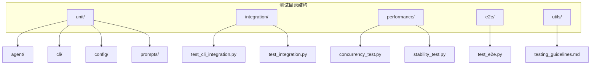
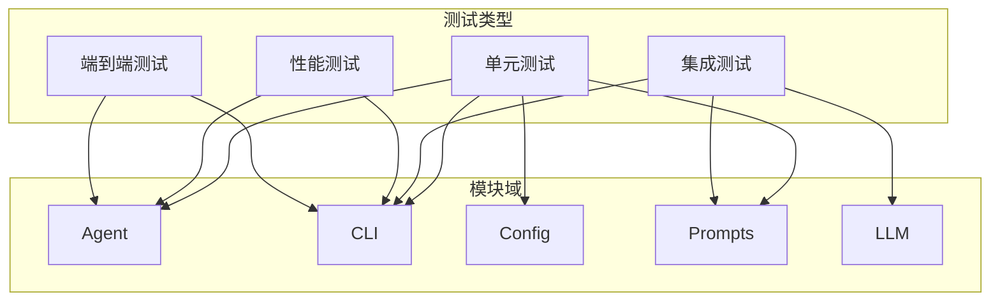
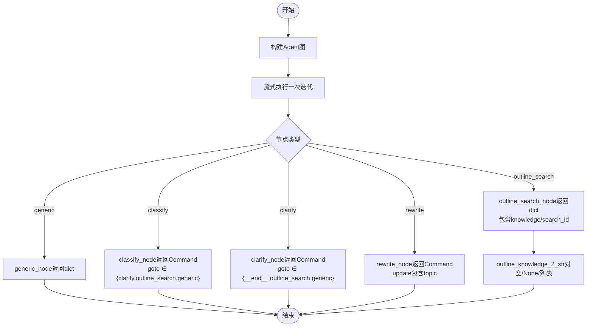
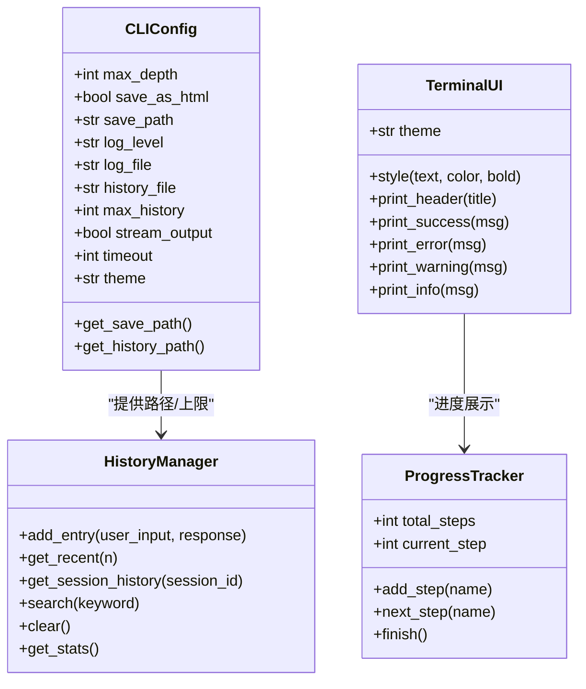
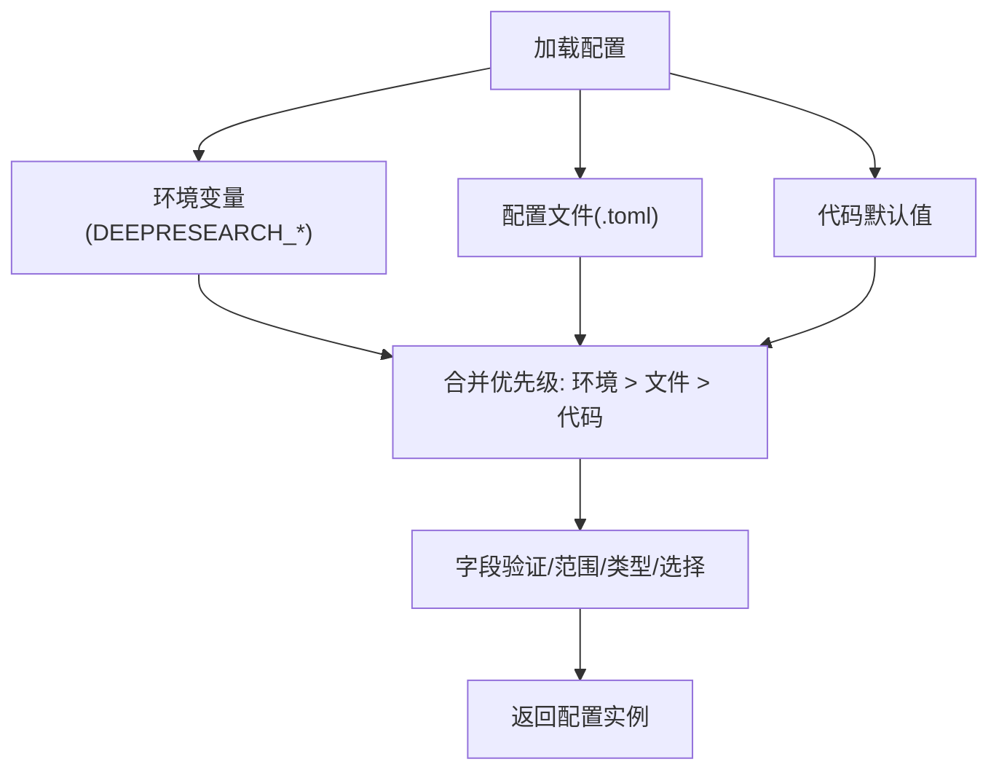
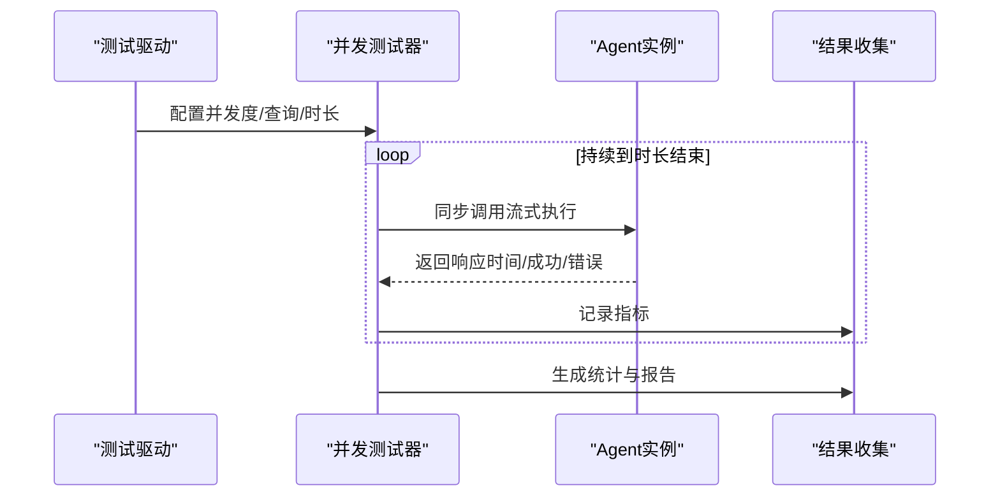
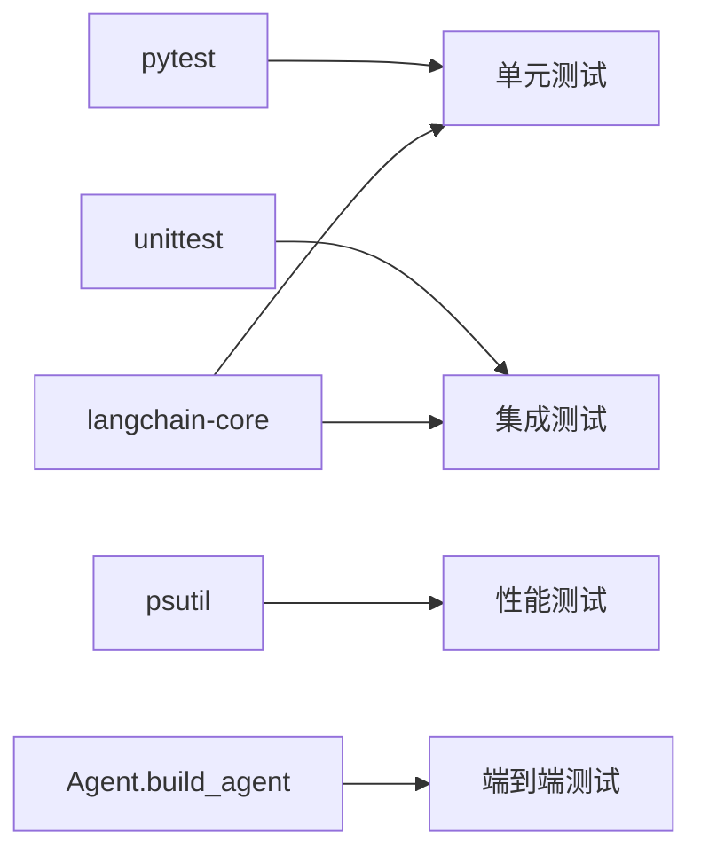

# 测试策略与质量保证

<cite>
**本文引用的文件**
- [tests/unit/agent/test_agent.py](file://tests/unit/agent/test_agent.py)
- [tests/integration/test_integration.py](file://tests/integration/test_integration.py)
- [tests/e2e/test_e2e.py](file://tests/e2e/test_e2e.py)
- [tests/performance/concurrency_test.py](file://tests/performance/concurrency_test.py)
- [tests/performance/stability_test.py](file://tests/performance/stability_test.py)
- [tests/utils/testing_guidelines.md](file://tests/utils/testing_guidelines.md)
- [tests/integration/test_cli_integration.py](file://tests/integration/test_cli_integration.py)
- [tests/unit/cli/test_main.py](file://tests/unit/cli/test_main.py)
- [tests/unit/cli/test_config.py](file://tests/unit/cli/test_config.py)
- [tests/unit/cli/test_history.py](file://tests/unit/cli/test_history.py)
- [tests/unit/cli/test_exceptions.py](file://tests/unit/cli/test_exceptions.py)
- [tests/unit/cli/test_ui.py](file://tests/unit/cli/test_ui.py)
- [tests/unit/config/test_base.py](file://tests/unit/config/test_base.py)
- [tests/unit/prompts/test_template.py](file://tests/unit/prompts/test_template.py)
</cite>

## 目录
1. [引言](#引言)
2. [项目结构](#项目结构)
3. [核心组件](#核心组件)
4. [架构总览](#架构总览)
5. [详细组件分析](#详细组件分析)
6. [依赖分析](#依赖分析)
7. [性能考虑](#性能考虑)
8. [故障排查指南](#故障排查指南)
9. [结论](#结论)
10. [附录](#附录)

## 引言
本文件面向DeepResearch项目的测试策略与质量保证，系统化梳理单元测试、集成测试、性能测试与端到端测试的结构与实施方法，并给出测试指南、最佳实践与覆盖率要求。文档同时涵盖测试环境搭建、测试数据准备与持续集成配置建议，帮助开发者与测试工程师高效落地质量保障体系。

## 项目结构
测试目录采用按“测试类型+模块”分层组织，便于定位与维护：
- tests/unit：单元测试，按模块细分（agent、cli、config、prompts等）
- tests/integration：集成测试，覆盖CLI与核心模块交互、提示模板与LLM集成等
- tests/performance：性能测试，包含并发测试与稳定性测试
- tests/e2e：端到端测试，覆盖完整工作流
- tests/utils：测试规范与辅助工具

**图表来源**
- [tests/unit/agent/test_agent.py:1-184](file://tests/unit/agent/test_agent.py#L1-L184)
- [tests/integration/test_integration.py:1-54](file://tests/integration/test_integration.py#L1-L54)
- [tests/e2e/test_e2e.py:1-59](file://tests/e2e/test_e2e.py#L1-L59)
- [tests/performance/concurrency_test.py:1-184](file://tests/performance/concurrency_test.py#L1-L184)
- [tests/performance/stability_test.py:1-314](file://tests/performance/stability_test.py#L1-L314)
- [tests/utils/testing_guidelines.md:1-201](file://tests/utils/testing_guidelines.md#L1-L201)

**章节来源**
- [tests/utils/testing_guidelines.md:1-201](file://tests/utils/testing_guidelines.md#L1-L201)

## 核心组件
- 单元测试：覆盖Agent节点逻辑、CLI解析与配置、历史管理、UI主题与进度跟踪、配置基类与验证器、提示模板加载与应用等
- 集成测试：验证提示模板与LLM调用链路、CLI配置与历史持久化的端到端集成
- 性能测试：并发压力测试与长期稳定性测试，采集响应时间、吞吐量与系统资源指标
- 端到端测试：从构建Agent到流式输出的完整工作流验证

**章节来源**
- [tests/unit/agent/test_agent.py:1-184](file://tests/unit/agent/test_agent.py#L1-L184)
- [tests/integration/test_integration.py:1-54](file://tests/integration/test_integration.py#L1-L54)
- [tests/e2e/test_e2e.py:1-59](file://tests/e2e/test_e2e.py#L1-L59)
- [tests/performance/concurrency_test.py:1-184](file://tests/performance/concurrency_test.py#L1-L184)
- [tests/performance/stability_test.py:1-314](file://tests/performance/stability_test.py#L1-L314)

## 架构总览
测试架构围绕“测试类型—模块—用例”的三层映射，确保：
- 单元测试隔离性强，依赖通过fixture或mock注入
- 集成测试关注跨模块交互与外部依赖（如LLM）的模拟
- 性能测试独立脚本，具备并发与稳定性两类场景
- 端到端测试覆盖真实用户场景，容忍外部服务不可用时的降级验证

**图表来源**
- [tests/unit/agent/test_agent.py:1-184](file://tests/unit/agent/test_agent.py#L1-L184)
- [tests/integration/test_integration.py:1-54](file://tests/integration/test_integration.py#L1-L54)
- [tests/integration/test_cli_integration.py:1-229](file://tests/integration/test_cli_integration.py#L1-L229)
- [tests/performance/concurrency_test.py:1-184](file://tests/performance/concurrency_test.py#L1-L184)
- [tests/performance/stability_test.py:1-314](file://tests/performance/stability_test.py#L1-L314)
- [tests/e2e/test_e2e.py:1-59](file://tests/e2e/test_e2e.py#L1-L59)

## 详细组件分析

### 单元测试：Agent模块
- 覆盖build_agent、流式执行、各类节点（generic/classify/clarify/rewrite/outline_*）的返回结构与状态更新
- 使用fixture构造多类状态，验证分支跳转与命令对象的goto/update字段
- outline_knowledge_2_str对空/None与列表输入进行边界测试

**图表来源**
- [tests/unit/agent/test_agent.py:83-184](file://tests/unit/agent/test_agent.py#L83-L184)

**章节来源**
- [tests/unit/agent/test_agent.py:1-184](file://tests/unit/agent/test_agent.py#L1-L184)

### 单元测试：CLI模块
- 解析器与参数组合：校验默认值、短/长选项、非法日志级别、版本标志等
- 单次查询与交互模式：通过mock控制外部调用，验证main入口行为与异常处理
- 配置管理：CLIConfig默认值、范围校验、环境变量覆盖、路径展开与不可变性
- 历史管理：条目增删、最大条目限制、会话隔离、搜索、统计、持久化与Unicode支持
- 异常体系：统一继承关系与退出码
- UI与主题：颜色支持检测、主题渲染、进度跟踪

**图表来源**
- [tests/unit/cli/test_config.py:1-175](file://tests/unit/cli/test_config.py#L1-L175)
- [tests/unit/cli/test_history.py:1-333](file://tests/unit/cli/test_history.py#L1-L333)
- [tests/unit/cli/test_ui.py:1-320](file://tests/unit/cli/test_ui.py#L1-L320)
- [tests/unit/cli/test_main.py:1-378](file://tests/unit/cli/test_main.py#L1-L378)
- [tests/unit/cli/test_exceptions.py:1-169](file://tests/unit/cli/test_exceptions.py#L1-L169)

**章节来源**
- [tests/unit/cli/test_main.py:1-378](file://tests/unit/cli/test_main.py#L1-L378)
- [tests/unit/cli/test_config.py:1-175](file://tests/unit/cli/test_config.py#L1-L175)
- [tests/unit/cli/test_history.py:1-333](file://tests/unit/cli/test_history.py#L1-L333)
- [tests/unit/cli/test_exceptions.py:1-169](file://tests/unit/cli/test_exceptions.py#L1-L169)
- [tests/unit/cli/test_ui.py:1-320](file://tests/unit/cli/test_ui.py#L1-L320)

### 单元测试：配置基类与验证器
- 验证器：RangeValidator、ChoiceValidator、TypeValidator，覆盖边界与类型错误
- BaseConfig：from_dict/to_dict/merge/get/set、脱敏输出、手动验证
- 环境变量与文件加载：from_env/from_file、优先级与错误处理
- 配置管理器：set_config_dir/get_config_dir、register/load/reload/clear、缓存机制
- 向后兼容：get_config_dir、load_toml_config、redact_config、敏感键管理

**图表来源**
- [tests/unit/config/test_base.py:1-546](file://tests/unit/config/test_base.py#L1-L546)

**章节来源**
- [tests/unit/config/test_base.py:1-546](file://tests/unit/config/test_base.py#L1-L546)

### 单元测试：提示模板
- 加载与懒加载：确保模板字典非空
- 应用模板：针对classify/clarify/planner等场景构造消息列表，验证输出为非空列表

**章节来源**
- [tests/unit/prompts/test_template.py:1-60](file://tests/unit/prompts/test_template.py#L1-L60)

### 集成测试：提示模板与LLM集成
- 验证apply_prompt_template输出消息列表
- 可选的LLM链路集成（需有效API密钥），否则跳过

**章节来源**
- [tests/integration/test_integration.py:1-54](file://tests/integration/test_integration.py#L1-L54)

### 集成测试：CLI配置与历史持久化
- 配置与历史路径：CLIConfig与HistoryManager协同，验证持久化与重启读取
- 主题与UI：create_ui与TerminalUI主题一致性
- 参数解析与覆盖：默认值、命令行覆盖、环境变量优先级
- 异常恢复：历史文件损坏时的容错与重建
- 跨平台与性能：路径处理、Unicode支持、大历史处理与搜索性能

**章节来源**
- [tests/integration/test_cli_integration.py:1-229](file://tests/integration/test_cli_integration.py#L1-L229)

### 端到端测试：完整工作流
- 构建Agent并流式执行，验证输出消息的存在性与非空长度
- 对LLM调用失败进行降级处理，仍确保工作流可启动

**章节来源**
- [tests/e2e/test_e2e.py:1-59](file://tests/e2e/test_e2e.py#L1-L59)

### 性能测试：并发与稳定性
- 并发测试：多线程模拟并发用户，统计成功率、响应时间分布与吞吐量
- 稳定性测试：长时间运行监控CPU/内存/RSS，检测内存泄漏趋势

**图表来源**
- [tests/performance/concurrency_test.py:1-184](file://tests/performance/concurrency_test.py#L1-L184)

**章节来源**
- [tests/performance/concurrency_test.py:1-184](file://tests/performance/concurrency_test.py#L1-L184)
- [tests/performance/stability_test.py:1-314](file://tests/performance/stability_test.py#L1-L314)

## 依赖分析
- 单元测试依赖pytest与langchain-core消息类型；CLI测试广泛使用unittest与pytest，结合pytest-mock进行外部依赖模拟
- 集成测试依赖提示模板与LLM接口，通过条件跳过规避API密钥缺失
- 性能测试依赖psutil进行系统资源监控，ThreadPoolExecutor进行并发调度
- 端到端测试依赖Agent构建与流式执行，容忍外部服务异常

**图表来源**
- [tests/unit/agent/test_agent.py:1-184](file://tests/unit/agent/test_agent.py#L1-L184)
- [tests/integration/test_integration.py:1-54](file://tests/integration/test_integration.py#L1-L54)
- [tests/performance/stability_test.py:1-314](file://tests/performance/stability_test.py#L1-L314)
- [tests/e2e/test_e2e.py:1-59](file://tests/e2e/test_e2e.py#L1-L59)

**章节来源**
- [tests/unit/agent/test_agent.py:1-184](file://tests/unit/agent/test_agent.py#L1-L184)
- [tests/integration/test_integration.py:1-54](file://tests/integration/test_integration.py#L1-L54)
- [tests/performance/stability_test.py:1-314](file://tests/performance/stability_test.py#L1-L314)
- [tests/e2e/test_e2e.py:1-59](file://tests/e2e/test_e2e.py#L1-L59)

## 性能考虑
- 并发测试：通过ThreadPoolExecutor模拟多用户，统计成功率、平均/最大/最小响应时间与吞吐量，识别瓶颈
- 稳定性测试：长时间运行监控CPU/内存/RSS，检测内存泄漏趋势，评估系统在高负载下的鲁棒性
- 资源监控：使用psutil采集进程CPU/内存与IO指标，形成性能报告

[本节为通用指导，无需具体文件引用]

## 故障排查指南
- 单元测试失败：检查fixture构造的状态字段、节点返回结构与命令对象的goto/update字段
- CLI异常：确认参数解析、环境变量覆盖顺序与配置目录权限；历史文件损坏时自动重建
- 提示模板与LLM：确保模板加载成功且消息列表非空；集成测试中API密钥缺失时跳过LLM链路
- 性能异常：查看并发测试报告与稳定性报告，定位响应时间与资源占用峰值

**章节来源**
- [tests/unit/agent/test_agent.py:1-184](file://tests/unit/agent/test_agent.py#L1-L184)
- [tests/integration/test_cli_integration.py:1-229](file://tests/integration/test_cli_integration.py#L1-L229)
- [tests/integration/test_integration.py:1-54](file://tests/integration/test_integration.py#L1-L54)
- [tests/performance/concurrency_test.py:1-184](file://tests/performance/concurrency_test.py#L1-L184)
- [tests/performance/stability_test.py:1-314](file://tests/performance/stability_test.py#L1-L314)

## 结论
本测试策略以“单元—集成—性能—端到端”四层测试体系为核心，结合CLI、Agent、配置与提示模板等关键模块的专项测试，形成覆盖全面的质量保障方案。通过明确的测试规范、覆盖率目标与持续集成配置建议，可有效提升代码质量与系统稳定性。

[本节为总结性内容，无需具体文件引用]

## 附录

### 测试指南与最佳实践
- 目录与命名规范：按模块划分单元测试，集成/性能/E2E分别组织
- 测试框架：pytest为主，配合unittest用于特定集成场景
- 断言与数据：明确断言语义，避免硬编码，使用测试数据生成器
- 覆盖率：目标80%以上，重点覆盖核心功能与关键业务逻辑
- 执行方式：本地运行pytest tests/unit/test_agent.py；CI中自动执行并生成报告

**章节来源**
- [tests/utils/testing_guidelines.md:1-201](file://tests/utils/testing_guidelines.md#L1-L201)

### 测试环境搭建与数据准备
- 环境：安装pytest、pytest-cov、psutil与langchain-core
- 数据：提示模板与配置文件位于项目配置目录；CLI测试使用tmp_path临时文件
- API密钥：集成测试可选，未提供时跳过LLM链路

**章节来源**
- [tests/integration/test_integration.py:1-54](file://tests/integration/test_integration.py#L1-L54)
- [tests/integration/test_cli_integration.py:1-229](file://tests/integration/test_cli_integration.py#L1-L229)

### 持续集成配置建议
- 触发：PR/MR触发全量测试，master分支保护与测试通过才允许合并
- 步骤：安装依赖→运行pytest→生成覆盖率报告→上传测试报告
- 失败策略：测试失败阻断合并，失败详情在CI日志中可追溯

[本节为通用指导，无需具体文件引用]