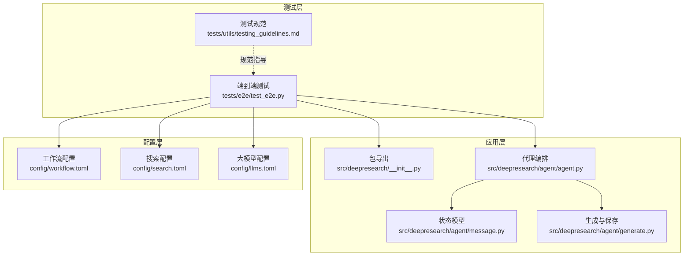
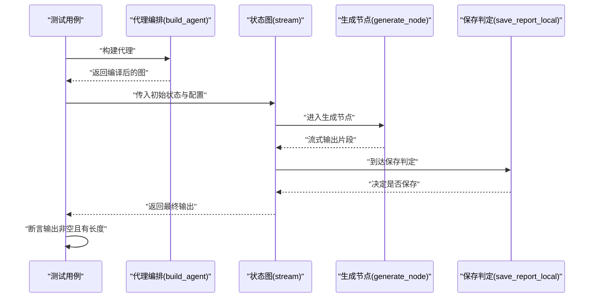
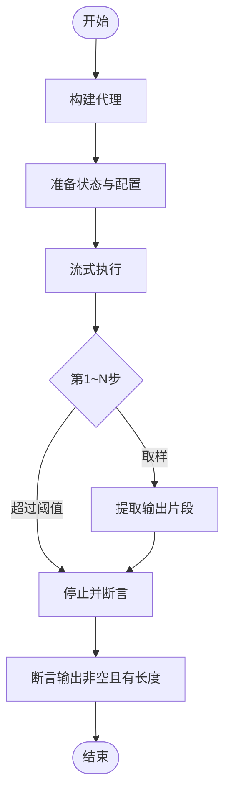
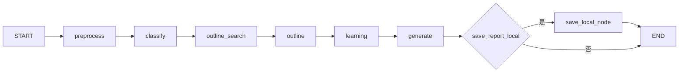
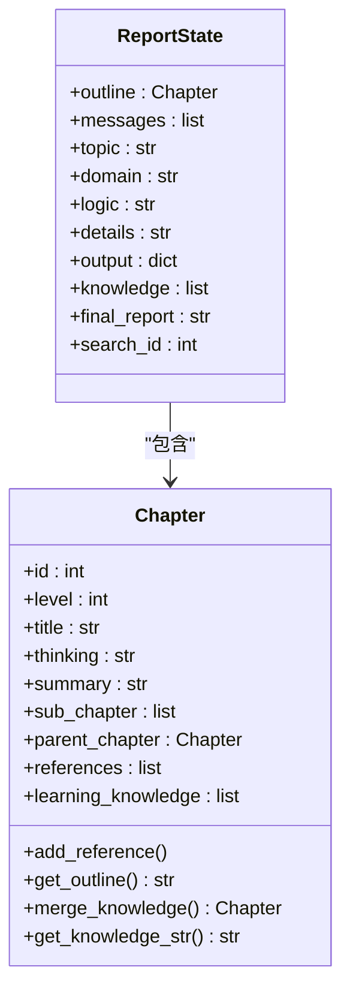
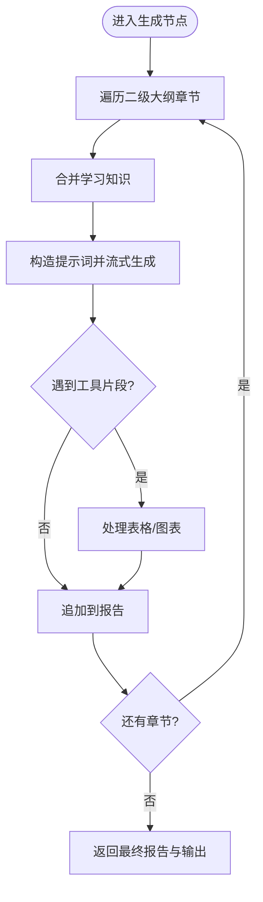
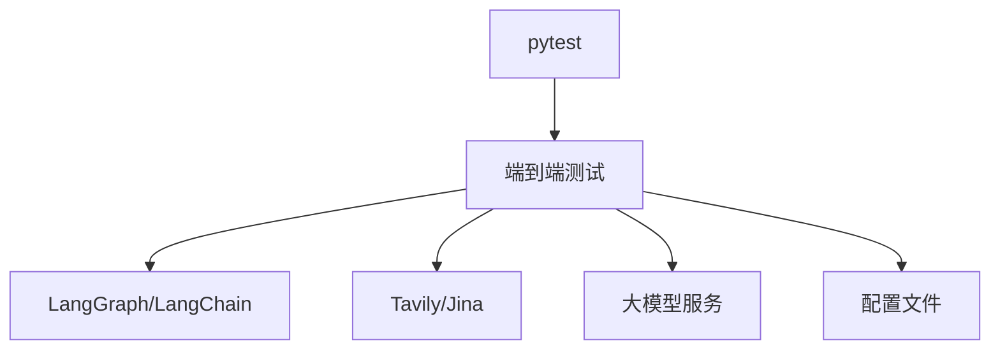

# 端到端测试

<cite>
**本文引用的文件**
- [README.md](file://README.md)
- [pyproject.toml](file://pyproject.toml)
- [tests/utils/testing_guidelines.md](file://tests/utils/testing_guidelines.md)
- [tests/e2e/test_e2e.py](file://tests/e2e/test_e2e.py)
- [src/deepresearch/__init__.py](file://src/deepresearch/__init__.py)
- [src/deepresearch/agent/agent.py](file://src/deepresearch/agent/agent.py)
- [src/deepresearch/agent/message.py](file://src/deepresearch/agent/message.py)
- [src/deepresearch/agent/generate.py](file://src/deepresearch/agent/generate.py)
- [config/workflow.toml](file://config/workflow.toml)
- [config/search.toml](file://config/search.toml)
- [config/llms.toml](file://config/llms.toml)
</cite>

## 目录
1. [引言](#引言)
2. [项目结构](#项目结构)
3. [核心组件](#核心组件)
4. [架构总览](#架构总览)
5. [详细组件分析](#详细组件分析)
6. [依赖分析](#依赖分析)
7. [性能考虑](#性能考虑)
8. [故障排查指南](#故障排查指南)
9. [结论](#结论)
10. [附录](#附录)

## 引言
本文件面向DeepResearch项目的端到端测试，系统化阐述测试设计理念、测试场景与用例设计方法、测试环境与数据准备、执行流程与结果分析，以及失败诊断与问题定位技巧。端到端测试旨在覆盖从用户输入到最终报告产出的完整工作流，验证多智能体协作、检索工具调用、知识抽取与交叉评估、报告生成与落盘等关键环节的协同行为。

## 项目结构
- 测试目录采用分层组织：unit（单元）、integration（集成）、performance（性能）、e2e（端到端）与utils（测试工具），便于按粒度与场景分类执行与维护。
- 端到端测试位于tests/e2e，当前包含一个基础流程测试文件，用于验证从构建代理到流式执行并产出可解析输出的主干通路。
- 核心运行入口与导出能力由src/deepresearch/__init__.py提供，端到端测试直接依赖该入口构建代理实例。
- 端到端测试所依赖的核心状态模型与节点编排由src/deepresearch/agent模块提供，包括消息状态、节点实现与图编译。

图表来源
- [tests/e2e/test_e2e.py:1-59](file://tests/e2e/test_e2e.py#L1-L59)
- [src/deepresearch/__init__.py:1-30](file://src/deepresearch/__init__.py#L1-L30)
- [src/deepresearch/agent/agent.py:1-45](file://src/deepresearch/agent/agent.py#L1-L45)
- [src/deepresearch/agent/message.py:1-112](file://src/deepresearch/agent/message.py#L1-L112)
- [src/deepresearch/agent/generate.py:1-343](file://src/deepresearch/agent/generate.py#L1-L343)
- [config/workflow.toml:1-3](file://config/workflow.toml#L1-L3)
- [config/search.toml:1-6](file://config/search.toml#L1-L6)
- [config/llms.toml:1-29](file://config/llms.toml#L1-L29)

章节来源
- [README.md:1-69](file://README.md#L1-L69)
- [pyproject.toml:1-93](file://pyproject.toml#L1-L93)
- [tests/utils/testing_guidelines.md:1-201](file://tests/utils/testing_guidelines.md#L1-L201)

## 核心组件
- 端到端测试类TestE2E：负责构建代理、准备输入状态与配置、流式执行并验证输出结构与长度。
- 代理编排build_agent：基于状态图定义预处理、改写、分类、澄清、通用处理、大纲检索与生成、学习、生成与保存等节点及条件边。
- 状态模型ReportState：承载主题、领域、逻辑、细节、大纲、消息、知识、最终报告、输出等字段，贯穿各节点。
- 生成与保存节点：负责根据大纲逐章生成内容、处理表格与图表工具片段、合并参考文献、并将报告落盘为Markdown与HTML。

章节来源
- [tests/e2e/test_e2e.py:14-55](file://tests/e2e/test_e2e.py#L14-L55)
- [src/deepresearch/agent/agent.py:19-45](file://src/deepresearch/agent/agent.py#L19-L45)
- [src/deepresearch/agent/message.py:101-112](file://src/deepresearch/agent/message.py#L101-L112)
- [src/deepresearch/agent/generate.py:26-160](file://src/deepresearch/agent/generate.py#L26-L160)

## 架构总览
端到端测试关注“用户输入 → 代理编排 → 节点执行 → 流式输出 → 结果验证”的完整链路。测试通过构建编译后的状态图，注入初始消息与可配置参数，逐步消费流式值，提取最终输出进行断言。

图表来源
- [tests/e2e/test_e2e.py:17-54](file://tests/e2e/test_e2e.py#L17-L54)
- [src/deepresearch/agent/agent.py:19-45](file://src/deepresearch/agent/agent.py#L19-L45)
- [src/deepresearch/agent/generate.py:114-123](file://src/deepresearch/agent/generate.py#L114-L123)

## 详细组件分析

### 端到端测试类与用例设计
- 设计理念：验证完整工作流的启动与流式执行能力，容忍外部API调用失败，仅要求能启动流程并产出可解析的输出片段。
- 输入准备：构造包含人类消息的初始状态；配置可选参数如检索深度与是否保存为HTML。
- 执行策略：限制遍历步数以缩短测试时间；从流式输出中提取“output.message”作为最终验证依据。
- 断言策略：确保输出非空且长度大于0；对异常进行捕获以避免因外部依赖导致测试失败。

图表来源
- [tests/e2e/test_e2e.py:17-54](file://tests/e2e/test_e2e.py#L17-L54)

章节来源
- [tests/e2e/test_e2e.py:14-55](file://tests/e2e/test_e2e.py#L14-L55)

### 代理编排与节点关系
- 节点构成：预处理、改写、分类、澄清、通用处理、大纲检索、大纲生成、学习、生成、保存本地。
- 边关系：定义起止与条件边，生成节点根据配置决定是否进入保存流程后结束。
- 编译产物：返回可执行的状态图，支持流式迭代与状态传递。

图表来源
- [src/deepresearch/agent/agent.py:21-44](file://src/deepresearch/agent/agent.py#L21-L44)

章节来源
- [src/deepresearch/agent/agent.py:19-45](file://src/deepresearch/agent/agent.py#L19-L45)

### 状态模型与数据结构
- 关键字段：主题、领域、逻辑、细节、大纲、消息列表、知识集合、最终报告、输出字典、搜索ID等。
- 作用：承载跨节点的状态流转，确保生成与保存阶段可访问上下文信息与中间结果。

图表来源
- [src/deepresearch/agent/message.py:101-112](file://src/deepresearch/agent/message.py#L101-L112)
- [src/deepresearch/agent/message.py:12-84](file://src/deepresearch/agent/message.py#L12-L84)

章节来源
- [src/deepresearch/agent/message.py:101-112](file://src/deepresearch/agent/message.py#L101-L112)

### 生成与保存流程
- 生成节点：遍历大纲层级，逐章生成内容，处理工具片段（表格/图表），合并参考文献，累积最终报告。
- 保存判定：根据配置决定是否保存本地；保存节点负责落盘Markdown与HTML，并记录日志。
- 输出结构：生成节点返回包含最终报告与输出消息的字典，供上层断言。

图表来源
- [src/deepresearch/agent/generate.py:26-112](file://src/deepresearch/agent/generate.py#L26-L112)
- [src/deepresearch/agent/generate.py:114-160](file://src/deepresearch/agent/generate.py#L114-L160)

章节来源
- [src/deepresearch/agent/generate.py:26-160](file://src/deepresearch/agent/generate.py#L26-L160)

### 测试场景与用例设计
- 场景一：完整用户流程测试
  - 目标：验证从输入到报告生成与落盘的主干通路。
  - 方法：构建代理、注入初始消息、限制流式步数、断言输出非空且有长度。
- 场景二：真实场景模拟
  - 目标：模拟真实检索深度与禁用HTML保存的场景。
  - 方法：通过配置项设置深度与保存选项，观察生成节点与保存判定的行为差异。

章节来源
- [tests/e2e/test_e2e.py:17-54](file://tests/e2e/test_e2e.py#L17-L54)
- [src/deepresearch/agent/generate.py:114-123](file://src/deepresearch/agent/generate.py#L114-L123)

## 依赖分析
- 测试框架与执行：pytest作为测试框架，支持覆盖率统计与CI集成。
- 外部依赖：LangGraph、LangChain、Tavily、Jina等，端到端测试对这些依赖的调用可能受密钥与网络影响。
- 配置依赖：工作流、搜索与大模型配置分别影响检索深度、引擎选择与API调用。

图表来源
- [pyproject.toml:48-52](file://pyproject.toml#L48-L52)
- [config/workflow.toml:1-3](file://config/workflow.toml#L1-L3)
- [config/search.toml:1-6](file://config/search.toml#L1-L6)
- [config/llms.toml:1-29](file://config/llms.toml#L1-L29)

章节来源
- [pyproject.toml:1-93](file://pyproject.toml#L1-L93)
- [config/workflow.toml:1-3](file://config/workflow.toml#L1-L3)
- [config/search.toml:1-6](file://config/search.toml#L1-L6)
- [config/llms.toml:1-29](file://config/llms.toml#L1-L29)

## 性能考虑
- 流式执行与节流：端到端测试限制遍历步数，避免长时间等待；在集成与性能测试中可扩展此策略。
- 外部依赖开销：检索与大模型调用耗时较长，建议在CI中使用缓存与限流策略。
- 资源监控：结合性能测试模块，监控CPU、内存与I/O，识别瓶颈。

## 故障排查指南
- 代理构建失败
  - 现象：无法获得编译后的图。
  - 排查：确认代理节点注册与边连接正确；检查状态模型字段完整性。
- 流式执行无输出
  - 现象：流式迭代未产生可解析的输出片段。
  - 排查：确认初始状态包含有效消息；检查生成节点的提示词构造与工具处理逻辑。
- 保存失败
  - 现象：报告未落盘或HTML转换异常。
  - 排查：检查保存路径权限与可用空间；确认Markdown转HTML工具可用；查看日志输出。
- 外部API调用失败
  - 现象：检索或大模型调用报错。
  - 排查：核对密钥与网络连通性；在测试中容忍此类异常以保证流程可启动。

章节来源
- [tests/e2e/test_e2e.py:51-54](file://tests/e2e/test_e2e.py#L51-L54)
- [src/deepresearch/agent/generate.py:125-160](file://src/deepresearch/agent/generate.py#L125-L160)

## 结论
端到端测试聚焦于主干工作流的启动与输出校验，通过最小化外部依赖影响与合理的断言策略，确保系统在真实场景下的稳定性与可预期性。建议在CI中持续运行，并结合集成与性能测试完善质量保障体系。

## 附录
- 测试执行
  - 本地执行：使用pytest运行指定测试或全量测试，并生成覆盖率报告。
  - CI/CD：在流水线中自动执行测试与报告生成。
- 测试数据
  - 使用真实但简化的输入与配置，避免硬编码；必要时通过配置文件注入。
- 报告与归档
  - 生成测试结果摘要、覆盖率与性能报告，定期归档以便追溯。

章节来源
- [tests/utils/testing_guidelines.md:89-113](file://tests/utils/testing_guidelines.md#L89-L113)
- [tests/utils/testing_guidelines.md:196-201](file://tests/utils/testing_guidelines.md#L196-L201)