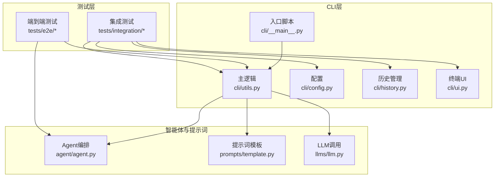
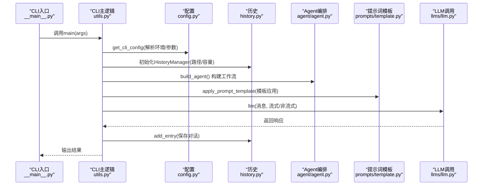
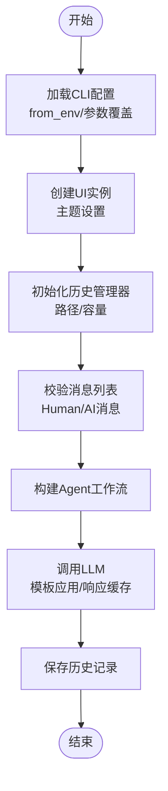
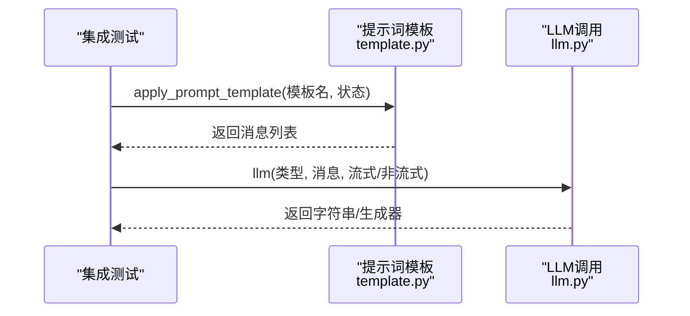
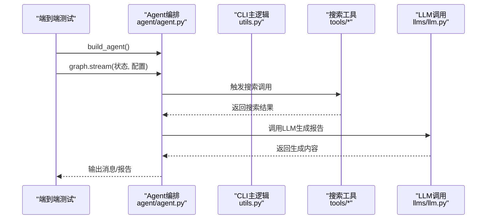
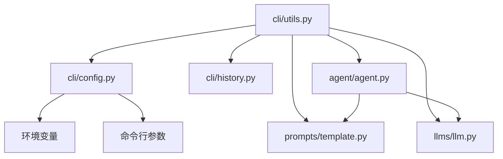

# 集成测试

<cite>
**本文引用的文件**   
- [tests/integration/test_integration.py](file://tests/integration/test_integration.py)
- [tests/integration/test_cli_integration.py](file://tests/integration/test_cli_integration.py)
- [tests/e2e/test_e2e.py](file://tests/e2e/test_e2e.py)
- [src/deepresearch/cli/__main__.py](file://src/deepresearch/cli/__main__.py)
- [src/deepresearch/cli/utils.py](file://src/deepresearch/cli/utils.py)
- [src/deepresearch/cli/config.py](file://src/deepresearch/cli/config.py)
- [src/deepresearch/cli/history.py](file://src/deepresearch/cli/history.py)
- [src/deepresearch/cli/ui.py](file://src/deepresearch/cli/ui.py)
- [src/deepresearch/prompts/template.py](file://src/deepresearch/prompts/template.py)
- [src/deepresearch/llms/llm.py](file://src/deepresearch/llms/llm.py)
- [src/deepresearch/agent/agent.py](file://src/deepresearch/agent/agent.py)
- [config/search.toml](file://config/search.toml)
- [config/workflow.toml](file://config/workflow.toml)
- [tests/utils/testing_guidelines.md](file://tests/utils/testing_guidelines.md)
- [README.md](file://README.md)
</cite>

## 目录
1. [引言](#引言)
2. [项目结构](#项目结构)
3. [核心组件](#核心组件)
4. [架构总览](#架构总览)
5. [详细组件分析](#详细组件分析)
6. [依赖分析](#依赖分析)
7. [性能考虑](#性能考虑)
8. [故障排除指南](#故障排除指南)
9. [结论](#结论)
10. [附录](#附录)

## 引言
本文件面向DeepResearch项目的集成测试，系统化阐述设计理念、实施策略与执行流程，覆盖模块间交互测试、CLI集成测试、系统集成测试（Agent工作流与搜索功能）、环境配置、测试数据准备与执行流程，并提供故障排除与调试方法。目标是帮助开发者与测试工程师高效地设计、执行与维护集成测试，保障跨模块协作与外部服务集成的稳定性。

## 项目结构
- 测试目录采用分层组织：unit（单元测试）、integration（集成测试）、performance（性能测试）、e2e（端到端测试），便于按粒度与范围定位测试。
- 集成测试主要分布在tests/integration，涵盖CLI配置与历史、UI主题、消息校验、端到端工作流、跨平台兼容性、性能与限制等场景。
- CLI主入口与核心逻辑位于src/deepresearch/cli，围绕配置、历史、UI、消息校验与Agent调用展开；Agent工作流由src/deepresearch/agent/agent.py编排；提示词模板与LLM调用分别在src/deepresearch/prompts/template.py与src/deepresearch/llms/llm.py中实现。

图表来源
- [tests/integration/test_cli_integration.py:1-229](file://tests/integration/test_cli_integration.py#L1-L229)
- [tests/e2e/test_e2e.py:1-59](file://tests/e2e/test_e2e.py#L1-L59)
- [src/deepresearch/cli/__main__.py:1-7](file://src/deepresearch/cli/__main__.py#L1-L7)
- [src/deepresearch/cli/utils.py:1-575](file://src/deepresearch/cli/utils.py#L1-L575)
- [src/deepresearch/cli/config.py:1-101](file://src/deepresearch/cli/config.py#L1-L101)
- [src/deepresearch/cli/history.py:1-166](file://src/deepresearch/cli/history.py#L1-L166)
- [src/deepresearch/cli/ui.py:1-382](file://src/deepresearch/cli/ui.py#L1-L382)
- [src/deepresearch/agent/agent.py:1-45](file://src/deepresearch/agent/agent.py#L1-L45)
- [src/deepresearch/prompts/template.py:1-166](file://src/deepresearch/prompts/template.py#L1-L166)
- [src/deepresearch/llms/llm.py:1-308](file://src/deepresearch/llms/llm.py#L1-L308)

章节来源
- [tests/integration/test_cli_integration.py:1-229](file://tests/integration/test_cli_integration.py#L1-L229)
- [tests/e2e/test_e2e.py:1-59](file://tests/e2e/test_e2e.py#L1-L59)
- [src/deepresearch/cli/__main__.py:1-7](file://src/deepresearch/cli/__main__.py#L1-L7)
- [src/deepresearch/cli/utils.py:1-575](file://src/deepresearch/cli/utils.py#L1-L575)
- [src/deepresearch/cli/config.py:1-101](file://src/deepresearch/cli/config.py#L1-L101)
- [src/deepresearch/cli/history.py:1-166](file://src/deepresearch/cli/history.py#L1-L166)
- [src/deepresearch/cli/ui.py:1-382](file://src/deepresearch/cli/ui.py#L1-L382)
- [src/deepresearch/agent/agent.py:1-45](file://src/deepresearch/agent/agent.py#L1-L45)
- [src/deepresearch/prompts/template.py:1-166](file://src/deepresearch/prompts/template.py#L1-L166)
- [src/deepresearch/llms/llm.py:1-308](file://src/deepresearch/llms/llm.py#L1-L308)

## 核心组件
- CLI配置与优先级：CLIConfig封装配置项并通过from_env加载环境变量，支持命令行参数覆盖与默认值约束；get_cli_config统一合并环境与参数来源，形成最终配置。
- 历史管理：HistoryManager负责历史记录的持久化、检索、统计与清理，支持会话隔离与最大条目限制。
- 终端UI：TerminalUI提供主题化输出、进度条、旋转指示器等能力，支持跨平台终端特性检测。
- 消息校验：validate_messages确保输入消息列表包含合法的HumanMessage/AIMessage对象。
- Agent工作流：build_agent构建状态图，串联预处理、分类、改写、大纲搜索与生成等节点，形成可流式执行的工作流。
- 提示词模板：apply_prompt_template动态加载模板并注入状态变量，生成消息序列。
- LLM调用：llm提供非流式与流式响应，内置响应缓存与实例LRU缓存，提升性能与稳定性。

章节来源
- [src/deepresearch/cli/config.py:1-101](file://src/deepresearch/cli/config.py#L1-L101)
- [src/deepresearch/cli/history.py:1-166](file://src/deepresearch/cli/history.py#L1-L166)
- [src/deepresearch/cli/ui.py:1-382](file://src/deepresearch/cli/ui.py#L1-L382)
- [src/deepresearch/cli/utils.py:82-104](file://src/deepresearch/cli/utils.py#L82-L104)
- [src/deepresearch/agent/agent.py:1-45](file://src/deepresearch/agent/agent.py#L1-L45)
- [src/deepresearch/prompts/template.py:90-130](file://src/deepresearch/prompts/template.py#L90-L130)
- [src/deepresearch/llms/llm.py:146-185](file://src/deepresearch/llms/llm.py#L146-L185)

## 架构总览
集成测试关注以下关键交互链路：
- CLI配置与历史：配置加载、环境变量覆盖、历史文件路径解析与持久化。
- CLI与Agent：消息校验、Agent构建、流式执行、输出拼接与历史记录。
- 提示词模板与LLM：模板应用、消息构造、LLM调用与响应缓存。
- 端到端工作流：从CLI入口到Agent编排，再到提示词与LLM的协同。

图表来源
- [src/deepresearch/cli/__main__.py:1-7](file://src/deepresearch/cli/__main__.py#L1-L7)
- [src/deepresearch/cli/utils.py:485-575](file://src/deepresearch/cli/utils.py#L485-L575)
- [src/deepresearch/cli/config.py:66-101](file://src/deepresearch/cli/config.py#L66-L101)
- [src/deepresearch/cli/history.py:92-108](file://src/deepresearch/cli/history.py#L92-L108)
- [src/deepresearch/agent/agent.py:19-45](file://src/deepresearch/agent/agent.py#L19-L45)
- [src/deepresearch/prompts/template.py:90-130](file://src/deepresearch/prompts/template.py#L90-L130)
- [src/deepresearch/llms/llm.py:146-185](file://src/deepresearch/llms/llm.py#L146-L185)

## 详细组件分析

### CLI集成测试
- 配置与历史集成：验证配置项与历史文件路径的组合、历史持久化与跨实例一致性。
- UI与配置集成：验证主题设置对UI的影响，覆盖default/minimal/colorful三种主题。
- 消息校验与异常处理：验证空消息与非法消息的异常行为，以及历史文件损坏时的容错恢复。
- 端到端会话流程：从配置、UI、消息校验到历史记录的完整链路验证。
- 跨平台兼容性：路径处理与Unicode支持测试。
- 性能与限制：大历史容量处理与搜索性能阈值测试。
- 配置优先级：环境变量覆盖默认值、命令行参数覆盖环境变量、显式参数覆盖所有来源。

图表来源
- [tests/integration/test_cli_integration.py:19-229](file://tests/integration/test_cli_integration.py#L19-L229)
- [src/deepresearch/cli/config.py:34-50](file://src/deepresearch/cli/config.py#L34-L50)
- [src/deepresearch/cli/ui.py:364-382](file://src/deepresearch/cli/ui.py#L364-L382)
- [src/deepresearch/cli/history.py:92-108](file://src/deepresearch/cli/history.py#L92-L108)
- [src/deepresearch/cli/utils.py:82-104](file://src/deepresearch/cli/utils.py#L82-L104)
- [src/deepresearch/agent/agent.py:19-45](file://src/deepresearch/agent/agent.py#L19-L45)
- [src/deepresearch/prompts/template.py:90-130](file://src/deepresearch/prompts/template.py#L90-L130)
- [src/deepresearch/llms/llm.py:146-185](file://src/deepresearch/llms/llm.py#L146-L185)

章节来源
- [tests/integration/test_cli_integration.py:1-229](file://tests/integration/test_cli_integration.py#L1-L229)
- [src/deepresearch/cli/config.py:1-101](file://src/deepresearch/cli/config.py#L1-L101)
- [src/deepresearch/cli/history.py:1-166](file://src/deepresearch/cli/history.py#L1-L166)
- [src/deepresearch/cli/ui.py:1-382](file://src/deepresearch/cli/ui.py#L1-L382)
- [src/deepresearch/cli/utils.py:1-575](file://src/deepresearch/cli/utils.py#L1-L575)

### 模块间交互测试（提示词与LLM）
- 提示词模板集成：验证模板加载、系统提示与用户提示的组合、状态变量注入与消息拼接。
- LLM与提示词集成：在模板生成消息后，调用LLM进行非流式与流式响应，验证响应长度与缓存命中。
- API密钥相关跳过策略：当无有效API密钥时，测试跳过以避免失败干扰。

图表来源
- [tests/integration/test_integration.py:20-51](file://tests/integration/test_integration.py#L20-L51)
- [src/deepresearch/prompts/template.py:90-130](file://src/deepresearch/prompts/template.py#L90-L130)
- [src/deepresearch/llms/llm.py:146-185](file://src/deepresearch/llms/llm.py#L146-L185)

章节来源
- [tests/integration/test_integration.py:1-54](file://tests/integration/test_integration.py#L1-L54)
- [src/deepresearch/prompts/template.py:1-166](file://src/deepresearch/prompts/template.py#L1-L166)
- [src/deepresearch/llms/llm.py:1-308](file://src/deepresearch/llms/llm.py#L1-L308)

### 系统集成测试（Agent工作流与搜索功能）
- Agent工作流集成：构建Agent图，准备状态与配置，流式执行前若干步，验证输出非空。
- 搜索功能集成：结合配置文件中的搜索引擎与超时设置，验证搜索调用与响应处理（需外部服务支持）。

图表来源
- [tests/e2e/test_e2e.py:17-55](file://tests/e2e/test_e2e.py#L17-L55)
- [src/deepresearch/agent/agent.py:19-45](file://src/deepresearch/agent/agent.py#L19-L45)
- [src/deepresearch/cli/utils.py:106-193](file://src/deepresearch/cli/utils.py#L106-L193)
- [config/search.toml:1-6](file://config/search.toml#L1-L6)
- [config/workflow.toml:1-3](file://config/workflow.toml#L1-L3)

章节来源
- [tests/e2e/test_e2e.py:1-59](file://tests/e2e/test_e2e.py#L1-L59)
- [src/deepresearch/agent/agent.py:1-45](file://src/deepresearch/agent/agent.py#L1-L45)
- [src/deepresearch/cli/utils.py:106-193](file://src/deepresearch/cli/utils.py#L106-L193)
- [config/search.toml:1-6](file://config/search.toml#L1-L6)
- [config/workflow.toml:1-3](file://config/workflow.toml#L1-L3)

## 依赖分析
- 组件耦合与内聚：CLI层通过统一入口与配置管理器连接各子系统；Agent工作流通过状态图解耦节点职责；提示词模板与LLM之间通过消息接口松耦合。
- 外部依赖与集成点：LLM调用依赖外部模型服务；搜索工具依赖搜索引擎API；历史持久化依赖文件系统。
- 配置契约：CLIConfig集中定义配置项与默认值，get_cli_config提供统一合并策略，确保配置来源清晰、优先级明确。

图表来源
- [src/deepresearch/cli/utils.py:1-575](file://src/deepresearch/cli/utils.py#L1-L575)
- [src/deepresearch/cli/config.py:1-101](file://src/deepresearch/cli/config.py#L1-L101)
- [src/deepresearch/cli/history.py:1-166](file://src/deepresearch/cli/history.py#L1-L166)
- [src/deepresearch/agent/agent.py:1-45](file://src/deepresearch/agent/agent.py#L1-L45)
- [src/deepresearch/prompts/template.py:1-166](file://src/deepresearch/prompts/template.py#L1-L166)
- [src/deepresearch/llms/llm.py:1-308](file://src/deepresearch/llms/llm.py#L1-L308)

章节来源
- [src/deepresearch/cli/utils.py:1-575](file://src/deepresearch/cli/utils.py#L1-L575)
- [src/deepresearch/cli/config.py:1-101](file://src/deepresearch/cli/config.py#L1-L101)
- [src/deepresearch/cli/history.py:1-166](file://src/deepresearch/cli/history.py#L1-L166)
- [src/deepresearch/agent/agent.py:1-45](file://src/deepresearch/agent/agent.py#L1-L45)
- [src/deepresearch/prompts/template.py:1-166](file://src/deepresearch/prompts/template.py#L1-L166)
- [src/deepresearch/llms/llm.py:1-308](file://src/deepresearch/llms/llm.py#L1-L308)

## 性能考虑
- 历史容量与性能：测试大历史容量下的截断与检索性能，确保在100条以内检索耗时低于阈值。
- LLM缓存策略：响应缓存与实例LRU缓存降低重复请求成本，建议在集成测试中关注缓存命中率与抖动。
- 流式输出：在CLI中启用流式输出可改善用户体验，集成测试应验证流式响应的完整性与顺序。
- 资源占用：结合系统资源监控工具评估长时间运行的Agent工作流对CPU与内存的影响。

章节来源
- [tests/integration/test_cli_integration.py:184-208](file://tests/integration/test_cli_integration.py#L184-L208)
- [src/deepresearch/llms/llm.py:71-121](file://src/deepresearch/llms/llm.py#L71-L121)
- [src/deepresearch/cli/utils.py:157-193](file://src/deepresearch/cli/utils.py#L157-L193)

## 故障排除指南
- 配置加载失败：检查环境变量命名与取值、命令行参数合法性、配置目录可访问性。
- 历史文件异常：当历史文件为无效JSON时，系统会记录警告并重建，测试中验证该行为。
- LLM调用异常：捕获外部服务错误并降级返回空字符串或警告日志，集成测试中可跳过或标记为非致命。
- Agent执行错误：在交互模式中捕获Agent执行错误并移除失败消息，保持对话连续性。
- 信号中断：支持SIGINT/SIGTERM优雅退出，集成测试中验证中断后资源清理与状态恢复。

章节来源
- [src/deepresearch/cli/history.py:67-91](file://src/deepresearch/cli/history.py#L67-L91)
- [src/deepresearch/cli/utils.py:147-193](file://src/deepresearch/cli/utils.py#L147-L193)
- [src/deepresearch/llms/llm.py:215-255](file://src/deepresearch/llms/llm.py#L215-L255)

## 结论
本集成测试体系通过CLI配置与历史、UI主题、消息校验、Agent工作流与提示词/LLM交互、端到端工作流等维度，全面覆盖DeepResearch的关键集成路径。测试设计强调配置优先级、跨平台兼容性、性能与稳定性，并提供完善的故障排除与调试机制。建议在CI/CD中持续运行集成测试，结合覆盖率与性能指标，持续优化系统质量。

## 附录

### 环境配置与测试数据准备
- 环境变量
  - DEEPRESEARCH_MAX_DEPTH：默认搜索深度
  - DEEPRESEARCH_SAVE_AS_HTML：是否保存HTML
  - DEEPRESEARCH_SAVE_PATH：报告保存路径
  - DEEPRESEARCH_LOG_LEVEL：日志级别
  - DEEPRESEARCH_LOG_FILE：日志文件路径
  - DEEPRESEARCH_THEME：界面主题
  - DEEPRESEARCH_CONFIG_DIR：配置目录
- 配置文件
  - config/search.toml：搜索引擎选择与API密钥
  - config/workflow.toml：搜索topN等工作流参数
- 测试数据
  - 使用临时目录与临时文件模拟真实路径与权限
  - 使用真实消息对象（HumanMessage/AIMessage）构造测试输入

章节来源
- [src/deepresearch/cli/config.py:34-50](file://src/deepresearch/cli/config.py#L34-L50)
- [src/deepresearch/cli/utils.py:400-482](file://src/deepresearch/cli/utils.py#L400-L482)
- [config/search.toml:1-6](file://config/search.toml#L1-L6)
- [config/workflow.toml:1-3](file://config/workflow.toml#L1-L3)

### 测试执行流程
- 本地执行
  - 运行全部集成测试：pytest tests/integration/
  - 运行端到端测试：pytest tests/e2e/
  - 指定测试文件：pytest tests/integration/test_cli_integration.py
- CI/CD建议
  - 在流水线中固定环境变量与配置文件
  - 为外部服务调用准备占位API密钥或Mock
  - 生成覆盖率与性能报告

章节来源
- [tests/utils/testing_guidelines.md:89-100](file://tests/utils/testing_guidelines.md#L89-L100)
- [README.md:39-56](file://README.md#L39-L56)