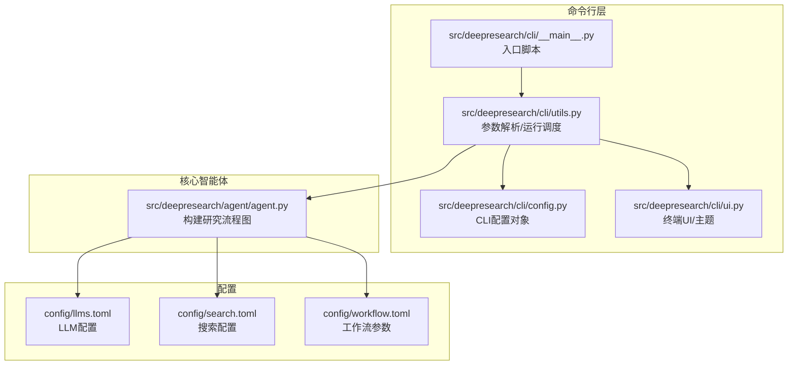
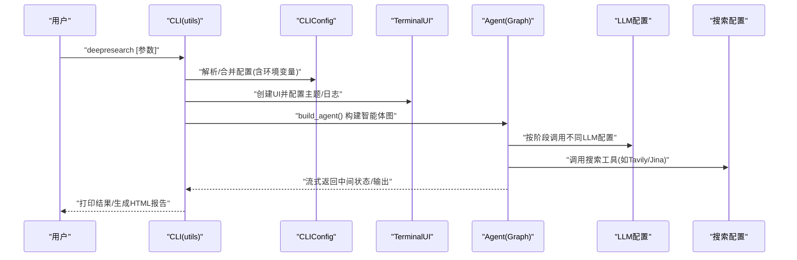
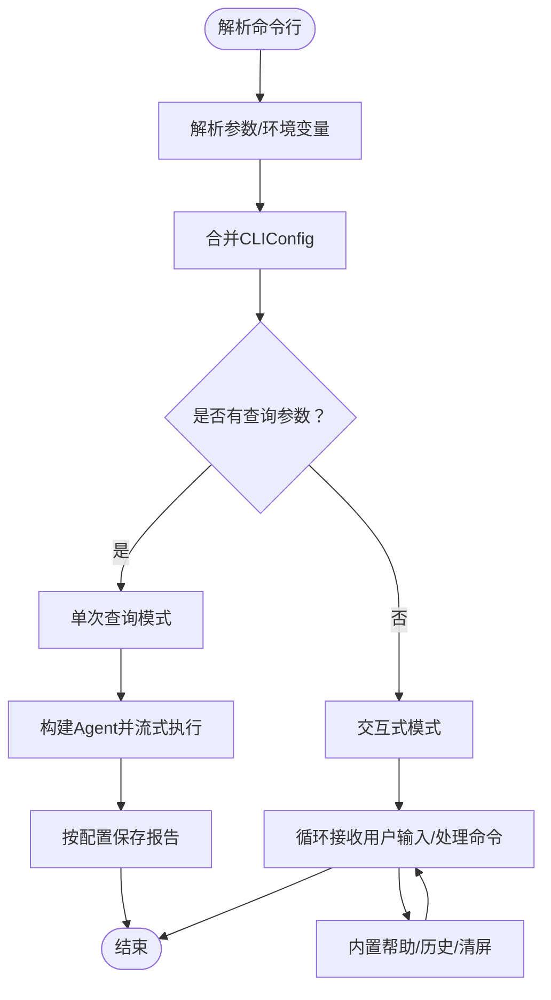
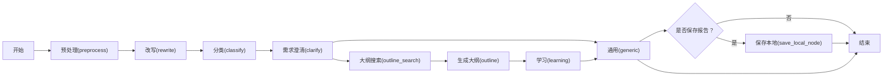
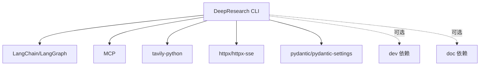

# 基础使用示例

<cite>
**本文引用的文件**
- [README.md](file://README.md)
- [pyproject.toml](file://pyproject.toml)
- [doc/intro.md](file://doc/intro.md)
- [doc/user_guide/user_guide.md](file://doc/user_guide/user_guide.md)
- [src/deepresearch/cli/__main__.py](file://src/deepresearch/cli/__main__.py)
- [src/deepresearch/cli/utils.py](file://src/deepresearch/cli/utils.py)
- [src/deepresearch/cli/config.py](file://src/deepresearch/cli/config.py)
- [src/deepresearch/cli/ui.py](file://src/deepresearch/cli/ui.py)
- [src/deepresearch/agent/agent.py](file://src/deepresearch/agent/agent.py)
- [config/llms.toml](file://config/llms.toml)
- [config/search.toml](file://config/search.toml)
- [config/workflow.toml](file://config/workflow.toml)
- [tests/unit/cli/test_main.py](file://tests/unit/cli/test_main.py)
- [tests/e2e/test_e2e.py](file://tests/e2e/test_e2e.py)
</cite>

## 目录
1. [简介](#简介)
2. [项目结构](#项目结构)
3. [核心组件](#核心组件)
4. [架构总览](#架构总览)
5. [详细组件分析](#详细组件分析)
6. [依赖分析](#依赖分析)
7. [性能考虑](#性能考虑)
8. [故障排查指南](#故障排查指南)
9. [结论](#结论)
10. [附录](#附录)

## 简介
本文件面向首次使用者，提供从安装到运行的完整基础使用示例，覆盖环境准备、配置设置、CLI 命令与参数说明、典型使用场景（快速研究、主题分析、报告生成）以及常见问题与使用技巧。目标是帮助你在最短时间内上手 DeepResearch，完成一次从“提出问题”到“生成报告”的闭环。

## 项目结构
DeepResearch 采用模块化组织，CLI 入口位于命令行模块，核心研究流程由智能体图（Agent Graph）驱动，配置文件集中于 config 目录，文档位于 doc 目录，测试覆盖单元与端到端场景。

**图表来源**
- [src/deepresearch/cli/__main__.py:1-7](file://src/deepresearch/cli/__main__.py#L1-L7)
- [src/deepresearch/cli/utils.py:386-575](file://src/deepresearch/cli/utils.py#L386-L575)
- [src/deepresearch/cli/config.py:15-101](file://src/deepresearch/cli/config.py#L15-L101)
- [src/deepresearch/cli/ui.py:66-200](file://src/deepresearch/cli/ui.py#L66-L200)
- [src/deepresearch/agent/agent.py:19-45](file://src/deepresearch/agent/agent.py#L19-L45)
- [config/llms.toml:1-29](file://config/llms.toml#L1-L29)
- [config/search.toml:1-6](file://config/search.toml#L1-L6)
- [config/workflow.toml:1-3](file://config/workflow.toml#L1-L3)

**章节来源**
- [README.md:39-56](file://README.md#L39-L56)
- [doc/intro.md:48-146](file://doc/intro.md#L48-L146)

## 核心组件
- CLI 入口与运行调度：命令行入口脚本调用 utils.main，解析参数并选择交互式或单次查询模式；在交互模式中提供帮助、历史、清屏等便捷命令。
- 配置系统：CLIConfig 提供环境变量与参数覆盖机制，支持日志级别、主题、保存路径、最大深度等关键参数。
- 终端 UI：TerminalUI 支持三种主题（default/minimal/colorful），并具备颜色与终端宽度自适应。
- 智能体图：Agent Graph 将“预处理→改写→分类→澄清→通用→大纲搜索→大纲→学习→生成→保存”串联为可流式执行的状态机。

**章节来源**
- [src/deepresearch/cli/__main__.py:1-7](file://src/deepresearch/cli/__main__.py#L1-L7)
- [src/deepresearch/cli/utils.py:386-575](file://src/deepresearch/cli/utils.py#L386-L575)
- [src/deepresearch/cli/config.py:15-101](file://src/deepresearch/cli/config.py#L15-L101)
- [src/deepresearch/cli/ui.py:66-200](file://src/deepresearch/cli/ui.py#L66-L200)
- [src/deepresearch/agent/agent.py:19-45](file://src/deepresearch/agent/agent.py#L19-L45)

## 架构总览
下面的序列图展示了 CLI 如何从解析参数到构建智能体并流式执行研究流程，最终产出报告的过程。

**图表来源**
- [src/deepresearch/cli/utils.py:485-575](file://src/deepresearch/cli/utils.py#L485-L575)
- [src/deepresearch/cli/config.py:66-101](file://src/deepresearch/cli/config.py#L66-L101)
- [src/deepresearch/cli/ui.py:66-200](file://src/deepresearch/cli/ui.py#L66-L200)
- [src/deepresearch/agent/agent.py:19-45](file://src/deepresearch/agent/agent.py#L19-L45)
- [config/llms.toml:1-29](file://config/llms.toml#L1-L29)
- [config/search.toml:1-6](file://config/search.toml#L1-L6)

## 详细组件分析

### CLI 命令与参数详解
- 基本用法
  - 启动交互式模式：直接运行命令后按提示输入问题。
  - 单次查询模式：使用查询参数一次性获取结果。
- 关键参数
  - -q/--query：单次查询内容。
  - -d/--depth：研究深度（1-10，默认3）。
  - --no-html：不生成HTML报告。
  - -o/--output：报告输出路径。
  - --log-level/--log-file：日志级别与日志文件路径。
  - --theme：界面主题（default/minimal/colorful）。
  - -c/--config-dir：自定义配置目录。
  - -v/--version：显示版本。
- 环境变量（优先级低于命令行参数）
  - DEEPRESEARCH_MAX_DEPTH、DEEPRESEARCH_SAVE_AS_HTML、DEEPRESEARCH_SAVE_PATH、DEEPRESEARCH_LOG_LEVEL、DEEPRESEARCH_LOG_FILE、DEEPRESEARCH_THEME、DEEPRESEARCH_CONFIG_DIR。

**图表来源**
- [src/deepresearch/cli/utils.py:386-575](file://src/deepresearch/cli/utils.py#L386-L575)
- [src/deepresearch/cli/config.py:35-101](file://src/deepresearch/cli/config.py#L35-L101)

**章节来源**
- [src/deepresearch/cli/utils.py:386-575](file://src/deepresearch/cli/utils.py#L386-L575)
- [tests/unit/cli/test_main.py:62-143](file://tests/unit/cli/test_main.py#L62-L143)

### 配置文件设置
- LLM 配置（config/llms.toml）
  - 基础模块、需求澄清、任务规划、查询生成、评估、报告生成等段落均需填写 api_base、api_key、model。
  - 规划器建议使用推理能力强的模型。
- 搜索配置（config/search.toml）
  - engine 支持 jina 或 tavily。
  - 填写对应 API 密钥。
- 工作流配置（config/workflow.toml）
  - topN 控制搜索结果数量。

**章节来源**
- [config/llms.toml:1-29](file://config/llms.toml#L1-L29)
- [config/search.toml:1-6](file://config/search.toml#L1-L6)
- [config/workflow.toml:1-3](file://config/workflow.toml#L1-L3)

### 研究流程与节点
智能体图将研究过程拆分为若干节点，按顺序执行并在必要处进行条件分支与保存。

**图表来源**
- [src/deepresearch/agent/agent.py:19-45](file://src/deepresearch/agent/agent.py#L19-L45)

**章节来源**
- [src/deepresearch/agent/agent.py:19-45](file://src/deepresearch/agent/agent.py#L19-L45)

### 实际使用场景示例

- 快速研究
  - 场景：快速了解某个主题的概况。
  - 命令示例：使用单次查询模式直接获取结果。
  - 参考路径：[doc/user_guide/user_guide.md:76-85](file://doc/user_guide/user_guide.md#L76-L85)
- 主题分析
  - 场景：对特定公司或领域进行深入分析。
  - 命令示例：提供更具体的问题，结合较大深度与报告保存。
  - 参考路径：[doc/user_guide/user_guide.md:86-95](file://doc/user_guide/user_guide.md#L86-L95)
- 报告生成
  - 场景：生成 HTML 报告以便分享。
  - 命令示例：使用默认保存路径或自定义输出路径。
  - 参考路径：[doc/user_guide/user_guide.md:70-73](file://doc/user_guide/user_guide.md#L70-L73)

**章节来源**
- [doc/user_guide/user_guide.md:70-95](file://doc/user_guide/user_guide.md#L70-L95)

### CLI 交互与便捷命令
- 交互模式支持的内置命令
  - help：显示帮助。
  - quit：退出程序。
  - clear：清空当前对话。
  - history：查看最近历史。
  - search <关键词>：在历史中搜索。
- 快捷键
  - Ctrl+C：中断当前操作。
  - Ctrl+D：退出程序。

**章节来源**
- [src/deepresearch/cli/utils.py:195-304](file://src/deepresearch/cli/utils.py#L195-L304)

## 依赖分析
- 安装与运行
  - 使用 pip 安装项目后，可通过命令运行。
  - 也可通过 Python 模块方式运行。
- 依赖项
  - 包含 HTTP 客户端、MCP、LangChain/LangGraph、Tavily、解析与渲染等库。
- 可选依赖
  - dev：开发工具链。
  - doc：文档构建工具链。

**图表来源**
- [pyproject.toml:12-26](file://pyproject.toml#L12-L26)
- [pyproject.toml:28-52](file://pyproject.toml#L28-L52)

**章节来源**
- [pyproject.toml:1-93](file://pyproject.toml#L1-L93)

## 性能考虑
- 研究深度与时间权衡：深度越大，信息越全面，耗时越长。
- 评估与迭代：通过多轮搜索与评估减少幻觉，提升质量。
- 输出格式：HTML 报告生成涉及渲染，适当关闭可节省时间。
- 搜索引擎：切换更高效的引擎或优化 API 密钥与网络环境。

[本节为通用指导，无需特定文件引用]

## 故障排查指南
- 系统无法启动
  - 检查依赖安装、LLM 与搜索工具配置、查看日志文件定位错误。
- LLM 调用失败
  - 核对 API 密钥、服务状态与网络连通性。
- 搜索工具调用失败
  - 核对 API 密钥、服务状态与网络连通性。
- HTML 报告生成失败
  - 检查保存路径存在性与写权限，确认相关依赖安装。
- 运行时间过长
  - 降低研究深度、优化 LLM 配置、使用更高效搜索引擎。
- 结果不够准确
  - 提高研究深度、提供更具体查询、检查配置正确性。

**章节来源**
- [doc/user_guide/user_guide.md:122-196](file://doc/user_guide/user_guide.md#L122-L196)

## 结论
通过本基础使用示例，你可以完成从安装、配置到运行的全流程，并掌握 CLI 的常用参数与交互命令。建议先以单次查询模式快速试用，再逐步探索交互式模式与高级配置，最终形成稳定的研究工作流。

[本节为总结性内容，无需特定文件引用]

## 附录

### 安装与运行步骤
- 环境准备
  - Python 版本要求：>=3.14,<4.0。
  - 克隆仓库并进入目录。
- 安装方式
  - 推荐使用 pip 安装（支持开发与文档依赖）。
- 运行方式
  - 交互式模式：直接运行命令。
  - 单次查询模式：传入查询参数。
  - 模块方式：通过 Python 模块运行。

**章节来源**
- [doc/intro.md:52-146](file://doc/intro.md#L52-L146)
- [README.md:39-56](file://README.md#L39-L56)

### CLI 参数速查表
- -q/--query：单次查询内容。
- -d/--depth：研究深度（1-10）。
- --no-html：不生成HTML报告。
- -o/--output：报告输出路径。
- --log-level/--log-file：日志级别与日志文件。
- --theme：界面主题。
- -c/--config-dir：自定义配置目录。
- -v/--version：显示版本。

**章节来源**
- [src/deepresearch/cli/utils.py:411-482](file://src/deepresearch/cli/utils.py#L411-L482)

### 端到端与单元测试参考
- 端到端测试：验证完整工作流可启动并产生输出（API 调用需有效密钥）。
- 单元测试：覆盖参数解析、配置合并、异常处理与交互命令。

**章节来源**
- [tests/e2e/test_e2e.py:14-55](file://tests/e2e/test_e2e.py#L14-L55)
- [tests/unit/cli/test_main.py:62-143](file://tests/unit/cli/test_main.py#L62-L143)