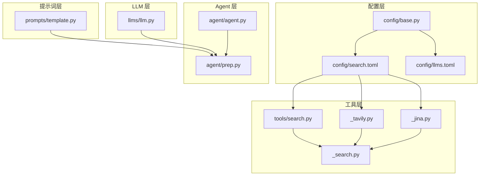
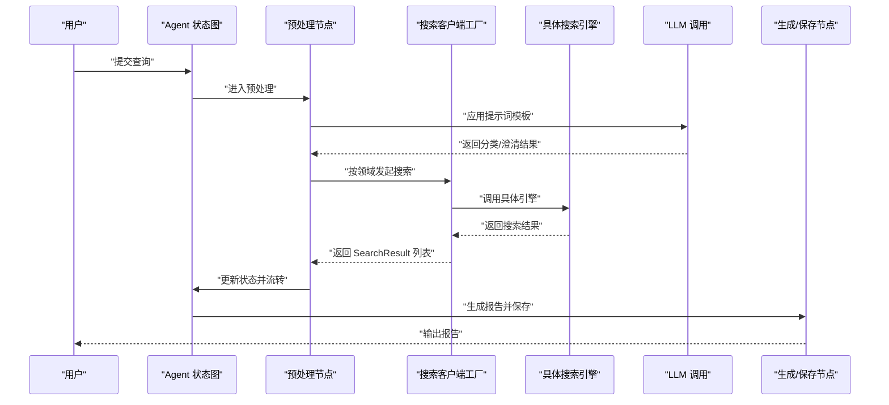
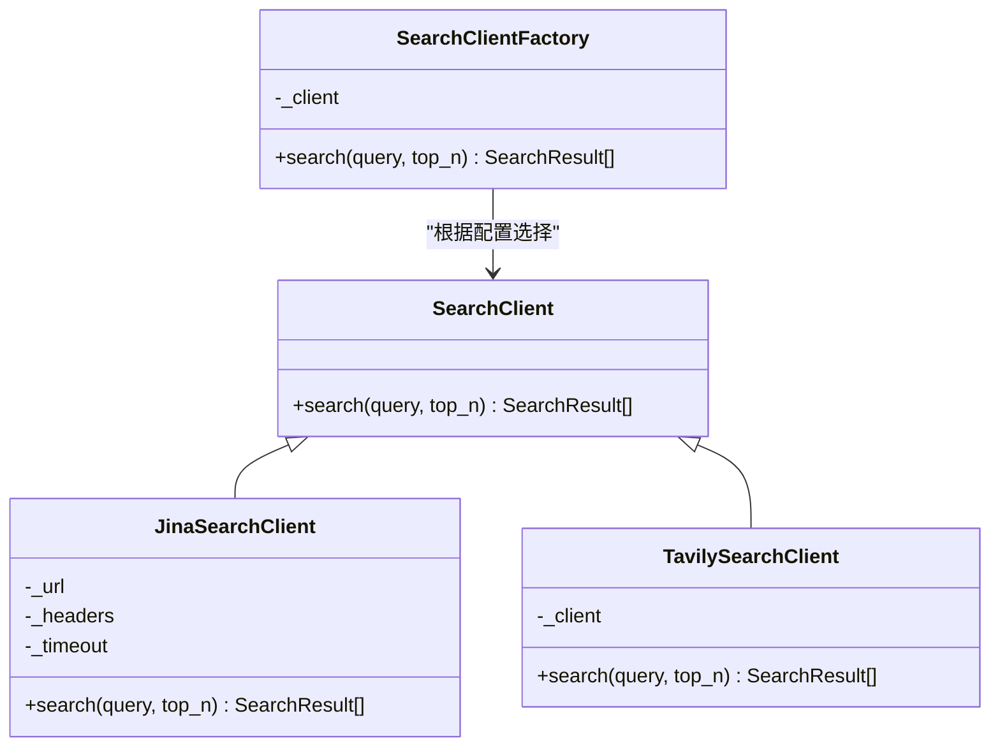
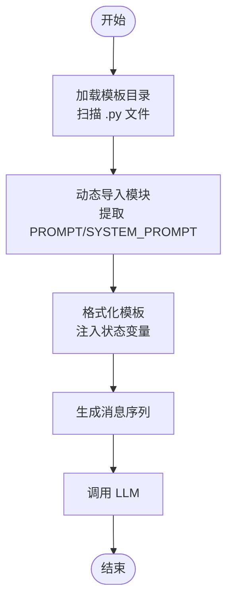
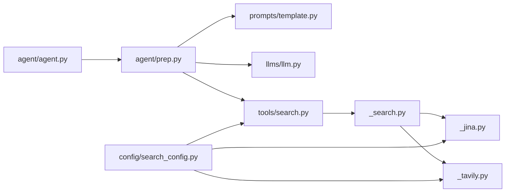

# 扩展示例

<cite>
**本文引用的文件**
- [README.md](file://README.md)
- [__init__.py](file://src/deepresearch/__init__.py)
- [agent.py](file://src/deepresearch/agent/agent.py)
- [search.py](file://src/deepresearch/tools/search.py)
- [_search.py](file://src/deepresearch/tools/_search.py)
- [_tavily.py](file://src/deepresearch/tools/_tavily.py)
- [_jina.py](file://src/deepresearch/tools/_jina.py)
- [search_config.py](file://src/deepresearch/config/search_config.py)
- [search.toml](file://config/search.toml)
- [llm.py](file://src/deepresearch/llms/llm.py)
- [llms.toml](file://config/llms.toml)
- [template.py](file://src/deepresearch/prompts/template.py)
- [prep.py](file://src/deepresearch/agent/prep.py)
- [base.py](file://src/deepresearch/config/base.py)
</cite>

## 目录
1. [简介](#简介)
2. [项目结构](#项目结构)
3. [核心组件](#核心组件)
4. [架构总览](#架构总览)
5. [详细组件分析](#详细组件分析)
6. [依赖分析](#依赖分析)
7. [性能考虑](#性能考虑)
8. [故障排查指南](#故障排查指南)
9. [结论](#结论)
10. [附录](#附录)

## 简介
本文件面向希望在 DeepResearch 中进行“扩展开源”的开发者，提供三类可操作的扩展示例与最佳实践：
- 自定义节点添加：如何在现有 Agent 工作流中新增节点，并将其接入状态图。
- 新搜索引擎集成：如何对接新的第三方搜索服务，使其通过统一工厂类参与检索流程。
- 提示词模板定制：如何新增或替换提示词模板，使 LLM 在不同阶段按需调用。

同时，文档给出节点开发、接口实现、集成测试的步骤清单，以及插件式开发与 API 使用说明，帮助你安全、稳定地扩展系统能力。

## 项目结构
DeepResearch 采用“分层+功能域”组织方式：
- 配置层：集中于 config 目录，负责加载与校验 TOML 配置，支持环境变量覆盖与敏感信息脱敏。
- 工具层：tools 目录封装第三方搜索客户端与通用工具。
- LLM 层：llms 目录封装大模型调用、缓存与流式输出。
- 提示词层：prompts 目录动态加载各功能域模板。
- Agent 层：agent 目录定义状态图与节点逻辑。
- CLI/入口：CLI 与入口模块位于 cli 与根包导出。

**图表来源**
- [agent.py:1-45](file://src/deepresearch/agent/agent.py#L1-L45)
- [prep.py:1-202](file://src/deepresearch/agent/prep.py#L1-L202)
- [search.py:1-46](file://src/deepresearch/tools/search.py#L1-L46)
- [_search.py:1-35](file://src/deepresearch/tools/_search.py#L1-L35)
- [_tavily.py:1-72](file://src/deepresearch/tools/_tavily.py#L1-L72)
- [_jina.py:1-92](file://src/deepresearch/tools/_jina.py#L1-L92)
- [search_config.py:1-82](file://src/deepresearch/config/search_config.py#L1-L82)
- [llm.py:1-308](file://src/deepresearch/llms/llm.py#L1-L308)
- [template.py:1-166](file://src/deepresearch/prompts/template.py#L1-L166)
- [base.py:1-590](file://src/deepresearch/config/base.py#L1-L590)

**章节来源**
- [README.md:1-69](file://README.md#L1-L69)
- [__init__.py:1-30](file://src/deepresearch/__init__.py#L1-L30)

## 核心组件
- Agent 工作流：基于状态图的状态机，串联预处理、改写、分类、澄清、大纲搜索、大纲生成、学习、生成报告、本地保存等节点。
- 搜索客户端工厂：根据配置选择具体搜索引擎（当前支持 Jina 与 Tavily），屏蔽第三方差异。
- LLM 调用与缓存：统一的 LLM 包装，支持非流式与流式响应、消息哈希缓存、实例 LRU 缓存。
- 提示词模板系统：动态扫描并加载各功能域模板，支持系统提示与用户提示组合。

**章节来源**
- [agent.py:1-45](file://src/deepresearch/agent/agent.py#L1-L45)
- [search.py:1-46](file://src/deepresearch/tools/search.py#L1-L46)
- [llm.py:1-308](file://src/deepresearch/llms/llm.py#L1-L308)
- [template.py:1-166](file://src/deepresearch/prompts/template.py#L1-L166)

## 架构总览
下图展示了从“输入查询”到“生成报告”的端到端扩展点与交互关系。

**图表来源**
- [agent.py:19-44](file://src/deepresearch/agent/agent.py#L19-L44)
- [prep.py:21-202](file://src/deepresearch/agent/prep.py#L21-L202)
- [search.py:12-36](file://src/deepresearch/tools/search.py#L12-L36)
- [_tavily.py:15-60](file://src/deepresearch/tools/_tavily.py#L15-L60)
- [_jina.py:15-79](file://src/deepresearch/tools/_jina.py#L15-L79)
- [llm.py:146-184](file://src/deepresearch/llms/llm.py#L146-L184)
- [template.py:90-129](file://src/deepresearch/prompts/template.py#L90-L129)

## 详细组件分析

### 自定义节点添加（扩展 Agent 工作流）
目标：在现有工作流中新增一个节点，参与状态流转并与其他节点协同。

- 步骤一：实现节点函数
  - 节点函数签名应接收状态对象并返回命令或更新后的状态字典。参考现有节点的模式，例如预处理、改写、分类、澄清、通用节点等。
  - 参考路径：[prep.py:21-202](file://src/deepresearch/agent/prep.py#L21-L202)

- 步骤二：在状态图中注册节点
  - 在构建状态图处添加节点与边。确保起始边、内部边与条件边正确连接。
  - 参考路径：[agent.py:19-44](file://src/deepresearch/agent/agent.py#L19-L44)

- 步骤三：在提示词模板中注入上下文
  - 若节点需要 LLM 协作，使用提示词模板系统注入变量，保证消息序列完整。
  - 参考路径：[template.py:90-129](file://src/deepresearch/prompts/template.py#L90-L129)

- 步骤四：在预处理或下游节点中触发新节点
  - 在上游节点中根据业务条件决定是否跳转至新节点，或在条件边中加入新分支。
  - 参考路径：[agent.py:37-42](file://src/deepresearch/agent/agent.py#L37-L42)

- 步骤五：编写单元测试
  - 针对节点函数与状态流转编写断言，覆盖正常与异常分支。
  - 参考路径：[tests/unit/agent/test_agent.py](file://tests/unit/agent/test_agent.py)

- 最佳实践
  - 节点职责单一；避免在节点内做过多 IO；尽量通过状态传递数据。
  - 对外部依赖（如 LLM、搜索）进行最小化封装，便于替换与测试。

**章节来源**
- [agent.py:19-44](file://src/deepresearch/agent/agent.py#L19-L44)
- [prep.py:21-202](file://src/deepresearch/agent/prep.py#L21-L202)
- [template.py:90-129](file://src/deepresearch/prompts/template.py#L90-L129)

### 新搜索引擎集成（第三方搜索服务）
目标：将新的搜索引擎接入统一工厂，使其可被配置驱动地调用。

- 步骤一：定义搜索接口
  - 继承基础搜索客户端接口，实现统一的 search 方法，返回标准化的结果对象。
  - 参考路径：[_search.py:20-35](file://src/deepresearch/tools/_search.py#L20-L35)

- 步骤二：实现具体搜索引擎客户端
  - 在客户端中完成鉴权、请求构造、超时控制与错误处理，最终映射为标准结果对象。
  - 参考路径：[_tavily.py:15-60](file://src/deepresearch/tools/_tavily.py#L15-L60)、[_jina.py:15-79](file://src/deepresearch/tools/_jina.py#L15-L79)

- 步骤三：在工厂中注册新引擎
  - 在工厂类中增加分支，根据配置选择具体客户端。
  - 参考路径：[search.py:12-23](file://src/deepresearch/tools/search.py#L12-L23)

- 步骤四：完善配置与校验
  - 在配置类中新增字段并在加载时进行校验；在 TOML 中补充密钥与超时等参数。
  - 参考路径：[search_config.py:12-53](file://src/deepresearch/config/search_config.py#L12-L53)、[search.toml:1-6](file://config/search.toml#L1-L6)

- 步骤五：编写集成测试
  - 测试工厂选择、客户端调用链路、错误与超时处理。
  - 参考路径：[tests/integration/test_integration.py](file://tests/integration/test_integration.py)

- 最佳实践
  - 统一异常捕获与日志记录；对第三方 API 做超时与重试策略设计；对空查询与无效 URL 进行防御性处理。

**图表来源**
- [_search.py:20-35](file://src/deepresearch/tools/_search.py#L20-L35)
- [_jina.py:15-79](file://src/deepresearch/tools/_jina.py#L15-L79)
- [_tavily.py:15-60](file://src/deepresearch/tools/_tavily.py#L15-L60)
- [search.py:12-23](file://src/deepresearch/tools/search.py#L12-L23)

**章节来源**
- [_search.py:1-35](file://src/deepresearch/tools/_search.py#L1-L35)
- [_jina.py:1-92](file://src/deepresearch/tools/_jina.py#L1-L92)
- [_tavily.py:1-72](file://src/deepresearch/tools/_tavily.py#L1-L72)
- [search.py:1-46](file://src/deepresearch/tools/search.py#L1-L46)
- [search_config.py:1-82](file://src/deepresearch/config/search_config.py#L1-L82)
- [search.toml:1-6](file://config/search.toml#L1-L6)

### 提示词模板定制（提示词与系统提示）
目标：新增或替换提示词模板，使 LLM 在不同阶段按需调用。

- 步骤一：新增模板文件
  - 在对应功能域目录（generate/learning/outline/prep）新增 Python 模板文件，导出 PROMPT 与可选 SYSTEM_PROMPT。
  - 参考路径：[template.py:12-17](file://src/deepresearch/prompts/template.py#L12-L17)

- 步骤二：在节点中应用模板
  - 使用模板系统将状态变量注入模板，得到消息序列。
  - 参考路径：[prep.py:84-94](file://src/deepresearch/agent/prep.py#L84-L94)

- 步骤三：在 LLM 调用中传递消息
  - 将模板生成的消息列表作为 LLM 输入，支持流式与非流式两种模式。
  - 参考路径：[llm.py:146-184](file://src/deepresearch/llms/llm.py#L146-L184)

- 步骤四：编写单元测试
  - 验证模板加载、变量注入与消息拼接。
  - 参考路径：[tests/unit/prompts/test_template.py](file://tests/unit/prompts/test_template.py)

- 最佳实践
  - 模板命名清晰，遵循“子目录/文件名”的扁平键规则；系统提示与用户提示分离；避免硬编码业务细节。

**图表来源**
- [template.py:25-129](file://src/deepresearch/prompts/template.py#L25-L129)

**章节来源**
- [template.py:1-166](file://src/deepresearch/prompts/template.py#L1-L166)
- [prep.py:82-103](file://src/deepresearch/agent/prep.py#L82-L103)
- [llm.py:146-184](file://src/deepresearch/llms/llm.py#L146-L184)

## 依赖分析
- 组件耦合
  - Agent 工作流通过状态图耦合多个节点；节点间通过状态字典解耦。
  - 搜索工厂与具体搜索引擎之间为策略模式，降低对外部服务的耦合。
  - LLM 层与提示词层通过消息序列解耦，便于替换不同模型与模板。

- 外部依赖
  - 搜索引擎 SDK（如 Tavily）、HTTP 客户端（如 httpx）。
  - 配置系统依赖 TOML 解析与环境变量。

**图表来源**
- [agent.py:1-45](file://src/deepresearch/agent/agent.py#L1-L45)
- [prep.py:1-202](file://src/deepresearch/agent/prep.py#L1-L202)
- [template.py:1-166](file://src/deepresearch/prompts/template.py#L1-L166)
- [llm.py:1-308](file://src/deepresearch/llms/llm.py#L1-L308)
- [search.py:1-46](file://src/deepresearch/tools/search.py#L1-L46)
- [_search.py:1-35](file://src/deepresearch/tools/_search.py#L1-L35)
- [_jina.py:1-92](file://src/deepresearch/tools/_jina.py#L1-L92)
- [_tavily.py:1-72](file://src/deepresearch/tools/_tavily.py#L1-L72)
- [search_config.py:1-82](file://src/deepresearch/config/search_config.py#L1-L82)

**章节来源**
- [agent.py:1-45](file://src/deepresearch/agent/agent.py#L1-L45)
- [search.py:1-46](file://src/deepresearch/tools/search.py#L1-L46)
- [search_config.py:1-82](file://src/deepresearch/config/search_config.py#L1-L82)

## 性能考虑
- LLM 调用缓存
  - 响应缓存与实例缓存双重机制，减少重复调用开销；注意命中率统计与缓存清理。
  - 参考路径：[llm.py:68-121](file://src/deepresearch/llms/llm.py#L68-L121)

- 搜索超时与并发
  - 搜索客户端设置超时与最大结果数限制；HTTP 客户端复用连接。
  - 参考路径：[_jina.py:24-26](file://src/deepresearch/tools/_jina.py#L24-L26)

- 模板加载惰性化
  - 模板首次使用时加载，避免启动时的额外开销。
  - 参考路径：[template.py:78-87](file://src/deepresearch/prompts/template.py#L78-L87)

[本节为通用指导，不直接分析具体文件]

## 故障排查指南
- 配置加载失败
  - 检查配置文件是否存在、格式是否正确、字段是否缺失；必要时启用敏感信息脱敏输出定位问题。
  - 参考路径：[base.py:479-484](file://src/deepresearch/config/base.py#L479-L484)、[search_config.py:56-72](file://src/deepresearch/config/search_config.py#L56-L72)

- 搜索异常
  - 观察超时、HTTP 错误码与网络异常日志；确认 API 密钥与限额。
  - 参考路径：[_jina.py:71-78](file://src/deepresearch/tools/_jina.py#L71-L78)、[_tavily.py:57-58](file://src/deepresearch/tools/_tavily.py#L57-L58)

- LLM 返回为空或报错
  - 检查消息序列是否为空、模型参数是否合理、缓存是否命中；查看缓存统计。
  - 参考路径：[llm.py:163-165](file://src/deepresearch/llms/llm.py#L163-L165)、[llm.py:215-217](file://src/deepresearch/llms/llm.py#L215-L217)

**章节来源**
- [base.py:479-484](file://src/deepresearch/config/base.py#L479-L484)
- [search_config.py:56-72](file://src/deepresearch/config/search_config.py#L56-L72)
- [_jina.py:71-78](file://src/deepresearch/tools/_jina.py#L71-L78)
- [_tavily.py:57-58](file://src/deepresearch/tools/_tavily.py#L57-L58)
- [llm.py:163-165](file://src/deepresearch/llms/llm.py#L163-L165)
- [llm.py:215-217](file://src/deepresearch/llms/llm.py#L215-L217)

## 结论
通过以上三类扩展示例，你可以：
- 在不破坏既有工作流的前提下，安全地新增节点；
- 以统一接口与配置驱动的方式接入新的搜索引擎；
- 通过模板系统灵活定制提示词，提升 LLM 的上下文适配能力。

建议在每次扩展后补充单元测试与集成测试，确保稳定性与可维护性。

[本节为总结，不直接分析具体文件]

## 附录

### 插件开发指南（快速清单）
- 节点开发
  - 实现节点函数，遵循状态图约定；在 agent 构建处注册；编写单元测试。
  - 参考路径：[agent.py:19-44](file://src/deepresearch/agent/agent.py#L19-L44)、[prep.py:21-202](file://src/deepresearch/agent/prep.py#L21-L202)

- 搜索引擎集成
  - 实现 SearchClient 子类；在工厂中注册；完善配置与校验；编写集成测试。
  - 参考路径：[search.py:12-23](file://src/deepresearch/tools/search.py#L12-L23)、[_search.py:20-35](file://src/deepresearch/tools/_search.py#L20-L35)、[search_config.py:12-53](file://src/deepresearch/config/search_config.py#L12-L53)

- 提示词模板定制
  - 新增模板文件并导出 PROMPT/SYSTEM_PROMPT；在节点中应用模板；编写单元测试。
  - 参考路径：[template.py:25-129](file://src/deepresearch/prompts/template.py#L25-L129)

### API 使用说明（概要）
- 搜索客户端
  - 工厂方法：根据配置选择具体搜索引擎；提供统一 search 接口。
  - 参考路径：[search.py:12-36](file://src/deepresearch/tools/search.py#L12-L36)

- LLM 调用
  - 支持流式与非流式；自动缓存；消息序列拼接。
  - 参考路径：[llm.py:146-184](file://src/deepresearch/llms/llm.py#L146-L184)

- 提示词模板
  - 动态加载；系统提示与用户提示组合；变量注入。
  - 参考路径：[template.py:90-129](file://src/deepresearch/prompts/template.py#L90-L129)

**章节来源**
- [search.py:1-46](file://src/deepresearch/tools/search.py#L1-L46)
- [llm.py:1-308](file://src/deepresearch/llms/llm.py#L1-L308)
- [template.py:1-166](file://src/deepresearch/prompts/template.py#L1-L166)