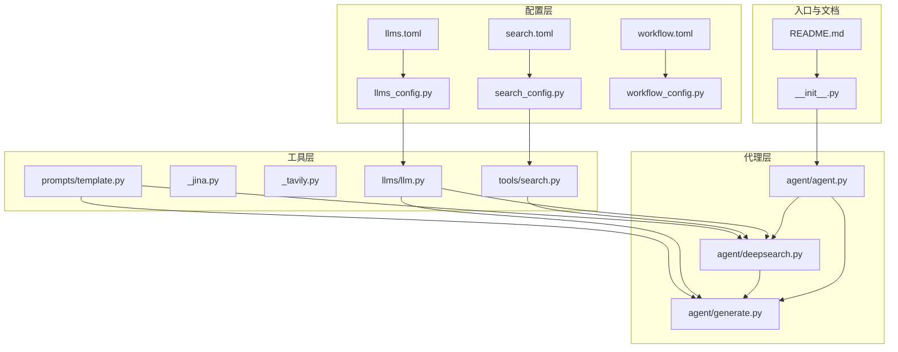
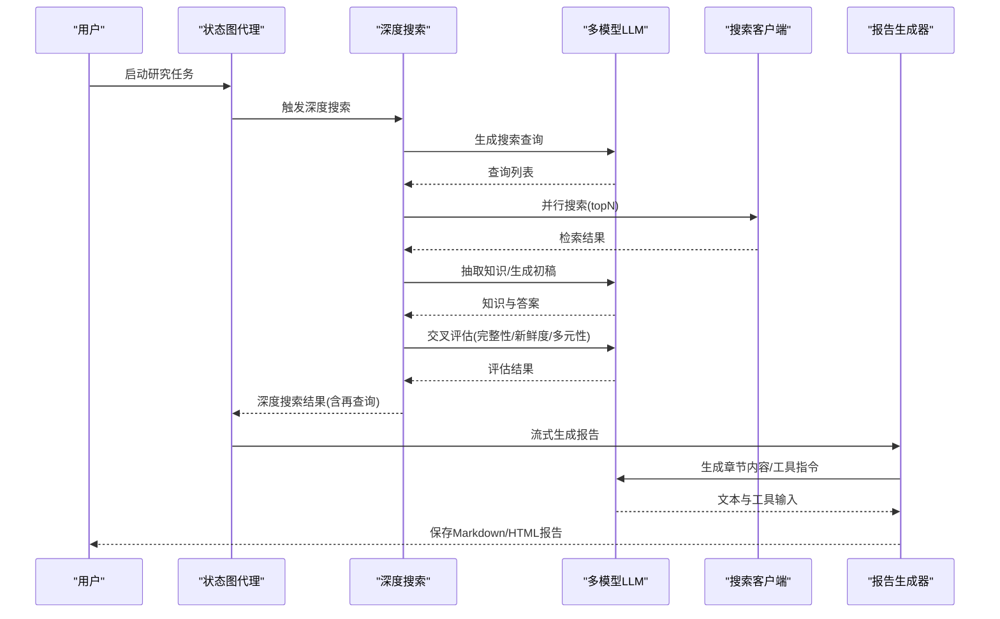
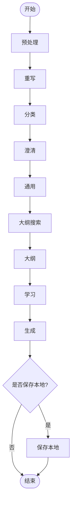
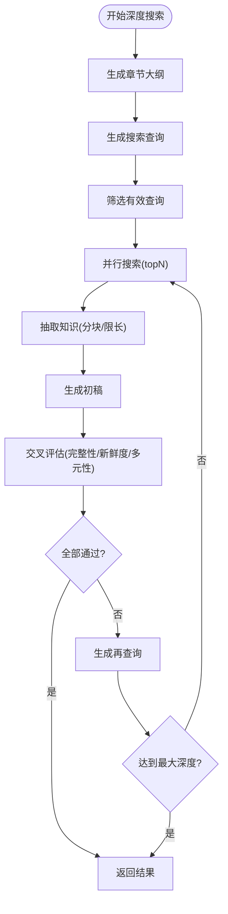
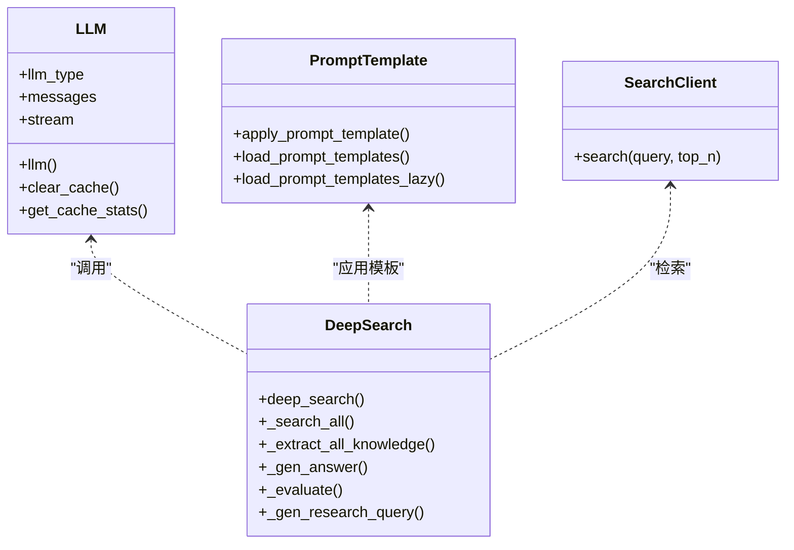
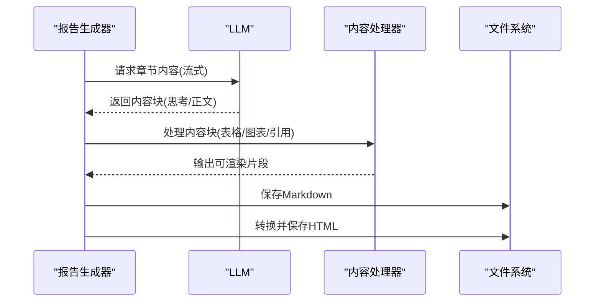
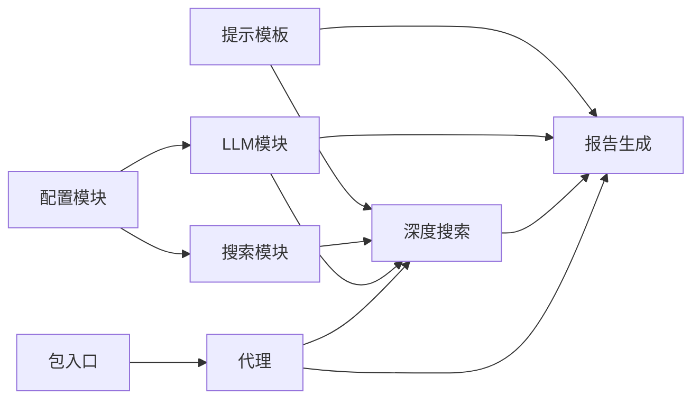

# 最佳实践指南

<cite>
**本文引用的文件**
- [README.md](file://README.md)
- [__init__.py](file://src/deepresearch/__init__.py)
- [agent.py](file://src/deepresearch/agent/agent.py)
- [deepsearch.py](file://src/deepresearch/agent/deepsearch.py)
- [generate.py](file://src/deepresearch/agent/generate.py)
- [llm.py](file://src/deepresearch/llms/llm.py)
- [search.py](file://src/deepresearch/tools/search.py)
- [template.py](file://src/deepresearch/prompts/template.py)
- [llms.toml](file://config/llms.toml)
- [search.toml](file://config/search.toml)
- [workflow.toml](file://config/workflow.toml)
- [llms_config.py](file://src/deepresearch/config/llms_config.py)
- [search_config.py](file://src/deepresearch/config/search_config.py)
- [workflow_config.py](file://src/deepresearch/config/workflow_config.py)
- [performance_analysis.py](file://tests/performance_analysis.py)
- [concurrency_test.py](file://tests/performance/concurrency_test.py)
- [stability_test.py](file://tests/performance/stability_test.py)
</cite>

## 目录
1. [简介](#简介)
2. [项目结构](#项目结构)
3. [核心组件](#核心组件)
4. [架构总览](#架构总览)
5. [详细组件分析](#详细组件分析)
6. [依赖关系分析](#依赖关系分析)
7. [性能考虑](#性能考虑)
8. [故障排除指南](#故障排除指南)
9. [结论](#结论)
10. [附录](#附录)

## 简介
本指南面向使用 DeepResearch 的工程师与研究者，聚焦于性能优化、成本控制与质量保证的最佳实践，并结合提示词设计、搜索策略选择与报告生成的质量控制给出可操作建议。文档同时提供实际项目案例与常见问题排查思路，帮助在不同场景下获得稳定、高效且高质量的研究产出。

## 项目结构
DeepResearch 采用模块化分层组织：配置层负责 LLM、搜索与工作流参数；工具层封装搜索客户端与模型调用；代理层定义研究流程的状态图与节点；提示模板层统一管理各类提示词；CLI 层提供命令行入口与交互。

图表来源
- [agent/agent.py:1-45](file://src/deepresearch/agent/agent.py#L1-L45)
- [agent/deepsearch.py:1-489](file://src/deepresearch/agent/deepsearch.py#L1-L489)
- [agent/generate.py:1-343](file://src/deepresearch/agent/generate.py#L1-L343)
- [llms/llm.py:1-308](file://src/deepresearch/llms/llm.py#L1-L308)
- [tools/search.py:1-46](file://src/deepresearch/tools/search.py#L1-L46)
- [prompts/template.py:1-166](file://src/deepresearch/prompts/template.py#L1-L166)
- [config/llms.toml:1-29](file://config/llms.toml#L1-L29)
- [config/search.toml:1-6](file://config/search.toml#L1-L6)
- [config/workflow.toml:1-3](file://config/workflow.toml#L1-L3)
- [config/llms_config.py:1-115](file://src/deepresearch/config/llms_config.py#L1-L115)
- [config/search_config.py:1-82](file://src/deepresearch/config/search_config.py#L1-L82)
- [config/workflow_config.py:1-28](file://src/deepresearch/config/workflow_config.py#L1-L28)
- [__init__.py:1-30](file://src/deepresearch/__init__.py#L1-L30)
- [README.md:1-69](file://README.md#L1-L69)

章节来源
- [README.md:1-69](file://README.md#L1-L69)
- [__init__.py:1-30](file://src/deepresearch/__init__.py#L1-L30)

## 核心组件
- 状态图代理：定义“预处理→重写→分类→澄清→通用→大纲搜索→大纲→学习→生成→保存”的流程，支持条件边与迭代。
- 深度搜索引擎：基于多轮检索、知识抽取、交叉评估与再查询，形成递归搜索树，提升完整性与新鲜度。
- 多模型协同：通过不同 llm_type（基础、澄清、规划、查询生成、评估、报告）分工协作，兼顾质量与成本。
- 提示模板系统：集中管理生成、学习、大纲、预处理等模板，支持系统消息与用户消息格式化。
- 搜索客户端：按配置动态选择 Jina 或 Tavily 引擎，统一返回结构化结果。
- 报告生成器：流式生成 Markdown 内容，支持表格与图表工具渲染，自动保存本地并可转 HTML。

章节来源
- [agent/agent.py:1-45](file://src/deepresearch/agent/agent.py#L1-L45)
- [agent/deepsearch.py:55-489](file://src/deepresearch/agent/deepsearch.py#L55-L489)
- [agent/generate.py:26-343](file://src/deepresearch/agent/generate.py#L26-L343)
- [llms/llm.py:146-308](file://src/deepresearch/llms/llm.py#L146-L308)
- [prompts/template.py:90-166](file://src/deepresearch/prompts/template.py#L90-L166)
- [tools/search.py:12-46](file://src/deepresearch/tools/search.py#L12-L46)

## 架构总览
DeepResearch 的运行时由“状态图编排 + 深度搜索 + 多模型提示 + 搜索工具 + 报告生成”构成，数据从输入主题进入预处理，经大纲与检索，到知识抽取与交叉评估，最终生成报告并落地。

图表来源
- [agent/agent.py:19-44](file://src/deepresearch/agent/agent.py#L19-L44)
- [agent/deepsearch.py:74-149](file://src/deepresearch/agent/deepsearch.py#L74-L149)
- [agent/generate.py:26-111](file://src/deepresearch/agent/generate.py#L26-L111)
- [llms/llm.py:146-256](file://src/deepresearch/llms/llm.py#L146-L256)
- [tools/search.py:25-36](file://src/deepresearch/tools/search.py#L25-L36)

## 详细组件分析

### 组件A：状态图与节点编排
- 节点职责清晰：预处理、重写、分类、澄清、通用、大纲搜索、大纲、学习、生成、保存。
- 条件边：生成完成后根据配置决定是否保存本地或结束。
- 可扩展性：新增节点只需在状态图中注册并连接。

图表来源
- [agent/agent.py:19-44](file://src/deepresearch/agent/agent.py#L19-L44)

章节来源
- [agent/agent.py:1-45](file://src/deepresearch/agent/agent.py#L1-L45)

### 组件B：深度搜索与再查询机制
- 概念与流程：基于章节大纲生成查询，执行并行搜索，抽取知识，生成初稿，交叉评估，未通过则生成再查询，递归加深。
- 关键参数：最大深度、每轮 topN、并发搜索上限。
- 安全与健壮性：异常捕获、空结果保护、URL 去重、内容长度限制与分块抽取。

图表来源
- [agent/deepsearch.py:74-149](file://src/deepresearch/agent/deepsearch.py#L74-L149)
- [agent/deepsearch.py:209-239](file://src/deepresearch/agent/deepsearch.py#L209-L239)
- [agent/deepsearch.py:241-316](file://src/deepresearch/agent/deepsearch.py#L241-L316)

章节来源
- [agent/deepsearch.py:55-489](file://src/deepresearch/agent/deepsearch.py#L55-L489)

### 组件C：多模型协同与提示模板
- 模型类型：basic、clarify、planner、query_generation、evaluate、report，分别用于不同阶段。
- 提示模板：集中加载与延迟初始化，支持系统消息与用户消息，变量注入失败会抛出明确错误。
- 缓存与流式：响应缓存与实例缓存，流式输出便于实时渲染与调试。

图表来源
- [llms/llm.py:146-256](file://src/deepresearch/llms/llm.py#L146-L256)
- [prompts/template.py:90-129](file://src/deepresearch/prompts/template.py#L90-L129)
- [tools/search.py:25-36](file://src/deepresearch/tools/search.py#L25-L36)
- [agent/deepsearch.py:162-418](file://src/deepresearch/agent/deepsearch.py#L162-L418)

章节来源
- [llms/llm.py:1-308](file://src/deepresearch/llms/llm.py#L1-L308)
- [prompts/template.py:1-166](file://src/deepresearch/prompts/template.py#L1-L166)
- [tools/search.py:1-46](file://src/deepresearch/tools/search.py#L1-L46)

### 组件D：报告生成与质量控制
- 流式生成：逐块输出，支持思考内容与正文分离，便于前端渲染与调试。
- 工具集成：表格与图表工具解析与渲染，图表通过 ECharts 渲染。
- 引用替换：章节内引用 ID 自动映射到真实参考编号，确保可追溯性。
- 保存策略：默认保存 Markdown 与 HTML，路径可配置。

图表来源
- [agent/generate.py:26-160](file://src/deepresearch/agent/generate.py#L26-L160)
- [agent/generate.py:169-295](file://src/deepresearch/agent/generate.py#L169-L295)

章节来源
- [agent/generate.py:1-343](file://src/deepresearch/agent/generate.py#L1-L343)

## 依赖关系分析
- 配置依赖：各配置模块负责 TOML 解析与校验，提供只读视图与脱敏接口。
- 运行时依赖：代理依赖深度搜索与生成器；深度搜索依赖 LLM 与搜索客户端；生成器依赖 LLM、提示模板与工具。
- 外部依赖：LangChain、LangGraph、DeepSeek 客户端、JSON Repair、Jina/Tavily 搜索服务。

图表来源
- [config/llms_config.py:46-85](file://src/deepresearch/config/llms_config.py#L46-L85)
- [config/search_config.py:56-81](file://src/deepresearch/config/search_config.py#L56-L81)
- [llms/llm.py:146-256](file://src/deepresearch/llms/llm.py#L146-L256)
- [tools/search.py:12-36](file://src/deepresearch/tools/search.py#L12-L36)
- [prompts/template.py:90-129](file://src/deepresearch/prompts/template.py#L90-L129)
- [agent/agent.py:19-44](file://src/deepresearch/agent/agent.py#L19-L44)

章节来源
- [__init__.py:1-30](file://src/deepresearch/__init__.py#L1-L30)
- [config/llms_config.py:1-115](file://src/deepresearch/config/llms_config.py#L1-L115)
- [config/search_config.py:1-82](file://src/deepresearch/config/search_config.py#L1-L82)
- [config/workflow_config.py:1-28](file://src/deepresearch/config/workflow_config.py#L1-L28)

## 性能考虑
- 并发搜索：按查询数量限制最大线程数，避免过度并发导致资源争用。
- 实例缓存：LLM 实例采用 LRU 缓存，限制最大缓存数量，降低重复初始化开销。
- 响应缓存：对相同消息的 LLM 响应进行缓存，命中率统计可用于性能监控。
- 分块抽取：对大段检索内容进行分块与长度限制，避免上下文溢出与超时。
- 流式输出：报告生成采用流式，减少等待时间，提升交互体验。
- 配置优化：
  - 搜索 topN：根据预算与召回要求调整，平衡质量与成本。
  - 最大深度：控制递归层数，避免无界增长。
  - LLM 超时与温度：合理设置以平衡稳定性与创造性。

章节来源
- [agent/deepsearch.py:209-239](file://src/deepresearch/agent/deepsearch.py#L209-L239)
- [llms/llm.py:21-66](file://src/deepresearch/llms/llm.py#L21-L66)
- [llms/llm.py:68-123](file://src/deepresearch/llms/llm.py#L68-L123)
- [agent/deepsearch.py:241-267](file://src/deepresearch/agent/deepsearch.py#L241-L267)
- [agent/generate.py:69-111](file://src/deepresearch/agent/generate.py#L69-L111)
- [config/workflow.toml:1-3](file://config/workflow.toml#L1-L3)
- [config/search.toml:1-6](file://config/search.toml#L1-L6)

## 故障排除指南
- 提示模板缺失变量：应用模板时若变量缺失会抛出明确错误，检查 state 字段与模板变量名。
- LLM 响应为空：检查消息列表是否为空、模型是否可用、网络与鉴权配置。
- 搜索失败：确认引擎配置与 API Key，检查超时设置与网络连通性。
- 缓存问题：可通过清理缓存函数重置响应缓存与实例缓存，观察性能变化。
- 报告保存失败：检查保存路径权限与磁盘空间，确认 HTML 转换链路是否报错。
- 并发与稳定性：参考性能测试用例，定位并发峰值下的异常与资源瓶颈。

章节来源
- [prompts/template.py:117-129](file://src/deepresearch/prompts/template.py#L117-L129)
- [llms/llm.py:163-184](file://src/deepresearch/llms/llm.py#L163-L184)
- [tools/search.py:17-23](file://src/deepresearch/tools/search.py#L17-L23)
- [llms/llm.py:263-266](file://src/deepresearch/llms/llm.py#L263-L266)
- [agent/generate.py:129-158](file://src/deepresearch/agent/generate.py#L129-L158)
- [concurrency_test.py:1-200](file://tests/performance/concurrency_test.py#L1-L200)
- [stability_test.py:1-200](file://tests/performance/stability_test.py#L1-L200)

## 结论
通过合理的提示词设计、搜索策略与报告生成质量控制，配合性能与成本优化手段，DeepResearch 能在多场景下稳定产出高质量研究报告。建议在实践中持续监控缓存命中率、搜索并发与 LLM 调用成本，并根据业务目标动态调整深度与召回策略。

## 附录

### A. 提示词设计最佳实践
- 明确角色与约束：在系统提示中限定模型角色与输出格式，减少无关信息。
- 结构化输出：使用 JSON/标记语法引导模型按结构输出，便于解析与复用。
- 上下文注入：将领域知识、时间戳、已生成内容注入提示，提升一致性与时效性。
- 错误恢复：为解析失败与空响应准备兜底逻辑，避免流程中断。

章节来源
- [prompts/template.py:90-129](file://src/deepresearch/prompts/template.py#L90-L129)
- [agent/deepsearch.py:162-182](file://src/deepresearch/agent/deepsearch.py#L162-L182)
- [agent/generate.py:72-87](file://src/deepresearch/agent/generate.py#L72-L87)

### B. 搜索策略选择与成本控制
- 引擎选择：根据数据源与隐私要求选择 Jina 或 Tavily，关注 API Key 与配额。
- topN 与深度：小预算优先降低 topN 与最大深度；高预算可适度提升以增强召回。
- 并发与去重：控制并发度，启用 URL 去重，避免重复抓取与重复计算。
- 缓存与重试：利用响应缓存减少重复请求；对失败查询进行指数退避重试。

章节来源
- [tools/search.py:12-36](file://src/deepresearch/tools/search.py#L12-L36)
- [config/search.toml:1-6](file://config/search.toml#L1-L6)
- [agent/deepsearch.py:209-239](file://src/deepresearch/agent/deepsearch.py#L209-L239)

### C. 报告生成的质量控制
- 引用一致性：章节内引用 ID 与参考编号映射，确保可追溯与可验证。
- 工具渲染：表格与图表工具需严格解析输入，失败时回退为空字符串，避免污染正文。
- 流式渲染：前端可逐步显示，便于用户感知进度与及时发现异常。
- 保存策略：默认保存 Markdown 与 HTML，必要时关闭 HTML 以降低成本。

章节来源
- [agent/generate.py:26-160](file://src/deepresearch/agent/generate.py#L26-L160)
- [agent/generate.py:169-295](file://src/deepresearch/agent/generate.py#L169-L295)

### D. 实际项目案例与应用经验
- 场景一：宏观政策分析
  - 建议：使用较小深度与适中 topN，强调新鲜度评估；在提示中加入时间戳与政策背景。
  - 成本：优先使用较小模型类型承担查询生成与评估，报告生成使用更高能力模型。
- 场景二：行业全景扫描
  - 建议：扩大 topN 与深度，启用多轮再查询；在大纲中明确维度与交叉验证。
  - 质量：增加多元性评估，确保覆盖不同观点与数据源。
- 场景三：竞品对比报告
  - 建议：在知识抽取阶段标注对比维度，生成阶段强化结构化输出与可视化。
  - 成本：控制并发与缓存命中率，避免重复检索。

章节来源
- [agent/deepsearch.py:351-418](file://src/deepresearch/agent/deepsearch.py#L351-L418)
- [agent/generate.py:26-111](file://src/deepresearch/agent/generate.py#L26-L111)

### E. 性能测试与稳定性参考
- 并发测试：模拟多任务并发，观察吞吐与延迟变化，定位资源瓶颈。
- 稳定性测试：长时间运行，记录异常与内存增长，验证缓存与实例回收机制。
- 性能分析：结合缓存命中率与 LLM 调用耗时，评估配置调整收益。

章节来源
- [concurrency_test.py:1-200](file://tests/performance/concurrency_test.py#L1-L200)
- [stability_test.py:1-200](file://tests/performance/stability_test.py#L1-L200)
- [performance_analysis.py:1-200](file://tests/performance_analysis.py#L1-L200)